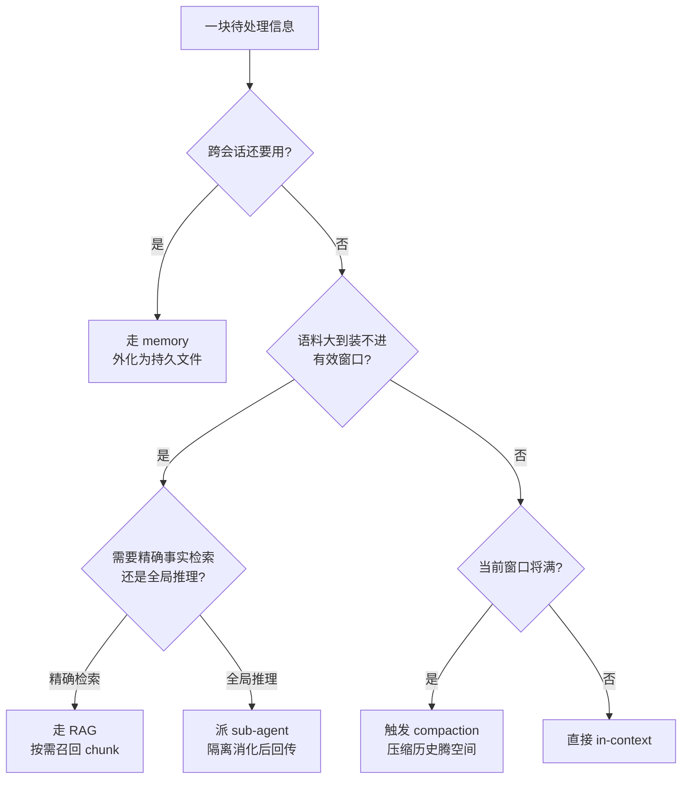

一条信息进入一个 agent 系统时，它面临五个去向：直接放进 context window（in-context）、走检索按需召回（RAG）、外化为持久记忆（memory）、丢给 sub-agent 先消化再回传压缩结果（sub-agent）、或在窗口将满时被压缩重写（compaction）。**本节点要解决的问题不是"哪条路最好"——这是个伪命题——而是给"这条信息该走哪条路"一棵可操作的决策树**：在时效、成本、可靠、容量、复杂度五个维度上把五条路径摆到同一张桌子上比，让 PM 在选型会上 30 秒内说清"为什么这块信息不走 RAG 而是塞 context"。框架名：信息流五向决策矩阵。

## §0 为什么是"信息流"框架，而不是"存储层级"框架

业界默认的框架是 MemGPT（[arXiv:2310.08560](https://arxiv.org/abs/2310.08560)，Packer et al., UC Berkeley, 2023）的**操作系统类比**：main context = RAM，external context = disk，信息在层级间搬运。这个框架很优雅，但对 PM 有一个致命误导——它把问题描述成"信息存在哪一层"，是一个**静态分层**问题。

真实的 agent 工程里，问题是**动态流向**问题：同一块信息在任务的不同阶段要走不同的路。一份 200 页的合同，任务开始时走 RAG（只召回相关条款），中途发现要逐条比对就整篇塞进 context，比对结论外化进 memory 供下一会话用，而中间产生的 50 轮探索过程则交给 sub-agent 隔离消化。**存储层级框架回答"它在哪"，信息流框架回答"它往哪去、什么时候改道"**——后者才是 PM 做架构决策时真正在拍的板。所以本节点用五向流动的视角组织，而不是 RAM/disk 两层。

这也是为什么 LangChain 把 context engineering 拆成 **Write / Select / Compress / Isolate** 四个动作（[langchain.com/blog/context-engineering-for-agents](https://www.langchain.com/blog/context-engineering-for-agents)，2025-07-02）——动作，不是层级。memory 是 Write，RAG 是 Select，compaction 是 Compress，sub-agent 是 Isolate，in-context 是这一切的默认基线。本矩阵正是把这四个动作 + 一个基线落成可比的决策表。

## §1 五条路径一句话各是什么

| 路径 | 动作（LangChain 映射） | 一句话 | 信息何时进入模型 |
|---|---|---|---|
| **in-context** | 基线 | 直接写进当次请求的 token 序列 | 调用前一次性放入 |
| **RAG** | Select | 索引外部语料，按 query 相似度召回片段 | 推理时按需召回 |
| **memory** | Write | 跨会话持久化的事实/偏好/状态文件 | 会话开始时注入或 agent 主动读取 |
| **sub-agent** | Isolate | 派生独立上下文窗口的子 agent，回传压缩结论 | 主 agent 只见最终摘要 |
| **compaction** | Compress | 窗口将满时摘要/遮蔽历史，腾出空间 | 触发阈值时改写历史 |

## §2 五维对照矩阵（核心交付物）

下表是本节点的命门。每格是"相对评级 + 一句话根据"，不是绝对值——绝对值依模型和场景浮动，相对位序才是决策依据。

| 维度 \ 路径 | in-context | RAG | memory | sub-agent | compaction |
|---|---|---|---|---|---|
| **时效**（信息能否反映最新状态） | 高（你放什么是什么） | 高（重建索引即更新） | 中（需主动写入/更新，有滞后） | 高（实时派生） | 低（压缩后旧信息可能丢失/失真） |
| **成本**（每次调用的 token/算力） | 高且随长度非线性增长 | 极低（只召回少量 chunk） | 低（按需读取小文件） | 中（多一次完整 agent 运行） | 中（多一次摘要推理） |
| **可靠**（信息被正确利用的概率） | 中（受 context rot/lost-in-middle 拖累） | 中（受召回质量+位置偏差影响） | 中（受写入质量+检索匹配影响） | 低-中（跨 agent 沟通是已知薄弱环节） | 低（摘要可能丢关键状态/停止信号） |
| **容量**（能承载的信息量上限） | 低（受窗口物理上限+有效窗口双重限制） | 高（语料库规模几乎无限） | 高（文件系统/DB 规模） | 高（每个子 agent 各有独立窗口） | —（不增容量，只回收空间） |
| **复杂度**（工程实现+运维负担） | 极低（拼字符串即可） | 高（需维护索引+embedding+评估管道） | 中（需写入/衰减/冲突/隐私四套策略） | 高（编排+协议+故障隔离） | 中（触发阈值+摘要 prompt 调优） |

**怎么读这张表**：没有一行全是"高"。in-context 时效满分但成本和容量是硬伤；RAG 成本和容量极优但可靠性受召回质量牵制；memory 容量高但时效有滞后；sub-agent 容量靠隔离换来但可靠性最弱；compaction 是唯一一条"不增容量、只回收空间"的路——它不是信息的去向，是窗口的清道夫。**这意味着五条路天然组合使用，不是单选**。

### 关键数字接地（支撑上表评级）

- **in-context 的可靠性塌方**：Chroma 2025 研究测试 18 个前沿模型（Claude Opus 4 / GPT-4.1 / Gemini 2.5 Pro / Qwen3-235B 等），**全部模型在所有输入长度增量上性能单调下降**，无一例外（[trychroma.com/research/context-rot](https://www.trychroma.com/research/context-rot)，Hong/Troynikov/Huber, 2025-07-14）。这就是 in-context 可靠性只给"中"的根据——不是窗口装不下，是装多了模型用不好。
- **有效窗口远小于标称窗口**：NoLiMa 基准（Adobe Research / ICML 2025）测出 GPT-4o 标称 128K 但**实际有效约 8K token**；Claude 3.5 Sonnet 在 64K 时准确率从 87.6% 跌至 29.8%（[github.com/adobe-research/NoLiMa](https://github.com/adobe-research/NoLiMa)）。这是 in-context 容量给"低"的根据——物理窗口大 ≠ 可用容量大。
- **RAG 的成本优势**：EMNLP 2024 industry track 论文（Li et al., [arXiv:2407.16833](https://arxiv.org/abs/2407.16833)）确证：资源充足时长上下文平均性能高于 RAG，但 RAG 成本显著更低；其 Self-Route 混合路由把 Gemini-1.5-Pro 计算成本降 65%、GPT-4o 降 39%，同时维持接近长上下文的性能。
- **memory 的收益**：Anthropic 的 Context Editing + Memory Tool（`memory_20250818`）组合使 agent 搜索性能提升 **39%**（[claude.com/blog/context-management](https://claude.com/blog/context-management)）。Mem0（[arXiv:2504.19413](https://arxiv.org/abs/2504.19413)）在 LOCOMO 上相比全量 context 把 token 成本降 90%、P95 延迟降 91%。
- **compaction 的两面**：Anthropic `compact_20260112`（2026-01 beta）在 100 轮网页搜索评估中 token 消耗减少 **84%**；但 JetBrains Research（2025-12，[blog.jetbrains.com/research/2025/12/efficient-context-management](https://blog.jetbrains.com/research/2025/12/efficient-context-management/)）发现 LLM Summarization 反而使 agent 运行时间增加约 15%（摘要遮盖了停止信号），而更朴素的 Observation Masking 让 Qwen3-Coder 480B 解决率反升 2.6%、成本降 52%。这就是 compaction 可靠性给"低"的根据。

## §3 决策树：这块信息该走哪条路

把五维矩阵收敛成一棵可在选型会上画的树。从一块待处理信息出发，按四个 yes/no 闸门分流：

四个闸门的优先级是有讲究的——**时间维度（跨会话）优先于空间维度（装不装得下）优先于运维维度（窗口满没满）**。先问"以后还用吗"，决定要不要外化；再问"装得下吗"，决定 RAG 还是 sub-agent；最后才是 compaction 这个兜底的清道夫。in-context 是默认值，是"前三个闸门都说不"之后的归宿，不是起点。

## §4 判断主轴：90% 的人在这五条路上会搞错的四个点

### 错位一：把"窗口大"当成"in-context 容量大"

- **症状**：模型升到 1M token 窗口后，PM 拍板"那就别做 RAG 了，全塞进去"。
- **为什么会错**：标称窗口 ≠ 有效窗口。NoLiMa 测出 GPT-4o 有效约 8K，An et al.（[arXiv:2410.18745](https://arxiv.org/abs/2410.18745)）发现开源模型有效上下文普遍 ≤ 标称的 50%，根因是预训练中远距离位置频率左倾 + RoPE 长程衰减，**是架构属性，不是能训没的能力差距**。
- **正确做法**：把"有效窗口"当预算，不是"标称窗口"。超过有效窗口的部分，可靠性已经在塌方，该走 RAG 或 sub-agent。
- **真实反例**：RULER 基准（Hsieh et al., NVIDIA, COLM 2024, [arXiv:2404.06654](https://arxiv.org/abs/2404.06654)）中 Mixtral 标称 32K 窗口，128K 时得分仅 44.5/100；17 个模型里只有 4 个在 32K 达标。

### 错位二：把信息塞 context 的位置当成无所谓

- **症状**：把最关键的指令/证据放在长 prompt 的中段。
- **为什么会错**：Lost in the Middle（Liu et al., Stanford/Meta, TACL 2024, [arXiv:2307.03172](https://arxiv.org/abs/2307.03172)）呈 U 形曲线——20 文档 QA 中答案在首/末位准确率约 75%，在第 10 位（中间）跌到约 55%。Chroma 2025 进一步发现窗口超 50% 满时 U 形会向"近期 token"倾斜（recency bias 增强）。
- **正确做法**：关键信息放头或尾；长 context 里把指令重复在结尾锚定。
- **真实反例**：Liu et al. 实测 GPT-3.5-Turbo 在 20–30 文档情境下准确率（56.1%）**低于其闭卷表现**——给更多上下文反而更差。

### 错位三：把 sub-agent 隔离当成纯收益

- **症状**：一看到任务复杂就拆多 agent，以为"各管一摊、互不污染"必然更好。
- **为什么会错**：隔离的代价是上下文割裂。Cognition 的《Don't Build Multi-Agents》（[cognition.ai/blog/dont-build-multi-agents](https://cognition.ai/blog/dont-build-multi-agents)）给出两条反原则：只接收子任务描述的子 agent 因缺整体决策历史而误解任务；并行子 agent 的隐式决策会冲突（举例：一个子 agent 建马里奥风格背景，另一个建视觉不兼容的角色，各自合理、组合失败）。这正是上表 sub-agent 可靠性给"低-中"的根据。
- **正确做法**：sub-agent 适合**只读探索型**任务（搜索、调研、读大语料）——回传的是事实摘要而非需协调的决策。需要协调一致决策时，Cognition 主张"共享完整 trace，而非单条消息"，甚至单线程 + 全上下文更优。
- **真实反例**：LoCoMo 基准争议——Mem0 报告 MemGPT 得 68.5%，Letta（MemGPT 原作者）反测用 GPT-4o mini + 文件系统操作得 74.0%，并质疑无法复现 Mem0 的方法论。孤立工具/孤立 agent 的 benchmark 不代表真实协作性能。

### 错位四：把 compaction 当成无损打包

- **症状**：依赖自动压缩保留所有关键状态，把必须记住的东西丢在对话历史里等压缩"带走"。
- **为什么会错**：摘要是有损的，且会丢"停止信号"——JetBrains 2025-12 实测 LLM Summarization 让运行时间增 15%。Anthropic 自己的 `compact_20260112` 已知缺陷包括"偶发模型在摘要阶段调用工具而非写摘要"。
- **正确做法**：必须跨压缩存活的内容，主动 Write 进 memory（`CLAUDE.md` / `NOTES.md` / memory tool），**假设它不会被压缩保留**。compaction 是清道夫，不是保险箱。
- **真实反例**：Anthropic Cookbook 明确建议——必须放入 `CLAUDE.md` 的内容不要依赖压缩保留。Claude Code 在约 80% 窗口（~160K token）触发自动压缩，保留架构决策/未解 bug、丢弃冗余工具输出，但这条选择本身就承认"有东西会被丢"。

## §5 产品 PM 视角补盲：矩阵之外的三个"看走眼"点

1. **成本是会计科目，不是技术参数**。RAG 把成本前置到索引建设（一次性 CAPEX + 运维 OPEX），in-context 把成本后置到每次调用（纯 OPEX，随调用量线性放大）。高频低频是分水岭：高频查询哪怕单次便宜一点点，累积起来 RAG 的索引投入也回得来；低频长尾查询则可能"维护索引比直接塞 context 还贵"。PM 算的是 TCO，不是单次 token 数。
2. **memory 是隐私和合规的雷区**。一旦把用户信息外化为持久 memory，就触发数据留存、被遗忘权、跨会话画像的合规问题。m206 的长期记忆四决策（记什么/衰减/冲突/隐私）里，隐私是唯一一个"工程上可省、合规上不可省"的——技术 PM 容易漏掉它。
3. **复杂度是组织能力的函数**。上表"复杂度"列对一个有平台团队的大厂和一个三人创业团队意义完全不同。RAG 的"高复杂度"在有向量库平台的组织里近乎零边际成本，在没有的组织里是一个季度的工程投入。选型不是选"最优路径"，是选"本组织能稳定运维的路径"。

## §6 对手框架回应

**反方一：Karpathy / 长上下文乐观派——"窗口够大就不需要这么多花活"**。Karpathy 把 context engineering 定义为"the delicate art and science of filling the context window with just the right information for the next step"（[x.com/karpathy](https://x.com/karpathy/status/1937902205765607626)，2025-06-25），重心在"填好窗口"。**接受**：在有效窗口内、单轮任务里，直接 in-context 确实最简单可靠，五条路里它复杂度最低不是偶然。**边界**：本矩阵赌的是 agent 时代的多轮、跨会话、大语料场景——这恰恰是有效窗口物理上装不下、context rot 必然发作的场景。Chroma 18 模型全军覆没的数据是这个赌注的底气。窗口再大也救不了 recency bias，所以五向分流不是花活，是被架构属性逼出来的。

**反方二：Cognition——"别建多 agent，单线程 + 全上下文更可靠"**。**接受**：当前模型跨 agent 沟通可靠性确实不足，sub-agent 在本矩阵里可靠性评级最低就是对这一点的承认；需要协调一致决策的任务，隔离弊大于利。**边界**：但本矩阵不主张"凡复杂即拆 agent"——决策树里 sub-agent 只在"大到装不下 + 全局推理"这个窄分支出现，且限定只读探索型任务。Cognition 反的是"滥用隔离"，本矩阵也反；分歧只在"隔离是否有合法适用域"——我赌它有，但域很窄。

**反方三（Rick 未读对手框架）：Hacker News 的"换皮重装"批评**——context engineering 不过是 RAG + memory management 的旧酒新瓶（[news.ycombinator.com/item?id=44464219](https://news.ycombinator.com/item?id=44464219)）。**接受**：单看每条路径，确实都是既有技术，本矩阵没发明任何新机制。**边界**：但本矩阵的价值不在"发明路径"，在"把五条既有路径放进同一个决策框架里可比"。Simon Willison 的辩护切中要害——术语替换的价值在于"从错误的联想中逃脱"，而非宣称发现新技术。把"信息流向"作为统一抽象，本身就是一种判断密度的提升：以前是五个孤立工具箱，现在是一棵决策树。

## §7 跨域呼应：波兰尼的"显隐知识"与四条外化路径

迈克尔·波兰尼（Michael Polanyi）的核心论断是"我们知道的比我们能说出来的多"（we know more than we can tell）——存在大量**默会知识（tacit knowledge）**无法被完整编码为显性符号。把这个框架压到信息流矩阵上，会改变一个关键判断：**五条路径里，除了 in-context，其余四条本质上都是"把默会知识强行显化"的尝试，而显化必然有损**。

memory 把会话里隐含的用户偏好显化成文件——但写下来的"用户喜欢简洁回答"丢掉了"在什么语境下喜欢简洁"的默会边界。compaction 把对话的隐含状态摘要成文字——但摘要丢的恰恰是没被说出口的"停止信号"（JetBrains 的 15% runtime 增长就是默会信号显化失败的代价）。RAG 把语料切成 chunk——但 chunk 边界切断了文档作者默会假设的上下文关联（这正是 m204 Late Chunking 和 Contextual Retrieval 要补救的）。

波兰尼的洞见给 PM 一条反直觉的决策原则：**外化（Write）不是免费的信息搬运，是一次有损的显化翻译**。所以决策树第一个闸门"跨会话还要用吗"答"是"之后，真正该问的下一个问题是"这块信息的默会成分有多重"——默会成分越重，外化的损失越大，越该考虑保留原始 trace（呼应 Cognition 的"share full traces"）而非压缩摘要。这是 Context Engineering 2.0（[arXiv:2510.26493](https://arxiv.org/abs/2510.26493)）"将高熵人类意图转化为低熵机器格式"这一"熵减"框架的认识论底色——熵减不是无损的。

> [!note] 赌注
> 本矩阵赌"信息流向是 agent 架构的第一性问题"。如果未来 2–3 年模型有效窗口真的逼近标称窗口、context rot 被架构性解决（如 STRING 等 RoPE 变体成熟），那么 in-context 会吞掉 RAG 和 compaction 的大半适用域，这张五维表会塌缩成两维（in-context vs memory）。我赌这不会在 2–3 年内发生——因为 RoPE 长程衰减是架构属性，不是训练问题。这个赌注可证伪：盯住 RULER/NoLiMa 上"有效窗口 / 标称窗口"这个比值，它若稳定突破 80%，本矩阵就该重写。

## §8 PM 决策启示

- **面试桌**：被问"你们为什么用 RAG 不直接长上下文"，别答"省钱"——答"我们算过有效窗口，标称 200K 但 NoLiMa 类任务下有效约几万，超出部分可靠性塌方，所以精确检索走 RAG、全局推理才上长上下文，用 Self-Route 路由"。一句话展示你懂五维权衡。
- **选型会**：把 §2 矩阵和 §3 决策树打印出来。每个待处理的信息流，当场走一遍四闸门。争论"要不要上 memory"时，先问"跨会话还用吗 + 默会成分多重"，而不是先问"技术上能不能做"。
- **复现台**：Rick 作为 Claude Code / CLAUDE.md 深度用户，对 compaction 错位四有一手体感——把必须存活的项目约定写进 `CLAUDE.md`（Write 进 memory），而不是指望 80% 窗口触发的自动压缩替你记住。这正是决策树"跨会话还用吗→是→走 memory"在日常工作流里的落地：`CLAUDE.md` 就是 in-context 之外那条 memory 路径的人肉实现。

## §9 与已有节点的关系

- 对照 [c09 - RAG 架构](/kb/基础知识库/c09-rag-架构/)：c09 讲透了 RAG 这**一条**路径的内部架构（chunking / 检索范式 / reranker / 评估）；本节点不复述这些，而是把 RAG 作为五条路径之**一**，补它与另四条路径的**横向取舍关系**——做的是"升维对照"，不是深化单条。
- 对照 [m206 - Agent 产品化：记忆机制与技术进展](/kb/工程化与落地架构/m206-agent-产品化-记忆机制与技术进展/)：m206 讲透了 memory 这条路径的实现（短期四策略 + 长期三库 + 四决策）；本节点把 memory 放进决策树，补它"何时该选 memory 而非另四条"的**选择条件**——做的是"对话补缺"。
- 对照 [m209 - 推理成本控制手册](/kb/工程化与落地架构/m209-推理成本控制手册/)：m209 讲成本的绝对量化；本节点把成本作为五维之一，补它与时效/可靠/容量/复杂度的**权衡关系**——成本不是越低越好，是和另四维联立求解。
- 对照 [m204 - RAG 生产环境：Chunking 与范式演进](/kb/工程化与落地架构/m204-rag-生产环境-chunking-与范式演进/)：m204 的 Contextual Retrieval / Late Chunking 是 RAG 路径内部的"减损"技术；本节点在 §7 借波兰尼框架把它解释为"对抗显化损失"的努力——做的是"认识论纠偏"。
- 与 [m201 - Prompt Engineering 实战体系](/kb/工程化与落地架构/m201-prompt-engineering-实战体系/) 的关系：m201 是 in-context 路径的精耕（怎么写好那次请求）；本节点承接 context engineering 对 prompt engineering 的"升格"——prompt engineering 是 in-context 这一条路径的工艺，context engineering 是五条路径的调度。这正是本专题的主命题落点。

## §10 关联节点

**核心（必读）**
- [c09 - RAG 架构](/kb/基础知识库/c09-rag-架构/) —— RAG 路径的内部全景
- [m206 - Agent 产品化：记忆机制与技术进展](/kb/工程化与落地架构/m206-agent-产品化-记忆机制与技术进展/) —— memory 路径的实现
- [m209 - 推理成本控制手册](/kb/工程化与落地架构/m209-推理成本控制手册/) —— 成本维度的绝对量化
- [RAG](/kb/基础知识库/rag/) · [KV Cache](/kb/基础知识库/kv-cache/) · [Prompt Caching](/kb/基础知识库/prompt-caching/) —— 路径背后的底层机制

**延伸（可选）**
- [m203 - RAG 生产环境：Embedding 与文档解析](/kb/工程化与落地架构/m203-rag-生产环境-embedding-与文档解析/) · [m204 - RAG 生产环境：Chunking 与范式演进](/kb/工程化与落地架构/m204-rag-生产环境-chunking-与范式演进/) · [m205 - RAG 生产环境：索引运维与评估体系](/kb/工程化与落地架构/m205-rag-生产环境-索引运维与评估体系/) —— RAG 路径的生产细节
- [m201 - Prompt Engineering 实战体系](/kb/工程化与落地架构/m201-prompt-engineering-实战体系/) —— in-context 路径的工艺
- [Attention](/kb/基础知识库/attention/) · [Embedding](/kb/基础知识库/embedding/) —— context rot / 召回的架构根因
- [Agent](/kb/基础知识库/agent/) · [幻觉](/kb/基础知识库/幻觉/) · [Claude Code](/kb/ai-公司与产品/claude-code/) —— 应用语境
- [Claude](/kb/ai-公司与产品/claude/) · [Gemini](/kb/ai-公司与产品/gemini/) —— 长上下文能力的具体载体
- 0114认识论 —— §7 波兰尼默会知识的入口
- [AI PM 知识图谱·总索引](/kb/ai-pm-知识图谱/ai-pm-知识图谱-总索引/) —— 全局导航

## 修订日志

- R0（2026-06-07）：首稿。建立五维对照矩阵（§2）+ 四闸门决策树（§3）+ 四错位判断主轴（§4）。事实接地：in-context 可靠性（Chroma 18 模型）、有效窗口（NoLiMa/RULER/An et al.）、RAG 成本（EMNLP 2024 Self-Route）、memory 收益（Anthropic +39% / Mem0 -90% token）、compaction 两面（Anthropic 84% vs JetBrains +15% runtime）均已标注可追溯来源。对手框架：Karpathy 长上下文乐观派 + Cognition 反多 agent + HN 换皮批评。跨域：波兰尼默会知识 → 外化有损翻译。赌注：有效/标称窗口比值 >80% 则本矩阵需重写。
