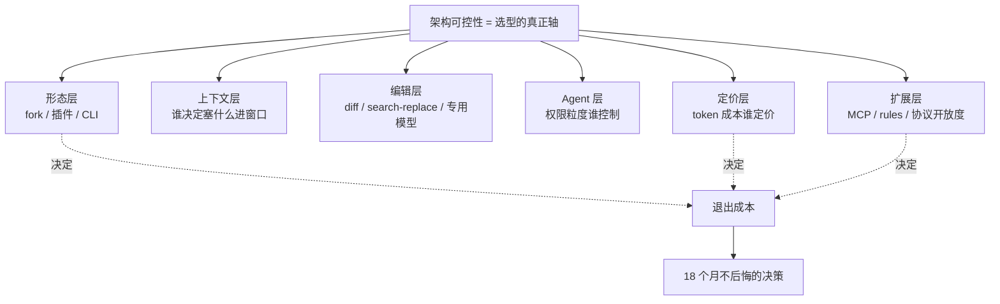

选 Cursor 还是 Claude Code、要不要给团队上 TRAE、Aider 这种纯 CLI 到底差在哪——这是 2026 年每个技术团队都绕不开的选型会议题。本节点的问题是：**当六款主流工具的 feature list 在一年内会互相抄齐时，PM 凭什么做出一个 18 个月不后悔的架构决策？** 框架是：别比 feature，比**架构可控性**——即每一层（形态/上下文/编辑/agent/定价/扩展）你能不能换、换的代价有多大、谁掌握着这个开关。

## §0 为什么是"架构可控性"而不是"功能对照表"

市面上 90% 的 AI 编程工具横评长这样：一张表,行是工具,列是"支持 Tab 补全吗/支持 Agent Mode 吗/支持 MCP 吗",格子里打勾。这种表**三个月后就作废**,因为 feature 是会收敛的——2024 年 Cursor 独有的 instant apply,2025 年 Copilot 的 Agent Mode GA(2026-03,VS Code + JetBrains 双端),2026 年 Windsurf 改名 Devin Desktop 后的 subagent,大家最终都会有。功能对照表回答的是"今天谁强",但 PM 真正要回答的是"**18 个月后我被锁死在谁手里**"。

所以本节点换一个轴:把每款工具拆成六个**可替换性各不相同的层**,逐层追问"这一层的控制权在谁手里"。

这个框架的反共识立场:**一款工具在 feature 上领先半年没有意义,在"哪几层把控制权交还给你"上的设计才决定长期 TCO**。下面六个维度,每一个都是一个"控制权归属"问题。与 [c10 - Agent 技术栈与工具调用](/kb/基础知识库/c10-agent-技术栈与工具调用/) 的截面快照不同——c10 讲的是"Agent 由什么组成",本节点讲的是"同一组组件,六家如何排列组合,以及排列方式如何决定你的退出成本"。

## §1 维度一·形态层:fork / 插件 / CLA 三流派的控制权代价

形态不是 UI 偏好,它**第一性地决定了你的退出成本和数据归属**。三个流派:

| 流派 | 代表 | 控制权含义 | 退出成本 |
|---|---|---|---|
| **VS Code fork(AI 原生 IDE)** | Cursor、Windsurf→Devin Desktop、TRAE | 编辑器本体被厂商接管,你的整个工作环境绑死在一个 fork 上 | 高:换工具=换 IDE,虽兼容 VS Code 插件但快捷键/配置/AI 工作流要重学 |
| **插件(挂在现有 IDE 上)** | GitHub Copilot(VS Code/JetBrains/Visual Studio/Neovim) | 编辑器仍是你的,AI 是可插拔层 | 低:卸载插件即退出,IDE 不变 |
| **CLI(终端原生)** | Claude Code、Aider | 完全脱离 IDE,以命令行 agent 形式存在,可挂进任意 IDE 的内置终端 | 中:工作流是脚本化的,但绑定的是你的 shell 习惯而非编辑器 |

判断:**fork 流派用"AI 原生体验"换取了你的退出自由**。Cursor 是 VS Code fork(来源:deployhq.com 功能指南,2026),Windsurf 同样基于 VS Code 内核,2026-06-02 正式改名 Devin Desktop(来源:devin.ai/blog 改名公告)。fork 的好处是 AI 能深度介入编辑器内核(如 Cursor 的 Tab 补全延迟 <100ms,来源:deployhq.com);坏处是你的肌肉记忆、团队配置、CI 集成都长在这个 fork 上,迁移摩擦巨大。

Claude Code 的形态最特殊:它是 **CLI 工具**,同时提供 VS Code/JetBrains sidebar 集成和桌面 App,但**不是 IDE fork 也不是插件**(来源:Anthropic 产品页,WebFetch 核实)。这意味着它的能力边界由"你的 shell + 文件系统 + git"定义,而不是由某个编辑器的扩展 API 定义——这正是 Rick 作为 Claude Code 深度用户的一手体感:它不抢你的编辑器,它抢的是你的**终端心智模型**。

## §2 维度二·上下文层:谁决定塞什么进窗口

这是最被低估、却最决定"长任务能不能跑"的一层。控制权问题是:**是工具自动决定上下文,还是你能干预?**

| 工具 | 上下文机制 | 你的控制权 |
|---|---|---|
| Cursor | `.cursor/rules/` 目录(取代旧 `.cursorrules` 单文件)+ 自动 codebase 索引 | 中:rules 可写,但索引黑盒 |
| Claude Code | 1M token 窗口 + 主动 grep/读文件 + `CLAUDE.md` 协议文件 | 高:agent 主动检索,你能看到它读了什么 |
| Windsurf/Devin Desktop | Cascade→Devin Local(Rust 重写,称 token 效率 +30%,来源:devin.ai/blog) + Spaces 跨 agent 共享上下文 | 中 |
| Copilot | NES(Next Edit Suggestions)+ Prompt Files(Markdown 任务脚本) | 中 |
| Aider | tree-sitter 解析 AST + PageRank 排序的 Repo Map(默认 1000 token 预算,可调,来源:aider.chat/docs/repomap.html) | 高:map 预算显式可调 |

判断主轴的关键证据来自 arXiv:2603.20432(2026-03):**coding agent 不依赖注意力机制处理长上下文,而是把长上下文问题转化为文件系统导航问题**(用 grep/terminal 主动检索),在 5 个 benchmark 上平均超 SOTA 17.3%;而且**给 agent 额外配 RAG 检索工具并不稳定提升性能,有时反而降低**。这条研究直接打脸"窗口越大越好"的直觉——Claude Code 的 1M 窗口若被动塞满,反而触发 Chroma Research(2025)记录的 "Context Rot":即使单个无关干扰段也会拉低准确率,且随上下文增长非线性加速(来源:trychroma.com/research/context-rot)。

**对 PM 的含义**:Aider 把 1000 token 的 Repo Map 预算交到你手里,Claude Code 让你看到 agent grep 了哪些文件——这两者的"上下文可观测性"高于 Cursor/Windsurf 的黑盒索引。当你的 codebase 跨 10–30 个文件、需要审计 AI"凭什么改这里"时,可观测的上下文层 = 可调试的失败模式。这一点 [c10 - Agent 技术栈与工具调用](/kb/基础知识库/c10-agent-技术栈与工具调用/) 没有展开,本节点补上:**上下文机制的控制权,本质是"失败时你能不能定位"的控制权**。

## §3 维度三·编辑层:diff / search-replace / 专用模型的鲁棒性阶梯

模型生成的代码怎么落到文件上?这一层的工程选择直接决定"AI 改完代码会不会静默改坏"。

| 编辑格式 | 准确率(Morph 自评数据,volatile) | 代表工具 | 控制权含义 |
|---|---|---|---|
| Unified diff(行号 patch) | 80–85% | 早期 SWE-agent | LLM 对行号极敏感,易失效 |
| Whole file rewrite | 60–75% | 部分新文件场景 | 大文件 token 爆炸 + "中段遗忘" |
| Search/Replace block(精确字符串匹配) | 84–96% | OpenHands、SWE-agent、Codex CLI、Aider、Claude Code | 比行号鲁棒、比整文件省 token |
| Semantic / Fast Apply(专用模型) | ~98% | Cursor、Morph、Relace | 速度+准确率双优,但需专用基础设施 |

(来源:morphllm.com/edit-formats;dev.to 五种编辑策略基准测试)

行业收敛点:**`str_replace`(精确字符串 search/replace)已成为多个主流 agent 的共同选择**——它是 Claude Code、Aider 这类 CLI 工具的默认。而 Cursor 走了另一条路:**Speculative Edits**(2024-08 公开),用 Llama-3-70B 定制微调,把"开发者原文件"作为 speculation,温度=0 确定性验证,速度约 1000 tok/s,比 vanilla Llama-3-70B 快 13×(来源:fireworks.ai/blog/cursor)。Morph Fast Apply(2025)更进一步:7B 专用模型 + 定制 CUDA kernel,10500 tok/s,已被 JetBrains/Vercel/Webflow 采用(来源:morphllm.com,自评数据,volatile)。

判断:**这一层是 Cursor 把"控制权"换成"速度"的典型**。专用 Fast Apply 模型的 98% 准确率全是厂商自评,缺乏第三方 benchmark;而 Claude Code/Aider 的 str_replace 是开放、可审计、可复现的——你能在 git diff 里逐字看到它改了什么。对追求**可控性而非纯速度**的团队,精确字符串编辑是更安全的赌注。这正是本节点判断主轴的落点:别被"100× 速度"宣传带走,问"我能不能审计这次编辑"。

## §4 维度四·Agent 层:权限粒度的控制权归属

这是 2026 年最激烈的设计分歧:**agent 自主到什么程度,谁来踩刹车?**

Claude Code 的权限模式系列(来源:code.claude.com/docs 权限模式文档,WebFetch 核实):`default`(仅读)→ `plan`(先出计划)→ `acceptEdits`(自动编辑)→ `auto`(几乎全自动,后台分类器兜底)→ `bypassPermissions`(无检查,仅限隔离容器)。Copilot CLI 对应:Autopilot 模式 + `/allow-all`(别名 `/yolo`,**授予后不可切回**),并提供 `--max-autopilot-continues` 作为熔断。

最值得 PM 关注的一手洞察来自 Anthropic Engineering Blog(2026-03-25,WebFetch 核实):**用户批准了 93% 的权限请求**——手动审查已沦为"橡皮图章"。auto 模式因此用模型分类器替代人工,两层防御(输入层 prompt injection probe + 输出层 transcript classifier),实测**假阳性率 0.4%、假阴性率 17%**(测试集:10000 真实动作 + 52 已知风险 + 1000 合成外泄)。官方明确标注 research preview,"reduces prompts but does not guarantee safety"。

| 工具 | Agent 能力 | 权限控制粒度 |
|---|---|---|
| Cursor | Cursor 3(2026-04-02)Background Agent + Subagent 并行 + Bugbot(Teams agentic review) | 中 |
| Claude Code | Subagent/Agent Teams + Agent View 仪表盘(2026-05-11) + 六档权限模式 | 高(最细) |
| Windsurf/Devin Desktop | Devin Local subagent + Agent Command Center(Kanban) + ACP 开源协议 | 中 |
| Copilot | Agent Mode GA + Fleet/Autopilot Mode(Build 2026) + `/yolo` | 中 |
| Aider | 自动跑 lint/test、失败自修复、自动 git commit | 低(无细粒度权限分级) |

判断:**Claude Code 的六档权限模式是"控制权"维度上最克制、也最值得选型会重视的设计**。它承认了一个反直觉事实——人工逐步审批在高频场景下必然失效(93% 橡皮图章),于是把"谁判断"从人移到分类器,但保留了 plan/default 让你在敏感工作中退回人工。反方会说"17% 漏报不可接受",这个边界要正视(见 §对手框架回应)。但相比 Copilot `/yolo` 的"授予后不可切回"的单向阀门,Claude Code 的分档是**可逆的信任校准**——这与 arXiv:2510.05307 的发现一致:在可逆性边界处请求确认,任务时间减少 13.54%,81% 参与者偏好该方式。这一层的设计哲学差异,[m207 - Agent 产品化：场景推演与失败模式](/kb/工程化与落地架构/m207-agent-产品化-场景推演与失败模式/) 讲的是"失败模式分类",本节点补的是"权限粒度如何前置防御这些失败"。

## §5 维度五·定价层:token 成本的控制权与可预测性

定价不只是钱,是**成本可预测性的控制权**。2026 年这一层正在经历集体动荡。⚠️ 以下价格均为 volatile,〔以 2026-06 为准·待核实〕:

| 工具 | 起步付费 | 计费模式 | 成本可预测性 |
|---|---|---|---|
| Cursor | $20/月(Pro);Pro+ $60、Ultra $200 | 2025-06 从"500 次请求"改为信用额度制($20≈225 次高级请求,实质缩水) | 低(credit 制不透明) |
| Claude Code | $20/月(Pro,含 Claude Code);Max 5x $100、Max 20x $200 | 订阅用量倍数 + API 按 token | 中(订阅封顶) |
| Windsurf/Devin Desktop | $20/月(Pro,原 $15,2026-03 调涨) | 2026-03-19 废除 credit 改每日/每周 Quota 自动刷新 | 中高(quota 自动刷新,不会月中耗尽) |
| Copilot | $10/月(Pro);Pro+ $39、Business $19/座 | 2026-06-01 全面切 AI Credits(1 Credit=$0.01);补全/NES 不消耗,chat/agent/review 消耗 | 低(用量计费,社区反弹) |
| Aider | 仅 API 费用(工具开源免费) | 纯 token 透传(轻度 $5–20/月,重度 $50–200+,来源:aiproductivity.ai) | 最高(你直接对 token 定价) |

(来源:各官方定价页 + ssdnodes.com + GitHub Changelog 2026-06-01,WebFetch 核实)

判断主轴:**2026 年的定价大趋势是从"包月固定"滑向"用量计费(credit/quota)",这是把成本波动的风险从厂商转移给用户**。Cursor 2025-06 的 credit 化、Copilot 2026-06-01 的 AI Credits 化都引发社区反弹(Visual Studio Magazine 标题直接写 "You Will Get Less, but Pay the Same Price")。而 Windsurf 反向操作——2026-03 废除 credit 改 quota 自动刷新,消除"月中额度耗尽"焦虑。

**Aider 是定价控制权的极端**:工具开源,你只付 API token,后端 LLM 任选(Claude/GPT/Gemini/本地 Ollama)。这意味着**你对成本有 100% 控制权,代价是没有任何托管层帮你优化**。对成本敏感、有工程能力自建的团队,Aider 的 TCO 透明度无人能及——这一点呼应 [m208 - AI 基础设施与中间件选型](/kb/工程化与落地架构/m208-ai-基础设施与中间件选型/) 的选型逻辑:开源透传 vs 托管溢价,本质是"控制权 vs 省心"的权衡。

## §6 维度六·扩展层:MCP / rules / 协议开放度

最后一层决定"你能不能把工具长进自己的工作流"。控制权问题:**扩展机制是开放协议还是私有围墙?**

| 工具 | 扩展机制 | 开放度 |
|---|---|---|
| Cursor | MCP 集成(Cursor 3)+ `.cursor/rules/` | 中 |
| Claude Code | MCP + Skill 系统 + CLAUDE.md + hooks | 高 |
| Windsurf/Devin Desktop | **ACP(Agent Client Protocol,开源)**——跨编辑器运行兼容 agent | 高(押注开放协议) |
| Copilot | MCP 服务器 + Prompt Files | 中 |
| Aider | 100+ LLM 后端 + 图片/网页上下文 + MIT 开源 | 最高 |

判断:**ACP 是 Windsurf/Devin Desktop 在扩展层下的一步大棋**——它学 LSP(Language Server Protocol)解耦编辑器与语言服务器的思路,试图解耦 IDE 与 AI agent(来源:blog.promptlayer.com,ACP="LSP for AI coding agents")。如果 ACP 成为事实标准,agent 就能跨工具迁移,这是对 fork 流派"锁死"逻辑的釜底抽薪。但协议标准化是个慢变量,押 ACP 是赌注不是事实。

Claude Code 的扩展靠 **MCP + Skill 系统**(见 [Skill 系统的本质](/kb/ai-协作方法论/skill-系统的本质/))+ hooks,这是 Rick 一手深度使用的部分:Skill 让默会的工作流程沉淀为可复用的、声明式的能力包,而非每次 prompt 重述——这正是 [Polanyi 默会知识与提示工程的认识论张力](/kb/基础知识库/polanyi-默会知识与提示工程的认识论张力/) 在工程层的落地:**Skill 把"只可意会"的操作流程显式化为可版本控制的资产**。

## §7 判断主轴:90% 的人在架构可控性上会搞错的四个点

> [!warning] 这是本节点的命门:别比 feature,比"哪几层把控制权交还给你"

**错点一:把"AI 原生体验"等同于"更好的工具"**
- **症状**:选型会上有人说"Cursor 体验最丝滑,就它了"。
- **为什么会错**:丝滑来自 fork——编辑器内核被接管,Tab 补全 <100ms。但 fork 同时把你的退出成本拉满,且 2025-06 credit 化证明厂商可单方面改变成本结构。
- **正确做法**:把"形态层退出成本"和"定价层可预测性"作为一票否决项先过一遍,再谈体验。
- **真实反例**:Copilot 2026-06-01 切 AI Credits 后新订阅暂停注册(GitHub Changelog,WebFetch 核实),社区焦虑"预算不可控"——丝滑挡不住计费模式剧变。

**错点二:迷信 SWE-bench 分数选工具**
- **症状**:"TRAE 2025-07 SWE-bench 第一,选它。"
- **为什么会错**:SWE-bench Verified 已被 OpenAI 于 2026-02-23 弃用(审计难题子集发现 59.4% 测试有实质问题);且分数测的是"模型+scaffold",换 scaffold 可波动 22+ 个百分点(arXiv:2506.17208)。Aider 在 SWE-bench 上甚至没有独立条目——它的能力取决于你选的后端 LLM。
- **正确做法**:分数看模型层,工具选型看上面六层的可控性。SWE-bench 口径辨析见规划中的评测专题(本专题不展开)。
- **真实反例**:Claude Opus 4.5 在 Verified 80.9% → Pro 45.9%,差 35 个百分点(来源:morphllm.com/codeant.ai,2026-04)——榜单分数不可直接当工具能力。

**错点三:把"自主程度高"当成 agent 能力强**
- **症状**:"Copilot 有 `/yolo`,自主性最强。"
- **为什么会错**:`/yolo` 授予后**不可切回**(GitHub Docs),是单向阀门;真正强的是**可逆的信任校准**(Claude Code 六档可进可退)。93% 橡皮图章证明"无脑批准"不是控制而是失控。
- **正确做法**:看"权限粒度"和"可逆性",不看"能不能全自动"。
- **真实反例**:2025-10 有 rm -rf 类事故被广泛讨论,无确认模式的实际风险已有案例;Claude Code auto 模式 17% 漏报率也提醒:全自动永远有兜底失效边界。

**错点四:用免费/低价决策,忽略 token 成本的真实归属**
- **症状**:"TRAE 国内版免费,Aider 工具免费,选免费的。"
- **为什么会错**:Aider 工具免费但 API token 重度使用 $50–200+/月(volatile);TRAE 国内版免费策略背后是数据反馈(且存在隐私遥测争议,见 §对手框架)。"免费"的成本藏在别处。
- **正确做法**:算 TCO 要把 token 成本、数据归属、合规成本一起算,不只看 license 价。
- **真实反例**:TRAE 遥测争议(Unit 221B/The Register 2025-07-28 报道:关闭遥测后仍每 30 秒发数据)——免费工具的"成本"可能是数据。

## §8 产品 PM 视角补盲:三个工程视角看不到的坑

1. **用户心理模型:CLI 门槛是真实的留存杀手**。Claude Code/Aider 的纯 CLI 形态对非 terminal 用户门槛极高。Stripe(1370 工程师部署)、Ramp、Wiz(5 万行 Python→Go 迁移 20 小时,来源:Anthropic 官网 WebFetch)都是大型工程组织——个人开发者/前端团队的体验缺乏公开对比数据。选 CLI 工具前先评估团队的终端熟练度。

2. **合规边界:国产 vs 海外的数据管辖是硬约束**。TRAE/通义灵码/Comate/CodeBuddy 的核心差异化不是 feature,是**数据本地化 + 等保/信通院认证 + 私有化部署**。Cursor/Copilot 受美国法律管辖。对国内中大型企业,这一条可能直接否决海外工具——与技术先进性无关。

3. **GTM:工具迁移有"团队配置惯性"**。fork 流派(Cursor/TRAE)迁移要重建团队的 rules、快捷键、CI 集成;插件流派(Copilot)迁移成本最低。选型不是选最强工具,是选"团队 18 个月内不会想换"的工具——切换成本本身是护城河,也是你的牢笼。

## §9 对手框架回应:接受 + 边界

**对手 A:Cursor/Anysphere——"速度和体验就是一切,可控性是工程师的过度焦虑"**
- 接受:Cursor 的 Speculative Edits(1000 tok/s)和 <100ms 补全确实创造了不可替代的心流体验;~100 万 DAU(2025 Q4,来源:getpanto.ai)、企业收入占比 60%(2026 Q1)证明市场用脚投票。
- 边界:但 Cursor ARR 数字本身存疑——$3B(2026-04)出自 Sacra 估算非官方,TechCrunch $2B(2026-03)来源是"知情人士"。且 2025-06 credit 化已证明:当你把控制权交出去,厂商单方面改成本结构时你毫无议价权。**我赌的是:18 个月维度上,可控性的复利高于半年体验领先。**

**对手 B:Cognition/Devin——"SWE-1.6 比 Sonnet 4.5 快 13×,模型自研才是终局"**
- 接受:自研模型 + Rust 重写的 Devin Local(token 效率 +30%)确实是垂直整合的强路径;ACP 开源也展现了格局。
- 边界:"快 13×"是 Cognition 官方声明,**未经独立第三方 benchmark 复现**;速度 vs 质量的权衡无公开数据。自研模型的风险是:当 frontier 模型(Claude/GPT)迭代,自研追赶成本可能反噬。**这是个赌注,不是确证事实。**

**对手 C:字节 TRAE——"国产免费 + 中文优化 + 合规,海外工具在中国没戏"**(Rick 关注的求职方向,需一手洞察)
- 接受:TRAE(The Real AI Engineer)2025-01 海外版、2025-03 国内版,作为首个国产 AI 原生 IDE,600 万+注册/160 万+月活/近 1000 亿行年代码生成(TRAE 2025 年度报告,2025-12,字节单方口径)确实证明了国产路径的规模化可行;字节内部 80% 工程师使用;Builder/SOLO 全链路自动化是真创新。
- 边界:这些数字**全是字节自报,无第三方 DAU 审计**;且 TRAE 有真实的隐私遥测争议(Unit 221B/Lance James 2025-07 研究:关闭遥测后仍每 30 秒发数据、7 分钟约 500 次请求传 26MB;字节回应称"仅控制 VS Code 层遥测,第三方扩展不受控")。原研究作者在 Trae 官方社区发帖后被禁言 7 天,加剧疑虑。一手洞察:**TRAE 的 SWE-bench 第一(2025-07)和它的工具可控性是两件事**——榜单领先不等于你对它的数据流有控制权;对求职而言,理解"TRAE 团队在 Harness Engineering 上的投入"(其团队成员以"咸鱼"为 ID 发表《万字干货:理解 Harness Engineering》2026-04-14)比记住用户数更有价值,见 [字节 TRAE 团队人物图谱](/kb/ai-公司与产品/字节-trae-团队人物图谱/) 与 [S03 Harness Engineering 全景](/kb/专题-安全对齐与失败/s03-harness-engineering-全景/)。

**对手 D:Aider 社区——"开源 + 你自己控制 token,商业工具都是中间商赚差价"**
- 接受:Aider(33000+ GitHub Stars,来源:aiagentslist.com)的 MIT 开源 + 任意 LLM 后端 + 透明 token 成本,确实是控制权的最高形态;str_replace + 自动 lint/test 修复 + 自动 commit 是扎实工程。
- 边界:开源的代价是**没有托管层帮你做 prompt caching、上下文优化、安全分类器**——Claude Code 的 auto 模式分类器(0.4% 假阳性)这类基础设施,Aider 用户要自己搭。控制权和省心是 trade-off,不是免费午餐。

## §10 跨域呼应:Lakatos 的"研究纲领"与工具选型的硬核保护带

Rick 熟悉 Kuhn 的 范式,但这里调度一个对手框架——**Lakatos 的"科学研究纲领"(Research Programme)**。Lakatos 区分了一个理论的"硬核(hard core)"和"保护带(protective belt)":硬核是不可放弃的核心承诺,保护带是可以被证伪、可以替换的辅助假设。

把这个框架套到工具选型:**一款编程工具的"硬核"是它的形态层和定价层(换=伤筋动骨),"保护带"是它的 feature(补全/agent mode/MCP,可随时替换)**。90% 的横评盯着保护带打分(谁 feature 多),但工具的生死取决于硬核——Cursor 的硬核是 fork + credit 定价,Aider 的硬核是开源 + token 透传,这些是它们"退化 vs 进步"的判据。

Lakatos 的洞察:一个研究纲领是"进步的"还是"退化的",看它能否预测新事实而非临时打补丁。**套到工具:Copilot 2026-06-01 的 AI Credits 化是"退化性问题转移"(把成本风险打补丁式甩给用户),而 Windsurf 废除 credit 改 quota 是"进步性调整"(主动消除用户痛点)**。PM 选型时,与其比当下 feature,不如判断每家的"研究纲领"是进步还是退化——这是 Kuhn 范式论给不出的、更细颗粒度的判据。

## §11 PM 决策启示:面试 / 选型 / 复现三类落地

- **面试怎么用**:被问"你怎么看 Cursor vs Claude Code",别背 feature。答:"我比的是六层架构可控性。Cursor 在形态层(fork)和编辑层(Speculative Edits)用控制权换体验,Claude Code 在权限层(六档可逆)和上下文层(grep 可观测)保留控制权——选型取决于团队是要丝滑还是要可审计。"30 秒分出层次。
- **选型怎么用**:把这张六维矩阵打印出来,每个工具逐层标"控制权在谁手里 + 退出成本"。先过形态层和定价层(一票否决项),再比 agent 层和扩展层。功能对照表留到最后,因为它三个月就过期。
- **复现怎么用**:想理解一款工具的真实能力,别看 demo,自己跑一次跨 5 文件的重构任务,观察三件事:(1)上下文层——它读了哪些文件(可观测性);(2)编辑层——git diff 里它怎么落代码(可审计性);(3)权限层——它在什么动作前停下来问你(可控性)。这三个观察点比任何 benchmark 都准。

## §12 与已有节点的关系

- **对照 [c10 - Agent 技术栈与工具调用](/kb/基础知识库/c10-agent-技术栈与工具调用/)**(深化+纠偏):c10 是 G3 截面快照,讲"Agent 由哪些组件组成"。本节点不复述组件,而是**深化**到"同一组组件,六家工具如何排列,以及排列方式如何决定退出成本",并**纠偏**了 c10 隐含的"组件越全越好"——本节点主张"控制权归属比组件数量重要"。
- **对照 [m207 - Agent 产品化：场景推演与失败模式](/kb/工程化与落地架构/m207-agent-产品化-场景推演与失败模式/)**(对话):m207 讲失败模式分类,本节点补"权限粒度如何前置防御这些失败",两者互为表里。
- **对照 [m208 - AI 基础设施与中间件选型](/kb/工程化与落地架构/m208-ai-基础设施与中间件选型/)**(深化):m208 的"开源透传 vs 托管溢价"逻辑,在本节点的定价层(Aider vs Cursor)得到具体落地。
- **跨专题对照**:与 0411 Agent 专题的 [E01 Coding Agent·Claude Code & Cursor](/kb/专题-安全对齐与失败/e01-coding-agent-claude-code-cursor/) 是同源异轴——E01 讲两款工具的设计哲学,本节点扩展到六款的横向矩阵;agent 层的权限设计与 [S03 Harness Engineering 全景](/kb/专题-安全对齐与失败/s03-harness-engineering-全景/) 的可控性论证呼应。SWE-bench 选型陷阱见 §7 错点二(评测细节归规划中的评测专题)。

## §13 关联节点

**核心(必读)**
- [c10 - Agent 技术栈与工具调用](/kb/基础知识库/c10-agent-技术栈与工具调用/) —— 本节点的组件基础(截面快照)
- [m207 - Agent 产品化：场景推演与失败模式](/kb/工程化与落地架构/m207-agent-产品化-场景推演与失败模式/) —— 权限层防御对应的失败模式分类
- [m208 - AI 基础设施与中间件选型](/kb/工程化与落地架构/m208-ai-基础设施与中间件选型/) —— 定价层的选型逻辑源
- [S03 Harness Engineering 全景](/kb/专题-安全对齐与失败/s03-harness-engineering-全景/) —— agent 层可控性的体系级论证
- [E01 Coding Agent·Claude Code & Cursor](/kb/专题-安全对齐与失败/e01-coding-agent-claude-code-cursor/) —— 同源异轴的设计哲学对比(0411 专题)
- [Claude Code](/kb/ai-公司与产品/claude-code/) —— 本节点 CLI 流派的产品卡
- [Skill 系统的本质](/kb/ai-协作方法论/skill-系统的本质/) —— 扩展层 Skill 机制
- [字节 TRAE 团队人物图谱](/kb/ai-公司与产品/字节-trae-团队人物图谱/) —— TRAE 流派的团队背景

**延伸(可选)**
- [Polanyi 默会知识与提示工程的认识论张力](/kb/基础知识库/polanyi-默会知识与提示工程的认识论张力/) —— Skill 把默会工作流显式化
- [Harness 词义辨析](/kb/专题-安全对齐与失败/harness-词义辨析/) —— harness/scaffold 词义基础
- [Function Calling](/kb/基础知识库/function-calling/) —— agent 工具调用底层机制
- [RAG](/kb/基础知识库/rag/) —— 上下文层检索范式对照
- [Anthropic](/kb/ai-公司与产品/anthropic/) / [Claude](/kb/ai-公司与产品/claude/) —— Claude Code 厂商背景
- [Agent](/kb/基础知识库/agent/) —— 原子概念
- [m209 - 推理成本控制手册](/kb/工程化与落地架构/m209-推理成本控制手册/) —— 定价层 token 成本的纵深
- [AI PM 知识图谱·总索引](/kb/ai-pm-知识图谱/ai-pm-知识图谱-总索引/) —— 总入口

## 修订日志
- R1(2026-06-07):首稿。建立"架构可控性"判断主轴,六维矩阵(形态/上下文/编辑/agent/定价/扩展),四件套判断主轴四点,Lakatos 研究纲领跨域呼应,四个对手框架(含 TRAE 一手洞察)。价格/用户量/分数全部标 volatile + 来源 + 2026-06 口径。待后续 grounding pass 复核 ACP 协议进展、Devin Local token 效率数字、TRAE 月活口径。
