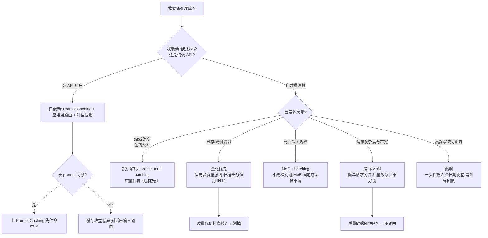

# S02 降本手段流派对照矩阵

> 本节点要解决的问题是：当工程同学甩给你一张"我们可以上量化/路由/缓存/蒸馏/MoE/batching/投机解码"的降本清单时，PM 怎么判断**这七种手段各降的是哪笔账、代价是什么质量损失、复杂度多高、什么约束下该选哪个**——而不是照单全收或拍脑袋砍。本节的框架是一张**"降本幅度 × 质量代价 × 实现复杂度 × 适用场景"四维对照矩阵 + 一棵"约束→选哪种"决策树**。核心立场只有一句：**降本手段没有免费午餐，每一种都是把某个维度的成本挪到另一个维度——你要做的不是找"最强降本术",是找"在你这个约束下代价最小的那一种"。**

---

## §0 为什么是"流派对照矩阵"而不是"降本手段清单"

读者脑子里的默认框架是 [m209 - 推理成本控制手册](/kb/工程化与落地架构/m209-推理成本控制手册/) §2.6 那种**清单式**："这里有 N 个降本手段,逐个介绍实现方法。"清单的问题是它把七种手段**平铺**,暗示它们可以叠加、可以都上、谁降得多就用谁。这是错的——清单回答"怎么做",不回答"在我的约束下该选哪个、不该选哪个"。

为什么必须升级成**对照矩阵 + 决策树**?因为这七种手段**作用在成本结构的不同层、彼此的代价不可通约**(成本分层见 [S01 AI 产品成本结构分层剖面](/kb/专题-工程与成本/s01-ai-产品成本结构分层剖面/))。量化降的是"单次前向的显存/算力"(模型权重层),缓存降的是"重复计算"(请求层),路由降的是"该不该用贵模型"(调度层),batching 降的是"GPU 闲置"(吞吐层),蒸馏/MoE 降的是"模型本身的固定成本"(架构层),投机解码降的是"解码延迟"(生成层)。把作用在不同层、代价维度不同的东西排成清单,等于让 PM 在"苹果 vs 螺丝刀"之间选——矩阵的价值就是把"代价维度"显式化,让你看清**每个手段在偷换哪个维度**。

更尖锐的是:清单暗示"全都上",但**手段之间有冲突和边际递减**。量化后再蒸馏,质量损失会非线性叠加;路由把请求分给小模型后,小模型的缓存命中率反而下降;batching 追求高吞吐会拉高单请求延迟,和投机解码"降延迟"的目标打架。所以正确的提问不是"上几个",是"**在我的延迟约束/质量底线/团队规模下,哪一个手段的代价我承受得起**"。这正是矩阵 + 决策树要回答的。

> [!note] 本节与 m209/c05/c06/c07 的分工
> m209 给手段的**实现方法**(怎么配缓存、怎么搭 router),c05 给 KV Cache 与投机解码的**物理公式**,c07 给量化的**精度损失数据**,c06 给 Dense/MoE/SSM 的**架构取舍**。本节**不复述这些事实基础**,只做它们都没做的一件事:**把它们放进同一张可比较的矩阵、给出"约束→选型"的决策路径**。你要查"投机解码为什么能 2-3×"去 [c05 - 算力物理定律与 KV Cache](/kb/基础知识库/c05-算力物理定律与-kv-cache/);你要决定"我这个场景该不该上投机解码",留在本节。

---

## §1 七种流派的作用层定位(先分类,再对照)

排矩阵前先回答"它们在偷换哪个维度的成本",否则矩阵会变成无意义的并列。

| 流派 | 作用层 | 它把成本从哪挪到哪 | 一句话本质 |
|---|---|---|---|
| **量化 Quantization** | 模型权重/算力层 | 把"精度"换成"显存+算力下降" | 用更少比特存权重,牺牲精度换显存与吞吐 |
| **蒸馏 Distillation** | 模型架构层(一次性) | 把"训练成本"换成"长期推理成本下降" | 用大模型教小模型,前置一次性训练换长期便宜 |
| **MoE** | 模型架构层 | 把"变动成本(算力)"换成"固定成本(显存常驻)" | 稀疏激活降单次算力,但全部专家须常驻显存 |
| **缓存 Caching** | 请求/计算复用层 | 把"重复计算"换成"存储+命中率赌注" | 复用前缀/语义相同的计算,赌命中率 |
| **路由 Routing/MoM** | 调度层 | 把"统一用贵模型"换成"按难度分流" | 简单请求给小模型,难的升级,赌分流判断准 |
| **Batching** | 吞吐/调度层 | 把"GPU 闲置"换成"单请求延迟上升" | 攒批一起算,提 GPU 利用率,牺牲尾延迟 |
| **投机解码 Speculative Decoding** | 解码/生成层 | 把"逐 token 串行"换成"草稿+验证的算力冗余" | 小模型猜、大模型批量验,降延迟不降质量 |

看清这张表,你就明白为什么不能"全都上":**量化和 MoE 都动模型层、蒸馏是一次性的、缓存和路由都赌"命中/判断准"、batching 和投机解码在延迟维度方向相反**。它们不是七个并列开关,是七种**不同维度的成本搬运**。

---

## §2 核心对照矩阵:降本幅度 × 质量代价 × 复杂度 × 适用场景

这是本节的承重表。**所有"降本幅度/质量代价"都是量级而非精确值**——同一手段在不同模型/任务/上下文长度下漂移巨大(这是本节最大的 failure scenario,见 §5),照搬具体百分比必踩坑。数字均标注来源与口径。

| 流派 | 降本幅度(量级) | 质量代价 | 实现复杂度 | 最适用场景 | 最不适用场景 |
|---|---|---|---|---|---|
| **量化** | 显存/部署成本↓ 50-75%(FP16→INT4,约 1/4 比特)〔来源:c07 量化原理〕 | INT8 损失 <1%、INT4 AWQ 约 2-5%〔来源:[c07 - 量化 Quantization 与端侧部署](/kb/基础知识库/c07-量化-quantization-与端侧部署/)〕,长程/精确任务非线性放大 | 中(用现成 GPTQ/AWQ 工具),自训练量化高 | 端侧部署、显存受限、质量容忍度中等 | 长程推理、数学/代码精确任务、医疗法律 |
| **蒸馏** | 推理成本↓ 一个数量级(小模型 vs 教师) | 因任务而异,通用能力损失大、垂直任务可逼近教师 | **高**(需训练 pipeline + 数据 + 评估),一次性重投入 | 高频、窄域、可接受能力收窄的场景 | 任务多变、需通用能力、无训练团队 |
| **MoE** | 单次推理算力↓(激活参数远小于总参) | ≈无(同等总参下质量不降,甚至更好) | 高(部署/路由/负载均衡复杂),小规模反而更贵 | 大规模高并发服务端 | **小规模部署**(显存固定成本摊不薄) |
| **缓存(Prompt Caching)** | 命中部分 input token 价↓(各家折扣不同,详见 §3) | ≈无(返回的是真实计算结果) | 低-中(API 级低,语义缓存中) | 长 system prompt 高频复用、知识库问答 | 低命中率、短 TTL、每次 prompt 都不同 |
| **路由/MoM** | 平均成本↓(取决于分流比),m209 实测平均成本约为全用强模型的 37%〔来源:[m209 - 推理成本控制手册](/kb/工程化与落地架构/m209-推理成本控制手册/)特定配比〕 | 取决于路由判断准确率,误判→质量崩或成本不降 | 中-高(需难度分类器 + fallback + 监控) | 请求复杂度分布宽(有大量简单请求) | 复杂度高度同质、质量敏感刚性区 |
| **Batching** | 吞吐↑ 数倍→单 token 成本↓(摊薄 GPU 闲置) | ≈无(质量不变),代价是**尾延迟上升** | 低(框架自带,如 vLLM continuous batching) | 离线/异步任务、可容忍延迟的批处理 | 强实时交互(对话首 token 延迟敏感) | 
| **投机解码** | 延迟↓→吞吐↑ 约 2-3×〔来源:[c05 - 算力物理定律与 KV Cache](/kb/基础知识库/c05-算力物理定律与-kv-cache/)〕 | **理论无损**(大模型 token 级验证,输出分布与逐 token 自回归等价,验证仅接受匹配 token;实践受硬件数值精度影响有微小偏差,来源:vLLM 文档/Google Research,2026-06 核实) | 高(需草稿模型 + 验证逻辑 + 接受率调优) | 延迟敏感的在线推理、自建推理栈 | 草稿模型接受率低的任务、纯 API 用户(用不上) |

**怎么读这张表(三条铁律)**:
1. **质量代价≈无 的手段优先无脑上**:batching、投机解码、(高命中率下的)缓存、MoE——它们几乎是"免费"的(代价是延迟或工程复杂度,不是质量)。**这四个里凡是适用的,先用满**。
2. **量化、路由、蒸馏是"赌质量"的手段**:它们直接拿质量换成本,必须先有质量底线和评估(接 [0412 评测专题](/kb/专题-评测与度量/_评测系统化专题-总览/)的"分数值不值这个价"),才能上。
3. **复杂度列决定"现在能不能上"**:蒸馏/投机解码/MoE 复杂度高,**没有自建推理团队就别碰**,纯 API 用户能用的只有缓存(API 级)和路由。

---

## §3 缓存:为什么它是最被高估也最被低估的手段

缓存值得单列,因为它是 PM 最常听到"上 Prompt Caching 就能降本"、却最容易踩坑的手段。关键是区分**两种缓存**:

- **Prefix/Prompt Caching(前缀缓存)**:复用相同前缀(如长 system prompt、固定 few-shot)的 KV Cache,命中部分按折扣价计费。以 Anthropic 为例〔以 2026-06 定价〕:**缓存读取 0.1× 基础 input 价(即命中省约 90%),但缓存写入要付溢价——5 分钟 TTL 写入 1.25× / 1 小时 TTL 写入 2.0× 基础 input 价**(来源:Claude API Docs · Prompt caching/Pricing,2026-06 核实)。**关键算术:5 分钟缓存要至少命中 2 次才回本、1 小时缓存约需 12 次命中才回本**——折扣大但有写入门槛。各厂商机制不同,需以官方定价为准。m209 在长 system prompt 高频场景实测可省约 $1,620/百万请求〔来源:m209 特定场景实测〕——**但这是该场景的实测值,不是普适降幅**。
- **语义缓存(Semantic Caching)**:对语义相近的 query 返回缓存答案(靠 [Embedding](/kb/基础知识库/embedding/) 相似度匹配)。它降的是"重复问题"的整次推理,但有**幻觉风险**——把"语义相近但答案应不同"的 query 误判命中,会返回错答案(接 [幻觉](/kb/基础知识库/幻觉/))。

> [!warning] 缓存的隐性反例(confirmation-bias 砍除)
> "上 Prompt Caching 稳赚"是典型的乐观偏见。真相:**写入缓存通常有溢价、缓存有 TTL(短则几分钟)**。在低命中率/短 TTL 场景,你为写入付了溢价、却没等到足够多的命中来摊回——**收益归零甚至倒亏**。缓存是个赌命中率的手段:命中率 × 折扣 > 写入溢价 才划算。PM 必须先估命中率,而不是听"上缓存就降本"。

---

## §4 判断主轴:90% 的人在降本选型上会搞错的四个点

这是本节的命门。每点带 **症状 → 为什么会错 → 正确做法 → 真实反例**。

### 错位一:把"降本幅度"当成唯一排序维度,忽略质量代价
- **症状**:工程汇报"量化能降 70%、蒸馏能降一个数量级",PM 立刻拍板上降幅最大的。
- **为什么会错**:降本幅度和质量代价是**两个正交维度**,只看降幅等于只看收益不看代价。降 70% 但质量崩到产品不可用,等于把产品做没了。
- **正确做法**:先定**质量底线**(用评测集量化,接 [0412 评测专题](/kb/专题-评测与度量/_评测系统化专题-总览/)),把质量代价超过底线的手段直接划掉,再在"满足底线"的手段里挑降幅最大的。**质量底线是过滤器,降本幅度是排序键——顺序不能反。**
- **真实反例**:某些团队对法律/医疗问答上 INT4 量化图省钱,在长篇精确引用任务上量化的精度损失非线性放大,模型开始编造法条引用——降本 50% 换来的是合规事故。这正是 c07 强调"INT4 在长程/精确任务损失非线性放大"的实战代价。

### 错位二:以为降本手段可以无脑叠加
- **症状**:"我们量化 + 蒸馏 + 路由 + 缓存全上,降本叠乘。"
- **为什么会错**:手段之间有**冲突和边际递减**。量化后再蒸馏,精度损失叠加;路由把请求分给小模型后,小模型本就便宜,再量化的边际收益骤降;batching 拉高延迟,和投机解码"降延迟"打架。降幅不是相乘,是相互侵蚀。
- **正确做法**:按 §1 的"作用层"分类,**每层只选最适配的一个**,优先选"质量代价≈无"的(batching/投机解码/缓存/MoE),"赌质量"的(量化/路由/蒸馏)层最多上一个并配评测监控。
- **真实反例**:m209 §2.6 给的是手段清单,但若 PM 把清单理解为"全上",实测会发现路由 + 量化叠加后,小模型路由分支的质量崩得比预期快——因为被路由到的"简单请求"在小模型量化后,边界 case 的错误率陡升。

### 错位三:忽略实现复杂度,纯 API 用户去碰服务端手段
- **症状**:PM 看到"投机解码降本 2-3×"就要求团队上,但团队只调 API、没有自建推理栈。
- **为什么会错**:投机解码、MoE 部署、自训量化、蒸馏 pipeline **都需要自建推理基础设施**(接 [m208 - AI 基础设施与中间件选型](/kb/工程化与落地架构/m208-ai-基础设施与中间件选型/))。纯 API 用户根本无法实施这些——API 价格里已经包含了厂商做的这些优化,你重复不了。
- **正确做法**:先确认**自己处在哪个抽象层**。纯 API 用户能动的只有:缓存(API 级 Prompt Caching)、路由(在应用层做模型选择)、对话压缩(减 token)。自建推理团队才谈得上量化/MoE/投机解码/batching 调优。**"我能不能上"先于"值不值得上"。**
- **真实反例**:很多创业团队拿"投机解码 2-3×"做降本规划,落地时才发现自己全程调 OpenAI/Anthropic API,投机解码这层早被厂商吃掉了,自己一行都改不了——规划全废。

### 错位四:把矩阵的具体百分比当精确值照搬
- **症状**:把本节矩阵里"量化降 50-75%、路由降到 37%"抄进自己的成本预算,精确到个位数。
- **为什么会错**:这些数字是**特定模型/任务/上下文/配比下的实测或量级**,换场景漂移巨大。路由的 37% 是 m209 特定分流配比下的值,你的请求复杂度分布不同,可能是 60% 也可能是 20%。
- **正确做法**:矩阵给的是**量级和方向**(哪个降得多、代价在哪),不是可照抄的参数。具体降幅必须用 [R01 最小可运行·Token 成本计算器](/kb/专题-工程与成本/r01-最小可运行-token-成本计算器/) 按你自己的真实参数算,用 [R02 中型·模型路由 + 语义缓存 降本实验](/kb/专题-工程与成本/r02-中型-模型路由-+-语义缓存-降本实验/) 实测。**矩阵帮你选手段,不替你算账。**
- **真实反例**:本专题总览 §7 confirmation-bias 清单第 5 条专门砍除"$1,620/百万请求、37%、70-80% 这些 m209 数字普适"的偏见——它们是 m209 长 system prompt 高频/特定路由配比场景的实测,换场景需重算。

---

## §5 决策树:约束 → 选哪种

把矩阵翻译成可操作的选型路径。从约束出发,不是从手段出发。

**决策树的三个隐藏前提**(也是它的边界):
1. **第一个分叉"能不能动推理栈"是硬门槛**:它直接砍掉一半手段。纯 API 用户的降本上限远低于自建团队——这本身是个成本结构事实。
2. **"质量底线"是每条路径的隐形闸门**:量化和路由两条路都挂着"先验质量底线"的 gate,因为它们是赌质量的手段。
3. **决策树给的是"先选哪个",不是"只选一个"**:在满足约束后,质量代价≈无 的手段(batching/缓存)可以叠在任何路径上。

---

## §6 对手框架回应:接受"路由能砍 60%+ 成本",但标注它的刚性边界

业界(OpenRouter/Portkey 等路由中间件的营销话术)的主流立场是:**"模型路由能砍 60%+ 成本,是最高 ROI 的降本手段。"**

**接受它对的部分**:对**低复杂度请求占比高**的产品,路由确实降本显著——m209 实测特定配比下平均成本约为全用强模型的 37%〔来源:m209〕,即省了约 63%。把"问今天星期几"这种请求送给 GPT-4 级模型,纯属浪费,路由把它分流给小模型是合理的。

**但标注本节坚持的边界与赌注**:路由有一个**营销话术绝口不提的刚性成本区**——这里调度 **Baumol 成本病**(服务业生产率难提升导致成本上升)的视角。

> [!note] 跨域呼应:Baumol 成本病锁死路由的降本边界
> Baumol 观察到:有些服务(现场演奏一首弦乐四重奏)的生产率几百年都没法提升——你不能让四个人用更少的时间演完。推理成本里也有这样的"刚性区":**质量敏感场景(医疗诊断、法律意见、金融风控)不能用便宜模型兜底**,这部分请求**必须用最强模型**,成本不随路由/技术进步下降。路由的降本幅度,本质上等于"可分流的低复杂度请求占比"——这个占比在质量敏感型产品里可能极低(Rick 做的安全/合规相关产品就是典型:误判代价极高,几乎没有"可以分流给小模型"的请求)。所以"路由砍 60%"对客服 bot 成立,对安全审核系统可能只砍 10%。**营销话术把"低复杂度请求占比高"的特例,包装成了普适降幅——这是它的滑变。**

此外,路由本身引入**可靠性风险**:难度分类器会误判(把难题当简单题分给小模型→质量崩),fallback 链路会增加延迟和失败点。路由不是免费的"砍 60%",是"用一个可能出错的分类器 + 一条更长的调用链,换平均成本下降"——代价是新的故障模式。

**本节的赌注**:在质量敏感、误判代价高的场景(Rick 的主战场),路由的降本边界被 Baumol 刚性区锁死,**别把它当万能降本术**;它的高 ROI 只在"请求复杂度分布宽 + 误判代价低"时成立。

---

## §7 产品 PM 视角补盲:降本手段的非工程代价

跳出"工程降本"视角,补三个 PM 容易看走眼的点:

1. **用户心理模型**:量化/路由带来的**质量回退是用户能感知的**。用户不知道你后台换了小模型,但能感觉到"今天的回答变笨了"。降本若以"偷偷降质量"实现,会侵蚀信任——这是会计科目上看不见的 LTV 损失(接 [A07 成本约束反向塑造产品](/kb/专题-工程与成本/a07-成本约束反向塑造产品/))。降本必须配"用户无感"或"明示降级"(如标注"快速模式")。
2. **合规边界**:端侧量化(接 [A06 端侧与云端成本重构](/kb/专题-工程与成本/a06-端侧与云端成本重构/)、[E02 Apple Intelligence 与端侧推理成本剖解](/kb/专题-工程与成本/e02-apple-intelligence-与端侧推理成本剖解/))在隐私敏感场景是合规优势(数据不出端),但量化质量损失在医疗/法律是合规风险(错误输出的责任)。同一个手段,在不同合规语境下是资产或负债。
3. **GTM/定价耦合**:降本手段决定你能给的**免费额度**和**定价分层**。缓存命中率高的产品才敢给慷慨的免费额度;路由能力强的产品才能做"快速版/专业版"的分层定价。降本不是后台优化,是 GTM 的弹药——这正是 A07 判断主轴的落点。

---

## §8 PM 决策启示:面试 / 选型 / 复现三类落地

- **面试桌**:被问"你怎么帮团队降推理成本",别背手段清单。正确答法:"先问我能不能动推理栈——纯 API 用户和自建团队的降本工具箱完全不同。然后按'质量代价≈无的先上(缓存/batching/投机解码),赌质量的(量化/路由)配评测底线再上'。最后强调没有免费午餐,路由在质量敏感区有 Baumol 刚性边界。"——这套"约束→分类→边界"的回答立刻区分出"懂选型"和"会背名词"。
- **选型会**:把本节矩阵打印出来,工程每提一个降本手段,逐列质询:**降的是哪笔账(作用层)?质量代价多少(有没有评测数据)?我们的团队上得了吗(复杂度)?我们的请求分布适用吗(场景)?** 任何一列答不上来,这个手段就不该进本季 roadmap。
- **复现台**:用 [R01 最小可运行·Token 成本计算器](/kb/专题-工程与成本/r01-最小可运行-token-成本计算器/) 把矩阵的"量级"变成你产品的"具体降幅",用 [R02 中型·模型路由 + 语义缓存 降本实验](/kb/专题-工程与成本/r02-中型-模型路由-+-语义缓存-降本实验/) 实测路由 + 缓存的真实降本和质量回退——**别信矩阵的百分比,信你自己跑出来的数。**

---

## §9 与已有节点的关系

| 已有节点 | 本节做的事 | 类型 |
|---|---|---|
| [m209 - 推理成本控制手册](/kb/工程化与落地架构/m209-推理成本控制手册/) §2.6 | m209 给手段**清单 + 实现方法**(缓存/路由/语义缓存/对话压缩);本节把它们**排进"降幅×质量代价×复杂度×场景"对照矩阵 + 决策树**,回答 m209 没回答的"约束下选哪个"。不复述实现方法。 | 抽象层升高 |
| [c07 - 量化 Quantization 与端侧部署](/kb/基础知识库/c07-量化-quantization-与端侧部署/) | c07 给量化的**精度损失数据**(INT4 AWQ 2-5%);本节把量化**放进与蒸馏/MoE 的横向对比**,显式它"赌质量"的定位。引用其数字,不复述原理。 | 横向对照 |
| [c05 - 算力物理定律与 KV Cache](/kb/基础知识库/c05-算力物理定律与-kv-cache/) | c05 给投机解码的**物理原理**(2-3× 吞吐);本节把它定位为"质量代价≈无、复杂度高、纯 API 用户用不上"的手段。引用其结论。 | 升级定位 |
| [c06 - 架构演进：Dense MoE SSM Hybrid](/kb/基础知识库/c06-架构演进-dense-moe-ssm-hybrid/) | c06 讲 MoE 的**架构取舍**(显存换算力);本节把 MoE 作为一种**降本手段**排进矩阵,显式"小规模反而更贵"的反例。 | 对话 |
| [m202 - 工程选型决策矩阵](/kb/工程化与落地架构/m202-工程选型决策矩阵/) | m202 §2.2.2 把成本作为**选型的一个维度**;本节是 m202 那个维度的**展开**——当"成本"成为约束时,这张矩阵告诉你具体用哪个降本手段。 | 深化 |
| [多模型分层](/kb/基础知识库/多模型分层/) / [Prompt Caching](/kb/基础知识库/prompt-caching/) / [量化](/kb/基础知识库/量化/) / [MoE](/kb/基础知识库/moe/) | 把这些概念卡**落地进可比较的矩阵**,给出"何时选、代价多少"。 | 落地升级 |

**与 m209/m202 的显式升级对照(不复述)**:m209 是"降本手段的实现手册",m202 是"选型的决策矩阵";本节站在两者之上——**它假设你已经知道每个手段怎么实现(m209)、知道成本是选型的一个维度(m202),专门解决"这七个手段彼此怎么比、我的约束下该选哪个"这个 m209/m202 都没正面回答的对照问题。** 这是从"手段清单"和"选型维度"升到"流派对照 + 约束决策"的抽象层。

---

## §10 关联节点

**核心(必读)**
- [S01 AI 产品成本结构分层剖面](/kb/专题-工程与成本/s01-ai-产品成本结构分层剖面/)——本节的"作用层"分类直接建立在 S01 的成本分层堆栈上,先读 S01 才懂每个手段动哪一层
- [m209 - 推理成本控制手册](/kb/工程化与落地架构/m209-推理成本控制手册/)——本节升级的主对象,降本手段的实现细节在此
- [A05 模型路由与 Mixture-of-models](/kb/专题-工程与成本/a05-模型路由与-mixture-of-models/)——路由这一流派的完整展开(本节只给矩阵定位)
- [A04 推理成本三角·模型大小 延迟 质量](/kb/专题-工程与成本/a04-推理成本三角-模型大小-延迟-质量/)——降本手段的"质量代价"维度的理论基础
- [c07 - 量化 Quantization 与端侧部署](/kb/基础知识库/c07-量化-quantization-与端侧部署/)——量化的精度损失数据来源
- [R02 中型·模型路由 + 语义缓存 降本实验](/kb/专题-工程与成本/r02-中型-模型路由-+-语义缓存-降本实验/)——把本节矩阵的选择落到可跑实验

**延伸(可选)**
- [c05 - 算力物理定律与 KV Cache](/kb/基础知识库/c05-算力物理定律与-kv-cache/)、[c06 - 架构演进：Dense MoE SSM Hybrid](/kb/基础知识库/c06-架构演进-dense-moe-ssm-hybrid/)、[m202 - 工程选型决策矩阵](/kb/工程化与落地架构/m202-工程选型决策矩阵/)、[m208 - AI 基础设施与中间件选型](/kb/工程化与落地架构/m208-ai-基础设施与中间件选型/)
- [A03 Token Economics 精算](/kb/专题-工程与成本/a03-token-economics-精算/)、[A06 端侧与云端成本重构](/kb/专题-工程与成本/a06-端侧与云端成本重构/)、[A07 成本约束反向塑造产品](/kb/专题-工程与成本/a07-成本约束反向塑造产品/)
- [S03 FinOps for AI·成本可观测与归因全景](/kb/专题-工程与成本/s03-finops-for-ai-成本可观测与归因全景/)、[G01 推理成本代际谱系总图](/kb/专题-工程与成本/g01-推理成本代际谱系总图/)、[E02 Apple Intelligence 与端侧推理成本剖解](/kb/专题-工程与成本/e02-apple-intelligence-与端侧推理成本剖解/)
- [多模型分层](/kb/基础知识库/多模型分层/)、[Prompt Caching](/kb/基础知识库/prompt-caching/)、[量化](/kb/基础知识库/量化/)、[MoE](/kb/基础知识库/moe/)、[KV Cache](/kb/基础知识库/kv-cache/)、[Embedding](/kb/基础知识库/embedding/)、[幻觉](/kb/基础知识库/幻觉/)
- [_成本工程系统化专题·总览](/kb/专题-工程与成本/_成本工程系统化专题-总览/)、[AI PM 知识图谱·总索引](/kb/ai-pm-知识图谱/ai-pm-知识图谱-总索引/)

---

## §11 修订日志

- **R0(2026-06-07,初稿)**:按宪章 §4 十一段骨架 + 总览 §3/§4/§7 的 S02 定位写成。核心立场"没有免费午餐:降本手段是不同维度的成本搬运"。§0 框架辨析(对照矩阵+决策树 vs 清单);§1 七流派作用层分类表;§2 四维核心对照矩阵(降幅×质量代价×复杂度×场景,数字标来源/口径,显式"量级非精确值");§3 缓存双类型辨析 + 命中率赌注反例;§4 判断主轴四错位(降幅当唯一维度/无脑叠加/纯 API 碰服务端手段/百分比照搬),每点症状→为什么错→正确做法→真实反例;§5 "约束→选哪种"Mermaid 决策树 + 三隐藏前提;§6 对手回应(接受"路由砍 60%"+ 用 Baumol 成本病标刚性边界,Rick 安全/合规产品为切身反例);§7 PM 补盲(用户感知质量回退/合规双面性/GTM 定价耦合);§8 面试/选型/复现三落地;§9 与 m209/c07/c05/c06/m202 显式升级对照(不复述);§10 关联节点核心/延伸分档。**已对照总览核验**:m209 路由 37%、c07 INT4 AWQ 2-5%、c05 投机解码 2-3× 三个数字均来自既有节点,标注来源与口径。
- **R0.1(2026-06-07,grounding pass)**:WebSearch 核实两组 volatile 事实并 Edit 入正文。①**Prompt Caching**:Anthropic 缓存读取 0.1× 基础 input(省约 90%)、写入 5 分钟 TTL 1.25× / 1 小时 TTL 2.0×、5 分钟缓存需 ≥2 次命中回本、1 小时约 12 次回本——来源 Claude API Docs(Prompt caching / Pricing),2026-06 核实,替换原〔待核实〕标记。②**投机解码无损性**:确认理论无损(输出分布与自回归等价,验证仅接受匹配 token),但实践受硬件数值精度影响有微小偏差——来源 vLLM 文档 / Google Research blog,2026-06 核实,正文表述由"无质量损失"精校为"理论无损,实践受数值精度影响"。**遗留待核实**:Prompt Caching 折扣为 Anthropic 口径,其它厂商(OpenAI/Google/OpenRouter)折扣机制不同,正文已标"各厂商机制不同需以官方定价为准",未逐家核(非本节承重数字)。**待后续**:节点入库后复检专题内双链(A03/A04/A05/A06/A07/S01/S03/G01/E02/R02)resolve。
