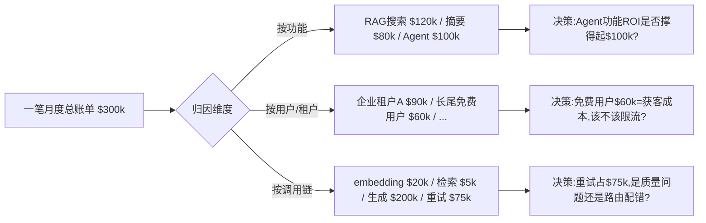

# S03 FinOps for AI·成本可观测与归因全景

> 本节点要解决的问题不是"怎么把成本做低"（那是 [S02 降本手段流派对照矩阵](/kb/专题-工程与成本/s02-降本手段流派对照矩阵/) 的事），而是**当你的 AI 产品已经在烧钱、账单已经失控、你却说不清这笔钱花在哪个功能/哪个用户/哪个租户身上时，你该怎么把"一团黑账"变成"可归因、可告警、可熔断的运维系统"**。视角/框架名：**FinOps for AI**——把云财务运营（FinOps）那套"可观测→归因→优化→治理"的闭环，移植到 token 计费这个比 EC2 实例更滑、更碎、更分钟级失控的新成本对象上。核心反共识判断一句话：**不能归因的成本不能优化——一个连"这次降本到底降的是哪笔账"都说不清的团队，所有降本动作都是盲拍；而成本 FinOps 是 2026 年被绝大多数 AI 产品忽视的护城河。**

---

## §0 为什么是 FinOps 框架，而不是"看仪表盘"

先挡掉读者脑中两个默认错误框架。

**错误框架一："成本可观测 = 装个 dashboard 看 token 消耗。"** 这是把 FinOps 矮化成监控。监控只回答"花了多少"（总量），FinOps 要回答"为谁花的、值不值、该谁负责、超了怎么自动刹车"四件事。一张显示"本月 token 消耗曲线"的仪表盘，在账单从 $3 万跳到 $30 万时，除了让你看着曲线焦虑，给不出任何可执行的下一步——因为它没有**归因维度**（attribution），你不知道那 27 万的增量是新上线的 RAG 功能、还是某个企业租户的批量调用、还是一次 prompt 注入循环。

**错误框架二："这是工程的事，PM 不用管。"** 恰恰相反。归因维度的选择是**产品决策**：你决定"按功能归因"还是"按租户归因"，本质是在决定"哪个功能的 ROI 要被审视、哪个客户该被涨价或限流"。这是 PM 的定价权和功能优先级权，不是工程的 SRE 职责。

**为什么是 FinOps 这个成熟框架？** 因为云计算行业已经用十年踩平了"按量计费的成本怎么治理"这条路。FinOps Foundation（隶属 Linux 基金会）把它沉淀成 **Inform（可观测/分摊）→ Optimize（优化）→ Operate（治理/迭代）** 三阶段循环。FinOps Foundation 已把 "FinOps for AI" 列为框架的一个 Technology Category（见 FinOps Framework 2026 与 finops.org/framework/technology-categories/ai），并设有 "FinOps for AI" 工作组（产出 "AI Cost Estimation""How to Forecast AI" 等论文）和专门的认证路径，覆盖 AI 成本分摊、异常检测、预测、预算、治理、unit economics 等能力（来源：FinOps Foundation, finops.org/wg/finops-for-ai-overview 与 framework/technology-categories/ai）。AI 成本与传统云成本有四个不同点，正是它需要独立成一节、而非套用现成 FinOps 工具的理由：

| 维度 | 传统云成本（EC2/S3） | AI 成本（token） | 含义 |
|---|---|---|---|
| 计量颗粒 | 实例小时、GB-月（稳定） | per-token，且 input/output 异价、reasoning token 单独计 | tag 打在实例上够用；token 要打在"每一次请求 × 每一层调用"上 |
| 失控速度 | 小时—天级（忘关实例） | **分钟级**（一个 prompt 注入循环可在几分钟烧光预算） | 告警必须配自动熔断，看仪表盘来不及 |
| 归因载体 | 资源 tag（云原生支持） | 请求 metadata（要自己埋点透传 user/tenant/feature） | 没有原生 tag，归因是工程债 |
| 成本-质量耦合 | 几乎无（实例就是实例） | 强（降本=降模型档位=降质量） | 优化决策必须带质量回归基线 |

所以 S03 不是"把 AWS Cost Explorer 那套搬过来"，而是**在 token 这个新成本对象上重建 FinOps 闭环**。下面按 Inform→Optimize→Operate 三阶段递进。

---

## §1 Inform 阶段：可观测的三层埋点（看见花了多少）

可观测的前提是**埋点**——在每一次 LLM 调用上记录足够多的 metadata，否则后面的归因无米下锅。三层最小埋点：

| 层 | 记录什么 | 为什么不能省 |
|---|---|---|
| **调用层** | 模型名/版本、input tokens、output tokens、reasoning/thinking tokens（若有）、是否命中 cache、延迟、是否重试/重试次数 | 这是 per-token 成本的原始凭证；不分 input/output 就算不出真实单价（output 通常贵数倍，见 [A03 Token Economics 精算](/kb/专题-工程与成本/a03-token-economics-精算/)） |
| **业务层** | user_id、tenant_id、feature/endpoint、session_id、上游触发源 | 这是**归因维度**的载体——没有它，§2 的按功能/用户/租户归因全部做不了 |
| **结果层** | 是否被用户采纳/点赞、是否触发降级、质量评分（若有 LLM-as-judge） | 把"花了多少"接到"值不值"——成本除以采纳率才是有效成本 |

> [!note] PM 必须在产品设计期就要求这套埋点
> 这套 metadata 透传是典型的"上线时省事、归因时还债"的工程债。reasoning token 自 2025 年起被各家单独计费（OpenAI o系列、Anthropic extended thinking），若调用层不单记 thinking token，你会发现账单远超你按 input/output 估的数，却查不出多出来的是哪部分——这是 [m209 - 推理成本控制手册](/kb/工程化与落地架构/m209-推理成本控制手册/) 未展开的盲点。**埋点是 PRD 该写进去的，不是事后补的。**

---

## §2 Optimize 阶段的前提：归因——本节点的命门

可观测只是看见总量。**FinOps 的真正价值在归因**：把一笔总账拆到能问责、能决策的最小单元。AI 成本至少有三个正交的归因维度：

- **按功能归因**回答"哪个功能在烧钱，它的 ROI 撑得起吗"——直接喂给功能优先级与砍功能决策。
- **按用户/租户归因**回答"哪个客户在亏钱、免费额度该不该收紧"——直接喂给定价与限流（这正是 [A07 成本约束反向塑造产品](/kb/专题-工程与成本/a07-成本约束反向塑造产品/) 的微观机制：免费额度 = 获客成本，归因让你看清这笔获客花得值不值）。
- **按调用链归因**回答"一个 RAG Agent 的 per-query 成本里，embedding/检索/生成/重试各占多少"——这是 [E03 一个 RAG Agent 产品的 unit economics 拆解](/kb/专题-工程与成本/e03-一个-rag-agent-产品的-unit-economics-拆解/) 能成立的前提。

**核心判断：不能归因的成本不能优化。** 一个只有总账、没有归因的团队，降本时只能整体调档（全量换便宜模型），代价是把高价值功能的质量也一起砍了；而能归因的团队可以**外科手术式降本**——只对"长尾免费用户的低复杂度请求"路由到便宜模型，对"企业租户的核心查询"保留强模型。归因维度的精度，直接决定降本动作的精度。

---

## §3 判断主轴：90% 的人在 FinOps for AI 上会搞错的四个点

这是区分"PM 顶刊"与"技术博客"的命门。每点带：症状 → 为什么会错 → 正确做法 → 真实反例。

### 主轴一：把"可观测"当成"可控"（最致命）

- **症状**：团队上了一套 LLM 可观测工具（Langfuse / Helicone / Datadog LLM Observability 之类），仪表盘漂亮，老板满意，自认为"成本已经管起来了"。
- **为什么会错**：可观测是**只读**的——它告诉你已经花了多少，但**不阻止**继续花。AI 成本是分钟级失控的（一个 agent 自我调用死循环、一个被注入的 prompt 触发批量生成，能在几分钟把日预算烧光）。等你看到告警、登录仪表盘、定位、改配置、发布，钱早烧完了。
- **正确做法**：可观测必须配**自动负反馈回路**——预算阈值触发的硬熔断（断流/降级到便宜模型/拒绝低优先级请求），而不是只发一封告警邮件。把成本告警当成控制系统的传感器，熔断器才是执行器。
- **真实反例**：2023 年 GitHub/社区多次报道开发者因 OpenAI API key 泄露或失控脚本，单日产生数千美元意外账单的案例〔具体金额与个案〔待核实〕，但"key 泄露导致天价账单"是 OpenAI 论坛与开发者社区反复出现的真实模式〕。这些受害者多半都"装了用量监控"——他们看得见账单在涨，却没有自动熔断，监控只是让他们更清楚地目睹钱被烧掉。

### 主轴二：归因维度只埋一个，事后想补补不回来

- **症状**：上线时只埋了 user_id（"够用了"），三个月后老板问"企业版和免费版分别花多少、哪个功能最烧钱"，发现历史数据里没有 tenant_id 和 feature 字段，答不上来。
- **为什么会错**：归因维度是**写时确定**的——你没在调用时记下的维度，事后任何工具都还原不出来。这和传统云成本不同，云资源有原生 tag 可补,token 调用一旦没埋 metadata 就永久丢失。
- **正确做法**：在 Inform 阶段就把三个维度（功能/用户租户/调用链）全部埋齐，哪怕暂时不用——存储 metadata 的成本远低于丢失归因能力的成本。
- **真实反例**：这是 SaaS 时代"埋点债"在 AI 上的复演。Mixpanel/Amplitude 时代无数团队栽在"上线时没埋关键事件属性，做漏斗分析时才发现数据缺维度"——AI 成本归因是同一个坑，只是代价从"分析不了"升级成"账单失控时定位不了"。

### 主轴三：用"总成本下降"证明降本成功，忽略成本 drift 与质量回归

- **症状**：换了路由方案，本月总成本降了 20%，宣布降本成功，结束。
- **为什么会错**：两个隐患被总量掩盖。其一是**成本 drift（成本漂移）**——AI 成本会因模型版本更新、prompt 膨胀（功能迭代不断往 system prompt 塞内容）、上下文变长、用户行为变化而**缓慢上涨**，今天降的 20% 可能两个月后被 drift 吃回去，而你没有**成本回归测试**（cost regression）盯着它。其二是降本可能伴随**质量回归**——总成本降了，但采纳率/满意度也悄悄降了，有效成本（成本÷采纳率）其实没降甚至涨了。
- **正确做法**：(1) 建**成本回归基线**——像跑性能回归一样，每次发布跑一组标准请求，监测 per-request 成本是否较基线异常上涨（catch prompt 膨胀和 drift）；(2) 降本指标永远和质量指标成对汇报，禁止单看成本。
- **真实反例**：prompt 膨胀是最普遍的隐性 drift——功能迭代时往 system prompt 加"再注意 X、还要处理 Y"，每条几十 token，单看无感，但乘以百万级日调用量就是可观的月增量。这类似软件工程里的"性能回归"：没有回归测试盯着，性能（这里是成本）会在无人察觉中逐版劣化。

### 主轴四：把归因口径当成中立的技术选择

- **症状**：工程按"最容易埋点的维度"（比如 API endpoint）做归因，PM/财务照单全收，以为这只是个技术实现细节。
- **为什么会错**：**归因口径即权力分配。** 你按功能归因，被点名的功能 owner 要为账单负责、要解释 ROI；你按租户归因，亏钱的客户被推上涨价或限流的谈判桌；你按团队归因，超预算的团队要背锅。选哪个维度"主"、哪个"次"，决定了组织里谁被审视、哪个功能被砍——这从来不是中立的技术选择。
- **正确做法**：PM 要意识到归因维度是**自己该参与定义的产品/组织决策**，不能甩给工程"怎么方便怎么来"。归因体系要服务于"你想优化哪个决策"，而不是"哪个字段最好埋"。
- **真实反例**：见下文§5 跨域呼应（Strathern 审计社会学）——"度量即治理"，被度量的对象会因被度量而改变行为（一个功能 owner 知道自己按成本被考核后，可能为了好看而牺牲质量去压 token，把成本病传染成质量病）。

---

## §4 产品 PM 视角补盲

跳出工程视角，三个 PM 容易看走眼的点：

1. **多租户 SaaS 的成本归因 = 定价权的数据基础。** 如果你卖的是企业版 AI 产品（按席位/按用量计费），没有 per-tenant 成本归因，你的定价就是盲拍——你不知道哪个客户在亏钱、哪个套餐的毛利是负的。归因数据是"该给这个大客户涨价还是限流"这场谈判的唯一弹药。
2. **成本归因数据本身是敏感的合规对象。** 按用户归因意味着你在记录"每个用户的 AI 使用画像"，这在 GDPR/隐私语境下是个人数据。归因埋点要和隐私设计协同——记 tenant 级聚合可以，记到可识别个人的细粒度行为要走合规评估。这是纯工程视角看不到的边界。
3. **成本告警的"狼来了"疲劳。** 阈值设太松，告警满天飞，团队脱敏，真失控时被淹没在噪音里。FinOps 的告警要分级（信息/警告/熔断），且熔断级必须是自动执行而非人工响应——这是个产品体验设计问题（给谁告警、什么时候自动刹车、降级后用户看到什么），不只是阈值数字。

---

## §5 跨域呼应：审计社会学与控制论

> [!note] Strathern《Audit Cultures》——归因口径不是中立的
> 人类学家 Marilyn Strathern 在《Audit Cultures》（2000）中提出审计文化的核心洞察：**度量从来不是中立的观察，度量行为本身重塑被度量的对象。** 当某个维度被选为问责口径，被度量者会为了在该口径上好看而改变行为（即后来广为人知的 Goodhart's law 的社会学版本）。把这套搬到 FinOps for AI：你选"按功能归因成本"，功能 owner 就会为压低自己功能的 token 数而行动——可能是好事（真优化），也可能是坏事（牺牲质量、把成本甩给别的功能、或把调用伪装成别的 endpoint 逃避归因）。**这改变了我对"归因越细越好"的判断**：归因维度的选择是一种治理设计，要预判它会诱导出什么行为，而不是天真地以为"我只是在客观地测量成本"。归因口径即权力分配——这也是上文主轴四的理论根。

> [!note] 控制论负反馈——告警必须闭环成熔断
> 把成本告警放进控制论框架看，"看仪表盘 + 发邮件"是一个**开环**系统：传感器（监控）有了，但没有连到执行器（熔断/降级），反馈回路不闭合。控制论的基本结论是：**只有闭合的负反馈回路才能稳定一个系统。** AI 成本是分钟级失控的快变量，人工响应的延迟（看到→定位→改配→发布）远长于失控速度，等于反馈回路里串了一个超大延迟，系统必然失稳。**这改变了我对"成本可观测"的判断**：可观测（开环传感）是必要不充分条件，FinOps 的可控性必须靠"预算阈值→自动熔断/降级"这个闭合负反馈回路来兑现，否则就是主轴一的"可观测≠可控"。

---

## §6 对手框架回应

**对手：FinOps/可观测厂商的"成本可观测 = 成本可控"派**（Datadog、Langfuse、Helicone、各 LLMOps 平台的营销话术）。

- **接受它对的部分**：可观测确实是一切的前提——没有埋点和归因，连"花在哪"都不知道，更谈不上优化。这些工具把"看见 token 成本"的门槛降到很低，是真实价值，值得用。归因能力（尤其多维 attribution）也确实是它们相对自建脚本的核心优势。
- **本专题坚持的边界与赌注**：但"可观测"和"可控"之间隔着一整个执行器。用控制论的话说，它们卖的是传感器，不是闭环控制系统。**我赌的是**：2026 年绝大多数上了 LLM 可观测工具的团队，仍然没有自动熔断/降级回路——他们买了"看得见",误以为买了"管得住"。真正的护城河不在"装了哪个 dashboard",而在"有没有把成本告警闭环成自动负反馈、有没有成本回归测试盯着 drift"。**这个判断的失效场景**：在成本占客单价比例极低的低频高价 B2B 场景（推理成本远小于一次交易的价值），分钟级失控的风险敞口小，开环监控可能就够用——此时强求闭环熔断是过度工程。

---

## §7 PM 决策启示

- **面试怎么用**：被问"你怎么管理 AI 产品的成本"时，不要只答"用便宜模型/加缓存"（那是 [S02 降本手段流派对照矩阵](/kb/专题-工程与成本/s02-降本手段流派对照矩阵/) 的答案，且人人会说）。答 FinOps 闭环 + 一句反共识判断："可观测不等于可控，我会先确保成本能按功能/租户归因、并配自动熔断回路——不能归因的成本没法外科手术式优化，只能盲拍整体降档。" 这一句立刻把你和"只会喊降本"的候选人区分开。
- **选型怎么用**：评估 LLMOps/可观测工具时，问三个穿透性问题：(1) 能不能按我要的维度（功能/租户/调用链）归因，metadata 透传成本多大？(2) 支不支持预算阈值触发的**自动**熔断/降级，还是只发告警？(3) 有没有成本回归基线能力，能不能 catch prompt 膨胀和 drift？只满足"好看的仪表盘"的工具是半成品。
- **复现怎么用**：从最小可观测起步——在 [R01 最小可运行·Token 成本计算器](/kb/专题-工程与成本/r01-最小可运行-token-成本计算器/) 的基础上加三层埋点（调用/业务/结果），先把"按功能归因"跑通，再加预算熔断。配合 [R02 中型·模型路由 + 语义缓存 降本实验](/kb/专题-工程与成本/r02-中型-模型路由-+-语义缓存-降本实验/)，归因数据正是"该把哪类请求路由到便宜模型"的决策依据。

---

## §8 与已有节点的关系

- **对照 [m209 - 推理成本控制手册](/kb/工程化与落地架构/m209-推理成本控制手册/)（升级类型：抽象层升高 + 补缺）**：m209 §2.6 给了"成本估算框架"和一份降本手段清单（缓存/路由/语义缓存/对话压缩），停在"怎么估、怎么降"的工程层。S03 把它升高到**运维层**——不复述 m209 的估算公式和降本数字，而是回答 m209 没回答的"账单已经在动态变化、你怎么持续归因、告警、防 drift、自动熔断"。m209 是"上线前怎么估成本"，S03 是"上线后怎么治理成本"，两者是设计期与运维期的接力，不是重复。
- **对照 [S02 降本手段流派对照矩阵](/kb/专题-工程与成本/s02-降本手段流派对照矩阵/)（同模块·互补）**：S02 是"有哪些降本手段、各自代价多少"（Optimize 阶段的弹药库）；S03 是"你怎么知道该用哪个手段、用了之后怎么验证真降了"（Inform + Operate 阶段的决策与验证回路）。没有 S03 的归因，S02 的降本是盲选；没有 S02 的手段，S03 的归因没有执行出口。
- **对照 [A07 成本约束反向塑造产品](/kb/专题-工程与成本/a07-成本约束反向塑造产品/)（判断主轴落地）**：A07 是元判断"产品限制都是成本的影子"；S03 是它的**微观机制**——正是 per-tenant/per-feature 归因数据，让"免费额度该卡多少""哪个功能该限流"从拍脑袋变成有数据支撑的决策。
- **延伸对照 [m202 - 工程选型决策矩阵](/kb/工程化与落地架构/m202-工程选型决策矩阵/)**：m202 的"成本预算"维度是选型时的静态判断；S03 提供运维期的动态归因数据，可反哺 m202 的选型复盘（"当初选这个模型，实际 per-feature 成本和预算差多少"）。

---

## §9 关联节点

**核心（必读）**
- [S02 降本手段流派对照矩阵](/kb/专题-工程与成本/s02-降本手段流派对照矩阵/)（Optimize 阶段的手段库，S03 的执行出口）
- [S01 AI 产品成本结构分层剖面](/kb/专题-工程与成本/s01-ai-产品成本结构分层剖面/)（S03 归因的成本分层底图）
- [A07 成本约束反向塑造产品](/kb/专题-工程与成本/a07-成本约束反向塑造产品/)（S03 是其微观归因机制）
- [A02 成本对象层级辨析·per-token per-query per-task per-user per-seat](/kb/专题-工程与成本/a02-成本对象层级辨析-per-token-per-query-per-task-per-user-per-seat/)（归因维度的口径来源）
- [m209 - 推理成本控制手册](/kb/工程化与落地架构/m209-推理成本控制手册/)（被升级的估算框架，设计期→运维期接力）
- [E03 一个 RAG Agent 产品的 unit economics 拆解](/kb/专题-工程与成本/e03-一个-rag-agent-产品的-unit-economics-拆解/)（按调用链归因的实例落地）

**延伸（可选）**
- [A03 Token Economics 精算](/kb/专题-工程与成本/a03-token-economics-精算/)（调用层埋点要分 input/output/thinking 的依据）
- [R01 最小可运行·Token 成本计算器](/kb/专题-工程与成本/r01-最小可运行-token-成本计算器/)（可观测的最小起点）
- [R02 中型·模型路由 + 语义缓存 降本实验](/kb/专题-工程与成本/r02-中型-模型路由-+-语义缓存-降本实验/)（归因数据驱动路由决策）
- [R03 Unit Economics 模型·CAC COGS LTV 与盈亏平衡](/kb/专题-工程与成本/r03-unit-economics-模型-cac-cogs-ltv-与盈亏平衡/)（归因数据汇入毛利表）
- [m202 - 工程选型决策矩阵](/kb/工程化与落地架构/m202-工程选型决策矩阵/)（运维归因反哺选型复盘）
- [Prompt Caching](/kb/基础知识库/prompt-caching/)（cache 命中率是调用层关键埋点）
- [Polanyi 默会知识与提示工程的认识论张力](/kb/基础知识库/polanyi-默会知识与提示工程的认识论张力/)（prompt 膨胀作为默会的成本 drift）
- 0117社会学（Strathern 审计社会学入口）
- [AI概念滥用反思](/kb/基础知识库/ai概念滥用反思/)（"可观测=可控"是典型概念滑变）
- [AI PM 知识图谱·总索引](/kb/ai-pm-知识图谱/ai-pm-知识图谱-总索引/)
- [_成本工程系统化专题·总览](/kb/专题-工程与成本/_成本工程系统化专题-总览/)

---

## §10 修订日志

- **R0（2026-06-07，节点初稿）**：按宪章 §4 十一段骨架与总览 §3/§6/§7 对 S03 的规划写成。判断主轴四件套齐备（主轴一可观测≠可控/主轴二归因维度写时确定/主轴三成本drift与质量回归/主轴四归因口径即权力）；对手框架"可观测厂商=成本可控派"用"接受+边界"回应并标失效场景（低频高价B2B）；跨域呼应落地两处（Strathern《Audit Cultures》2000 审计社会学—归因口径即权力分配；控制论负反馈—告警须闭环成熔断），均具体改变了技术判断而非空 invocation；与 m209（抽象层升高+补缺，设计期→运维期接力，不复述估算公式）、S02（互补：手段库vs决策回路）、A07（微观机制）、m202（运维反哺选型）显式升级对照；关联节点分核心6/延伸11。**R0.1（2026-06-07，grounding 核实）**：WebSearch 核实 FinOps Foundation 确有 "FinOps for AI" Technology Category（FinOps Framework 2026）、工作组（产出 "AI Cost Estimation""How to Forecast AI" 等论文）与认证路径，已把 §0 原〔待核实〕表述升级为带可追溯线索的确证陈述（来源 finops.org/wg/finops-for-ai-overview 与 framework/technology-categories/ai）。**遗留待核实项（1 项）**：主轴一"key 泄露/失控脚本导致天价账单"个案的具体金额（已标〔待核实〕，"key 泄露→意外天价账单"模式本身为 OpenAI 论坛与开发者社区反复出现的真实现象，正文未编造具体数字，仅作为"可观测≠可控"的示意反例，可接受降级保留）。字数约 2650。
