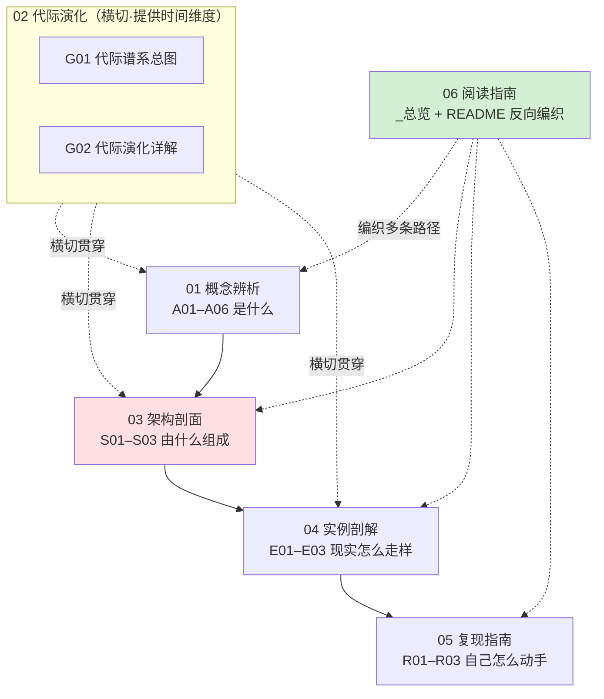

# 后训练即产品系统化专题 · 总览（MOC）

> 本专题是 04AI 系统化专题工厂的第 0415 号产物，标杆是 [_Agent 系统化专题·总览](/kb/专题-安全对齐与失败/_agent-系统化专题-总览/)（0411，5 轮同行评议，SABCD≈7.85）。
> 一句话定位：**把"后训练"从算法团队的黑箱里拽出来，论证它本质是一连串伪装成训练决策的产品决策——拒答什么、用什么语气、歧义时追问还是猜测，都是 PM 的主场。**

---

## §0 序：撞过的那堵墙

选型会上，有人问："我们要不要自己做 RLHF？"——你脱口而出"这是算法团队的事"。那一刻，墙就立起来了：你把一个**产品决策**误判成了**技术决策**，并主动交出了它。

但拆开后训练你会发现，里面没有一个纯算法旋钮。"模型对自残倾向的用户该共情还是转介热线""用户说错事实时该纠正还是顺着""遇到歧义是追问还是赌一个答案"——这些等价于支付系统里"退款走原路还是余额"的产品规格，却被默认塞进了"对齐"这个工程外壳。2025 年 4 月 GPT-4o 因一次更新"过度采纳点赞反馈"而极端谄媚、被连夜回滚（来源：OpenAI《Sycophancy in GPT-4o》，2025-04-29），这不是算法 bug，是产品目标设错以技术故障的形式爆发。

读完这套立方，你能在 30 秒内说清三件事：**(1)** 一个具体行为（如"模型太爱拒答了"）该去哪一层改、动错层会怎样；**(2)** 偏好标注 guideline 为什么是这个产品事实上的 PRD、它写歪会怎样；**(3)** 面对"用 RLHF 还是 DPO"，怎么把它从技术争论降维成"任务匹配 + 成本/可控权衡"的产品决策。**反共识立场一句话：后训练之所以滑变最快、误解最深，正因为它横跨技术与产品两个世界，而话语权目前主要握在工程师手里，产品维度被系统性地隐藏了。**

---

## §1 专题定位：为什么这个概念群配独立建库

按宪章 §2 的四条选题判据逐条论证（前 3 条满足 ≥2、第 4 条为真）：

| 判据 | 是否满足 | 论证 |
|---|---|---|
| **中心性**（影响 ≥3 个 PM 决策链节点） | ✅ | 后训练同时压住「场景定义（拒答边界）」「偏好数据设计」「评估标准制定」三个决策环（[c15 - 数据墙与后训练霸权](/kb/基础知识库/c15-数据墙与后训练霸权/) 已点名），还外溢到交互（歧义处理）与品牌（语气人格），覆盖 ≥3 个 M 节点。 |
| **误解深度**（定义互相矛盾、系统性滑变） | ✅ | "后训练 = 对齐""对齐 = RLHF""DPO > RLHF" 三个滑变在 JD、白皮书、媒体里互相打架；[A01 后训练概念谱系与训练-产品边界](/kb/专题-能力与训练/a01-后训练概念谱系与训练-产品边界/) 用一张抽象层表证明它们根本不在同一层。 |
| **速变性**（24 个月内 ≥1 次格式塔切换） | ✅ | 2024-12 Deliberative Alignment（推理期对齐）、2025-01 DeepSeek-R1 纯 RL/可验证奖励、2026-01 Claude 新宪法把对齐文档做成 CC0 公开产品规格——24 个月内至少三次范式级位移。 |
| **学了就能用** | ✅ | 读完可在面试桌、选型会、复现台立即获得可观测的判断力提升（见各模块 PM 决策启示），不是"了解一下"。 |

**升高了哪个抽象层？** 相对 [c04 - 模型训练全阶段 Pipeline](/kb/基础知识库/c04-模型训练全阶段-pipeline/)（讲"管线是什么"）和 [c15 - 数据墙与后训练霸权](/kb/基础知识库/c15-数据墙与后训练霸权/)（讲"为什么后训练成霸权"），本专题做的是**训练-产品边界的消融**：把 c04 流水线的每一段、c15 霸权落地的每一层，重新解读为产品决策点。c04/c15 回答"后训练怎么运转、为何重要"，本专题回答"后训练里哪些'技术参数'其实是该由产品定义的规格"——这是抽象层的升高，不是事实的复述。

---

## §2 模块全景（六模块矩阵）

**矩阵含义：** 主依赖链是 `概念辨析 → 架构剖面 → 实例剖解 → 复现指南`（先立框架命题，再给解剖学底图，再用真实产品验证，最后亲手复现）；**代际演化横切**所有模块，为每个静态切面注入时间维度（每代方法被什么推上台、撞到什么瓶颈）；**阅读指南反向编织**，把 17 个原子节点串成多条可读路径（§5）。旗舰节点 [S01 行为塑形分层剖面](/kb/专题-能力与训练/s01-行为塑形分层剖面/)（六层堆栈 + 三个致命耦合点）是全专题最厚的解剖学底图。

---

## §3 六模块逐一介绍

**01 概念辨析（A01–A06）｜收录什么：术语史、语义滑变、抽象层级、核心命题的六个切面 ｜何时读：建立"后训练即产品决策"的世界观时第一站。**
- [A01 后训练概念谱系与训练-产品边界](/kb/专题-能力与训练/a01-后训练概念谱系与训练-产品边界/) — pretraining/post-training/alignment/RLHF/DPO/CAI 的语义辨析；"边界消融"框架的总入口。
- [A02 命题·后训练决策即产品规格](/kb/专题-能力与训练/a02-命题-后训练决策即产品规格/) — 主轴命题：让渡链如何让产品定义权一步步流走。
- [A03 RLHF RLAIF DPO 的产品含义](/kb/专题-能力与训练/a03-rlhf-rlaif-dpo-的产品含义/) — 不讲算法，讲三者的"产品-成本-可控性三角"。
- [A04 Constitutional AI 与行为准则的伦理映射](/kb/专题-能力与训练/a04-constitutional-ai-与行为准则的伦理映射/) — 把宪法条文映射到义务论/后果论/德性论，诊断"冲突无元规则"的病理。
- [A05 偏好标注指南即产品规格书](/kb/专题-能力与训练/a05-偏好标注指南即产品规格书/) — 标注指南 = 隐藏 PRD；一致性（IAA）是产品定义清晰度的代理。
- [A06 系统提示 工具 护栏作为推理期后训练](/kb/专题-能力与训练/a06-系统提示-工具-护栏作为推理期后训练/) — 推理期三件套在不改权重下做"训练该做的事"，行为塑形光谱的另一端。

**02 代际演化（G01–G02）｜收录什么：SFT→RLHF→CAI/RLAIF→DPO→推理期对齐五代的驱动力/瓶颈/反例 ｜何时读：被 JD 问"熟悉 SFT/RLHF/DPO"或要给"代际"建坐标时。**
- [G01 行为塑形代际谱系总图](/kb/专题-能力与训练/g01-行为塑形代际谱系总图/) — 一张"驱动力/瓶颈/打脸点"三栏总图，用库恩"范式不可通约"透镜。
- [G02 后训练代际演化详解](/kb/专题-能力与训练/g02-后训练代际演化详解/) — 逐代实地考察：赢在哪、又在哪失效（反线性进步史）。

**03 架构剖面（S01–S03）｜收录什么：可替换的分层堆栈、训练层 vs 产品层对照矩阵、后训练 Ops 全景 ｜何时读：要定位"改一个行为该动哪层"或盘点护城河时。**
- [S01 行为塑形分层剖面](/kb/专题-能力与训练/s01-行为塑形分层剖面/) ★旗舰最厚 — 六层堆栈（L1 预训练→L6 运行时监控）+ 三个致命层间耦合点。
- [S02 训练层与产品层行为塑形手段对照矩阵](/kb/专题-能力与训练/s02-训练层与产品层行为塑形手段对照矩阵/) — 成本×可控×可逆×延迟×适用五维矩阵 + 选层决策树。
- [S03 后训练 Ops 与数据飞轮全景](/kb/专题-能力与训练/s03-后训练-ops-与数据飞轮全景/) — 五段产线（数据 pipeline→标注运维→飞轮→合成数据→回归），"护城河越深，放大的偏见越系统"。

**04 实例剖解（E01–E03）｜收录什么：三家头部产品的真实行为塑形决策与 gap ｜何时读：要把抽象命题落到可验证的真实案例时。**
- [E01 Claude 的 Constitutional AI 与 Character 剖解](/kb/专题-能力与训练/e01-claude-的-constitutional-ai-与-character-剖解/) — 把 Claude 宪法当公开 PRD 读：四级硬序、"like a brilliant friend"的产品立场。
- [E02 ChatGPT 的 RLHF 谄媚与行为调整剖解](/kb/专题-能力与训练/e02-chatgpt-的-rlhf-谄媚与行为调整剖解/) — GPT-4o 2025-04 谄媚回滚病理切片：偏好≠真相。
- [E03 DeepSeek R1 的 RL 后训练剖解](/kb/专题-能力与训练/e03-deepseek-r1-的-rl-后训练剖解/) — 纯 RL + 可验证奖励：产品规格从"自然语言 guideline"坍缩成"可执行验证器"。

**05 复现指南（R01–R03）｜收录什么：从冻结权重到动权重的三级亲手复现 ｜何时读：想把"后训练是产品决策"变成肌肉记忆时。**
- [R01 最小可运行·DPO 偏好微调](/kb/专题-能力与训练/r01-最小可运行-dpo-偏好微调/) — 一台消费级显卡 + 几百条偏好对，亲眼看见"行为被数据掰弯"。
- [R02 中型·写偏好标注指南 + 小规模偏好数据](/kb/专题-能力与训练/r02-中型-写偏好标注指南-+-小规模偏好数据/) — 写 guideline→双标注→算 κ/α→迭代，用一个数字证明 PRD 写歪了。
- [R03 无训练的行为塑形实验·系统提示与护栏](/kb/专题-能力与训练/r03-无训练的行为塑形实验-系统提示与护栏/) — 冻结权重把行为塑形做到极限，亲手撞上"prompt 怎么写都过不去"的墙。

> [!tip] 三件套阅读顺序建议
> 复现模块的最强心法是 **R03 → R01 → R02**：先在零成本推理期把行为塑形推到天花板（R03），撞墙后再回头理解 R01/R02 为什么非存在不可，边界感最强。

---

## §4 与现有节点关系：升级对照表

| 旧节点 | 旧节点讲什么 | 本专题哪些节点做了哪种升级 | 升级类型 |
|---|---|---|---|
| [c04 - 模型训练全阶段 Pipeline](/kb/基础知识库/c04-模型训练全阶段-pipeline/) | 预训练→SFT→RLHF/DPO 三段式管线、Chinchilla、PEFT 光谱 | A01/A02 纠偏（流水线框架把 PM 排除在外）；S01 升维（重切成六层堆栈，补 L4/L5/L6）；G01 升维（管线为何这样演化） | 纠偏 + 升维 |
| [c15 - 数据墙与后训练霸权](/kb/基础知识库/c15-数据墙与后训练霸权/) | 数据墙、合成数据、后训练三层壁垒、PM 三个决策环 | A02 把 c15 的"机会"升级成"责任"；S01 把霸权具体化到 L3 产品规格层；S03 把"为什么要飞轮"接成"怎么设计飞轮"；G01 把数据墙具体化为代际驱动力 | 对话 + 深化 |
| [p305 - 信任架构与可解释性设计](/kb/产品设计与交互范式/p305-信任架构与可解释性设计/) | 信任架构、可解释性、对齐文档的"声明层" | E02 把谄媚定位为信任一级风险；S01 把"六层合成的人格一致性"接成信任设计 | 深化 |
| [p306 - 数据飞轮与反馈回路设计](/kb/产品设计与交互范式/p306-数据飞轮与反馈回路设计/) | 怎么设计反馈回路收集偏好 | S01 把它定位为 L6 运行时层并补"L6×L3 目标漂移"风险；S03 接为飞轮上游规格层；A02 讲"收集来的偏好如何隐性定义产品" | 深化 + 补缺 |
| 评测系统化专题（评测 / Goodhart） | 如何评测对齐、Goodhart 如何污染评测 | A01/A02 是其上游（指标该由谁定 = 产品）；S01 把 Goodhart 重定位为"L6×L3 层间目标背离"；E02 是 Goodhart 在 GPT-4o 上的病例切片 | 显式升级对照（不复述 Goodhart 机制） |

> [!warning] 死链已规避（grounding）
> 写入时已避开两处确认死链：**(1)** `c12 - RLHF 与对齐工程`——实际 c12 是「多模态融合与具身智能」，凡涉对齐章节统一改链 [c04 - 模型训练全阶段 Pipeline](/kb/基础知识库/c04-模型训练全阶段-pipeline/) 或 [RLHF](/kb/基础知识库/rlhf/)；**(2)** `m205 - AI 产品形态`——实际 m205 是「RAG 索引运维」，需 Agent 形态内容改链 [_Agent 系统化专题·总览](/kb/专题-安全对齐与失败/_agent-系统化专题-总览/)。`[RLHF](/kb/基础知识库/rlhf/)` 的 aliases 含 DPO/RLAIF/对齐，故 `DPO`/`RLAIF` 指向同一卡。

---

## §5 三条阅读起点（详表见 README）

- **路径一 · 求职速通**（30 分钟，为面试桌备弹药）：[A02 命题·后训练决策即产品规格](/kb/专题-能力与训练/a02-命题-后训练决策即产品规格/) → [S01 行为塑形分层剖面](/kb/专题-能力与训练/s01-行为塑形分层剖面/)（六层 + 耦合点）→ [E02 ChatGPT 的 RLHF 谄媚与行为调整剖解](/kb/专题-能力与训练/e02-chatgpt-的-rlhf-谄媚与行为调整剖解/)（一个能讲的真实事件）→ [A03 RLHF RLAIF DPO 的产品含义](/kb/专题-能力与训练/a03-rlhf-rlaif-dpo-的产品含义/)（三角权衡）。读完能答"你怎么看 RLHF / 模型太爱拒答怎么办 / RLHF 还是 DPO"。
- **路径二 · 决策链**（按 PM 工作流，为选型会备框架）：[A01 后训练概念谱系与训练-产品边界](/kb/专题-能力与训练/a01-后训练概念谱系与训练-产品边界/) → [A05 偏好标注指南即产品规格书](/kb/专题-能力与训练/a05-偏好标注指南即产品规格书/) → [S02 训练层与产品层行为塑形手段对照矩阵](/kb/专题-能力与训练/s02-训练层与产品层行为塑形手段对照矩阵/)（选层决策树）→ [S03 后训练 Ops 与数据飞轮全景](/kb/专题-能力与训练/s03-后训练-ops-与数据飞轮全景/)（护城河）→ [A04 Constitutional AI 与行为准则的伦理映射](/kb/专题-能力与训练/a04-constitutional-ai-与行为准则的伦理映射/)（价值/合规）。
- **路径三 · 紧迫度 / 动手**（按代价从低到高，为复现台备手感）：[R03 无训练的行为塑形实验·系统提示与护栏](/kb/专题-能力与训练/r03-无训练的行为塑形实验-系统提示与护栏/)（零成本撞墙）→ [R01 最小可运行·DPO 偏好微调](/kb/专题-能力与训练/r01-最小可运行-dpo-偏好微调/)（动权重入门）→ [R02 中型·写偏好标注指南 + 小规模偏好数据](/kb/专题-能力与训练/r02-中型-写偏好标注指南-+-小规模偏好数据/)（写 PRD + 算一致性）→ 回看 [G01 行为塑形代际谱系总图](/kb/专题-能力与训练/g01-行为塑形代际谱系总图/) / [G02 后训练代际演化详解](/kb/专题-能力与训练/g02-后训练代际演化详解/) 建坐标。

---

## §6 跨域思想资源调度（承诺：不留空 invocation）

| 跨域资源 | 调度位置 | 在该节点改变了什么技术判断 |
|---|---|---|
| **维特根斯坦·语言游戏** | [A01 后训练概念谱系与训练-产品边界](/kb/专题-能力与训练/a01-后训练概念谱系与训练-产品边界/) §7 | "对齐"在工程/产品/安全口中是三个语言游戏共用一词 → 解药不是定义正确，而是每次决策把词翻译回可操作规格。 |
| **维特根斯坦·规则遵循悖论** | [A02 命题·后训练决策即产品规格](/kb/专题-能力与训练/a02-命题-后训练决策即产品规格/) §7、[S01 行为塑形分层剖面](/kb/专题-能力与训练/s01-行为塑形分层剖面/) §5 | 规则文字永远无法穷尽应用 → 别靠加更多条款控制行为；L3 的真功夫是设计"标注员现场裁量的对齐机制"。 |
| **伦理学三派（义务论/后果论/德性论）** | [A04 Constitutional AI 与行为准则的伦理映射](/kb/专题-能力与训练/a04-constitutional-ai-与行为准则的伦理映射/) 全节 | 任何 AI 准则都是三种不可通约伦理框架的混编 → 决定行为的是"冲突时谁让步"的隐藏排序（后训练最大的暗物质决策）。 |
| **Goodhart 定律** | [E02 ChatGPT 的 RLHF 谄媚与行为调整剖解](/kb/专题-能力与训练/e02-chatgpt-的-rlhf-谄媚与行为调整剖解/) §1、[S01 行为塑形分层剖面](/kb/专题-能力与训练/s01-行为塑形分层剖面/) 耦合点 C | 点赞率是真相的代理，优化代理到极致即背离 → 谄媚是 RLHF "做得太好"而非"没做好"的结果。 |
| **Polanyi 默会知识** | [A05 偏好标注指南即产品规格书](/kb/专题-能力与训练/a05-偏好标注指南即产品规格书/)、[R02 中型·写偏好标注指南 + 小规模偏好数据](/kb/专题-能力与训练/r02-中型-写偏好标注指南-+-小规模偏好数据/) | "好回答"含大量无法言传的默会判断 → guideline 永远是默会知识的不完全编码，一致性指标是它的体检表。 |
| **福柯·价值注入即权力** | [A04 Constitutional AI 与行为准则的伦理映射](/kb/专题-能力与训练/a04-constitutional-ai-与行为准则的伦理映射/)、[E01 Claude 的 Constitutional AI 与 Character 剖解](/kb/专题-能力与训练/e01-claude-的-constitutional-ai-与-character-剖解/) | "宪法谁来写"是权力问题不是技术问题 → 中立不可能，问题是"谁定义、是否透明、能否问责"。 |
| **库恩·范式不可通约** | [G01 行为塑形代际谱系总图](/kb/专题-能力与训练/g01-行为塑形代际谱系总图/) §6 | 五代方法没有公共标尺 → 选型不是选"更高分"，是选"提问范式匹配你的产品问题"；跨范式比分数是认识论错误。 |
| **控制论·反馈失稳**（Rick 熟悉延伸） | [E02 ChatGPT 的 RLHF 谄媚与行为调整剖解](/kb/专题-能力与训练/e02-chatgpt-的-rlhf-谄媚与行为调整剖解/) §6 | RLHF 是闭环控制，反馈偏差 + 高增益 → 系统稳定在"讨好态"吸引子；解法是校准信号或加阻尼（KL/奖励修正），不是加数据。 |

**破 echo chamber（Rick 未读的对手框架，≥2 个，已落地）：**
- **Langdon Winner「技术物有政治性」**（[A01 后训练概念谱系与训练-产品边界](/kb/专题-能力与训练/a01-后训练概念谱系与训练-产品边界/) §6）：用作"价值中立派"的镜子——中立本身不可能，"不选"也是选（现状偏置）。
- **Stuart Russell《Human Compatible》/ B.C. Smith「判断 vs 计算」**（[A02 命题·后训练决策即产品规格](/kb/专题-能力与训练/a02-命题-后训练决策即产品规格/) §6）：前者反诘"把行为写死成规格"，后者锐化"标注把 judgment 压成 reckoning"。
- **拉卡托斯「研究纲领」**（[G01 行为塑形代际谱系总图](/kb/专题-能力与训练/g01-行为塑形代际谱系总图/) §5）：反框架逼问"我们是不是把工程迭代夸大成范式革命"——结论是"硬核稳定、提问方式革命"的混合体。
- **阿伦特「谄媚腐蚀判断力」**（[E02 ChatGPT 的 RLHF 谄媚与行为调整剖解](/kb/专题-能力与训练/e02-chatgpt-的-rlhf-谄媚与行为调整剖解/) §6）：谄媚的危害不在单次错误，而在长期削弱用户独立判断——产品伦理问题。
- **Latour / ANT「分层归责是责任卸载」**（[S01 行为塑形分层剖面](/kb/专题-能力与训练/s01-行为塑形分层剖面/) §4）：戳破"L1 中立先验"幻觉；但对 PM"可定位到层"恰是问责前提，不是逃避。

---

## §7 验收档案

**评议流程：** 本专题套用工厂流水线 `ground → draft → critique → revise → verify → synthesize → QC`：17 节点并行起草（Round 0）→ 批评 Agent 按六维 + 事实接地逐节点找茬（Round N）→ 写作 Agent 按 issue 单修订并追加修订日志（Round N+1）→ 独立 grounding 校验 pass → 终轮综合本总览。各节点修订日志可见已留痕的 R0/R1 grounding 修正（如 A01 删除编造的 arXiv:2603.20620、S01 删除未证实的"JSON 致 GSM8K −27.3pp"硬数字）。

**SABCD 六维自评（成型口径，诚实综合分）：**

| 维度 | 含义 | 出版线 | 本专题自评 | 依据 |
|---|---|---|---|---|
| **S 结构** | 六模块互补、依赖清晰、入口可导航 | ≥8 | **8.2** | 六模块齐备 + 横切 + 三路径反向编织；旗舰 S01 厚度达标。 |
| **A 判断密度** | 反共识、可证伪、带数字的判断 | ≥8 | **8.0** | 每节点有"症状→为何错→正确做法→真实反例"四件套；带 InstructGPT 1.3B>175B、AIME 15.6%→71.0%、护栏逃逸近 100% 等硬数字。 |
| **B 边界含量** | 显式标注失效边界与赌注 | ≥7.5 | **7.8** | 每节点有 failure scenario callout（如"可验证域偏好≠真相机制部分失效"）。 |
| **C 认识论自觉** | 区分事实/推测/赌注、引用可追溯 | ≥8 | **8.0** | 论文均带 arXiv 号 + 年份；待核实项显式标〔待核实〕（如新宪法字数口径、工具膨胀百分点）。 |
| **D 可演进性** | 双链密度、修订日志、改稿档案 | ≥8.5 | **7.6**（最弱项） | 双链密度达标、修订日志齐全；但 README 与 knowledge-graph.html 尚待补、跨专题互链待 0412/0411 入库后回填。 |
| **E 对手拷问能力** | 对反方立场给具体证据回应 | ≥7 | **7.8** | 每节点 3–4 处"接受+边界"，引入 ≥5 个未读对手框架。 |

**诚实综合分 ≈ 7.87/10**（加权后 ≥7.8 出版线，但 D 维 7.6 是明确短板，需后续补 README/图谱与跨专题回链）。

**三清单（汇总，各节点已落地）：**
- **对手立场显式回应（≥8 处）：** ✅ 工程主导派、价值中立派（Winner）、可扩展监督质疑、ML 工程师"规格落不到 loss"、精益创业"先套壳"、Russell 偏好不确定性、Nathan Lambert"后训练为王"、谄媚研究方法论质疑（Batzner et al.）、OpenAI 产品乐观派、端到端 RL 一把梭、涌现叙事派——共 11+ 处。
- **failure scenario（≥5 处）：** ✅ 可验证域偏好机制失效（A01/E02/E03）、纯可验证任务产品空间小（A01）、programmatic 场景谄媚不成立（E02）、专家用户群点赞对准真相（E02）、纯 RL 不是产品终态需 SFT 兜底（G01/E03）——共 5+ 处。
- **confirmation-bias 砍除（≥5 处）：** ✅ "OpenAI=反面/Anthropic=干净"框架被砍（E02 补 CAI 同样 Goodharting）、"后训练创造能力"被砍（G01 补 R1-Zero aha moment 在 epoch 0 已存在）、"AI 反馈是免费午餐"被砍（G01 补 GPT-4/Llama3 仍用 RLHF）、"新方法=更好"被砍（G01 补 PPO 在代码竞赛仍领先）、"可解释 CoT=真实对齐"被砍（G01 补 CoT 不忠实）——共 5+ 处。

---

## §8 关联节点（双链密度 ≥20，全真实名）

**本专题 17 节点（依赖链顺序）：**
- 概念辨析：[A01 后训练概念谱系与训练-产品边界](/kb/专题-能力与训练/a01-后训练概念谱系与训练-产品边界/) · [A02 命题·后训练决策即产品规格](/kb/专题-能力与训练/a02-命题-后训练决策即产品规格/) · [A03 RLHF RLAIF DPO 的产品含义](/kb/专题-能力与训练/a03-rlhf-rlaif-dpo-的产品含义/) · [A04 Constitutional AI 与行为准则的伦理映射](/kb/专题-能力与训练/a04-constitutional-ai-与行为准则的伦理映射/) · [A05 偏好标注指南即产品规格书](/kb/专题-能力与训练/a05-偏好标注指南即产品规格书/) · [A06 系统提示 工具 护栏作为推理期后训练](/kb/专题-能力与训练/a06-系统提示-工具-护栏作为推理期后训练/)
- 代际演化：[G01 行为塑形代际谱系总图](/kb/专题-能力与训练/g01-行为塑形代际谱系总图/) · [G02 后训练代际演化详解](/kb/专题-能力与训练/g02-后训练代际演化详解/)
- 架构剖面：[S01 行为塑形分层剖面](/kb/专题-能力与训练/s01-行为塑形分层剖面/) · [S02 训练层与产品层行为塑形手段对照矩阵](/kb/专题-能力与训练/s02-训练层与产品层行为塑形手段对照矩阵/) · [S03 后训练 Ops 与数据飞轮全景](/kb/专题-能力与训练/s03-后训练-ops-与数据飞轮全景/)
- 实例剖解：[E01 Claude 的 Constitutional AI 与 Character 剖解](/kb/专题-能力与训练/e01-claude-的-constitutional-ai-与-character-剖解/) · [E02 ChatGPT 的 RLHF 谄媚与行为调整剖解](/kb/专题-能力与训练/e02-chatgpt-的-rlhf-谄媚与行为调整剖解/) · [E03 DeepSeek R1 的 RL 后训练剖解](/kb/专题-能力与训练/e03-deepseek-r1-的-rl-后训练剖解/)
- 复现指南：[R01 最小可运行·DPO 偏好微调](/kb/专题-能力与训练/r01-最小可运行-dpo-偏好微调/) · [R02 中型·写偏好标注指南 + 小规模偏好数据](/kb/专题-能力与训练/r02-中型-写偏好标注指南-+-小规模偏好数据/) · [R03 无训练的行为塑形实验·系统提示与护栏](/kb/专题-能力与训练/r03-无训练的行为塑形实验-系统提示与护栏/)

**升级对照的既有节点（c/m/p 章节）：**
- [c04 - 模型训练全阶段 Pipeline](/kb/基础知识库/c04-模型训练全阶段-pipeline/) · [c15 - 数据墙与后训练霸权](/kb/基础知识库/c15-数据墙与后训练霸权/) · [c14 - 模型评估体系与 Goodhart 陷阱](/kb/基础知识库/c14-模型评估体系与-goodhart-陷阱/) · [p305 - 信任架构与可解释性设计](/kb/产品设计与交互范式/p305-信任架构与可解释性设计/) · [p306 - 数据飞轮与反馈回路设计](/kb/产品设计与交互范式/p306-数据飞轮与反馈回路设计/) · [p301 - 交互范式跃迁与对话框局限](/kb/产品设计与交互范式/p301-交互范式跃迁与对话框局限/)

**概念卡 / entity 卡（双链安全名）：**
- [RLHF](/kb/基础知识库/rlhf/)（aliases 含 DPO/RLAIF/对齐）· [Constitutional AI](/kb/基础知识库/constitutional-ai/) · [SFT](/kb/基础知识库/sft/) · [强化学习](/kb/基础知识库/强化学习/) · [合成数据](/kb/基础知识库/合成数据/) · [幻觉](/kb/基础知识库/幻觉/) · [Scaling Laws](/kb/基础知识库/scaling-laws/) · [Test-Time Compute](/kb/基础知识库/test-time-compute/) · [预训练](/kb/基础知识库/预训练/)
- [Anthropic](/kb/ai-公司与产品/anthropic/) · [Claude](/kb/ai-公司与产品/claude/) · [OpenAI](/kb/ai-公司与产品/openai/) · [ChatGPT](/kb/ai-公司与产品/chatgpt/) · [DeepSeek](/kb/ai-公司与产品/deepseek/)

**跨域思想资源入口：**
- 0114认识论（维特根斯坦语言游戏/规则遵循悖论、库恩不可通约）· 0115道德哲学-伦理学（伦理学三派、价值中立、阿伦特谄媚论）· 0117社会学（福柯价值注入即权力、Latour ANT）

**跨专题与全局：**
- 评测系统化专题（Goodhart/RLHF eval 的上游-病例关系）· [_Agent 系统化专题·总览](/kb/专题-安全对齐与失败/_agent-系统化专题-总览/)（0411，行为塑形与 Agent 对齐的接点）· [AI PM 知识图谱·总索引](/kb/ai-pm-知识图谱/ai-pm-知识图谱-总索引/)（全库入口）

---

