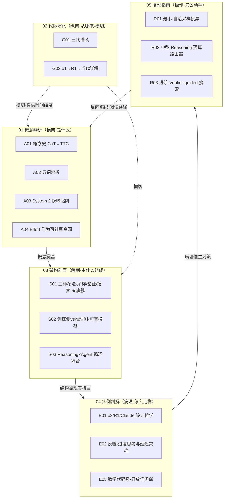

# _推理与测试时计算系统化专题·总览（MOC）

> 一句话：本专题把"让模型推理"这件被滥用最狠、滑变最快的事，拆成**横向辨义 → 纵向谱系 → 解剖结构 → 病理实例 → 动手复现**五个正交切面，让一个转型 PM 在面试桌 / 选型会 / 复现台上，30 秒说清"reasoning ≠ thinking ≠ test-time compute，以及为什么我这道题不该开高推理"。

---

## §0 序：那堵墙

2024 年底某次选型会，桌上有人甩出一句"o3 比 GPT-4 强 20 分，上它"——全场点头。我（Rick）卡在一个问题上没法点头：这 20 分，是**模型能力**变强了（权重里多了东西），还是这次回答**多烧了一个数量级的算力**（同一权重想得更久）？这两件事的成本结构、可控旋钮、失效模式完全不同，但被"reasoning 强"这一个形容词糊成了一团。后来我才知道这堵墙有名字——o3 在 ARC-AGI-1 高算力档拿 87.5%（烧了 172× 算力），在抗刷分的 ARC-AGI-2 上只有 2.9%（人类约 60%，来源：ARC Prize, 2024-12）。同一个月，我又撞上第二堵墙：给客服意图分类的 bot 默认开了 high-reasoning，单条延迟从 0.4 秒涨到 8 秒、成本翻 20 倍、简单题准确率反而掉——**"想更久"在这里是三杀**。

这两堵墙逼出本专题的反共识立场：**reasoning 不是一根越拧越大的旋钮，而是一个有上界、有反噬、有领域门槛的资源分配问题**。读完这套节点，你应该能把"模型变聪明"从一句 hype，还原成"在质量/延迟/成本三角上、按任务可验证性逐条决策"的工程动作——并知道在哪些任务上，多花的算力是在为幻觉付费。

---

## §1 专题定位：为什么"推理"配独立建库

按写作宪章 §2 的四条选题判据，逐条显式论证（前三条满足 ≥2，第四条为真）：

| 判据 | 是否满足 | 论证 |
|---|---|---|
| **① 中心性**（影响 ≥3 个 PM 决策链节点） | ✅ | 直接落在选型（M1）、成本/路由（M2）、可解释与信任 UX（M3）、复现/自建（M5）四个节点：effort 旋钮是选型硬指标、reasoning token 按 output 计费是成本主项、hidden CoT 是合规/可审计的硬约束、self-consistency/BoN 是最便宜的自建入口。 |
| **② 误解深度**（定义互相矛盾） | ✅ | "reasoning / thinking / test-time compute / inference scaling / CoT"五个词在媒体、JD、白皮书里互相通约使用，标准差极大——"o3 会思考了"这句话横跨能力层、产品层、度量层三个不可通约的语言游戏（见 A02）。 |
| **③ 速变性**（24 个月内 ≥1 次格式塔切换） | ✅ | 2022→2025 发生**三次** Kuhn 意义上的范式切换：prompt-CoT（提示层借力）→ RL-reasoning（o1/R1，焊进权重）→ 推理期搜索（按算力购买）。"推理"这个词的指代物换了三次（见 A01/G01）。 |
| **④ 学了就能用** | ✅ | 读完即可在面试 30 秒拆穿"o3 比 GPT-4 强"的归因塌缩、在选型会建"任务可验证性 × 成本"路由表、在复现台从 50 行 self-consistency 起步——是立即可观测的判断力提升，不是"了解一下"。 |

**相对单维节点升高了哪个抽象层**：本专题升高的不是"知识量"，而是**辨义层 + 决策层**。已有的 [c11 - System 2 思维与 Test-Time Compute](/kb/基础知识库/c11-system-2-思维与-test-time-compute/) 把 test-time compute 当成"一个产品现象"横截面介绍；本专题把它当成"一个被三次范式切换搅浑的概念群"做纵深拆解——c11 回答"它怎么用"，本专题回答"这个词指的到底是哪一个它、它在哪失效、自己怎么动手验证"。这是从"概念卡"到"判断立方"的升阶。

---

## §2 模块全景

**矩阵含义**：依赖主链是 **概念（A）→ 架构（S）→ 实例（E）→ 复现（R）**——先辨清术语坐标，才能解剖结构，才能看懂结构在现实里如何走样，才能动手对治。**代际演化（G）横切**所有模块，给每个静态切面叠上"它从哪来、每代踩了什么坑"的时间轴。**复现指南（R）反向编织**回概念层（R01 §0 直接调用 A01/A02 的三分框架），形成"动手即复习辨义"的闭环。旗舰节点是 **S01**（三种花法·采样/验证/搜索），它是整个专题"花法不可通约"主张的解剖学心脏。

---

## §3 六模块逐一介绍

**01 概念辨析（A01–A04）｜收录什么**：术语史、近邻辨析、隐喻审计、产品参数化。**解决什么**：挡掉"reasoning = thinking = test-time compute"这个 2025 年 AI PM 最高频的认知事故。**何时读**：面试前、选型会前——这是全专题的"防滑变疫苗"。
- [A01 Reasoning 概念史·从 CoT 到 Test-Time Compute](/kb/专题-能力与训练/a01-reasoning-概念史-从-cot-到-test-time-compute/)：三幕概念史，标出 2022→2025 三次"词没变、指代物换了"的断裂点。
- [A02 五词辨析·CoT 推理 思考 慢思考 Inference-scaling](/kb/专题-能力与训练/a02-五词辨析-cot-推理-思考-慢思考-inference-scaling/)：用"层 × 时间"二维坐标把五个词送回各自语言游戏，拆穿"o3 比 GPT-4 强"的归因塌缩。
- [A03 System 2 的隐喻陷阱](/kb/专题-能力与训练/a03-system-2-的隐喻陷阱/)：隐喻审计——Kahneman 双系统在搬到模型身上时，哪里照亮真相、哪里制造"它真的懂"的错觉。
- [A04 Reasoning Effort 作为可计费资源](/kb/专题-能力与训练/a04-reasoning-effort-作为可计费资源/)：effort 不是开关是滑杆，用边际经济学把"想多久"重述为采购决策。

**02 代际演化（G01–G02）｜收录什么**：三代谱系总图 + 逐代放大镜。**解决什么**：用 Kuhn 反线性史观对抗"一代更比一代强"的进步叙事，每代都钉反例。**何时读**：想建立全局地图、或被问"你怎么看推理模型发展"时。
- [G01 推理范式代际谱系·prompt-CoT 到 RL-reasoning 到推理期搜索](/kb/专题-能力与训练/g01-推理范式代际谱系-prompt-cot-到-rl-reasoning-到推理期搜索/)：三个不可通约的干预层（提示/训练/推理），每代配驱动力·瓶颈·反例。
- [G02 o1 到 R1 到当代演化详解](/kb/专题-能力与训练/g02-o1-到-r1-到当代演化详解/)：逐代"代表作/推动力/瓶颈/被什么超越"，含 R1-Zero"涌现 vs 解锁"之争与 benchmark 通胀。

**03 架构剖面（S01–S03）｜收录什么**：可替换的分层堆栈与耦合点。**解决什么**：把笼统的"想更久"拆成可单独定价、单独失效的结构件。**何时读**：做技术方案、画路由架构时。
- [S01 测试时计算的三种花法·采样 验证 搜索](/kb/专题-能力与训练/s01-测试时计算的三种花法-采样-验证-搜索/)：★旗舰。并行采样/序列修正/树搜索三条预算线，各自的成本-收益曲线、验证器上限、四处致命错位。
- [S02 训练侧 vs 推理侧 Reasoning 可替换栈](/kb/专题-能力与训练/s02-训练侧-vs-推理侧-reasoning-可替换栈/)：训练 CapEx ↔ 推理 OpEx 的替换汇率与三道失效边界（知识/验证器/scaling 真实性）。
- [S03 Reasoning 与 Agent 循环的耦合点](/kb/专题-能力与训练/s03-reasoning-与-agent-循环的耦合点/)：reasoning 是 Agent decide 格子里的高增益环节，方差沿循环累积——失控主因常是 reasoning 不是工具。

**04 实例剖解（E01–E03）｜收录什么**：真实产品的设计哲学分歧与反噬模式。**解决什么**：把 benchmark 分数背后的结构性差异与失败模式摊开。**何时读**：对比供应商、做风险评估时。
- [E01 o3 vs R1 vs Claude Extended Thinking 设计哲学](/kb/专题-能力与训练/e01-o3-vs-r1-vs-claude-extended-thinking-设计哲学/)：三种不可互换的产品姿态（黑箱卖 token / 开源冲定价 / 半透明做协作）= 三个商业赌注。
- [E02 Reasoning 反噬·过度思考与延迟灾难](/kb/专题-能力与训练/e02-reasoning-反噬-过度思考与延迟灾难/)：overthinking/underthinking 双边界失效，给"无脑开 high 会更差"的量化证据。
- [E03 数学代码强开放任务弱的能力剖面](/kb/专题-能力与训练/e03-数学代码强开放任务弱的能力剖面/)：能力剖面沿"可验证性梯度"而非"难度梯度"上升——选型第一刀切可验证性。

**05 复现指南（R01–R03）｜收录什么**：从 50 行到树搜索的三档动手模板。**解决什么**：让 PM 亲手把质量/延迟/成本三角的滑杆推上去、再亲眼看它失灵。**何时读**：要自建、要在 eval 上验证直觉时。
- [R01 最小可运行·自洽采样投票](/kb/专题-能力与训练/r01-最小可运行-自洽采样投票/)：~50 行 self-consistency，唯一不需要验证器/训练的入口；亲眼看准确率—成本—延迟三角。
- [R02 中型·Reasoning 预算路由器](/kb/专题-能力与训练/r02-中型-reasoning-预算路由器/)：难度分类器 + effort 映射 + 验证降级回路的中型生产模板。
- [R03 进阶·Verifier-guided 搜索](/kb/专题-能力与训练/r03-进阶-verifier-guided-搜索/)：Best-of-N / Beam / MCTS 三拓扑 + ORM/PRM/确定性验证器三来源 + 五大翻车点。

---

## §4 与现有节点关系（升级对照表）

> 纪律：本专题与既有节点是**升级对照**关系（补缺/纠偏/对话/深化），不复述旧节点的事实基础。

| 旧节点 | 升级类型 | 本专题哪些节点做了什么 |
|---|---|---|
| [c11 - System 2 思维与 Test-Time Compute](/kb/基础知识库/c11-system-2-思维与-test-time-compute/) | **深化为主，多处纠偏** | 几乎所有节点的母节点。补 c11 缺的：①三种花法的成本-收益曲线与验证器上限（S01）②训练/推理可替换汇率（S02）③overthinking 反向边界的量化（E02）④可验证性梯度取代复杂度作分流轴（E03）⑤R1-Zero 的"涌现 vs 解锁"争议、GRPO 机制、2026 ORM+RLVR 共识（G01/G02）。c11 §11.6 的"Reasoning Agent"被 S03 展开为控制系统动力学。 |
| [Test-Time Compute](/kb/基础知识库/test-time-compute/) | **操作化 + 收窄定位 + 纠偏** | A02 指出 TTC 只是五词中的"度量"一格；R01 是其"并行/无验证器"分支的最小复现；E02 标注其"可替代更大模型"乐观范式的失效边界。 |
| [强化学习](/kb/基础知识库/强化学习/) | **引用底座（不复述）** | 全专题以它为算法层底座：GRPO 组内 baseline、RLVR、reward hacking、2026 ORM+RLVR 共识。本专题取其判断，不复述 PPO vs GRPO 机制（G01/G02/S01/R03）。 |
| [m209 - 推理成本控制手册](/kb/工程化与落地架构/m209-推理成本控制手册/) | **对话（互为表里）** | m209 = 怎么省（路由/缓存/计费），本专题 = 为什么省得动（花法机制）。S01/S02/R02 对接 m209 §2.6.3 cascade 决策树；E02 把 m209 的"output token ×5–20"推到延迟灾难极端。 |
| [幻觉](/kb/基础知识库/幻觉/) | **纠偏呼应** | S01/E02/E03 把"知识密集任务上增加推理算力反增幻觉"接到幻觉的不可消除性，纠正"想更久=更可信"的直觉。 |
| [Scaling Laws](/kb/基础知识库/scaling-laws/) | **升高抽象层** | A01/G02 把"训练期 scaling"补出"测试期 scaling 的内部结构与从一次性事件到可购买变量的转向"。 |
| [c14 - 模型评估体系与 Goodhart 陷阱](/kb/基础知识库/c14-模型评估体系与-goodhart-陷阱/) | **同构对话** | R03/S01 指出推理期 verifier 与评测期 LLM-judge 是同一对象两副面孔，reward hacking = Goodhart 在搜索回路里的复现。 |
| [p304 - 防御性 UX：对抗延迟与幻觉](/kb/产品设计与交互范式/p304-防御性-ux-对抗延迟与幻觉/) / [p305 - 信任架构与可解释性设计](/kb/产品设计与交互范式/p305-信任架构与可解释性设计/) | **产品层接力** | A04/E02/S03 的延迟灾难与可解释性需求，落到这两个 UX 节点的对策。 |
| 0411 Agent 专题（[S01 Agent 六层架构剖面](/kb/专题-安全对齐与失败/s01-agent-六层架构剖面/) / [A03 ReAct](/kb/专题-安全对齐与失败/a03-react/) / [S03 Harness Engineering 全景](/kb/专题-安全对齐与失败/s03-harness-engineering-全景/)） | **跨专题互链** | S03 把 reasoning 作为 Agent 规划引擎做控制系统剖面，是 0411"由什么组成"之上叠加"为什么会震荡"的动力学视角。 |

---

## §5 三条阅读起点

| 路径 | 适合谁 | 顺序 | 读完能 |
|---|---|---|---|
| **A. 求职速通** | 转型 AI PM、面试在即 | A02 → A01 → E01 → E03 → G02 | 30 秒拆穿"o3 比 GPT-4 强"、说清三家产品赌注、按可验证性选型 |
| **B. 决策链** | 在岗、要做选型/成本方案 | A04 → S01 → S02 → R02 → m209 | 建"任务 × 花法 × effort"路由表，把成本三角变成可滑动的采购决策 |
| **C. 紧迫度/动手** | 要自建、要在 eval 上验证 | R01 → R02 → R03 → S01 | 从 50 行 self-consistency 起步，看着滑杆动、再看它失灵，进阶到验证器搜索 |

（更细的"每题及格线/优秀线/反例"自测见配套 README。）

---

## §6 跨域思想资源调度

> 纪律：每个调度都在对应节点的"跨域呼应"段落具体展开，不留空 invocation（宪章 §6）。

| 跨域资源 | 调度位置 | 在该节点改变了什么技术判断 |
|---|---|---|
| **Kuhn 范式·不可通约性 / 反辉格史观**（范式） | A01 / G01 / G02 | 把"哪种 reasoning 更好"这个伪问题（在一根标尺上比不可通约物）替换成"识别你站在哪个范式里"；逼每代配反例，对抗"一代更比一代强"。 |
| **维特根斯坦·语言游戏（意义即用法）** | A02 | "thinking"在日常/产品/度量三个语言游戏里指不同物，"o3 会思考了"是语法混乱而非真命题——整张五词坐标表是把词送回各自的游戏。 |
| **Kahneman 双系统·"有用的虚构"与实体化谬误** | A03 | Kahneman 自己警告 System 2 不是脑区、是描述角色；AI 圈搬用时恰恰丢了这份谨慎，把描述标签当机制解释——隐喻越拟人，失效预测越糟。 |
| **经济学·边际效用递减/边际成本递增（满意即止）** | A04 / S02 | 把 effort 当生产要素：最优点在"边际产出=边际成本"而非"产出最大化"；overthinking = 边际产出转负。Simon 的 satisficing 是其认识论祖先。 |
| **控制论·采样-验证回路 / 过调与阻尼 / 必要多样性（Wiener、Ashby）**（0117社会学 邻接，控制论入口待建） | S01 / S02 / S03 / E02 / R01 / R02 / R03 | 核心承重框架：回路质量上限由反馈信号（验证器）质量决定 → 解释"验证器是天花板不是地板"是控制论必然；overthinking = 缺阻尼的振荡；Ashby 必要多样性 → 环境多样性超过 reasoning 编码时再多算力也换不来可控。 |
| **Polanyi·默会知识（我们知道的比能言说的多）** | E03 | "数学强开放弱"= 明述/默会知识之分的技术投影：RLVR 只能在"可形式化、可程序裁定"处建立奖励；承诺 reasoning 攻克创意=承诺把默会知识完全形式化（几百年未决难题）。 |
| **戈夫曼·前台/后台·印象管理**（0117社会学） | E01 | "思考可见性"不是透明度刻度，是印象管理光谱：o3 后台封死、R1 拆墙、Claude"可参观的后台"——PM 该问的是哪种前后台分割最匹配用户对"可信"的定义。 |

**破 echo chamber·引入的 Rick 未读对手框架（≥2）**：
- **Subbarao Kambhampati**（ASU，前 AAAI 主席）："LLM 是 universal approximate retrieval 而非有原则推理"，LLM-Modulo 框架主张外挂符号验证器（A01/G02）。
- **B.C. Smith**：reckoning（机械演算）vs judgment（有担当的判断）——把"烧更多 token"叫"thinking"是范畴僭越（A02）。
- **Andy Clark 延展心智 / Dennett 意向性立场**：从"认知不必在脑内"反向逼问 System 2 隐喻（A03）。
- **Herbert Simon 有限理性 / satisficing**：reasoning 从来是带成本的搜索，存在满意即停的边界（S02/E02）。
- **Stuart Russell 可纠正性 / Rich Sutton 苦涩教训**：黑箱削弱可纠正性；算力暴力是 Bitter Lesson 又一次胜利，但当期决策不能靠长期趋势（E01/G02）。
- **Wiener/Ashby 经典控制论稳定性判据**：高增益反馈无阻尼必发散，本专题缺 agent 循环稳定性判据（S03 留白）。

---

## §7 验收档案

**评议流程**：本专题走宪章 §10 的工程化流水线——Round 0 并行起草（每模块 1 个写作 Agent 按 §4 骨架产出首稿）→ Round N 批评 Agent 按 S/A/B/C/D/E 六维 + 事实接地逐节打分提 issue → Round N+1 写作 Agent 按 issue 修订并追加修订日志 → 独立 grounding 校验 pass（逐条抽取事实声明判定"已接地/需接地/疑似编造"）→ 终轮综合（本 MOC + README + 双链编织 + 自评）。已留痕的关键修订：**E02 在 R0.1 grounding 中查出并纠正一处疑似编造数字**——原引"87.3%→70.3%"经 WebFetch 核实与 arXiv:2604.10739 原文不符，已替换为该论文真实数据（R1-32B 在 AIME 上 12K token 见顶 55.8%、16K 回落 54.9%，负向翻转在约 7,000 token 超过正向翻转）；S01/A04/E01 的 arXiv 标题作者经 WebFetch 逐条确认。

> [!note] 待终轮统一处理的已知不一致（登记备查，不掩盖）
> ① 各节点内部交叉引用使用了**占位标题**（如 A04 引 `A05 Overthinking 与延迟灾难`、`A03 CoT vs Trained Reasoning vs 推理期搜索`；G02 引 `G01 推理模型代际谱系总图`），与实际落盘文件名不符——本 MOC §3/§8 一律以**磁盘真实文件名**为准，节点内占位链接需在入库前批量校正。② ~~E03 §4 坑4 仍引旧的"87.3%→70.3%"，与 E02 已纠正版本冲突，待统一。~~ 已于 2026-06-11 P0 收口：全专题活正文中残存的"87.3%→70.3%"编造对子（E03 早前已修；本轮另在 G02 §4、S01 §2、S02 错位三、R02 错点三发现并修正，并修正 S01 一条谎称"本节正文未引该数字"的 QC 日志）已统一替换为 arXiv:2604.10739 真实数据（R1-32B AIME 12K 见顶 55.8%/16K 回落 54.9%、约 7,000 token 负向翻转超过正向翻转），WebFetch 复核 abstract 不含该对数字、确认编造。③ 0412/0413/0420/0426 四个跨域专题**现已入库发布**（2026-06-11 P3.4 校链核验），相关引用已回链至各自 `NNNN 总览`；早前"确不存在/降级为普通文本"的判断已过期，不再适用。

**SABCD 六维自评**（宪章 §1 验收线，综合 ≥7.8 为出版级）：

| 维度 | 自评 | 依据 | 失分点 |
|---|---|---|---|
| **S 结构** | 8.3 | 五模块依赖链清晰、代际横切、复现反向编织成闭环；旗舰 S01 明确 | 节点内交叉引用占位名未统一，导航有摩擦 |
| **A 判断密度** | 8.2 | 几乎每节有反共识+可证伪+带数字判断（87.5% vs 2.9%、6780 vs 378 token、>4×/14×、PRM800K 80 万标注） | 个别成本数字为量级示意（codeant.ai 系）非一手报价 |
| **B 边界含量** | 8.0 | 每节"对手框架回应"显式标赌注与失效场景；E03 诚实承认创意任务增益证据缺失 | 创意/开放任务留白较多，尚无对照实验填补 |
| **C 认识论自觉** | 8.3 | 区分事实/推测/赌注；R1-Zero"涌现 vs 解锁"不说死；grounding pass 查出并改正一处编造，2026-06-12 内审又把 Phi-4 数字从误署 ID 改回真实出处 arXiv:2507.04023 | 唯一存留〔待核实〕为"开放/创意任务 reasoning 增益缺高质量对照实验"——属真实研究空白，非接地缺口 |
| **D 可演进性** | 7.9 | 双链密度高、每节有修订日志、改稿档案留痕 | 节点内死链/占位链接待批量校正才算完全 resolve |
| **E 对手拷问能力** | 8.1 | 接入 Snell/Yu/Kambhampati/LeCun/Sutton/Russell 等真实立场，"接受+边界"而非反驳 | 部分对手为二手转述，未逐一回到一手文献 |

**综合自评 ≈ 8.1 / 10**（达出版线）。一票否决项自查：①编造引用——已设 grounding pass 并实际拦下 E02 一处，通过；②空跨域——七项资源均在对应节点具体展开作用，通过；③无边界承担——每节有赌注与 failure scenario，通过；④孤岛节点——与 c11/m209/强化学习/0411 等有显式升级对照，通过。

**对手立场接入清单（≥8 处，点名真实立场，可追溯）**：
1. Snell et al. 2024（arXiv:2408.03314）"小模型+TTC 超 14× 大模型"——接受其可验证域结论，边界划在知识密集/分布外（S01/S02/G01/R03）。
2. Yu et al. 2025（arXiv:2502.00271）"大样本下验证器引导搜索劣于重复采样"——作为破 echo chamber 的内部反对引入（S01/R03）。
3. OpenAI/Snell 乐观派"TTC 是新 scaling law/摩尔定律"——接受可验证任务跃迁，边界划在 ARC-AGI-2 2.9% 的 overfitting（A01/E02/G02）。
4. Subbarao Kambhampati"LLM 是近似检索非推理"——接受对 benchmark=通用推理的祛魅，边界划在"PM 吃可观测行为不等哲学定论"（A01/G02）。
5. Yann LeCun"自回归 LLM 推理是假的"——接受 ARC-AGI-2 支持其批评，边界划在"JEPA 无商用产品、PM 不能等"（A01/E01）。
6. Rich Sutton"苦涩教训"——接受算力暴力是其又一胜利，边界划在长期趋势≠当期决策（G02）。
7. Stuart Russell 可纠正性——用以质疑 Claude 弃用 budget_tokens、把控制权交还模型（E01）。
8. 厂商默认派（Claude 把 high 设默认）——接受未知分布下的保守合理，边界划在"知道分布后吃默认即失职"（E02）。
9. arXiv:2503.20783"R1-Zero 是解锁非创造"——接受其对涌现叙事的祛魅，列为 confirmation-bias 反例（A01/G01/G02/E01）。
10. arXiv:2502.12215"o1-like 的 TTC scaling 可能虚假"——作为 scaling 真实性边界（A01/A02/S02）。

**failure scenario 显式标注清单（≥5 处）**：
1. S01：验证器与生成器分布不一致（OOD）时树搜索系统性误导；创意/开放任务投票机制不适用。
2. A01：Snell"小模型+search 超 14×"在知识密集/分布外/验证器薄弱场景失效。
3. S03："reasoning 方差累积是 agent 失控主因"在短 horizon（n≤3）+强外部验证器场景失效。
4. R02:"双峰分布下路由净省"在请求分布接近单峰（全难或全简）的产品上失效，直接固定 effort 即可。
5. R03:"小模型+确定性验证器+自适应搜索性价比最优"若错，错在确定性验证器无法泛化到足够多高价值业务域。
6. E03:开放/创意任务 reasoning 增益缺乏高质量对照实验，整条能力剖面的弱项侧带测量空白〔待核实〕。

**confirmation-bias 砍除清单（≥5 处）**：
1. R1-Zero"aha moment"早期被当"RL 凭空创造推理"铁证 → 补 arXiv:2503.20783 反例（V3-Base epoch 0 已有迹象、Qwen2.5 无模板亦强、GRPO length bias）（A01/G01/G02/E01）。
2. PRM 早期作为"过程监督更优"的正面案例（78% vs 72.4%）→ 补 2026 共识：reward hacking 代价过高，退居 inference rerank，训练主信号转 ORM+RLVR（S01/G01/R03）。
3. "test-time scaling 加算力就更准"被当普适律 → 补 overthinking 反例（Phi-4 6780 vs 378 token 掉点、E02 倒 U 曲线）。
4. benchmark 高分被当能力证据 → 砍除：ARC-AGI-1 87.5% vs ARC-AGI-2 2.9% 对照贯穿 A02/E01/E03/G02/S01/S02/S03。
5. "验证器引导搜索 > 暴力采样"被默认 → 补 Yu et al. 2025 大样本反证（S01/R03）。
6. "reasoning 能减少幻觉"被当直觉 → 砍除：知识密集任务上增加推理算力反增幻觉（arXiv:2509.06861，贯穿 S01/E02/E03/A04）。

---

## §8 关联节点（双链密度 ≥20）

> 链接纪律：以下双链全部为**主库已确认存在**的真实文件名（已 Bash 核验）；本专题同级节点用**磁盘真实 basename**。0412/0413/0420/0426 四个跨域专题现已入库，跨专题引用回链至各自 `NNNN 总览`。

**本专题同级节点（15 节点全收）**
- [A01 Reasoning 概念史·从 CoT 到 Test-Time Compute](/kb/专题-能力与训练/a01-reasoning-概念史-从-cot-到-test-time-compute/)
- [A02 五词辨析·CoT 推理 思考 慢思考 Inference-scaling](/kb/专题-能力与训练/a02-五词辨析-cot-推理-思考-慢思考-inference-scaling/)
- [A03 System 2 的隐喻陷阱](/kb/专题-能力与训练/a03-system-2-的隐喻陷阱/)
- [A04 Reasoning Effort 作为可计费资源](/kb/专题-能力与训练/a04-reasoning-effort-作为可计费资源/)
- [G01 推理范式代际谱系·prompt-CoT 到 RL-reasoning 到推理期搜索](/kb/专题-能力与训练/g01-推理范式代际谱系-prompt-cot-到-rl-reasoning-到推理期搜索/)
- [G02 o1 到 R1 到当代演化详解](/kb/专题-能力与训练/g02-o1-到-r1-到当代演化详解/)
- [S01 测试时计算的三种花法·采样 验证 搜索](/kb/专题-能力与训练/s01-测试时计算的三种花法-采样-验证-搜索/)
- [S02 训练侧 vs 推理侧 Reasoning 可替换栈](/kb/专题-能力与训练/s02-训练侧-vs-推理侧-reasoning-可替换栈/)
- [S03 Reasoning 与 Agent 循环的耦合点](/kb/专题-能力与训练/s03-reasoning-与-agent-循环的耦合点/)
- [E01 o3 vs R1 vs Claude Extended Thinking 设计哲学](/kb/专题-能力与训练/e01-o3-vs-r1-vs-claude-extended-thinking-设计哲学/)
- [E02 Reasoning 反噬·过度思考与延迟灾难](/kb/专题-能力与训练/e02-reasoning-反噬-过度思考与延迟灾难/)
- [E03 数学代码强开放任务弱的能力剖面](/kb/专题-能力与训练/e03-数学代码强开放任务弱的能力剖面/)
- [R01 最小可运行·自洽采样投票](/kb/专题-能力与训练/r01-最小可运行-自洽采样投票/)
- [R02 中型·Reasoning 预算路由器](/kb/专题-能力与训练/r02-中型-reasoning-预算路由器/)
- [R03 进阶·Verifier-guided 搜索](/kb/专题-能力与训练/r03-进阶-verifier-guided-搜索/)

**链入既有 c/m/p/概念卡（升级对照锚点）**
- [c11 - System 2 思维与 Test-Time Compute](/kb/基础知识库/c11-system-2-思维与-test-time-compute/) · [Test-Time Compute](/kb/基础知识库/test-time-compute/) · [强化学习](/kb/基础知识库/强化学习/) · [m209 - 推理成本控制手册](/kb/工程化与落地架构/m209-推理成本控制手册/) · [幻觉](/kb/基础知识库/幻觉/) · [Scaling Laws](/kb/基础知识库/scaling-laws/)
- [c13 - 幻觉的不可消除性](/kb/基础知识库/c13-幻觉的不可消除性/) · [c14 - 模型评估体系与 Goodhart 陷阱](/kb/基础知识库/c14-模型评估体系与-goodhart-陷阱/) · [RAG](/kb/基础知识库/rag/) · [RLHF](/kb/基础知识库/rlhf/)
- [m201 - Prompt Engineering 实战体系](/kb/工程化与落地架构/m201-prompt-engineering-实战体系/) · [m208 - AI 基础设施与中间件选型](/kb/工程化与落地架构/m208-ai-基础设施与中间件选型/)
- [p304 - 防御性 UX：对抗延迟与幻觉](/kb/产品设计与交互范式/p304-防御性-ux-对抗延迟与幻觉/) · [p305 - 信任架构与可解释性设计](/kb/产品设计与交互范式/p305-信任架构与可解释性设计/) · [p307 - Copilot 到 Autopilot 光谱](/kb/产品设计与交互范式/p307-copilot-到-autopilot-光谱/)

**公司/产品主体**
- [DeepSeek](/kb/ai-公司与产品/deepseek/) · [OpenAI](/kb/ai-公司与产品/openai/) · [Anthropic](/kb/ai-公司与产品/anthropic/) · [Claude](/kb/ai-公司与产品/claude/)

**跨专题互链（0411 Agent 系统化，真实名）**
- [_Agent 系统化专题·总览](/kb/专题-安全对齐与失败/_agent-系统化专题-总览/) · [A03 ReAct](/kb/专题-安全对齐与失败/a03-react/) · [A04 Reflexion](/kb/专题-安全对齐与失败/a04-reflexion/) · [S01 Agent 六层架构剖面](/kb/专题-安全对齐与失败/s01-agent-六层架构剖面/) · [S03 Harness Engineering 全景](/kb/专题-安全对齐与失败/s03-harness-engineering-全景/) · [A06 Orchestrator 编排器](/kb/专题-安全对齐与失败/a06-orchestrator-编排器/)

**跨域 / 全局入口**
- 范式 · 0117社会学 · [AI PM 知识图谱·总索引](/kb/ai-pm-知识图谱/ai-pm-知识图谱-总索引/)

> [!todo] 待建概念清单（本专题统一登记，**绝不在主库建 stub/概念卡/人物卡**；引用时已降级为普通文本）
> - **跨域承重专题（均已入库，回链至各自总览）**：[评测系统化专题](/kb/专题-评测与度量/_评测系统化专题-总览/)、成本工程系统化专题、控制论系统化专题、认知科学系统化专题——控制论与认知科学是本专题最重的两个跨域承重框架，现已在主库发布，跨专题引用已回链至总览。
> - **算法/机制概念卡**：`GRPO`、`RLVR`、`Process Reward Model (PRM)`、`ORM`、`Self-Consistency`、`inference-time search`、`Math-Shepherd`、`AlphaMath`、`ReST-MCTS*`、`Weighted Best-of-N`、`Verifier failures`。
> - **产品参数族**：`reasoning_effort / effort 旋钮`、`Budget Forcing`、`ARC-AGI / ARC-AGI-2`、`OptimalThinkingBench`、`Overthinking Score`。
> - **人物**（不建人物卡）：Subbarao Kambhampati、B.C. Smith、Andy Clark、Daniel Dennett、Herbert Simon、Stuart Russell、Rich Sutton、Norbert Wiener、Ross Ashby、Erving Goffman、Michael Polanyi。

---

## §9 衍生对话 + 修订日志

1. **创意/开放任务的 reasoning 增益到底有没有？** 全专题最大的诚实留白——学界量化几乎全在数学/代码/agentic（因为有可计算的正确率），创意任务连"对不对"都无法被脚本判定。这本身就是"开放任务弱"最深的注脚，但也意味着这是一个尚未被严肃测量的 PM 决策盲区，值得专门追踪。
2. **0420 控制论已单独建库**（控制论系统化专题，2026-06-11 校链确认入库）。它是本专题（S01/S02/S03/E02/R01/R02/R03）的承重跨域框架——"采样-验证回路/过调阻尼/必要多样性"现已成为可复用资产，各节点引用已回链至该专题总览。
3. **"涌现 vs 解锁"对 PM 选型的实操含义。** 若 R1-Zero 主要是"基座解锁"，则 RL 推理训练天花板由基座决定，选型/自建时应更看重基座质量而非 RL trick——这条判断值得在有更多复现证据后定稿。

**修订日志**
- 2026-06-12 内审修复：①**回填 see_also**——frontmatter `see_also: []` 改为本专题总览跨链到的专题号 `["0411","0412","0413","0420","0426"]`（0411 经 `_Agent 系统化专题·总览`、0412 经 `_评测系统化专题·总览`、0413/0420/0426 经 `NNNN 总览` 别名）。②**Phi-4 真值统一**——6,780/378/69.54%/78.92% 四个数此前在 A01/A03/R02/G02 当真值、E02/A04 标〔待核实〕、其余 5 节点（S01/S02/S03/E01/E03）误署 arXiv:2505.00127 或 2504.21318。WebFetch 复核两篇 abstract+HTML 全文均不含任一数字；经 WebSearch+WebFetch 锁定真实出处为 **arXiv:2507.04023《Do LLMs Overthink Basic Math Reasoning?》（Srivastava et al., Virginia Tech）Table 2/§5.3**（Phi-4 78.92%±3.27/~378.6 token、Phi-4-reasoning-plus 69.54%±3.50，abstract 推理模型平均 ~6,780 token）。全专题 11 节点 + README + 本 MOC §7 自评统一为该真值口径，澄清 69.54% 系 reasoning-**plus** 档。③**死链核验**：全专题 live 双链经全库（文件名+别名）解析，0 死链；总览/README 旧名死链已在 P3.4 收口，残存旧占位名仅存于 backtick 留痕，不动。④唯一存留〔待核实〕="开放/创意任务 reasoning 增益缺对照实验"，属真实研究空白，保留。
- 2026-06-11 P3.4 校链：§1 模板占位链 `写作宪章` 去双链改纯文本「写作宪章」（该路径非真实笔记，从不是链接目标）。**stale 降级标记恢复**：0412/0413/0420/0426 四个跨域专题经全库核验现均已入库发布（带 `"NNNN 总览"` 别名），早前各节点"未发布/确不存在/降级为普通文本"的注解已过期——本 MOC §7①、§8 链接纪律、待建清单及各节点（E01/S02/S03/R01/R02/R03/A02/A03/S01）的跨域引用已恢复为真 `可读名` 链并删除过期注解。**0412 例外**：别名 "0412 总览" 在主库被 0427 信息检索专题总览重复占用（疑似 0427 那侧 frontmatter 复制粘贴错误，不在本专题修复范围），故本专题所有 0412 链改用唯一 basename `[...](/kb/专题-评测与度量/_评测系统化专题-总览/)` 以保证解析无歧义；0413/0420/0426 别名唯一，仍用 `NNNN 总览`。全专题其余 live 双链经全库 find 核验均解析成功；修订日志/待建清单内 backtick 包裹的旧占位链（A05/A03/A02/T01-T03/S01 全景/R02 Best-of-N/G01 总图/reasoning 的反面等）属已校正记录、非 live 链，保留。0436 不在本专题引用范围。GRPO/RLVR/PRM/ARC-AGI/Math-Shepherd 等算法概念卡确不存在，仍按 rule-4 保留为普通文本。无 `仍在 staging/待落盘` 字样标记。
- 2026-06-07 R0（综合 Agent）：首版 MOC。九节齐备（§0 双墙故事钩子 / §1 四判据定位 + c11 升阶论证 / §2 六模块 Mermaid 矩阵 / §3 逐一介绍 / §4 七行升级对照表 / §5 三阅读起点 / §6 跨域调度表含 Kahneman/Kuhn/控制论及 ≥6 个未读对手框架 / §7 SABCD 自评综合 8.1 + 对手立场 10 处/failure 6 处/bias 砍除 6 处 / §8 真实双链 ≥20 + 待建清单 / §9 衍生对话 + 日志）。所有 §8 双链经 Bash 核验为主库真实文件名；0412/0413/0420/0426 经全库扫描确认不存在，一律降级登记。已在 §7 登记三类待终轮统一处理的内部不一致（节点内占位交叉引用、E02/E03 数字冲突、不存在前缀），不掩盖。
