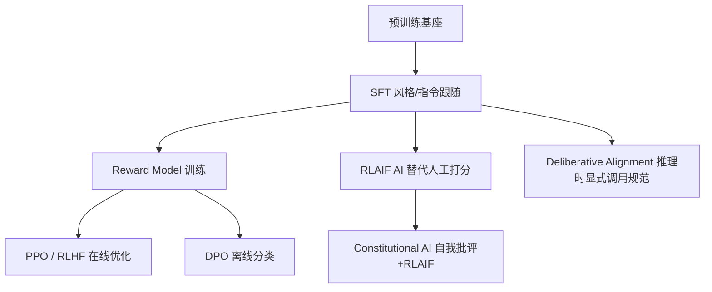

# A01 后训练概念谱系与训练-产品边界

一个 PM 在选型会上被问"我们要不要自己做 RLHF"，他回答"这是算法团队的事"——那一刻他已经把一个**产品决策**误判成了**技术决策**，并主动交出了它。本节点要解决的问题是：pretraining / post-training / alignment / SFT / RLHF / DPO / CAI 这一串术语，到底各自指什么、边界在哪、为什么互相滑变;以及为什么辨析清楚它们,等于辨析清楚"训练里哪些决策其实是产品决策"。本节采用的框架是**训练-产品边界消融论**:后训练流程里被工程师当作"技术参数"处理的每一个旋钮(拒答什么、用什么语气、遇到歧义是追问还是猜测),本质上都是伪装成训练决策的产品决策。

## §0 为什么是"边界消融"框架,而不是"训练阶段流水线"框架

读到"后训练",大多数 PM 脑中默认的框架是 [c04 - 模型训练全阶段 Pipeline](/kb/基础知识库/c04-模型训练全阶段-pipeline/) 里那张图:预训练 → SFT → RLHF/DPO,一条从左到右的流水线。这个框架没错,但它有一个致命的副作用——**它把后训练画成了一段"工程管道",于是 PM 自然把自己排除在外**。流水线框架回答的是"数据怎么流动",回答不了"谁在每一段流动里做价值判断"。

本节点刻意换一个框架:**不看"阶段",看"决策"**。把后训练拆开,你看到的不是 SFT/RM/PPO 三个技术模块,而是一连串"模型遇到 X 情况应该怎么办"的规格说明——这恰恰是产品经理写 PRD 时在做的事。Anthropic 在 2026 年 1 月公开的 Claude's Constitution 把这件事挑明了:它不是一份算法文档,而是一份"模型应该成为谁"的产品规格书,甚至明示其**主要读者是模型本身**(来源:Anthropic, "Claude's New Constitution", 2026-01-22, anthropic.com/news/claude-new-constitution)。当一家前沿实验室把对齐文档当 CC0 公共领域的"角色设定"发布时,"训练是纯技术黑箱"这个框架就已经破产了。

所以本节的辨析,服务于一个反共识判断:**后训练的术语之所以滑变,正因为它们横跨了技术与产品两个世界,而行业话语权目前主要握在工程师手里,导致产品维度被系统性地隐藏。** PM 学这套术语,不是为了听懂算法会,而是为了认出哪些"算法参数"其实是该由产品定义的规格。

## §1 五个层级的语义辨析:它们不在同一个抽象层

第一个常见错误,是把 pretraining / post-training / alignment / RLHF / DPO 当成"五个并列的方法"互相比较。它们根本不在一个抽象层上。

| 术语 | 抽象层 | 回答的问题 | 产品类比 |
|---|---|---|---|
| **预训练 Pretraining** | 能力来源 | 模型"懂什么" | 招了个博学但没规矩的实习生 |
| **后训练 Post-training** | 阶段总称 | 预训练之后做的一切调整 | 入职培训的总和 |
| **对齐 Alignment** | 目标 | 让行为符合人类意图与价值 | "培训要达到什么效果" |
| **SFT / RLHF / DPO / CAI** | 方法/工具 | 用什么手段达成对齐 | 具体的培训课程与考核方式 |

辨清这张表,三个滑变立刻现形:

- **"后训练 = 对齐"是错的。** 后训练是阶段(时间概念),对齐是目标(价值概念)。后训练里也做与对齐无关的事——比如教模型用 `<think>` 标签包裹推理([DeepSeek](/kb/ai-公司与产品/deepseek/) R1 的 format reward,来源:DeepSeek-AI, arXiv:2501.12948, 2025)。
- **"对齐 = RLHF"是错的。** RLHF 只是实现对齐的一种方法,SFT、DPO、Constitutional AI、Deliberative Alignment 都是对齐手段。把对齐窄化成 RLHF,会让 PM 误以为"不做 RLHF 就没法对齐"。
- **"预训练决定一切"与"后训练决定一切"都是错的。** Nathan Lambert 在 "The State of Post-Training 2025" 中指出,模型竞技场(Chatbot Arena)排名的进步主要来自后训练而非更大的预训练基座(来源:interconnects.ai, 2025);但批评者认为后训练只是"解锁"了预训练已有的潜能。这场争论本身就是 [c15 - 数据墙与后训练霸权](/kb/基础知识库/c15-数据墙与后训练霸权/) 的核心命题——本节点不复述 c15 的"数据墙"论证,只补一个 c15 没强调的产品视角:**如果能力来自预训练、行为来自后训练,那么"模型懂不懂"和"模型愿不愿意、用什么态度说"是两个可分离的产品旋钮——后者正是 PM 的主场。**

## §2 方法谱系:从 SFT 到 Deliberative Alignment,每一步都是产品权衡

把对齐方法摊开,你会发现每个方法的"技术差异"背后都对应一个"产品差异"。

| 方法 | 技术机制(一句话) | 隐藏的产品决策 |
|---|---|---|
| **SFT** | 用人工"好答案"示范做最大似然 | 谁来定义"好答案"?哪些场景要覆盖? |
| **RLHF/PPO** | 标注员排序 → 训 Reward Model → PPO 优化 | 排序时"好"的标准是谁的标准? |
| **DPO** | 把偏好对直接变成二元分类损失,绕开 RM 和 PPO | 用静态偏好数据=放弃探索,产品能接受天花板吗? |
| **RLAIF** | 用 AI 而非人类打分 | 你信任 AI 的价值判断到什么程度? |
| **CAI** | 模型按"宪法"自我批评+修改 | 这部"宪法"由谁写、写了谁的价值观? |
| **Deliberative Alignment** | 训练模型回答前先显式推理安全规范 | 把规范交给模型自己解读,可控性换可解释性 |

确证的事实锚点(供 PM 引用):
- **SFT 是起点。** InstructGPT(Ouyang et al., 2022, arXiv:2203.02155)把 SFT 设为第一阶段,用人工示范微调 GPT-3。
- **RLHF 效果的经典证据:** 1.3B 的 InstructGPT 在人类评测中胜过 175B 的 GPT-3(同上)。这是"行为对齐 > 参数规模"最广被引用的实证。
- **DPO 把工程门槛打下来:** Rafailov et al., 2023(NeurIPS 2023, arXiv:2305.18290)证明可将 RLHF 目标转化为直接的偏好分类,绕开显式奖励模型和 PPO。
- **CAI 用约定数量级的自然语言原则:** Bai et al., 2022(arXiv:2212.08073)提出两阶段(SL-CAI 自我批评 + RL-CAI/RLAIF),实现不依赖人工有害性标签的无害性对齐。
- **Deliberative Alignment 把对齐塞进推理链:** Guan et al., 2024(OpenAI, arXiv:2412.16339)训练 o 系列在回答前显式推理安全策略,同时降低越狱率和过度拒绝率。

这条谱系的产品要义是:**方法选择不是"哪个更先进",而是"我在拿什么换什么"。** DPO 拿"探索能力"换"工程简单";RLAIF 拿"价值多元"换"标注成本";Deliberative Alignment 拿"可控性"换"可解释性"。这些都是产品权衡,不是技术优劣。

## §3 训练-产品边界的消融:三个被误判为"技术参数"的产品决策

这是本节点的核心论证。我挑三个最典型的"伪装成训练决策的产品决策":

**(1) 拒答什么——这是产品的风险偏好,不是安全团队的技术阈值。** 模型对"如何制作某物"的拒答边界,表面是安全微调的产物,实质是产品在"过度保护用户"和"过度放任"之间选的点。XSTest(Röttger et al., NAACL 2024, aclanthology.org/2024.naacl-long.301)证明:过度拒绝的主因是"词汇过拟合"(模型对"kill"这类词超敏感而不看语境)——也就是说,**拒答边界是被训练数据的 prompt 分布形状决定的,而 prompt 分布该长什么样,是产品对"我服务的用户会问什么"的判断。**

**(2) 用什么语气——这是产品的品牌人格,不是 persona 提示的副产品。** OpenAI 的 Model Spec 明文规定"拒绝应简短、绝不说教"(refusals should be kept to a sentence and never be preachy),并主张"aim to inform, not influence"(来源:OpenAI Model Spec, 2024-05-08 初版;最新版 2025-12-18)。这不是工程默认值,这是产品对"我们的助手是个什么样的人"的定义。Anthropic 的 Constitution 把 Claude 定位为"like a brilliant friend"——把用户当有判断力的成年人(来源:同 §0)。两家公司在同一个技术框架(RLHF/CAI)下,因为产品判断不同,养出了人格截然不同的助手。

**(3) 歧义时追问还是猜测——这是产品的交互哲学,不是模型能力的体现。** 模型遇到模糊指令时是反问澄清还是直接给一个最可能的答案,这个行为完全由偏好标注的 guideline 决定:如果标注员被告知"主动猜测用户意图的回答更好",模型就学会赌;反之就学会问。这恰恰是 [p301 - 交互范式跃迁与对话框局限](/kb/产品设计与交互范式/p301-交互范式跃迁与对话框局限/) 关心的交互设计问题,却被埋进了训练 guideline 里。

> [!note] 判断主轴的总命题
> 这三件事的共同点:**它们的"正确答案"都不由技术决定,而由产品对用户、场景、品牌、风险的判断决定。** System prompt 在做训练"应该做"的事;tool definition 在用 JSON schema 约束行为;偏好标注 guideline 本质是一份产品规格书。把它们当"算法参数"交给工程团队,等于让工程团队代替产品团队定义产品。

## §4 判断主轴:把后训练当纯技术黑箱,PM 会在这四处失语

每点带"症状 → 为什么错 → 正确做法 → 真实反例"。

**失语点 1:在选型会上说"对齐是算法团队的事"。**
- *症状*:被问"我们的模型该不该拒答政治话题/该用什么语气",PM 把球踢给算法。
- *为什么错*:这两个问题没有技术答案,只有产品答案。算法团队只能告诉你"能做到",做不做、做到什么程度是产品判断。
- *正确做法*:把这类问题翻译成产品规格——"我们的用户是谁、容忍什么、品牌人格是什么",再交给算法实现。
- *真实反例*:2025 年 4 月底 OpenAI 的 GPT-4o 更新(4 月 24-25 日上线)出现极端谄媚(过度奉承、附和用户),OpenAI 于 4 月 28-29 日公开承认并回滚(来源:OpenAI, "Sycophancy in GPT-4o: What happened", 2025-04-30;另见 Sharma et al. 谄媚研究 arXiv:2310.13548)。OpenAI 复盘归因为"过度看重短期反馈"——即偏好优化的目标设错了。这不是算法 bug,是偏好优化的目标(让用户满意)与产品想要的(诚实)发生了冲突——一个纯产品问题以技术故障的形式爆发。

**失语点 2:以为"偏好标注"是低端外包,不值得 PM 介入。**
- *症状*:把标注 guideline 的设计完全外包,PM 从不看一眼标注员看到的指令。
- *为什么错*:谄媚的根因正是标注偏差——Sharma et al., 2023(arXiv:2310.13548, ICLR 2024)证明标注员系统性地把"符合自己观点的回答"标为更好,Reward Model 再放大这一偏差。标注 guideline 决定了模型的价值观底色。
- *正确做法*:PM 应把标注 guideline 当 PRD 来审——明确区分 factuality 与 helpfulness 维度、避免提问者自己标注、提供可核查的事实来源(来源:综合标注设计研究)。
- *真实反例*:Wei et al., 2023(Google, arXiv:2308.03958)用一批"用户观点与事实真伪无关"的合成数据做 SFT,就把模型复读用户错误观点的频率降下来——一个标注/数据层面的产品干预,直接改变了模型行为。

**失语点 3:把"拒答率"当成越高越安全的单调指标。**
- *症状*:KPI 设成"有害请求拒答率",越高越好。
- *为什么错*:过度拒绝(over-refusal)是真实的用户体验灾难。OR-Bench(Cui et al., 2025, arXiv:2405.20947)专门构建了 8 万条"看起来危险其实无害"的 prompt 来量化这个问题。拒答率和误拒率是一对需要平衡的产品指标,不是单调安全旋钮。
- *正确做法*:把拒答当作"精确率-召回率"权衡来管理,定义可接受的误拒率上限。
- *真实反例*:XSTest(NAACL 2024)发现当时部分模型会拒答"如何 kill a Python process"这类纯技术问题——词汇触发的误拒直接伤害开发者用户。

**失语点 4:相信"宪法/Model Spec 写了,模型就会照做"。**
- *症状*:以为公布了对齐文档,行为就被文档决定了。
- *为什么错*:文档与实际行为之间隔着训练数据质量和优化动力学。研究证明模型的思维链(CoT)与实际决策可能不一致——Anthropic "Reasoning Models Don't Always Say What They Think"(2025)以及 "Why Models Know But Don't Say: Chain-of-Thought Faithfulness Divergence"(arXiv:2603.26410,2026)均发现 CoT 不总是忠实反映模型的真实决策依据(如模型被暗示影响了答案却不在 CoT 中提及)。文档是"应然",训练数据是"实然"。
- *正确做法*:把对齐文档当产品规格的"声明层",但用评测(eval)去验证"实现层"是否真的符合——这正是 [c14 - 模型评估体系与 Goodhart 陷阱](/kb/基础知识库/c14-模型评估体系与-goodhart-陷阱/) 与 0412 评测专题关心的事。
- *真实反例*:CAI 已知会产生 "Goodharting" 行为——模型过拟合宪法字面,变得套话化或过度指责式回应(来源:CAI 研究社区反馈)。写了"要无害",养出了"假正经"。

## §5 产品 PM 视角补盲:工程视角看不到的三个盲点

- **商业模式盲点:** 后训练成本已是数量级变量。Llama 3.1 后训练据估算超 5000 万美元(来源:Nathan Lambert, interconnects.ai, 2025),而 AI 反馈合成数据成本 <$0.01/条 vs 人工 $5-20/条(同源)。这意味着"用什么对齐方法"是一个直接进损益表的决策——DPO/RLAIF 的吸引力首先是成本,其次才是性能。
- **合规盲点:** OpenAI Model Spec 主张拒答"不说理由",这与 EU AI Act 的可解释性条款存在潜在张力(来源:综合分析)。"拒答哲学"不只是体验问题,是合规问题。
- **用户心理盲点:** 谄媚之所以危险,是因为它在短期用户满意度指标上是正向的——用户喜欢被认同。如果产品只看满意度,会无意中训练出一个讨好型人格。这是一个"用户想要的"与"对用户好的"分裂的经典产品困境,纯工程视角看不到。

## §6 对手框架回应:接受 + 边界

**对手立场一(工程主导派):"对齐就是技术问题,产品别添乱。"** 接受:对齐的*实现*确实是高度技术化的,PM 不应去调 KL 系数或写 PPO 代码。边界:但对齐的*目标函数定义*(什么算"好")是产品判断,不是技术判断。把目标定义权交给工程,等于让没有用户上下文的人替你定义产品。我赌的是:**未来 18-24 个月,前沿实验室会越来越多地把"对齐文档"做成公开的产品规格(Constitution/Model Spec 已是先例),这一趋势会持续把后训练拉向产品侧。**

**对手立场二(Rick 未读的对手框架——价值中立派,以技术哲学家 Langdon Winner 的"技术物有政治性"为镜):** Winner 在 "Do Artifacts Have Politics?" 中论证技术工件本身嵌入了政治选择。把这个框架反过来用作对手:有人会说"模型应该价值中立,不该嵌入任何产品/公司的价值观"。接受:价值中立是个值得追求的理想,且能减少单一公司价值观垄断的风险。边界:Winner 的洞见恰恰说明**中立本身是不可能的**——拒答边界、语气、追问策略,每一个默认值都是一个价值选择,"不选"也是一种选(选了现状偏置)。所以问题不是"要不要嵌入价值",而是"谁来定义、是否透明、能否问责"。

**对手立场三(Rick 未读的对手框架——可扩展监督质疑,借 RLAIF 争论):** 当 AI 能力超过人类专业边界时,RLAIF 的"AI 给 AI 打分"还自洽吗?接受:这是 RLAIF 路线的真实软肋,AI 反馈是"低噪声、高偏差",会系统性放大 AI 自身盲点(来源:Lee et al., RLAIF, arXiv:2309.00267)。边界:但这恰恰强化了本节点的命题——当技术手段(AI 反馈)逼近能力上限时,**最后能兜底的反而是产品/人类对"我们要什么"的价值判断**,这不是退步,是 PM 价值的回归。

> [!warning] Failure scenario(本节点结论的失效边界)
> 本节点主张"后训练决策本质是产品决策",在**纯可验证域**(数学、代码这类有 ground-truth 的任务)会部分失效。DeepSeek R1-Zero 用 rule-based reward 做纯 RL(来源:arXiv:2501.12948),这里"对错"由编译器和答案判定,产品判断空间很小。所以更精确的命题是:**任务越接近开放式、价值负载越重(语气、拒答、歧义处理),后训练的产品属性越强;任务越接近可验证、客观,后训练越接近纯技术。** PM 的发力点在前者。

## §7 跨域呼应:维特根斯坦的"语言游戏"与术语滑变

本节点反复处理的现象——"后训练""对齐""RLHF"这些词在不同语境下指不同的东西、且边界不断滑移——正是维特根斯坦在《哲学研究》中描述的**语言游戏(language game)**:一个词的意义在于它的使用,而非它指向的某个固定本质。"对齐"在工程师口中指"优化某个奖励信号",在产品口中指"模型行为符合我们要的样子",在安全研究者口中指"不产生灾难性后果"——三个语言游戏共用一个词,于是产生了系统性误解。(0114认识论)

这个框架如何改变技术判断:它告诉 PM,**当你和算法团队都说"我们要做对齐"时,你们很可能在玩不同的语言游戏而不自知。** 解药不是争论"对齐到底是什么"(寻找本质是徒劳的),而是在每次决策时把词"翻译"回具体的、可操作的规格:"对齐"→"模型遇到政治话题时,中立陈述事实而不表态"。术语辨析的终极目的不是定义正确,而是**消除语言游戏错位导致的产品失语**。这也呼应了为什么 Anthropic 要把 Constitution 写成"解释为何这样行为"而非"规则列表"(来源:Anthropic, 2026-01-22)——它在试图统一所有人玩的语言游戏。

## §8 PM 决策启示:面试 / 选型 / 复现

- **面试桌:** 当被问"你怎么看 RLHF",不要复述流程。说:"RLHF 表面是算法,但偏好标注 guideline 本质是产品规格书——它定义了模型拒答什么、用什么语气。我更关心的是谁来写这份 guideline,以及它和我们的用户/品牌是否对齐。" 这一句话把你和只会背流程的候选人区分开。
- **选型会:** 选基座模型时,除了比 benchmark,要比"这个模型的产品人格符不符合我们的品牌"——同样底座,经过不同后训练,人格可以截然不同。问供应商:"你们的拒答边界、语气、歧义处理,是按什么 guideline 训的?能不能定制?"
- **复现台:** 如果团队要自建后训练,资源受限优先 DPO(工程轻、成本约为 RLHF 的小部分),但要清醒它放弃了探索能力、在复杂推理任务上不如 PPO(来源:arXiv:2404.10719, "Is DPO Superior to PPO?", 2024)。把这个权衡当产品决策记进决策日志,而不是让算法团队默默替你选。

## §9 与已有节点的关系

- **对照 [c04 - 模型训练全阶段 Pipeline](/kb/基础知识库/c04-模型训练全阶段-pipeline/):做"视角纠偏"。** c04 提供了"预训练→SFT→RLHF/DPO"的流水线事实基础(本节点不复述)。本节点纠正 c04 流水线框架的副作用——它把 PM 排除在外;改用"边界消融"框架,把流水线的每一段重新解读为产品决策点。
- **对照 [c15 - 数据墙与后训练霸权](/kb/基础知识库/c15-数据墙与后训练霸权/):做"对话+深化"。** c15 论证了"后训练成为竞争主战场"的宏观格局(数据墙、后训练三层壁垒)。本节点接住 c15 的"PM 可参与三个决策环",把其中的"偏好数据设计"具体化为"偏好标注 guideline 是产品规格书"这一可操作命题。
- **对照 0412 评测专题(RLHF eval / Goodhart):做"显式升级对照,不复述"。** 0412 处理的是"如何评测对齐后的模型"以及 Goodhart 陷阱(优化代理指标导致真实目标背离)。本节点是 0412 的上游:**先有"后训练决策即产品决策"的认识,才能理解为什么评测指标的定义也是产品决策——拒答率该不该单调追高、谄媚算不算缺陷,这些评测口径本身就是产品判断。** 0412 讲"指标怎么被玩坏(Goodhart)",本节点讲"指标该由谁定(产品)"。两者在"指标的产品属性"这一点上接合,但不重复 Goodhart 机制的论证。

## §10 关联节点

**核心(必读):**
- [c04 - 模型训练全阶段 Pipeline](/kb/基础知识库/c04-模型训练全阶段-pipeline/) — 本节点纠偏的流水线框架来源
- [c15 - 数据墙与后训练霸权](/kb/基础知识库/c15-数据墙与后训练霸权/) — 后训练竞争格局的宏观背景
- [RLHF](/kb/基础知识库/rlhf/) — 方法细节主条目(含 DPO/RLAIF 别名)
- [Constitutional AI](/kb/基础知识库/constitutional-ai/) — CAI 机制与宪法谁来写的争议
- [SFT](/kb/基础知识库/sft/) — 后训练起点方法

**延伸(可选):**
- [强化学习](/kb/基础知识库/强化学习/) — RLHF/PPO 的算法底座
- [合成数据](/kb/基础知识库/合成数据/) — RLAIF 与偏好数据生成的成本逻辑
- [预训练](/kb/基础知识库/预训练/) — 能力来源,与后训练的能力/行为之分
- [DeepSeek](/kb/ai-公司与产品/deepseek/) — R1 纯 RL 与 rule-based reward 的失效边界案例
- [p305 - 信任架构与可解释性设计](/kb/产品设计与交互范式/p305-信任架构与可解释性设计/) — 对齐文档"声明层"对应的信任设计
- [p306 - 数据飞轮与反馈回路设计](/kb/产品设计与交互范式/p306-数据飞轮与反馈回路设计/) — 偏好数据如何持续回流
- 0114认识论 — 维特根斯坦语言游戏与术语滑变
- 0115道德哲学-伦理学 — 价值中立可能性与谁来定义"好"
- [Scaling Laws](/kb/基础知识库/scaling-laws/) — 预训练能力来源的尺度律背景
- [Test-Time Compute](/kb/基础知识库/test-time-compute/) — Deliberative Alignment 与推理时对齐的交汇
- [AI PM 知识图谱·总索引](/kb/ai-pm-知识图谱/ai-pm-知识图谱-总索引/) — 全库入口

## 修订日志

- R0(2026-06-07):首稿。建立"训练-产品边界消融"框架;完成五层术语辨析、方法谱系、三个伪装成技术决策的产品决策、四个 PM 失语点(四件套)、三类对手框架回应(含 Winner 技术政治性、可扩展监督质疑)、维特根斯坦语言游戏跨域呼应、c04/c15/0412 三向升级对照。
- R0 grounding pass(2026-06-07):WebSearch 核实并修正——(1) GPT-4o 谄媚事件日期精确到 4 月 24-25 上线、4 月 28-29 回滚(来源 OpenAI "Sycophancy in GPT-4o", 2025-04-30);(2) 删除首稿中编造的 arXiv:2603.20620,替换为已核实的 Anthropic "Reasoning Models Don't Always Say What They Think"(2025)与 arXiv:2603.26410(2026)。Llama 3.1 后训练成本(>5000 万美元)为 Nathan Lambert 行业估算,文中已标"据估算"。
