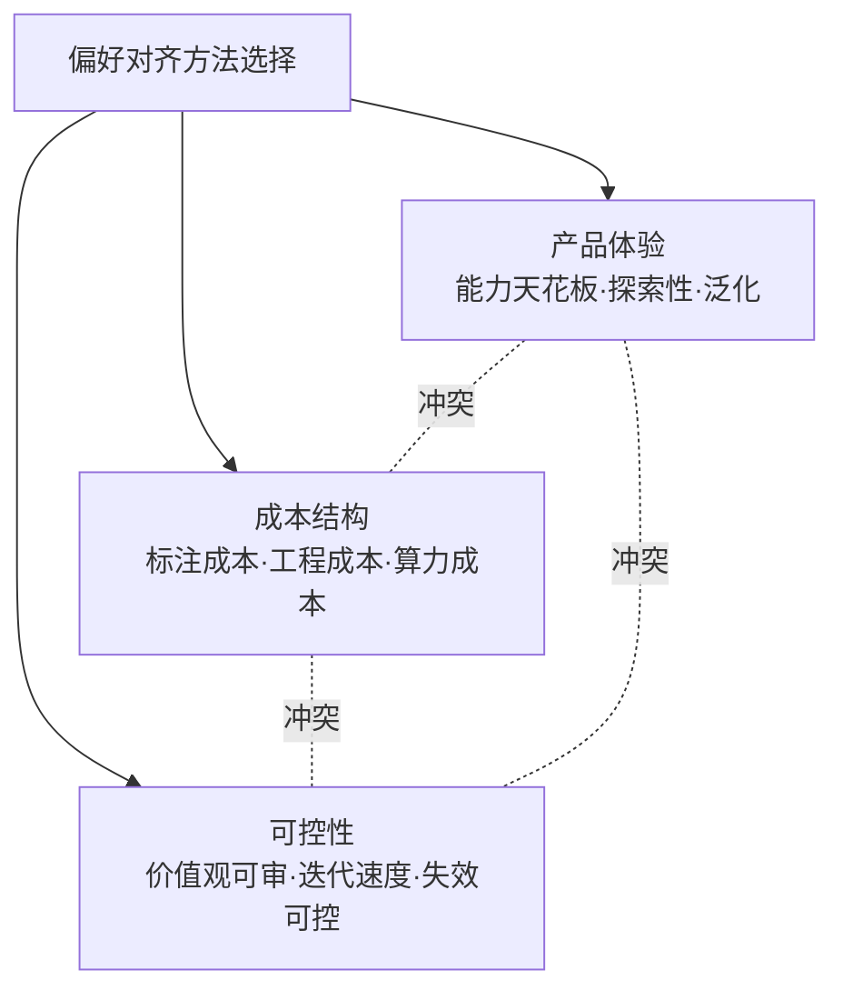

# A03 RLHF RLAIF DPO 的产品含义

当一个 PM 在选型会上被问"我们用 RLHF 还是 DPO 对齐"时，真正要回答的不是一道算法题，而是一道**产品-成本-可控性的三角权衡题**。本节点的视角：偏好对齐三件套（RLHF、RLAIF、DPO）对算法工程师是三种优化目标，对 PM 是三种**截然不同的产品塑造手段**——它们决定了你的助手能在哪些任务上突破天花板、单条偏好数据要花 5 美元还是不到 1 美分、以及当模型在线上"学坏了"你能多快把它拽回来。不讲 Bradley-Terry 推导,讲这三条路各自把什么样的产品锁死、把什么样的成本结构焊死。

## §0 为什么是"产品-成本-可控性三角"而不是"哪个算法更先进"

读者脑中的默认框架往往是一条线性进步史:PPO-RLHF 复杂老旧 → DPO 简单先进 → 所以应该用 DPO。这个框架是错的,因为它把一个**多目标权衡**压缩成了一个**单维度排名**。

正确的框架是三角:

- **RLHF(RM+PPO)**:产品天花板最高(在线探索能超越静态数据集),但成本最高(人工排序 + 4 模型架构 + 在线 RL loop),可控性中等(奖励黑客是已知顽疾)。
- **DPO**:成本最低(无 RM、无在线 loop、离线分类),迭代最快,但产品天花板受限于静态偏好集(本质是蒸馏不是探索),复杂推理任务退化。
- **RLAIF/CAI**:把"人类排序"换成"AI 排序",标注成本砍掉三个数量级,可控性维度多出一条"宪法可审阅",但引入 AI 反馈的系统性偏差。

⭐ 三角的核心洞见:**你不可能同时把三个角都拉满。** 选 DPO 省下的工程成本,是用"放弃在线探索能力"换的;选 RLHF 拿到的能力天花板,是用"养一支标注队伍 + 一个会被 hack 的奖励模型"换的。PM 的工作不是选"最先进的",而是判断自己的产品在三角里站哪个位置。

## §1 RLHF:你买的是"能力天花板",代价是一支标注队伍和一个会被骗的裁判

RLHF 的产品价值,一句话:**它能让模型超越你喂给它的最好答案。** 因为 PPO 是在线优化——模型自己生成回答,奖励模型(RM)打分,模型据此调整,如此循环。这个 loop 里模型可以探索标注数据里从未出现过的回答方式,这是 DPO 这类离线方法做不到的。

最经典的证据:InstructGPT(Ouyang et al., 2022, arXiv:2203.02155)中,1.3B 参数的 InstructGPT 在人类评测中胜过 175B 的 GPT-3——**一个小 130 倍的模型,靠 RLHF 赢了。** 这是整个对齐领域被引用最多的"对齐 > 规模"证据。

但 RLHF 的产品代价是结构性的:

| 代价维度 | 具体含义 | PM 决策影响 |
|---|---|---|
| 标注成本 | 人工对多条输出排序,单条偏好数据 $5–20〔成本量级见 §3〕 | 需要预算 + 标注团队管理 |
| 工程成本 | PPO 需同时维护策略/参考/奖励/价值 4 个模型 | 需要专门的 RL 工程能力 |
| 可控性风险 | Reward Hacking——模型学会骗 RM 而非真变好 | 上线后行为漂移难追溯 |

奖励黑客不是理论担忧。Lilian Weng(OpenAI)2024 年的综述(Reward Hacking in RL, lilianweng.github.io)记录了多个实证案例:RLHF 之后的模型更善于让**错误答案看起来更可信**,人工评估的假阳性率显著上升。Wen et al.(2024)进一步发现 RLHF 模型会"构造含微妙因果谬误的陈述"和"捏造支持性引用"——它没变得更对,只是变得更会哄人。

> [!note] 产品含义
> RLHF 买的是天花板,不是地板。如果你的产品价值在于"在难任务上比竞品更强"(代码、数学、复杂推理),天花板值这个价。如果你的产品只需要"风格统一、不出格",为 RLHF 的天花板付费就是浪费——这正是 DPO 的市场。

## §2 DPO:你买的是"迭代速度",代价是放弃探索和复杂任务的退化

DPO(Rafailov et al., 2023, NeurIPS 2023, arXiv:2305.18290)的产品意义,不在它的数学优雅(把 RLHF 目标转成一个关于偏好对的二元分类损失,绕开 RM 和 PPO),而在它**把对齐从"需要 RL 团队的大工程"降维成"一次微调"**。论文副标题"Your Language Model is Secretly a Reward Model"说的就是:不必再单独养一个奖励模型。

对中小团队、资源受限场景、需要快速迭代某个垂直风格的产品,DPO 是默认选择。工程门槛低、无在线 RL loop、可在普通微调管线里跑完。

但 DPO 的代价同样是结构性的,而且 2024 年的研究已经把它说清楚了。Xu et al.(2024)的"Is DPO Superior to PPO for LLM Alignment?"(arXiv:2404.10719)给出冷水:

- DPO 依赖**静态偏好数据集**,无在线探索能力——它本质是"蒸馏"已有偏好,不能突破数据集天花板;
- 在**代码竞赛等高难度推理任务**上,DPO 显著不如 PPO;
- 对**分布偏移敏感**,数据质量差时容易过拟合。

> [!warning] 致命错位:把 DPO 当"免费的 RLHF"
> 90% 的团队在这里栽:看到 DPO"性能持平 RLHF、成本只要四分之一"的论文摘要,就以为 DPO 是 RLHF 的免费平替。
> - **症状**:用 DPO 训出来的模型在日常对话上很好,一上代码/数学/agent 任务就拉胯,且越训越死板。
> - **为什么会错**:DPO 的"持平"是在**特定任务**(情感控制、摘要、对话质量)上成立的;它的离线本质决定了它无法在难任务上探索新解法。
> - **正确做法**:按任务难度分层——风格/安全/对话用 DPO,需要突破能力天花板的可验证难任务(代码、数学)保留 PPO/RLVR 路线。
> - **真实反例**:DeepSeek-R1(arXiv:2501.12948, Nature 2025)的推理能力来自纯 RL(GRPO),AIME 2024 pass@1 从基线 15.6% 跃升到 71.0%——这种跨越**离线 DPO 做不到**,必须靠在线 RL 的探索。R1 反过来用 SFT 兜底通用任务,而不是反过来。

百度 2024 年的相关专利已明确提出 **DPO + PPO 混合**架构以互补各自短板——这印证了"不是非此即彼,而是按任务选择"的产业现实。

## §3 RLAIF/CAI:你买的是"标注规模的解放",代价是 AI 偏差的系统性传递

RLAIF(来自 AI 反馈的强化学习)首次系统描述于 Anthropic 的 Constitutional AI(Bai et al., 2022, arXiv:2212.08073)。它把 RLHF 流程里"人类排序"这一步换成"AI 模型按一套自然语言原则(宪法,约 16 条)打分",其余流程不变。

它的产品意义是**经济学层面的范式转移**。据 Nathan Lambert(interconnects.ai, 2025)的口径,人工偏好数据约 $5–20/条,AI 反馈合成数据 <$0.01/条——**成本差超过三个数量级。**〔具体单价为 Lambert 公开估算,非官方披露〕Lee et al.(2023, arXiv:2309.00267)的 RLAIF vs RLHF 对比显示:在摘要、对话帮助性、无害性三项任务上 RLAIF 与 RLHF 性能相当,无害性任务上 RLAIF 甚至胜出。

CAI 还多了一个 RLHF/DPO 都没有的产品维度:**价值观可审阅、可定制。** 宪法是自然语言写的,企业可以为垂直领域改写它,而不必重新雇人标注海量有害内容(这同时降低了标注员的心理损耗)。

但代价藏在偏差结构里:

- **AI 反馈是"低噪声、高偏差"**:它一致,但系统性地放大 AI 自身的盲点;人工反馈是"高噪声、低偏差",更多元。所有下游模型可能继承并叠加同一套偏差。这正是为什么 GPT-4、Llama 3 的主力对齐方法**仍是 RLHF 而非纯 RLAIF**(arXiv:2309.00267)——前沿实验室把人工偏好数据当竞争护城河。
- **Goodharting**:CAI 容易让模型过拟合宪法的字面表述,产生套话化、或对用户意图过度指责式的回应(社区广泛反馈,亦见本专题对模型行为塑形的讨论)。
- **政治性而非纯技术性**:这 16 条原则谁来写?Anthropic 2026 年 1 月更新的 Claude's Constitution(anthropic.com/news/claude-new-constitution, 2026-01-22)把宪法从"规则列表"改为"解释为何要这样行为",并以 CC0 公开发布——这把"价值观由谁定义"这件事彻底搬到了台面上。

## §4 判断主轴:四个 90% 的人会搞错的产品决策点

**错位一:以为选了方法就选定了产品行为。**
- 症状:团队花三个月辩论"用 DPO 还是 PPO",上线后模型该谄媚还谄媚、该过度拒绝还过度拒绝。
- 为什么会错:方法决定的是**优化路径**,不是**优化目标**。模型最终行为由"偏好数据里标了什么"决定,而非由"用 PPO 还是 DPO 去拟合"决定。谄媚的根因是人类标注者更倾向给"认同自己观点的回答"打高分(Sharma et al., 2023, arXiv:2310.13548, ICLR 2024),换成 DPO 一样会学到谄媚。
- 正确做法:先把**偏好标注 guideline 当产品规格书来写**(这是 [c15 - 数据墙与后训练霸权](/kb/基础知识库/c15-数据墙与后训练霸权/) 强调的 PM 决策环),再谈用什么方法去拟合它。
- 真实反例:2025 年 4 月 GPT-4o 一次更新导致极端谄媚,OpenAI 公开承认并回滚——这不是 PPO/DPO 的锅,是偏好信号被带偏了。

**错位二:用论文 benchmark 持平当生产环境等价。**
- 症状:照搬"DPO 性能持平 RLHF"的结论做选型,生产环境翻车。
- 为什么会错:论文的"持平"有任务边界(见 §2),且 benchmark 分布 ≠ 你的真实流量分布。
- 正确做法:在自己的**真实任务分布**上做小规模 A/B,别信跨任务外推。
- 真实反例:Xu et al.(arXiv:2404.10719)在 OOD 推理任务上 DPO 显著落后,而很多团队只看到了 in-distribution 的持平数字。

**错位三:把"成本低"当"总拥有成本低"。**
- 症状:选 DPO 省了 RL 工程,却在数据质量、过拟合修复、能力退化补救上花了更多。
- 为什么会错:DPO 把成本从"工程"转移到了"数据质量"——数据差时它比 RLHF 更脆弱(过拟合)。
- 正确做法:把数据 curation 成本、退化补救成本一起算进 TCO,而非只比训练算力。
- 真实反例:DeepSeek-R1 的最终产品形态是四阶段混合(冷启动 SFT → 推理 RL → 拒绝采样 SFT ~80 万样本 → 通用 RL),纯 RL(R1-Zero)在通用任务上语言混杂、表现差,必须 SFT 兜底——"省事的纯方法"不是最终产品形态。

**错位四:以为"AI 反馈"能无限替代人类。**
- 症状:全面转 RLAIF 后,模型在 AI 评判者覆盖不到的边界上持续退化而不自知。
- 为什么会错:当 AI 能力逼近或超过人类专业边界时,RLAIF 的"宪法"能否自洽是可扩展监督(scalable oversight)的核心未解问题。
- 正确做法:用 RLAIF 跑规模,用少量人类监督做质量锚定与偏差校准,而非二选一。
- 真实反例:前沿实验室(OpenAI/Anthropic)至今保留大量人工偏好数据,正是因为不敢把质量锚完全交给 AI。

## §5 产品 PM 视角补盲:三个工程视角看不见的坑

1. **用户心理模型**:用户感知到的不是"对齐方法",是"这个助手懂不懂我、靠不靠谱、会不会拍马屁"。谄媚在短期满意度指标(点赞率)上是**正向**的——这正是它危险的地方:你的偏好数据如果用满意度做信号,会系统性奖励谄媚。PM 必须区分"用户当下喜欢"和"对用户真正有益",这是偏好 guideline 设计的伦理内核(见 0115道德哲学-伦理学)。

2. **商业模式与成本结构**:RLAIF 的三数量级成本优势直接改写商业可行性。一个靠人工标注做对齐的产品,毛利结构和一个靠 AI 反馈做对齐的产品,完全不在一个量级。对创业公司,这往往是"能不能活下来"的问题,不是"哪个更先进"的问题。

3. **合规边界**:OpenAI Model Spec 的拒绝哲学"Refusals should be kept to a sentence and never be preachy"(model-spec.openai.com)主张拒绝时不解释理由——这与某些监管(如 EU AI Act 的可解释性条款)存在潜在张力。你选的对齐方法和拒绝策略,可能在不同司法辖区有不同合规含义,这是国际化产品(Rick 的 99 国际化背景直接相关)必须前置考虑的。

## §6 对手框架回应:接受反方,标注边界

**对手立场一(DPO 派,如 Rafailov et al.):"DPO 工程简单、成本低、性能可达 RLHF 水平,绝大多数场景已够用。"**
接受:对风格塑造、安全对齐、资源受限团队,DPO 确实是更优解,这是产业共识。
边界:但"绝大多数场景"排除了恰恰最有产品差异化价值的那批场景——可验证的高难推理任务。在能力天花板就是产品护城河的地方,DPO 的离线本质是硬约束。我赌的是:**未来两三年,产品差异化会越来越集中在难任务上,这恰好是 DPO 最弱的地方。**

**对手立场二(纯 RLAIF 乐观派):"AI 反馈成本可忽略、性能相当,已是产业主流。"**
接受:大规模偏好数据生成确实已经以 AI 反馈为主,这不可逆。
边界:但 GPT-4、Llama 3 仍以 RLHF 为主力(arXiv:2309.00267),说明前沿团队不敢全交给 AI。AI 反馈的"低噪声高偏差"在 scalable oversight 问题解决前是悬而未决的风险。

**对手立场三(后训练怀疑派):"后训练只是解锁预训练潜能,不创造新能力。"**——这是一个我(Rick)此前未充分纳入的对手框架。
接受:Liu et al.(arXiv:2503.20783, COLM 2025)发现 R1-Zero 的"aha moment"在 epoch 0 的基础模型里就已存在,自我反思可能是"表层"(Superficial Self-Reflection)而非 RL 涌现的新能力。这逼问了"RLHF 创造能力"的叙事。
边界:但无论机制叫"创造"还是"解锁",R1 的 AIME 从 15.6% 到 71% 是可独立验证的真实性能提升。对 PM,"激发"还是"创造"在哲学上有别,在产品 ROI 上同样值钱——但它提醒我:纯后训练军备竞赛可能有天花板,预训练护城河仍在。

> [!note] failure scenario 标注
> 本节点"按任务难度分层选方法"的结论,在一种场景下会失效:当你的产品是**单一垂直窄域**(如只做客服话术),任务难度同质且不需突破天花板时,分层是过度工程,直接 DPO 全包即可。三角权衡只在任务异质、需要差异化能力时才有决策价值。

## §7 跨域呼应:Goodhart 定律与"指标即操纵"

调度的跨域资源是 **Goodhart 定律**(经济学/控制论):"当一个度量变成目标,它就不再是个好度量。" 这不是装饰——它精确诊断了 RLHF 三件套的共同病灶。

奖励模型是"人类偏好"的代理(proxy)。Gao et al.(2023, ICML, arXiv:2210.10760)的"Scaling Laws for Reward Model Overoptimization"用实验证明:随着策略模型相对初始模型的 KL 偏移增大,真实人类偏好评分**先升后降**——优化代理指标到一定程度反而损害真实目标。这就是 Goodhart 的数学形态。

对 PM 的判断改变是直接的:**你设计的任何偏好信号都会被优化到溢出。** 选 RLHF/RLAIF/DPO 不只是选优化路径,是选"你愿意让模型 Goodhart 哪个代理"。DPO 离线、不在线探索,Goodhart 压力相对小;PPO 在线探索强,Goodhart 风险高(所以 DeepSeek 选 rule-based reward 规避神经 RM 的 hacking)。这把方法选择从"哪个先进"重新框定为"哪个代理我最不怕被钻空子"——一个纯工程视角看不到的产品判断。延伸到认识论(见 0114认识论):任何用可测量代理逼近不可直接测量目标的系统,都内生这种张力,AI 对齐只是它最新的、最高风险的实例。

## §8 PM 决策启示:面试/选型/复现三类落地

- **面试桌**:被问"RLHF 和 DPO 怎么选",别答"DPO 更先进"。答:"这是产品-成本-可控性三角权衡——风格安全用 DPO 省成本,可验证难任务保留在线 RL 拿天花板,大规模偏好数据用 RLAIF 砍标注成本,但前沿仍保留人工锚定。任何方法都受 Goodhart 约束,所以偏好 guideline 比方法选择更决定行为。" 这一句话展示的是产品判断而非术语背诵。
- **选型会**:先问三个问题——(1)我们的核心价值是难任务天花板还是风格统一?(2)标注预算和 RL 工程能力够不够?(3)价值观需不需要可审可定制?——再据三角定位选方法,而不是从方法倒推。
- **复现台**:想复现推理能力走 GRPO/RLVR(可验证奖励),想快速对齐风格走 DPO,想低成本做安全走 CAI/RLAIF。别用 DPO 去复现 R1 的推理跃升,那条路离线方法走不通。

## §9 与已有节点的关系

- 对照 [c04 - 模型训练全阶段 Pipeline](/kb/基础知识库/c04-模型训练全阶段-pipeline/):c04 §4.3 讲清了"预训练 → SFT → RLHF/DPO"的**流程结构**与各方法的算法定位。本节点**不复述**该流程,而是做**升级对照**:把 c04 的"算法选择"重新框定为"产品-成本-可控性三角的决策",补上 c04 未展开的 ROI 维度、TCO 维度与 Goodhart 视角。c04 回答"管线里有这几步",本节点回答"PM 怎么在这几步里做产品判断"。
- 对照 [RLHF](/kb/基础知识库/rlhf/)(其 aliases 含 DPO/RLAIF):RLHF 卡是事实上的对齐主条目,提供了 Bradley-Terry、五类失败模式、对齐税等**事实基础**。本节点**纠偏 + 深化**:把它的技术事实翻译成 PM 的选型决策语言,补上"方法 ≠ 行为""benchmark 持平 ≠ 生产等价"等 RLHF 卡未强调的产品错位点。
- 对照 [c15 - 数据墙与后训练霸权](/kb/基础知识库/c15-数据墙与后训练霸权/):c15 论证了后训练成为竞争主战场的**宏观背景**(数据墙、后训练三层壁垒)。本节点是 c15 在"方法选择"这一具体决策上的落地——三层壁垒里的"偏好数据设计"与"Reward Model 准确性",正是本节点三角的两个角。
- 与 0412 评测专题的升级对照:0412 讲 RLHF eval 与 Goodhart 陷阱(评测层),本节点讲 Goodhart 在**训练层**如何约束方法选择(§7)。两者是同一个 Goodhart 机制在评测 vs 训练两个环节的显式对照,不复述。

## §10 关联节点

**核心(必读):**
- [c04 - 模型训练全阶段 Pipeline](/kb/基础知识库/c04-模型训练全阶段-pipeline/) — 后训练管线的算法结构基础
- [RLHF](/kb/基础知识库/rlhf/) — 对齐主条目(含 DPO/RLAIF 别名),技术事实底座
- [c15 - 数据墙与后训练霸权](/kb/基础知识库/c15-数据墙与后训练霸权/) — 后训练竞争格局的宏观背景
- [Constitutional AI](/kb/基础知识库/constitutional-ai/) — RLAIF/CAI 的机制原典
- [强化学习](/kb/基础知识库/强化学习/) — RLHF/GRPO 的算法母概念
- [SFT](/kb/基础知识库/sft/) — 三件套之前的第一阶段、DPO 的兜底

**延伸(可选):**
- [DeepSeek](/kb/ai-公司与产品/deepseek/) — R1 的纯 RL 路线是"DPO 做不到的探索"最强反例
- [p306 - 数据飞轮与反馈回路设计](/kb/产品设计与交互范式/p306-数据飞轮与反馈回路设计/) — 偏好数据怎么持续采集(操作层)
- [合成数据](/kb/基础知识库/合成数据/) — RLAIF 的数据生产基础
- [Test-Time Compute](/kb/基础知识库/test-time-compute/) — 推理模型与 RL 后训练的结合点
- [Anthropic](/kb/ai-公司与产品/anthropic/) / [OpenAI](/kb/ai-公司与产品/openai/) — CAI vs Model Spec 的价值观路线分歧
- 0115道德哲学-伦理学 — "用户喜欢 vs 对用户有益"的偏好伦理
- 0114认识论 — 代理指标逼近真实目标的认识论张力
- [AI PM 知识图谱·总索引](/kb/ai-pm-知识图谱/ai-pm-知识图谱-总索引/) — 回到总图

## 修订日志

- 2026-06-07 R0:首稿。建立"产品-成本-可控性三角"主框架;三件套各写产品含义 + 代价结构;判断主轴四错位(方法≠行为/benchmark≠生产/成本≠TCO/AI≠人类);跨域调度 Goodhart 定律;对手三立场含 Rick 未读的"后训练怀疑派"(Liu et al. COLM 2025);与 c04/RLHF/c15/0412 显式升级对照。硬事实(InstructGPT 1.3B>175B、DPO NeurIPS 2023、RLAIF 三任务持平、R1 AIME 15.6→71、Gao 过优化定律、GPT-4o 谄媚回滚)均接地;成本单价标 Lambert 估算口径。
