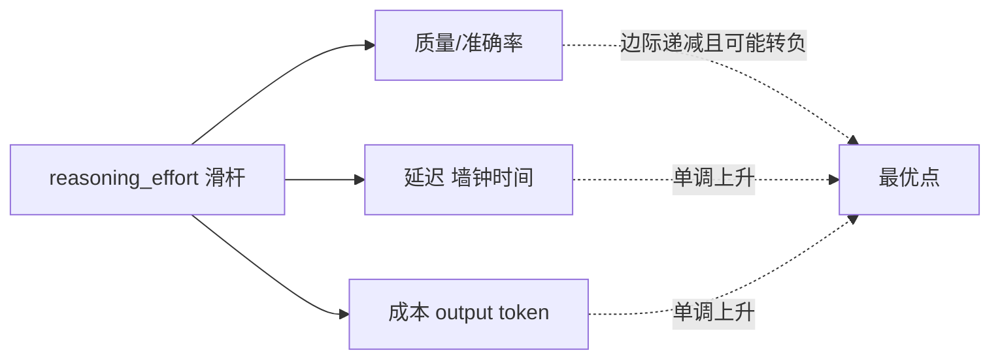

# A04 Reasoning Effort 作为可计费资源

本节点要解决的问题是：当 `reasoning_effort`（low / medium / high / max）变成 API 的一等参数、当"模型思考多久"第一次成为可以**按 output token 费率计费**的连续变量时，PM 该如何理解这件事——它到底是给了你一个**质量开关**，还是一个**质量/延迟/成本三角上的滑杆**？本节的框架是：**reasoning effort 不是开关，是滑杆；不是一次性配置，是按场景定档的连续决策**。这是 PM 第一次能在不重训、不换模型的前提下，对"模型有多聪明"做显式的资源采购。

## §0 为什么是"可计费资源"这个框架，而不是"质量挡位"

读者脑里的默认框架大概率是："effort 就是个质量挡位，重要任务拨到 high，不重要的拨到 low。" 这个框架挡不住三个错误，所以本节点拒绝它。

第一，"质量挡位"暗示挡位越高质量越好——这是**线性进步假设**，本专题反复强调它是错的（见本节判断主轴与 [E02 Reasoning 反噬·过度思考与延迟灾难](/kb/专题-能力与训练/e02-reasoning-反噬-过度思考与延迟灾难/)）。第二，"挡位"是离散的、一次性配置的心智模型，而真实世界里 effort 是**逐请求（per-query）、跟问题难度耦合**的决策——同一个产品里不同请求该用不同档。第三，也是最关键的："质量挡位"完全没有把**钱和时间**画进来。effort 升一档，你买到的不只是质量，是用真金白银（output token）和真实墙钟时间换来的**或然质量提升**。

把它重述为"**可计费资源**"，三件事立刻清楚：(1) 它有**单价**（thinking token 按 output 费率计，通常比 input 贵 2–6 倍，来源：codeant.ai《Why Output & Reasoning Tokens Inflate LLM Costs》2025）；(2) 它有**边际效用曲线**（且常常在高端转负，见 §3）；(3) 它需要**采购决策**（按场景定档，而不是全局拉满）。这就是为什么本节点的判断主轴是"滑杆不是开关"——开关只有开/关，滑杆才有边际、有价格、有最优点。

> [!note] 与 c11 的升级关系
> [c11 - System 2 思维与 Test-Time Compute](/kb/基础知识库/c11-system-2-思维与-test-time-compute/) 已经讲过 System 2、Budget Forcing、Extended Thinking 的产品层存在性。本节点**不复述**这些，只做一件 c11 没做的事：把 effort 从"一个产品功能"升格为"**一类可计费资源的采购模型**"，并给出按场景定档的决策框架。

## §1 effort 是行为信号，不是硬 token 预算

这是 PM 第一个必须吃透的工程事实，否则会把产品需求写错。

以 Anthropic Claude 的 `effort` 参数为例（来源：Claude API Docs / platform.claude.com `build-with-claude/effort`，2025）：`effort` 取值 `low / medium / high / max`（部分版本还有 `xhigh`），但官方明确说明——**effort 是行为信号，不是严格的 token 预算**。即使你设了 `low`，遇到一个足够难的问题，模型仍会触发深度 thinking；反过来设了 `high`，简单问题也未必把预算烧满。更早的 `budget_tokens`（硬预算）参数在 Opus 4.6+ 已被弃用，由 `effort` + adaptive thinking 取代。

OpenAI 的 `reasoning_effort` 同构：取值 `low / medium（默认）/ high`，支持 o1、o3-mini 及后续推理系列，o1-mini 不支持（来源：OpenAI 开发者社区 / Vellum《Reasoning effort LLM parameter guide》2025）。

| 维度 | 旧范式：`budget_tokens` | 新范式：`effort` |
|---|---|---|
| 语义 | 硬上限（最多想这么多） | 行为倾向（倾向于想这么多） |
| 简单问题 | 仍可能烧满预算 | 可能自动跳过 thinking（low）|
| 难问题 | 撞到上限被截断 | 仍会触发深度思考 |
| PM 心智模型 | "我买固定算力" | "我设一个意图，模型自适应" |

**对 PM 的含义**：你不能向上承诺"high 一定花 X 个 token、一定 Y 毫秒返回"。effort 给的是**统计意义上的倾向**，不是 SLA。需要硬延迟保证的场景（如同步 UI 卡在 loading），不能靠 effort 调，要靠超时熔断 + 降级路由（对接 [m209 - 推理成本控制手册](/kb/工程化与落地架构/m209-推理成本控制手册/) 的 cascade 决策）。

## §2 三角滑杆：质量 / 延迟 / 成本同时在动

effort 这一个旋钮，同时拨动三个量。PM 的工作是在这个三角上选点，而不是只盯质量。

- **质量**：在**高难度任务**上，effort 升档可带来 10–30% 的准确率提升（来源：Vellum LLM Parameter Guide 2025）；但在简单任务上增益不显著，甚至转负（见 §3）。
- **延迟**：CoT 类思考可使响应时间增加 35–600%（非推理模型）/ 20–80%（推理模型）（来源：Wharton GAIL《The Decreasing Value of Chain of Thought》2025）。墙钟时间对同步交互是**硬伤**。
- **成本**：单条复杂 query 可产生上万 thinking token；一条复杂 query 烧 10,000 thinking token @ $30/M ≈ $0.30 的 thinking 成本，而可见答案本身可能只值 $0.006——**思考成本是可见答案的 50 倍**（来源：codeant.ai / aioutlooks.com 2025，数量级示意，具体单价随模型版本变化）。

三角的关键性质：**三条边不对称**。质量边会饱和甚至反转，延迟和成本边却**单调上升**。这意味着存在一个"过了就纯亏"的点——再往高拨，你只买到延迟和账单，买不到质量。这正是 [E02 Reasoning 反噬·过度思考与延迟灾难](/kb/专题-能力与训练/e02-reasoning-反噬-过度思考与延迟灾难/) 的实证内核。

## §3 判断主轴：90% 的人在 effort 上会搞错的四个点

> [!warning] 这一节是本节点的命门。每点 = 症状 → 为什么会错 → 正确做法 → 真实反例。

**错点一：把 effort 当"越高越好"的质量旋钮，默认拉到 max。**
- **症状**：产品里所有请求统一设 `high`/`max`，账单暴涨、p99 延迟爆炸，质量却没明显提升。
- **为什么会错**：误用了线性进步假设，没看边际效用曲线在高端转负。
- **正确做法**：默认 `medium` 起步，跑 eval 确认哪类请求真的从升档受益，再**按场景**升档。
- **真实反例**：Phi-4-reasoning 平均生成约 6,780 thinking token，标准 Phi-4 仅约 378，但前者在常规任务上准确率反而更低（数字来源：0433 专题接地简报引述的 Phi-4 对照，原始论文待精确核实〔待核实：Phi-4-reasoning 具体 token 与准确率出处〕）。"越想越差"这一**净负收益**方向另有大样本佐证：arXiv:2505.00127《Between Underthinking and Overthinking: An Empirical Study of Reasoning Length and Correctness in LLMs》（Su, Healey, Nakov, Cardie，2025，已核实标题与作者）发现 LLM 倾向于在简单问题上 overthink、生成不必要的长输出。Anthropic 官方文档亦直接警告：`max` 在 Opus 4.7 上"on some structured-output or less intelligence-sensitive tasks it can lead to overthinking"（来源：Claude API Docs 2025）。

**错点二：把 effort 当硬 token 预算，向业务方承诺固定成本/延迟。**
- **症状**：写需求时承诺"low 档每条 ≤500 token、≤1 秒返回"，上线后被难 case 打脸。
- **为什么会错**：见 §1，effort 是行为信号不是硬上限。
- **正确做法**：成本/延迟 SLA 靠**外部熔断 + 降级路由**保证，effort 只用来调整倾向。需要硬约束时用超时截断而非 effort。

**错点三：用 effort 解决本该用别的杠杆解决的问题。**
- **症状**：知识密集型任务（事实问答、检索）答错，于是把 effort 拨高，期望"想久点就对了"。
- **为什么会错**：reasoning 是对**已编码知识的后处理**，无法增加模型没有的信息；延长推理反而诱发确认偏误 → 过自信幻觉。
- **正确做法**：知识缺口用 RAG / 工具调用补，不是用 effort 补。effort 解决的是**推理深度**不足，不是**知识广度**不足。
- **真实反例**：14 个推理模型在知识密集型基准上，增加推理时计算并不持续提升准确率，且经常**增加幻觉**——延长推理诱发确认偏误 → 过自信幻觉（来源：arXiv:2509.06861《Test-Time Scaling in Reasoning Models Is Not Effective for Knowledge-Intensive Tasks Yet》，Zhao, Hooi, Ng，2025-09，已核实标题与作者）。这条与 [幻觉](/kb/基础知识库/幻觉/) 节点直接呼应。

**错点四：用 prompt 里的"少想点 / 不超过 100 token 思考"来省钱。**
- **症状**：在 prompt 里写约束让模型少思考，结果模型要么忽略，要么准确率掉。
- **为什么会错**：显式提示约束通常被模型忽略或导致准确率下降；预算强制（budget forcing）的实际价值有限（来源：Overthinking 文献综述）。Anthropic 文档明确建议：观察到浅推理时应**提升 effort 而非 prompt 绕行**。
- **正确做法**：用 API 的 `effort` 参数这个**一等控制面**，而不是把控制塞进 prompt 这个二等通道。这正是 effort 成为一等参数的意义——它把"想多久"从模糊的 prompt 工程提升为可观测、可计费、可路由的工程接口。

## §4 产品 PM 视角补盲：定价、心理与合规

跳出工程视角，effort 的可计费性还埋着三个产品级盲点。

**定价模式盲点**：effort 让"差异化定价"第一次有了清晰的技术抓手——免费档跑 `low`、Pro 档跑 `high`、企业档开 `max`/`xhigh`。但这也意味着你的**成本结构跟用户行为强耦合**：一个 Pro 用户连发十个难 query，可能瞬间烧掉他整月订阅费。可计费资源是双刃剑：能定价，也会失控。需要 per-user / per-session 的 effort 预算上限。

**用户心理盲点**：高 effort 带来的长延迟，用户感知是"卡住了"还是"在认真想"，取决于**交互设计**。同样 20 秒等待，有 thinking 过程可视化（白盒化）的产品被感知为"在努力"，黑盒 loading 被感知为"坏了"。effort 升档必须配 [p304 - 防御性 UX：对抗延迟与幻觉](/kb/产品设计与交互范式/p304-防御性-ux-对抗延迟与幻觉/) 的延迟掩盖设计，否则质量提升被体感毁掉。

**合规与可解释盲点**：在 Rick 的安全/国际化场景里，高 effort 产生的长推理链如果对外可见，等于把模型的"内部审议过程"暴露给用户/监管——这既是可解释性资产（[p305 - 信任架构与可解释性设计](/kb/产品设计与交互范式/p305-信任架构与可解释性设计/)），也是责任风险（一条被引用的错误推理步骤可能成为投诉/诉讼证据）。effort 越高，可解释面越大，attack surface 也越大。

## §5 对手框架回应：effort 旋钮是不是个伪命题？

**业界反方立场（接受 + 边界）**：有一派工程观点认为，给开发者暴露 effort 旋钮是**把模型该自己做的决策外包给了用户**——理想的模型应该自适应判断每个问题该想多久，根本不需要人工挡位（OpenAI o3 宣称"允许思考更长时性能继续提升"，DeepSeek-R1-Zero 在纯 RL 中**自发涌现**自适应延长 CoT 的能力，来源：arXiv:2501.12948〔已核实为 DeepSeek-R1 论文 ID〕）。

**我接受的部分**：方向上对。adaptive thinking 确实是趋势，`budget_tokens` 被弃用正是因为硬预算太笨。长期看，effort 旋钮可能像今天的"手动挡"一样退化。

**我坚持的边界**：在**当下（2026）**，模型的自适应判断**还不可靠**——OptimalThinkingBench 测试 33 个主流模型，**没有一个**能同时避免 overthinking 和 underthinking（来源：arXiv:2508.13141《OptimalThinkingBench: Evaluating Over and Underthinking in LLMs》，Aggarwal 等，2025，已核实标题与作者）。既然模型自己定档会同时在两端犯错，把档位控制权交给掌握业务上下文的 PM/开发者，是当前**唯一能止损**的工程手段。PM 不能等模型变完美——账单和延迟是今天就要付的。这与 [E02 Reasoning 反噬·过度思考与延迟灾难](/kb/专题-能力与训练/e02-reasoning-反噬-过度思考与延迟灾难/) 的结论一致：旋钮是缺陷态下的必要补丁，不是终态。

## §6 跨域呼应：把 effort 当"边际分析"问题

> [!note] 调度资源：经济学的**边际效用递减 + 边际成本递增**（Rick 已有经济学底子，此处具体展开它如何改变技术判断）

把 reasoning effort 当作经济学意义上的**生产要素投入**，整个判断框架立刻清晰。质量是产出，thinking token 是投入要素，effort 是投入水平。古典边际分析告诉我们：**最优投入点在"边际产出 = 边际成本"处**，而不是"产出最大化"处。

这一视角直接纠正了"质量挡位"框架的根本错误：人们默认要**最大化质量**（拉满 effort），但经济学说应该**最大化净收益**（质量价值 − 算力成本 − 延迟代价）。Vellum 的经验观察恰好印证："高 effort 下最后 20% 的思考时间通常带来少于 5% 的质量提升"（来源：Vellum 2025）——这是教科书级的边际效用递减，最后那 20% 投入的边际产出远低于其边际成本，理性决策者应该**停在那之前**。

更进一步，§3 错点一里 effort 转负的反例（Phi-4 越想越差），在经济学里对应一个更罕见但真实的现象：**边际产出为负**——多投入的要素不仅不增产，还破坏了已有产出。这把"overthinking"从一个模糊的工程吐槽，锚定成一个可分析的经济结构：reasoning 不是免费午餐，它有明确的、可能为负的边际曲线，PM 的工作是**找到拐点并停在那里**。

## §7 PM 决策启示

- **面试**：被问"怎么控制推理模型成本"，不要只说"用便宜模型"。说："reasoning effort 是一等可计费资源，我会按场景定档——默认 medium 跑 eval，识别真正从升档受益的高难度请求子集再升 high，知识密集型问题用 RAG 而非升 effort，并对每用户加 effort 预算上限。" 这一句话证明你把它当滑杆而非开关。
- **选型**：评估推理模型时，除了看 benchmark 峰值，要看**effort 的可控粒度**（是否一等参数、是否 per-request、有无硬预算/熔断）和**各档的延迟-成本曲线**。同等峰值质量下，effort 可控性更高的模型在生产中更省钱。
- **复现**：搭一个最小 eval，对同一组任务跑 low/medium/high 三档，画出每档的（准确率, p99 延迟, 平均 token 成本）三元组，找到你这个任务的边际拐点。这张图就是你的"采购决策依据"。落地路由实现见 [m209 - 推理成本控制手册](/kb/工程化与落地架构/m209-推理成本控制手册/) §2.6.3。

## §8 与已有节点的关系

- 对照 [c11 - System 2 思维与 Test-Time Compute](/kb/基础知识库/c11-system-2-思维与-test-time-compute/)：**深化**。c11 确立了 System 2 / Extended Thinking 的存在性与产品形态，本节点把"effort 这个产品功能"升格为"**可计费资源的采购模型**"，补上 c11 缺失的**边际经济学视角**与**按场景定档的决策框架**。不复述 c11 的 System 1/2 框架与 Budget Forcing 原理。
- 对照 [m209 - 推理成本控制手册](/kb/工程化与落地架构/m209-推理成本控制手册/)：**对话**。m209 §2.6.6 已给出"开启 Extended Thinking → output token 增加 5–20 倍"的 PM 成本直觉，本节点引用此数量级，并把它放进"质量/延迟/成本三角"的统一框架里；m209 §2.6.3 的 cascade 路由是本节点 §1"硬 SLA 靠外部熔断"的具体实现。
- 对照 [E02 Reasoning 反噬·过度思考与延迟灾难](/kb/专题-能力与训练/e02-reasoning-反噬-过度思考与延迟灾难/)（本专题同级）：**互补**。A05 讲三角滑杆"拨过头"的病理（overthinking / 延迟灾难），本节点讲滑杆本身作为**可计费资源**的采购逻辑——A04 是"怎么买"，A05 是"买多了会怎样"。
- 对照 [A01 Reasoning 概念史·从 CoT 到 Test-Time Compute](/kb/专题-能力与训练/a01-reasoning-概念史-从-cot-到-test-time-compute/)（本专题同级）：**接力**。A03 辨明三件不可通约的事，本节点聚焦其中"trained reasoning + 内部扩展"在产品层暴露出的那个旋钮。

## §9 关联节点

**核心（必读）**
- [c11 - System 2 思维与 Test-Time Compute](/kb/基础知识库/c11-system-2-思维与-test-time-compute/)
- [m209 - 推理成本控制手册](/kb/工程化与落地架构/m209-推理成本控制手册/)
- [Test-Time Compute](/kb/基础知识库/test-time-compute/)
- [E02 Reasoning 反噬·过度思考与延迟灾难](/kb/专题-能力与训练/e02-reasoning-反噬-过度思考与延迟灾难/)
- [A01 Reasoning 概念史·从 CoT 到 Test-Time Compute](/kb/专题-能力与训练/a01-reasoning-概念史-从-cot-到-test-time-compute/)
- [强化学习](/kb/基础知识库/强化学习/)
- [幻觉](/kb/基础知识库/幻觉/)

**延伸（可选）**
- [Scaling Laws](/kb/基础知识库/scaling-laws/)
- [OpenAI](/kb/ai-公司与产品/openai/)
- [Claude](/kb/ai-公司与产品/claude/)
- [DeepSeek](/kb/ai-公司与产品/deepseek/)
- [Anthropic](/kb/ai-公司与产品/anthropic/)
- [p304 - 防御性 UX：对抗延迟与幻觉](/kb/产品设计与交互范式/p304-防御性-ux-对抗延迟与幻觉/)
- [p305 - 信任架构与可解释性设计](/kb/产品设计与交互范式/p305-信任架构与可解释性设计/)
- [Agent](/kb/基础知识库/agent/)
- [AI PM 知识图谱·总索引](/kb/ai-pm-知识图谱/ai-pm-知识图谱-总索引/)

## 待建概念清单（死链降级登记）
- （已修复）起草期内链 `A05 Overthinking 与延迟灾难` 实指本专题 E02，已就地校正为 [E02 Reasoning 反噬·过度思考与延迟灾难](/kb/专题-能力与训练/e02-reasoning-反噬-过度思考与延迟灾难/)。
- （已修复）起草期内链 `A03 CoT vs Trained Reasoning vs 推理期搜索` 实指本专题 A01（概念史节点），已就地校正为 [A01 Reasoning 概念史·从 CoT 到 Test-Time Compute](/kb/专题-能力与训练/a01-reasoning-概念史-从-cot-到-test-time-compute/)。
- 本节点已无残留死链；跨域 控制论 / 认知科学 现已入库，相关引用已回链至各自总览（2026-06-11 P3.4 校链）。

## 修订日志
- 2026-06-11 P3.4 校链：跨域 0420 控制论 / 0426 认知科学现已入库，待建清单中的"待建专题"表述恢复为真 0420 总览 / 0426 总览 链。
- 2026-06-07 R0：首稿。确立"滑杆不是开关 / 可计费资源采购模型"主轴；四件套判断主轴（误用 max / 误当硬预算 / 误补知识缺口 / 误用 prompt 约束）；经济学边际分析跨域呼应；接受+边界回应"effort 旋钮是伪命题"对手框架；升级对照 c11（深化）/ m209（对话）。
- 2026-06-07 R0.1：grounding pass。WebFetch 核实 arXiv:2505.00127（《Between Underthinking and Overthinking》Su/Healey/Nakov/Cardie）、2509.06861（《Test-Time Scaling … Not Effective for Knowledge-Intensive Tasks Yet》Zhao/Hooi/Ng）、2508.13141（《OptimalThinkingBench》Aggarwal 等）三篇标题与作者属实，去除三处〔待核实〕。Phi-4-reasoning 具体 token/准确率数字原始出处未在上述三篇中确认，已降级为〔待核实〕并改用 2505.00127 作"越想越差"方向佐证。
