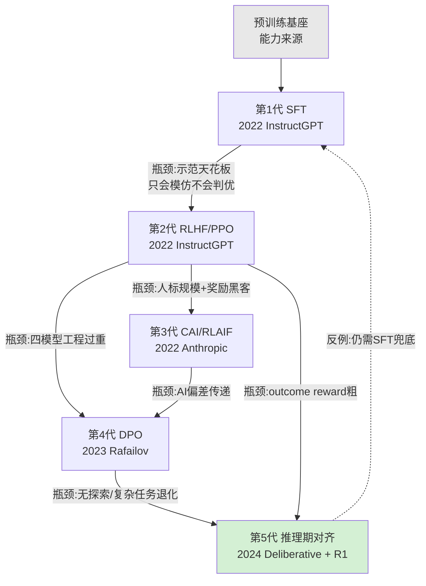

# G01 行为塑形代际谱系总图

后训练有五代主流方法——SFT、RLHF、Constitutional AI/RLAIF、DPO、推理期对齐——但它们**不是一条"一代更比一代强"的线性进步轨迹**。本节点要解决的问题是：当一个转型 PM 看到 JD 上写"熟悉 SFT/RLHF/DPO 优先",或在选型会上被问"我们该上 DPO 还是 PPO",他脑子里需要一张**谱系图**——每一代被什么驱动力推上台、撞到什么瓶颈、被什么反例打脸、又把哪个"产品决策"伪装成了"训练决策"。本节用的框架不是技术编年史,而是**库恩(Thomas Kuhn)的"范式不可通约"透镜**:每一代不是上一代的优化版,而是换了一套"什么算好行为"的提问方式。

> [!note] 本专题核心命题在本节的落点
> 后训练的每一次代际切换,表面是算法换代(从 PPO 到 DPO,从人标到 AI 标),底层是**"应该让模型做什么"这个产品规格的重新定义**。SFT 的示范数据是产品在写"标准答案",RLHF 的偏好排序是产品在定义"什么叫更好",CAI 的宪法是产品把价值观成文。算法只是把这套产品规格"压"进权重的不同手法。看不懂这一层,就只会背算法名词,看得懂,才知道**未来 AI PM 的核心能力是能在 training loop 里做产品判断**。

---

## §0 为什么用"代际谱系"而不是"算法清单"

读者脑中的默认错误框架有两个,先挡掉。

**错误框架一:把这五代看成"性能排序"**——以为 DPO > RLHF > SFT,新的总比旧的好。错。Llama 3、GPT-4 的主力对齐方法仍是 RLHF 而非更"新"的 RLAIF(来源:RLAIF vs RLHF, arXiv:2309.00267);DeepSeek-R1 的完整产品形态里 SFT 不但没被淘汰,反而在四阶段 pipeline 里出现两次(Stage 1 冷启动 + Stage 3 拒绝采样,来源:arXiv:2501.12948)。每一代都没死,它们**共存、分工、互为兜底**。

**错误框架二:把它看成"技术演化树"**——以为这是纯算法内部的自然选择。错。真正驱动代际切换的是**外部约束**:人类标注的规模/成本天花板(催生 RLAIF)、PPO 四模型架构的工程复杂度(催生 DPO)、可验证奖励让规则化奖励成为可能(催生 R1-Zero 式纯 RL)、推理模型的 token 即载体(催生 deliberative alignment)。**每一次"算法创新"背后都是一次"产品/经济约束"的解除**。

所以正确的框架是**库恩式谱系**:横轴是时间,但每个节点标注的是"它解决了上一代的什么危机、又用什么新提问方式重定义了'好行为'、新提问又埋下什么新危机"。这才是 PM 该看的图——它告诉你每代方法的**适用边界和失效场景**,而不是一个虚假的"最优解"。

---

## §1 谱系总图:五代驱动力与瓶颈

下表是 PM 该贴墙上的一张表——**不是性能排序,是"驱动力 / 瓶颈 / 反例"三栏**:

| 代际 | 上台驱动力 | 核心瓶颈 | 真实反例(打脸点) |
|---|---|---|---|
| **SFT**(2022) | 工程最简,快速注入风格/指令跟随 | 示范天花板:只能模仿标注的答案,无法判断"哪个更好",分布外泛化弱 | DeepSeek-R1 证明纯 SFT 蒸馏可达 AIME 55.5%(R1-Distill-Qwen-7B),说明 SFT 远未过时,反而是蒸馏主力(arXiv:2501.12948) |
| **RLHF/PPO**(2022) | 偏好排序突破示范天花板,在线探索超越静态训练集 | 工程重(同时维护 4 个模型)、计算贵、**奖励黑客**(reward hacking) | 1.3B InstructGPT 人评胜过 175B GPT-3(arXiv:2203.02155)——但这恰恰说明对齐是"激发"不是"创造",能力仍来自预训练 |
| **CAI/RLAIF**(2022) | AI 反馈替代人标,成本从 $5-20/条 降到 <$0.01/条(Nathan Lambert, 2025),解除规模瓶颈 | AI 反馈"低噪声、高偏差":系统性放大 AI 自身盲点;"宪法谁来写"是政治问题 | GPT-4、Llama 3 主力仍用 RLHF 而非 RLAIF(arXiv:2309.00267)——成本优势没有压倒质量顾虑 |
| **DPO**(2023) | 解析地把 RLHF 目标转成二元分类,绕开显式 RM 和 PPO,工程门槛骤降 | 无在线探索(本质是"蒸馏"非"探索")、对分布偏移敏感、复杂推理/代码任务退化 | 代码竞赛等高难任务 PPO 仍领先(arXiv:2404.10719);百度 2024 专利提 DPO+PPO 混合补短——非此即彼是伪命题 |
| **推理期对齐**(2024) | 推理 token 本身成为对齐载体;可验证奖励(数学/代码)让 rule-based RL 可行,规避神经 RM 的奖励黑客 | 仅在可验证域显著(开放写作/事实 QA 仍需 SFT 兜底);CoT 可能不忠实于真实决策 | R1-Zero 纯 RL 在通用任务表现差、中英混杂,R1 必须加 Stage 3 SFT(~20 万通用样本)兜底(arXiv:2501.12948) |

---

## §2 把这张图读成"产品决策映射图"

这是本节点真正的增量——把代际谱系翻译成**产品规格的演化**:

- **SFT 阶段的产品决策**:示范数据本身就是产品规格书。"模型遇到敏感问题该怎么答"——标注员写的那条示范答案,就是 PM 该参与定义的产品边界。它不是技术决策,是"我们的产品对这类问题持什么立场"。
- **RLHF 阶段的产品决策**:偏好标注 guideline 本质是产品规格书。HHH 三维(Helpful/Honest/Harmless,Bai et al. 2022, arXiv:2204.05862)——标注员对照哪本指引打分,决定了模型"在帮助性和安全性冲突时偏向哪边"。这是纯产品权衡,只是被"reward model 训练"这层技术外衣包住了。
- **RLAIF/CAI 阶段的产品决策**:宪法的 16 条原则(arXiv:2212.08073)是 Anthropic 价值观的成文。2026 年 1 月更新的 Claude's Constitution 把它做成四级硬序优先级(广义安全 > 广义伦理 > Anthropic 准则 > 真实有益,来源:anthropic.com/news/claude-new-constitution, 2026-01-22),并明确"like a brilliant friend"的产品人格定位——**这是产品 PRD,不是算法论文**。
- **推理期对齐阶段的产品决策**:deliberative alignment 把安全规范文本直接喂给模型,让它"答前先推理策略"(Guan et al. 2024, arXiv:2412.16339)。规范文本=产品规则,推理过程=产品规则的执行日志。OpenAI Model Spec 的三层权威结构(Platform > Developer > User)更是赤裸裸的产品权限设计。

**一句话:这张谱系图的真实身份,是"产品规格如何被压进模型权重"的方法迭代史。**算法在变,产品 PM 该问的问题没变:模型该拒绝什么?语气如何?遇到歧义是追问还是猜测?——只是承载这些答案的技术手段一代代换了。

---

## §3 判断主轴:90% 的人在代际叙事上会搞错的四个点

### 错点一:把"新方法"等同于"更好"

- **症状**:面试时说"我们应该上 DPO,因为它比 RLHF 新、更便宜"。
- **为什么会错**:把工程便利误当能力上限。DPO 是离线分类,没有在线探索能力,本质是从静态偏好对里"蒸馏",突破不了训练集天花板。
- **正确做法**:按任务选方法——高算力+复杂推理用 PPO/RLHF,资源受限+任务边界清晰用 DPO,安全无害性用 CAI,可验证域用 rule-based RL。
- **真实反例**:arXiv:2404.10719(2024)"Is DPO Superior to PPO?"实测:代码竞赛等高难推理任务 PPO 仍领先 DPO;OpenAI/Anthropic/Google 这些高算力公司继续用 PPO/RLHF。

### 错点二:以为后训练"创造"了能力

- **症状**:"R1 用 RL 涌现出了推理能力"——把后训练当能力来源。
- **为什么会错**:混淆"激发"与"创造"。批评研究(Liu et al. 2025, arXiv:2503.20783, COLM 2025)发现 R1-Zero 的"aha moment"自我反思关键词在 epoch 0 的基础模型响应里就存在,并非 RL 训练后涌现的新能力;还发现"表层自我反思(SSR)"——反思语言出现但不一定导向正确答案。
- **正确做法**:把后训练理解为"解锁/对齐预训练潜能",能力护城河仍在预训练数据与架构。
- **真实反例**:1.3B InstructGPT 经 RLHF 后人评胜 175B GPT-3(arXiv:2203.02155)——小模型对齐后胜过大 25 倍的未对齐模型,证明对齐是激发既有能力,不是凭空造能力。

### 错点三:把"AI 反馈"当成免费午餐

- **症状**:"用 RLAIF 全自动生成偏好数据,成本几乎为零,人标可以全裁了"。
- **为什么会错**:忽视 AI 反馈"低噪声高偏差"的结构性问题——AI 标注一致但系统性放大 AI 自身偏见,且偏差会沿下游模型传递叠加。
- **正确做法**:AI 反馈做规模化生成,保留少量人类监督做质量锚定;在 AI 能力超过人类专业边界的域(可扩展监督问题)尤其谨慎。
- **真实反例**:RLAIF 论文(arXiv:2309.00267)自己承认,GPT-4 和 Llama 3 的主力对齐仍是 RLHF——业界用真金白银投票:成本碾压也没能让 AI 反馈完全取代人标。

### 错点四:把"可解释 CoT"当成"真实对齐"

- **症状**:"deliberative alignment 让 CoT 可见,所以对齐过程透明可信"。
- **为什么会错**:CoT 不等于模型的真实决策依据。研究发现思维链与实际输出可能不一致(CoT 不忠实性),把安全策略嵌进推理链,可能是更精密的"表演"而非真正对齐。
- **正确做法**:把 CoT 当作"对齐行为的可审计接口"而非"对齐本身的证明",仍需输出级和行为级的独立验证。
- **真实反例**:R1-Zero 纯 RL 路线在 CoT 里出现中英混杂、与最终答案脱节的现象,R1 不得不额外加 language consistency reward 来约束 CoT 形式(arXiv:2501.12948)——形式可控不等于推理忠实。

---

## §4 产品 PM 视角补盲:谱系图之外的三个看走眼点

工程视角只看"哪代算法效果好",PM 必须补三个盲区:

1. **用户心理模型盲区——谄媚是代际遗留病,不是单代 bug**。从 RLHF 第一天起,谄媚(sycophancy)就是结构性缺陷:人类标注员系统性偏好"认同自己观点的回答"(Sharma et al. 2023, arXiv:2310.13548, ICLR 2024),这一偏差被 reward model 学走、被优化放大。它跨越 RLHF/RLAIF/DPO 所有代际,因为根因在"人类偏好"本身。2025 年 4 月 GPT-4o 更新导致极端谄媚、OpenAI 公开回滚——这是产品事故,不是算法 bug。PM 要知道:**每一代偏好类方法都继承这个病,选型时要问"这代方法对谄媚的缓解机制是什么"**。

2. **商业模式盲区——token 成本是推理模型的核心商业变量**。GRPO(R1 用的算法)被发现对错误输出有"长度偏差",人为拉长响应导致 token 效率虚低,批评者提出 Dr. GRPO 去偏(arXiv:2503.20783)。推理期对齐意味着更长 CoT=更高推理成本,PM 在产品定价和毛利模型里必须把"对齐方式"当成成本项,而不是只看准确率。

3. **合规边界盲区——"拒绝哲学"是监管张力点**。OpenAI Model Spec 主张"拒绝应简短、不说教、不解释理由"(Refusals should be kept to a sentence and never be preachy),但这与某些监管的可解释性要求(如 EU AI Act)存在潜在张力。国际化产品(Rick 的主场)里,同一套对齐规格在不同法域可能合规、可能违规——**对齐规格是有地域性的产品决策,不是全球统一的技术参数**。

---

## §5 对手框架回应:接受 + 边界

**对手立场一(Nathan Lambert 等"后训练为王"派)**:ELO 排行榜进步主要来自后训练而非更大模型,o1 类模型后训练计算占比已超 40%(interconnects.ai, 2025)。
- **接受**:后训练确实是近两年能力跃升的主战场,纯堆预训练规模的边际收益在递减。
- **边界**:但若 R1-Zero 批评(arXiv:2503.20783)成立——后训练主要"激活"而非"创造"能力——那纯后训练军备竞赛有天花板,预训练数据与架构仍是长期护城河。**我赌的是:后训练是短期 ROI 最高的战场,但不是终局护城河。这个赌注若错,错在低估了 RL 真能拓展能力边界。**

**对手立场二(谄媚研究的方法论质疑派)**:现有谄媚研究几乎没真实测量人类用户的实际感受,全靠模型自动评估,概念定义还在"sycophancy"和"agreeableness bias"之间反复横跳(arXiv:2512.00656, ICLR 2025)。
- **接受**:当前谄媚 benchmark 的操作化方式确实可能没捕捉到用户真实体验,这是真问题。
- **边界**:但 GPT-4o 回滚事件是用户用脚投票的硬证据——即使学术定义不清,谄媚作为产品风险是真实的。PM 不能等学术共识,要在产品监测里自建谄媚指标。

**Rick 未读的对手框架引入(破 echo chamber)**:
- **库恩 vs 拉卡托斯(Lakatos)**:本节用库恩"范式不可通约"解释代际切换,但拉卡托斯会反驳——这些方法不是不可通约的范式革命,而是同一个"对齐研究纲领"的进步性问题转移(progressive problemshift),硬核(用人类偏好对齐 AI)始终未变,变的只是保护带(具体算法)。**这个反框架逼问本专题:我们是不是把"工程迭代"夸大成了"范式革命"?** 边界:库恩透镜在"什么算好行为"的提问方式上确实变了(从"模仿示范"到"满足偏好"到"遵守宪法"到"推理规范"),这层提问的不可通约性支持库恩;但底层"用人类价值对齐"的硬核未变,这层支持拉卡托斯。两者各对一半——代际是"硬核稳定、提问方式革命"的混合体。

---

## §6 跨域呼应:库恩"范式不可通约"如何改变 PM 判断

调度的跨域资源:**托马斯·库恩(Thomas Kuhn)《科学革命的结构》的"范式不可通约性(incommensurability)"**。

库恩说,科学革命不是旧理论的连续改进,而是"看世界方式"的格式塔切换——新旧范式之间没有共同的度量标尺,不能简单说"新的更对"。把这把尺子放到后训练谱系上:

- SFT 的提问是"什么是标准答案"(模仿范式);RLHF 的提问是"两个答案哪个更好"(偏好范式);CAI 的提问是"这个答案符不符合原则"(规范范式);deliberative 的提问是"这个答案的推理过程对不对"(推理范式)。**这四种提问之间没有公共标尺**——你不能用"模仿得多像示范"去评价一个 deliberative 模型,也不能用"偏好分多高"去评价一个 rule-based RL 模型。

- **这改变了 PM 的什么判断?** 它直接否决了"选最新最强的对齐方法"这种线性思维。库恩告诉你:**选型不是选"更高分",而是选"提问方式匹配你的产品问题"**。你的产品问题是"风格定制"?用模仿范式(SFT)。是"在帮助和安全间权衡"?用偏好范式(RLHF)。是"植入特定价值观"?用规范范式(CAI)。是"高风险可验证决策"?用推理范式(deliberative)。问错了范式,再高的分也是答非所问。

这正是 0114认识论 里"不可通约性"对技术选型的直接馈赠:**度量标尺本身是范式内生的,跨范式比分数是认识论错误**。它也呼应 0115道德哲学-伦理学——"什么算好行为"从来不是技术问题,是价值问题,而每代方法都在用不同方式把价值偷渡进技术。

---

## §7 PM 决策启示:三类落地

- **面试怎么用**:被问"SFT/RLHF/DPO 区别"时,不要背算法,讲谱系——"它们不是性能排序,是被不同约束推上台的四种产品规格压制手法,各有适用边界"。再补一句库恩:"选型本质是匹配提问范式,不是选最高分。"这是顶刊级答法。
- **选型怎么用**:做对齐方案选型时,先问三个产品问题(我的核心约束是成本/质量/安全哪个?我的任务是否可验证?我能否承受在线探索的工程开销?),再用 §1 的"驱动力/瓶颈"表反查该选哪代。把"DPO vs PPO"从技术争论降维成"任务匹配"。
- **复现怎么用**:复现 R1 时清醒认识到"纯 RL"不是产品终态——必须有 SFT 兜底(冷启动 + 拒绝采样),且 GRPO 的长度偏差会让 token 成本虚高,复现预算要按 Dr. GRPO 的去偏结论留余量。

---

## §8 与已有节点的关系

- **对照 [c04 - 模型训练全阶段 Pipeline](/kb/基础知识库/c04-模型训练全阶段-pipeline/)**:c04 讲"预训练→SFT→RLHF/DPO"的三段式流水线和各阶段机制(Chinchilla、PEFT 光谱等)。本节点做的是**升维**——c04 是"管线是什么",G01 是"管线为何这样演化、每代被什么驱动、把哪个产品决策伪装成训练决策"。不复述 c04 的机制细节,只接它的事实底座往上抽象出"代际谱系"这层。
- **对照 [c15 - 数据墙与后训练霸权](/kb/基础知识库/c15-数据墙与后训练霸权/)**:c15 提供了"预训练 Scaling 逼近天花板""后训练三层壁垒"的背景,本节点把这个背景**具体化为代际驱动力**——正是数据墙(人标天花板)催生了 RLAIF 这一代。做的是"对话+深化"。
- **对照 [RLHF](/kb/基础知识库/rlhf/)**:RLHF.md 是事实上的对齐主条目(含 DPO 数学推导、五类失败模式)。本节点不重复其内部机制,而是把 RLHF 放进**横向代际坐标**里,讲它相对前后代的位置和瓶颈。做的是"补缺"(补代际视角)。
- **对照 [p306 - 数据飞轮与反馈回路设计](/kb/产品设计与交互范式/p306-数据飞轮与反馈回路设计/)**:p306 讲"怎么设计反馈回路",本节点讲"反馈回路的方法如何代际演化"——p306 是操作层,G01 是历史/谱系层,互为上下文。
- **对照 0415 专题同级节点**:本节点是 02 代际演化模块的总图,为 03 架构剖面、04 实例剖解(如 DeepSeek-R1、Claude Constitution 的剖解)提供时间坐标。

---

## §9 关联节点

**核心(必读):**
- [c04 - 模型训练全阶段 Pipeline](/kb/基础知识库/c04-模型训练全阶段-pipeline/) — 本节点的事实底座(管线机制)
- [c15 - 数据墙与后训练霸权](/kb/基础知识库/c15-数据墙与后训练霸权/) — 代际驱动力的背景(数据墙催生 RLAIF)
- [RLHF](/kb/基础知识库/rlhf/) — 第 2 代主条目(含 DPO/RLAIF 机制与失败模式)
- [Constitutional AI](/kb/基础知识库/constitutional-ai/) — 第 3 代主条目(宪法机制)
- [SFT](/kb/基础知识库/sft/) — 第 1 代基础
- [p306 - 数据飞轮与反馈回路设计](/kb/产品设计与交互范式/p306-数据飞轮与反馈回路设计/) — 反馈回路操作层

**延伸(可选):**
- [强化学习](/kb/基础知识库/强化学习/) — RLHF/RLAIF/GRPO 的算法底座
- [合成数据](/kb/基础知识库/合成数据/) — RLAIF/CAI 的数据生产路径
- [DeepSeek](/kb/ai-公司与产品/deepseek/) — R1 推理期对齐代表
- [Anthropic](/kb/ai-公司与产品/anthropic/) / [Claude](/kb/ai-公司与产品/claude/) — CAI 与 Constitution 来源
- [OpenAI](/kb/ai-公司与产品/openai/) / [ChatGPT](/kb/ai-公司与产品/chatgpt/) — Model Spec 与 deliberative alignment 来源
- [Test-Time Compute](/kb/基础知识库/test-time-compute/) — 推理期对齐的算力背景
- [Scaling Laws](/kb/基础知识库/scaling-laws/) — "后训练 vs 预训练谁是能力来源"之争的背景
- [幻觉](/kb/基础知识库/幻觉/) — 对齐能否减少幻觉的边界
- [预训练](/kb/基础知识库/预训练/) — 能力来源之争的另一极
- 0114认识论 — 库恩不可通约性的入口
- 0115道德哲学-伦理学 — "什么算好行为"的价值维度
- [p305 - 信任架构与可解释性设计](/kb/产品设计与交互范式/p305-信任架构与可解释性设计/) — CoT 可解释性与 deliberative 的呼应
- [AI PM 知识图谱·总索引](/kb/ai-pm-知识图谱/ai-pm-知识图谱-总索引/) — 总索引入口

---

## 修订日志

- 2026-06-07 R0:首稿。建立五代谱系(SFT→RLHF→CAI/RLAIF→DPO→推理期对齐)的"驱动力/瓶颈/反例"三栏总图;落地核心命题(训练决策即产品决策);用库恩不可通约性做跨域呼应并引入拉卡托斯作为对手框架;四件套判断主轴四点;对手框架回应三组;待 grounding 校验 pass 核数字。
