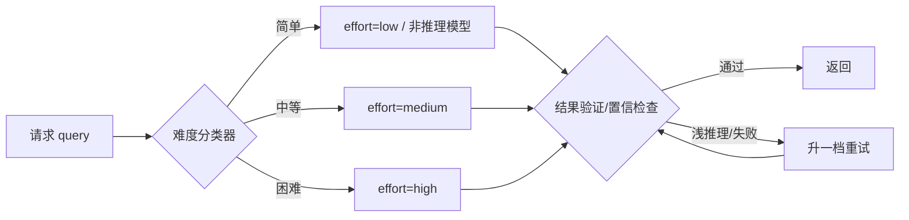

# R02 中型·Reasoning 预算路由器

本节点要解决的问题：当你的产品里同时跑着"2+3=？"和"证明这个不等式"两类请求，把它们都喂给同一个 high-effort 推理模型，是同时在烧钱、拖延迟、并且对简单题掉点。**Reasoning 预算路由器**是把"该想多久"从一个全局开关，变成一个**按单条请求难度动态决策的滑杆**——这是本专题核心命题"推理期算力是可按需购买的连续变量"在工程层最直接的兑现。本节给一套可落地的中型生产模板（难度分类器 + effort 映射 + 降级回路），并在结尾点破三个让路由器"看起来省钱实际更贵"的陷阱。视角框架：把路由器当作一个**控制论意义上的采样—验证回路**，而非一次性的 if-else 规则。

---

## §0 为什么是"路由器"而不是"全局 effort 默认值"

读者脑里第一个默认框架通常是："我在 API 调用里固定 `reasoning_effort=medium` 不就行了？" 这个框架在两个地方失效。

第一，**全局默认值假设请求分布是单峰的**。真实产品的请求难度是长尾双峰：80% 是分类、抽取、改写这类 System 1 任务，20% 是数学、代码、多步规划这类真正需要 System 2 的任务（System 1/2 框架见 [c11 - System 2 思维与 Test-Time Compute](/kb/基础知识库/c11-system-2-思维与-test-time-compute/)）。对双峰分布取单一 effort，要么让简单题付难题的钱，要么让难题用简单题的脑子。

第二，**全局默认值无视 effort 是行为信号而非硬预算**。Anthropic 官方文档明确：`effort` 是行为信号，不是严格 token 预算——即使设 `low`，足够困难的问题仍会触发 thinking（来源：Claude API Docs, build-with-claude/effort, 2025）。这意味着"全局 low"并不能保证省钱，它只是放弃了对难题的主动控制。

所以正确的抽象层不是"选一个默认值"，而是"建一个**前置路由决策**"：在请求进入推理模型之前，先用一个廉价判断器估算难度，再把难度映射到 effort 档位。这与 [m209 - 推理成本控制手册](/kb/工程化与落地架构/m209-推理成本控制手册/) §2.6.3 的 cascade 决策树（小模型 → 大模型 → 推理模型）是同一个思想在 reasoning 维度的延伸——m209 路由的是"用哪个模型"，本节路由的是"同一个推理模型想多久"。两者正交、可叠加。

> [!note] 三件不可通约的事，路由器只动其中一件
> 路由器调的是 **trained reasoning 模型的 effort 档位**（推理期算力总量），不是 CoT prompt（提示层、不改权重、对已内化 CoT 的推理模型边际收益接近零甚至为负），也不是推理期搜索（Best-of-N/MCTS 这类外挂验证器的并行/树搜索）。把"加一句 let's think step by step"当成调 effort，是本专题反复辨析的范畴错误（详见 A 模块术语辨析）。

---

## §1 路由器的最小骨架：三段式回路

一个中型生产可用的路由器拆成三段，每段都可独立替换：

| 段 | 职责 | 中型实现 | 不要做的事 |
|---|---|---|---|
| **难度分类器** | 把 query 映射到 {简单, 中等, 困难} | 廉价小模型 zero-shot 打分，或规则 + embedding 路由 | 不要用 high-effort 模型来判断要不要 high-effort（自食其尾，成本翻倍） |
| **effort 映射** | 难度档 → API effort 参数 | 见 §2 映射表 | 不要把映射写死成永久 if-else，留一张可调表 |
| **验证—降级回路** | 跑完检查质量，浅推理则升档重试 | 可验证任务用确定性验证器；不可验证用置信启发式 | 不要默认"升档"，要先判断是 underthinking 还是任务本身超出能力 |

关键设计原则：**分类器必须比被路由的模型便宜一个数量级**。如果你的分类器本身要花 high-effort 模型的钱，路由器的净收益是负的。实践里分类器通常是一个 Haiku 级小模型或一个本地规则层。

---

## §2 难度 → effort 映射模板

下表是一个可直接抄用的起点，两列产品参数名都已核实：

| 难度档 | 信号特征 | Claude `effort` | OpenAI `reasoning_effort` | 路由目标 |
|---|---|---|---|---|
| **简单** | 分类、抽取、格式化、闭合式短答 | `low`（或干脆走非推理模型） | `low` | 最低延迟/成本 |
| **中等** | 单步代码、agentic 工具调用、需要一点推理的问答 | `medium` | `medium`（默认） | 均衡 |
| **困难** | 多步数学、复杂代码、nuanced 分析 | `high`（Claude 默认值） | `high` | 准确率优先 |
| **前沿** | 真正难、长时 agentic、可接受高延迟 | `xhigh` / `max` | — | 不计成本求解 |

参数事实接地：

- **Claude effort 五档**（`low/medium/high/xhigh/max`，`high` 为默认）；`budget_tokens` 已弃用（Opus 4.6+），由 `effort` + adaptive thinking 取代（来源：Claude API Docs, build-with-claude/effort, 2025）。
- **OpenAI `reasoning_effort` 三档**（`low/medium/high`，`medium` 为默认），支持 o1、o3-mini 及后续推理系列，o1-mini 不支持（来源：OpenAI 开发者社区 + Vellum LLM Parameter Guide, 2025）。
- 更高 effort 的准确率增益**只在高难度任务上兑现，区间约 10–30%；简单任务无显著增益**（来源：Vellum LLM Parameter Guide, 2025）。这正是路由器存在的经济学理由：增益和难度强相关，所以省钱的方式是"只在难题上买高 effort"。

> [!warning] `max` 不是"更聪明"的同义词
> Anthropic 官方对 Opus 4.7 `max` 的警告原文：在某些结构化输出或对智力不敏感的任务上，它可能导致 **overthinking**（来源：Claude API Docs, 2025）。把 `max` 当默认值，是把路由器倒过来用——它会主动制造你想避免的浪费。

---

## §3 验证—降级回路：路由器真正难的那一半

前两段（分类 + 映射）是静态的，真正决定路由器好坏的是**回路**：跑完之后怎么判断该不该升档。这里要区分两种失败，因为它们的处置完全相反。

- **Underthinking（想太少）**：模型在真正困难的问题上分配的推理深度不足，浅推理给出错答案。处置：**升一档重试**。Anthropic 文档给的处方就是"如果观察到浅推理，提升 effort 而非靠 prompt 绕行"（来源：Claude API Docs, 2025）。
- **Overthinking（想太多）/ 任务超出能力**：升档不会救你，只会让你为更多 token 付更多钱、等更久，甚至掉点。处置：**不升档，要么换路径，要么接受失败**。

判断器怎么实现，取决于任务是否可验证（与 [Test-Time Compute](/kb/基础知识库/test-time-compute/) 中 ORM/PRM 验证器的区分同源）：

| 任务类型 | 验证器 | 升档判据 |
|---|---|---|
| 可验证（数学/代码） | 确定性验证器（单测、答案核对、编译） | 验证失败 → 升档（但设最大重试次数，见陷阱三） |
| 不可验证（开放分析） | 置信启发式 / self-consistency 多采样一致性 | 答案抖动大或模型自报低置信 → 升档 |

回路的 ROI 是有实证支撑的：在 SWE-Bench Verified 上，选择 overthinking 分数最低的解决方案，成功率提升至 **27.3%**，同时计算成本降低 **43%**（来源：arXiv:2502.08235, Cuadron et al., 2025）。注意这条数字的含义——它说的不是"想得越多越好"，而是"在候选里挑想得最克制的那个"反而又快又准。这是路由器降级回路的核心赌注：**少即是多，但要有验证器替你确认"少"没有少到 underthinking。**

---

## §4 判断主轴：路由器最容易搞错的四个点

> [!note] 这一节是 PM 命门：90% 的人把路由器做成"省钱开关"，结果更贵。

**错点一：用昂贵模型当难度分类器。**
- 症状：路由器上线后总成本不降反升。
- 为什么会错：直觉上"判断难不难也是个推理任务，得用强模型"。
- 正确做法：分类器必须比被路由模型便宜一个数量级；宁可分类器偶尔判错（错了由 §3 回路兜底），也不要让它和主模型一样贵。
- 真实反例：把 `let's think step by step` 加到分类 prompt 里，对已内化 CoT 的模型边际收益接近零（o3-mini +2.9%、Gemini Flash 2.5 **−3.3%**，来源：Wharton GAIL, 2025），却实打实地拉长了分类延迟。

**错点二：把 effort 当硬 token 预算。**
- 症状：设了 `low` 却发现难题依旧烧了大量 thinking token，账单对不上预期。
- 为什么会错：把行为信号误读成硬上限。
- 正确做法：effort 是行为信号，不是预算（Claude 文档明示）。要硬控成本，得在难度分类阶段就把这类请求路由去**非推理模型**或加超时/token 上限，而不是指望 `low` 自动封顶。
- 真实反例：推理模型平均要烧约 6,780 token（标准 Phi-4 仅约 378.6 token），但 Phi-4-reasoning-plus 准确率 69.54% 反而低于标准 Phi-4 的 78.92%（来源：arXiv:2507.04023《Do LLMs Overthink Basic Math Reasoning?》Srivastava et al., Table 2/§5.3）——更长不等于更对，路由器若只盯 effort 档位不盯实际 token 消耗，会漏掉这类反噬。

**错点三：降级回路默认"升档"且无重试上限。**
- 症状：困难 query 在"失败 → 升档 → 再失败 → 再升档"里无限攀爬，延迟和成本同时失控。
- 为什么会错：把所有失败都归因为 underthinking，忽略了"任务本身超出模型能力"这一类。
- 正确做法：升档要设硬上限（如最多升 2 档），到顶仍失败就 fallback（转人工/返回部分结果/明确报错）。知识密集型任务尤其危险——增加推理时计算量并不持续提升准确率，且经常增加幻觉（来源：arXiv:2509.06861, 2025）。这类 query 升档是在花钱买更自信的错误。
- 真实反例：强制延长推理预算可使准确率先升后降——R1-32B 在 AIME 上 12K token 见顶 55.8%、16K 回落 54.9%，约 7,000 token 后负向翻转超过正向翻转（来源：arXiv:2604.10739, 2026「When More Thinking Hurts」，已 WebFetch 核实；旧稿"87.3%→70.3%"系误引、已更正，与 E02/E03 对齐）。无上限的升档回路就是在主动制造这条曲线。

**错点四：路由表写死，不随模型版本和请求分布漂移。**
- 症状：三个月前调好的难度阈值，换了模型版本后路由全错。
- 为什么会错：把路由当一次性配置，而非需要持续 eval 的活系统。
- 正确做法：把映射表外置成可热更的配置；每次换模型/换 effort 语义（如 `budget_tokens` 弃用、effort 档位重定义）后重跑一遍 eval 校准阈值。当前 33 个主流模型没有一个能同时避免 over- 和 under-thinking（来源：arXiv:2508.13141, OptimalThinkingBench, 2025），意味着路由阈值是经验值，必须按你自己的请求分布持续标定。

---

## §5 产品 PM 视角补盲

工程上路由器是个分类器加映射表，但 PM 看走眼的往往不在工程：

- **用户心理模型：延迟即信任，但快也可能是不信任。** 高 effort 的长延迟会让用户以为系统卡死（防御性 UX 见 [p304 - 防御性 UX：对抗延迟与幻觉](/kb/产品设计与交互范式/p304-防御性-ux-对抗延迟与幻觉/)）；但反过来，对一个用户主观认为"很难"的问题秒回，用户会怀疑系统根本没认真想。路由器的延迟应该和用户的**主观难度预期**对齐，而不只是和客观难度对齐——这是路由器的一个隐藏输入维度。
- **商业模式：路由器是把成本三角的滑杆交给谁的问题。** 质量/延迟/成本三角的滑杆，可以由产品默认（用户无感）、由用户显式选择（"深度思考"按钮）、或由计费档位绑定（免费用户 low、付费用户 high）。第三种最危险也最常见：它把"想多久"变成了付费墙，但 effort 不是硬预算，付费用户的 high 在简单题上反而 overthink，体验未必更好。
- **合规边界：可解释性与路由不透明的张力。** 若产品对外承诺"AI 经过深度推理"，而路由器悄悄把一部分请求降到 low，这在金融/医疗/安全等场景可能构成误导。信任架构见 [p305 - 信任架构与可解释性设计](/kb/产品设计与交互范式/p305-信任架构与可解释性设计/)。

---

## §6 对手框架回应

**业界反方立场（来自 test-time scaling 的乐观派）：** "既然 Snell et al. 2024 证明小模型 + 计算最优 test-time compute 能超越 14× 大模型（arXiv:2408.03314），那 PM 应该尽量多买推理算力，而不是建路由器去抠门。"

**接受的部分：** 这条立场对的地方在于——test-time compute 确实是真实有效的杠杆，且其最优策略**本身就依赖任务难度动态变化**（简单题偏好并行采样+验证器，难题偏好迭代精化，这是 Snell 论文的核心洞见）。换句话说，乐观派自己的论文恰恰论证了"按难度分配算力"的必要性。

**坚持的边界与赌注：** 但"算力最优"不等于"算力越多越好"。Snell 论文的前提是**计算最优分配**，而不是无脑堆 effort；它的 14× 结论也只在特定难度区间成立。路由器正是"计算最优分配"的工程实现——它不是抠门，它是把 Snell 的理论结论落到 per-query 决策。我赌的是：**对绝大多数生产产品，请求分布的双峰性足够显著，以至于路由带来的成本/延迟节约远大于偶尔误判的代价。** 这个赌注在请求分布接近单峰（全是难题或全是简单题）的产品上会失效——那种产品确实不需要路由器，直接固定 effort 即可。

---

## §7 跨域呼应：控制论的采样—验证回路

路由器的 §3 降级回路，本质是一个**控制论意义上的负反馈系统**：测量（验证器）→ 比较（升档判据）→ 调节（effort 档位）→ 再测量。这正是 控制论系统化专题 中"采样—验证回路"的结构（详见该专题，此处不复述其原理）。

控制论给路由器的关键警示是 **过度调节的振荡风险**：一个没有阻尼、没有上限的反馈回路会在目标值附近来回振荡甚至发散。把这个框架套到路由器上，错点三（无上限升档）就不是一个偶然 bug，而是一个**控制论可预测的结构性故障**——任何缺少阻尼项（重试上限）和稳态判据（"何时接受失败"）的反馈回路都会发散。这改变了我对路由器的判断：路由器的难点不在"分类准不准"，而在"回路稳不稳"。先把回路的阻尼和上限设计好，再去优化分类器精度，顺序不能反。

---

## §8 PM 决策启示

- **面试怎么用：** 被问"怎么控制推理模型成本"，不要只答"用便宜模型"。答"建难度路由器：前置廉价分类器 + effort 映射 + 带上限的验证降级回路"，并点破"effort 是行为信号不是硬预算"——这一句能立刻区分你是用过还是只读过文档。
- **选型怎么用：** 评估推理模型 API 时，把"effort 档位粒度"和"是否能在 API 层强制 token 上限"列为硬指标。只有三档 effort、且无法硬封顶的 API，路由器的成本控制力会打折。
- **复现怎么用：** 先用 `medium` 跑一版 eval 建立基线，再分别试 `low`/`high` 看哪些 query 段位掉点、哪些段位无增益，用这个 eval 结果**反推**你的难度阈值——不要凭直觉设阈值。

---

## §9 与已有节点的关系

- **对照 [m209 - 推理成本控制手册](/kb/工程化与落地架构/m209-推理成本控制手册/)（深化）：** m209 §2.6.3 的 cascade 路由解决"用哪个模型"，本节解决"同一个推理模型想多久"。本节不复述 m209 的计费公式与 cascade 结构，而是把同一路由思想推进到 reasoning effort 这个新维度，并补上 m209 没有的"验证—降级回路"环节。两者应叠加使用：先 cascade 选模型，再路由器选 effort。
- **对照 [c11 - System 2 思维与 Test-Time Compute](/kb/基础知识库/c11-system-2-思维与-test-time-compute/)（操作化）：** c11 给出 System 1/2 框架和"适合/不适合 System 2 的场景表"（理论判断），本节把那张场景表**操作化**成可运行的分类器 + 映射表 + 回路。c11 回答"该不该慢思考"，本节回答"工程上怎么按请求逐条决定慢思考的量"。
- **对照本专题 R01（递进）：** R01（最小可运行）展示单条请求开关 reasoning，本节升一级到生产级的批量动态路由。
- **对照 [A04 Reflexion](/kb/专题-安全对齐与失败/a04-reflexion/)（机制借用）：** Reflexion 的"反思—重试"回路与本节 §3 的"验证—升档"回路同构；区别是 Reflexion 调的是 agent 的下一步动作，本节调的是同一请求的 effort 预算。

---

## §10 关联节点

**核心（必读）**
- [c11 - System 2 思维与 Test-Time Compute](/kb/基础知识库/c11-system-2-思维与-test-time-compute/)
- [m209 - 推理成本控制手册](/kb/工程化与落地架构/m209-推理成本控制手册/)
- [Test-Time Compute](/kb/基础知识库/test-time-compute/)
- 控制论
- [A04 Reflexion](/kb/专题-安全对齐与失败/a04-reflexion/)

**延伸（可选）**
- [强化学习](/kb/基础知识库/强化学习/)
- [幻觉](/kb/基础知识库/幻觉/)
- [Scaling Laws](/kb/基础知识库/scaling-laws/)
- [Agent](/kb/基础知识库/agent/)
- [p304 - 防御性 UX：对抗延迟与幻觉](/kb/产品设计与交互范式/p304-防御性-ux-对抗延迟与幻觉/)
- [p305 - 信任架构与可解释性设计](/kb/产品设计与交互范式/p305-信任架构与可解释性设计/)
- [A03 ReAct](/kb/专题-安全对齐与失败/a03-react/)
- [A06 Orchestrator 编排器](/kb/专题-安全对齐与失败/a06-orchestrator-编排器/)
- [Claude](/kb/ai-公司与产品/claude/)
- [OpenAI](/kb/ai-公司与产品/openai/)
- [DeepSeek](/kb/ai-公司与产品/deepseek/)
- [m208 - AI 基础设施与中间件选型](/kb/工程化与落地架构/m208-ai-基础设施与中间件选型/)
- [AI PM 知识图谱·总索引](/kb/ai-pm-知识图谱/ai-pm-知识图谱-总索引/)

---

## 修订日志

- 2026-06-12 内审修复：错点二"真实反例"的 Phi-4 数字此前误署 arXiv:2505.00127。WebFetch 复核该 ID 及 2504.21318 abstract 均无此组数字，真实出处为 **arXiv:2507.04023《Do LLMs Overthink Basic Math Reasoning?》Table 2/§5.3**——已改署真值与正确来源，并标明 69.54% 为 Phi-4-reasoning-**plus** 档、378.6 为 Phi-4 平均、~6,780 为 abstract 推理模型平均值。
- 2026-06-11 P3.4 校链：0420 控制论现已入库，§5 正文与关联节点处"（待建专题，未发布）"恢复为真 0420 总览 链。
- R1（2026-06-07）：首稿。三段式路由骨架（分类器/映射/降级回路）+ 难度→effort 映射模板（Claude 五档/OpenAI 三档已核实）+ 四个判断主轴陷阱（昂贵分类器、effort 当硬预算、无上限升档、写死路由表）+ 控制论采样—验证回路跨域呼应 + 对 Snell test-time scaling 乐观派的"接受+边界"回应。与 m209/c11/R01/A04 升级对照。
- 2026-06-11 P0 收口：错点三活正文残存的编造对子"准确率从 87.3% 降到 70.3%（thinking token 1,100→15,980）"已替换为 arXiv:2604.10739 真实数据（R1-32B AIME 12K 见顶 55.8%/16K 回落 54.9%、约 7,000 token 负向翻转超过正向翻转）。依据：WebFetch arXiv:2604.10739 abstract 不含 87.3%/70.3%，与已修兄弟节点 E02/E03 一致。
