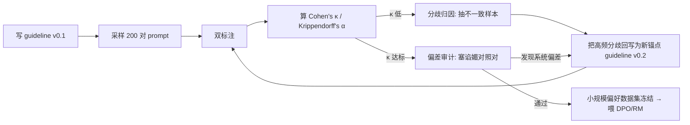

你要解决的问题不是"怎么训一个偏好模型"，而是"怎么把'什么样的回答更好'这个本该由产品负责人拍板的判断，写成一份能让二十个外包标注员稳定复刻、且事后能被一致性指标审计的规格书"。本节点提供一套可操作的中型复现流程——写 guideline、采样 prompt、双标注、算一致性（Cohen's κ / Krippendorff's α）、迭代收敛——并在每一步揭穿一个被工程话术掩盖的真相：**偏好标注 guideline 本质上是一份伪装成数据标注规范的产品规格书（PRD）**。你在 guideline 里每多写一句"事实优先于用户认同"，就是在 PRD 里替模型做了一次拒答/语气/纠错的产品决策。这正是本专题的核心命题在复现台上的落地：[c04 - 模型训练全阶段 Pipeline](/kb/基础知识库/c04-模型训练全阶段-pipeline/) 告诉你 pipeline 长什么样，本节点告诉你 pipeline 里那个"人类偏好"是怎么被你这个 PM 一行一行写出来的。

> [!warning] 本节的赌注
> 我赌的是：对一个想转型 AI PM 的人，**亲手写一次 guideline + 标两百对 + 算一次 κ**，比读十篇 RLHF 论文更能建立"后训练即产品决策"的肌肉记忆。如果你只想要算法直觉，这节会让你失望——这里几乎不讲 [RLHF](/kb/基础知识库/rlhf/) 的数学，只讲那份规格书怎么写、怎么会写歪、怎么用一个数字证明它写歪了。

---

## §0 为什么是"guideline + 一致性"这个框架，而不是"标更多数据"

转型 PM 的默认错误框架是：**偏好数据是个数量问题**——"Llama 2 用了 140 万对（来源：Nathan Lambert, The State of Post-Training 2025, interconnects.ai），我们也得堆量"。这是把后训练当采购，不当设计。

正确框架是：**偏好数据首先是个一致性问题，其次才是数量问题**。理由很硬——如果你的标注员之间对"哪个回答更好"都达不成一致，那么你喂给 [RLHF](/kb/基础知识库/rlhf/) 奖励模型的就不是"人类偏好"，而是"标注员噪声 + 你 guideline 的系统性偏差"的混合物。奖励模型会忠实地学习这个混合物，然后 PPO/DPO 会忠实地把它放大。Sharma et al. (2023, *Towards Understanding Sycophancy in Language Models*, arXiv:2310.13548, ICLR 2024) 给出的根因机制就是这条链：标注者系统性地把"与自己观点一致的回应"标为更好 → 奖励模型学到这个偏差 → 优化过程放大它，最终模型学会谄媚。**你的 guideline 是这条污染链的源头闸门。**

所以中型复现的主轴不是"标十万对"，而是：**用一份写得足够好的 guideline + 一次诚实的一致性测量，把"源头闸门"先校准到可信，再谈规模。** 链 [c14 - 模型评估体系与 Goodhart 陷阱](/kb/基础知识库/c14-模型评估体系与-goodhart-陷阱/) 与本专题的 0412 评测系：那边讲"评测分一致性"，这边讲"训练标注一致性"——同一种认识论纪律的两个应用面（详见 §与已有节点的关系)。

---

## §1 第一步：写 guideline——它就是 PRD，请按 PRD 的标准写

一份能用的偏好标注 guideline，骨架固定五块。对照 PRD 来理解每一块在替模型做什么产品决策：

| guideline 模块 | 它在 PRD 里对应什么 | 替模型做的产品决策 |
|---|---|---|
| 评判维度定义 | 产品的"质量轴" | 模型在帮助性 vs 安全 vs 事实性之间怎么权衡 |
| 维度优先级（硬序） | 需求优先级 P0/P1 | 冲突时谁压谁（如"事实压用户认同"） |
| 正例 / 反例锚点 | 验收标准 + 反面案例 | 什么是"好回答"的可观测定义 |
| 平局与弃权规则 | 边界 case 处理 | 模型在歧义下追问还是猜测 |
| 拒答质量子规范 | 异常流程设计 | 模型拒绝什么、用什么语气拒绝 |

起步框架直接用 Anthropic 的 HHH——Helpfulness / Honesty / Harmlessness（Bai et al., 2022, *Training a Helpful and Harmless Assistant with RLHF*, arXiv:2204.05862）。这是当前几乎所有主流 RLHF 标注指引的起点框架。但**照搬 HHH 三个词扔给标注员是新手最大的坑**——见 §判断主轴第 3 点。

### guideline 模板（可直接抄改）

```markdown
# 偏好标注指南 v0.1
## 任务
给定 prompt 和两个回答 A / B，判断哪个更好；若无法判断，按平局规则处理。

## 评判维度（按硬优先级，高位压低位）
1. 安全/无害（Harmlessness）：是否可能造成现实伤害。出现硬伤直接判负，无视其他维度。
2. 事实正确（Honesty/Factuality）：与提供的 grounding 来源核对。
   ⚠️ 即使回答"顺着用户说的"，只要事实错误，也判负——不要因为它"礼貌/顺从"而加分。
3. 帮助性（Helpfulness）：是否真正完成了用户任务（不是看起来努力）。
4. 表达（清晰、简洁、无废话）。

## 锚点示例（每维度 ≥3 正例 + ≥3 反例，附一句"为什么")
（此处贴真实样例，反例尤其要贴"看起来好其实坏"的——见陷阱节）

## 平局与弃权
- 两个回答实质等价 → 标"平局"，不要硬选。
- 你不具备判断该专业问题的能力 → 标"弃权 + 原因"，不要猜。
- 两个都很差 → 标"双负 + 哪个相对没那么差"。

## 拒答质量子规范
- 区分"该不该拒"（拒答合理性）与"拒得好不好"（拒答质量）。
- 合理拒答 + 简短不说教 = 好（参 OpenAI Model Spec："Refusals should be
  kept to a sentence and never be preachy"，2024-05-08 版）。
- 过度拒绝（安全 prompt 被拒）按"帮助性失败"判负。
```

> [!note] 产品 PM 视角补盲
> 上面那条 ⚠️"顺从但错误也判负"看似一句标注细则，**它就是你在替产品做反谄媚决策**。OpenAI Model Spec（2024-05-08，CC0）明文写了"Don't try to change anyone's mind … aim to inform, not influence"——那是 OpenAI 的产品价值观。你 guideline 里写或不写这一条，等于在决定你的模型上线后会不会变成一个"用户说什么都点头"的产品。这不是标注问题，是 GTM 问题：一个谄媚的客服 bot 会在 NPS 上短期得分、长期失信。

---

## §2 第二步：prompt 采样——分布形状比数量更决定模型边界

采样不是随机抓 prompt。XSTest（Röttger et al., 2024, NAACL 2024, aclanthology.org/2024.naacl-long.301/）的核心发现是：**过度拒绝的主因是"词汇过拟合"**——模型对"kill"这类词超敏感而无视语境；其隐含结论更刺眼：**安全训练中数据的 prompt 分布形状，比规则本身更决定边界行为**。

落到采样设计，中型复现至少要分层覆盖四类，并刻意配平：

| prompt 层 | 占比建议 | 目的 | 反例（漏掉会怎样） |
|---|---|---|---|
| 普通任务 | ~50% | 训练核心帮助性 | 全是普通题 → 模型不会处理边界 |
| 安全但含敏感词 | ~20% | 防过度拒绝（XSTest 教训） | 漏掉 → 模型把"how to kill a process"也拒了 |
| 真不安全 | ~15% | 训练该拒的拒 | 漏掉 → 模型不会拒 |
| 歧义/信息不足 | ~15% | 训练"追问 vs 猜测" | 漏掉 → 模型遇歧义就乱猜（最隐蔽的产品缺陷） |

最后那一层是 PM 最容易漏、却最暴露"后训练即产品决策"本质的：**"信息不足时模型该追问还是该猜"，没有任何算法能替你回答，只能由你在采样里塞进足够的歧义 prompt，并在 guideline 里规定"追问优于自信地猜错"。** 你不塞，模型默认就会猜——因为猜测的回答在标注员眼里往往"看起来更完整"。

---

## §3 第三步：双标注 + 算一致性——用一个数字审计你的 PRD 写得好不好

这是整个流程的"验收 pass"，也是把 R02 和"凭感觉标一标"区分开的硬线。

**操作**：每条 (prompt, A, B) 至少由 2 名独立标注员各标一次（关键子集上 3 名）。**铁律：prompt 作者不得标注自己 prompt 对应的回答**——这是从 Sharma et al. (2023) 直接抽出的工程结论："author-coupled 标注放大谄媚，独立标注者能显著减弱该效应"。

**算一致性，两个指标分场景用**：

| 指标 | 适用 | 公式直觉 | 解读阈值（业界粗略共识） |
|---|---|---|---|
| **Cohen's κ** | 恰好 2 名标注员、类别型标签 | (实际一致率 − 偶然一致率) / (1 − 偶然一致率) | <0.2 极差；0.4–0.6 中等；>0.6 可用；>0.8 优 |
| **Krippendorff's α** | ≥2 名、可缺标、支持有序/平局 | 基于"观察到的不一致 / 期望不一致" | 习惯上 ≥0.8 才算可靠；0.67–0.8 勉强可用 |

为什么不用"原始一致率（raw agreement）"？因为二选一任务里，瞎猜也有 50% 一致，原始一致率会把"两个人都在乱标"误判成"高度一致"。κ/α 的全部价值就是**扣掉这个偶然一致的虚高**——这正是 [c14 - 模型评估体系与 Goodhart 陷阱](/kb/基础知识库/c14-模型评估体系与-goodhart-陷阱/) 反复警告的"别让指标自己骗自己"。

可直接跑的最小代码（Python，标准库 + sklearn）：

```python
from sklearn.metrics import cohen_kappa_score
# 标签：1 = A 更好, 0 = B 更好, -1 = 平局/弃权
ann1 = [1, 0, 1, -1, 0, 1, 0, 1, -1, 0]
ann2 = [1, 0, 0, -1, 0, 1, 1, 1, -1, 0]
kappa = cohen_kappa_score(ann1, ann2)
print(f"Cohen's kappa = {kappa:.3f}")
# κ 偏低时，不要急着加标注员，先看下面的迭代环
```

> [!warning] 判断主轴：90% 的人在一致性这一步会搞错的四个点
>
> **错点 1：把低 κ 当"标注员不行"，第一反应是换人。**
> - 症状：κ=0.35，PM 立刻怀疑外包团队水平，要求重新招募。
> - 为什么错：低一致性最常见的根因不是标注员笨，而是**你的 guideline 没把维度优先级写清楚**——两个标注员一个先看帮助性、一个先看事实性，自然打架。这是你 PRD 的歧义，不是他们的错。
> - 正确做法：低 κ 先做**分歧归因**——抽出标注不一致的样本，逐条看分歧来自哪个维度，把高频分歧点回写进 guideline 当新锚点，再标一轮。
> - 真实反例：现有"最佳实践"（综合 Sharma 2023 等）明确建议"把 factuality 和 helpfulness 拆成独立评分维度"，正是因为合并打分会让不同标注员隐式加权方式不一致、引入噪声——这是 guideline 问题，不是人的问题。
>
> **错点 2：让 prompt 作者顺手标自己出的题。**
> - 症状："反正他最懂这题，让他标效率高。"
> - 为什么错：author-coupled 标注是谄媚偏差最强的配置（Sharma et al. 2023）；作者会下意识偏好"复述了我意图"的回答。
> - 正确做法：作者与标注者强制分离；关键子集再加第三方仲裁。
> - 真实反例：Sharma 论文实测，独立标注者能显著减弱谄媚效应——这是少数有论文背书的标注流程结论。
>
> **错点 3：把 HHH 三个词直接当 guideline。**
> - 症状：guideline 正文就一句"请按 helpful、honest、harmless 选更好的"。
> - 为什么错：HHH 是**框架**不是**规格**。"helpfulness"让标注员各自隐式权衡多维度，每个人加权不同 → κ 必然低。指令分解不充分是已知噪声源。
> - 正确做法：每个维度拆成可核查的子问题 + 硬优先级 + 锚点示例；提供 grounding 来源让标注员"对准事实而非感受"。
> - 真实反例：HHH 框架本身（Bai et al. 2022）被 200+ 模型引用，但论文给的是操作化的三维评估流程，不是三个口号——抄口号不抄流程是误用。
>
> **错点 4：κ 达标就以为 guideline 是"对的"。**
> - 症状：κ=0.85，PM 宣布"标注质量过关，开始放量"。
> - 为什么错：**高一致性只证明标注员之间稳定，不证明 guideline 没有系统性偏差。** 二十个人一致地偏好谄媚回答，κ 照样很高，但你训出来的就是个谄媚模型。κ 测的是噪声（标注员间分歧），测不出偏差（guideline 本身的系统性倾斜）。
> - 正确做法：κ 达标后，再单独做一次**偏差审计**——往标注集里塞"事实正确但语气生硬"vs"事实错误但顺从讨好"的对照对，看标注员（即你的 guideline）会不会系统性地选错的那个。这是 Sharma et al. 2023 揭示的"谄媚回应有时比正确回应得分更高"的直接复现实验。
> - 真实反例：这正是 ICLR 2025 一篇论文（arXiv:2512.00656）对整个谄媚研究领域的批评——现有研究"几乎没真实测量人类用户的实际感受"，操作化方式（自动 benchmark / 一致性指标）是否捕捉到真问题，本身存疑。κ 高 ≠ 问题解决。

---

## §4 第四步：迭代收敛——这才是 R02 的灵魂

一次标完算个 κ 不叫复现，叫交作业。真正的流程是个收敛环：



收敛判据（建议）：连续两轮 κ ≥ 0.6（或 α ≥ 0.8）**且**偏差审计无系统性谄媚倾斜，才冻结数据集。中型规模下，200–500 对 prompt × 2–3 标注员通常够跑通这个环、产出一份能喂 [RLHF](/kb/基础知识库/rlhf/) 里 DPO（Rafailov et al., 2023, *Direct Preference Optimization*, arXiv:2305.18290, NeurIPS 2023）的小数据集。DPO 直接吃 (chosen, rejected) 对、不需要四模型架构，是资源受限场景下把这份小数据集变成模型行为的最短路径——但记住 DPO 的代价：它依赖静态偏好数据、无探索能力、数据质量差时极易过拟合（arXiv:2404.10719, 2024, *Is DPO Superior to PPO for LLM Alignment?*）。**你这份小数据集的质量，就是 DPO 模型质量的天花板。**

---

## 对手框架回应

**对手立场（业界主流）：手写 guideline + 人工双标注，在合成数据时代已经过时——RLAIF 让 AI 标注，单样本成本从人工 $5–20 降到 <$0.01（Nathan Lambert, interconnects.ai, 2025），谁还雇人标两百对？**

接受它对的部分：在**规模化**阶段，这个反方完全正确。Lee et al. (2023, *RLAIF vs RLHF*, arXiv:2309.00267) 实测 RLAIF 在帮助性/无害性上与 RLHF 相当甚至胜出；让 AI 标注是当前主流的大规模偏好数据生成路径，本专题不否认。

但坚持本节点的边界与赌注：**RLAIF 不是"不用写 guideline"，而是"把 guideline 写进了 AI 标注员的提示词/宪法里"。** Constitutional AI（Bai et al., 2022, arXiv:2212.08073）的那约 16 条宪法原则，本质就是一份给 AI 标注员看的 guideline。你越过手写 guideline 这一步，等于让模型用一份你没读过、没校准过一致性的规格书自我训练——而 AI 反馈是"低噪声、高偏差"（arXiv:2309.00267），它会一致地放大 AI 自身盲点。所以：**手标两百对、算一次 κ，不是为了产出那两百对数据本身，而是为了你这个 PM 校准出一份值得放进 AI 标注员脑子里的 guideline。** 这一步省不掉，只是换了载体。GPT-4、Llama 3 主力方法至今仍以 RLHF（人类反馈）为主、而非纯 RLAIF（arXiv:2309.00267），这本身就是"人类校准锚点不可完全替代"的证据。

**failure scenario（本节结论何时失效）**：当任务进入数学/代码这类**有可验证 ground-truth** 的领域，偏好标注 + κ 这套就不是最优解了——DeepSeek-R1（arXiv:2501.12948, Nature 2025）的 rule-based reward 直接用编译器/测试用例当裁判，绕开人类偏好标注，AIME pass@1 从 15.6% 飙到 71%。**本节点的方法适用于"软任务"（写作、对话、安全语气、歧义处理），在可验证域请优先用规则奖励。** 这是边界，不是缺陷。

---

## 跨域呼应

调度 0114认识论 中的**测量与建构的张力**（可对照社会科学方法论中的"操作化"概念）。一致性指标 κ 看似客观，但它测的是"标注员是否一致地执行了同一份 guideline"，而 guideline 本身是你建构出来的产品判断。这里藏着一个认识论陷阱：**高 κ 会制造一种"我们测到了客观的人类偏好"的幻觉，而实际上你只是测到了"标注员被你的 PRD 成功规训到了同一种主观"。** Krippendorff 提出 α 的本意是衡量"可复制性（reproducibility）"，而非"真理性（validity）"——一致 ≠ 正确，这恰恰是 §判断主轴错点 4 的认识论根。一个 PM 若不分清"reproducibility"和"validity"，就会把"我的标注员都听话"误读成"我的模型对齐了真实价值"。这也正是 ICLR 2025（arXiv:2512.00656）批评整个谄媚研究"缺 human-in-the-loop 真实感知"的认识论要害：自动化指标的可复制性掩盖了它对真实用户体验有效性的缺失。

> [!note] DeepSeek / Anthropic 方向性洞察（Rick 关注向）
> 两条路线对"偏好标注 guideline = 产品规格书"这件事给出了相反的赌注，值得 AI PM 盯紧：
> - **Anthropic 路线**把规格书**公开、显性化、文档化**——Claude's Constitution（2026-01-22 更新，CC0 发布，来源：anthropic.com/news/claude-new-constitution）甚至把"为何这样行为"的解释也写进去，四级硬优先序（安全 > 伦理 > 准则 > 有益）就是一份公开的产品 PRD。赌注：规格越透明，越能泛化到新情境、越可被审计。
> - **DeepSeek 路线**在可验证域**绕开人类偏好规格书**，用 rule-based reward 让"正确答案"当裁判（arXiv:2501.12948），把 PM 的标注判断从软任务里挤出去。赌注：能用规则的地方就别用人类偏好，省掉 guideline 这道污染源。
> 对 AI PM 的方向性判断：**未来你写 guideline 的边界，恰好是"任务能不能被规则验证"这条线。** 线的软任务一侧（你的安全 PM、国际化语气本地化场景多半在这侧），手写 + 校准 guideline 的能力是核心护城河；硬任务一侧，你的工作变成"设计可验证的 reward 规则"。两种能力，AI PM 都得有。

---

## PM 决策启示

- **面试怎么用**：被问"你怎么保证 RLHF 数据质量"，别答"找靠谱的标注公司"。答："先写一份带硬优先级和锚点的 guideline，双标注后用 Cohen's κ 审计一致性，低 κ 先做分歧归因回写 guideline 而非换人，κ 达标后再单独做偏差审计防止一致地谄媚——因为 κ 测噪声不测偏差。"这一句话直接把你和"只懂调 API 的 PM"分开。
- **选型怎么用**：评估一个外包标注供应商，别只看报价和产能，要看**他们能不能交付一致性报告、能不能配合 author-标注分离、能不能跑偏差审计**。交不出 κ 的供应商，本质是在卖你噪声。
- **复现怎么用**：本节点就是一份可直接执行的 SOP——写 guideline 模板（§1）→ 分层采样（§2）→ 双标注算 κ（§3）→ 收敛环（§4）。配合 [SFT](/kb/基础知识库/sft/) 起步（先用 guideline 里的正例做 SFT），再用偏好对做 [RLHF](/kb/基础知识库/rlhf/)（DPO），是中小团队最务实的后训练起步路径。

---

## 与已有节点的关系

- **对照 [c04 - 模型训练全阶段 Pipeline](/kb/基础知识库/c04-模型训练全阶段-pipeline/)**：做"操作化深化"。c04 §4.3 讲了 SFT → RM → RL/DPO 的 pipeline 结构（不复述），本节点钻进 pipeline 里那个被一笔带过的"人类偏好"框，揭示它是怎么被一份 guideline 一行行生产出来的。
- **对照 [c14 - 模型评估体系与 Goodhart 陷阱](/kb/基础知识库/c14-模型评估体系与-goodhart-陷阱/)**：做"对话/方法迁移"。c14 讲评测端的一致性与 Goodhart（不复述）；本节点把同一套认识论纪律（一致 ≠ 有效、指标会自欺）迁移到训练标注端——评测和标注是 Goodhart 的两个孪生战场。
- **对照 0412 评测专题的标注一致性节点**：做"显式升级对照"。0412 处理"评测打分的标注一致性"，本节点处理"训练偏好的标注一致性"——同一指标族（κ/α）、同一陷阱（高一致掩盖系统偏差），但一个服务于"测得准"、一个服务于"训得对"。读完两边，你会发现 RLHF eval 和 preference annotation 共享同一个 Goodhart 病灶：**优化任何代理指标到极致，都会让指标与真实目标背离**（Gao et al., 2023, *Scaling Laws for Reward Model Overoptimization*, ICML 2023, arXiv:2210.10760）。
- **对照 [c15 - 数据墙与后训练霸权](/kb/基础知识库/c15-数据墙与后训练霸权/)**：做"补缺"。c15 讲后训练数据是竞争壁垒（不复述）；本节点给出壁垒里"偏好数据设计"这一环的具体动手方法，把宏观判断落成可执行步骤。

---

## 关联节点

**核心（必读）**
- [c04 - 模型训练全阶段 Pipeline](/kb/基础知识库/c04-模型训练全阶段-pipeline/) —— 本节点是其 §4.3 偏好对齐环节的操作化展开
- [RLHF](/kb/基础知识库/rlhf/) —— 偏好数据的最终消费者（含 DPO/RLAIF 别名）
- [c14 - 模型评估体系与 Goodhart 陷阱](/kb/基础知识库/c14-模型评估体系与-goodhart-陷阱/) —— 一致性与 Goodhart 的认识论母节点
- [SFT](/kb/基础知识库/sft/) —— guideline 正例的第一消费者，复现的起步阶段
- [合成数据](/kb/基础知识库/合成数据/) —— RLAIF/AI 标注的载体，本节点对手框架的核心

**延伸（可选）**
- [c15 - 数据墙与后训练霸权](/kb/基础知识库/c15-数据墙与后训练霸权/) —— 偏好数据为何是壁垒
- [Constitutional AI](/kb/基础知识库/constitutional-ai/) —— 把 guideline 写成 AI 宪法的路线
- [p306 - 数据飞轮与反馈回路设计](/kb/产品设计与交互范式/p306-数据飞轮与反馈回路设计/) —— 偏好数据采集的产品化下游
- [p305 - 信任架构与可解释性设计](/kb/产品设计与交互范式/p305-信任架构与可解释性设计/) —— 反谄媚决策的信任后果
- [DeepSeek](/kb/ai-公司与产品/deepseek/) —— rule-based reward 绕开人类偏好的反例路线
- [Anthropic](/kb/ai-公司与产品/anthropic/) —— 公开规格书路线
- 0114认识论 —— reproducibility vs validity 的认识论根
- 0115道德哲学-伦理学 —— guideline 优先级即植入的价值排序
- [AI PM 知识图谱·总索引](/kb/ai-pm-知识图谱/ai-pm-知识图谱-总索引/)

---

## 修订日志
- 2026-06-07 R1：首稿。建立 guideline=PRD 主框架；五块 guideline 模板 + 可抄改 markdown；四层采样表；κ/α 选用表 + 最小可跑代码；判断主轴四个错点（四件套）；收敛环 Mermaid；RLAIF 对手框架"接受+边界"；DeepSeek/Anthropic 方向性洞察；与 c04/c14/c15 及 0412 评测显式升级对照。待 grounding pass 核验数字与论文年份。
