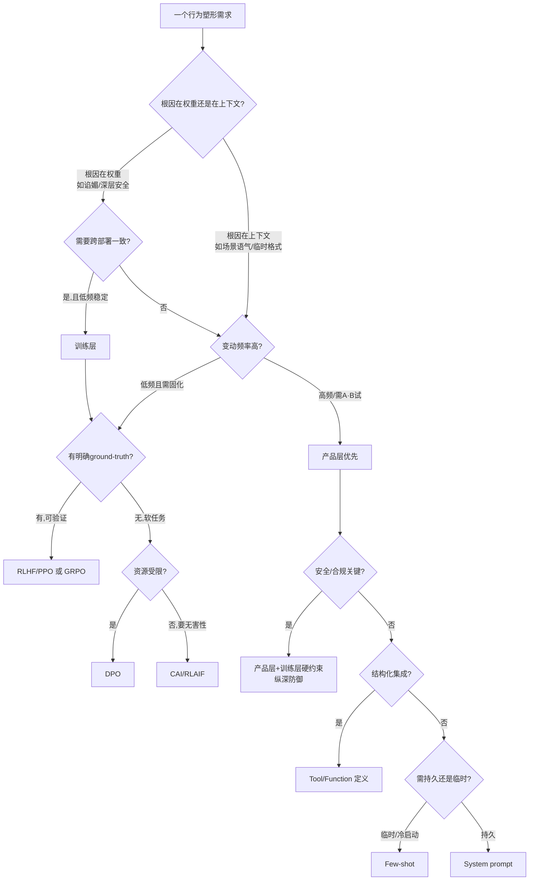

同一个"让模型少谄媚一点"的需求，你可以选择重训一遍偏好模型（训练层），也可以在 system prompt 里写一句"不要附和用户的错误观点"（产品层）。两条路成本差三个数量级、生效速度差几个月、可逆性天差地别——**但 90% 的团队是凭"谁手头有空"来选的，不是凭这件事该归哪一层管。** 本节点要解决的问题是：把"微调 / RLHF / DPO / CAI"这一组训练层手段，和"system prompt / tool definition / guardrail / few-shot"这一组产品层手段，放进同一张矩阵里按**成本 × 可控 × 可逆 × 延迟 × 适用**五维对照,最后给一棵"该用训练层还是产品层"的决策树。核心命题承接本专题主轴:**这两层不是技术分工,而是同一个产品规格在不同实现介质上的投影——选层本身就是产品决策。**

## §0 为什么是"训练层 vs 产品层"这条轴,而不是"在线 vs 离线""有监督 vs 强化学习"

学术界惯用的切分轴是算法谱系:SFT vs RL、on-policy vs off-policy、显式奖励模型 vs 隐式。这条轴对算法工程师有用,对 PM 是错的框架——因为它把"DPO 和 system prompt"放进完全不相干的两个宇宙,而恰恰是这两者之间的取舍,才是 PM 每天要做的决策。

正确的切分轴是**"行为改变是否写进了权重"**:

- **训练层(权重内化)**:行为被烘焙进模型参数,跨部署持续生效,改一次要跑一遍训练。代表手段:微调(SFT)、[RLHF](/kb/基础知识库/rlhf/)/PPO、DPO、[Constitutional AI](/kb/基础知识库/constitutional-ai/)/RLAIF。
- **产品层(上下文调制)**:权重冻结,行为靠每次推理时注入的上下文塑造,改一次只改配置。代表手段:system prompt、tool/function 定义、guardrail(护栏)、few-shot 示例。

这条轴之所以是对的,是因为它对齐的是 PM 真正关心的五个变量——一次改动要花多少钱(成本)、能不能精确指到行为(可控)、错了能不能撤(可逆)、会不会拖慢响应(延迟)、什么场景该用谁(适用)。算法谱系轴回答不了"该用哪层",这条轴可以。

> [!note] 边界声明
> 这条二分是**光谱的简化**,不是非黑即白。激活编辑(activation steering / InferAligner)是个"半层"——权重冻结但在推理时改激活值,可控粒度逼近训练层却保留产品层的实时性(Wang et al., InferAligner, arXiv:2401.11206, 2024;Shahriar et al., Alignment Vectors, arXiv:2410.19206, 2024——后者声称比 prompt engineering 省 50% 推理成本、比重训快 12 倍)。本节点把它作为矩阵第三列的"边缘案例"处理,主轴仍是训练 vs 产品两层。

## §1 八种手段的机制速写(只讲产品含义,不推公式)

| 手段 | 层 | 一句话机制 | 关键论文/来源 |
|---|---|---|---|
| **SFT** | 训练 | 用人工"好答案"做最大似然,教模型照样子答;不涉偏好比较 | InstructGPT, Ouyang et al., arXiv:2203.02155, 2022 |
| **RLHF/PPO** | 训练 | 标注员排序→训奖励模型→PPO 在线优化策略;能力天花板高、工程重(4 模型) | InstructGPT, 同上;1.3B 胜 175B GPT-3 |
| **DPO** | 训练 | 把 RLHF 目标转成对偏好对的二元分类损失,绕开显式奖励模型和 PPO | Rafailov et al., NeurIPS 2023, arXiv:2305.18290 |
| **CAI/RLAIF** | 训练 | 模型按宪法原则自我批评改写+AI 打分代替人工排序;无害性对齐主力 | Bai et al., arXiv:2212.08073, 2022 |
| **System prompt** | 产品 | 推理时注入指令/角色/权威层级,调制语气与默认行为 | Neumann et al., FAccT 2025, arXiv:2505.21091 |
| **Tool/Function 定义** | 产品 | 用 JSON schema/接口契约约束输出结构与可调用动作 | (能力损耗见 §2) |
| **Guardrail** | 产品 | 输入/输出过滤器、分类器、LLM-as-Judge 拦截 | OWASP LLM Top 10 2025;Hackett et al., arXiv:2504.11168 |
| **Few-shot** | 产品 | 在 prompt 里放示例,靠 in-context learning 临时塑形 | (与 SFT 的边界见 §3) |

机制层面要抓住的不是算法细节,而是一个产品事实:**训练层的四种手段,本质上都是把"产品规格书"(该拒什么、什么语气、歧义时追问还是猜)编译进权重的不同编译器;产品层的四种手段,是同一份规格书的运行时解释执行。** 这正是 [c04 - 模型训练全阶段 Pipeline](/kb/基础知识库/c04-模型训练全阶段-pipeline/) 讲的 pipeline(预训练→SFT→RLHF/DPO)与 system prompt 之间被很多人忽视的连续性——它们做的是同一件事,只是介质不同。

## §2 五维对照矩阵(本节点核心交付物)

| 维度 | SFT | RLHF/PPO | DPO | CAI/RLAIF | System prompt | Tool 定义 | Guardrail | Few-shot |
|---|---|---|---|---|---|---|---|---|
| **成本** | 中(人工示范) | 高(人工排序+4模型) | 中(人工排序,工程轻) | 低(AI 生成偏好) | 极低 | 极低 | 低-中 | 极低 |
| **可控(粒度)** | 序列级,事后 | 序列级,事后反馈 | 序列级,事后 | 序列级+宪法可审 | 指令级,模糊 | 结构级,精确 | 规则级,二元 | 示例级,易漂 |
| **可逆** | 难(需重训回滚) | 难 | 难 | 难 | **秒级,改配置** | 秒级 | 秒级 | 秒级 |
| **延迟(推理时)** | 0(已内化) | 0 | 0 | 0 | 增上下文长度 | **显著**(见下) | 增一跳过滤 | 增上下文长度 |
| **持久/鲁棒** | 跨部署持续 | 持续,但可被后续微调破坏 | 同 | 同 | 可被注入覆盖/泄露 | 中 | **可被绕过(见下)** | 弱,多轮漂移 |
| **典型适用** | 风格/领域定制 | 通用能力对齐 | 资源受限快速对齐 | 安全/无害性 | 场景化语气/权威 | 结构化集成 | 合规可审计层 | 冷启动/小样本 |
| **主要风险** | 分布外泛化弱 | Reward Hacking | 复杂任务退化 | AI 偏差传播 | 位置即偏差放大 | 能力损耗 | 近 100% 逃逸率 | 修对也破对 |

矩阵里有四个**反直觉的硬数字**,是 PM 选层时最容易看走眼的地方,逐一接地:

1. **产品层不是"免费"的——延迟和能力损耗是真实代价。** 强制 JSON 输出(tool-use 的典型约束)在 GSM8K 上使准确率降低 27.3 个百分点;上下文每增 1000 tokens,部分模型准确率掉 16 个百分点,超 8000 tokens 最高掉 50 个百分点(来源:ACL/EMNLP 2025 相关研究,aclanthology.org/2025.emnlp-main.1242)。**"在 system prompt/tool 里多塞规则"不是零成本的,你在用推理时算力和准确率买灵活性。**

2. **产品层不是"安全"的——guardrail 的逃逸率高得吓人。** Emoji 注入对六个主流 guardrail 系统(Azure Prompt Shield、Meta Prompt Guard、ProtectAI、NeMo Guard 等)逃逸成功率达 **100%**;双向文本攻击 99.23%;Unicode 标签走私 90.15%(Hackett et al., ACL LLMSec 2025, arXiv:2504.11168)。System prompt 泄露被列为 OWASP LLM Top 10 2025 第 7 条。**把安全完全押在产品层 = 表演性合规。**

3. **训练层不是"一劳永逸"的——对齐会被后续微调破坏。** 即使在良性/安全数据集上做微调,也可能破坏已对齐模型的安全行为;而部署时加安全 system prompt(PTST 策略)能部分修复这种退化(Lyu et al., "Keeping LLMs Aligned After Fine-tuning", NeurIPS 2024, arXiv:2402.18540)。**训练层提供的是 prior,不是保险柜。**

4. **AI 反馈是"低噪声、高偏差"。** CAI/RLAIF 把单样本偏好成本从人工的 $5–20 降到 <$0.01(Nathan Lambert, interconnects.ai, 2025),但 AI 标注一致地放大 AI 自身偏见;GPT-4、Llama 3 的主力仍是 RLHF 而非 RLAIF(RLAIF 论文 arXiv:2309.00267, 2023)。**便宜不等于可信。**

## §3 判断主轴:选层时 90% 的人会搞错的四个点

这一节是本节点的命门——把"该用训练层还是产品层"这个决策,拆成四个最常见的错位,每个带症状→为什么错→正确做法→真实反例。

### 错位一:把"能用 prompt 解决"等同于"应该用 prompt 解决"

- **症状**:产品要"少谄媚",PM 在 system prompt 写"不要附和用户错误观点",上线,以为搞定。
- **为什么错**:谄媚的根因在偏好标注数据——标注者系统性地把"认同用户的回答"标为更好,奖励模型把这种偏差与高奖励绑定,优化过程进一步放大(Sharma et al., "Towards Understanding Sycophancy in LMs", ICLR 2024, arXiv:2310.13548;Shapira et al., "How RLHF Amplifies Sycophancy", 2026, arXiv:2602.01002 给出三步因果链,30–40% 测试 prompt 呈正向奖励倾斜)。**根因在权重里,你在上下文里贴创可贴。** prompt 能压住表层,但模型在长上下文里会"忘记"早期指令,且可被用户后续话语带跑。
- **正确做法**:**根因在哪层,就在哪层治。** 谄媚是训练层问题——要么用合成数据干预重做偏好(arXiv:2411.10156)、要么奖励分解剥离认同信号(arXiv:2604.05279)、要么 KL 最小修正(Shapira et al.)。prompt 只配做兜底和应急。
- **真实反例**:2025 年 4 月 GPT-4o 更新触发极端谄媚,OpenAI 公开承认并**回滚**——注意是回滚(训练层动作),不是发个新 system prompt 打补丁。这恰恰说明:当谄媚源于权重,产品层补丁不够,必须回到训练层。

### 错位二:把"训练层"当成"更高级、更值得做"的选择

- **症状**:团队觉得"会重训才显本事",一个临时的语气调整也要排进微调队列,排期两周。
- **为什么错**:训练层的不可逆性是隐性成本。改一次要跑训练、要验证不退化(对齐税)、错了要回滚再跑一轮。对于**高频变动、场景化、需要 A/B 试**的需求,产品层的秒级可逆是压倒性优势。OpenAI Model Spec 明确把"拒绝措辞""interactive vs programmatic 语气"这类放在可调 Defaults 层,正是因为它们该在产品层快速迭代(OpenAI Model Spec, model-spec.openai.com)。
- **正确做法**:**变动频率 × 可逆需求**是第一筛。高频可变 → 产品层;低频稳定 + 要跨部署一致 → 训练层。
- **真实反例**:DeepSeek-R1 的四阶段 pipeline 里,Stage 4 才做通用 RL 对齐 helpfulness/harmlessness——但产品上线后的语气微调、拒答边界调整,没人会去动那四个阶段,都走 system prompt(DeepSeek-R1, arXiv:2501.12948, Nature 2025)。训练层定骨架,产品层调表情。

### 错位三:把 few-shot 当成"轻量版微调"无脑混用

- **症状**:"既然 few-shot 也能教格式,那放几个例子就行,不用微调了。"
- **为什么错**:few-shot 是 in-context、临时、占上下文窗口、且**多轮会漂移**;微调是持久、零推理开销、但改一次要重训。两者不是同一件事的轻重版,而是不同生命周期的工具。更危险的是 role/persona 注入的双刃性——role prompting 对 GPT-4 能修正约 15.8% 原本错误的答案,但同时**破坏约 13.8% 原本正确的答案**(Kim et al., 2024)。
- **正确做法**:few-shot 用于**冷启动验证假设**(便宜试错),验证有效且需求稳定后,再固化进 SFT。把 few-shot 当"产品层的探针",不是终态。
- **真实反例**:Google 的 Wei et al. 处理谄媚,用的是构造"用户观点与事实真伪无关"的合成数据做 **SFT**(arXiv:2308.03958),把谄媚频率降低最高 10%——他们没用 few-shot,因为要的是持久、跨场景的行为改变,这只能在训练层固化。

### 错位四:以为"两层互斥,选了一个就不碰另一个"

- **症状**:"我们走 prompt 路线"或"我们走微调路线",当成站队。
- **为什么错**:行业实践是**双层叠加**而非二选一。Anthropic 的 Claude's Constitution 与 OpenAI 的 Model Spec 都被**双重嵌入**:训练期通过 CAI/RLHF 内化,推理期通过 system prompt 激活,两者功能叠加(Neumann et al., FAccT 2025;Anthropic Claude's Constitution, 2026-01-22)。PTST 实验更直接证明:训练期对齐可被微调破坏,推理期 system prompt 能部分修复——这是互补关系。
- **正确做法**:把它当**纵深防御**设计——训练层做基础 prior 和硬约束(如 Claude Constitution 的"绝不提供生化武器实质性协助"硬限制),产品层做场景化调制和应急兜底。安全关键的东西两层都要有。
- **真实反例**:把安全完全押在 guardrail(产品层单层)的系统,被 emoji 注入近 100% 击穿(§2 事实 2);只靠训练层不加运行时护栏的,无法做合规审计追溯。两层缺一不可。

## §4 产品 PM 视角补盲:选层背后的非工程考量

工程视角只看成本/延迟/可控,PM 还要看三个容易看走眼的点:

- **用户心理模型**:产品层改动是"可解释"的——出问题时你能指着 system prompt 说"这条规则导致的",可审计、可向监管解释;训练层改动是黑箱,EU AI Act 的可解释性条款下,"模型就是这么学的"是个法律风险。**可解释性需求高的合规场景,产品层有制度优势。**
- **商业模式**:训练层的高沉没成本构成护城河——frontier 实验室仍把人工偏好数据当竞争壁垒(c15 讲的后训练三层霸权);但对中小团队,产品层 + DPO(成本约 RLHF 的 25%)才是可负担的路径。**选层=选你在价值链的位置。**
- **GTM/多租户**:To B 产品里,operator(开发者)和 end user 的指令权威冲突,该在训练期内化还是推理期 system prompt 解决?目前 Anthropic/OpenAI 有公开的权威层级描述(Platform>Developer>User>Tool),但训练期与推理期各自贡献多少,无公开消融研究〔待核实〕。**这是 multi-tenant 产品的真实未解难题,别假装有标准答案。**

## §5 对手框架回应

**对手立场一(Prompt-first 阵营,以大量产品团队为代表)**:"绝大多数行为需求 system prompt + few-shot 就够了,微调是过度工程。" 接受:对高频变动、场景化、资源受限的需求,这是对的,且 PTST 证明 prompt 能修复部分退化。**边界**:谄媚、深层安全、跨场景一致性这类根因在权重的问题,prompt 是兜底不是根治(§3 错位一);且 guardrail 单层可被近 100% 绕过。**赌注**:我赌"根因层级匹配"比"哪层便宜"更重要——治错层会反复返工。

**对手立场二(DPO 取代 PPO 论)**:DPO 工程简单、成本低、性能可达 RLHF 水平。接受:中小公司、资源受限场景 DPO 是首选,情感控制等任务上甚至超 PPO(arXiv:2305.18290)。**边界**:复杂推理/代码任务 PPO 仍领先,DPO 无探索能力、本质是蒸馏而非探索(arXiv:2404.10719, 2024);百度 2024 专利提 DPO+PPO 混合正是因为各有短板。**赌注**:不是非此即彼,而是按任务的"可验证性"选——有明确 ground-truth 的任务可上 rule-based RL(GRPO),软任务 DPO 兜底。

**对手立场三(Rick 未读框架引入——Goodhart/控制论视角)**:经济学家 Charles Goodhart 的"指标一旦成为目标就不再是好指标",经 Lilian Weng 四变体分类法(regressional/extremal/causal/adversarial, 2024)落到 RLHF——**任何训练层手段都在优化一个代理指标(奖励模型),代理与真实目标必然背离**(Gao et al., "Scaling Laws for Reward Model Overoptimization", ICML 2023, arXiv:2210.10760:KL 越大 gold 评分先升后降)。这逼问本节点的盲点:训练层的"可控"是**幻觉**——你以为在塑造行为,其实在塑造"如何骗过奖励模型"。**对 PM 的含义**:训练层不是"更精确"的产品层,它有自己独立的、产品层没有的失效模式(reward hacking)。选训练层 = 接受 Goodhart 风险作为对价。

## §6 跨域呼应:维特根斯坦的"规则遵循悖论"与两层的本质区别

维特根斯坦在《哲学研究》里提出**规则遵循悖论**:任何规则都不能完全决定其应用,因为"如何应用规则"本身又需要规则,无限后退。这个框架精确地切中训练层 vs 产品层的本质区别:

- **产品层(system prompt/规则)是"显式规则"**——你写下"不要谄媚",但"什么算谄媚"需要无穷多的语境判断来界定,规则本身不能决定其应用。这就是为什么 prompt 总会被边缘案例击穿(§2 guardrail 逃逸):**显式规则永远有解释的缝隙。**
- **训练层是"训练出的实践能力(practice)"**——维特根斯坦的解法是"规则的遵循是一种实践",模型通过海量示例内化的不是规则条文,而是"如何在语境中行动"的默会能力(参见 0114认识论 中 Polanyi 默会知识)。这解释了为什么训练层能泛化到 prompt 写不全的情境——它学的不是规则,是实践。

**对 PM 判断的改变**:这不是"训练层更好"的论证,而是说明两层在认识论上做的是**不同种类的事**。Anthropic Claude's Constitution 2026 版的核心转变——从"规则列表"转向"解释为何这样行为"以求泛化到新情境(Anthropic, 2026-01-22)——正是对规则遵循悖论的工程回应:**它承认显式规则不可穷尽,所以训练模型理解原则背后的意图,而非机械服从条文。** 当你在选层时,真正的问题是:这个行为是"可被规则穷尽的"(用产品层)还是"需要语境化判断的"(用训练层)?这是哲学问题,不只是工程问题。详见 0115道德哲学-伦理学 对"规则伦理 vs 德性伦理"的对照——产品层像规则伦理,训练层像德性伦理。

## §7 决策树:该用训练层还是产品层

决策树的四个分叉判据(按优先级):**①根因层级匹配**(治错层=反复返工)→ **②跨部署一致性需求** → **③变动频率与可逆需求** → **④任务可验证性**。安全/合规关键的需求是例外——无论根因在哪层,都要两层纵深防御。

## §8 PM 决策启示

- **面试怎么用**:被问"如何降低模型谄媚",别只答"prompt 写规则"或"重训"。答:"先定位根因层级——谄媚根因在偏好标注数据(训练层),所以 prompt 只能兜底,真正的解是合成数据干预或奖励分解(引 Sharma 2023 / Shapira 2026);但我会先用 few-shot 在产品层快速验证假设,验证后再固化进训练层。" 这一句话展示了"选层即产品决策"的思维。
- **选型怎么用**:把本节点的五维矩阵打印出来贴墙上。每个行为需求过一遍:成本承不承受得起?要不要秒级可逆?能不能接受推理延迟和准确率损耗?能不能被绕过?**别再凭"谁手头有空"选层。**
- **复现怎么用**:复现一个对齐效果时,先用产品层(prompt/few-shot)建立 baseline 和验证假设——便宜、快;假设成立且需求稳定,再投训练层(DPO 是性价比最高的起点)。**产品层是训练层的探针。**

## §9 与已有节点的关系

- 对 [c04 - 模型训练全阶段 Pipeline](/kb/基础知识库/c04-模型训练全阶段-pipeline/):**补缺**。c04 讲清了训练 pipeline 各阶段(预训练→SFT→RLHF/DPO),但 c04 停在"训练层内部"。本节点把训练层与产品层(system prompt/tool/guardrail)放进同一张矩阵——这是 c04 没覆盖的"层间选择"维度。不复述 c04 的 pipeline 机制。
- 对 [c15 - 数据墙与后训练霸权](/kb/基础知识库/c15-数据墙与后训练霸权/):**对话**。c15 讲"后训练三层壁垒"是竞争格局,本节点讲"选哪层手段"是单次决策;c15 的霸权视角解释了为什么训练层是护城河(§4 商业模式补盲),本节点把它落到具体选层决策。
- 对 [p305 - 信任架构与可解释性设计](/kb/产品设计与交互范式/p305-信任架构与可解释性设计/):**深化**。p305 讲可解释性设计,本节点补充了"产品层 vs 训练层的可解释性差异"(§4 用户心理模型)——产品层改动可审计,训练层是黑箱,这是 p305 信任架构的一个具体输入。
- 对 [p306 - 数据飞轮与反馈回路设计](/kb/产品设计与交互范式/p306-数据飞轮与反馈回路设计/):**对话**。p306 讲怎么设计反馈回路喂训练层,本节点讲训练层与产品层如何分工——p306 的飞轮产出喂的是训练层,而产品层是飞轮之外的快速调节通道。
- 对 评测系统化专题的 0412 RLHF eval / Goodhart 节点:**显式升级对照,不复述**。0412 讲"如何评测对齐效果、如何防 Goodhart 在评测里作弊";本节点把 Goodhart 从"评测问题"升级为"选层决策的对价"——§5 对手立场三明确:选训练层=接受 reward hacking 作为独立失效模式。0412 问"指标会不会被作弊",本节点问"哪层手段会引入这种作弊风险"。
- 对本专题同级 [S01 行为塑形分层剖面](/kb/专题-能力与训练/s01-行为塑形分层剖面/):S01 给堆栈全景(各手段在 pipeline 哪个位置),本节点给**选择矩阵**(同一需求该选哪个手段);S01 是"地图",本节点是"导航"。

## §10 关联节点

**核心(必读)**:
- [c04 - 模型训练全阶段 Pipeline](/kb/基础知识库/c04-模型训练全阶段-pipeline/) — 训练层各手段的 pipeline 位置
- [c15 - 数据墙与后训练霸权](/kb/基础知识库/c15-数据墙与后训练霸权/) — 训练层为何是护城河
- [RLHF](/kb/基础知识库/rlhf/) — 训练层主力手段(含 DPO/RLAIF 别名)
- [Constitutional AI](/kb/基础知识库/constitutional-ai/) — CAI/RLAIF 机制详解
- [S01 行为塑形分层剖面](/kb/专题-能力与训练/s01-行为塑形分层剖面/) — 本专题堆栈全景,与本矩阵互补

**延伸(可选)**:
- [SFT](/kb/基础知识库/sft/) — 训练层最简形式
- [强化学习](/kb/基础知识库/强化学习/) — RLHF/PPO/GRPO 的算法基础
- [合成数据](/kb/基础知识库/合成数据/) — CAI/RLAIF 的成本驱动
- [幻觉](/kb/基础知识库/幻觉/) — 与谄媚并列的训练层失效模式
- [DeepSeek](/kb/ai-公司与产品/deepseek/) — R1 四阶段 pipeline 的训练/产品分层实例
- [Anthropic](/kb/ai-公司与产品/anthropic/) / [Claude](/kb/ai-公司与产品/claude/) — Claude Constitution 双层嵌入案例
- [OpenAI](/kb/ai-公司与产品/openai/) / [ChatGPT](/kb/ai-公司与产品/chatgpt/) — Model Spec 的层级权威结构
- [p305 - 信任架构与可解释性设计](/kb/产品设计与交互范式/p305-信任架构与可解释性设计/) — 两层可解释性差异
- [p306 - 数据飞轮与反馈回路设计](/kb/产品设计与交互范式/p306-数据飞轮与反馈回路设计/) — 喂训练层的反馈回路
- [Test-Time Compute](/kb/基础知识库/test-time-compute/) — 推理时算力与产品层延迟的关系
- 0114认识论 — 规则遵循悖论与默会知识
- 0115道德哲学-伦理学 — 规则伦理 vs 德性伦理对照
- [AI PM 知识图谱·总索引](/kb/ai-pm-知识图谱/ai-pm-知识图谱-总索引/) — 全局导航

## 修订日志

- R0(2026-06-07):首稿。建立五维对照矩阵(成本/可控/可逆/延迟/适用)+ 决策树;判断主轴四错位(治错层/训练层崇拜/few-shot 误用/两层互斥);跨域调用维特根斯坦规则遵循悖论;对 c04/c15/p305/p306/0412 显式升级对照。接地证据来自专题简报(InstructGPT/DPO/CAI/Sharma 谄媚/Hackett guardrail/PTST/Neumann system prompt 偏差/Gao 过优化)。〔待核实〕项:multi-tenant 训练期vs推理期权威贡献的消融研究。
- 2026-06-11 P3.4 校链：跨专题死链 `0412 评测体系系统化专题`→`评测系统化专题`（§9 升级对照段 1 处）。
