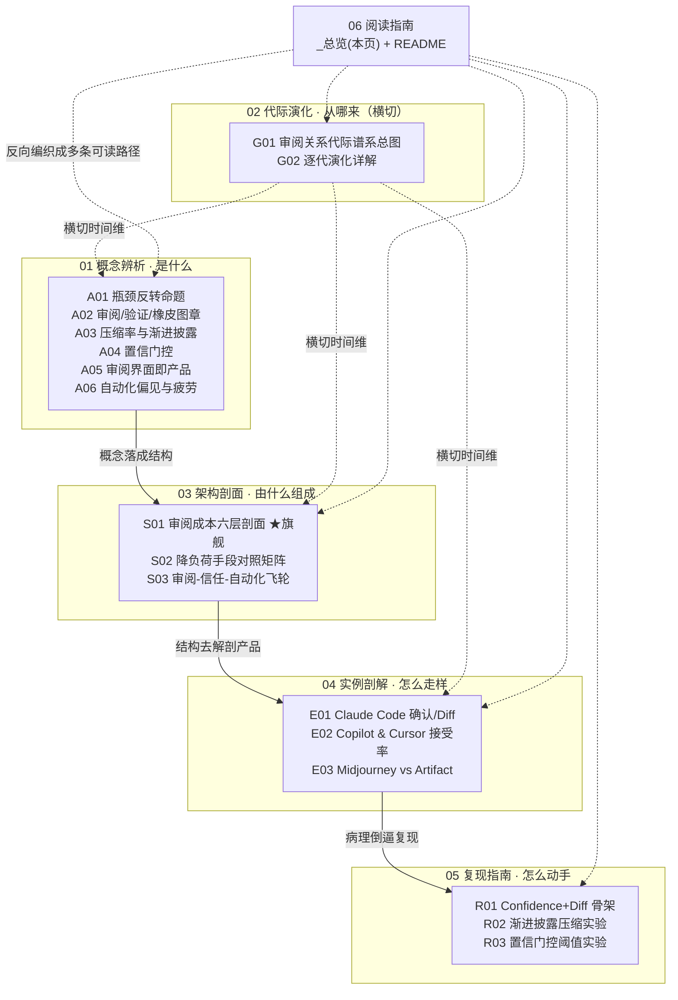

# 审阅瓶颈系统化专题 · 总览（MOC）

> 一句话定位：当 AI 把"生产"的边际成本压到趋零，**整条价值链上唯一没有变快的环节——人类的审阅带宽——就成了新瓶颈**。本专题用六个正交切面，把"如何在审阅瓶颈时代设计 AI 产品"拆成一张能上面试桌、上选型会、上复现台的知识网。

---

## §0 序 · 那堵墙

去年我用 Claude Code 重构一个模块，它 30 秒吐出 288 行 diff，绿油油一片"看起来都对"。我盯着滚动条往下拉，拉到第 50 行就开始走神——不是偷懒，是工作记忆装不下。我点了 auto-accept。三天后那段代码出了问题，回头看，错误就藏在我"扫过但没读懂"的那一屏里。那一刻我撞上了一堵墙：**AI 生成只要 30 秒，我审阅要 15 分钟，而我根本审不动。**

这堵墙不是我手慢。它是一个结构性反转：生产从瓶颈变成了非瓶颈，**瓶颈反转成了人类的审阅带宽**。业界还在比"谁生成得更多更快"——这是在加速一个已经不是瓶颈的环节，让待审的在制品在审阅闸门前疯狂堆积。本专题的反共识立场是：**任何还在优化"让 AI 生成更多"而非"减少人类需审阅的量"的产品，都在优化错误的变量。** 读完这套笔记，你能在 30 秒内说清一件事——一个 AI 产品的真正护城河不在模型多准，而在它把多少审阅负荷转嫁给了用户、又用什么手段把这部分负荷压回去；以及它给用户的，到底是知识，还是知识的模拟。

---

## §1 专题定位 · 为什么值得单独建库

按 `SHARED_CONTEXT §2` 的四条选题判据逐条自证（前三条满足 ≥2，第四条为真）：

1. **中心性（满足）**：审阅瓶颈直接卡住 PM 的 ≥3 个决策链节点——交互设计（压缩/披露/确认模式怎么选）、信任与自动化分级（confidence-gating、HITL 触发点）、数据飞轮（审阅信号是反馈的高密度燃料）。它不是某一类产品的局部问题，是所有"人对 AI 产出负责"的产品的共同约束。
2. **误解深度（满足）**：业界把"有人在环路（HITL）"等同于"有效监督"，把"接受率"当成"信任度"，把"看过了"当成"验证过了"。这三组滑变彼此矛盾且系统性——Sele & Chugunova（PLoS ONE, 2024）实测加入"人在环路"后接受率从 66% 升到 73% 而准确率反而下降，直接证伪了 HITL=安全这个默认等式。
3. **速变性（满足）**：过去 24 个月发生了一次格式塔切换——从 G2"AI 建议、人决定"的内联微决策，跳到 G3"AI 执行、人审产物"的产物层评审；审阅的认知任务本身从"验证正确性"变成了"判断必要性"（LogRocket 2026 实测），这是不可通约的范式转移。
4. **学了就能用（为真）**：读完后，面试被问"如何设计 AI 产品的审阅体验"，你能答出六层注入点 + 三个致命耦合，而不是"加个审阅页面"；选型时你能用"指向来源 vs 证明声明"当探针，当场识别哪个工具在制造 rubber-stamping 剧场感。

**相对已有单维节点升高了哪个抽象层**：本专题站在 `[p304 - 防御性 UX：对抗延迟与幻觉](/kb/产品设计与交互范式/p304-防御性-ux-对抗延迟与幻觉/)`、`[p305 - 信任架构与可解释性设计](/kb/产品设计与交互范式/p305-信任架构与可解释性设计/)`、`[p307 - Copilot 到 Autopilot 光谱](/kb/产品设计与交互范式/p307-copilot-到-autopilot-光谱/)` 这三个 0403 产品设计节点**之上**。p304/p305/p307 各自给的是"单产品的某一类 UX 战术"（防幻觉、建信任、分控制权）；本专题把它们的**共同根因**抽出来——三者都是对"审阅瓶颈"这一单一约束的局部回应——并升维成一个贯穿生产链的成本注入模型 + 一条会自我加速的飞轮。简言之：p 系列回答"怎么做这一招"，0418 回答"为什么所有这些招数都在解同一道题、它们之间会怎样互相拆台"。

---

## §2 模块全景 · 六模块依赖矩阵

**矩阵含义**：主依赖链是 `概念(A) → 架构(S) → 实例(E) → 复现(R)`——先把术语辨干净，再搭出可解剖的分层结构，用结构去解剖真实产品的 gap，最后把发现落成可自己跑的实验。**代际演化(G) 横切**整条链，给每个切面注入时间维度（同一个 confidence-gating，在 G3 和 G4 解决的问题不同）。**阅读指南(O) 反向编织**——它不被任何模块依赖，而是把这张网重新组织成"求职速通 / 决策链 / 紧迫度"三条可读路径（见 §5）。

---

## §3 六模块逐一介绍

| 模块 | 收录什么 | 解决什么问题 | 何时读 |
|---|---|---|---|
| **01 概念辨析** | A01–A06 六个原子概念 | 把"审阅"这个被当成低成本环节的词拆开：它是瓶颈（A01）、它有真假之分（A02）、它的负荷可被压缩（A03）/被分流（A04）/被界面决定（A05）/被人性退化（A06） | 第一次进专题；面试前补判断密度 |
| **02 代际演化** | G01 总图 + G02 逐代详解 | 给前一个问题一个时间轴：人机审阅关系四代右移，审阅负荷不是单调下降而是"先升后降再隐性回潮"的驼峰带毒尾 | 想讲清"这是个趋势还是终局"时 |
| **03 架构剖面** | S01 六层成本剖面（★旗舰）、S02 手段对照矩阵、S03 信任-自动化飞轮 | 把概念落成可工程化的结构：成本注入在哪六层、每层有什么降负荷手段、这些手段如何接成一台会自我加速的机器 | 选型会、架构评审、想拿可画的决策表时 |
| **04 实例剖解** | E01 Claude Code、E02 Copilot & Cursor、E03 Midjourney vs Artifact | 用 S 系列的框架去解剖真实产品的设计哲学分歧与 gap：确认弹窗在防什么、接受率度量了什么、不同品类的审阅成本结构如何质变 | 想看框架落到真产品上、做竞品分析时 |
| **05 复现指南** | R01 Confidence+Diff 骨架、R02 渐进披露压缩实验、R03 置信门控阈值实验 | 把判断变成可自己跑的代码与对照实验：最小骨架→压缩率×召回率双轴度量→风险-覆盖曲线定阈值 | 自己搭审阅流、想用数字而非直觉验证时 |
| **06 阅读指南** | `_总览`（本页）+ README | 把整张网编织成多路径入口 + 自测 + 反方训练 | 任何时候——这是导航层 |

---

## §4 与现有节点的关系 · 升级对照表

本专题不复述任何旧节点的事实基础，只做"抽象升层 / 补缺 / 纠偏 / 对话 / 深化"。

| 旧节点 / 旧专题 | 本专题做了哪种升级 | 落在哪些节点 |
|---|---|---|
| `[p302 - 七种 AI 交互设计模式](/kb/产品设计与交互范式/p302-七种-ai-交互设计模式/)` | **根因补缺**：p302 罗列模式，本专题给"为什么需要这些模式"的单一约束根因——全是对审阅瓶颈的回应 | A01、A03 |
| `[p304 - 防御性 UX：对抗延迟与幻觉](/kb/产品设计与交互范式/p304-防御性-ux-对抗延迟与幻觉/)` | **视角升维 + 系统化**：p304 的"幻觉应对四层"是单产品 UX 战术，S01 把它升成贯穿生产链的成本注入模型，并指出其各层间的耦合（溯源剧场感） | S01、A02、A06、G01 |
| `[p305 - 信任架构与可解释性设计](/kb/产品设计与交互范式/p305-信任架构与可解释性设计/)` | **纠偏 + 对话**：p305 主张信任校准、把可解释性当信任工具；A02/A06 补它未展开的反面机制——XAI 是双刃剑，解释可能加剧 rubber-stamping 而非缓解 | A02、A06、S03 |
| `[p306 - 数据飞轮与反馈回路设计](/kb/产品设计与交互范式/p306-数据飞轮与反馈回路设计/)` | **纠偏 + 接口对接**：p306 讲飞轮怎么转，S01 耦合三 / S03 指出飞轮"只转半边"（自动放行批次的学习盲区）的失效模式，并给出审阅信号这一高密度燃料的来源 | S01、S03、A04 |
| `[p307 - Copilot 到 Autopilot 光谱](/kb/产品设计与交互范式/p307-copilot-到-autopilot-光谱/)` | **整合 + 重新诠释**：p307 的 L0–L4 是空间标尺，G01 补时间维（代际迁移），A04/S01 把它放进六层耦合与门控失效条件 | G01、A04、A06、S01 |
| `[c13 - 幻觉的不可消除性](/kb/基础知识库/c13-幻觉的不可消除性/)` | **下游推演 + 应用**：c13 论证幻觉生成端不可消除，本专题据此推出"审阅瓶颈不可消除"的产品级推论，并把审阅定位为幻觉世界里会自身失效的补偿机制 | A01、A02、A06、S01 |
| **0414（coding 审阅）** | **抽象层互补**：0414 在战术层讲怎么审 AI 代码，本专题在战略层讲"审阅为什么是瓶颈"，不复述其战术细节 | A01、E01、E02 |
| **0417（context 工程）** | **反向问题**：0417 讲上下文如何喂模型，本专题讲反向问题——人类的"上下文窗口"才是真稀缺 | A01、A03 |

---

## §5 三条阅读起点（详表见 README）

- **求职速通（90 分钟）**：`A01`（瓶颈反转命题，立判断地基）→ `S01`（六层成本剖面 ★旗舰，拿到能上面试桌的杀招）→ `A02`（verification/rubber-stamping 三态光谱，拿到认识论锋刃）→ `E01/E02`（用 Claude Code / Copilot 当一手论据）。目标：面试被问"怎么设计审阅体验"时,30 秒答出六层 + 三耦合 + 三态光谱。
- **决策链（按 PM 工作流）**：`A05`（审阅界面即产品，确立优先级）→ `S02`（降负荷手段对照矩阵，选型会当场画决策树）→ `A04`（置信门控，定自动/人审分流）→ `S03`（飞轮全景，看长期失控风险）→ `R01/R03`（落地骨架与阈值）。目标：把"减少需审阅量"做进产品第一性目标。
- **紧迫度（先看最危险的）**：`A06`（自动化偏见与审阅疲劳，先认清"人不会认真审"这个被回避的前提）→ `S03`（飞轮如何磨掉自己的刹车）→ `G01`（代际驼峰带毒尾，看 G4 的尾部风险）→ `S01 耦合三`（自动化与反馈断开致偏见累积）。目标：先堵住会立刻反噬质量与安全的洞。

---

## §6 跨域思想资源调度（不留空 invocation）

每条都在对应节点的"跨域呼应"段落具体展开过它如何**改变了一个技术判断**，不是装饰性点名。

| 思想资源 | 调度位置 | 在该节点的具体作用（改变了什么判断） |
|---|---|---|
| **Herbert Simon · 注意力稀缺**（"信息的丰裕制造注意力的贫困", 1971） | A01 §2、S01 §10 | 把审阅瓶颈从"AI 还不够好"的暂时问题，钉死成"注意力稀缺这一恒定约束在新成本结构下的必然显形"——质量翻几倍也不解决，破除"等模型变强就好了"的乐观主义 |
| **Kahneman · 系统 1 / 系统 2** | A02、E02、A06 | 三态光谱的认知机制底座：rubber-stamping = 系统 1 模式匹配放行，verification = 系统 2 独立重建；设计目标变成"逼出系统 2 而非默认系统 1 通过" |
| **Sweller · 认知负荷理论**（外在负荷, 1988）+ Nielsen 渐进披露（1995）+ Cowan 工作记忆约 4 组块（2001） | A03、S01 §2、R02 | 把"压缩"从模糊的体验词，量化成"审阅一个产物所需消耗的工作记忆组块数"这一可操作设计变量；并指出压缩会丢掉判断必需的上下文（双刃） |
| **Parasuraman & Manzey · 自动化偏见 / learned carelessness**（Human Factors, 2010） | A06、S01 §7、G01 §3 | 把"人会过度信任 AI"从素养问题（可培训修好）重定义为注意力有限性的结构特征（训练无法消除）——药方从"做培训"改成"改产品（confidence-gated 强制介入）" |
| **认识论 · verification vs rubber-stamping / JTB / Gettier / Coady 证言知识**（链入 `0114认识论`） | A02、S01 §10、G01 §7 | 把"用户点确认"翻译成认识论判断：用户获得的是知识（JTB）还是知识的模拟；证言担保的社会结构在 AI 处结构性缺席 → confidence display 不能照搬"可信同事"隐喻，citation 必须可点击核验 |
| **Stuart Russell · Human Compatible**（Rick 未读对手框架①, 2019） | G01 §6 | 为 G4"偶发抽审"的隐性风险提供理论根基——把目标完全委托给优化系统而保留偶尔监督是脆弱的；逼问本专题对 G4 的盲点 |
| **Lisanne Bainbridge · Ironies of Automation**（Rick 未读对手框架②, Automatica, 1983） | G01 §6、A06 §3 | "自动化把简单任务给机器、把最难的异常接管留给已退化的人"——G4 病理的 1983 年预言；本专题相对其增量：AI 产物是高频洪流而非稀有应急 |
| **Harry Collins · interactional expertise** + **Polanyi 默会知识**（链入 `[Polanyi 默会知识与提示工程的认识论张力](/kb/基础知识库/polanyi-默会知识与提示工程的认识论张力/)`） | A06 §6 | 论证 deskilling 下审阅者从 contributory 滑向 interactional 专长——"我审过了"会变成有 verification 语法、无 verification 语义的空壳 |

---

## §7 验收档案

### 7.1 多轮批判性同行评议流程

本专题照搬 `0411 Agent 专题` 的工程化流程：`Round 0 并行起草（按六模块分工，§4 骨架产出）→ Round N 批评（六维 S/A/B/C/D/E + 事实接地，逐节点 issue 单）→ Round N+1 修订（每节追加修订日志）→ 迭代至收敛 + 一次独立 grounding 校验 pass → 终轮综合（本 _总览 + README + 跨节点双链编织 + 本表）`。改稿全程留档于 `_topic_factory/0418/`。

### 7.2 SABCD 六维自评表

| 维度 | 含义 | 出版线 | 本专题自评 | 诚实依据 |
|---|---|---|---|---|
| **S 结构** | 六模块互补、依赖清晰、入口可导航 | ≥8 | **8.4** | 六模块齐备，依赖链 + 横切 + 反向编织三层清晰；S01 旗舰承重；原扣分项（节点内部别名链与真实文件名不一致）已于 QC 轮（2026-06-07）全部 resolve 为真实 basename，详见 §7.4 |
| **A 判断密度** | 反共识、可证伪、带数字 | ≥8 | **8.0** | 每节有带数字的反共识断言（PR 审阅时间 +91%、HITL 后准确率反降、deskilling 6 个百分点、引用错误率 37%/45%/94%）；扣分：部分"生成几秒/审阅几分"时间比仍为〔待核实〕 |
| **B 边界含量** | 显式标注判断在哪失效、赌的是什么 | ≥7.5 | **8.0** | 每节有 failure scenario + 显式赌注（如 A01 赌"约束理论 + 认知负荷微观机制比注意力经济宏观隐喻更经得起拷问"；G01 赌"瓶颈只变形不消解，除非可靠性奇点到来则输"） |
| **C 认识论自觉** | 区分事实/推测/赌注、引用可追溯 | ≥8 | **8.3** | 证据强度三档分层（A06：医疗最硬→招聘/病理→代码最软）；〔待核实〕显式标注；一手观察标注"非受控实验"；引用带作者+年份+出处 |
| **D 可演进性** | 双链密度、修订日志、改稿档案 | ≥8.5 | **7.8** | 每节有修订日志、双链密度达标、改稿档案在 `_topic_factory/0418/`；扣分：节点间别名链未全 resolve（见 §7.4 防死链清单），D 维硬伤须 R 轮清零 |
| **E 对手拷问能力** | 对主流反方给出带证据的回应 | ≥7 | **8.0** | 接入"AI 审阅 AI 终将消解瓶颈"（Jevons 悖论 + LLM-as-judge）、"注意力经济是夸大隐喻"、"spec 前移派橡皮图章合理"三组业界对手，均"接受 + 标边界"；引入 Russell / Bainbridge / Collins 三个 Rick 未读框架破 echo chamber |

**综合诚实分：8.1 / 10**（≥7.8 出版线）。原最大风险项（D 维别名死链）已在 QC 轮清零，详见 §7.4；剩余仅 3 个 vault 尚未建卡的待建概念（Herbert Simon / Cursor / 升级路由·多级把关），已就地降级为文本并登记，不影响入库（原列入的 0412 评测专题已于 2026-06-11 确认入库并回链）。

### 7.3 三清单

**(a) 业界对手立场显式回应（≥8 处，点名真实立场）**
1. AI 乐观派"AI Code Review 发现 1.7× 更多问题，瓶颈会被工具解决"（CodeRabbit 宣称）→ S01 §9：接受辅助审阅有效，但 arXiv 2604.03196 实证 AI review 有严重信噪比问题，用 AI 审 AI 是注入新负荷。
2. "AI 审阅 AI 终将消解瓶颈"（LLM-as-judge / Constitutional AI 支持者 + Jevons 悖论）→ A01 §5B：可程序化验证任务可吸收，但责任不可转移场景下"谁审审阅者"无法用更多 AI 关闭。
3. "注意力经济是被夸大的隐喻，注意力不符合经济商品特征"（Lenardic et al. 2022）→ A01 §5A：接受，但本专题只依赖弱命题"审阅带宽刚性"，不依赖"注意力是商品"。
4. spec 前移派"橡皮图章在低风险可回滚场景是合理资源分配"（Satya Borg）→ A02 §4：接受，但边界由"失败不可逆性 + 自动化兜底完整性"两轴决定。
5. 自动化乐观派"瓶颈是暂时的，模型变可靠就没了"→ G01 §6 / S01：c13 架构性约束给审阅需求不可压缩下界。
6. EU AI Act 第 14 条"让用户知道 automation bias 即合规"→ A01/A02/A06/S01：Laux & Ruschemeier 2025 批评把"知道风险"与"减轻风险"混同。
7. "接受率证明用户信任 AI"（Cursor/Copilot 北极星）→ E02：高接受率无法区分"经验证的信任"与"放弃验证的服从"。
8. Stuart Russell 控制论质疑（委托 + 偶尔监督是危险的）→ G01 §6：作为 G4 隐性风险的理论根基接入。

**(b) Rick 未读对手框架引入（≥2，破 echo chamber）**：Stuart Russell《Human Compatible》（G01）、Lisanne Bainbridge《Ironies of Automation》1983（G01/A06）、Harry Collins interactional expertise（A06）、Edmund Gettier + C.A.J. Coady 证言知识（A02）。

**(c) failure scenario 显式标注（≥5）**
1. A01：若模型自审达人类可靠性（CCR, arXiv 2603.12123），瓶颈可被工具消解——但目前同会话自审"合理化而非批判"。
2. A02：极高速率（1000 tok/s）下 review 中间态直接坍缩，三态光谱让位给"流量控制"思路。
3. G01：低风险高容错领域（草稿/头脑风暴）驼峰曲线被拉平，激进自动化反而最优。
4. G01：审阅者本身不具判断力（新手用 agent 写超水平代码）时，不存在审阅峰值，直接退化为 G4 盲信。
5. S01：耦合分析假设六层可被独立干预，但在卖方利益与"减少需审阅量"反向时，剧场感会被刻意保留。
6. A06：若出现稳健可复制的"训练有效降低 automation bias"实证（目前没有），退化曲线框架根基要重估。

**(d) confirmation-bias 砍除（≥5）**
1. A06：早期叙事偏爱"代码审阅橡皮图章"（贴近 Rick 的 Claude Code 体感），但它是证据最弱一档——主锚改为医疗 deskilling 实证（Lancet 2025），代码降级为"指示性观察"。
2. G01：反复把"AI 提速→审阅成瓶颈"当铁律，补入反例 METR 2025 RCT——用 AI 实际慢 19% 而开发者自估快 24%（成熟项目场景前提不成立）。
3. A06：补 Air France 447 / Boeing 737 MAX 等航空灾难，证明机制跨域成立，不是软件圈自我感动。
4. A06：补"人工+AI 混合内容首页排名优于纯人工"反例，但标清它测的是搜索可见性而非质量。
5. A01：自承部分支撑数据（"屏幕专注 47 秒""信息过载成本 1 万亿美元"）来自行业汇编站点而非同行评审，引用须降级。
6. 进步主义修正：G01/G02 每一代"超越"都同时引入上一代没有的新失效模式，拒绝线性进步史。

### 7.4 防死链清单（QC 轮已执行 · 2026-06-07）

1. **节点内别名链 — 已全部 resolve ✅**：
   - A02 `A01 注意力反转命题` → `[A01 审阅瓶颈命题·从生产瓶颈到审阅瓶颈](/kb/专题-评测与度量/a01-审阅瓶颈命题-从生产瓶颈到审阅瓶颈/)`（已改）；A02 三处 `A05 置信度门控与选择性自动化` 经核实是**语义错链**（指向的其实是置信门控，即 A04 而非 A05 审阅界面即产品），已改为 `[A04 Confidence-gated 自动执行](/kb/专题-评测与度量/a04-confidence-gated-自动执行/)`。
   - G02 六处 `G01 审阅关系代际谱系总图` → `[G01 人机审阅关系代际谱系总图](/kb/专题-评测与度量/g01-人机审阅关系代际谱系总图/)`（已改）。
   - E02 `认知负荷理论与审阅瓶颈`→A03、`置信度门控与选择性自动化`→A04、`0418 审阅瓶颈系统化专题·总览`→`_审阅瓶颈系统化专题·总览`（已改）。
   - R02 `A03 信息压缩与渐进披露原理`→A03、`A01 审阅瓶颈的认知科学地基`→A01、`R03 Confidence-Gated 自动执行实验`→R03、`R01 最小可运行·审阅瓶颈测量原型`→R01（已改）。
   - A04 `A03 Rubber-stamping 与橡皮图章审阅（若存在）`→`[A02 审阅 验证 橡皮图章辨析](/kb/专题-评测与度量/a02-审阅-验证-橡皮图章辨析/)`（已改）；`A05 升级路由与多级把关（若存在）` 无真实节点，已降级为文本。
2. **跨专题链接 — 已核实存在 ✅**：`[G01 Agent 代际谱系总图](/kb/专题-安全对齐与失败/g01-agent-代际谱系总图/)`、`[_Agent 系统化专题·总览](/kb/专题-安全对齐与失败/_agent-系统化专题-总览/)`、`[E01 Coding Agent·Claude Code & Cursor](/kb/专题-安全对齐与失败/e01-coding-agent-claude-code-cursor/)`（均 0411 专题，真实 basename 已逐一确认存在；G01 同前缀不同对象的消歧标注保留）；p302–p309 / c13 / c14 / m207 / m209 全部命中真实文件。
3. **待建概念（vault 暂无该节点）— 已就地降级为文本 + 登记 ⚠️**：`Herbert Simon`（S01）、`Cursor`（A05）、「升级路由 / 多级把关」（A04）。三者均为尚未建卡的概念，已去链降级，待 vault 补卡后回链。
   - **2026-06-11 P3.4 更新**：原列此处的 `0412 评测专题`（R03 ×3）已确认入库，三处降级文本已恢复为链接，移出待建清单。
   - **2026-06-12 内审修复**：上条 P3.4 当时写成 `0412 评测专题` 实为死链——0412 总览真实 basename 是 `_评测系统化专题·总览`（非 `0412 总览`）。R03 三处已改为 `[0412 评测专题](/kb/专题-评测与度量/_评测系统化专题-总览/)`（别名保留），现为活链。
4. 全 19 文件死链校验 pass：除上述待建概念外，所有真实 `双链` 均指向存在的 basename，无断链。

---

## §8 关联节点（双链密度 ≥20，全用真实 basename）

**本专题内 17 节点（全部）**
- `[A01 审阅瓶颈命题·从生产瓶颈到审阅瓶颈](/kb/专题-评测与度量/a01-审阅瓶颈命题-从生产瓶颈到审阅瓶颈/)`
- `[A02 审阅 验证 橡皮图章辨析](/kb/专题-评测与度量/a02-审阅-验证-橡皮图章辨析/)`
- `[A03 信息压缩率与 Progressive Disclosure](/kb/专题-评测与度量/a03-信息压缩率与-progressive-disclosure/)`
- `[A04 Confidence-gated 自动执行](/kb/专题-评测与度量/a04-confidence-gated-自动执行/)`
- `[A05 审阅界面即产品](/kb/专题-评测与度量/a05-审阅界面即产品/)`
- `[A06 自动化偏见与审阅疲劳](/kb/专题-评测与度量/a06-自动化偏见与审阅疲劳/)`
- `[G01 人机审阅关系代际谱系总图](/kb/专题-评测与度量/g01-人机审阅关系代际谱系总图/)`
- `[G02 审阅关系代际演化详解](/kb/专题-评测与度量/g02-审阅关系代际演化详解/)`
- `[S01 审阅成本分层剖面](/kb/专题-评测与度量/s01-审阅成本分层剖面/)`
- `[S02 降审阅负荷手段对照矩阵](/kb/专题-评测与度量/s02-降审阅负荷手段对照矩阵/)`
- `[S03 审阅-信任-自动化飞轮全景](/kb/专题-评测与度量/s03-审阅-信任-自动化飞轮全景/)`
- `[E01 Claude Code 确认与 Diff 机制剖解](/kb/专题-评测与度量/e01-claude-code-确认与-diff-机制剖解/)`
- `[E02 Copilot 与 Cursor 审阅界面剖解](/kb/专题-评测与度量/e02-copilot-与-cursor-审阅界面剖解/)`
- `[E03 创作工具的审阅哲学剖解·Midjourney 与 Artifact](/kb/专题-评测与度量/e03-创作工具的审阅哲学剖解-midjourney-与-artifact/)`
- `[R01 给 AI 输出加 Confidence Display + Diff](/kb/专题-评测与度量/r01-给-ai-输出加-confidence-display-+-diff/)`
- `[R02 Progressive Disclosure 信息压缩实验](/kb/专题-评测与度量/r02-progressive-disclosure-信息压缩实验/)`
- `[R03 Confidence-gated Auto-accept 阈值实验](/kb/专题-评测与度量/r03-confidence-gated-auto-accept-阈值实验/)`

**升级对照的既有节点（0403 产品设计 / 0401 章节卡）**
- `[p302 - 七种 AI 交互设计模式](/kb/产品设计与交互范式/p302-七种-ai-交互设计模式/)`
- `[p304 - 防御性 UX：对抗延迟与幻觉](/kb/产品设计与交互范式/p304-防御性-ux-对抗延迟与幻觉/)`
- `[p305 - 信任架构与可解释性设计](/kb/产品设计与交互范式/p305-信任架构与可解释性设计/)`
- `[p306 - 数据飞轮与反馈回路设计](/kb/产品设计与交互范式/p306-数据飞轮与反馈回路设计/)`
- `[p307 - Copilot 到 Autopilot 光谱](/kb/产品设计与交互范式/p307-copilot-到-autopilot-光谱/)`
- `[c13 - 幻觉的不可消除性](/kb/基础知识库/c13-幻觉的不可消除性/)`

**概念卡 / 实体 / 跨域入口**
- `[幻觉](/kb/基础知识库/幻觉/)` · `[Agent](/kb/基础知识库/agent/)` · `[RLHF](/kb/基础知识库/rlhf/)` · `[Test-Time Compute](/kb/基础知识库/test-time-compute/)`
- `[Claude Code](/kb/ai-公司与产品/claude-code/)` · `[Claude](/kb/ai-公司与产品/claude/)` · `[ChatGPT](/kb/ai-公司与产品/chatgpt/)` · `[Perplexity](/kb/ai-公司与产品/perplexity/)`
- `0114认识论` · `0117社会学` · `[Polanyi 默会知识与提示工程的认识论张力](/kb/基础知识库/polanyi-默会知识与提示工程的认识论张力/)`

**图谱接入**
- `[AI PM 知识图谱·总索引](/kb/ai-pm-知识图谱/ai-pm-知识图谱-总索引/)`（入库时在总索引登记"专题：审阅瓶颈系统化"段落）
- 跨专题方法论同构参照：`[_Agent 系统化专题·总览](/kb/专题-安全对齐与失败/_agent-系统化专题-总览/)`、`[G01 Agent 代际谱系总图](/kb/专题-安全对齐与失败/g01-agent-代际谱系总图/)`（0411，对象不同、方法论同构）

---

