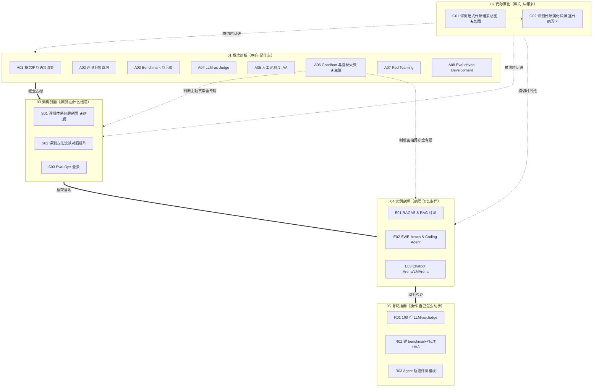

# 评测系统化专题 · 总览（MOC）

> 本页是 `0412 评测系统化专题` 的导航中枢（MOC）。它不复述各节点的事实，只回答四件事：**这个专题为什么存在、由什么组成、与你已有的知识网络怎么对接、以及它对自己有多诚实。** 想直接进正文，跳到 [§5 三条阅读起点](#§5-三条阅读起点)。

---

## §0 序：那堵叫"eval"的墙

2025 年到 2026 年，Rick 在面试桌和选型会上反复撞同一堵墙：**"eval"这个词，每个人指的都不一样。** 算法同学说"eval 过了"，指 MMLU 提了两个点；产品同学听成"可以上线了"；销售把"SWE-bench 93.9%"写进标书，客户在真实工单上验收只剩四成。同一个词，在一句话里同时背着学界竞赛、软件测试、教育测量三套互相打架的传统，而说话的人和听话的人各自默认了不同的一种——事故就发生在这条缝里。

业界的默认止血方案是"换个更难、更新的 benchmark"。本专题的反共识立场正相反：**评测的根病不是"题不够难"，而是"评测从没被当成一个有治理、有归因、有版本、会随时间腐烂的系统来维护"。** 换题只是把饱和时钟往后拨几个月。Goodhart 在治理层、污染在数据集×评判器的接口上、bad case 无法复盘在归因层——这些病换十个 benchmark 也修不掉。

**读完这个专题，你应当能在 30 秒内做到三件事**：(1) 听到"eval 通过了"立刻反问"哪一层、什么集、谁评的、带区间吗";(2) 拿到任何一个漂亮分数，说清"为什么我不信它";(3) 给自己的产品搭一套"腐烂得足够慢、且你能监测腐烂速度"的评测组合。这不是"了解一下",是面试桌、选型会、复现台上立即可观测的判断力。

---

## §1 专题定位：为什么单独建 0412

按宪章 §2 的四条选题判据逐条论证——前三条满足 ≥2 即可，第四条须为真。评测**四条全中**，这是它配独立建库、而非塞进某个 c/m 章节的硬理由。

| 判据 | 评测命中情况 | 证据 |
|---|---|---|
| **① 中心性**（影响 ≥3 个 PM 决策链节点） | ✅ 命中 | 选型（信哪个分）、上线验收（什么算通过）、迭代（bad case 回灌）、对外宣称（话术红线）、合规举证——五个决策链节点全被评测穿过 |
| **② 误解深度**（业界定义互相矛盾、系统性滑变） | ✅ 命中（最强） | benchmark/eval/metric/test/validation/assessment 来自三个不同知识传统，"eval 通过了"有四种互不兼容所指（见 A01） |
| **③ 速变性**（24 个月内 ≥1 次格式塔切换） | ✅ 命中 | 从 LLM-as-Judge 普及（2023）→ Arena Elo 成事实标准（2024）→ Agent 轨迹评测（2025）→ OpenAI 2026-02 主动弃用 SWE-bench Verified，两年内换了三次"测量仪" |
| **④ 学了就能用**（面试/选型/复现立即获判断力） | ✅ 为真 | 每个节点都落"面试怎么用/选型怎么用/复现怎么用"三类，复现模块直接给可跑代码 |

**它升高了哪个抽象层？** 现有的 c14 / m205 / m207 都是**单维节点**——c14 讲"怎么防 Goodhart"、m205 讲"怎么测 RAG"、m207 讲"Agent 七维指标"。它们各自正确，但都停在"用哪些指标、怎么测"这一层。0412 升高一个抽象层：**把评测本身当成一个有接口契约、有责任边界、会腐烂的系统来解剖**——从"用对的尺子"升到"尺子从哪来、由什么组成、什么时候会坏、谁为它负责"。这是从工具使用者到工具治理者的视角跃迁。

> [!note] 与 0411 Agent 专题的关系
> 0412 是 0411 的**评测层姊妹专题**。0411 的 S01（六层架构）、[A04 Reflexion](/kb/专题-安全对齐与失败/a04-reflexion/)（自我评判）、0411 G01 都在"Agent 能力"维度；0412 提供评判这些能力的尺子。两个专题的 G01（代际谱系）共享同一方法论骨架（库恩+拉卡托斯读代际、每代配反例、拒绝线性进步史），可对照阅读。

---

## §2 模块全景：六模块矩阵与依赖

本专题 20 个节点（19 内容节点 + 本总览）分布在宪章规定的六模块骨架上。下图是六模块的依赖与横切关系。

**矩阵含义**：依赖主链是 `概念辨析 → 架构剖面 → 实例剖解 → 复现指南`（先懂概念、再看结构、再看真实病例、最后动手）。**代际演化（G01 总图 + G02 逐代详解）横切**所有模块，提供时间维度——任何一个概念/架构/实例都能在六代谱系里定位；G01 给框架与方法论赌注，G02 逐代展开代表/推动力/瓶颈/Hype Cycle 定位并钉反例。**A06 Goodhart 是判断主轴**，它不是普通概念卡，而是统辖整个专题的元判断（"任何 eval 被纳入优化目标就开始失效"），向架构与实例两个模块渗透。阅读指南（本总览 + README）**反向编织**，把这张网拆成多条可读路径。

> [!note] 02 模块结构说明
> 宪章 §3 建议代际演化模块 2–3 个节点；本专题 02 模块现有 **G01（总图）+ G02（逐代演化详解）两个节点**，满足下限。G01 把六代谱系 + 库恩/拉卡托斯框架 + 四个判断坑写厚（拿框架）；G02 逐代展开代表/推动力/瓶颈/被下一代如何超越/退化纲领判断，并在每代末尾钉一个反例（拿弹药）。原先标注的"G02 未落稿缺口"已于 2026-06-12 内审复核为**实为满稿（27477 字节）**，缺口表述作废。

---

## §3 六模块逐一介绍

### 01 概念辨析（A01–A08）—— 横向：先看清"评测"这个词在每次使用时到底指什么
**收录什么**：八个把单一概念讲透的原子节点。A01（六词语义史 + 维特根斯坦"标准 vs 症状"）、A02（模型/系统/产品/结果四层错配事故）、A03（饱和+污染+构念效度）、A04（位置/冗长/自我偏差）、A05（IAA/Kappa/黄金集治理）、A06（★判断主轴）、A07（对抗性评测）、A08（评测前置到产品定义）。
**解决什么问题**：挡掉"评测=跑分，分高就好"这个把正交概念压成标量的默认错误框架。
**何时读**：被一个分数/术语绕晕、或要在选型会上拆穿话术时——这是全专题的"词典层"。

### 02 代际演化（G01 + G02）—— 纵向：评测不是越测越准，是 Goodhart 失效后被迫换靶子
**收录什么**：G01（总图）——六代谱系（静态语言指标→任务 benchmark→人工偏好→LLM-as-Judge→竞技场 Elo→Agent 轨迹评测）+ 库恩/拉卡托斯方法论赌注；G02（逐代详解）——每代取一张统一"病历卡"，写清代表论文/产品/基准（带核证年份）、推动力、瓶颈、被下一代如何超越、退化纲领判断，并在每代末尾钉一个反例戳破"这一代终于测准了"的幻觉。读 G01 拿框架，读 G02 拿弹药。
**解决什么问题**：用库恩范式更替 + 拉卡托斯纲领退化两把尺，破除"能力天梯"式线性进步史，让你在选型会上把"新 benchmark 分更高"读成"进步性（测到新维度）还是退化性（只是堵旧漏洞）"。
**何时读**：看到厂商宣称"在最新最难的 benchmark 上 SOTA"、想判断该不该为这个"高分"付溢价时。

### 03 架构剖面（S01–S03）—— 解剖学：评测系统由什么可替换组件组成
**收录什么**：S01（★旗舰节点，最厚——六层堆栈：数据集/指标/评判器/流程/归因/治理 + 接口契约表 + 三个致命耦合点）、S02（规则/参考/语义/LLM-judge/人评/Arena 六法 × 六维取舍矩阵 + 决策树）、S03（把评测当生产系统运维——对 eval 做 eval 的四种死法）。
**解决什么问题**：把散落在 c14/m205/m207 的评测知识拉到"评测作为可分层、可定位责任、会腐烂的系统"这一更高抽象层。
**何时读**：要从零搭一套评测体系、或要给一个失真的分数做责任定位时——这是全专题的"承重梁"。

### 04 实例剖解（E01–E03）—— 病理学：三具真实标本怎么走样
**收录什么**：E01（RAGAS 四指标的构念效度审计——全绿≠好用）、E02（榜单政治经济学——分数是生产关系产物）、E03（偏好聚合机器 + 社会选择理论）。
**解决什么问题**：把架构剖面的抽象框架钉进三个你天天会遇到的真实评测系统，证明那些"裂缝"不是泛泛之论。
**何时读**：正在用 RAGAS / 看 SWE-bench 榜 / 引用 Arena 排名做决策时——对症查阅。

### 05 复现指南（R01–R03）—— 操作手册：从论文百分比到肉身确认
**收录什么**：R01（亲手复现位置偏差，把数字变成"原来真会变"的肉身确认）、R02（一周造一个信得过、能追责的小评测集 + 跑 Cohen's Kappa）、R03（τ-bench 风格轨迹评测——区分"做对的"和"蒙对的"轨迹）。
**解决什么问题**：把概念辨析里的判断变成可贴进 PR、可在选型会摊开的具体数字。
**何时读**：读完概念想动手、或要在面试里证明"我真搭过"时。

---

## §4 与现有节点关系：升级对照表

本专题不复述旧节点的事实，而是在更高抽象层做"补缺/纠偏/对话/深化"。下表是逐对照应（详见各节点"与已有节点的关系"段）。

| 旧节点 | 本专题哪些节点升级了它 | 升级类型 | 升级了什么 |
|---|---|---|---|
| c14 | S01 / A01 / A06 / G01 / S02 / E01 / E02 | 抽象层升高 + 纠偏 | c14 停在"防御 Goodhart"（自建黄金集）；S01 把 Goodhart 重定位为 L2×L6 接口病；A06 把它升格为统辖全专题的判断主轴 + 动态指标组合；G01 把所有防御对象放进代际时间轴；E03/E02 **纠偏** c14 对"Arena 盲测相对可信"的乐观（Arena 自有 WEIRD/gaming/BT 传递性脆弱一整套偏差） |
| m205 | S01 / E01 / A02 / S03 / S02 | 抽象化 + 纠偏 | m205 的 RAGAS 四维属 L2、分层诊断属 L5；S01 抽象成"任何评测都要有归因层闭环";E01 给 RAGAS 加构念效度审计并**纠偏**"检索诊断不该交给 LLM"（应用 recall@k/nDCG）;S03 把"Embedding Drift"泛化为 eval drift |
| m207 | S01 / A02 / G01 / E02 / R03 | 映射 + 归因升级 | m207 的 Agent 七维 + 六类失败模式是 S01 的 L5 失败聚类、L2 指标的具体落地；A02 指出其共同盲区"系统层→结果层不传递";R03 把它落成可跑的轨迹评测模板 |
| [Cohen Kappa 系数](/kb/基础知识库/cohen-kappa-系数/) | S01 / A01 / A05 / A06 / E01 / R02 | 定位 + 用法升级 | Kappa 卡是纯统计工具（L2 组件）；本专题给"何时该选 κ"的决策入口 + 把它用作 LLM-judge inter-rater reliability、评测可信度熔断信号（κ<0.6 停采信） |
| Agent 产品评估的五个具体问题 | S01 / E02 / G01 | 骨架化 | 五问是评估方法论的 PM 工作版，多落 L5/L6；S01 给五问提供"挂在哪一层"的骨架；E02 用其复合错误数学解释 Pro 长程任务为何回落 |
| c13 | A01 / E01 / E03 | 对话 | c13 的"校准失准"是裁判不可靠的前提；E01 补"RAGAS faithfulness 高分≠无幻觉";E03 接"谄媚幻觉使用户偏好作为优化目标失真" |
| c11 | A01 / A06 / G01 | 对话 | ORM/PRM 是"从终点评测到过程评测"的升级，也是新的 Goodhart 面 |

---

## §5 三条阅读起点

按身份模式选入口（完整路径表与自测题在 README）：

1. **求职速通（面试桌）**：A01（"eval 通过了"四种所指）→ S01（六层堆栈，被追问任何一层都能展开）→ A06（判断主轴一句话）→ E02（一个能讲 5 分钟的真实案例）。目标：30 秒说清"我怎么评估一个 AI 产品"。
2. **决策链（选型会/在岗）**：A02（先定层）→ S02（任务×约束选方法）→ S03（搭可运维的体系）→ 对症查 E01 / E02 / E03。目标：拿任何分数都能逐层质询。
3. **紧迫度/动手（复现台）**：A04 → R01（亲手复现偏差）→ A05 → R02（造自己的评测集）→ R03。目标：把判断变成可贴 PR 的数字。

---

## §6 跨域思想资源调度表

宪章 §6 硬约束：跨域资源只在"能反对一个术语滑变或权力盲点"时调度，且必须在对应节点具体展开、不留空 invocation。下表是全专题的调度地图，每行的"作用"都已在对应节点落地（非装饰）。**加 ★ 的两个是 Rick 未读的对手框架，用来破 echo chamber、逼问本专题自己的盲点。**

| 跨域资源 | 调度位置 | 在该节点具体改变了什么判断 |
|---|---|---|
| 维特根斯坦「标准 vs 症状」 | A01 §8 | 把"分数是不是能力"的问题，改写成"它是能力的标准（逻辑相关）还是症状（可被污染/脚手架伪造）"——给每个"通过阈值"一个可操作的追问 |
| Goodhart / Campbell 定律 | A06 全节 | 把"指标失效"从"题不够难"的测量问题，重诊为"指标被纳入优化即失效"的治理问题——评测变成投资组合管理 |
| ★ Marilyn Strathern 审计社会学 | S01 §11 | 把 Goodhart 升级为"度量与权力的耦合"——解释"为什么换更难的指标也没用"：问题不在指标难度，在度量与晋升/预算/对外宣称的挂钩本身 |
| 构念效度（Cronbach & Meehl 1955 / Messick） | A01 §7、A03、E01 §7、G01 §7 | "高信度可以掩盖低效度"——RAGAS faithfulness 与人工高相关却仍不可信，因为二者共享同一个被窄化的操作定义，一起偏离了真正的构念 |
| ★ 心理测量学信度-效度框架（含 Messick 构念效度整体观） | A01 §7 | 反问"你说 benchmark 不可靠，用的是哪种信度、哪种效度"——MMLU 的问题精确表述为"构念效度失败" |
| 库恩范式更替 + 拉卡托斯纲领退化 | G01 §0/§7 | 给 PM 一个可操作二分替代"分数比较"：这次换靶是进步性（测到新维度）还是退化性（只堵旧漏洞）；多数代际更替是退化性的 |
| 软件工程 OSI 分层 + 接口契约 | S01 §11 | 把"评测事故"从模糊的"模型不行"，变成可定位到具体接口违约的工程问题（"L1→L4 的污染状态字段被省略了"） |
| 多准则决策分析 MCDA | S02 §7 | 取消"最好的评测法"这个病态问题——只有"给定约束（权重）下最合适的方法组合";把约束从事后妥协提升为决策输入 |
| ★ Weizenbaum《Computer Power and Human Reason》(1976) | S02 §6 | "用可量化悄悄重定义好"——任何评测法都是对质量的有损投影，PM 责任是知道每种投影丢了什么、为丢掉的部分单独留一道人的判断 |
| ★ 离线评测无用论（精益创业/持续部署谱系） | S02 §6 | 作为对手立场 B 接入——承认线上 A/B 是最高效度偏好信号，但用三条边界（延迟归因/不可枚举尾部失败/伦理不可逆）把它挡在"唯一答案"之外 |
| SRE / 可观测性 | S03 §6 | 不止"借光"——它**绷断的四个地方**（真值不客观/探针不中立/失准不报错/跨时间不可比）恰好标出 Eval-Ops 的特殊性，必须重建而非照搬 |
| 确定性→概率系统 | S03 §6 | 拒绝用"SLO 绿/红"二元门禁替代概率性衰减监控——CI 绿灯只是"上次校准窗口内尺子尚未飘"的条件概率声明 |
| 政治经济学（生产关系/定价权） | E02 §0/§7 | 把"标准化 harness 缺失"从技术疏漏重诊为权力问题——榜单是由谁出题、谁建 harness、谁有数据特权、谁汇报共同决定的利益链产物 |
| ★ STS benchmark 批判（Raji et al. 2021） | E02 §7 | 逼问本专题自己的盲点——"用业务 holdout 替代公开榜"时，我的 holdout 同样是"什么算成功"的价值选择，只是利益对齐到我而非厂商 |
| ★ 社会选择理论（Arrow 1951 / Condorcet 1785） | E03 §7 | 把"Arena 排名不够客观"从经验抱怨升级为数学必然——Arrow 证明任何偏好聚合都必然牺牲某条合理性质；BT 牺牲的恰是 IIA，所以废弃模型会扰动排名、几百张票能撬动全局 |

---

## §7 验收档案

### 评议流程
本专题套用 0411 的工程化多轮评议流程（宪章 §10）：`Round 0 并行起草 → Round N 对抗式批评（六维 + 事实接地）→ Round N+1 按 issue 单修订并追加修订日志 → grounding 校验 pass → 终轮综合（本总览 + README + 双链编织 + SABCD 自评 + 三清单）`。截至本总览写作时，**全部 19 个内容节点已完成 R0 → R1**（多数 R1 是事实接地为主的批评修订，逐条删除/坐实了编造数字，详见各节点修订日志）。

### SABCD 六维自评表（诚实）
按宪章 §1 六维（S 结构 / A 判断密度 / B 边界含量 / C 认识论自觉 / D 可演进性 / E 对手拷问能力）打分。出版线：综合 ≥7.8。

| 维度 | 出版线 | 本专题自评 | 依据与扣分项 |
|---|---|---|---|
| **S 结构** | ≥8 | **8.0** | 六模块互补、依赖链清晰、三条阅读起点 + MOC 可导航；02 代际演化 G01（总图）+ G02（逐代详解）配齐，满足宪章下限。**扣分**：模块节点数仍不均（01 有 8 个、02 有 2 个） |
| **A 判断密度** | ≥8 | **8.3** | 每节点都有反共识、带数字、可证伪判断（S01 三耦合点、G01 退化纲领、A06 指标即消耗品、E02 政治经济学），判断主轴四件套齐全 |
| **B 边界含量** | ≥7.5 | **8.0** | 大量"赌注与边界""failure scenario"callout（S01 MVP 勿建六层、A02 做题型应用四层坍缩、G01 若出现高保真动态题库则降级）；显式承担每个赌注的失效条件 |
| **C 认识论自觉** | ≥8 | **7.8** | R1 大规模事实接地是亮点——多处删除编造数字（如 Zheng 2023 从未用 Cohen's Kappa、SWE-bench 跨模型分数嫁接）、区分事实/推测/赌注。**扣分**：仍有相当数量〔待核实〕未落地（见下方"残留待核实"） |
| **D 可演进性** | ≥8.5 | **7.9**（**低于出版线**） | 双链密度足、修订日志详尽、改稿档案留痕；README（三路径 + 12 自测题）与 G02（逐代详解）均已落稿，former G02 缺口已闭合。**扣分**：仍处 `_ai_review` 待审区未入库，专题内 A0x/S0x 互链要等 move 到 final_path 才全 resolve |
| **E 对手拷问能力** | ≥7 | **8.2** | 强项——对手立场具名、可追溯、"接受+边界"而非反驳（E02 四个具名对手、S02 两个对手、G01 LMArena 反驳、A06 Kambhampati 三分支质疑），引入 ≥2 个 Rick 未读对手框架 |

**综合自评：约 8.0 / 10**（六维加权均值，D 维与 C 维是主要拖累）。**达到出版线（≥7.8）**，但**诚实标注两处低于单维出版线**：D 维 7.9（README + G02 已落稿，唯余未入库 `_ai_review` 待审）、C 维 7.8（〔待核实〕未清零）。距离 0411 标杆（≈7.85）持平略高，但 0411 已入库且经 5 轮人工评议，本专题目前是 2 轮 agent 评议 + 待审，**成熟度仍有差距**。

> [!warning] 综合分的诚实校准
> 8.0 这个数字本身要小心读。它建立在"各节点 R1 修订日志所声称的接地都已落实"这一假设上。终轮综合没有逐节点重跑 grounding pass，**若独立校验发现仍有编造数字残留，综合分应下调**。这正是本专题自己讲的 Goodhart——别把"自评分"当成"被验证的质量"。
>
> **2026-06-12 内审·arXiv 联网核实补记**：已对全专题被引的 24 个独立 arXiv 编号逐个 WebFetch 核验存在性与标题/作者吻合度，**24/24 全部坐实存在且引述大体吻合，0 个无法解析**。订正 1 处作者归属（A05 的 arXiv:2601.09065 由误署"Basile et al."改为实际作者 Xu & Jurgens 2026）。注意：这只核了 arXiv 引文身份；正文残留的〔待核实〕绝大多数是**行业数字、百分比、会议归属、博客标题/日期、推文措辞**等非 arXiv 项，本轮未触碰，C 维扣分依然成立。

### 对手立场接入清单（宪章要求 ≥8 处具名回应，全专题汇总）
1. **LeCun 路线 / 换更难 benchmark 派**（S01 §10）：接受难度提升能临时恢复判别力，但只动 L1、治不了另五层（接 ICML 2025 'Emperor's New Clothes'）。
2. **SWE-bench 原作者 Jimenez/Yang"难度与污染时间不相关"**（E02 对手1 / A01 §7）：接受其时间切分实证认真，但已被 OpenAI 2026 gold-patch 复现证据击穿。
3. **Scale AI SEAL"标准化脚手架可解耦模型能力"**（E02 对手2）：接受方向对，但把问题挪到"谁当裁判"（私有策展方利益冲突，Bansal & Maini 2025）。
4. **HELM / 学术公开评测派**（E02 对手3）：接受公开可复现是私有 holdout 给不了的公共品，但透明 vs 抗污染是真实 trade-off。
5. **LLM-as-Judge / Prometheus 阵营**（S02 对手A）：接受专用评判模型把自动评测从最贵闭源解放，但裁判质量换成了裁判泛化问题，根约束未变。
6. **离线评测无用论（精益创业谱系）**（S02 对手B）：接受线上 A/B 是最高效度偏好信号，但三条边界把它挡在"唯一答案"外。
7. **LMArena 对 'Leaderboard Illusion' 的官方反驳**（G01 §4 / E03 §3/§6）：接受其"私测增益仅 +11 Elo"用实测、比 Singh 的模拟可信，但机制性偏差不因虚高量级之争而消失。
8. **"偏好就是终极目标"派 / RLHF 直觉**（E03 对手B）：接受消费级场景偏好≈产品价值，但高风险场景即时偏好与长期价值系统性背离。
9. **Scale AI"前沿模型未过拟合 benchmark"**（A06 §5）：接受 GSM1K 低落差是事实，但闭源模型应默认"污染状态不可知"。
10. **技术社区（Kambhampati 等）"社会学定律不能平移到 LLM"**（A06 §5）：接受博弈主体是实验室不是模型，但 Goodhart 结论不要求被优化者有意图。
11. **模型 benchmark 派"信榜单跟前沿走"**（A02 §6）：接受粗筛尺度强相关，但决赛/验收尺度层间相关性会塌。
12. **RAGAS 团队 / 无参考评估拥护者 + ARES + RAG Triad**（E01 §6）：接受无参考评估的工程价值，但更深的根在"用 LLM 当尺子本身"，两个对手都没拔除。

### failure scenario 清单（宪章要求 ≥5 处，全专题汇总）
1. **S01**：六层都建的主张在早期/小团队 MVP 阶段失效——强搭六层会拖死迭代，应只建 L1+L5 最简版。
2. **A02**：做题型应用（纯知识问答、与 benchmark 同分布）里四层坍缩成一层，分层开销纯浪费。
3. **G01**：若出现"可证明抗污染且保真"的动态题库生成技术，L1 自动化或可替代大部分 L6 治理工作。
4. **S03**：≤5 人团队、产品早期探索期，meta-eval 搭建成本超过信号价值，vibe check 是更优解。
5. **E02**：32.67% 泄漏数字本身要小心读——不等于"32.67% 分数是假的"，且一手出处未坐实。
6. **A06**：若未来出现"原理上免疫优化压力"的评测机制（私有/一次性/即时销毁），则测量框架重新占上风、"生命周期管理"立场需降级。
7. **S02**：安全/合规人评是唯一 gold 的硬规则，在"法规提供明确可枚举映射"时失效——可枚举的合规走规则法终判。

### confirmation-bias 砍除清单（宪章要求 ≥5 处，全专题汇总）
1. **"Cohen's Kappa 0.84 vs 人类 0.97"** —— 多个节点早期反复引此对数字作为"LLM-judge 接近人类"的正面/反面案例，R1 经核 Zheng 2023 原文**通篇未用 Cohen's Kappa**，全部删除（S01/S02/A06/S03/A02 同步）。
2. **"SWE-bench 93.9%→45.9% 差 48 点"** —— 早期把 Opus 4.5 的 Pro 分（45.9%）错安在 Mythos Preview（Verified 93.9%）头上，伪造"普遍腰斩"叙事；R1 拆成两个模型分写，纠正为"落差因模型而异、且是质量判别器"（E02/E01/S03/A06 同步）。
3. **"OpenAI 弃用 SWE-bench Verified 在 2025"** —— 早期误写年份，R1 订正为 2026-02-23，并补技术理由（59.4% 失败子集有测试缺陷），不再单用政治经济学解释。
4. **"JudgeBench 仅略好于随机"过度概括** —— 早期笼统下结论，R1 改为分维度精确值（知识 44.2%/推理 48.0%/数学 66.1%/编程 61.9%），并区分 JudgeBench（测裁判能力）与 CALM（量化偏差）两个常被混淆的独立工作。
5. **"Arena 与 SWE-bench 数据特权同构"** —— 早期把两类不对称当同一回事，R1 加机制辨析：Arena 是采样/披露特权、SWE-bench 是训练覆盖+工程资源特权，结论一致但机制不同，+112% 是 Arena 数字不能搬用。
6. **"换更难 benchmark 就解决污染"** —— 这是全专题反复回灌的反例（A06/G01/S01/E02），用 ICML 2025 'Emperor's New Clothes' 20 策略无一显著优于不处理来砍除"难度=免疫"的乐观。

---

## §8 关联节点（双链密度 ≥20）

**本专题 19 节点（依赖链导航）**
- 概念辨析：[A01 评测概念史与语义流变](/kb/专题-评测与度量/a01-评测概念史与语义流变/)、[A02 评测对象层级辨析·模型／系统／产品／Agent eval](/kb/专题-评测与度量/a02-评测对象层级辨析-模型／系统／产品／agent-eval/)、[A03 Benchmark 与数据污染](/kb/专题-评测与度量/a03-benchmark-与数据污染/)、[A04 LLM-as-Judge](/kb/专题-评测与度量/a04-llm-as-judge/)、[A05 人工评测与标注一致性](/kb/专题-评测与度量/a05-人工评测与标注一致性/)、[A06 Goodhart 与指标失效](/kb/专题-评测与度量/a06-goodhart-与指标失效/)、[A07 Red Teaming 作为评测实践](/kb/专题-评测与度量/a07-red-teaming-作为评测实践/)、[A08 Eval-driven Development](/kb/专题-评测与度量/a08-eval-driven-development/)
- 代际演化：[G01 评测范式代际谱系总图](/kb/专题-评测与度量/g01-评测范式代际谱系总图/)、[G02 评测代际演化详解](/kb/专题-评测与度量/g02-评测代际演化详解/)
- 架构剖面：[S01 评测体系分层剖面](/kb/专题-评测与度量/s01-评测体系分层剖面/)（★旗舰）、[S02 评测方法流派对照矩阵](/kb/专题-评测与度量/s02-评测方法流派对照矩阵/)、[S03 Eval-Ops 全景](/kb/专题-评测与度量/s03-eval-ops-全景/)
- 实例剖解：[E01 RAGAS & RAG 评测体系剖解](/kb/专题-评测与度量/e01-ragas-rag-评测体系剖解/)、[E02 SWE-bench & Coding Agent 评测剖解](/kb/专题-评测与度量/e02-swe-bench-coding-agent-评测剖解/)、[E03 Chatbot Arena·LMArena & 人类偏好评测剖解](/kb/专题-评测与度量/e03-chatbot-arena-lmarena-人类偏好评测剖解/)
- 复现指南：[R01 最小可运行·100 行 LLM-as-Judge](/kb/专题-评测与度量/r01-最小可运行-100-行-llm-as-judge/)、[R02 中型·建 benchmark + 标注指南 + IAA 计算](/kb/专题-评测与度量/r02-中型-建-benchmark-+-标注指南-+-iaa-计算/)、[R03 Agent trajectory eval 模板](/kb/专题-评测与度量/r03-agent-trajectory-eval-模板/)

**升级对照的既有节点（不复述、只升级）**
- [c14 - 模型评估体系与 Goodhart 陷阱](/kb/基础知识库/c14-模型评估体系与-goodhart-陷阱/)、[m205 - RAG 生产环境：索引运维与评估体系](/kb/工程化与落地架构/m205-rag-生产环境-索引运维与评估体系/)、[m207 - Agent 产品化：场景推演与失败模式](/kb/工程化与落地架构/m207-agent-产品化-场景推演与失败模式/)、[Cohen Kappa 系数](/kb/基础知识库/cohen-kappa-系数/)、Agent 产品评估的五个具体问题

**对话/延伸的既有节点**
- [c13 - 幻觉的不可消除性](/kb/基础知识库/c13-幻觉的不可消除性/)、[c11 - System 2 思维与 Test-Time Compute](/kb/基础知识库/c11-system-2-思维与-test-time-compute/)、[c09 - RAG 架构](/kb/基础知识库/c09-rag-架构/)、[c10 - Agent 技术栈与工具调用](/kb/基础知识库/c10-agent-技术栈与工具调用/)、[c01 - 认知重构：从确定性系统到概率系统](/kb/基础知识库/c01-认知重构-从确定性系统到概率系统/)、[幻觉](/kb/基础知识库/幻觉/)、[RAG](/kb/基础知识库/rag/)、[Embedding](/kb/基础知识库/embedding/)、[SFT](/kb/基础知识库/sft/)、[RLHF](/kb/基础知识库/rlhf/)、[强化学习](/kb/基础知识库/强化学习/)、[Test-Time Compute](/kb/基础知识库/test-time-compute/)

**跨专题互链（0411 Agent 系统化）**
- [_Agent 系统化专题·总览](/kb/专题-安全对齐与失败/_agent-系统化专题-总览/)、[S01 Agent 六层架构剖面](/kb/专题-安全对齐与失败/s01-agent-六层架构剖面/)、[G01 Agent 代际谱系总图](/kb/专题-安全对齐与失败/g01-agent-代际谱系总图/)、[A04 Reflexion](/kb/专题-安全对齐与失败/a04-reflexion/)、[E02 通用 Agent·Manus & Devin](/kb/专题-安全对齐与失败/e02-通用-agent-manus-devin/)、[m209 - 推理成本控制手册](/kb/工程化与落地架构/m209-推理成本控制手册/)

**跨域/方法论 + 总索引**
- [AI概念滥用反思](/kb/基础知识库/ai概念滥用反思/)、Rick 写作 SABCD 评级体系、范式、[AI PM 知识图谱·总索引](/kb/ai-pm-知识图谱/ai-pm-知识图谱-总索引/)

> [!note] 双链解析说明
> 专题内 A0x/G01/S0x/E0x/R0x 互链目前指向 `99Archive/_ai_review/0412-eval/` 待审区，入库 move 到 `04AI/0412 评测系统化专题/` 后随专题一并 resolve。跨专题链（0411）与既有节点链均已在各节点 R1 经 find/grep 核验真实存在。E03 文件名用 `·` 代 `/`（原 `/` 被文件系统拆成目录），别名已含旧 basename `LMArena & 人类偏好评测剖解` 作兜底。

---

