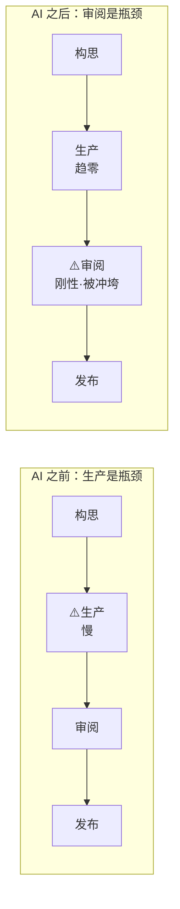

# A01 审阅瓶颈命题·从生产瓶颈到审阅瓶颈

> 本节点要解决的问题：当 AI 把"生产一段内容/一段代码/一份报告"的边际成本压到趋近于零，整个价值链上**真正稀缺的资源**是什么、约束移到了哪里？本节给出一个反共识断言并把它当作整个 0418 专题的地基——**瓶颈从"人类的生产能力"反转成了"人类的审阅带宽"**；任何还在优化"让 AI 生成更多"而非"减少人类需审阅的量"的产品，都在优化错误的变量。这是一个关于约束理论（Theory of Constraints）在 AI 时代如何换位的命题，框架名叫"审阅瓶颈反转"。

---

## §0 为什么是"瓶颈反转"这个框架，而不是"效率提升"框架

业界谈 AI 编程、AI 写作、AI 调研，默认框架是**效率提升**：同样的人，单位时间产出更多，所以更好。这个框架的隐含假设是"生产是瓶颈"——只要把生产环节加速，整条链路就加速。

这个假设在 AI 之前大体成立，在 AI 之后**结构性失效**。约束理论（Goldratt, *The Goal*, 1984）的核心洞察是：一条链路的吞吐量只由**最慢的那个环节**决定，加速非瓶颈环节不仅不增加吞吐，还会在瓶颈前堆积在制品（WIP），反而恶化系统。AI 干的事情正是疯狂加速一个**非瓶颈环节**（生产），而真正的瓶颈（人类的理解、判断、负责）纹丝不动——甚至因为生产洪流的冲击而**变得更慢**。

所以本专题拒绝"效率提升"框架，采用"瓶颈反转"框架。两者给出的产品决策截然相反：
- **效率框架**下，正确动作是"提高生成速度、扩大生成量、降低生成成本"。
- **瓶颈框架**下，正确动作是"压缩需审阅量、提高单位审阅的杠杆、把认知工作前移到瓶颈不会堆积的地方"。

判断一个 AI 产品团队是否看懂了这个时代，最快的探针就是一句话：**你们在优化"生成更多"还是"减少需审阅量"？** 前者是在加速非瓶颈，后者才是在动瓶颈。

---

## §1 命题的两端：生成的不对称崩塌 vs 审阅的刚性

把"瓶颈反转"拆成可验证的两个子断言。

**子断言一：生成端成本趋零，且这是已发生的事实，不是预测。**

代码方面，2025 年的开发者调查显示 AI 生成代码占新增代码的比例已达到约 42%（来源：Faros AI 对 10,000+ 开发者样本的分析，经 LogRocket/Aviator 二手转引）。内容方面，AI 生成文章占全网新发布文章的比例从 2020 年 1 月的约 2.2% 升至 2025 年 5 月的 51.7%，首次超过人类撰写发生在 2024 年 11 月（来源：Visual Capitalist 可视化，引自 Graphite 数据集）。学术方面，UC Berkeley Haas 与 Cornell 团队分析 2018–2024 年超 200 万篇预印本，AI 采用者论文产出提升 50% 以上（来源：De Vaan & Stuart et al., *Science*, 2025）。三个域指向同一结构：**生成的边际成本与边际时间正在塌向零**。

**子断言二：审阅端的成本是刚性的，不随生成提速而提速。**

人类审阅一段内容所需的时间，取决于三件事：内容本身的复杂度（内在认知负荷）、审阅者的背景知识、以及承担判断所需的认知投入。这三者**都不随 AI 产量线性扩展**——AI 一秒写出的东西，人类不会因此一秒就读懂。工作记忆的硬上限是结构性的：Miller (1956) 的 7±2 与 Cowan (2001) 在排除组块化后测得的约 4 个组块，无论取哪个数，都远小于 AI 一次性吐出的数百行代码或数千字报告所含的元素交互数。

两端的不对称是命题的全部张力所在。一个直观但**尚无严格受控实验支撑**的口径是"生成几秒、审阅几分"——这个定性关系成立，但目前查不到经同行评审的标准时间比〔待核实〕。有实证支撑的，是审阅端确实在被冲垮：De Vaan 的原话是 AI 论文洪流"正在制造巨大瓶颈，评审者极难跟上"。

---

## §2 跨域呼应：Simon 的注意力稀缺命题——本专题的经济学地基

> [!note] 跨域调度：Herbert A. Simon（1971）注意力经济
> 把"审阅瓶颈"放进更大的思想史，它不是新现象，而是 Simon 半个世纪前命题的最新一幕。

1971 年，Herbert Simon 在 *Computers, Communications, and the Public Interest*（Greenberger 编，Johns Hopkins Press，pp. 37–52）的文章 "Designing Organizations for an Information-Rich World" 中写下后来被反复引用的判断：

> "在一个信息丰裕的世界里，信息的丰裕意味着另一种东西的匮乏：信息所消耗之物的稀缺。信息消耗什么是相当明显的：它消耗接收者的注意力。因此**信息的丰裕制造了注意力的贫困**。"

Simon 的关键贡献不是"信息会过载"这种直觉，而是把它**结构化成一个经济学问题**：信息的成本主要由接收者（审阅者）承担，而非生产者；当生产成本趋零，全部约束就压到接收端的注意力分配上。这正是本专题的地基——AI 让 Simon 命题从"媒体/广告"语境跳进"生产工具"语境：过去是海量信息争夺消费者的注意力，现在是**你自己的 AI 助手**生产的海量产出，争夺**你作为负责人**的审阅带宽。

Simon 的框架直接改变了一个技术判断：**审阅瓶颈不是"AI 还不够好"的暂时性问题，而是注意力稀缺这一恒定约束在新成本结构下的必然显形**。哪怕 AI 的质量再翻几倍，只要它仍需要人类承担最终责任，注意力就仍是那个莴苣——兔子（信息）繁殖得越快，莴苣越稀缺。这把"等模型变强就好了"的乐观主义钉死在了经济学约束上。

延伸链入：0117社会学 中的注意力作为社会资源、0114认识论 中"理解 vs 接收"的区分。

---

## §3 判断主轴：90% 的 AI 产品团队会在这里搞错的四个点

这是本节点的命门。下面四个错位，每一个都对应一个真实可观测的产品决策失误。

**错位一：把"生成更多"当成产品价值，而瓶颈在审阅端。**
- **症状**：产品路线图的 KPI 是"生成速度""单次生成 token 量""一次能改多少文件"；demo 比拼"看 AI 一口气写了 500 行"。
- **为什么会错**：沿用了 AI 之前的"生产是瓶颈"心智，下意识优化最显眼、最容易涨的指标。约束理论说这是加速非瓶颈——WIP（待审代码/待读报告）在审阅前疯狂堆积。
- **正确做法**：把北极星从"生成量"换成"净通过量"（被人类接受并负责发布的量），并显式优化"单位产出需要的审阅时间"。
- **真实反例**：Faros AI 对 10,000+ 开发者的分析显示，高 AI 采用团队 PR 合并数 +98%，但 PR 审阅时间 +91%、平均 PR 体积 +154%（来源：Faros AI，经 Aviator/LogRocket 转引）。生成端的胜利几乎被审阅端的堆积对冲掉了。更刺眼的是 METR 2025 的 RCT：16 名有经验的开源开发者、246 个任务，用 AI 实际比不用**慢 19%**，而他们自己预测会快 24%（来源：METR, 2025-07；arXiv 2507.09089。注意样本小、任务为成熟开源项目，不可轻易泛化）。

**错位二：把"审阅"误当成低成本的橡皮图章环节，于是不为它做产品设计。**
- **症状**：生成界面精雕细琢，审阅界面是个原始的 diff 或一大段纯文本，"用户自己看一下就行"。
- **为什么会错**：低估了审阅的认知负荷。当变更集超过工作记忆容量，缺陷检出率断崖下降，审阅者被迫走"橡皮图章"或"溺水"两条歧路（来源：CodeAnt 对 diff 审阅认知负荷的分析；Satya Borg, "Human Review is the Bottleneck", 2026）。
- **正确做法**：把"审阅界面即产品"当成一等公民。压缩率、progressive disclosure、diff/summary/artifact 都是在为审阅端做"信息压缩 + 渐进披露"，目标是把外在认知负荷压到任务真正需要的最低限度。
- **真实反例**：Claude Code 的 VS Code 扩展长期缺少 Copilot Edits 那样的逐 hunk 批准 UI，开发者专门提 feature request 要求补齐（来源：GitHub Issue #33932）——审阅界面的设计差距是真实的产品落后项。

**错位三：把"审阅通过"当成 verification（真验证），但实际发生的是 rubber-stamping（盖章）。**
- **症状**：HITL（human-in-the-loop）流程里有"人类确认"这一步，团队就宣称"有人类把关、安全"。
- **为什么会错**：自动化偏见（automation bias）。当输出速度超过人的认知评估能力、或系统长期表现良好，人会系统性降低监控强度（"learned carelessness"），监督沦为剧场。这不是懒惰或性格问题，而是多任务下注意力有限性的结构特征（来源：Parasuraman & Manzey, *Human Factors*, 2010）。
- **正确做法**：从认识论上严肃对待"审阅 AI 报告到底是 verification 还是 rubber-stamping"这个问题——它直接决定 confidence display、citation、HITL 触发点的设计（这是本专题认识论维度的主轴，详见后续节点）。设计上要逼出系统 2，而非默认系统 1 通过。
- **真实反例**：Sele & Chugunova（*PLoS ONE*, 2024）的实验中，加入"人在环路"后接受率提升约 7 个百分点，但预测准确率反而下降（误差从 17.4 升到 18.0 百分位）——人类监督者"未能充当紧急制动器"。"有人把关"不等于"把关有效"。

**错位四：把审阅瓶颈当成"以后再说"的二阶问题，而它是当下就在反噬产品质量的一阶问题。**
- **症状**："先把生成做好，审阅体验迭代到 V2 再优化。"
- **为什么会错**：瓶颈不会等你。生成提速的同时审阅就被冲垮，质量损失即时发生。学术界已观测到：2025 年 ICLR 约 20%、Nature Communications 约 12% 的同行评审意见疑似 AI 生成（来源：arXiv 2025 检测研究；Nature, 2025），即审阅环节本身正在被 AI 反向占领——人类带宽不够，就用 AI 假装审阅，瓶颈被掩盖而非解决。
- **正确做法**：把"减少需审阅量 / 提高审阅杠杆"放进产品的第一性目标，与生成能力同等优先级。
- **真实反例**：医疗领域，Budzyń et al.（*Lancet Gastroenterology & Hepatology*, 2025）发现长期依赖 AI 提示后，医生独立肠镜的腺瘤检出率从 28.4% 降到 22.4%——审阅/独立判断能力的退化（deskilling）是即时且可测的，不是远期风险。

---

## §4 产品 PM 视角补盲：工程之外的三个看走眼点

跳出"工程 PM"视角，审阅瓶颈在用户心理、商业模式、合规三个面向上各有一个易被忽略的坑。

- **用户心理模型**：用户对 AI 产出的信任曲线是不对称的——建立缓慢、崩塌迅速（呼应 [p305 - 信任架构与可解释性设计](/kb/产品设计与交互范式/p305-信任架构与可解释性设计/)）。如果产品默认"全部接受"且偶尔出错，一次崩塌会让用户从过度信任直接跌进过度怀疑，反而把审阅成本推到最高（什么都要重查）。设计目标是**信任校准**，不是信任最大化。
- **商业模式**：很多 AI 产品按"生成量"计费（per token / per generation），这把激励**对齐到了非瓶颈环节**——卖得越多，用户审阅负担越重，留存越差。真正可持续的或许是按"净通过量/已接受成果"计价，让商业利益与"减少需审阅量"同向。
- **合规边界**：EU AI Act 第 14 条要求高风险 AI 让用户"知道存在 automation bias"，但 Laux & Ruschemeier（*European Journal of Risk Regulation*, 2025；arXiv 2502.10036）批评：仅要求"感知义务"不等于从设计层面"减轻"偏见，把"知道有风险"与"实际降低风险"混为一谈。对 PM 的含义：合规打勾 ≠ 审阅有效，监管目前管不到瓶颈的真问题。

---

## §5 对手框架回应：接受 + 边界

**对手立场 A：注意力经济/审阅瓶颈是个被夸大的隐喻——注意力不符合经济商品特征（不可储存、不可转让、不可积累），"瓶颈反转"只是营销话术。**
（代表：部分经济学家与批评者，如 Adrian Lenardic et al., 2022，批评注意力经济逻辑扭曲学术激励；Wikipedia 注意力经济词条本身被标"需更多引用"。）
- **接受**：对。把注意力简单类比成货币确实掩盖了它的特殊性，且本专题部分支撑数据（如"屏幕专注时长 47 秒""信息过载成本 1 万亿美元"）来自行业汇编站点而非同行评审论文〔来源强度弱，引用须降级〕。
- **边界与赌注**：但本专题不依赖"注意力是商品"这个强命题。它只需要一个弱得多、且有硬实证的命题：**人类承担最终责任的审阅带宽是有限且刚性的**（工作记忆上限、automation bias、deskilling 三组实证都独立成立）。即使"注意力经济"这个宏大叙事可被质疑，审阅瓶颈作为工程约束依然成立。我赌的是：约束理论 + 认知负荷的微观机制，比"注意力经济"的宏观隐喻更经得起拷问。

**对手立场 B（Rick 未读的对手框架）：审阅瓶颈是过渡现象，终将被"AI 审阅 AI"消解——用 verifier/judge 模型、多 Agent 互审来替代人类审阅带宽。**
（代表：AI 自动化评估、LLM-as-judge、constitutional AI 的支持者；以及 Jevons 悖论视角——成本下降会扩大需求而非缩减瓶颈。）
- **接受**：对一类**可程序化验证**的任务（单元测试通过、schema 校验、事实可被检索核对），AI 审阅确实能吸收大量审阅量，瓶颈可被推后。
- **边界与赌注**：但凡需要**人类承担责任**的决策（医疗、法律、安全、对外发布），"谁来审阅审阅者"的回归问题无法用更多 AI 关闭——AI 审阅 AI 仍把最终责任留给人，只是把同一份 automation bias 叠了一层。c13 已论证幻觉的架构性不可消除（见 [c13 - 幻觉的不可消除性](/kb/基础知识库/c13-幻觉的不可消除性/)），这意味着 verifier 自身也会幻觉。我赌的是：在责任不可转移的场景，审阅瓶颈是**结构性的、不可被纯技术消解的**，只能被设计**缓解**。

---

## §6 PM 决策启示：面试 / 选型 / 复现三类落地

- **面试**：被问"如何评估一个 AI 编程产品的好坏"时，不要答"看它生成代码的质量和速度"。答："我先问它在优化生成还是优化审阅——前者是加速非瓶颈，后者才动瓶颈；然后看它的净通过量、PR 体积变化、以及审阅界面是不是一等公民。"30 秒区分出"懂约束理论"和"只懂 feature list"。
- **选型**：评估两个 AI 工具时，把"审阅成本"作为独立维度建表，列：单次产出的平均审阅时长、是否支持渐进披露/逐 hunk 接受、是否有 confidence-gated 的自动执行、是否提供可溯源引用。别只比生成能力。
- **复现/自用**：Rick 自己深度使用 Claude Code 是一手研究材料——可直接观察自己在审阅 AI 大段 diff 时，哪些时刻滑进了 rubber-stamping、哪些设计（如分块 diff、commit 拆分、先看 spec 再看实现）真正降低了审阅负荷。把这些一手观察沉淀进 E 节点。

---

## §7 与已有节点的关系（升级对照，不复述）

本节点是 0418 专题的**总命题地基**，对既有 0403 产品设计节点做的是"升高一个抽象层 + 提供统一约束视角"：

- 对 [p302 - 七种 AI 交互设计模式](/kb/产品设计与交互范式/p302-七种-ai-交互设计模式/)：p302 罗列模式，本节点提供"为什么需要这些模式"的**单一约束根因**——所有压缩/披露/确认模式都是对审阅瓶颈的回应。做的是**根因补缺**。
- 对 [p304 - 防御性 UX：对抗延迟与幻觉](/kb/产品设计与交互范式/p304-防御性-ux-对抗延迟与幻觉/)：p304 把幻觉当成需对抗的输出缺陷，本节点把"审阅幻觉的成本"前置为**瓶颈本身**——防御性 UX 是审阅杠杆的子集。做的是**视角升维**。
- 对 [p305 - 信任架构与可解释性设计](/kb/产品设计与交互范式/p305-信任架构与可解释性设计/)：p305 讲信任校准，本节点指出信任校准的**目的**正是降低审阅成本（校准好 → 该信的快速通过、该疑的精准拦截）。做的是**目的对话**。
- 对 [p306 - 数据飞轮与反馈回路设计](/kb/产品设计与交互范式/p306-数据飞轮与反馈回路设计/)：审阅环节产生的接受/拒绝/纠错信号是飞轮的高密度燃料——本节点为 p306 提供"飞轮数据从哪来"的答案。做的是**接口对接**。
- 对 [p307 - Copilot 到 Autopilot 光谱](/kb/产品设计与交互范式/p307-copilot-到-autopilot-光谱/)：p307 的 L0–L4 控制权光谱，本质是"审阅介入程度"光谱——autopilot 即审阅前移到 confidence gate。做的是**重新诠释**。
- 对 [c13 - 幻觉的不可消除性](/kb/基础知识库/c13-幻觉的不可消除性/)：c13 论证幻觉不可消除，本节点据此推出"审阅瓶颈不可消除"的产品级推论。做的是**下游推演**。
- 对工程协作侧 0414（coding 审阅）与 0417（context）专题：0414 在战术层讲怎么审 AI 代码，本节点在战略层讲"审阅为什么是瓶颈"；0417 讲上下文工程如何喂模型，本节点讲上下文的反向问题——人类的"上下文窗口"才是真稀缺。做的是**抽象层互补**，不复述其战术细节。

---

## §8 关联节点

**核心（必读）**
- [p302 - 七种 AI 交互设计模式](/kb/产品设计与交互范式/p302-七种-ai-交互设计模式/)
- [p304 - 防御性 UX：对抗延迟与幻觉](/kb/产品设计与交互范式/p304-防御性-ux-对抗延迟与幻觉/)
- [p305 - 信任架构与可解释性设计](/kb/产品设计与交互范式/p305-信任架构与可解释性设计/)
- [p307 - Copilot 到 Autopilot 光谱](/kb/产品设计与交互范式/p307-copilot-到-autopilot-光谱/)
- [c13 - 幻觉的不可消除性](/kb/基础知识库/c13-幻觉的不可消除性/)
- [幻觉](/kb/基础知识库/幻觉/)
- 0117社会学

**延伸（可选）**
- [p306 - 数据飞轮与反馈回路设计](/kb/产品设计与交互范式/p306-数据飞轮与反馈回路设计/)
- 0114认识论
- [Agent](/kb/基础知识库/agent/)
- [Test-Time Compute](/kb/基础知识库/test-time-compute/)
- [Claude Code](/kb/ai-公司与产品/claude-code/)
- [Claude](/kb/ai-公司与产品/claude/)
- [ChatGPT](/kb/ai-公司与产品/chatgpt/)
- [AI PM 知识图谱·总索引](/kb/ai-pm-知识图谱/ai-pm-知识图谱-总索引/)

---

## 修订日志
- R0（2026-06-07）：首稿。确立"瓶颈反转"框架（约束理论 + Simon 注意力稀缺），四件套判断主轴，接入注意力经济/AI 审阅 AI 两组对手框架，落地三类 PM 决策启示，与 p302/p304/p305/p306/p307、c13、0414、0417 建立升级对照。事实接地待 grounding pass 复核。
