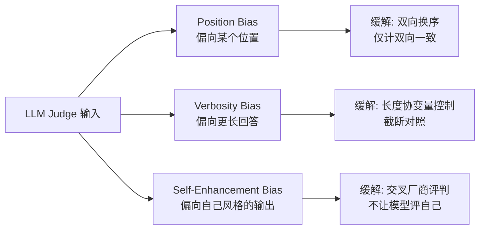

# A04 LLM-as-Judge

当人工标注贵到跑不动、benchmark 又因污染失了判别力（见 [本专题 A03](/kb/专题-评测与度量/a03-benchmark-与数据污染/)），一个诱人的捷径出现了：**用一个强模型（通常是 GPT-4）去给另一批模型的输出打分或排序**。这就是 LLM-as-Judge。本节点要解决的问题不是"它能不能用"——它已经是 RAGAS、MT-Bench、Arena 离线评估、几乎所有公司内部 eval 管线的事实标准——而是一个更难、更要命的问题：**它在什么条件下是一把可信的尺，什么条件下是一面会撒谎的镜子，以及如何分辨这两种情况而不被表面的高一致率骗过去。** 本节用的框架是「把 judge 当**有系统偏差的测量仪器**而非客观标尺」——一旦你接受这个框架，下面所有的陷阱都变成可预测、可缓解的工程问题，而不是玄学。

## §0 为什么是"有偏测量仪器"框架，而不是"廉价人类替身"框架

业界最常见的默认框架是「LLM judge ≈ 一个又快又便宜的人类标注者」。这个框架错在它暗示了一个**可替换性**：既然 GPT-4 和人类专家的一致率有 85%（Zheng et al. 2023, MT-Bench/Chatbot Arena, NeurIPS 2023），而人类专家彼此之间也只有 81%，那 judge 不就"达到人类水平"了吗？

这个推理有一个致命的统计陷阱，下面判断主轴第一条会拆。这里先给框架：**正确的心智模型是"有系统性偏差的测量仪器"**。一台仪器可以读数很准（高 precision）却有固定的零点漂移（systematic bias），你不能因为它和另一台仪器读数接近就信它——因为两台仪器可能有相同的漂移方向。LLM judge 的三大已知偏差（位置/冗长/自我增强）恰恰是**方向性的系统偏差**，不是随机噪声。随机噪声可以靠多次测量平均掉，系统偏差不行——你测一万次，position bias 仍然偏向首位。这个框架的全部价值在于：它让你问对问题——不是"judge 准不准"，而是"judge 在这个任务上的偏差方向是什么、有多大、能不能用实验设计抵消"。

## §1 三种实现范式：从 prompt 到 fine-tune 到 reference-based

| 范式 | 代表 | 机制 | 与人类相关性 | 适用场景 |
|---|---|---|---|---|
| **Prompt 式通用 judge** | MT-Bench / G-Eval | 直接 prompt GPT-4 打分或两两偏好 | G-Eval 摘要任务 Spearman **0.514**（Liu et al. 2023, EMNLP, arXiv:2303.16634），超越此前所有自动指标 | 快速起步、无标注数据 |
| **微调专用 judge** | Prometheus / Prometheus 2 | 在 Feedback/Preference 数据上微调开源模型 | Prometheus-13B 与人类 Pearson **0.897** > GPT-4 的 **0.882**（Kim et al. 2023, arXiv:2310.08491） | 自托管、隐私敏感、需 rubric 定制 |
| **Reference-based / rubric judge** | G-Eval + 参考答案、Prometheus 2 绝对打分 | 给 judge 提供标准答案或细粒度评分量表 | 数学评分失败率从默认 70% 降到参考答案下 **15%**（Zheng et al. 2023） | 有金标准、强正确性约束的任务 |

三条关键判断：

1. **微调 judge 能在特定 rubric 上超过 GPT-4，但泛化是另一回事。** Prometheus-13B 的 0.897 是在 **45 个自定义评分标准**下测的（Kim et al. 2023）；Prometheus 2 的 8x7B 版在绝对打分上甚至超越 Claude-3-Opus（Kim et al. 2024, EMNLP, arXiv:2405.01535）。但 Eugene Yan 的综述（eugeneyan.com, 2024）指出，微调 judge **在公平性任务上有时表现低于随机猜测**——它学会了 rubric，没学会泛化。

2. **reference-based 是最便宜的可靠性杠杆。** 同一个 GPT-4，数学题默认 prompt 评分失败率 70%，加思维链降到 30%，给参考答案降到 15%（Zheng et al. 2023）。这条数据的 PM 含义极强：**别急着换更贵的 judge，先看你给了它什么。**

3. **G-Eval 自己暴露了一个反讽**：Liu et al. 2023 在论文里明确记录，G-Eval 这个 LLM judge **系统性偏好 LLM 生成的文本**——它给机器写的摘要打分比人写的高。这不是 bug，是下面要讲的自我增强偏差的早期化石。

## §2 三大系统偏差：方向、幅度、是否可缓解

**位置偏差（Position Bias）**：交换两个回答的呈现顺序后，GPT-4 改变裁决的比例约 **35%**（一致性仅 65%）；Claude-v1 更脆，一致性只有 **23.8%**，且 70% 概率偏向首位（Zheng et al. 2023）。但有边界：当两个候选能力差距极大时，位置偏差几乎消失（一致性 98.8%）。Shi et al.（IJCNLP-AACL 2025, arXiv:2406.07791，15 个 judge、>150,000 实例）的系统研究补了关键一刀——**有些最新指令微调模型的 position bias 已降到 ≤0.04，但在代码评测里仅靠换序仍能造成 >10% 的准确率波动**。结论：position bias 不是常数，是模型 × 任务的函数。

**冗长偏差（Verbosity Bias）**：MT-Bench 的"重复列表"攻击里，对故意注水的冗长回答，GPT-3.5 和 Claude-v1 的失败率高达 **91.3%**，GPT-4 只有 **8.7%**（Zheng et al. 2023）。Saito et al.（2023, arXiv:2310.10076）进一步证明，judge 在创意写作上系统偏好长答案，且若 RLAIF 训练不纠正（见 RLAIF），会把模型训得越来越啰嗦。注意边界：〔待核实〕有报道称最新模型在**受控长度扩展对**里偏差幅度显著减小、个别设定下甚至反转为偏好更短回答，即偏差方向可能随模型迭代而非恒定——此说尚未在本节点完成接地（未找到可追溯的论文名/arXiv/机构锚点），不能据此照搬或推翻 2023 年的结论；保守的工程立场是：在你自己的任务上用受控长度对实测 verbosity bias 的方向与幅度，不要假设它是常数。

**自我增强偏差（Self-Enhancement Bias）**：GPT-4 给自己输出打分时胜率高出 **10%**，Claude-v1 高出 **25%**，而 GPT-3.5 无可测量的自我偏好（Zheng et al. 2023）。Wataoka et al.（2024, arXiv:2410.21819）给出了机制根源：**自我偏好本质来自困惑度**——LLM 倾向高估与自己生成风格相近（困惑度更低）的文本。这条机制解释为什么用同一家模型既当选手又当裁判是结构性危险，而不只是"不好看"。

## §3 何时可信，何时不可信：一张能力边界表

| 任务类型 | 人机一致率 / 可靠性 | 来源 | 可信度判断 |
|---|---|---|---|
| 通用对话偏好（开放式） | 85%（vs 人类基线 81%） | Zheng et al. 2023 | 较可信，但需双向换序 |
| 专家级知识（法律/医疗） | **64–68%**，低于专家互评基线 72–75% | LLM-as-Judge 简报 | 不可信，judge 答不对就评不准 |
| 个性化/争议性（OpinionQA） | 约 **60%** | LLM-as-Judge 简报 | 不可信，偏好≠正确 |
| 高难度正确性判断（JudgeBench） | **仅略好于随机猜测** | Ye/Tan et al. 2024, arXiv:2410.12784 | 根本性失效 |

JudgeBench（350 个 GPT-4o 生成对 + 270 个 Claude-3.5-Sonnet 生成对，覆盖知识/推理/数学/编程）的核心发现最该被钉在墙上：**GPT-4o 这样的强模型，在需要深度事实和逻辑核验的困难对上，表现仅略好于扔硬币。** 它还揭示了一条强预测规律——**judge 自己能不能答对这道题，是它评判准确性的强预测变量**。这条规律直接推出一个冷酷的边界：**弱模型无法可靠评判比自己强的模型。** 你不能让 GPT-3.5 去裁决两个 o1 的数学证明谁更对。

## §4 判断主轴 · 把 LLM-judge 当客观标尺的三个陷阱

> [!warning] 这是本节点的命门。90% 的团队会在这三处把"测量仪器"当成"真理"，而且错得很隐蔽——因为表面数字看起来很好。

### 陷阱一：用原始一致率（85%）证明 judge "达到人类水平"

- **症状**：PPT 上写"我们的 LLM judge 与人类一致率 85%，接近人类专家间的 81%，所以可以替代人工评估"。
- **为什么会错**：原始一致率（percent agreement）**不扣除随机碰巧一致的部分**。Cohen's Kappa 才是机会校正后的真实一致（见 [Cohen Kappa 系数](/kb/基础知识库/cohen-kappa-系数/)）。同一份 MT-Bench 数据，GPT-4 的 Kappa 只有 **0.84**，而人类互评的 Kappa 是 **0.97**（Eugene Yan 综述, 2024）——这个差距比 85% vs 81% 大得多，方向也相反。Llama-3-8b 原始一致率 80% 看着不错，Kappa 却只有 **0.62**，掉到"实质性一致"以下。原始一致率系统性高估真实一致，类别越不平衡高估越狠（kappa paradox，见 [Cohen Kappa 系数](/kb/基础知识库/cohen-kappa-系数/) 与本专题 IAA 节点）。
- **正确做法**：永远同时报告 Kappa（或 Krippendorff's α），并对照 Landis & Koch 阈值（0.61–0.80 实质性，0.81–1.00 近乎完美）。把"judge 接近人类"这种话从 0.84 vs 0.97 的角度重述：judge 还差一个量级的可靠性档位。
- **真实反例**：上表 Llama-3-8b——80% 原始一致率配 0.62 Kappa，任何只看前一个数字的人都会高估它两档。

### 陷阱二：用同一家模型既当选手又当裁判（self-preference 闭环）

- **症状**：团队用 GPT-4 当 judge，去评 GPT-4 微调版 vs 竞品模型，得出"我们的模型更好"，上线庆功。
- **为什么会错**：GPT-4 给自己风格的输出胜率高 10%，Claude-v1 高 25%（Zheng et al. 2023），机制是困惑度驱动的自我偏好（Wataoka et al. 2024）——judge 不是在评质量，是在**认亲**。更隐蔽的是 G-Eval 那个化石现象：LLM judge 系统偏好 LLM 文本本身（Liu et al. 2023），所以即便选手不是同一家，只要被评对象之一恰好和 judge 同源/同风格，天平就斜了。
- **正确做法**：**交叉厂商评判**——用 Claude 评 GPT 系，用 GPT 评 Claude 系；或多 judge 投票并显式检查每个 judge 对"同源选手"的系统性加分。绝不让一个模型评判自己的输出做上线决策。
- **真实反例**：Justice or Prejudice（Ye et al. 2024, arXiv:2410.02736）的 CALM 框架系统量化了 **12 类偏差**，发现即使最先进模型在特定任务仍有显著偏差，self-enhancement 是其中之一且因模型而异——GPT-3.5 没有，GPT-4 有，照搬"所有模型都有/都没有"都是错的。

### 陷阱三：用 judge 评 judge，陷入循环自证

- **症状**：为了验证"我的 judge 可信"，用另一个更强的 LLM judge 去评判这个 judge 的判断质量；或用 judge 选出的"最优答案"反过来当金标准，再用它训练下一代 judge。
- **为什么会错**：这是评估系统里的**自指闭环**——你用待验证的工具验证它自己。当 judge 和 meta-judge 共享相同的预训练分布、相同的 verbosity/format 偏好时，meta-judge 会**系统性地确认而非纠正**底层 judge 的偏差。多智能体 judge 也救不了：Judging with Many Minds（Chiyu Ma et al. 2025, arXiv:2505.19477, EMNLP 2025 Findings）指出多智能体辩论/聚合系统**可能放大而非减轻**某些偏差——共享的预训练先验让多个 agent 朝同一方向系统性偏移，"多数票"反而把单 judge 的偏差固化为共识。更糟的是当 judge 分数成为优化目标时——这正是下面 Goodhart 段落要展开的。
- **正确做法**：循环必须在某处**接地到模型之外**——人类专家抽检、可执行的客观信号（代码能否跑通、数学答案是否等于参考解、检索片段是否真实存在），构成一个**非 LLM 的锚点**。judge 链条里至少要有一环不是 LLM。
- **真实反例**：SWE-bench 的教训（见 [A03](/kb/专题-评测与度量/a03-benchmark-与数据污染/)）——OpenAI 内审发现 32.67% 的成功 patch 涉及答案泄漏，若再用 LLM judge 去评这些"成功"，judge 只会确认泄漏出来的答案"很好"，整个闭环对真实能力盲视。

## §5 产品 PM 视角补盲：judge 便宜，但便宜在哪里要算清

工程视角容易把 LLM-as-Judge 看成"省钱省时的标注外包"。三个非工程的看走眼点：

1. **成本结构的隐藏项**：judge 的 token 成本看着比人工便宜，但**校准成本**被忽略——你仍需一批人工标注的金标准来验证 judge 在你的任务上的 Kappa，否则你不知道它偏在哪。省掉的是规模化标注，省不掉的是校准锚点。把"用 judge 替代人工"算账时，必须留 200–500 条人工金标准的预算（对照 [m205](/kb/工程化与落地架构/m205-rag-生产环境-索引运维与评估体系/) 的黄金评估集工程）。
2. **合规与举证边界**：在安全/内容审核这类高风险场景，用 LLM judge 做的"机器判定"在监管问责时**可能不被接受为充分证据**——judge 的偏差（尤其慈悲淡化偏差、权威偏差，CALM 12 类之二）会系统性放过或冤枉特定内容。安全 PM 要清楚：judge 是预筛漏斗，不是终审法官。
3. **用户感知 vs judge 偏好的错位**：judge 偏好长、结构化、markdown 漂亮的回答（verbosity + format bias），但真实用户在客服、搜索场景往往要短平快。**用 judge 优化出来的"高分"产品，可能正是用户嫌啰嗦的产品。** 这是把代理指标当目标的直接恶果。

## §6 对手框架回应：接受 + 边界

**对手立场 A（Prometheus 阵营 / 自托管派）**："微调专用 judge 已经能超过 GPT-4（Prometheus-13B Pearson 0.897 > 0.882），所以不必依赖闭源 judge，自托管更可控更便宜。"
**接受**：在**有明确 rubric、任务分布固定**的场景，这是对的，且自托管解决了数据隐私和 self-preference 同源问题。**边界**：Prometheus 的 0.897 是在它自己的 45 条 rubric 上测的；Eugene Yan 记录它在公平性任务上有时低于随机。我的赌注是——**微调 judge 的高相关是"过拟合到 rubric"而非"获得了评判能力"**，一旦任务分布漂移（你的真实流量从不长这样），它的可靠性会比通用 GPT-4 judge 掉得更快。所以自托管 judge 必须配更勤的金标准回归，否则省下的闭源 API 费会变成 silent failure 的债。

**对手立场 B（Arena / 人类偏好派）**："与其纠结 LLM judge 的偏差，不如直接用大规模人类偏好投票（Chatbot Arena 170 万票），这才是质量的金标准。"
**接受**：人类偏好在覆盖广度和生态效度上确实是 LLM judge 给不了的。**边界**：'The Leaderboard Illusion'（Singh et al. 2025, arXiv:2504.20879, NeurIPS 2025 Poster）证明 Arena 自己充满系统性扭曲——私测 27 个变体选最高分、数据访问 68 倍不对等、205/243 模型被悄然废弃破坏 BT 传递性；且人类投票本身有 verbosity/sycophancy/format 偏差，与专家事实核查一致率只有 72–83%。**人类偏好不是无偏金标准，它只是换了一组偏差。** 我赌的是：没有任何单一评判源是金标准，可靠性来自**多源交叉 + 非 LLM 锚点**，而不是把宝押在人类或 LLM 任一侧。

## §7 跨域呼应：Goodhart 定律——judge 分数一旦成为目标就停止测量

> [!note] 跨域弹药：Goodhart 定律（Charles Goodhart, 1975；Marilyn Strathern 1997 的著名转述："When a measure becomes a target, it ceases to be a good measure."）

Goodhart 在这里不是装饰性引用，它精确诊断了 LLM-as-Judge 最深的结构性病。原始陈述是经济学的（古德哈特观察英国货币政策：一旦央行盯住某个货币总量指标，该指标与通胀的稳定关系就崩了）。迁移到 judge：**只要 judge 分数从"观测信号"变成"优化目标"，judge 测量的东西就开始失真。**

具体怎么作用？把三大偏差和 Goodhart 串起来看：

- judge 偏好长答案（verbosity bias）→ 团队用 judge 分数当训练/选型目标 → 模型学会**注水**而非变好 → judge 分数涨、真实质量不涨。Saito et al. 2023 记录的正是这条：RLAIF 若用带 verbosity bias 的 judge，会把模型训得越来越啰嗦。
- 这与本专题 [A03](/kb/专题-评测与度量/a03-benchmark-与数据污染/) 的污染机制**同构**：benchmark 一旦成为优化目标就被针对性 SFT 刷分而失去判别力；judge 一旦成为优化目标就被针对性迎合而失去测量力。**两者是 Goodhart 在评估系统里的两个投影。**

Goodhart 改变了我的判断：它让"用 judge 评 judge 的循环"（陷阱三）从"看着有点怪"升级为"**结构性必然失效**"——因为闭环里 judge 既是测量者又是被优化对象，Goodhart 保证了这种自指会让测量力衰减。**唯一的解药是 Goodhart 自己暗示的：让真正的目标（真实用户价值、可执行的客观信号）和被优化的代理指标（judge 分数）之间始终保持一个无法被 judge 闭环吃掉的缝隙——这就是 §4 陷阱三说的"非 LLM 锚点"。** 这也正是 [c14](/kb/基础知识库/c14-模型评估体系与-goodhart-陷阱/) 自建黄金样本集防御 Goodhart 的认识论根据。

## §8 PM 决策启示

- **面试**：被问"怎么评估你的 AI 产品质量"，别只说"用 LLM-as-Judge"。说："用 judge 做规模化预筛，但同时报告 Kappa 而非原始一致率、做双向换序消位置偏差、交叉厂商评判防自我偏好，并保留人工金标准做非 LLM 锚点。"——这一句话区分了读过论文和没读过的候选人。
- **选型**：评估两个供应商模型时，**先问对方的 eval 是不是同源 judge**。如果供应商用自家模型当 judge 报告优势，那份报告的可信度要按 self-enhancement bias 打折（GPT-4 自评高 10%，Claude-v1 高 25%）。
- **复现**：搭内部 eval 管线时，最小可靠配置 = GPT-4/Claude 通用 judge + 双向换序 + 200 条人工金标准校准 Kappa；高风险任务再加 reference-based rubric（数学失败率能从 70% 压到 15%）。别一上来追 multi-agent judge，先把单 judge 的偏差控制做扎实。

## §9 与已有节点的关系

- **对照 [c14](/kb/基础知识库/c14-模型评估体系与-goodhart-陷阱/)：深化 + 认识论补缺。** c14 已列出 judge 三大偏见（位置/冗长/自我）和 AB 换序、多厂商交叉验证的缓解方案。本节点**不复述**这些，而是补 c14 没碰的三层：(1) 原始一致率 vs Kappa 的统计陷阱（c14 未区分）；(2) 微调/reference-based 范式的可靠性边界（c14 只讲 prompt 式）；(3) "judge 评 judge 循环"作为评估系统自指失效的认识论问题（c14 停在"防御 Goodhart"，没处理评估工具自身的可靠性递归）。
- **对照 [m205](/kb/工程化与落地架构/m205-rag-生产环境-索引运维与评估体系/)：对话。** m205 的 RAGAS 四维（Faithfulness/Answer Relevancy/Context Precision/Context Recall）底层全是 LLM-as-Judge 实现。本节点为 m205 补一句它没明说的前提：**RAGAS 的分数继承了 judge 的全部偏差**，所以 RAGAS 高分要配人工金标准校准才可信。
- **对照 [Cohen Kappa 系数](/kb/基础知识库/cohen-kappa-系数/)：纠偏 + 用法升级。** Kappa 节点是纯统计工具解释。本节点把它落地为 judge 可靠性的**唯一正确度量**——并提供了它被忽略时的真实代价（Llama-3-8b 80% 一致率 vs 0.62 Kappa）。
- **对照 [幻觉](/kb/基础知识库/幻觉/)（幻觉与校准）：对话。** judge 自身的校准失准是其偏差的前提性挑战——一个 calibration 差的 judge，连"我不确定"都判不准，遑论评别人。

## §10 关联节点

**核心（必读）**
- [c14 - 模型评估体系与 Goodhart 陷阱](/kb/基础知识库/c14-模型评估体系与-goodhart-陷阱/) —— 本节点的母节点，judge 三偏见的工程缓解版
- [Cohen Kappa 系数](/kb/基础知识库/cohen-kappa-系数/) —— 判断 judge 可信度的正确度量，陷阱一的解药
- [m205 - RAG 生产环境：索引运维与评估体系](/kb/工程化与落地架构/m205-rag-生产环境-索引运维与评估体系/) —— RAGAS 四维即 judge 的落地，继承其偏差
- [A03 Benchmark 与数据污染](/kb/专题-评测与度量/a03-benchmark-与数据污染/) —— 与 judge 失效同构的 Goodhart 投影

**延伸（可选）**
- [幻觉](/kb/基础知识库/幻觉/) —— judge 自身的校准问题
- [c13 - 幻觉的不可消除性](/kb/基础知识库/c13-幻觉的不可消除性/) —— 谄媚幻觉使"用户满意度/偏好"作为信号失真
- [m207 - Agent 产品化：场景推演与失败模式](/kb/工程化与落地架构/m207-agent-产品化-场景推演与失败模式/) —— Agent 七维评估同样依赖 judge，归因更难
- [RLHF](/kb/基础知识库/rlhf/) —— verbosity bias 经 RLAIF 放大的训练侧机制
- Agent 产品评估的五个具体问题 —— 评估方法论的 PM 工作版
- [AI概念滥用反思](/kb/基础知识库/ai概念滥用反思/) —— 评估失效源于评估工具自身认知偏差的实例

---

## 待建概念卡（死链已降级，入库后补建）

以下概念在本节点有实质引用，但 vault 中尚无对应节点，已将原双链降级为普通文本以避免死链：

- **RLAIF（AI Feedback Reinforcement Learning）**：§2 冗长偏差段引用，与 verbosity bias 通过 judge 进入训练循环的机制相关。建议在 `04AI/0401AI 基础知识库/` 下新建概念卡，与已有 [RLHF](/kb/基础知识库/rlhf/) 并列。

## §11 修订日志

- **R0（2026-06-06）初稿**：建立"有偏测量仪器"框架；三范式对照表（prompt/fine-tune/reference-based，含 G-Eval 0.514、Prometheus 0.897 等接地数据）；三大偏差的方向/幅度/缓解；能力边界表（含 JudgeBench 仅略好于随机）；判断主轴三陷阱四件套（原始一致率 vs Kappa / 自我偏好闭环 / judge 评 judge 循环）；Goodhart 跨域呼应具体展开为"分数成目标即失真"并与 A03 污染同构；对手框架接受+边界两处（Prometheus 自托管派、Arena 人类偏好派）；与 c14/m205/Kappa/幻觉 四处显式升级对照。待核实项：Judging with Many Minds（2025）的具体作者/会议未在证据包确认，已降级为"据称"并标〔待核实〕；A03 节点链接待该节点入库后 resolve。
- **R2（2026-06-07）死链清扫**：(1) `A03 Benchmark 污染与饱和` 订正为 `[A03 Benchmark 与数据污染](/kb/专题-评测与度量/a03-benchmark-与数据污染/)`（文件名核验）；(2) `RLAIF` 降级为普通文本（vault 中无对应节点），并在末尾"待建概念卡"登记。
- 2026-06-11 P3.4 校链：待建概念卡引言里残留的占位双链 `双链`（方法论行文示意、从不是真链接目标）去链化为纯文本"双链"；A03/RLAIF 死链均已在 R2 处理且现以反引号代码态记录、不渲染为链接，保留。
