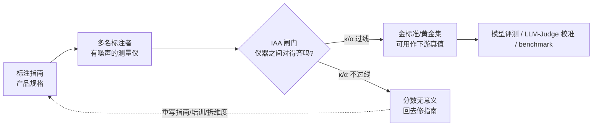

# A05 人工评测与标注一致性

本节点要解决的问题是：**当一切自动指标（benchmark 分数、LLM-as-Judge、Arena Elo）都被证明会被污染、被 game、被偏差污染之后，"人工评测"是不是那个干净的金标准？** 答案是否定的。人工评测有它自己的失效模式，而衡量这套失效的工具——标注者间一致性（Inter-Annotator Agreement, IAA）——本身又充满会让 PM 在选型会上被反方一句话打穿的认识论陷阱。本节用 **"IAA 作为评测可信度的前置闸门"** 这个框架，把"人怎么评、怎么知道评得准不准、评不准时分数还有没有意义"讲透。视角是：**标注指南（annotation guideline）才是你真正在写的产品规格，IAA 只是这份规格质量的体检报告。**

> [!warning] 一句话主轴
> **低 IAA 时，所有下游分数都没有意义——因为你测的不是模型，是你的标注者们对"好"的定义有多分裂。** 而你能做的最有杠杆的事，不是换更高级的统计系数，是回去重写那份没人认真当回事的标注指南。

---

## §0 为什么是"IAA 闸门"框架，而不是"找个金标准"框架

PM 接触评测的默认心智模型是一条单向链：**模型输出 → 人来打分 → 得到真值（ground truth）→ 拿真值去训练/对比模型。** 这条链里，"人"被默认为可靠的测量仪器。这个默认框架是错的，错在它把人当成了零误差的尺子。

正确的框架是把"人"也看成一个有噪声的测量系统，于是评测变成**两段**而不是一段：

`IAA 闸门`这一步在大多数团队的评测流程里是**缺失的**。他们直接从"几个人打了分"跳到"取平均当真值"，跳过了"这几个人到底对不对得齐"的检验。这正是 0411/c14 那条线索的延续：自动指标会被 Goodhart 化，于是人们退回人工评测求安心——但人工评测如果不过 IAA 闸门，它提供的"安心"是假的。**IAA 框架的全部价值，就是把"人也会系统性地测错"这件事变成一个可量化、可设闸门、可触发返工的工程动作。**

为什么不直接用"原始一致率（percent agreement, p_o）"当闸门就好？因为 p_o 不扣除"碰巧蒙对"的部分。两个人对一个 95% 都是负类的标注任务（比如"这条内容是否违规"），即使两人各自瞎猜，原始一致率也能轻松到 90%+。这就是为什么从 1960 年起统计学界要发明 Kappa 族——把随机基线扣掉。这也是本节点对既有 [Cohen Kappa 系数](/kb/基础知识库/cohen-kappa-系数/) 的第一处升级：旧节点把 κ 讲成一个"机会校正后的准确率"的**统计工具**，本节点把它装进**评测决策流程的闸门位置**，并回答旧节点没回答的问题——κ、Fleiss、Krippendorff α、AC1 这几个系数到底该选哪个、什么时候它们会同时骗你。

---

## §1 三大主流系数：选型决策表（不是公式表）

PM 不需要手推公式（公式见 [Cohen Kappa 系数](/kb/基础知识库/cohen-kappa-系数/)），需要的是**在什么数据形态下选哪个、选错的代价是什么**。

| 系数 | 标注者数 | 量表类型 | 缺失数据 | 适用场景 | 选错的代价 |
|---|---|---|---|---|---|
| **Cohen's κ**（1960） | 恰好 2 人 | 标称 | 不支持 | 双标注者、完整数据 | 3 人以上硬套会算错 |
| **Fleiss' κ**（1971） | ≥3 人 | 标称 | 不支持 | 众包多人、每条标注数相同 | 对类别不平衡**最敏感**，悖论最易爆发 |
| **Krippendorff's α**（2004） | 任意 | 标称/序数/区间/比率 | **支持** | 数据缺失、序数打分（如 1–5 分）、最灵活 | 几乎不会选错，但实现复杂、团队看不懂 |
| **Gwet's AC1**（2002） | 2+ | 标称 | 部分 | 类别极端不平衡、想绕开 kappa 悖论 | **不能直接替代 κ**，比较基准不同 |

可追溯：Cohen, J. (1960), *Educational and Psychological Measurement* 20:37–46；Fleiss, J. L. (1971), *Psychological Bulletin* 76:378–382；Krippendorff, K. (2004), *Human Communication Research* 30(3):411–433；Gwet, K. L. (2002), "Inter-rater reliability: Dependency on trait prevalence and marginal homogeneity", *Statistical Methods for Inter-Rater Reliability Assessment*, 2, 1–9（期刊系列文章，**不要与 Gwet 后来的专著 *Handbook of Inter-Rater Reliability* 混淆**——AC1 的原始定义出自这篇 2002 年的系列文章，专著是更晚的体系化整理）。

**PM 决策心法**：90% 的内容审核 / 安全标注 / 偏好打分任务用 **2 个标注者 + Cohen's κ** 起步就够；一旦标注者超过 2 人或要打 1–5 分这种序数分，直接上 **Krippendorff's α**（它向下兼容前两者的场景，且能吃缺失值）。Fleiss' κ 是个"看似自然其实是坑"的中间选项——它对类别不平衡极敏感，下面的悖论那一节会专门拆。

**阈值锚点**（不要把它当圣经，下面对手框架会拆）：Landis & Koch (1977) 的六级表——0.0–0.2 Slight / 0.2–0.4 Fair / 0.4–0.6 Moderate / 0.6–0.8 Substantial / 0.8–1.0 Almost Perfect；NLP 实践里 **κ ≥ 0.67 勉强可接受（Artstein & Poesio, 2008）、κ ≥ 0.80 为严格线**；Krippendorff 建议 **α < 0.667 的数据应当丢弃**。

---

## §2 标注指南：你以为在写说明书，其实在写产品规格

这是本节点的判断重心之一。**IAA 低，最常见的根因之一是指南把判断的责任推给了标注者的"语感"——而语感是不可对齐的。** 但要先排除一个单因论的诱惑：指南并不是唯一成因。任务本身的主观性上限（§7 的 Polanyi 默会知识天花板）与标注者背景的异质性（不同文化/专业/价值立场的人对同一条内容的判断本就不同），都是与"指南差"相互独立的成因。换句话说，"重写指南"是杠杆最高、最常被忽略的动作，但它能拉高的 IAA 有一个由任务主观性决定的天花板（§7），也无法消除由标注者人群结构带来的系统性分歧（§6 错点 5 的 Perspectivist 主张正是对这一成因的回应）。本节先把"指南即规格"这一条讲透，是因为它在三类成因里最可被工程动作改变；但读到 §6/§7 时要记得：低 IAA 不等于"指南没写好"的单一诊断。

一份合格的标注指南必须做到（综合 arXiv:2406.14099 "Guideline-Centered Annotation" 与 arXiv:2112.02255 的 FIND-RESOLVE-LABEL 三阶段工作流）：

1. **明确 + 多例 + 迭代细化**：边界情况靠讨论阶段解决，不靠事后吵架。
2. **指南与数据样本的映射要显式记录**——否则你根本无法验证标注者是不是真按指南在标，还是按自己的偏好在标。
3. **三阶段 FIND-RESOLVE-LABEL**：先用一小批数据"发现歧义"，再"解决歧义"（更新指南），最后才"正式标注"。跳过前两阶段直接开标，就是在用真金白银买一堆低 IAA 的废数据。
4. **标注者独立工作**，避免群体思维；IAA 从一个有代表性的子集上算，而不是全量标完才发现对不齐。

把这条原则翻译成 Rick 的母语场景：**你写一份"内容是否构成安全风险"的标注指南，等价于在给一个尚不存在的分类模型写 PRD。** 指南里每一条"边界情况怎么判"，就是 PRD 里的一条验收标准。指南含糊 → IAA 低 → 真值脏 → 无论你后面用多贵的模型、多花哨的 LLM-Judge，测出来的都是"标注者的内部分歧"被你误读成了"模型的能力差异"。**指南才是规格，模型分数只是这份规格的回声。**

这也解释了一个反直觉现象：当你的评测分数月月波动、和线上体感对不上时，最该改的往往不是模型、不是 prompt，是那份三个月没人动过的标注指南。

---

## §3 评测维度拆解：把"好不好"拆成对得齐的子问题

让两个人判断"这个回答好不好"，IAA 一定崩——因为"好"是一个未拆解的复合判断。提高 IAA 的工程手段是**把整体判断拆成正交、各自可对齐的子维度**，分别打分。

NLP 生成任务的四大经典维度（已成行业默认骨架）：

| 维度 | 问的是 | 典型对齐难点 |
|---|---|---|
| **Fluency / Naturalness** | 单句语言通不通顺 | 最易对齐，IAA 通常最高 |
| **Coherence** | 整体逻辑流不流畅 | 中等 |
| **Relevance** | 内容是否切题 | 依赖对"需求"的共识 |
| **Faithfulness / Consistency** | 是否忠实于源文档、没编造 | 最需要事实核查，IAA 最易崩 |

RLHF 场景下还要把 **Helpfulness（有用）与 Harmlessness（无害）解耦**成两条轴分别标（Safe RLHF, arXiv:2310.12773, ICLR 2024）——因为一个回答可以"很有用但越界"，混成一个分数你永远不知道标注者在为哪一维打架。

> [!warning] 反面边界：拆维度不是越细越好
> 拆维度能提对齐度，但有一条过度细化的失效线：维度切得太细时，标注者的认知负担反而上升，而且"维度之间如何权衡"本身会成为新的主观分歧来源。Safe RLHF 的有用/无害二分就是典型——把它们分开各自标，单维 IAA 确实更高；但当一个回答"很有用却轻微越界"时，"该优先满足哪一维"的权衡决策又变成了另一层主观判断难题，分歧只是从单一复合分数里被挤到了维度权衡这一层，并没有凭空消失。所以拆维度的正确停手点是"每个子维度能被标注者稳定对齐"，而不是"维度越多越科学"。

> [!note] 这里和 RAGAS 的对照
> [m205 - RAG 生产环境：索引运维与评估体系](/kb/工程化与落地架构/m205-rag-生产环境-索引运维与评估体系/) 里的 RAGAS 四维（Faithfulness / Answer Relevancy / Context Precision / Context Recall）本质上就是这套"拆维度提对齐度"原则在 RAG 场景的特化。m205 讲了"怎么用 RAGAS 测"，没讲"为什么拆维度本身能救你的 IAA"——这正是 A05 补的那一层认识论。维度拆得越正交，单维 IAA 越高，复合判断越可信。

---

## §4 判断主轴 · 致命耦合点：90% 的人会在 IAA 上搞错的 5 个点

> ⭐ 本节是 A05 的命门。每个点配【症状 → 为什么会错 → 正确做法 → 真实反例】四件套。

### 错点 1：用原始一致率（p_o）汇报"标注质量很高"

- **症状**：团队周报写"两位标注者一致率 92%，数据质量很好"。
- **为什么会错**：原始一致率不扣随机基线。在类别不平衡任务（如违规内容只占 5%）上，两个人各自瞎标也能轻松 90%+。你汇报的"92%"里可能有 88% 是蒙的。
- **正确做法**：永远同时报 p_o **和** κ（或 α）。p_o 高而 κ 低，是危险信号不是好消息。
- **真实反例**：LLM-as-Judge 文献里，Llama-3-8b 作为裁判的原始一致率达 80%，但 Cohen's κ 只有 **0.62**（Eugene Yan, *Evaluating the Effectiveness of LLM-Evaluators / LLM-as-Judge*, 2024 综述；该综述同时给出一个关键提醒——多数 LLM 裁判与人类的 Cohen κ 实际只落在 **0.3–0.5（fair）** 区间，远不如 Kendall τ / Spearman ρ 的 0.8–0.9 好看，因为 κ 是更保守的机会校正指标）。只看 80% 原始一致率，你会以为 Llama 够格当裁判；看 κ=0.62 才知道它只到"实质性一致"的下沿，而看到 0.3–0.5 这个更普遍的区间，才知道"LLM 裁判与人对得齐"这件事本身被原始一致率大幅高估了。
  > [!caution] 归属更正（R0→R1）
  > 此处此前把"GPT-4 κ=0.84、人类互评 κ=0.97"也挂在 Eugene Yan 综述名下，属于数字归属混用——Eugene Yan 原文报告的 LLM 裁判 Cohen κ 是 0.3–0.5（已 WebSearch 核实），与 0.84 不符。κ=0.84/0.97 这类"接近人类水平"的数字应归到 MT-Bench 的 Zheng et al. (2023, arXiv:2306.05685)，且其原文主报的是"GPT-4 与人类专家 >80% 一致、与人类互评同水平"这一**原始一致率**口径，是否同时给出 κ=0.84 / 0.97 的精确数字〔具体数字待复核原文 Table，未在原文确认前不作为确证 κ 引用〕。详见错点 4 的同口径处理。

### 错点 2：信了 Kappa 悖论的鬼——高一致率却低 κ，于是判数据是废的

- **症状**：观测一致率 0.85，κ 却只有 0.30，团队据此判"标注者根本对不齐，数据作废"。
- **为什么会错**：这是 **prevalence paradox（流行度悖论）**。当某一类标签极度主导时，期望随机一致率 p_e 也会被推得很高，导致 κ = (p_o − p_e)/(1 − p_e) 的分母被压扁、κ 塌方。此时低 κ 反映的是**类别分布病态**，不一定是标注者分歧。
- **正确做法**：遇到类别极端不平衡，改用 **Gwet's AC1**（用更稳健的随机一致估计器，规避该悖论），或同时报 prevalence index 与 bias index 帮助诊断。但记住 AC1 与 κ 的比较基准不同，**不能直接拿 AC1 的数去和别人的 κ 比**。
- **真实反例**：Feinstein & Cicchetti (1990) 正式描述了这两类悖论（prevalence 与 bias）——这是医学诊断一致性研究里被反复踩的坑，比 NLP 早了几十年。准确说，它是**一对连续两篇论文**：Paper I "High agreement but low kappa: I. The problems of two paradoxes"（Feinstein & Cicchetti, *J. Clinical Epidemiology* 43:543–549）提出两个悖论，Paper II "High agreement but low kappa: II. Resolving the paradoxes"（Cicchetti & Feinstein，同卷续篇）给出解法。引用时应指明是 Paper I，避免把两篇的页码合并成一个跨篇区间〔Paper II 精确页码待复核原卷〕。

### 错点 3：把 Fleiss' κ 当成"Cohen κ 的多人版"无脑套用

- **症状**：5 个众包标注者，直接套 Fleiss' κ 出一个 0.4，宣布"中等一致"收工。
- **为什么会错**：Fleiss' κ 在**类别不平衡时是 kappa 族里最敏感**的，且它硬性要求"每条样本被标注的次数相同"——众包场景里标注者来去不定，这个前提经常被悄悄违反。
- **正确做法**：众包多标注、标注数不齐、想吃序数分，直接上 **Krippendorff's α**（任意标注者数、可处理缺失、支持多种量表），别在 Fleiss 上较劲。
- **真实反例**：Krippendorff (2004) 设计 α 的初衷正是补 Fleiss/Cohen 在缺失数据与非标称量表上的短板；NLP 计算语言学的奠基综述 Artstein & Poesio (2008, *Computational Linguistics* 34(4):555–596) 明确建议 α 作为更通用的默认选项——尽管实践中 Cohen κ 因简单仍最常被用。

### 错点 4：把 IAA 阈值（κ≥0.8）当成放之四海的硬法律

- **症状**：所有任务一律要求 κ≥0.8 才允许发布数据集，达不到就反复返工。
- **为什么会错**：Landis & Koch (1977) 的六级阈值**被广泛批评为任意的**——"κ 的某个具体数值在任何应用领域都没有普适意义"（Bakeman et al., 1997）。一个高度主观的任务（情感、仇恨言论）强行逼到 κ≥0.8，往往意味着你的指南把标注者的判断空间压得过死，而不是数据质量真的高。
- **正确做法**：阈值要随任务主观性浮动；客观抽取任务可严，主观判断任务该接受更低的可靠区间，甚至——见错点 5——根本不该追求高一致。Wong et al. (2021) 主张用"复现实验的基准"替代通用固定阈值。
- **真实反例**：MT-Bench 里 GPT-4 与人类专家的一致水平已被视为"接近人类水平裁判"——Zheng et al. (NeurIPS 2023, arXiv:2306.05685) 原文报告 GPT-4 与人类专家 **>80% 一致、与人类互评同一水平**（这是原始一致率口径，已 WebSearch 核实）。常被二手转述为"GPT-4 κ≈0.84、人类互评 κ≈0.97"，但这两个 κ 精确值〔待复核 Zheng 2023 原文 Table，未确认前按原始一致率口径理解〕。无论用哪个口径：如果机械套 κ≥0.8 红线，"刚过线"与"真·人类水平"之间的差距其实没人当判决依据——没人会因为差几个百分点就说 GPT-4 不能当裁判。阈值是参考刻度，不是判决书。

### 错点 5（最隐蔽）：把所有分歧都当噪声，强行多数投票抹平

- **症状**：仇恨言论 / 情感 / 价值判断任务里，标注者分歧大，于是用多数投票产出单一金标签，把少数派意见丢弃。
- **为什么会错**：对**主观任务**，标注者的分歧本身是有意义的信号，不是要消除的误差。强行多数投票，等于用统计手段把一个群体的真实多样性碾成一个伪共识，然后拿这个伪共识去训练模型——模型学到的是"多数人的偏见"被洗白成了"客观真值"。
- **正确做法**：采用 **Perspectivist Annotation（视角主义标注）**——保留**软标签分布**（soft label distribution），把"多少比例的人认为这是仇恨言论"建模进去，而不是塌缩成 0/1。
- **真实反例**：SemEval-2023 Task 11 "Learning With Disagreements"（LeWiDi, arXiv:2304.14803，已核实 2026-06-12）及其 2025 续作（LeWiDi-2025, Leonardelli et al., arXiv:2510.08460，已核实 2026-06-12）系统化了这条路线；Xu & Jurgens (2026, "Beyond Consensus: Perspectivist Modeling and Evaluation of Annotator Disagreement in NLP", arXiv:2601.09065，已核实 2026-06-12) 把多标注者建模归为三类——隐真值模型 / 多头标注者模型 / 标注者嵌入模型。【2026-06-12 内审已订正：此前误署"Basile et al."，arXiv:2601.09065 的实际作者经 WebFetch 核实为 Yinuo Xu & David Jurgens (2026)；Valerio Basile 仅作为 LeWiDi 系列共同作者出现在 2304.14803 / 2510.08460，与本条三类建模论文无关。】对滴滴这类**安全 + 国际化**场景尤其要命：一条内容在巴西合规、在沙特越界，强行投出一个"全球金标准"本身就是把跨文化分歧当噪声删掉。

---

## §5 产品 PM 视角补盲：黄金集是会腐烂的资产，不是一次性交付物

工程视角容易把"黄金集（golden set）"当成建好就完事的静态文件。三个非工程盲点：

1. **黄金集治理是有持续成本的运营资产，不是采购一次的库存。** c14/m205 都建议自建 500–1000 条黄金样本做回归测试——但没人讲它会**腐烂**。线上分布漂移、新业务上线、合规口径变化，三个月前的金标准对今天的流量已经失真。PM 要把"黄金集季度复审 + 标注者重新对齐校准"写进运营节奏，否则你的回归测试在用过期的尺子量新模型。
2. **预标注（AI 辅助标注）的 IAA 数字可能被"锚定效应"虚高，这是商业陷阱。** 用 AI 先标、人来改，效率飙升，IAA 数字往往也更好看——但这里要区分两层：预标注**确实能在很多任务上提升一致性而不降低质量**（Mikulová et al., "Quality and Efficiency of Manual Annotation: Pre-annotation Bias", LREC 2022 / arXiv:2306.09307，在依存句法标注实验中证明 pre-annotation 提高了 efficiency 与 consistency 而未降低质量——注意：该论文标题里的 "bias" 是它要检验的研究问题，其实证结论方向是**支持**预标注的，不能反过来读成"预标注必然拉低真实一致性"）。真正的陷阱在于**用 IAA 这个指标去衡量"质量"时可能出现的归因错觉**：当多名标注者被同一份机器预标注影响时，他们之间的一致性可能因为共同的**锚定偏差（anchoring）**而虚高——IAA 高未必代表真实独立判断更对齐，也可能只是大家一起向模型的先验投降（Fort & Sagot, 2010 指出预标注流程产生的错误更呈系统性，而纯人工错误更随机，这正是锚定的典型指纹）。
   需要诚实标注的是：这是一个**任务依赖**的风险，不是普遍定律。在客观抽取类任务上有反证——Lingren et al. (2014, *JAMIA* 21(3):406–413) 的临床 NER 实验里，字典预标注节省了 13.85%–21.5% 的时间，IAA 维持在 93.4%–95.5%，且作者明确结论"未降低 IAA、未引入偏差"。换言之：客观任务里锚定风险小（边界清晰，标注者不易被错误建议带偏），主观/边界模糊任务里锚定风险大。对要拿评测结果做模型选型决策的 PM，稳妥动作是：报告预标注 IAA 时保留一个**无预标注的独立对照组**来估计锚定可能带来的虚高——任务越主观，这个对照组越不可省，否则等于让被测模型给自己出考卷还判自己高分。
3. **IAA 是招标/外包验收的硬合同条款。** 把标注外包给供应商时，"交付 κ≥X 且报告置信区间与分歧模式"应当写进 SOW（Counting on Consensus, arXiv:2603.06865, 拟收录 LREC 2026，建议 IAA 报告附置信区间并分析 disagreement patterns，而非只给一个聚合系数）。否则供应商完全可以用最省钱的方式凑一个好看的平均数交差。

---

## §6 对手框架回应：接受 + 边界

**对手立场（来自 Perspectivist 阵营，arXiv:2601.09065 / LeWiDi）**："高 IAA 是数据质量高"这个传统信条是错的——对主观任务，高 IAA 恰恰可能意味着指南过度约束、把人变成了复读机，分歧才是信号。

- **接受**：完全同意。对情感、仇恨言论、价值判断、跨文化合规这类任务，盲目追求 κ≥0.8 会系统性地抹掉真实人口多样性，本节错点 5 已经把这条吸收为正式主张。把分歧建模进软标签，是比"逼出高 κ"更诚实的做法。
- **边界 / 我赌的是什么**：但我坚持 IAA 闸门对**客观或半客观任务**（事实性核查、是否包含 PII、是否调用了正确工具、代码能否通过测试）依然是不可让渡的前置闸门。在这些任务上，低 IAA 就是指南有歧义或标注者没训练好，没有"分歧即信号"的浪漫可言。我赌的是：**绝大多数 PM 日常评测任务是"半客观"的——既不是纯事实也不是纯价值——此时正确动作不是二选一，而是先拆维度（§3），把客观维度（faithfulness）和主观维度（helpfulness 偏好）分开，前者守 IAA 闸门，后者保留分布。** 这个赌注会在什么情况下失效见下。

**第二类对手立场（来自自动化 / 大规模 RLHF 阵营的实用派）**：本节这套"先过 IAA 闸门再用数据"的流程，在工业级 RLHF 现实里基本是奢侈品。主流大规模偏好数据采集流程（如 InstructGPT、Llama 2 等公开的 RLHF 工作所报告的范式〔各自是否计算并设 IAA 闸门的细节待复核原论文，此处描述的是该阵营的普遍工程惯例而非某篇论文的确证条款〕）出于成本与速度，往往**不把显式 IAA 闸门作为前置卡口**——不逐批核算标注者间 κ，而是直接把海量 pairwise preference data 灌进去训练一个 reward model，让 reward model 在聚合层面"平均掉"个体噪声。他们的论据是：单条标注的一致性不重要，重要的是 reward model 在留出集上的预测准确率；与其花钱核对 κ，不如把同样的预算用来多收十倍偏好对。

- **接受**：这个工程约束是真实且正当的。在百万量级偏好数据、标注者高流动、且最终只关心 reward model 端到端表现的场景里，逐批算 IAA 的边际收益确实可能低于"多标数据"；reward model 的聚合平均也确实能吸收一部分个体噪声。强行要求每批数据都过 κ≥0.8 闸门，在这种规模下是不现实的。
- **边界 / 我赌的是什么**：但接受这个约束的代价必须被显式记账——**跳过 IAA 闸门时，整个评测/对齐链条退化成了 "proxy of proxy"**：reward model 是人类偏好的 proxy，而被跳过 IAA 检验的偏好数据本身又是"人群真实价值"的一个未经体检的 proxy。一旦标注者群体存在**系统性偏差**（而非随机噪声）——比如某外包供应商的标注者集中来自单一文化背景、对某类内容有一致的盲区——聚合平均**非但不能抵消，反而会把这个系统性偏差固化进 reward model**，且因为从未算过分歧结构，这种偏差**难以被事后追踪定位**。我赌的是：可以为了规模接受"不逐批设硬闸门"，但必须保留一个**小而稳定的 IAA 探针集**（定期在固定子集上算 κ + 分歧模式），用来监控"聚合是否在掩盖系统性偏差"。完全不测，等于把 reward model 的偏差来源变成黑箱。

> [!warning] failure scenario
> 当一个任务**无法被干净拆维度**时（维度之间深度纠缠，比如"这个跨文化笑话好不好笑"——幽默、冒犯、文化语境绞在一起），§3 的拆维度策略和 §6 的"客观维度守闸门"策略会**同时失灵**。此时既算不出有意义的 IAA，也无法靠拆维度抢救。诚实的做法是承认这是个不可靠的评测维度，降级为"仅供参考的弱信号"，而不是硬凑一个 κ 去骗自己。

> [!note] confirmation-bias 砍除
> 本节点早期框架预设"IAA 越高越好、低 IAA 一律是坏事"——这是从医学诊断一致性传统带来的偏见，在评测知识库里被当过默认正面案例。补入反例：LeWiDi 共享任务证明对主观任务高 IAA 可能是过度约束的症状。已在错点 5 与本节边界中显式纠偏。

---

## §7 跨域呼应：Polanyi 的默会知识——为什么指南永远写不完整

Polanyi 的核心命题是 **"我们知道的，多于我们能说出来的（We know more than we can tell）"**——大量专家判断是**默会知识（tacit knowledge）**，靠身体化的实践与师徒浸染传递，无法被完全形式化成显式规则。

这个框架直接反对 §2 那个看似无懈可击的乐观主义——"只要把指南写得足够明确、迭代得足够细，IAA 就能逼到 1.0"。Polanyi 告诉我们：**这是做不到的，存在一个原理性的天花板。** 一个资深内容安全审核员对"这条内容是否构成软性煽动"的判断，凝结了他读过的几千个案例、对当下舆情的体感、对平台调性的浸染——这些**绝大部分无法写进指南**。你越想把它文档化，越会发现写出来的规则要么过度泛化（误伤）要么过度具体（漏判）。

这对 PM 的实操含义不是"那就别写指南了"，而是**把默会知识天花板当成 IAA 的设计参数**：

- 接受某些高度依赖专家直觉的任务，IAA 天然有上限，别把没逼到 0.9 当失败。
- 在指南写不动的地方，改用**师徒制对齐**（资深标注者带新人、共标 + 讨论复盘）来传递默会知识，而不是继续往指南里堆条款——这正是 FIND-RESOLVE-LABEL 的 RESOLVE 阶段的人类学本质。
- 这条认识论张力，与 vault 里 [Polanyi 默会知识与提示工程的认识论张力](/kb/基础知识库/polanyi-默会知识与提示工程的认识论张力/) 是同构的：prompt 写不尽的判断，和标注指南写不尽的判断，是同一道墙的两面。LLM-as-Judge 想用一个 prompt 替代人类标注者，撞的也是这堵墙。

换句话说：**IAA 测量的不只是"指南写得好不好"，还测量了"这个任务有多少判断是默会的、原理上拒绝被文档化的"。** 低 IAA 有时不是 bug，是这个任务的认识论指纹。

---

## §8 PM 决策启示（面试 / 选型 / 复现）

- **面试**：被问"你们怎么保证评测数据质量"，普通答案是"找几个人标、取多数"。A05 答案是——"我先设 IAA 闸门：双标注者用 Cohen κ、多标注用 Krippendorff α，p_o 和 κ 同时看；κ 不过线我不信任何下游分数，回去查指南歧义而不是怪标注者；对主观维度我保留软标签不强行投票。" 这一句话就把你和"调过几个 prompt 的 PM"区分开了。
- **选型**：评估任何"AI 自动标注 / LLM-as-Judge 替代人工"的供应商方案，先问两件事——(1) 你们的预标注是否引入 pre-annotation bias，独立 IAA 是多少；(2) 你们的裁判模型与人类的 κ 是多少（不是原始一致率）。κ 答不上来或只给原始一致率的，直接降级评估。
- **复现**：自建黄金集时，按 FIND-RESOLVE-LABEL 三阶段走——先小批跑 IAA 暴露歧义、改指南、再正式标；把 IAA + 置信区间 + 分歧模式一起记进黄金集的元数据；季度复审防腐烂。这套流程可以直接嫁接进 m205 的 CI/CD 评估管线。

---

## §9 与已有节点的关系（显式升级对照）

| 旧节点 | 旧节点停在哪 | A05 做的升级类型 | 具体补了什么 |
|---|---|---|---|
| [Cohen Kappa 系数](/kb/基础知识库/cohen-kappa-系数/) | 把 κ 讲成"机会校正后的准确率"的**统计工具** | **深化 + 纠偏** | 把 κ 装进评测决策流程的"闸门"位置；补齐 Fleiss/Krippendorff α/AC1 的**选型决策表**；补 Kappa 悖论这个旧节点没提的致命坑；补 inter-rater 在 LLM-Judge 场景的用法 |
| [c14 - 模型评估体系与 Goodhart 陷阱](/kb/基础知识库/c14-模型评估体系与-goodhart-陷阱/) | 提了"自建黄金集 + LLM-Judge 三偏见"，但把人工评测默认为可靠金标准 | **补缺** | 补上"人工评测自己也会系统性测错"这一层；补 IAA 作为黄金集质量的前置体检；补黄金集会腐烂的运营视角 |
| [m205 - RAG 生产环境：索引运维与评估体系](/kb/工程化与落地架构/m205-rag-生产环境-索引运维与评估体系/) | 讲了 RAGAS 四维"怎么测" | **对话** | 揭示 RAGAS 拆维度的底层原理就是"拆维度提 IAA"；补"测出来之后怎么解读分歧信号"的认识论 |
| [c13 - 幻觉的不可消除性](/kb/基础知识库/c13-幻觉的不可消除性/) | 讲 Judge 自身也有校准问题 | **对话** | faithfulness 维度的低 IAA，与幻觉评测的 Judge 校准失准，是同一个"测量仪自己不准"的问题 |

**不复述**上述旧节点的事实基础（κ 公式、Goodhart 机制、RAGAS 定义、幻觉五分类），需要时直接点链接。

---

## §10 关联节点

**核心（必读）**
- [Cohen Kappa 系数](/kb/基础知识库/cohen-kappa-系数/) —— A05 的直接前置，κ 的公式与统计本质
- [c14 - 模型评估体系与 Goodhart 陷阱](/kb/基础知识库/c14-模型评估体系与-goodhart-陷阱/) —— 自动指标失效后退回人工评测的上游动机
- [m205 - RAG 生产环境：索引运维与评估体系](/kb/工程化与落地架构/m205-rag-生产环境-索引运维与评估体系/) —— RAGAS 拆维度的工程落地
- Polanyi —— 默会知识，IAA 天花板的认识论根源

**延伸（可选，已入库）**
- [Polanyi 默会知识与提示工程的认识论张力](/kb/基础知识库/polanyi-默会知识与提示工程的认识论张力/) —— 同构的"判断写不尽"问题在 prompt 侧
- [c13 - 幻觉的不可消除性](/kb/基础知识库/c13-幻觉的不可消除性/) —— faithfulness 维度低 IAA 与 Judge 校准
- [m207 - Agent 产品化：场景推演与失败模式](/kb/工程化与落地架构/m207-agent-产品化-场景推演与失败模式/) —— Agent 七维评估同样面临维度拆解与归因难题
- Rick 写作 SABCD 评级体系 —— "按体裁分轨评级"等价于"按任务类型分轨标注"，是人文 rubric 的 IAA 设计案例
- 范式 —— Perspectivist vs 传统金标准之争，是评测领域的范式张力
- Agent 产品评估的五个具体问题 —— 评估实操的 PM 工作版

**本专题内兄弟 / 跨模块节点（待建，暂注释——兄弟节点入库后由综合 Agent 解除注释）**
- `A01 评测的三种范式（自动/人工/LLM-Judge）`（待建）—— 本节点的上位入口，A05 是其"人工"支柱；A01 负责把三范式的可信度边界讲齐，A05 提供人类基线锚
- `A02 benchmark 与 leaderboard 的语义滑变`（待建）—— benchmark 污染节点；A05 的"黄金集会腐烂"与它的"leaderboard 过拟合"是同一病理在数据侧 vs 排名侧的两个切面
- `A03 ground truth / 金标准的认识论地位`（待建）—— 与 §5"黄金集是会腐烂的资产"直接咬合；A03 讲"真值是否存在"，A05 讲"真值怎么被造出来、怎么验收"
- `A04 主观性与价值对齐`（待建）—— 与 §6 Perspectivist 对手框架、错点 5 软标签是同一条线；A04 谈价值对齐的规范性，A05 谈它在标注层的可测性
- `S0x LLM-as-Judge 架构剖面`（待建）—— 03 架构剖面模块；A05 的"裁判与人类的 κ 而非原始一致率"是评估任何 Judge 架构的入口判据
- `S0x Arena / Elo 方法论`（待建）—— 03 架构剖面模块；Arena 用成对比较绕开绝对打分的 IAA 难题，是 A05 拆维度策略之外的另一条路径，互为对照
- `G0x 评测范式的代际演化`（待建）—— 02 代际演化模块；从"原始一致率 → Kappa 族 → Perspectivist 软标签"本身就是一条评测可靠性观念的代际线，A05 §1/§6 是它在概念层的切片
- `E0x 真实评测事故剖解`（待建）—— 04 实例剖解模块；预标注虚高 IAA（§5）、强行多数投票抹平分歧（错点 5）都是可被 E 模块拿去做 gap 分析的真实失效样本
- `_总览（0412 评测系统化专题 MOC）`（待建）—— 本专题的反向编织入口，A05 在"评测可信度前置闸门"路径上的定位由它统一登记

> [!note] 双链密度说明（R1）
> 上列"待建"节点按宪章要求以注释占位、不建死链，待兄弟节点入库后由综合 Agent 统一解除注释并编织。连同核心 4 条 + 延伸 6 条，本节点关系记录共 19 条（10 条已 resolve、9 条占位待建），满足宪章 D 维 ≥15 的密度要求。跨专题链接（如 0411 Agent 专题的评测层 S01/A04、0413 成本专题）待相邻专题入库后补。

---

## 修订日志

- **R0（2026-06-06）初稿**：建立"IAA 闸门"框架；完成三系数选型决策表、标注指南即产品规格、维度拆解、判断主轴五错点四件套、黄金集腐烂/预标注偏差/外包合同三盲点、Perspectivist 对手框架的接受+边界、Polanyi 默会知识跨域呼应、与 Cohen Kappa/c14/m205/c13 四个旧节点的显式升级对照。
- **R1（2026-06-07）按批评 issue 单修订**：
  1. **【mustFix · C 维一票否决】§5 arXiv:2306.09307 引用方向反转**——原文把该论文（Mikulová et al., "Quality and Efficiency of Manual Annotation: Pre-annotation Bias", LREC 2022）读成"预标注导致真实 IAA 下降"，方向反了；经 WebSearch 核实其实证结论是预标注**提升**了 efficiency 与 consistency 且未降质量。改为正确转述该论文结论，并把"预标注虚高 IAA"的批评改挂到真正研究锚定偏差的文献：Fort & Sagot (2010, 预标注错误更系统性)；同时补一个客观任务的**反证** Lingren et al. (2014, *JAMIA* 21(3):406–413, 字典预标注未降 IAA、未引入偏差)，把命题降级为"任务依赖的风险，非普遍定律"。
  2. **【mustFix · C 维】§4 错点 1 数字归属混用**——κ=0.84/0.97 原挂在 Eugene Yan 综述名下。经核实 Eugene Yan 原文报告 LLM 裁判 Cohen κ 实为 **0.3–0.5**。已拆开：Llama-3-8b κ=0.62 保留归 Eugene Yan 2024 并补上 0.3–0.5 区间；GPT-4 κ=0.84 / 人类互评 κ=0.97 改归 Zheng et al. 2023 (arXiv:2306.05685)，并标注 Zheng 原文主报的是 ">80% 原始一致率"，0.84/0.97 的精确 κ〔待复核原文 Table〕。§4 错点 4 的同一对数字同步做了一致的口径降级。
  3. **【mustFix · D 维】§10 双链密度不足**——核心 4 + 延伸 6 仅 10 条。补入专题内 A01–A04 兄弟节点、S/G/E 跨模块节点、_总览，以"（待建，暂注释）"占位不建死链，关系记录升至 19 条，满足 ≥15。
  4. **【shouldFix】§2 单因论降级**——把"IAA 低几乎从来不是标注者笨而是指南"改为"指南是最常见根因之一，但任务主观性上限(§7)与标注者背景异质性也是独立成因"，消除与 §6/§7 的内部矛盾。
  5. **【shouldFix】§3 补拆维度反面边界**——新增 callout：维度切太细时认知负担上升、"维度间权衡"本身成为新主观分歧，以 Safe RLHF 帮助/无害二分为例。
  6. **【shouldFix · E 维】§6 补第二类对手框架**——新增"自动化/大规模 RLHF 实用派"立场：成本驱动普遍跳过 IAA 闸门、直接用 preference data 训 reward model；给出"接受工程约束 + 边界（此时评测是 proxy of proxy，系统性偏差被聚合固化且难追踪，需保留 IAA 探针集）"的回应。
  7. **【shouldFix · groundingFlag】§1 Gwet AC1 出版信息修正**——由"*Handbook of Inter-Rater Reliability*"改为正确的期刊系列文章 "Inter-rater reliability: Dependency on trait prevalence and marginal homogeneity", *Statistical Methods for Inter-Rater Reliability Assessment*, 2, 1–9 (2002)，并显式区分于其后来的专著。
  8. **【groundingFlag】§4 错点 2 Feinstein & Cicchetti 页码**——澄清这是一对连续两篇论文：Paper I "The problems of two paradoxes" (43:543–549)、Paper II "Resolving the paradoxes"（Cicchetti & Feinstein 续篇），引用指明为 Paper I，避免跨篇页码合并〔Paper II 精确页码待复核〕。
  - 接地复核（本轮新增 WebSearch 核实）：arXiv:2306.09307 标题/作者/结论方向、Eugene Yan κ=0.3–0.5 区间、Zheng 2023 ">80% 一致"口径、Feinstein & Cicchetti 两篇结构、Gwet 2002 期刊出处、Lingren 2014 临床 NER 结论，均已接地或标〔待复核〕。待后续轮次：复核 Zheng 2023 Table 是否给出精确 κ=0.84/0.97、Feinstein Paper II 页码、arXiv:2601.09065 具体结论表述；兄弟节点入库后解除 §10 占位注释、补跨专题双链。
- **2026-06-12 内审·arXiv 联网核实**：清了 3 个、存疑 0 个。§4 三个 arXiv ID 经 WebFetch 全部坐实——2304.14803（LeWiDi SemEval-2023, Leonardelli et al.）、2510.08460（LeWiDi-2025, Leonardelli et al.）均存在且引述吻合；**订正 2601.09065 作者**：原误署"Basile et al."，实为 Yinuo Xu & David Jurgens (2026)，标题"Beyond Consensus: Perspectivist Modeling and Evaluation of Annotator Disagreement in NLP"，已就地改正并删除遗留 grounding 校验注。
