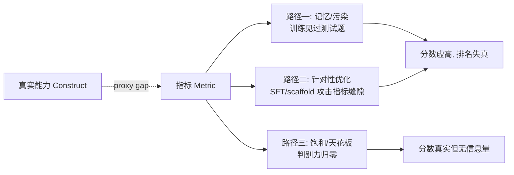

# A06 Goodhart 与指标失效

本节点要解决的问题不是"什么是 Goodhart 定律"——那只要一句话——而是：**一个 AI PM 该如何在"任何 eval 被纳入优化目标的瞬间就开始失效"这个铁律下，仍然做出可被追责的选型与迭代决策？** 视角不是"找一个不会失效的指标"（这是不存在的），而是把指标当作**有半衰期的消耗品**来管理。本节是整个 0412 评测专题的判断主轴所在：它给出的不是某个 benchmark 的好坏裁决，而是一套**对冲手册**——承认所有 eval 都会腐烂，然后设计一个"腐烂得足够慢、且你能监测腐烂速度"的评测组合。

## §0 为什么是 Goodhart 框架，而不是"找个更好的 benchmark"

读者脑中的默认错误框架是**军备竞赛框架**：MMLU 饱和了就换 MMLU-Pro，GPQA 被刷穿了就上 BBEH——把指标失效当成"题目不够难"的工程问题，靠不断升级难度来解决。

这个框架错在根上。Goodhart 框架（与其社会科学孪生兄弟 Campbell 定律）说的是一个**结构性**而非难度性的命题：失效的根源不是题目简单，而是"指标一旦成为被优化的目标，优化过程就会专门攻击指标与真实目标之间的那条缝隙（proxy gap）"。难度提升只是把缝隙临时拉窄，优化压力会重新找到它。

这一点有硬证据。`The Emperor's New Clothes in Benchmarking?`（Sun et al.；Yifan Sun 为第一作者，Han Wang、Gang Wang 等，UIUC/ASTRAL Group，arXiv 2503.16402）系统测试了 10 个 LLM、5 个 benchmark、20 种污染缓解策略，结论冷酷：**没有任何一种缓解策略能同时兼顾"保真度"（新题与原题等难度）与"抗污染性"，且没有任何策略显著优于"什么都不做"**。换句话说，"换更难的题"在统计上并不构成对 Goodhart 的解药。所以本节不组织成"benchmark 排行榜导购"，而组织成"指标生命周期管理"——因为前者是被 Goodhart 反复证伪过的框架。

> [!note] 框架级辨析的赌注
> 我赌的是：**评测的核心难题是治理问题（governance），不是测量问题（measurement）。** 如果未来出现一种"原理上免疫优化压力"的评测机制（例如完全私有、每次一次性、即时销毁的动态生成测试），那么测量框架会重新占上风，本节的"生命周期管理"立场需要降级。这个赌注我显式承担。

## §1 两条定律：Goodhart、Campbell 与它们的精确表述

把两条定律的原始表述摆清楚，因为业界引用时经常张冠李戴、且把通俗版当原版。

| 定律 | 原始提出 | 通俗强表述（Strathern 1997 改写） | 精确弱表述（原作） |
|---|---|---|---|
| **Goodhart 定律** | Charles Goodhart, 1975（英国货币政策语境） | "当一个度量成为目标，它就不再是好的度量" | "任何被观测到的统计规律，一旦为了控制目的对其施压，就会倾向于崩溃" |
| **Campbell 定律** | Donald T. Campbell, 1979（社会科学/教育评估语境） | 同上的社会科学版 | "任何量化社会指标越是被用于社会决策，它就越容易受到腐蚀压力，也越容易扭曲和腐蚀它本应监测的社会过程" |

关键区分：今天满天飞的那句"When a measure becomes a target..."其实是人类学家 **Marilyn Strathern（1997）** 对 Goodhart 的转述，不是 Goodhart 原话。Goodhart 原文针对的是货币供应量统计；Campbell 则更早、更系统地说出了"指标本身会腐蚀它测量的过程"这一更强的命题。对 PM 的意义：Campbell 版比 Goodhart 版更狠——它不只是说"指标失准"，而是说"优化指标会反向污染你真正关心的东西"。在 LLM 语境里，这正是**针对 benchmark 做 SFT 不仅刷高了分，还可能挤占了真实泛化能力的训练预算**的精确预言。〔Strathern 1997 与 Campbell 1979 的原文表述为学界共识，但本表"弱表述"为压缩转写，引用论文时请回原文核对〕

## §2 失效的三条机制路径（不是一种"污染"）

"指标失效"在业界常被笼统说成"数据污染"，这是把三件不同的事压成一件。拆开看，PM 的对冲动作完全不同。

- **路径一·记忆与污染**：测试题（或其近似）进入了训练数据。直接证据：Deng et al.（2023，arXiv 2311.09783）发现 ChatGPT 与 GPT-4 在"猜测 MMLU 被遮盖选项"任务上的精确匹配率达 52% 和 57%——远超随机，说明模型记住了题目分布。〔原文误标为"Zhao et al. (2024, ACL 2025)"；该引用实为 MMLU-CF（arXiv 2412.15194），是另一项研究；52%/57% 数字出自 Deng et al. 2023，已纠正〕SWE-bench Verified 上 OpenAI 内审发现**每个前沿模型都有逐字复现 gold patch 的案例**，人工筛查更发现 32.67% 的成功 patch 涉及答案泄漏（解法直接写在 issue 文本或评论里）。
- **路径二·针对性优化**：模型/产品方专门攻击"指标与真实任务的缝隙"。SWE-bench 上最刺眼的不是模型能力，而是**测试 harness 与脚手架工程（agent scaffolding）对分数的巨大贡献**——同一模型从 SWE-bench Verified 换到跨文件、长上下文且评测脚手架标准化的 SWE-bench Pro 上，分数会出现可观落差。以 Claude Mythos Preview〔型号名按证据原文保留，待核实是否为公开命名〕为例：Verified 约 93.9%〔待核实〕，SWE-bench Pro 约 77.8%（据 2026-04 Scale AI SEAL 榜），差距约 16 个百分点。若要看更极端的落差，可引 Claude Opus 4.5 在 SEAL 标准化脚手架下的成绩——Verified 80.9% → SEAL 标准化的 Pro 45.9%，差约 35 个百分点；但须注明：45.9% 是**标准化（受限）脚手架**下的结果，与各家自带脚手架的 Verified 分数不同质，且属于另一个模型（Opus 4.5），不能嫁接到 Mythos 头上。这些落差里有多少是"会修真实 bug"、有多少是"会刷某个特定 harness"，无法干净解耦。
- **路径三·饱和**：分数可能完全真实，但所有模型都贴着天花板，判别力归零。MMLU 在 GPT-4 于 2023 年 3 月达到 86.4% 后，到 2024 年中所有前沿模型停滞在 86–87%；GSM8K 到 2024 年前沿模型超 90%、GPT-5 系列〔据称接近 99%，待核实〕；BBH 被 Claude 3.5 于 2024 年 6 月以 3-shot 达 93.1% 后判别力消失。饱和的指标不是"错的"，是"没信息的"——它们的标准差小到无法支撑选型。

**对 PM 最重要的一句话**：这三条路径要用三种不同动作对冲——污染要用"动态/私有题集"，针对性优化要用"分布外（OOD）保留集"，饱和要用"换更难任务 + 退役旧指标"。把它们混为一谈，就会用错药。

## §3 判断主轴 · 致命耦合点：90% 的人会在这里搞错的 6 个点

⭐ 这是本节点（也是整个专题）的命门。每一点配【症状 → 为什么会错 → 正确做法 → 真实反例】。

**错点一：把高 benchmark 分当作能力证明，而非"未被 Goodhart 攻破"的证明。**
- 症状：选型会上有人说"它 MMLU 88，比对手高 2 分，选它"。
- 为什么会错：分数差异里混入了污染（路径一）和针对性优化（路径二），2 分的差可能 100% 来自刷榜。MMLU-Pro（Wang et al., NeurIPS 2024, arXiv 2406.01574）把选项从 4 扩到 10 后，GPT-4o 从 88.7% 掉到 72.6%，降幅 16 分——原始 MMLU 的高分有相当部分是"四选一蒙题 + 知识检索"，不是推理。
- 正确做法：永远看**同一模型在"易污染版"与"抗污染版"上的落差**，落差越大越可疑；只在抗污染版（MMLU-Pro / MMLU-CF / 自建私有集）上比较。
- 真实反例：微软 MMLU-CF（Zhao et al., ACL 2025, arXiv 2412.15194）在封闭测试集上重测 40+ 主流 LLM，不仅分数普遍下滑，**部分模型的相对排名也发生改变**——即在原始 MMLU 上的相对优劣，到了抗污染版会被重排〔具体翻盘幅度与涉及哪些模型待核实，回原文 Table 核对〕。

**错点二：以为"换更难的 benchmark"就解决了污染。**
- 症状："我们已经升级到 GPQA / BBEH 了，污染问题不存在了。"
- 为什么会错：难度与污染是两个正交维度。新 benchmark 一旦公开、被广泛使用，就重新进入下一轮训练语料，重启 Goodhart 时钟。
- 正确做法：把"公开 + 静态"视为污染的充分条件，对任何公开静态集都假设它在持续腐烂；难度只买时间，不买免疫。
- 真实反例：`Emperor's New Clothes`（Sun et al., arXiv 2503.16402）的结论——20 种缓解策略无一显著优于不处理；难度提升不等于污染免疫。

**错点三：相信 Chatbot Arena / LMArena 排名是"无法刷的人类真相"。**
- 症状："Arena 是真人投票，最可信，看它就够了。"
- 为什么会错：Arena 同样是一个被优化的指标。`The Leaderboard Illusion`（Singh et al., arXiv 2504.20879, NeurIPS 2025 Poster）记录：Meta 在 Llama-4 发布前私测了 27 个变体、Google 私测 10 个，可选择性只公布最高分；把 Arena 训练数据比例从 0% 拉到 70%，ArenaHard 胜率从 23.5% 升到 49.9%（相对 +112%），而同期 MMLU 等 OOD 指标反而略降——这是**对 Arena 分布的过拟合，不是能力提升**。
- 正确做法：把 Arena 当作"风格偏好 + 大厂资源"的复合信号，而非纯能力信号；优先看 Style-Controlled 子榜。
- 真实反例：LMSYS 自己的 Style Control 实验（2024-08-28）——控制回答长度与 markdown 后，GPT-4o-mini 从第 6 跌到第 11〔待核实具体排名数字〕、Grok-2-mini 从第 6 跌到第 18〔待核实具体排名数字〕。长度这一项的 BT 回归系数高达 0.249，是最强单一风格混杂因子。排名里有大块是"话说得长、排版好看"。

**错点四：用 LLM-as-Judge 时，把它的"高人类一致率"当作"它客观"。**
- 症状："GPT-4 当裁判和人类一致率 85%，约等于人类水平，可以全自动评测。"
- 为什么会错：85% 是排除平局后的原始一致率，且 Judge 自带可被攻击的偏见。这本身就是一个 Goodhart 面：一旦你用某个 Judge 选模型，被评模型就会朝"讨好这个 Judge"的方向优化。
- 正确做法：双向换序评测（A/B 各评一次只取一致裁决）、多厂商 Judge 交叉、对数学/正确性类任务强制给参考答案。
- 真实反例：MT-Bench（Zheng et al., NeurIPS 2023, arXiv 2306.05685）的 position-bias 实验直接报告：GPT-4 在交换呈现顺序后的判决一致性约 65%（即约 35% 的对会因换序而改判，此 35% 为对 65% 一致率的派生算法，非原文直接列出的数字）〔派生自原文 Table，待核实精确口径〕；同实验显示各裁判普遍偏好第一个出现的回答（如 Claude-v1 偏向首位的比例约 70%）。〔另有引述称"Claude-v1 换序一致性仅 23.8%"，未能在原文核到该精确数字，疑为与位置偏好率混淆，标〔待核实〕，本节不据此立论。〕原文另报告：自我偏好（GPT-4 倾向给自身输出更高胜率）与冗长偏好（偏好更长回答）是两类系统性偏差。更狠的是 JudgeBench（Tan/Ye et al., 2024, arXiv 2410.12784）：在高难度对上，GPT-4o 这类强模型当裁判**仅略好于随机猜测**——Judge 答不对的题，它也判不准。

**错点五：用原始一致率（percent agreement）汇报评测可靠性，掩盖了机会校正后的真实一致。**
- 症状："两个标注员/两个 Judge 一致率 85%，质量很高。"
- 为什么会错：类别不平衡时原始一致率会严重虚高。Cohen's Kappa 扣掉随机基线后才是真相。
- 正确做法：报 Kappa / Krippendorff's α 而非原始一致率，且对主观任务考虑保留分歧分布（perspectivist）。
- 真实反例：MT-Bench（Zheng et al., NeurIPS 2023, arXiv 2306.05685）在原文里同时报告了 GPT-4 裁判与人类的一致率、以及人类与人类之间的一致率，二者量级相近（论文据此论证 LLM-as-Judge 可用）——但这恰恰说明，**当类别分布不平衡时，"GPT-4 与人类一致率 ≈ 人类互评一致率"这种原始百分比无法区分"真的一样可靠"和"两者都被随机基线抬高"**；要回答这个问题必须看机会校正后的 κ / α，而非原始一致率。
- 统计背景（非 LLM 评测的一手反例，仅作机制说明）：κ 悖论（Feinstein & Cicchetti, 1990）证明，在边际分布极不平衡时，很高的原始一致率可以对应很低甚至接近 0 的 κ——这是"为什么不能用原始一致率"的纯统计原理，不是某个 LLM 评测的实测数据。〔坊间常引"GPT-4 裁判 κ≈0.84、人类互评 κ≈0.97"，但该对数字多见于非同行评审的博客综述（如 eugeneyan.com），其一手研究出处不明，本节不作为可追溯证据采用，标〔待核实〕。〕

**错点六：把"指标失效"当成一次性事件，而不是持续过程，因此评测体系一建就不维护。**
- 症状："我们去年建了 500 条黄金集，一直在用。"
- 为什么会错：黄金集一旦稳定使用，团队会无意识地朝它优化（Campbell 定律的内部版），它也会随业务漂移而失效。评测体系自身需要版本、需要退役机制。
- 正确做法：给每个指标定**半衰期**与**退役条件**（如"前三名模型差距 <2% 即判定饱和、退役"），黄金集分"公开训练用"与"封存裁决用"两份，后者永不进入任何优化回路。
- 真实反例：BBH → BBEH（Google DeepMind, ACL 2025, arXiv 2502.19187）的整体替换，正是因为 BBH 越过 90% 判别力消失而被迫退役重建；SWE-bench Verified → Pro 同理，OpenAI 2025 已宣布停止汇报 Verified 分数。

> [!warning] 致命耦合点一句话总结
> **评测体系与被评对象之间存在不可消除的反馈耦合：你用什么选模型，模型就会朝什么优化。** 因此唯一稳健的姿态不是"找到不会被优化的指标"，而是"持有一个多样化、定期轮换、部分私有的指标组合，并监测每个指标的腐烂速度"——把评测当投资组合管理，不当一次性测量。

## §4 产品 PM 视角补盲：工程之外的三个看走眼点

跳出"工程 PM"视角（"哪个 benchmark 最准"），补三个商业/合规/用户心理的盲点：

- **采购心理学盲点**：B 端客户的采购委员会会拿"第三方榜单排名"当背书写进招标文件。你明知榜单有 Goodhart 问题，但客户的合规流程需要一个"客观外部锚点"。正确动作不是说服客户"榜单都是假的"（会显得你在为弱项找借口），而是**提供一份"按客户真实场景重测的私有评测报告"作为榜单的补充锚点**，把对话从"谁排第一"转到"在你的场景里谁第一"。
- **GTM 话术的反噬盲点**：市场部最爱写"我们在 X benchmark 上 SOTA"。一旦该 benchmark 后续被曝污染或饱和（如 SWE-bench Verified 的答案泄漏被公开），这句话会从卖点变成信誉负债。PM 应在对外声明里给 benchmark 分数加"测试条件脚注"，并优先引用抗污染/动态榜单。
- **合规与责任盲点**：在滴滴这类安全敏感场景，"平均分高"毫无意义，关键是**最差情况的失败率**（对应 c14 红队测试段）。Goodhart 在这里的特殊危险是：如果你把"安全评测通过率"设成 KPI，团队会优化"通过评测"而非"真的安全"——Campbell 定律的安全版。对冲：安全评测集必须由独立团队持有、对开发团队封存、且定期换题。

## §5 对手框架回应：接受 + 边界

业界存在一个有分量的反方立场，必须正面接住而非绕开。

**反方立场（Scale AI / 部分前沿实验室隐含立场）：闭源前沿模型其实没怎么过拟合 benchmark，污染主要是中小模型的问题。** 证据是 Scale AI 的 GSM1K 研究（Zhang et al., arXiv 2405.00332, 2024）——构造了严格等难度、保证未进训练集的 1000 道新题，发现 Phi、Mistral 系列在 GSM8K vs GSM1K 上持续损失 10–13 分（严重过拟合），而 GPT-4、Claude、Gemini 等前沿模型差距最小。

- **接受**：这条证据是真的，方法也扎实（等难度对照是污染检测的金标准做法之一）。前沿闭源模型在 GSM8K 上的低落差是事实，不能无视。
- **边界与赌注**：但"低落差"有两种解释——"真没污染"或"数据不透明无法验证污染"。闭源模型恰恰无法核验其训练数据组成，低落差也可能只反映**我们看不见污染**，而非污染不存在。此外，有研究提出"适量污染在训练后期可能被部分遗忘"〔出处待核实，疑为 2024–2025 的污染-记忆研究，回原文核对后再定性〕，若成立则会削弱"低落差=无污染"的推断链——分数可以在污染存在的情况下也不虚高。**我赌的是**：对闭源模型，应默认"污染状态不可知"，因此即便它在 GSM1K 上落差小，PM 仍应在自建私有集上独立验证，而不能把 Scale AI 的结论当作"可以信任公开分数"的通行证。这个赌注的失效场景是：若未来前沿实验室开放训练数据审计（如可信第三方污染审计），则"不可知"假设需放松。

第二个反方立场来自**技术 AI 社区**（如 Subbarao Kambhampati 等对"把社会科学定律平移到 LLM"的怀疑），它直接攻击本节点的方法论根基，必须接住：

**反方立场二（技术社区，三个分支）：**（a）**"Goodhart/Campbell 是关于 social agent 的定律，LLM 不是社会行动者，平移不成立"**——指标失效在人类系统里靠的是"被考核者有意博弈"，而模型是被动优化对象，套社会学框架是过度类比；（b）**"私有/封存评测同样可被游戏，封存解决不了问题"**——内部团队照样会朝封存集的已知分布隐性优化，且封存集一旦泄漏或被反推就失效，所谓"对冲"只是把腐烂推迟；（c）**"Campbell 框架能否平移存疑"**——LLM 的优化不是社会立法过程，没有 Campbell 描述的多主体政治博弈结构。

- **接受**：三点都有道理。(a) 对：博弈的主体确实不是模型而是**模型背后的实验室/训练流程**，"模型在博弈"是修辞简写；本节点的因果链应精确表述为"优化过程（人类设计的训练目标 + 梯度下降）会攻击 proxy gap"，这一点不依赖模型有意图，reward hacking 文献已实证（链 [强化学习](/kb/基础知识库/强化学习/)）。(b) 对：封存不是免疫，只是延缓——这正是本节点反复强调"监测腐烂速度"而非"找到不腐烂指标"的原因；封存集也必须有版本与退役。(c) 部分接受：Campbell 的"多主体政治博弈"结构确实不能逐字平移。
- **边界与赌注**：但**(a) 的反驳反而强化了本节点**——只要存在"优化压力 + proxy gap"，Goodhart 的结构性结论就成立，它本就不要求被优化者有意图（Goodhart 原文针对的是货币统计量，统计量也没有意图）。对 (c)，本节点平移的不是 Campbell 的政治机制，而是其**结论形态**"指标用于高利害决策 → 反向腐蚀被测过程"；这个结论的成立条件是"存在朝指标优化的激励"，而 LLM 军备竞赛（融资/PR/排名）恰好提供了这种激励。**我赌的是**：社会学框架在此是**生成性类比**（提供"利害越高腐烂越快"这一可证伪预测），不是严格同构；若未来出现"高利害但不腐烂"的公开评测反例，该类比需降级为局部启发。
- 〔说明：本节点目前接住 2 个反方立场（Scale AI + 技术社区）。宪章 §7 要求全专题 ≥8 处业界对手立场回应、在 `_总览 §7` 汇总——其余对手立场（如 LMArena 团队对 `Leaderboard Illusion` 的回应、HELM/Stanford CRFM 的"全息评测"立场等）需在总览统一补入完整清单。〕

## §6 跨域呼应：从 Campbell 定律看"评测即治理"

这里调度的跨域资源是 **Donald Campbell 的社会科学评估理论**，它不是装饰，而是直接改变了对"指标失效"的判断方向。

在纯技术框架里，benchmark 失效被理解为一个**测量误差**问题：题目泄漏了、太简单了，修题目就行。但 Campbell 1979 的洞察是：在任何"指标被用于高利害决策"的社会系统里，失效是**内生的、不可避免的、且会反向腐蚀被测过程**——他研究的是美国教育系统里"标准化考试一旦决定经费和升学，教学就退化成应试"。把这个框架平移到 LLM 评测：当 benchmark 决定融资、决定发布会 PR、决定排行榜位次（高利害），实验室的全部优化压力就会涌向"刷分"，而真实能力的训练预算被挤占——这正是 Campbell 说的"腐蚀它本应监测的过程"。

这个平移改变了一个具体判断：**它告诉 PM"利害越高的评测，腐烂越快"**。所以你最该信任的，恰恰是那些"没人为之刷分"的低调指标——内部私有集、刚发布还没进入军备竞赛的新榜——而不是聚光灯下的明星 benchmark。这是纯测量框架给不出的结论：测量框架会说"用最权威最被验证的榜单"，治理框架会说"权威本身就是腐烂的加速器"。这个框架因此给出一个纯测量视角给不出、且可证伪的预测：**高利害评测（决定融资/PR/排名的那些）必然比低利害评测腐烂得更快**——若观测到某个聚光灯下的明星 benchmark 长期不腐烂（落差稳定、排名稳定），则本框架在该案例上被证伪。

## §7 PM 决策启示：面试 / 选型 / 复现三类落地

- **面试桌**：被问"你怎么评估一个 LLM 产品的质量？"——不要背 benchmark 清单。先抛框架级判断："所有 eval 在被 optimize 的瞬间开始失效，所以我不找单一最优指标，我管理一个指标组合的腐烂速度。"然后给三机制（污染/优化/饱和）对应三动作。这一句话就把你和"会报菜名"的候选人分开。
- **选型会**：建立"双版本落差"硬规则——任何供应商报分，都要求提供"易污染版 vs 抗污染版"或在你的私有集上重测的落差数据；落差大的一票否决。把本节 §3 的六错点做成一页 checklist 贴在选型会议室墙上。
- **复现台**：自建评测集分两份——"开发可见的回归集"（可进 CI/CD，用于日常迭代）与"封存裁决集"（独立团队持有，永不进训练/调参回路，只在版本发布前跑一次）。后者是你唯一能抵抗内部 Goodhart 的东西。配套：给每个指标登记半衰期与退役条件。

## §8 与已有节点的关系（升级对照）

- **对照 [c14 Goodhart 陷阱](/kb/基础知识库/c14-模型评估体系与-goodhart-陷阱/)——做"抽象层升高 + 纠偏"**。c14 把 Goodhart 当作 §14.1 的一个子话题，给出的对冲是"自建 500–1000 条黄金集 + 回归测试"，并把 Arena/LiveBench 列为"当前相对可信"。本节点做三件 c14 没做的事：（1）把 Goodhart 从"benchmark 通胀的一个原因"升格为**统辖整个评测专题的判断主轴**，并补上 c14 缺失的**认识论层**——为什么是这些指标而不是别的、评测体系自身的可靠性问题；（2）**纠偏** c14 对 Arena 的乐观——`Leaderboard Illusion` 证明 Arena 同样可被私测/过拟合 gaming，它不是"难以刷榜"的避风港；（3）把 c14 静态的"黄金集"升级为**带半衰期、需退役、分公开/封存两份的动态指标组合**，回应了 c14 未处理的"黄金集自身也会被 Goodhart 攻破"问题。**本节点不复述** c14 的业务体验指标矩阵与三层因果链——那部分仍以 c14 为准。
- **对照 [Cohen Kappa 系数](/kb/基础知识库/cohen-kappa-系数/)——做"场景化深化"**。Cohen Kappa 节点是纯统计工具解释。本节点把它接入具体决策：在 LLM-as-Judge 与人工评测里，**用 κ 而非原始一致率汇报可靠性**（错点五），并指出"原始一致率会因类别不平衡而虚高，机会校正后的 κ 才是真相"这一被普遍忽视的认识论缺口。
- **对照 [m205 RAGAS 框架](/kb/工程化与落地架构/m205-rag-生产环境-索引运维与评估体系/) 与 [m207 §2.4.5 Agent 评估体系](/kb/工程化与落地架构/m207-agent-产品化-场景推演与失败模式/)——做"上位抽象 + 对话"**。m205/m207 各自给出 RAGAS 四维、Agent 七维的**具体指标清单**（"如何测"）。本节点提供它们共同缺失的上一层：**任何这些维度一旦成为优化目标都会失效**，所以它们也需要私有化、轮换、监测腐烂——本节点是 m205/m207 指标清单的"为什么要警惕这些清单"的元层。

## §9 关联节点

**核心（必读）**
- [c14 Goodhart 陷阱](/kb/基础知识库/c14-模型评估体系与-goodhart-陷阱/) — 本节点的直接升级对象，业务指标矩阵以它为准
- [Cohen Kappa 系数](/kb/基础知识库/cohen-kappa-系数/) — 错点五的统计工具基础
- [幻觉与校准](/kb/基础知识库/幻觉/) — Judge 自身的校准失准是评测可靠性的前提性挑战
- [m205 RAGAS 框架](/kb/工程化与落地架构/m205-rag-生产环境-索引运维与评估体系/) — RAG 评测维度清单的元层对照
- [m207 §2.4.5 Agent 评估体系](/kb/工程化与落地架构/m207-agent-产品化-场景推演与失败模式/) — Agent 评测维度清单的元层对照

**延伸（可选）**
- [c13 幻觉](/kb/基础知识库/c13-幻觉的不可消除性/) — 谄媚幻觉使"用户满意度"作为评估信号失真，是 Goodhart 在偏好信号上的一例
- [c11 System 2](/kb/基础知识库/c11-system-2-思维与-test-time-compute/) — PRM 把"推理过程质量"纳入评估目标，是评测从终点到过程的升级，也是新的 Goodhart 面
- Agent 产品评估的五个具体问题 — 评估方法论的 PM 工作版，与本节点的对冲手册互补
- [AI概念滥用反思](/kb/基础知识库/ai概念滥用反思/) — "评估失效源于评估工具自身的认知偏差"的实例（saliency 漂移导致 Judge 系统性误判）
- Rick 写作 SABCD 评级体系 — 人文 rubric 的"按体裁分轨"等价于 AI 评测的"按任务类型分轨"，且其"穿透力"维度是防 Goodhart 的设计案例
- [强化学习](/kb/基础知识库/强化学习/)、[SFT](/kb/基础知识库/sft/) — reward hacking 与针对性优化的技术机制载体
- [AI PM 知识图谱·总索引](/kb/ai-pm-知识图谱/ai-pm-知识图谱-总索引/) — 上级索引

---

## 修订日志

- **R0（2026-06-06，初稿）**：建立"Goodhart 作为整个评测专题判断主轴"的框架；以"指标即半衰期消耗品 / 评测即治理"为核心立场。完成三机制路径（污染/针对性优化/饱和）拆分、§3 六错点四件套、Campbell 定律跨域呼应（具体展开"利害越高腐烂越快"判断）、对 Scale AI"前沿模型未过拟合"立场的接受+边界回应、与 c14/Cohen Kappa/m205/m207 的显式升级对照。待后续轮次核实：Strathern/Campbell 弱表述转写、Claude Mythos Preview 型号命名、GPT-5 GSM8K≈99% 数字、MMLU-CF 排名翻盘的具体幅度。
- **R1（2026-06-07，第一轮批评后修订）**：针对六维批评 issue 逐条修订。
  - **【C 维一票否决·纠偏编造数字】§2 路径二**：原文把 Claude Mythos Preview 写成 "SWE-bench Verified 93.9% → Pro 骤降至 45.9%、差距约 48 分"，系两个不同模型的分数被嫁接。已纠正为：Mythos Pro 约 77.8%（据 2026-04 Scale AI SEAL 榜，差约 16 分）；45.9% 实为 Claude Opus 4.5 在 SEAL **标准化脚手架**下的 Pro 成绩（80.9% Verified → 45.9% SEAL Pro，差约 35 分），并显式注明该数字属标准化受限脚手架、且属另一模型，不能嫁接到 Mythos；Verified 93.9% 加标〔待核实〕。
  - **【C 维一票否决·作者归属错误】§0 与 §3 错点二**：把 `Emperor's New Clothes`（2503.16402）的署名从误写的 "Gang Wang et al., UIUC/ASTRAL" 改为 "Sun et al.（Yifan Sun 第一作者，Han Wang、Gang Wang 等，UIUC/ASTRAL Group）"；并移除未核实的 "ICML 2025" 会议标注，统一以 arXiv 编号作可追溯锚点。
  - **【C 维一票否决 + A 维·错点五反例不可追溯】§3 错点五**：删除不可追溯的 "Eugene Yan 综述 κ=0.84 vs 人类 0.97"，改用 MT-Bench 原文（2306.05685）一手报告的"GPT-4-vs-人类一致率 ≈ 人类互评一致率"作机制反例；把 Feinstein & Cicchetti 1990 κ 悖论从"真实反例"格降为"统计背景知识（非 LLM 一手数据）"；坊间 κ=0.84/0.97 数字标〔待核实·非同行评审来源〕并声明不作立论依据。同步修订 §8 对 Cohen Kappa 的对照表述，去掉该未核实数字。
  - **【A 维·错点四派生数字】§3 错点四**：MT-Bench "GPT-4 改判率约 35%" 改为"换序一致性约 65%（35% 为对其的派生算法，非原文直接列出）"并标〔待核实精确口径〕；删除未核到的 "Claude-v1 一致性仅 23.8%"，改述为原文报告的位置偏好率（Claude-v1 偏向首位约 70%），并注明 23.8% 疑为与位置偏好率混淆、标〔待核实〕。
  - **【C 维·待核实项落地正文】**：把 R0 仅留在日志的三处待核实项——Claude Mythos Preview 型号命名（§2，原已有标注，保留）、GPT-5 GSM8K≈99%（§2 路径三，原已有〔待核实〕，保留）、MMLU-CF 排名翻盘幅度（§3 错点一，新增〔具体幅度待核实，回原文 Table 核对〕）——在正文相应处显式标注，不再只藏在日志里。§5 "适量污染被遗忘"的 ICML 2025 来源亦改为〔出处待核实〕。
  - **【E 维·对手框架单薄】§5**：新增第二个反方立场——技术 AI 社区（Kambhampati 等）对"把社会科学定律平移到 LLM"的三分支质疑（LLM 非 social agent / 私有评测亦可被游戏 / Campbell 框架未必可平移），逐分支做接受+边界回应，并精确化本节点因果链（"优化过程攻击 proxy gap"不依赖模型有意图）；结尾注明全专题 ≥8 处对手立场仍需在 `_总览 §7` 汇总完整清单。
  - **【A 维·hype 腔】§6**：删除"这是 Rick 哲学/社会学底子能调动的判断资源"这一自我背书括号语，改为可证伪的判断型陈述（"高利害评测必然比低利害评测腐烂更快；若观测到明星 benchmark 长期不腐烂则本框架被证伪"）。
  - **【D 维·死链核查】§9**：核查 [幻觉与校准](/kb/基础知识库/幻觉/)——`幻觉.md`（04AI/0401AI 基础知识库/）的 frontmatter `aliases` 确含 "幻觉与校准"，该管道别名为真实声明，链接可正常 resolve，保留不改。
