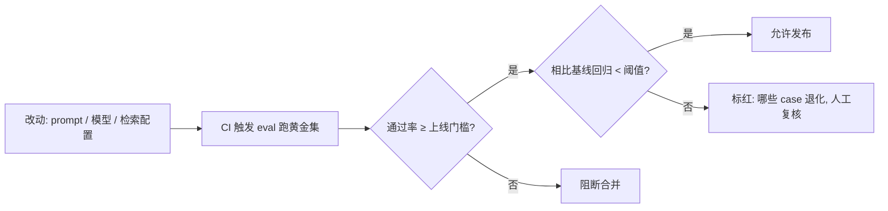

# A08 Eval-driven Development

**问题**：大多数团队是先做完功能、上线前补几条 case 跑通 demo，再回头"补一份评测"。本节要解决的是：**评测应该在产品生命周期的哪个时点出现，才不至于变成事后摆设？** 框架命名为 **Eval-driven Development（EDD，评测驱动开发）**——主张把 "eval set 是 PRD 的一部分" 当成硬约束，让评测在产品定义阶段就先于功能存在，并通过 CI 锚定回归。这是一个关于**时序**的判断，不是关于工具的判断。

> [!warning] 一句话反共识
> 评测后置不是"流程不够完善"，而是**上线即裸奔**：你交付的不是一个可度量的系统，而是一个你无法回答"它好了没有 / 它退化了没有"的黑箱。EDD 的赌注是——**写不出 eval set 的需求，就是还没想清楚的需求**。

---

## §0 为什么是 EDD，而不是"加强测试"

读到这里，很多 PM 脑中的默认框架是："那不就是把 QA 做扎实点、case 写多点吗？" 这个框架会让你低估 EDD 的全部价值，必须先挡掉。

| 维度 | 传统软件测试 / QA | Eval-driven Development |
|---|---|---|
| 判定逻辑 | 二值（pass/fail），断言确定输出 | 分布式（打分 / 偏好 / 通过率阈值），断言**统计行为** |
| 真值来源 | 工程师写死的 expected value | 需要标注、rubric、参考答案，**真值本身要被构造** |
| 失效模式 | 代码 bug，可复现 | 概率漂移、回归、长尾 case，**单次跑通不代表稳定** |
| 出现时点 | 通常在功能写完之后 | **在功能定义之前**（eval set ⊂ PRD） |
| 谁负责 | QA / 测试工程师 | **PM 主笔 rubric**，工程实现 harness |

关键区别在最后两行。传统测试可以后置，因为"对错"是确定的——代码写完，对错就定了。但 LLM 系统的"好坏"是**概率分布上的统计量**，而且**"什么算好"这件事本身需要在需求阶段就定义清楚**。如果你不能在写 PRD 时说出"这个功能达到什么样的输入-输出分布才算合格"，那你交付的验收标准就是空的。EDD 不是"测试的加强版"，它是把"验收标准"这件 PM 本职工作，从模糊的自然语言升级成**可执行的 eval set**。

这与软件工程里 **TDD（Test-Driven Development，Kent Beck 2002 系统化）** 和 **规格先行（specification-first）** 是同构的：先写测试 / 先写规格，倒逼你在动手前就把"完成的定义（Definition of Done）"想清楚。下文 §跨域呼应会具体展开这个同构在哪里成立、在哪里**绷断**——这正是 90% 的人照搬 TDD 时会栽的地方。

---

## §1 eval set 作为 PRD 的一部分

EDD 的第一性主张：**PRD 里必须内嵌一份可运行的 eval set**，而不是一句"准确率要高"。一份最小可用的 eval set 至少包含三类锚点：

| 锚点 | 内容 | PM 在 PRD 阶段就要回答 |
|---|---|---|
| **黄金样本集** | 真实分布抽样的 input + 期望行为 / 参考答案 / rubric | "什么样的输入是这个功能真正要服务的？长尾在哪？" |
| **打分口径** | 每个维度怎么判（精确匹配 / LLM-as-Judge / 人工 rubric） | "好坏由谁判、按什么标准判、判得准不准？" |
| **通过线** | 上线门槛（如黄金集通过率 ≥ X%）+ 回归门槛 | "达到多少才允许上线？退化多少要拦截？" |

样本量的工程经验值可参照已有节点：[m205](/kb/工程化与落地架构/m205-rag-生产环境-索引运维与评估体系/) 给 RAG 黄金集的实践区间是 **200–500 条真实 query 人工标注**，[c14](/kb/基础知识库/c14-模型评估体系与-goodhart-陷阱/) 给的产品级防御是**自建 500–1000 条黄金样本集**。EDD 把这件事的**时点**往前推：不是上线前补，而是 PRD 评审时这份集子就要在桌上——**没有 eval set 的 PRD 不予评审**，等同于"没有验收标准的需求"。

这一步同时回答了一个认识论问题：黄金集的**构造过程本身就是需求澄清过程**。你为了写出 50 条 input，会被迫发现需求里所有含糊的边界（"用户说的'摘要'是 3 句还是 1 段？""违规内容里讽刺算不算？"）。eval set 写不出来，往往不是评测能力不足，而是**需求根本没想清楚**。

---

## §2 CI 集成与回归门槛

eval set 进了 PRD 还不够，它必须**长在交付管线里**才有持续效力。EDD 的第二主张：评测进 CI，每次模型 / prompt / 检索配置变更自动触发，把 eval 当成单元测试一样的 gate。

[m205](/kb/工程化与落地架构/m205-rag-生产环境-索引运维与评估体系/) 已经给出 RAG 场景把 RAGAS 集成进 CI/CD 自动化评估管线的实践，[c14](/kb/基础知识库/c14-模型评估体系与-goodhart-陷阱/) 给出"自建黄金集 + 回归测试自动化"作为 Goodhart 产品级防御。EDD 把这两件事提升为**跨场景的开发纪律**：不只 RAG，任何 LLM 功能的迭代都应有 eval gate。

回归（regression）是这里最容易被忽视、也最值钱的一环。LLM 系统有个反直觉特性：**改 prompt 修好一个 case，常常悄悄改坏另外三个**——因为 prompt 是全局耦合的，不像代码模块那样可隔离。没有回归基线，你会在"修 bug—引入新 bug"的循环里反复横跳而不自知。CI 里的回归门槛，就是把这种隐性退化变成可见的红灯。

---

## §3 判断主轴：90% 的人在 EDD 上会栽的四个点（致命耦合点）

这一节是本节点的命门。EDD 听起来政治正确（"谁会反对早做评测呢"），但**真正落地时崩在四个地方**，每个都配【症状 → 为什么会错 → 正确做法 → 真实反例】。

### 错位一：把"eval 跑通了"当成"eval 有效"

- **症状**：黄金集通过率 95%，团队欢欣鼓舞上线，线上一塌糊涂。
- **为什么会错**：eval set 自身的有效性从未被验证。黄金集若不覆盖长尾、不抗污染、判分口径有偏，跑出来的高分只是**自欺**。这正是 benchmark 污染的微观翻版——只是污染源从公开预训练数据，变成了你自己泄漏给开发过程的测试样本。
- **正确做法**：eval set 也要被 eval。做法借鉴 benchmark 抗污染思路：黄金集分**开发可见集**与**封闭保留集（held-out）**，封闭集只在发布前跑、绝不进 prompt 调优循环；定期用新捞的真实 case 刷新封闭集。
- **真实反例**：SWE-bench Verified（500 道 Python issue）发布后，OpenAI 内审发现**每个主流前沿模型都有逐字复现 gold patch 的案例**，且人工筛查 **32.67% 的成功 patch 涉及解答泄漏**（解答直接存在于 issue 文本或评论里）；2025 年 OpenAI 干脆宣布停止汇报 Verified 分数，改用 SWE-bench Pro（来源：OpenAI 博客 'Why SWE-bench Verified no longer measures frontier coding capabilities', 2025；SWE-bench Pro, arXiv 2509.16941）。同一模型 Claude Mythos Preview 在 Verified 上 93.9%，在 Pro 上仅 45.9%，**差 48 个百分点**——你自建黄金集若不设保留集，迟早重演这一幕。

### 错位二：把 LLM-as-Judge 当成无成本的"自动真值机"

- **症状**：为了让 eval 进 CI 跑得快，全量用 GPT-4 当裁判打分，不再人工抽检，把 Judge 分数当成金标准。
- **为什么会错**：Judge 自带系统性偏差，且这些偏差**恰好会被 prompt 优化器学会去钻**——你在用一个有漏洞的尺子量自己，还顺着漏洞优化。
- **正确做法**：Judge 必须先**对齐人工**再投产：抽样算 Judge 与人工的一致性（用 [Cohen's Kappa](/kb/基础知识库/cohen-kappa-系数/) 而非原始一致率，后者会高估）；位置偏差用**双向评测**（A/B 顺序各跑一次，仅计双向一致的裁决）缓解；高风险维度保留人工抽检。
- **真实反例**：Zheng et al. 2023（MT-Bench / Chatbot Arena, arXiv 2306.05685）实测：交换回答顺序后 GPT-4 改变裁决的比例约 **35%**；对故意冗长回答，GPT-3.5 和 Claude-v1 的失败率高达 **91.3%**；GPT-4 给自身输出打分胜率高出 **10%**，Claude-v1 高出 **25%**。更狠的是 JudgeBench（Ye et al. 2024, arXiv 2410.12784）：在高难度知识 / 推理 / 数学 / 编程评判对上，**GPT-4o 等强模型的表现仅略好于随机猜测**。把这种尺子当无成本真值机塞进 CI，等于给优化器开了作弊后门。这条与 [c14](/kb/基础知识库/c14-模型评估体系与-goodhart-陷阱/) 的"LLM-as-Judge 三大偏见"是同一根软肋，EDD 的新增点是：偏见在 CI 自动化里会被**放大**，因为没人再盯着每条裁决看了。

### 错位三：eval set 一次写定，与产品一起腐烂

- **症状**：上线时的黄金集半年没动，CI 一直绿灯，但用户投诉在涨。
- **为什么会错**：用户行为、对手模型、内容形态都在漂移，**静态 eval set 的判别力会随时间饱和归零**。这是 benchmark 饱和现象在你产品内部的复现。
- **正确做法**：把 eval set 当**活体资产**维护——定期从线上失败 case、人工接管记录、用户负反馈里回灌新样本（[c14](/kb/基础知识库/c14-模型评估体系与-goodhart-陷阱/) 的"红队 case 闭环转化为 SFT 数据"在这里同样适用于回灌 eval set）；监控黄金集通过率的**天花板效应**，一旦逼近 100% 就主动加难。
- **真实反例**：MMLU（Hendrycks et al., ICLR 2021）覆盖 57 学科，GPT-4 于 2023 年 3 月达 86.4% 后，**所有前沿模型停滞在 86–87% 区间直到 2024 年中，判别力丧失**；MMLU-Pro（Wang et al., NeurIPS 2024）把选项从 4 扩到 10，GPT-4o 当即从 88.7% 掉到 72.6%。GPQA（Rein et al., arXiv 2311.12022）从 39%（2023.11）一路爬到 94%+（2026 初）也已现饱和。公开 benchmark 尚且如此快地被磨平，你那份"上线时觉得很难"的黄金集，半年后大概率已经是张白卷。

### 错位四：用单一聚合分数当上线开关，掩盖维度互斥

- **症状**：把多维 eval 折成一个加权总分，"≥ 8.0 即上线"。
- **为什么会错**：评测维度之间**常常互斥**——拉高一个会牺牲另一个，加权总分把这种张力抹平，让你在不知情的情况下做了不该做的取舍。
- **正确做法**：上线门槛用**多维硬约束**而非单一加权分（每个关键维度各设独立 floor，全部达标才放行）；显式记录维度间的取舍关系。
- **真实反例**：[m205](/kb/工程化与落地架构/m205-rag-生产环境-索引运维与评估体系/) 已记录 RAGAS 四维里 **高 Faithfulness 有时会牺牲 Answer Relevancy**；HELM（Liang et al., Stanford CRFM, 2022）做跨 7 维（准确性 / 鲁棒性 / 公平性 / 毒性 / 效率…）综合评价的初衷，正是因为单一准确率指标会掩盖模型在其它维度的塌方。把这些维度折成一个数，等于自愿戴上眼罩上线。

---

## §4 产品 PM 视角补盲：eval-first 的组织摩擦与如何破

跳出工程视角，EDD 真正的拦路虎不是技术，是**组织摩擦**——这是 brief 点名要回答的。

- **摩擦一：先写 eval 拖慢交付，"看不见的活"得不到激励。** 写黄金集、标注、对齐 Judge 都是前置成本，而管理层考核的是 ship 速度。破法：把 eval set 写入 **Definition of Done**，让"无 eval 不评审"成为流程硬卡点，而非个人自觉；把 eval 覆盖率当成和代码覆盖率平级的可见指标。
- **摩擦二：谁来标注？标注一致性谁负责？** 黄金集真值要人标，而标注本身是有方法论的活（见 [Cohen's Kappa](/kb/基础知识库/cohen-kappa-系数/)、标注指南、IAA）。破法：PM 主笔 rubric 与边界 case 裁决规则，不外包给"随便找几个人打分"；主观任务（如内容安全里的讽刺、争议话题）**保留标注分歧本身作为信号**，别强行多数投票抹平（perspectivist annotation，SemEval-2023 LeWiDi 共享任务）。
- **摩擦三：商业 KPI 与 eval 指标脱钩。** eval 通过率涨了，留存 / 转化没动，团队开始质疑 eval 的价值。破法：把指标按 [c14](/kb/基础知识库/c14-模型评估体系与-goodhart-陷阱/) 的**三层因果链**串起来——模型指标 → 产品体验指标 → 业务结果指标，eval 守的是第一层，但必须显式论证它如何传导到后两层，否则 eval 会沦为自娱自乐的内部 KPI。
- **合规边界**：在高风险域（安全、医疗、金融），eval set 还承担**审计证据**功能——监管要的不是"我们觉得它安全"，而是"在这份可复核的测试集上达到了 X 通过率"。这一点对 Rick 所在的安全 + 国际化场景尤其实在：不同司法辖区对"可接受失败率"的定义不同，eval set 要能按地区切分门槛。

---

## §5 对手框架回应：接受 + 边界

**对手立场（业界真实反方）**：以 Andrej Karpathy 为代表的一派强调 "vibe check" / 人工把玩的不可替代性——他公开表达过对当前自动评测体系的不信任，认为很多 benchmark 与真实体验脱节，资深人员的手动体感往往比一堆自动分数更早发现问题（来源：Karpathy 在 X 上关于 evals crisis / "I don't trust the benchmarks" 的多次公开表态，2024–2025〔具体推文措辞待核实，立场方向已多方报道〕）。这与 EDD"一切可度量、进 CI 自动化"的取向直接冲突。

**接受**：这个批评抓住了 EDD 的真实软肋。自动 eval 测的是"你已经想到要测的东西"，而最危险的失效恰恰是**你没想到的那一类**——这类 case 只有人在真实使用中"咯噔一下"才会浮现。把 eval 全自动化、撤掉人工把玩，等于自废这条最灵敏的预警线。前述错位一、二（黄金集自欺、Judge 偏差）也都印证：自动分数会系统性地骗人。

**边界 / 我赌的是**：但 vibe check 不可规模化、不可回归、不可审计、因人而异——它**无法回答"昨天到今天退化了没有"**这个 EDD 的核心问题。所以我的赌注是：**两者是互补而非替代**。EDD 守住"已知失效模式的回归底线"（自动、可审计、防退化），vibe check 守住"未知失效模式的发现前沿"（人工、灵敏、进不了 CI）。正确的工程姿势是：把 vibe check 中"咯噔一下"发现的新 case **回灌进黄金集**，让今天的人工直觉变成明天的自动门槛——这恰好就是错位三的解法。**赌注会输的场景**：当产品形态变化极快（如早期探索期，需求每周重写），前置写 eval 的成本会高于其收益，此时 vibe check 优先、EDD 后置反而是对的——**EDD 不适用于"还没有稳定 PRD"的阶段**，这是它的 failure scenario。

---

## §6 跨域呼应：TDD / 规格先行的同构，与它绷断的地方

EDD 与软件工程的 **TDD（Test-Driven Development）** 和 **规格先行（specification-first / contract-first）** 是结构同构的：三者都把"验证标准"提到"实现"之前，用"先定义完成的样子"来倒逼需求澄清。Kent Beck 在《Test-Driven Development: By Example》(2002) 里 "red-green-refactor" 的核心心法——**先让你无法定义测试的需求暴露出来**——正是 EDD §1 "写不出 eval set 的需求就是没想清的需求"的直接祖先。

但这个跨域类比的价值,不在于"借光"，而在于**它绷断的地方恰好标出了 EDD 的特殊性**——这是空喊"借鉴 TDD"的人会漏掉的：

| TDD 假设 | 在 EDD 里是否成立 | 后果 |
|---|---|---|
| 测试是**确定性**断言（assert x == 5） | ✗ 失效：eval 是统计量，pass 是分布上的阈值 | 不能写死 expected value，要写 rubric 和通过率 |
| 测试**真值**由开发者直接给出 | ✗ 失效：真值要标注、要构造、标注本身有一致性问题 | 真值生产成本极高，且真值自己会有偏 |
| 测试**写一次永远有效** | ✗ 失效：eval set 会饱和、会被污染、会随漂移失效 | 必须当活体资产维护（错位三） |
| 测试**绿了就是对了** | ✗ 失效：绿灯可能来自 Judge 偏差 / 测试集泄漏 | "eval 跑通 ≠ eval 有效"（错位一、二） |

所以 EDD 不是"把 TDD 套到 AI 上"，而是 **TDD 的四条地基在概率系统里全部松动后的重建版**。谁要是把 TDD 经验原样照搬——写死断言、信任绿灯、一次写定——就会精确地踩进 §3 的四个坑。这正是把 [确定性→概率系统](/kb/基础知识库/c01-认知重构-从确定性系统到概率系统/) 的认知转变，落到"开发纪律"这一层的具体后果。

> [!note] 跨域调度的边界
> TDD 同构能解释"为什么要前置"，但不能解释"前置的东西长什么样"——后者必须靠评测领域自己的工具（黄金集、Judge 校准、保留集、IAA）。跨域资源在这里的作用是**反对一个滑变**（"EDD 就是 AI 版 TDD"这个过度简化），而不是提供答案。

---

## §7 PM 决策启示

- **面试怎么用**：被问"你怎么保证 LLM 功能的质量"，不要答"我们会做充分测试"。答："我把 eval set 当 PRD 的一部分，PRD 评审时黄金集就要在桌上；eval 进 CI 设回归门槛；Judge 上岗前先用 Kappa 对齐人工；黄金集分开发可见集和封闭保留集防自我污染。"——一句话把你和"只会提需求的 PM"区分开。
- **选型怎么用**：评估一个模型 / 供应商，别看它在公开 benchmark 的分数（可能已污染 / 已饱和），**用你自建的封闭黄金集复测**。供应商若拒绝在你的私有集上跑，本身就是信号。
- **复现怎么用**：搭最小 EDD 闭环的顺序是——先写 30–50 条黄金集（逼出需求边界）→ 定打分口径（能精确匹配就别用 Judge）→ Judge 校准（算 Kappa）→ 进 CI 设两道门（上线门槛 + 回归门槛）→ 上线后回灌真实失败 case。详见复现模块。

---

## §8 与已有节点的关系（升级对照）

- **对 [c14](/kb/基础知识库/c14-模型评估体系与-goodhart-陷阱/)：补缺 + 深化。** c14 解决"评测指标会被 Goodhart 化、如何防御"，停在"自建黄金集 + 回归自动化"这个**做法**。本节点把它升一个抽象层到**时序纪律**：不是"要做黄金集"，而是"黄金集必须先于功能、写进 PRD、长在 CI 里"。c14 的 LLM-as-Judge 三大偏见，本节点指出在 CI 自动化语境下会被**放大**（错位二）。**不复述** c14 的 Goodhart 机制与六维体验矩阵。
- **对 [m205](/kb/工程化与落地架构/m205-rag-生产环境-索引运维与评估体系/)：泛化。** m205 给出 RAG 场景把 RAGAS 集成进 CI/CD、200–500 条黄金集的具体实践。本节点把"评测进 CI"从 RAG 单一场景**泛化为跨场景开发纪律**，并补上 m205 未展开的"eval set 自身有效性验证"（保留集、抗污染）与"维度互斥下的上线门槛设计"（错位四）。**不复述** RAGAS 四维定义。
- **对 [Cohen's Kappa](/kb/基础知识库/cohen-kappa-系数/)：调用 + 给出新用法。** 本节点把 Kappa 从"分类器评估工具"调用到 **EDD 的 Judge 校准环节**（量化 LLM-Judge 与人工标注的 inter-rater reliability），这是 Kappa 节点本身未展开的 LLM-as-Judge 用法。
- **对 [m207](/kb/工程化与落地架构/m207-agent-产品化-场景推演与失败模式/)：对话。** m207 的 Agent 七维评估体系是"测什么"的清单；本节点回答"这套清单该在 Agent 开发的哪个时点出现、怎么进 CI"，是时序层面的互补。

---

## §9 关联节点

**核心（必读）**
- [c14 - 模型评估体系与 Goodhart 陷阱](/kb/基础知识库/c14-模型评估体系与-goodhart-陷阱/) — 本节点的直接上游：Goodhart 防御 → 时序纪律
- [m205 - RAG 生产环境：索引运维与评估体系](/kb/工程化与落地架构/m205-rag-生产环境-索引运维与评估体系/) — CI 集成 + 黄金集的场景化先例
- [Cohen Kappa 系数](/kb/基础知识库/cohen-kappa-系数/) — Judge 校准的一致性度量工具
- [c01 - 认知重构：从确定性系统到概率系统](/kb/基础知识库/c01-认知重构-从确定性系统到概率系统/) — EDD 与 TDD 分野的认识论根

**延伸（可选）**
- [m207 - Agent 产品化：场景推演与失败模式](/kb/工程化与落地架构/m207-agent-产品化-场景推演与失败模式/) — Agent 评估清单与失败模式
- [c13 - 幻觉的不可消除性](/kb/基础知识库/c13-幻觉的不可消除性/) — eval 要测的核心失效之一；校准问题是 Judge 的前提性挑战
- Agent 产品评估的五个具体问题 — 评估方法论的 PM 工作版
- Rick 写作 SABCD 评级体系 — "按体裁分轨"= 评测"按任务类型分轨"的人文对照案例
- [AI PM 知识图谱·总索引](/kb/ai-pm-知识图谱/ai-pm-知识图谱-总索引/) — 回到总图

---

## 修订日志

- **R0（2026-06-06，初稿）**：建立 EDD 时序框架（eval-first）；§0 与传统 QA / TDD 做框架辨析；§3 判断主轴四错位（自欺 / Judge 偏差放大 / 静态腐烂 / 单一聚合分）各配真实反例（SWE-bench 泄漏 32.67%、MT-Bench 位置偏差 35%、MMLU 饱和、RAGAS 维度互斥）；§5 接入 Karpathy vibe-check 反方立场（接受 + 互补边界 + EDD 在早期探索期失效的 failure scenario）；§6 展开 TDD 四条地基在概率系统中松动的同构-绷断分析；§8 与 c14/m205/Cohen Kappa/m207 写显式升级对照。待核实项：Karpathy 关于 evals / benchmark 不信任的具体推文措辞（立场方向已多方报道，措辞标〔待核实〕）。
