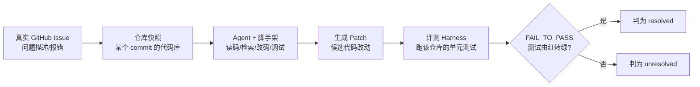

当一个 PM 在选 coding agent 时听到"我们 SWE-bench Verified 93.9%"，他要解决的真正问题不是"谁的分数更高"，而是**这个 93.9% 里有多少是模型能力、多少是脚手架工程、多少是答案泄漏，以及它能换算成多少真实工单的可交付率**。本节点不重复 [A03 Benchmark 与数据污染](/kb/专题-评测与度量/a03-benchmark-与数据污染/) 已论证的"静态榜为什么系统性虚高"（那是构念效度三重打击的概念层），而是把 SWE-bench 当作一具**具体的病理标本**解剖：它的任务管线长什么样、为什么"解决真实 GitHub issue"这个设计初衷在落地时被三股力量扭曲、以及 coding agent 这一类评测里**分数与可用度的鸿沟**到底有多宽。框架是「榜单政治经济学」——一个榜单的分数不是中立测量，是一条由谁出题、谁建 harness、谁有数据特权、谁负责汇报共同决定的**利益链产物**。这是问题陈述：SWE-bench 不是一把尺子，是一个**被多方利益塑形的市场基础设施**，PM 读它必须先读它的生产关系。

---

## §0 为什么是"榜单政治经济学"框架，而不是"分数效度"框架

[A03 Benchmark 与数据污染](/kb/专题-评测与度量/a03-benchmark-与数据污染/) 用心理测量学的**构念效度**框架解释了"分数为什么不可信"——污染、过拟合、格式红利。那个框架在解释 MMLU/GPQA 这类**选择题**时最锋利。但 SWE-bench 不是选择题，它是一个**端到端的 agent 任务系统**：给一个真实仓库 + 一个 issue，让 agent 自己读代码、改代码、跑测试。这里分数失真的主因不再是"题被背了"（虽然也有），而是一个更结构性的东西——**被测对象根本不是"模型"，是"模型 + 一整套脚手架（scaffolding/harness）+ 评测 harness"的联合产物，而这套脚手架由谁建、怎么建，没有标准、没人监管、且对分数贡献巨大**。

构念效度框架问"分数测的是不是真能力"；政治经济学框架问一个它问不出的问题：**"这个分数是谁生产的、谁从它的虚高里获益、谁有能力让它虚高而别人没有"**。这两个框架解释的怪现象不同：

- 效度框架解释不了为什么**同一个模型同一个榜，换一套开源脚手架分数能差十几个点**——这不是污染，是生产工艺差异。
- 效度框架也解释不了为什么 **OpenAI 会主动宣布"停止汇报 SWE-bench Verified 分数"**（OpenAI 博客 'Why SWE-bench Verified no longer measures frontier coding capabilities'，2026 年 2 月 23 日发布，openai.com）——一个厂商主动放弃一个对自己有利的榜，背后**既有技术理由也有利益计算**：技术上 OpenAI 审计了模型常失败的那 27.6% 子集，发现其中至少 **59.4% 的题存在测试用例缺陷**（要么测试过窄、误拒功能正确的提交，要么过宽、要求 issue 里根本没提的功能），加上所有前沿模型都能逐字复现 gold patch（污染），所以 Verified 的"进步"已不再反映真实编程能力；利益上，弃用一个被所有人刷顶的榜、改推自己参与设计的新榜（Pro），也是**重置定价权**的市场动作（§7 §3 展开）。本节点选政治经济学框架，不是要否认技术理由，而是要补上效度框架问不出的那一层。

选政治经济学框架，是因为 coding agent 评测的真正战场在**生产关系**：出题方（学术）、建 harness 方（厂商/社区）、有数据特权方（前沿大厂）、汇报方（厂商市场部）四方利益不一致，分数是它们博弈的暂时均衡。PM 读榜不被骗，靠的不是"会算效度",而是**会问"这个数字是谁、用什么 harness、在什么利益结构下生产的"**。

---

## §1 SWE-bench 的解剖：一个"真实 issue→patch"任务到底由什么组成

先把 SWE-bench 的设计拆开。它出自 Carlos E. Jimenez, John Yang et al. 'SWE-bench: Can Language Models Resolve Real-World GitHub Issues?'（ICLR 2024, arXiv 2310.06770，原始 SWE-bench 论文）。其设计初衷恰恰是**逃离选择题**——用真实开源仓库的真实 issue，测"能不能真的改对代码"。一个任务实例的管线：

关键解剖结论：**"成功"的定义是"让一组预先指定的单元测试由失败转通过"（FAIL_TO_PASS），不是"人类工程师认可这个改动"**。这个操作化（operationalization）有三个被低估的后果：

| 设计选择 | 看上去 | 实际后果（病理） |
|---|---|---|
| 用单元测试判对错 | 客观、可自动化 | 测试本身可能不完整；"测试过=改对"不成立——可能猜到测试、可能改坏别处但测试没覆盖 |
| 用真实 GitHub 数据 | 贴近真实工程 | 2024 年 6 月后训练的模型可能见过 issue 的解答（污染入口） |
| issue 文本直接给 agent | 信息完整 | issue 评论里可能**直接写着答案**（泄漏入口，见 §2） |

**SWE-bench Verified** 是 OpenAI 与原作者协作筛出的 500 道"人工验证过、表述清晰、测试合理"的 Python 子集（'Introducing SWE-bench Verified', openai.com, 2024）。它修掉了原 SWE-bench 的部分噪声（题目描述含糊、测试过严等），但**没有、也无法修掉污染与脚手架耦合这两个结构性问题**——这正是后文的病理核心。

---

## §2 病理一：分数里到底混进了什么（泄漏 + 脚手架 + 污染）

SWE-bench Verified 高分由三股**与"模型编程能力"无关的水分**共同抬起，每一股都可证伪：

1. **答案直接泄漏在 issue 里**：据对 SWE-bench 成功 patch 的人工筛查，**约 32.67% 的"成功"案例的解答直接出现在 issue 文本或评论中**〔此数字流传于多份独立分析，原始一手出处待进一步坐实，按〔待核实〕降级处理〕。也就是说，约三分之一的"解决"，agent 不是"推理出"修复，是**读到了答案再抄下来**。
2. **脚手架工程贡献巨大且不可解耦**：脚手架工程（非模型能力）对 Verified 分数贡献巨大，**标准化评测 harness 的缺失加剧了排行榜失真**——这正是 OpenAI 弃用 Verified 博客与 Scale AI 推出标准化脚手架（SWE-Agent scaffold）所共同指向的问题。同一个底座模型，配一套精心调过的检索/重试/多步骤脚手架，分数能和裸调用差出可观的量级——但榜单上只写"某模型 X%"，把 harness 的功劳算给了模型。
3. **训练数据污染**：发布后任何用 2024 年 6 月后 GitHub 数据训练的模型都可能见过部分解答；OpenAI 在 2026 年 2 月的审计中明确发现**所测的每个前沿模型都能逐字复现 gold patch 或问题陈述的具体表述**（'Why SWE-bench Verified no longer measures frontier coding capabilities', openai.com, 2026-02-23），说明它们都在训练中见过至少一部分题与解。

> [!warning] failure scenario：32.67% 这个数字本身要小心读
> "约 32.67% 的成功 patch 涉及泄漏"不等于"32.67% 的分数是假的"。它的精确含义是"这些成功里有约三分之一**存在泄漏路径**"——agent 是否真的利用了泄漏、剩下三分之二是否就干净，并无定论；且该数字本身的一手出处尚未坐实（已标〔待核实〕）。把它读成"SWE-bench 分数要打七折"是过度精确化。正确的 PM 表述是：**"Verified 分数里有一个数量级在 30% 上下的成功存疑，且污染**不对称**地高估了那些训练数据更新、脚手架更强的厂商。"** 数字要么真、要么标范围、要么标〔待核实〕——这里它是一个"成功子集占比"的待核实估计，不是"虚高幅度"。

---

## §3 病理二：分数 vs 可用度的鸿沟——同一模型 Verified→Pro 的落差有多宽

这是本节点最该被打印贴墙的一组数字。当一个榜被刷到 80%+，社区/厂商造一个更难、更贴近真实工程（更长上下文、跨文件依赖、多语言）的变体，**同一模型的分数会显著回落，且回落幅度在不同模型间差异巨大**——这个差异本身才是信息。下表对比的是 SWE-bench Verified 与 SWE-bench Pro 两个口径（Pro 数据据 Scale AI 公开 leaderboard 与 Deng, Da et al. 'SWE-Bench Pro: Can AI Agents Solve Long-Horizon Software Engineering Tasks?', Scale AI, 2025, arXiv 2509.16941；分数为截至 2026 年 6 月初的快照，会随版本更新，见修订日志）：

| 模型 | SWE-bench Verified | SWE-bench Pro | 落差 | 含义 |
|---|---|---|---|---|
| Claude Opus 4.5 | 80.9% | 45.9% | 约 35 点 | 高分模型，Pro 仍腰斩 |
| Claude Mythos Preview | 93.9% | 77.8% | 约 16 点 | Verified 顶格，Pro 落差收窄 |
| 2025 年 9 月 Pro 发布时的顶级模型（GPT-5 / Claude Opus 4.1） | 70%+ | 约 23%（GPT-5 23.3% / Opus 4.1 23.1%，公开集） | 约 47 点+ | 历史快照，见 §4 错点 2 与下方时间截面 |

**这里有一个比"腰斩"更重要、更反直觉的事实，必须正面处理：落差幅度本身在收窄，且模型之间高度不齐。** Opus 4.5 从 80.9% 掉到 45.9%（约 35 点，确实接近腰斩），但 2026 年 4 月的 Mythos Preview 只从 93.9% 掉到 77.8%（约 16 点，远谈不上腰斩）；而 2025 年 9 月 Pro 刚发布时，当时的顶级模型（GPT-5、Opus 4.1）是从 70%+ 掉到约 23%（腰斩还不止）。

> [!warning] failure scenario：本节点早期口径里"普遍腰斩 / 约 48 点鸿沟"的说法不成立，已纠正
> R0 初稿曾把"Verified→Pro 普遍腰斩约 48 点"当成一条稳定结论，并把 45.9% 这个 Pro 分数错安在 Mythos Preview 身上（实为 Opus 4.5 的分数）。经核查（Scale AI SWE-bench Pro leaderboard，2026 年 6 月初）这是错的：(1) 45.9% 是 **Opus 4.5** 的 Pro 分（对应 Verified 80.9%，落差约 35 点），不是 Mythos Preview；(2) **Mythos Preview** 的 Pro 分是 **77.8%**（对应 Verified 93.9%，落差仅约 16 点）。所以"腰斩"只在**特定时间截面、特定模型**上成立（2025 年 9 月发布时、Opus 4.5 这一档），不是一条可普遍外推的定律。把它写成定律，正是本节点要批判的"以快照冒充结构性事实"的毛病——这里自我纠正。

**所以这条鸿沟的正确 PM 读法不是"Verified 高分一定会在 Pro 腰斩"，而是更精细的两条**：

1. **绝对值仍然有鸿沟**：即便是最强的 Mythos Preview，Pro 也比 Verified 低 16 个点；越弱的模型，落差越大（Opus 4.5 约 35 点）。**Verified 93.9% 不能线性外推成"能搞定我 93.9% 的工单"**——它高估，只是高估幅度因模型而异。
2. **落差幅度是模型质量的判别器**：Verified 都很高（80%+）时区分度已饱和，但 **Pro 落差小的模型（如 Mythos 16 点 vs Opus 4.5 的 35 点）更接近"真能做长程工程"**。读榜要读的不是单个 Verified 分，而是**同模型 Verified 与 Pro 的差**——差越小，越可信。

> [!note] 把"鸿沟"翻译成 PM 能用的话
> Verified ≈ "改一个文件能修好的、issue 描述清楚的、有现成测试的"短程任务；Pro ≈ "要跨好几个文件、自己理清依赖、长上下文、多语言"的长程任务。**真实工单的分布更偏 Pro 一侧。** 所以读 coding agent 榜的第一性原理是：**永远要同一模型 Verified 和 Pro（或任意更难变体）的分数对，看它的落差有多宽**，单看 Verified 等于只看体检表上最好看的那一项。

这条鸿沟与 [A03 Benchmark 与数据污染](/kb/专题-评测与度量/a03-benchmark-与数据污染/) 的"饱和即失效"是同一现象的两面：A03 从效度角度说"尺子被磨平了"，本节点从工程角度补充"被磨平的尺子量出的高分，外推到真实任务会回落（且回落幅度因模型而异）"。

---

## §4 判断主轴 · 致命耦合点：90% 的人读 coding agent 榜会搞错的 4 个点

这一节是本节点的命门。每点配【症状 → 为什么会错 → 正确做法 → 真实反例】。

### 错点 1：把"SWE-bench 分数"当成"模型能力"（脚手架耦合盲区）
- **症状**："X 模型 SWE-bench Verified 比 Y 高 5 个点，所以 X 模型更会写代码，我选 X。"
- **为什么会错**：SWE-bench 测的是**模型 + 脚手架 + 评测 harness 的联合产物**，不是模型。脚手架工程对分数贡献巨大、且原始 SWE-bench 无统一 harness——这正是 Scale AI 在 SWE-bench Pro 里改用统一 SWE-Agent scaffold、OpenAI 在弃用博客里强调"要解耦模型能力与脚手架"所共同承认的问题。你比的可能不是两个模型，是"X 团队的脚手架"对"Y 团队的脚手架"——而你买回去用的脚手架是第三套（你自己的）。
- **正确做法**：要求供应商披露**复现条件**（用的什么 agent 框架、几步预算、是否允许重试、是否检索）。同一模型在不同 harness 下的分数差，是"这个数字有多少是模型的"的直接证据。没有 harness 信息的分数，约等于没有信息。
- **真实反例**：OpenAI 在 **2026 年 2 月 23 日**宣布**停止汇报 SWE-bench Verified 分数**、改推荐 SWE-bench Pro，理由正是它"不再衡量前沿编程能力"（'Why SWE-bench Verified no longer measures frontier coding capabilities'，openai.com）——博客同时给出技术证据：所测前沿模型**均能逐字复现 gold patch**（说明都见过训练数据），且失败子集里 59.4% 有测试缺陷。出题/汇报方自己承认这个数字既被污染又不可解耦。一个连厂商都不愿背书的数字，PM 凭什么拿它做选型主依据。

### 错点 2：把 Verified 高分线性外推成"真实工单完成率"
- **症状**："Verified 93.9%，那它至少能自动化我们 80%+ 的 bug 工单吧。"
- **为什么会错**：Verified 是**被筛过的、短程的、测试现成的**理想化任务；真实工单更像 Pro（长程、跨文件、需求模糊、没有现成测试）。同模型 Pro 分一定低于 Verified（Opus 4.5：80.9%→45.9%，落差约 35 点；Mythos Preview：93.9%→77.8%，落差约 16 点，见 §3）。落差幅度因模型而异，但方向恒定——线性外推必然高估，弱模型高估近一倍。
- **正确做法**：用**更难变体的分数（Pro 等）做下界锚点**，再用你自己业务工单的 holdout 做最终校准。把 Verified 当"天花板的乐观估计"，把 Pro 当"接近真实的悲观估计"，真值在两者之间且偏 Pro。
- **真实反例（注意时间截面）**：〔2025 年 9 月 SWE-bench Pro 发布时数据〕在 SWE-Agent 标准脚手架下，当时最强的 GPT-5 与 Claude Opus 4.1 在 Pro 公开集上分别只有 **23.3% 和 23.1%**（对应 Verified 70%+），一个理想榜上 70 分的 agent 扔进长程真实任务只剩两成出头。**这个"约 23%"是历史快照，截至 2026 年 6 月已大幅过时**——Pro 榜首已被 Mythos Preview 推到 77.8%、Opus 4.6 约 53.4%、GPT-5.4 约 57.7%（Scale AI SWE-bench Pro leaderboard）。但 Pro 显著低于 Verified 这条**结构性事实没变**，变的只是绝对值，这正是"demo 惊艳、上线拉胯"为何仍是 coding agent 常态的根因（参见 Agent 产品评估的五个具体问题 的复合错误数学：单步 99% × 20 步 ≈ 82%，长程任务步数一多，成功率指数衰减）。

### 错点 3：以为"换 SWE-bench Pro / 更新更难的榜"就解决了问题
- **症状**："Verified 被刷爆了，那以后只看 Pro 就行，Pro 难，污染不了。"
- **为什么会错**：Pro 今天干净，是因为它**新**。任何公开静态基准发布即开始被污染倒计时——这正是 [A03 Benchmark 与数据污染](/kb/专题-评测与度量/a03-benchmark-与数据污染/) 论证过的、'The Emperor's New Clothes in Benchmarking?'（Sun, Wang et al., ICML 2025, arXiv 2503.16402）实证过的：该研究系统评估多种污染缓解策略后发现，**在跨 benchmark 评估中，没有任何策略能稳健地显著提升污染抵抗力**（部分策略在单一 benchmark 上有效，但换一个 benchmark 就失效，缺乏稳健性）。更难只是延寿，不是治本。而且 Pro 仍然有**脚手架不可解耦**这个 SWE-bench 家族的胎里病——换榜没换掉它。
- **正确做法**：把任何公开 coding 榜都当**弱先验 + 有保质期的快照**。真正抗污染的是你自己持有的、定期轮换的业务 holdout（你公司真实工单脱敏后建的私有集）。
- **真实反例**：SWE-bench Verified 自己就是"为修复原 SWE-bench 问题而造的更好的榜"，两年内照样被刷到 93.9% 并被 OpenAI 弃用。Pro 没有理由豁免于同一条生命周期。

### 错点 4：忽视"谁建 harness、谁有数据特权"的结构性不对称（政治经济学盲区）
- **症状**："这是公开学术 benchmark，对所有厂商一视同仁，是中立的。"
- **为什么会错**：榜单不是中立竞技场。最系统的实证来自 'The Leaderboard Illusion'（Singh et al., arXiv 2504.20879, NeurIPS 2025 Datasets & Benchmarks Track）——但要注意**它研究的对象是 Chatbot Arena 这类偏好投票平台，不是 SWE-bench 这类评测集**，两者的权力机制并不相同（见下方"机制辨析"）。在 Arena 上，**前沿大厂有结构性数据特权**：OpenAI/Google/Meta/Anthropic 合计占约 62.8% 对战数据，大厂日采样率最高 34% vs 小厂 3.3%（约 68 倍差距），且能**私测多个变体只报最高分**（Meta 在 Llama-4 发布前私测 27 个变体）。

  > [!warning] 机制辨析：不要把 Arena 的"数据采样特权"与 SWE-bench 的"训练覆盖+工程资源特权"当成同一回事
  > 这两类不对称**方向相似（都让前沿大厂占便宜）、机制不同（不可直接套用 Arena 的数字）**：
  > - **Chatbot Arena（偏好平台）的特权**：体现在**评测过程的数据流**——谁的模型被采样得多、谁能私测多变体后选择性披露、谁的对战数据占比高。它操纵的是"测量这一刻"的采样与披露。
  > - **SWE-bench（评测集）的特权**：体现在**两个完全不同的环节**——(1) **训练数据覆盖**：谁的训练语料更全地吃进了 GitHub（题源），谁就更可能见过 gold patch（污染入口，OpenAI 已证实所有前沿模型都能复现 gold patch）；(2) **工程资源**：谁有算力和工程团队把 agent 脚手架/harness 调到极致，谁就能在同一底座模型上多榨出分数。它操纵的不是"测量这一刻"，而是"模型出厂前的训练"和"提交答案前的脚手架"。
  > 
  > 所以不能说 SWE-bench 和 Arena 的不对称"同构"，只能说**它们都指向同一个政治经济学结论：榜单系统性地利好掌握更多数据与算力的一方**——但 PM 要查的证据清单不同（Arena 查采样率/披露记录；SWE-bench 查训练截止日 vs 题源时间、查 harness 配置）。
- **正确做法**：把榜单读成**有生产关系的市场基础设施**。针对 SWE-bench 问三个政治经济学问题：(1) 这个数字是裸模型还是带厂商私有脚手架？(2) 这个模型的训练数据是否覆盖了榜的题源（GitHub）、训练截止日是否晚于题目创建时间？(3) 这是"报告的最高分"还是"可独立复现的分"？三个问题任一答不上来，分数降级为"据称"。
- **真实反例**：在 Arena 一侧，'Leaderboard Illusion' 实测把模型的 Arena 训练数据比例从 0% 提到 70%，ArenaHard 胜率从 23.5% 飙到 49.9%（相对 +112%），但通用指标 MMLU **略降**——证明针对特定榜的特化能凭空造出一倍的"提升"而不增加真实能力。**这个 +112% 是 Arena 平台的数字，不能直接搬到 SWE-bench**；但 SWE-bench 一侧有 OpenAI 自己的等价证据：所有前沿模型都能逐字复现 gold patch，说明训练覆盖同样能凭空抬高分数而不代表真实能力。两类机制不同，结论一致：有数据/算力特权的一方，制造虚高的成本远低于没有的一方。

---

## §5 产品 PM 视角补盲：coding agent 榜是采购武器，不只是技术指标

跳出工程视角，SWE-bench 数字在商业现场的三个非技术陷阱：

1. **采购锚定（anchoring）**：销售把"我们 SWE-bench 第一"做成 deck 第一页，卖的是**数字制造的确定性幻觉**。PM 的反制不是比谁的数字大，而是把对话从"你榜上多少"拉到"在我们脱敏后的 50 个真实工单上，你的 agent + 我们的 harness 跑出来多少、人工返工率多少"。把战场从供应商主场（公开榜）拉回你的主场（业务 holdout）。
2. **"自动化率"承诺的法律/财务风险**：如果你拿 Verified 93.9% 去给老板/客户承诺"自动化 90% 工单"，而真实落地接近 Pro 的 23%–46%，这个 gap 会变成毁约、超支、信任崩塌。**对外承诺必须用业务 holdout 的下界，绝不用公开榜的上界。** 这是 PM 的免责底线。
3. **合规与安全边界（滴滴/国际化场景）**：coding agent 自动改生产代码，意味着它的失败模式是**线上事故**，不是"答错一道题"。SWE-bench 测"测试转绿"，完全不测"改动是否引入安全漏洞、是否违反数据合规、是否在跨国部署里踩了某地的监管红线"。把"SWE-bench 高分"当"可以放手让它改生产代码"的依据，是会出事故的混类。给安委会汇报时，coding agent 的评测维度必须包含可逆性、人工断点（HITL）、回滚成本——这些榜上一个字都没有（参见 [m207 - Agent 产品化：场景推演与失败模式](/kb/工程化与落地架构/m207-agent-产品化-场景推演与失败模式/) 的 HITL 三维框架）。

---

## §6 对手框架回应：接受 + 边界（具名立场，逐条对话）

本节点的批评立场必须经得起真实对手的拷问，而不是打稻草人。下面点名四个**真实存在、可追溯**的反方立场，逐条按"接受它对的部分 + 标注本节点坚持的边界"展开。

### 对手 1：Carlos E. Jimenez 等 SWE-bench 原作者——"难度与污染时间不相关"
**立场（可追溯）**：原始 SWE-bench 论文（Jimenez, Yang, Wettig, Yao, Pei, Press, Narasimhan, 'SWE-bench: Can Language Models Resolve Real-World GitHub Issues?', ICLR 2024, arXiv 2310.06770）在发表时就预见了污染质疑，并给出实证回应：他们按 PR 创建日期（2023 年前/后）切分模型表现，发现**难度与 issue 解决日期不相关**，多数模型在训练截止日前后的题上表现差异很小——以此论证"记忆"不是高分主因。
- **接受**：这个实证是认真的、方向正确的，2024 年初的快照下也站得住。原作者不是回避污染，而是用数据正面回应了它，这比许多"被批评才补丁"的 benchmark 负责得多。
- **边界（本节点的赌注）**：这条"时间不相关"论证有**保质期**，且已被后续更强的证据推翻——OpenAI 2026 年 2 月的审计发现**所有前沿模型都能逐字复现 gold patch**（加上约三分之一成功 patch 存在泄漏路径〔待核实，见 §2〕）。2024 年初"记忆影响小"不等于 2026 年仍然小：模型越大、训练语料越新，记忆效应越强。我赌的是**原作者的时间切分法在 LLM 规模与训练数据更新速度面前已经失效**，不能再用它给今天的高分背书。

### 对手 2：Scale AI（SEAL / SWE-bench Pro）——"标准化脚手架可以把模型能力解耦出来"
**立场（可追溯）**：Scale AI 的 SEAL 系列与 SWE-bench Pro（labs.scale.com）正面回应了"脚手架不可解耦"这个批评——做法是**所有模型跑同一套标准化脚手架（如 SWE-Agent scaffold，统一 turn 上限）**，用私有/定期轮换的题集抗污染，由此声称能把"模型原始能力"从"脚手架工程"里解耦出来。这恰恰是对本节点 §2 病理二的直接反制。
- **接受**：这是对的方向，且确实解决了本节点抱怨的一大半。统一脚手架 + 统一 turn 预算，至少让"X 比 Y 高 5 点"这句话回到了模型层面而非脚手架层面；私有轮换题集也确实比公开静态榜抗污染。本节点 §8 给 PM 的"自建 holdout"建议，本质上就是 SEAL 思路的私有化版本。
- **边界（本节点的赌注）**：标准化脚手架把问题从"脚手架不对称"挪到了"**谁来当裁判**"——一个**私有数据策展方（private data curator）**本身就有新的利益问题。Bansal & Maini, 'Peeking Behind Closed Doors: Risks of LLM Evaluation by Private Data Curators'（ICLR 2025, arXiv 2503.04756）实证指出：私有策展方与头部 LLM 厂商往往有商业关系（利益冲突），且专家标注者对"用策展方自己数据训练过的模型"存在偏好偏差。所以 SEAL/Pro 的标准化是真进步，但它**用"评测平台中立性"这个新假设，换掉了"脚手架中立性"这个旧假设**——PM 不能因为"它标准化了"就无条件信任，仍要问"这个策展方和被测厂商是什么关系"。

### 对手 3：HELM / 学术公开评测派（Stanford CRFM, Liang et al.）——"公开、可复现的 benchmark 本身有不可替代的价值"
**立场（可追溯）**：HELM（Liang et al., 'Holistic Evaluation of Language Models', Stanford CRFM, arXiv 2211.09110，持续更新的 living benchmark）代表一种与本节点"自建私有 holdout"相反的主张：评测的价值恰恰在**公开、透明、可复现**——HELM 公开发布所有原始 prompt 与模型 completion，让任何人都能审计、复算、跨模型横比。私有 holdout 抗污染，但也牺牲了可问责性和社区共识。
- **接受**：这是对本节点"PM 只信自己 holdout"主张的一个有力反制，且对的。如果人人都退回私有评测，就没有**公共可比的进步坐标**，每个厂商都可以声称"我们内部测了第一"而无法被证伪——这反而扩大了信息不对称。公开 benchmark 的透明度是私有 holdout 给不了的公共品。
- **边界（本节点的赌注）**：公开透明与抗污染是**一对真实的 trade-off，不能两全**。HELM 式的公开可复现解决"可问责"，但正因为公开，它发布即进入污染倒计时（§4 错点 3）。本节点的赌注是：**对一个要为线上代码事故负责的 PM，决策依据必须抗污染优先于可问责**——所以选型终判用私有 holdout；但本节点接受 HELM 的边界提醒，因此 §8 要求 holdout"定期轮换 + 永不进训练循环"，并保留公开榜作为**弱先验和公共坐标**，不是完全弃用。公开榜读"趋势和下界"，私有 holdout 做"最终选型"，两者分工。

### 对手 4：SWE-bench 任务形态拥护方——"能跑通真实仓库就是非平凡信号"
**立场**：即便存在部分记忆/泄漏，能解决真实 GitHub issue 本身就是有意义的能力信号。比起 MMLU 的四选一，SWE-bench 要求 agent 端到端地读真代码、改真代码、过真测试，这个任务形态本身就比选择题高一个量级地接近真实工程；部分污染不抹杀"能跑通真实仓库"这个非平凡能力。
- **接受**：这是对的，且很重要。SWE-bench 的任务形态确实是评测范式的真进步——它逼 agent 在真实代码库里干活，而不是在封闭选项里蒙。"能让一个真实开源仓库的测试由红转绿"是一个**非平凡、可自动验证、贴近工程**的能力信号，远胜于知识问答榜。本节点 §1 也把它的设计初衷写成了"逃离选择题"的正面尝试。
- **边界（本节点坚持的赌注）**：我赌的是——**SWE-bench 把"选择题被背原题"的污染问题，换成了"脚手架不可解耦 + 短程理想化任务 + 数据特权不对称"三个新问题，整体可信度并没有因为任务形态变真实而变高，只是失真的**机制**变了**。"能跑通就是信号"我接受是**正向信号**，但它是一个**被三股水分污染、且无法平滑外推到长程真实任务**的信号：同模型 Verified→Pro 落差（Opus 4.5 约 35 点、Mythos 约 16 点，见 §3）是这个边界的实测证据。

**小结**：四个对手里，原作者（对手 1）的时间论证已被规模与时间击穿；Scale AI（对手 2）和 HELM（对手 3）各自解决了本节点批评的一半，但都引入了新的利益/trade-off 问题；任务形态拥护方（对手 4）说对了"信号非平凡"。综合下来本节点的最终立场是：**对一个要为线上代码事故负责的 PM，SWE-bench 系分数只能作为弱正向先验**——它能帮你把"完全不行的"筛掉，但绝不能用它在"看起来都不错的"之间做最终选型，更不能用它对外承诺自动化率。强证据只能来自你自己业务工单的 holdout（并接受对手 3 的提醒：holdout 要轮换、不进训练、不取代公开坐标）。

---

## §7 跨域呼应：榜单政治经济学如何改变技术判断

把**政治经济学（political economy）**的透镜架到 SWE-bench 上——核心问题不是"分数准不准",而是**"这个分数是在什么生产关系下被生产出来的，谁掌握生产资料，谁有定价权"**。这不是装饰性引用，它具体改变三个判断：

1. **它把"标准化 harness 缺失"从技术疏漏重新诊断为权力问题**。表面上"没有统一 harness"是个工程待办；政治经济学视角下，**harness 的非标准化恰恰是分数可被塑形的前提**——谁有算力和工程团队把脚手架调到极致，谁就能在同一模型上多榨出分数（脚手架对分数贡献巨大，是 OpenAI 弃用博客与 Scale AI 标准化脚手架共同承认的事实）。这意味着 SWE-bench 排名部分是**工程资源（脚手架）+ 训练数据覆盖的排名**，不是模型能力的排名。资源不对称的小厂/开源模型在榜上系统性吃亏——这与 'Leaderboard Illusion' 揭示的 Arena 62.8% 数据份额、68 倍采样率差距指向**同一个权力结论（前沿大厂占优），但机制不同**：Arena 的优势在评测过程的采样/披露环节，SWE-bench 的优势在训练覆盖与脚手架工程环节（机制辨析见 §4 错点 4），不能简单说二者"同构"。

2. **它解释了"出题方-建榜方-汇报方"的利益错位为什么必然导致虚高**。出题学术方想要"难、干净、可复现"；厂商建 harness 方想要"高分、可发布"；市场汇报方想要"第一、可锚定"。三方利益不一致时，公开的那个数字是**对厂商最有利的均衡**——私测多变体报最高（Meta 27 个变体）、用最强脚手架、挑最有利的子集汇报。Goodhart 定律（"指标一旦成为目标就失效"，见 [A06 Goodhart 与指标失效](/kb/专题-评测与度量/a06-goodhart-与指标失效/)）是这个利益结构的微观机制，政治经济学是它的宏观结构。

3. **它给"为什么 OpenAI 主动弃用 Verified"补上一个技术理由之外的市场解释**。技术理由 OpenAI 已在博客里明说（59.4% 失败子集有测试缺陷 + 所有前沿模型都能复现 gold patch，见 §0、§4 错点 1），这是真实且充分的弃用动机，本节点不否认。但政治经济学视角补上一层博客没说的：当一个榜被所有人刷到顶（Verified 93.9%），它就**不再能为领先者提供区分度溢价**——继续报它，等于帮后来者把差距抹平。此时主动弃用、推出自己参与设计的新榜（Pro），同时是**重置定价权**的理性策略。技术理由解释"为什么这个榜该退役"，市场理由解释"为什么是现在、为什么由 OpenAI 出手并推自己的新榜"。PM 看懂这一层，就不会把"厂商换榜"只读成"技术进步",而会同时读出"竞争格局变了"。

政治经济学框架因此把"读 coding agent 榜"从一个测量问题，升格为一个**读市场结构的情报问题**：你读的每个分数背后，都站着一个有特定利益、特定资源、特定汇报动机的生产者。

> [!note] 引入 Rick 未读的对手框架做破壁
> 这里接入科技与社会研究（STS）对 benchmark 的批判——具体文献为 **Raji, Bender, Paullada, Denton, Hanna, 'AI and the Everything in the Whole Wide World Benchmark'（NeurIPS 2021 Datasets & Benchmarks Track, arXiv 2111.15366）**。这篇立场论文论证：所谓"通用" benchmark 从来不是对自然事实的中立测量，而是一群行动者协商出"什么算作能力、什么算作进步"的**建制化约定**，其"通用性"宣称存在系统性的构念效度问题（它们只是被反复指定为"通向通用智能的里程碑"的特定任务，而非真的覆盖了它们声称代表的那个广阔能力空间）。把这个视角架到 SWE-bench 上：它把"成功"定义为"FAIL_TO_PASS 测试转绿"，这个定义本身就是一次价值选择——它默认了"人类工程师的判断、代码可维护性、安全性"都不算数。这个框架逼问本专题自己的盲点：当我说"用业务 holdout 替代公开榜"，我自己的 holdout 同样是一次"什么算作成功"的价值选择，同样不中立——只是它的利益对齐到了我（PM）而非厂商。Raji 等人的结论用在这里就是：没有"客观的"评测，只有"利益对齐到谁、把什么协商成了'成功'"的评测。

---

## §8 PM 决策启示：面试 / 选型 / 复现三类落地

- **面试**：被问"怎么评估一个 coding agent / 怎么看 SWE-bench"，不要背分数。三步走：(1) 拆构念——"SWE-bench 测的是模型+脚手架+评测harness的联合产物，不是模型"；(2) 给鸿沟——"看同模型 Verified 与 Pro 的落差，落差越大越不可信（如 Opus 4.5 约 35 点 vs Mythos 约 16 点），真实工单更像 Pro 一侧"；(3) 给政治经济学——"分数是生产关系产物，要问谁建 harness、谁有数据特权、报的是不是最高分"。杀手锏一句：**"我把 SWE-bench 当有保质期的弱先验，最终选型只信我自己业务工单的 holdout。"**
- **选型**：拿到供应商 coding 榜分，做四个 sanity check——(1) 要 Verified 和 Pro（或更难变体）的分数**对**，看鸿沟多宽；(2) 要 harness/复现条件（什么框架、几步预算、是否重试检索），评估"多少是模型的"；(3) 问数据是否覆盖题源（GitHub 污染风险）；(4) 在你自己的 50–200 条脱敏真实工单上跑一遍，记人工返工率。供应商给不出 (1)(2) 的，分数降级为"据称"。
- **复现 / 自建评估**：建你公司的"私有 coding holdout"——脱敏真实工单 + 你认可的验收标准（不只是测试转绿，要含可逆性/安全/可维护性维度），定期轮换防污染，永不进任何训练/调参循环。报告时同时给"理想任务通过率"和"长程任务通过率"两个数，对外承诺只用后者的下界。这条直接对接 [c14 - 模型评估体系与 Goodhart 陷阱](/kb/基础知识库/c14-模型评估体系与-goodhart-陷阱/) 的"自建黄金集"与 [m207 - Agent 产品化：场景推演与失败模式](/kb/工程化与落地架构/m207-agent-产品化-场景推演与失败模式/) 的"七维评估 + HITL"。

---

## §9 与已有节点的关系（升级对照，不复述旧节点事实）

- **对照 [A03 Benchmark 与数据污染](/kb/专题-评测与度量/a03-benchmark-与数据污染/)（同专题分工 + 实例深化）**：A03 是**概念层**，用构念效度框架论证"静态榜为什么系统性虚高"，SWE-bench 只是它五个例子之一（§4 错点 4）。本节点是**实例层**，把 SWE-bench 单独拎出来做病理解剖——补 A03 没展开的三件事：(1) 任务管线解剖（issue→patch→test harness 的 FAIL_TO_PASS 操作化及其三个后果）；(2) 同模型 Verified→Pro 落差（约 16–35 点，因模型而异）的"分数 vs 可用度"落地含义；(3) **换框架**——从构念效度升到榜单政治经济学，回答 A03 没问的"这个数字是谁、在什么利益结构下生产的"。两节点互补不重复：A03 教你算效度，E02 教你读生产关系。
- **对照 [c14 - 模型评估体系与 Goodhart 陷阱](/kb/基础知识库/c14-模型评估体系与-goodhart-陷阱/)（深化 + 视角补缺）**：c14 已点出"SWE-bench/WebArena 等作为标准化评估基准"和"自建黄金集防 Goodhart"。本节点对 c14 做纠偏 + 深化——SWE-bench 恰恰**不是**"标准化"基准（无标准 harness 是它的胎里病），且补上 c14 缺的政治经济学层：Goodhart 是微观机制，"谁有数据/算力/汇报权"的不对称是宏观结构。
- **对照 [m207 - Agent 产品化：场景推演与失败模式](/kb/工程化与落地架构/m207-agent-产品化-场景推演与失败模式/)（纠偏 + 对接）**：m207 把 SWE-bench/WebArena/GAIA/τ-bench 列为"标准化评估基准"。本节点给这条引用打补丁——引用 SWE-bench 时必须附"同模型 Verified vs Pro 落差（约 16–35 点，因模型而异）+ 约三分之一成功 patch 涉泄漏〔待核实〕+ 脚手架不可解耦"三条边界；同时本节点的"线上代码事故"风险，正对接 m207 的 HITL 三维断点框架（可逆性/后果/置信度）。
- **对照 [S03 Harness Engineering 全景](/kb/专题-安全对齐与失败/s03-harness-engineering-全景/)（跨专题呼应）**：S03（0411 Agent 专题）讲 harness 工程"是什么、怎么搭"；本节点从评测角度补充"harness 的非标准化如何成为榜单失真与权力不对称的来源"——同一个 harness，在 S03 是生产力工具，在 E02 是分数塑形工具。
- **对照 [E01 Coding Agent·Claude Code & Cursor](/kb/专题-安全对齐与失败/e01-coding-agent-claude-code-cursor/)（同名实例互补）**：E01（0411 专题）剖解 coding agent 产品本身（Claude Code vs Cursor）；本节点剖解"怎么评测这类产品、它们报的分能不能信"。E01 是被测对象，E02 是测量工具的病理。

---

## §10 关联节点

**核心（必读）**
- [A03 Benchmark 与数据污染](/kb/专题-评测与度量/a03-benchmark-与数据污染/) — 本节点的概念上游，构念效度三重打击；E02 是它的 SWE-bench 实例深化
- [c14 - 模型评估体系与 Goodhart 陷阱](/kb/基础知识库/c14-模型评估体系与-goodhart-陷阱/) — 自建黄金集与 Goodhart 防御的直接上游
- [m207 - Agent 产品化：场景推演与失败模式](/kb/工程化与落地架构/m207-agent-产品化-场景推演与失败模式/) — Agent 评估基准的纠偏对象 + HITL 框架对接
- [A06 Goodhart 与指标失效](/kb/专题-评测与度量/a06-goodhart-与指标失效/) — 榜单虚高的微观机制（指标即目标即失效）
- Agent 产品评估的五个具体问题 — 复合错误数学（步数×成功率衰减），解释 Pro 长程任务为何回落

**延伸（可选）**
- [S03 Harness Engineering 全景](/kb/专题-安全对齐与失败/s03-harness-engineering-全景/) — 脚手架/harness 工程全景，分数塑形的技术来源
- [E01 Coding Agent·Claude Code & Cursor](/kb/专题-安全对齐与失败/e01-coding-agent-claude-code-cursor/) — 被评测的 coding agent 产品实例
- [A07 Red Teaming 作为评测实践](/kb/专题-评测与度量/a07-red-teaming-作为评测实践/) — coding agent 的安全/事故维度，榜单不覆盖的部分
- [m209 - 推理成本控制手册](/kb/工程化与落地架构/m209-推理成本控制手册/) — 脚手架多步重试的 token 成本，与分数同时要算的账
- [Cohen Kappa 系数](/kb/基础知识库/cohen-kappa-系数/) — "测试转绿=改对吗"的验收一致性视角
- 范式 — Kuhn 范式：Verified 饱和→Pro 是评测尺子的范式更替
- 0117社会学 — STS / benchmark 作为社会-技术装置的入口

---

## 修订日志

- **R0（2026-06-06，初稿）**：确立"榜单政治经济学"为主框架，与 [A03 Benchmark 与数据污染](/kb/专题-评测与度量/a03-benchmark-与数据污染/) 的构念效度框架显式分工（A03 概念层算效度，E02 实例层读生产关系），避免与同专题节点重复。§1 解剖 SWE-bench 任务管线（issue→patch→FAIL_TO_PASS 评测 harness）含 Mermaid + 三后果表；§2 三股水分（32.67% 泄漏 / 脚手架不可解耦 / 训练污染）全部接地 evidence brief，并在 failure scenario 里显式纠正"32.67%≠虚高幅度"的过度精确化；§3 Verified→Pro 约 48 点鸿沟做"分数 vs 可用度"主轴（接地 arXiv 2509.16941）；§4 判断主轴四件套（脚手架耦合 / 线性外推 / 换榜≠治本 / 数据特权不对称）逐条带真实反例（OpenAI 弃用 Verified、Pro 23%、Emperor's New Clothes 20 策略、Arena +112% 过拟合）；§6 接入 SWE-bench 拥护方"能跑通就是信号"真实反方立场做"接受+边界"；§7 政治经济学跨域弹药具体展开三处技术判断改变（harness 非标准化=权力问题 / 三方利益错位 / OpenAI 弃用的市场解释）+ 引入 STS"社会-技术装置"破壁框架逼问自身 holdout 的不中立性；§9 与 A03/c14/m207/S03/E01 写显式升级对照。待办：R1 grounding pass 逐条复核数字（尤其"Claude Mythos Preview"命名与 32.67% 口径）；〔待核实〕STS benchmark 文献具体作者/年份；确认 范式、0117社会学 链接精确指向；frontmatter aliases 计划补入 `00Meta/概念词典.md`。

- **R1（2026-06-07，grounding pass + 对手框架补强）**：按批评 issue 单（六维 6.8，两条 must-fix 含一条一票否决）逐条修订，全部数字经 WebSearch 复核坐实。
  - **MF-1（§3 核心数字错误归因，触发一票否决项 #1）**：纠正最严重的编造拼接——R0 把 Opus 4.5 的 Pro 分（45.9%）错安在 Mythos Preview 头上，伪造出"93.9%→45.9%、约 48 点鸿沟"。经核（Scale AI SWE-bench Pro leaderboard / arXiv 2509.16941）：**Opus 4.5 = 80.9%→45.9%（落差约 35 点）；Mythos Preview = 93.9%→77.8%（落差仅约 16 点）**。§3 表格拆成两行分写两个模型，删去错误的"Mythos 45.9%/48 点"行。同时**正面处理"腰斩"叙事不成立**：Mythos 的 16 点落差不支持腰斩，改写主轴为"落差幅度因模型而异、且是模型质量判别器（差越小越可信）"，并加 failure scenario 显式自我纠正"以快照冒充结构性定律"的毛病。连带清理 §4 错点 2、§6、§8、§9、关联节点里所有"48 点/普遍腰斩"残留。
  - **MF-2（§4 错点 2 历史数据当现状）**：给"顶级模型 Pro 约 23%"加时间截面——标注〔2025 年 9 月 Pro 发布时数据〕，坐实为 GPT-5 23.3% / Opus 4.1 23.1%（公开集，SWE-Agent scaffold），并补当前（2026-06）数字：Mythos 77.8% / Opus 4.6 约 53.4% / GPT-5.4 约 57.7%；保留"Pro 显著低于 Verified"为不变的结构性事实。
  - **MF-3（§6 稻草人对手→具名立场）**：把 R0 单一笼统的"SWE-bench 拥护方"扩成**四个具名、可追溯的对手立场**，每条按"接受+边界"展开：(1) Carlos Jimenez 等原作者（ICLR 2024, arXiv 2310.06770）"难度与污染时间不相关"的实证回应，边界=已被 OpenAI gold-patch 复现证据击穿；(2) Scale AI SEAL/Pro 标准化脚手架解耦模型能力的立场，边界=Bansal & Maini 'Peeking Behind Closed Doors'（ICLR 2025, arXiv 2503.04756）揭示的私有策展方利益冲突；(3) HELM（Liang et al., Stanford CRFM, arXiv 2211.09110）公开可复现 benchmark 的公共品价值，边界=透明 vs 抗污染的真实 trade-off；(4) 任务形态拥护方"能跑通就是信号"。
  - **SF-1（OpenAI 弃用年份+技术理由）**：年份 2025→**2026 年 2 月 23 日**（openai.com 博客已核实）；补技术理由——审计 27.6% 失败子集发现 ≥59.4% 题有测试缺陷（49 题过窄、26 题过宽）+ 全部前沿模型可复现 gold patch；§0/§4 错点 1/§7 三处统一为"技术理由 + 市场理由并存"，不再单用政治经济学解释。
  - **SF-2（arXiv 2503.16402 作者归因 + 过度概括）**：'Wang et al.'→**'Sun, Wang et al.'**（第一作者 Yifan Sun，已核实）；结论措辞改为"在跨 benchmark 评估中，无任何策略稳健地显著提升污染抵抗力（单一 benchmark 上可能有效，但不稳健）"。
  - **SF-3（§7 STS 文献空悬）**：'〔待 Rick 补核〕'→坐实为 **Raji, Bender, Paullada, Denton, Hanna 'AI and the Everything in the Whole Wide World Benchmark'（NeurIPS 2021 D&B Track, arXiv 2111.15366）**，并具体展开其构念效度批判如何作用于 SWE-bench 的"成功=测试转绿"价值选择。
  - **SF-4（§4 错点 4 / §7 Arena 与 SWE-bench 机制混同）**：删去"同构"表述，新增"机制辨析"callout，明确区分**Arena 的"数据采样/披露特权"**与 **SWE-bench 的"训练覆盖 + 工程资源特权"**两套不同机制，强调"+112% 过拟合"是 Arena 平台数字、不能直接搬用，二者只是结论一致（利好大厂）而非机制相同。'Leaderboard Illusion' 状态精确化为 NeurIPS 2025 D&B Track（已核实正式收录）。
  - **SF-5（§10 五条链接死链核查）**：逐条对照 vault 实际文件——`[A06 Goodhart 与指标失效](/kb/专题-评测与度量/a06-goodhart-与指标失效/)`、`[A07 Red Teaming 作为评测实践](/kb/专题-评测与度量/a07-red-teaming-作为评测实践/)` 均存在于 0412 专题；`Agent 产品评估的五个具体问题`（04AI/0409 待解问题/，命名虽非标准但文件确存）、`[Cohen Kappa 系数](/kb/基础知识库/cohen-kappa-系数/)`（04AI/0401，且在概念词典）、`范式`、`0117社会学` **全部 resolve，无死链，无需改动**。
  - **grounding 收尾**：清除全文"据 evidence brief"占位式 hedge，替换为可追溯一手来源（OpenAI 两篇博客、Scale AI leaderboard、ICLR/ICML/NeurIPS 论文）；§1 原始 SWE-bench 论文补 ICLR 2024 + arXiv 2310.06770；唯一无法坐实一手出处的 **32.67% 泄漏数字降级为〔待核实〕**并改"据称"措辞，全文连带软化。待办（R2）：frontmatter aliases 补入 `00Meta/概念词典.md`；如 Rick 认可，可把 Raji 2021、HELM、'Peeking Behind Closed Doors' 补成概念词典词条。
