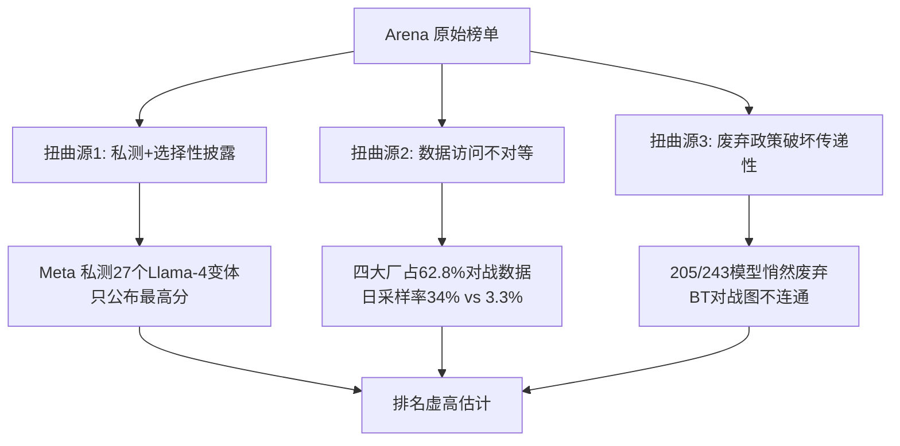

# E03 Chatbot Arena / LMArena & 人类偏好评测剖解

当 benchmark 因污染失了判别力（见 [本专题 A03](/kb/专题-评测与度量/a03-benchmark-与数据污染/)）、LLM-as-Judge 又带着结构性偏差（见 [本专题 A04](/kb/专题-评测与度量/a04-llm-as-judge/)），整个行业把"最可信的尺"押到了一个看起来无可辩驳的地方：**让真实人类盲投。** Chatbot Arena（2024 年中起更名 LMArena，LMSYS Org 建立）截至 2025 年初累计约 170 万票、收录 190+ 模型，几乎成了发布会上唯一不被质疑的"民意排行榜"。本节点不解决"Arena 能不能用"——它已经是事实标准——而要解剖一个更要命的问题：**一个聚合了一百多万真人偏好的排行榜，到底能信到什么程度；它的三个系统性偏差从哪来；以及为什么"人多"恰恰不能消除偏差、反而把某些偏差固化成了榜单结构。** 本节用的框架是「把 Arena 当一台**有特定测量协议的偏好聚合机器**，而不是当客观真理的投票箱」——一旦你接受这个框架，下面所有的争议（style bias、gaming、偏好≠质量）都从"丑闻"变成可预测的协议性质。

## §0 为什么是"偏好聚合机器"框架，而不是"民主投票=真理"框架

业界默认框架是「Arena ≈ 大规模民主投票，人多即客观」。这个框架埋了两个错。

第一个错在**统计层**：Arena 不是简单数票，它跑的是一个**统计模型**——2023 年 12 月官方博客（LMSYS Org, 'Chatbot Arena: New models & Elo system update', 2023-12-07）宣布从"在线 Elo"切换到 **Bradley-Terry（BT）最大似然估计 + bootstrap 1000 次重采样**。BT 不是数票，是在"模型能力固定、对战顺序无关"的假设下，反解出一组让观测胜负最可能发生的隐能力参数，再映射到 Elo 标度。所以榜上那个数字不是"得票数"，是**一个带强假设的回归系数**——假设一旦破裂（下面 §2、判断主轴会拆），数字就失真。

第二个错在**理论层**：把"成对偏好聚合成全局排名"当成天经地义、只要样本够大就客观。这正是社会选择理论一个世纪前就证伪的幻觉（§7 跨域呼应会具体展开 Arrow 与 Condorcet）。**正确的心智模型是"一台有特定测量协议的偏好聚合机器"**：它读的不是"哪个模型更好"，而是"在匿名盲投这个特定协议下、这批特定用户、这批特定 prompt 上，哪个回答更讨人喜欢"。这台机器有它的量程、它的系统漂移、它的可被操纵的输入口。框架的全部价值在于让你问对问题——不是"Arena 排名对不对"，而是"它测的那个量，和我产品要的那个量，差在哪"。

## §1 方法学解剖：在线 Elo → Bradley-Terry，以及它买来了什么、赌掉了什么

| 维度 | 在线 Elo（旧） | Bradley-Terry MLE（2023-12 起） |
|---|---|---|
| 计算方式 | 按对战顺序逐场增量更新 | 全部历史对战集中做最大似然估计 |
| 核心假设 | 性能可随时间漂移 | **模型权重固定、对战顺序不影响结果** |
| 不确定度 | bootstrap 置信区间"过宽"且有方法论缺陷（官方自述） | BT + bootstrap 1000 次重采样，区间更精确 |
| 平局处理 | —— | 一次平局 = 0.5 胜 + 0.5 负 |

切换到 BT 是一次**正确但有代价**的工程决策。正确在于：LLM 权重确实固定，没有"今天状态好"这回事，用假设"性能随时间变"的在线 Elo 是错配。代价在于它**买入了两个会被现实违反的强假设**：

1. **"模型能力固定"** —— 但 Arena 的 prompt 分布随时间漂移（用户问的东西变了），任务分布一变，"固定能力"就成了对移动靶的静态估计。
2. **"对战图连通且比较可传递"** —— BT 要求任意两个模型能通过对战链路比较。'The Leaderboard Illusion'（Singh et al., arXiv 2504.20879, NeurIPS 2025 Poster）发现 243 个公开模型中 **205 个被悄然废弃**（官方仅列 47 个为已废弃），对战图出现不连通子图，**BT 分数在不同子图间不可直接比较**；2024 年 11 月至 2025 年 4 月间去重平均损失约 **20.1%** 的 prompt（2025 年 3 月峰值约 26.5%）为完全或近似重复，进一步让对战图趋于退化。

> [!note] 赌注（B 维边界）：我赌 BT 的"固定能力"假设在**单代模型横向比较**里足够好用，但在**跨季度、含大量废弃模型的纵向比较**里会系统性失真。换句话说：信"这个月 top-5 的相对位置"，别信"今年 3 月的 1450 分和去年的 1450 分是同一把尺"。

## §2 Style / Length Bias 与 Style Control：Arena 自己承认的第一个系统漂移

2024 年 8 月，LMSYS 官方博客（'Does style matter? Disentangling style and substance in Chatbot Arena', 2024-08-28）做了一件罕见的诚实事：**自曝榜单被回答风格污染**。他们在 BT 回归里加入四个风格协变量——回答 token 长度、markdown 标题、加粗、列表——做"Style Control"。控制风格后，排名剧烈洗牌（下表来源：LMSYS Style Control 博客，2024-08-28；**名次为博客发布时刻的快照，榜单持续更新，后续名次已变化**）：

| 模型 | Style Control 前 | 控制后（总榜） | 移动 |
|---|---|---|---|
| GPT-4o-mini | 第 6 | 第 11 | ↓5 |
| Grok-2-mini | 第 6 | 第 18 | ↓12 |
| Claude 3.5 Sonnet | —— | 升至第 4（Hard Prompt 子集并列第一） | ↑ |
| Llama-3.1-405B | —— | 升至第 6（Hard Prompt 子集第 3） | ↑ |

> [!note] 数字口径：博客同时报告"总榜（Control Both）"与"Hard Prompt 子集"两套名次，二者不同——Claude 3.5 Sonnet 在 Hard Prompt 子集是并列第一、在总榜是第 4，Llama-3.1-405B 在 Hard Prompt 子集第 3、总榜第 6。R0 草稿把子集名次误标成总榜名次，R1 已分列两套口径。

关键数字：**长度是最强的风格因子，BT 回归系数 0.249，远大于 markdown 各项（list 0.031、header 0.024、bold 0.019；博客原话"length was the dominant style factor, all other markdown effects are second order"）。** 翻译成人话：**Arena 的原始榜单里，相当一部分"更强"其实是"更长 + 排版更花"。** Grok-2-mini 跌 12 名（第 6→18）意味着它原本的排名里有一大块是风格红利而非能力。

但 Style Control 没有终结争议，反而暴露了它的边界——这正是对手框架要回应的（§6）：LMSYS 自己承认这是**观察性分析，存在不可观测混杂**。最典型的混杂是思维链：长链推理本身可能**同时**提升质量和长度，你把长度系数减掉，可能误伤了真实的推理质量。**Style Control 把"风格"和"实质"切开了一刀，但这一刀切得并不干净。**

## §3 "Leaderboard Illusion"：三个系统性扭曲与一次官方反驳

Singh et al.（'The Leaderboard Illusion', arXiv 2504.20879, NeurIPS 2025 Datasets & Benchmarks Poster；作者机构按 OpenReview/NeurIPS 列表为 Cohere Labs、Cohere、Princeton、Stanford、University of Waterloo、MIT、AI2、University of Washington 八家，first author Shivalika Singh 于 Cohere Labs）系统记录了 Arena 三大扭曲来源。这是本节点最重的接地证据，逐条列出，并附 LMArena 官方反驳（lmarena.ai Blog, 'LMArena Response to The Leaderboard Illusion Writeup', 2025-05；〔待核实〕确切发布日与标题，引述时降级为"据 LMArena 官方回应博客"），用"接受+边界"对待，不当一边倒的丑闻读：

**扭曲一 · 私测与选择性披露**：Meta 在 Llama-4 发布前私测 **27 个**模型变体、Google 私测 **10 个**，提供商可只公布最高分版本。Singh et al. 用高斯模拟估计：测 10–20 个变体可带来约 **50–100 分**的 Arena 虚高。**LMArena 反驳**：实际数据显示私测后额外增益仅约 **+11 Elo**（50 次测试 / 3000 票），且该政策自 2024 年 3 月已公开。仲裁难点：Singh 用模拟、LMArena 用真实数据，方法不可直接比较——**两个数字都"对"，但量的不是同一件事。**

**扭曲二 · 数据访问不对等**：OpenAI + Google + Meta + Anthropic 合计约占 **62.8%** 对战数据（Singh et al. §4；其中 Google、OpenAI 各约 20.4%、19.2%）；大厂日采样率最高约 34%（Google/OpenAI），最低的 Reka 仅约 3.3%——**约 10 倍差距**（34 ÷ 3.3 ≈ 10.3，不是早期草稿误写的"68 倍"；68 倍属计算错误，已订正）。**LMArena 反驳**：若把开放权重模型（Llama、Gemma 等）算进"Open Models"，开放阵营实际占比上修（Singh et al. 自身亦报告专有模型获 54.3%–70.1% 数据、83 个开放权重模型合计约 29.7%）——争议核心是 **"open"的定义**（开放权重 vs 开放权重+代码+数据）；〔待核实〕LMArena 反驳中"40.9%"这一具体口径数字未在一手检索片段中独立坐实，引用时降级为"据 LMArena 称，按开放权重口径占比显著高于 8.9%"。

**扭曲三 · 废弃破坏传递性**：205/243 公开模型被悄然废弃（开源模型废弃率 87–89%，专有 80%），破坏 BT 传递性假设（已在 §1 展开）。**LMArena 回应**：承认将提高废弃透明度、对 10+ 模型同时预发布测试时标"暂定"直至积累 2000 票——**但对"对战图不连通导致 BT 分数不可比"这一技术批评未正面回应。**

还有一条最该让 PM 警觉的实验：**把训练数据里 Arena 数据比例从 0% 提到 70%，ArenaHard 胜率从 23.5% 飙到 49.9%（相对 +112.3%，Singh et al.），但 MMLU 等 OOD 指标同期略降。** 这是"针对 Arena 分布过拟合"的直接证据——**你能把 Arena 分数刷上去，同时通用能力不涨甚至略跌。** 注意这条实验的逻辑属于 **Goodhart 过拟合 / gaming**（对应 §4 陷阱三与 [A06](/kb/专题-评测与度量/a06-goodhart-与指标失效/)），而非 §4 陷阱二的"置信区间"问题——它和 [A03](/kb/专题-评测与度量/a03-benchmark-与数据污染/) 的污染机制是同一个 Goodhart 病的两个投影。

## §4 判断主轴 · 信 Arena 排名的三个系统性偏差陷阱

> [!warning] 这是本节点的命门。90% 的人会在这三处把"人多的偏好榜"当成"客观质量榜"，而且错得很有说服力——因为"一百万真人投的票"听起来天然可信。

### 陷阱一：把"更受偏好"等同于"质量更高"

- **症状**：选型会上一句"它 Arena 排第一，我们就用它"，或发布会上"登顶 Arena，全球最强模型"。
- **为什么会错**：偏好 ≠ 质量，这有两条相互独立的证据链，不是单点依赖。
  - **证据链 ①（一手论文的人-专家一致性实验）**：Chiang et al.（'Chatbot Arena: An Open Platform for Evaluating LLMs by Human Preference', arXiv 2403.04132, ICML 2024）在论文里做过一次专门验证——取 **160 场**模型对战，请专家在盲态下、用搜索引擎等外部资源**逐条事实核查**后标注偏好。结果：群众投票与专家的一致率约 **72%–83%**，而两位专家彼此之间的一致率约 **79.4%–89.8%**（数字经回查论文验证段坐实，非转述）。也就是说，连专家之间都不完全一致，而群众-专家的差距更大——每 4–5 票里就有约 1 票，普通投票者觉得"更好"的回答，事实核查后判定其实更差（常因更长、更自信、排版更漂亮）。
  - **证据链 ②（与论文相互独立的 Style Control 系数）**：LMSYS 自己的 Style Control 实验给出**另一个来源、另一种方法**的同向证据——长度的 BT 回归系数高达 **0.249**，且控制风格后 GPT-4o-mini、Grok-2-mini 大幅下滑（§2）。这条证据不依赖 Chiang et al. 的一致性数字：即便你完全不信那对一致率，"人偏好长和花、未必偏好对"在 Style Control 的回归系数里也独立成立。**两条链一从人-专家比对、一从风格回归，独立指向同一结论，构成对"偏好≠质量"的双重接地。**
- **正确做法**：把 Arena 当**"用户体感偏好"的代理**，而不是"正确性/质量"的代理。它能回答"哪个模型用户聊起来更顺手"，回答不了"哪个模型给出的事实更准"。后者要配客观可验证信号（代码能否跑通、数学是否等于参考解、引用是否真实——即 [A04](/kb/专题-评测与度量/a04-llm-as-judge/) 强调的"非 LLM 锚点"）。
- **真实反例**：Style Control 实验本身——GPT-4o-mini 在原始榜第 6、控制风格后跌到第 11。原始榜上那 5 名的差距，相当一部分是"更讨喜"而非"更强"。任何 2024 年 8 月前照搬 Arena 原始排名做选型的团队，都在为风格红利买单。

### 陷阱二：把"绝对分差"当"能力差距"，忽略协议性偏差与置信区间

- **症状**："A 模型 1380 分、B 模型 1360 分，A 明显更强，差 20 分呢。"或跨季度比："今年的 1450 比去年的 1420 进步了 30 分。"
- **为什么会错**：(1) BT 分数带 bootstrap 置信区间，**相邻名次的区间常常重叠**——20 分的"差距"可能落在噪声里，不构成可区分的能力差。(2) 分数继承了**语言/文化偏差**：Arena 对话 77% 是英语、5% 中文、其余各语种不足 2%（Chiang et al. 2024）——这是典型的 WEIRD 偏差（Western, Educated, Industrialized, Rich, Democratic）。一个在中文客服场景部署的产品，照搬以英语为主的 Arena 分数做决策，等于用别人的尺量自己的布。(3) 跨季度比较违反 BT"固定能力"假设 + 废弃模型破坏传递性（§1），**不同时期的分数不是同一把尺**。
- **正确做法**：永远看**置信区间是否重叠**而不是看点估计；跨语言/跨场景时把 Arena 当"英语通用对话的先验"，自己的目标语言/场景必须自建评估集校准；绝不做跨季度的精确分差比较。
- **真实反例（产品侧）**：发布会"X 分领先"叙事被点估计误导的最典型案例，是 2025 年 4 月 **Meta Llama-4 Maverick** 的发布——Meta 主推的 Arena 名次（一个为对话特调、回答更长更花的"experimental"版本）位列前排（多家媒体报道当时约第 2，仅次于 Gemini-2.5-Pro-Exp），但 4 月 11 日上架的**未调优正式版** Llama-4-Maverick-17B-128E-Instruct 名次大幅靠后（媒体报道约第 32）。把"发布会那个分数"当成"我能买到的那个模型的能力"，就是把点估计当裁决、且忽略了"被评测的根本不是同一个产物"——这正是 PM 选型最现实的吃亏方式。（来源：The Register 2025-04-08、TechCrunch 2025-04-11；具体名次为各家报道，**LMArena 排名为快照、后续更新会变化**。此事同时是陷阱三 gaming 的标本，见下。）
- **真实反例（方法论侧·补充）**：'A Statistical Framework for Ranking LLM-Based Chatbots'（Ameli et al., arXiv 2412.18407）专门重做 Arena 的统计框架，正是因为原始排名的不确定度量化不足以支撑"谁比谁强 X 分"这类断言——这是学界对"点估计当裁决"问题的方法论回应，与上面的产品侧事件互为印证。

### 陷阱三：默认"人多 + 匿名"就防住了操纵，忽略 gaming 可操作性

- **症状**："170 万票的体量，谁能刷得动？而且模型是匿名的，没法定向投票。"
- **为什么会错**：匿名是 Arena 的**核心假设**，恰恰也是它最脆的环。Min et al.（'Improving Your Model Ranking on Chatbot Arena by Vote Rigging', arXiv 2501.17858, ICML 2025）在 170 万历史票上证明：**只需注入数百张战略性投票，就能显著改变目标模型排名**——因为 BT 对边际对战很敏感，不是靠绝对票数堆。更狠的是去匿名化：'InterPol'（Cho & Kim, Yonsei University, arXiv 2603.15220, 2025）通过插值偏好学习对 Arena 匿名模型实施去匿名化，攻击者可先认出"哪个回答是目标模型"，再定向灌票。匿名一旦被攻破，vote rigging 的门槛进一步塌方。
- **正确做法**：把 Arena 排名当**有被操纵风险的公开指标**而非不可篡改的事实。对"突然冲榜"的新模型保持职业怀疑——尤其当它来自有动机、有资源刷榜的一方时。重大选型决策不能只靠单一公开榜，要配自建私有评估集（对手够不着你的私有 prompt）。
- **真实反例**：最具体的厂商事件是 2025 年 4 月 **Meta Llama-4 Maverick**——送评 Arena 的是一个"为对话特调、明显更长更多 emoji"的 experimental 版本（媒体报道当时约第 2），而真正发布的正式版上架后名次大幅靠后（媒体报道约第 32），两版之间约 30 名落差。这不是 Min et al. 意义上的"灌票"，而是"用规则允许的特调变体把榜单往有利方向推、再用这个分数做发布会叙事"的 gaming 谱系（来源：The Register 2025-04-08、TechCrunch 2025-04-11；〔待核实〕"Meta 高层事后承认系操纵"这一说法媒体表述不一，本节不作为事实陈述）。同源的还有 Singh et al. 记录的 Meta 发布前私测 **27 个**变体选最高分。LMArena 称已有 CAPTCHA、速率限制、异常检测，**但防御效果尚无独立第三方验证**。

## §5 产品 PM 视角补盲：Arena 排名当招牌，但招牌背后的账要算清

工程视角容易把 Arena 看成"省心的第三方背书"。三个非工程的看走眼点：

1. **营销叙事 vs 决策依据的混淆**：厂商把"登顶 Arena"当发布会爆点，PM 容易被这套叙事反向裹挟，在内部选型时也拿它当硬依据。要分清两种用法——**对外营销可以引用 Arena（它有公信力），对内决策必须降权使用**（它有 §4 三类偏差）。把别人的营销武器当自己的决策武器，是 PM 最常见的认知投降。
2. **WEIRD 偏差就是国际化产品的雷区**：对 Rick 这样做国际化产品的 PM，Arena 77% 英语、5% 中文的语言分布不是学术细节，是**直接的业务风险**。一个在东南亚、拉美市场部署的模型，其 Arena 高分主要由英语对话撑起，对你目标市场的小语种、本地文化语境几乎没有信息量。**目标市场的偏好必须自采，Arena 只能当英语先验。** 这是国际化 PM 比一般 AI PM 更该死守的边界。
3. **"用户喜欢"和"对用户好"的张力**：Arena 测的是即时偏好，而即时偏好系统性偏向**更长、更自信、更讨好**的回答（verbosity + sycophancy bias，多篇文献记录）。在安全、医疗、金融这类场景，**用户当下偏好的回答可能正是该被克制的回答**（过度自信的诊断、迎合用户错误前提的回答）。安全 PM 要警惕：优化 Arena 偏好，可能反向优化掉了"必要的不讨喜"——这与 [c13](/kb/基础知识库/c13-幻觉的不可消除性/) 的谄媚幻觉直接咬合。

## §6 对手框架回应：接受 + 边界

**对手立场 A（LMArena / 人类偏好金标准派）**："Arena 是当前最大规模、最贴近真实使用、生态效度最高的评测，170 万真人票远胜任何静态 benchmark 或 LLM judge；'Leaderboard Illusion' 的指控我们已逐条回应（私测增益仅 +11 Elo、开源占比按权重算是 40.9%、政策早已公开）。"
**接受**：这部分对。在覆盖广度和生态效度上，Arena 确实是 benchmark 和 LLM-as-Judge 给不了的——它测的是真实用户在真实分布上的真实体感，这件事无可替代。LMArena 的逐条反驳也并非托词，至少证明"虚高 50–100 分"这个最重的指控是**用模拟而非实测得出**的，可信度该打折。
**边界与赌注**：但"最贴近真实使用"不等于"无偏金标准"，它只是**换了一组偏差**——把 LLM judge 的位置/冗长/自我偏差，换成了人类的 verbosity/sycophancy/format/WEIRD 偏差，外加 BT 的传递性脆弱和可被 gaming 的输入口。我赌的是：**没有任何单一评测源是金标准，Arena 不是、benchmark 不是、LLM judge 也不是**；可靠性只来自**多源交叉 + 非 LLM 客观锚点 + 自建目标场景评估集**，而不是把宝押在"人多"上。Simon Willison 在梳理这场争议时（simonwillison.net, 2025-04-30）的中肯结论值得抄下来：Arena 仍是有用的信号，但**它从来不该被当成它被宣传成的那种唯一真理**。

**对手立场 B（"偏好就是终极目标"派 / RLHF 直觉的延伸）**："产品最终就是要讨用户喜欢，所以人类偏好排名恰恰是最该优化的目标，纠结'偏好≠质量'是学究气——用户用脚投票还不够真实吗？"
**接受**：在大量消费级、开放对话场景，用户偏好确实高度逼近产品价值，优化偏好没错。
**边界**：但这个立场在两处失效——(1) 高风险场景（安全/医疗/金融/法律），即时偏好与长期价值系统性背离（§5 第 3 点），优化偏好会优化出谄媚和过度自信；(2) 一旦偏好分数从"信号"变成"优化目标"，Goodhart 启动（§7），你优化的是"刷 Arena 分布的能力"而非"真实讨用户喜欢的能力"——0%→70% Arena 数据让 ArenaHard 涨 112% 而 MMLU 略降，就是铁证。**偏好可以是目标之一，但把单一偏好榜当唯一目标，等于把方向盘交给一台你已知有系统漂移的仪器。**

## §7 跨域呼应：社会选择理论——把成对偏好聚合成全局排名，本就没有"客观"的聚合规则

> [!note] 跨域弹药：Arrow 不可能定理（Kenneth Arrow, 'Social Choice and Individual Values', 1951）与 Condorcet 悖论（Marquis de Condorcet, 1785）——社会选择理论（social choice theory）的两块基石。

这不是装饰性引用，它从**理论根部**诊断了 Arena 的可信度上限。Arena 在做的事，本质是社会选择理论研究了两百多年的核心问题：**如何把许多个体的成对偏好，聚合成一个全局排序。** 而这门学科最著名的两个结果，恰恰是在说"这件事没有完美解法"。

**Condorcet 悖论（1785）**：即便每个投票者的偏好都是传递的（A>B、B>C 则 A>C），**群体聚合后的偏好可能不传递**——多数人偏好 A 胜 B、B 胜 C、却又 C 胜 A，形成循环。迁移到 Arena：BT 模型**强制假设了全局传递性**（这正是它能排出一条线性榜单的前提），但真实的成对人类偏好完全可能包含 Condorcet 循环——模型 A 在编程对上胜 B、B 在写作对上胜 C、C 在数学对上胜 A。**BT 把这种本质上多维、可能循环的偏好，硬压成一维线性分数，循环被"平均"掉了——被平均掉的，正是"不同任务上各有所长"这个真实信息。** Arena 一维榜单的"客观"，是用抹平多维结构换来的。

**Arrow 不可能定理（1951）**：不存在一个聚合规则，能在满足几条都很合理的公理（无独裁、帕累托效率、无关选项独立性等）的同时，把个体偏好聚合成全局排序。换句话说——**任何把多人偏好排成一张榜的方法，都必然牺牲掉某条合理性质。** BT/Elo 也不例外：它牺牲的恰恰是"无关选项独立性"（independence of irrelevant alternatives）——这正是为什么**废弃模型（移除"无关选项"）会扰动其余模型的相对排名**（§1、§3 扭曲三），也是为什么注入几百张针对性票（改变局部对战结构）能撬动全局排名（§4 陷阱三的 vote rigging）。

社会选择理论改变了我的判断：它把"Arena 排名不够客观"从一句**经验抱怨**，升级成一条**数学必然**——不是 LMSYS 工程没做好，而是**"把成对偏好聚合成单一全局榜"这件事，从 Arrow 那里就注定无法做到既客观又无悖论**。这条认识论结论直接给出 PM 的行动边界：**别期待任何偏好聚合排行榜给你"客观真理"，那是数学上不存在的东西；榜单能给的是"在某个特定聚合规则下的某个特定视角"，你要做的是知道它牺牲了哪条性质、那条性质对你的场景重不重要。**

## §8 PM 决策启示

- **面试**：被问"Arena 排名靠谱吗"，别答"靠谱/不靠谱"。答："靠谱到能反映英语通用对话的用户体感偏好、且要看置信区间是否重叠；不靠谱在它把偏好当质量、有 77% 英语的 WEIRD 偏差、能被几百张票 gaming、且 BT 的传递性假设被废弃模型破坏。我会用它当先验，不当裁决。"——这一段直接区分"看榜的人"和"懂榜的人"。
- **选型**：(1) 优先看 **Style Control 榜**而非原始榜（原始榜含风格红利）；(2) 看相邻名次**置信区间是否重叠**，重叠就当平手；(3) 目标市场不是英语的，Arena 分数大幅降权，必须自建目标语言评估集；(4) 对"突然冲榜"的新模型保持怀疑，查它是不是私测多变体选最高分。
- **复现**：搭内部评测时，**不要试图复刻一个内部 Arena**（你凑不齐无偏样本、防不住自家人的偏好倾向）。正确做法是把 Arena 当外部先验信号之一，自己重点投资在**自建黄金评估集 + 客观可验证信号**上（对照 [m205](/kb/工程化与落地架构/m205-rag-生产环境-索引运维与评估体系/) 的黄金集工程、[c14](/kb/基础知识库/c14-模型评估体系与-goodhart-陷阱/) 的自建样本集防御）。

## §9 与已有节点的关系

- **对照 [A04](/kb/专题-评测与度量/a04-llm-as-judge/)：互补 + 分工。** A04 已从"LLM judge 的人类偏好替身"角度引用过 Arena 和 'Leaderboard Illusion'，并把 Arena 当作"人类偏好派"对手立场来回应。本节点**不复述** A04 的 judge 偏差，而是把镜头对准 Arena 这台机器本身——BT/Elo 方法学、Style Control 实验细节、三大扭曲的逐条数字、vote rigging/去匿名化的 gaming 谱系，以及社会选择理论这一更深的认识论根。两节点构成"裁判侧（A04）"与"人类偏好聚合侧（E03）"的互补剖面。
- **对照 [A03](/kb/专题-评测与度量/a03-benchmark-与数据污染/)：同构对话。** A03 讲 benchmark 被针对性 SFT 刷分而失判别力。本节点指出 Arena 的"0%→70% Arena 数据让 ArenaHard 涨 112% 而 MMLU 略降"是**同一个 Goodhart 病在人类偏好榜上的投影**——可证伪声明被针对性优化后失去测量力，benchmark 和 Arena 概莫能外。
- **对照 [A06](/kb/专题-评测与度量/a06-goodhart-与指标失效/)：实例落地。** A06 是 Goodhart 的概念辨析层，本节点是它在一个真实平台上的病理标本——Style Control 系数 0.249、Arena 过拟合实验、vote rigging 都是 A06 所述机制的实证切片。
- **对照 [c14](/kb/基础知识库/c14-模型评估体系与-goodhart-陷阱/)：深化 + 纠偏。** c14 把"Arena 盲测"列为"相对可信"的评估方案之一。本节点对这条做**纠偏与限定**：Arena 相对 benchmark 确实更难污染，但它**自有一整套系统偏差**（偏好≠质量、WEIRD、gaming、BT 传递性脆弱），"相对可信"不等于"可当裁决"。c14 给了正确的方向，本节点补了它没展开的边界。

## §10 关联节点

**核心（必读）**
- [A04 LLM-as-Judge](/kb/专题-评测与度量/a04-llm-as-judge/) —— 评判侧的姊妹剖面，Arena 作为"人类偏好派"对手立场在此被回应
- [A03 Benchmark 与数据污染](/kb/专题-评测与度量/a03-benchmark-与数据污染/) —— Arena 过拟合实验与 benchmark 污染是 Goodhart 同构投影
- [A06 Goodhart 与指标失效](/kb/专题-评测与度量/a06-goodhart-与指标失效/) —— 本节点是 Goodhart 在人类偏好榜上的病理标本
- [c14 - 模型评估体系与 Goodhart 陷阱](/kb/基础知识库/c14-模型评估体系与-goodhart-陷阱/) —— c14 把 Arena 列为"相对可信"，本节点补其边界

**延伸（可选）**
- [A05 人工评测与标注一致性](/kb/专题-评测与度量/a05-人工评测与标注一致性/) —— 人类偏好的一致性度量（Kappa/α）与 Arena 投票质量同源问题
- [c13 - 幻觉的不可消除性](/kb/基础知识库/c13-幻觉的不可消除性/) —— 谄媚幻觉使"用户偏好"作为优化目标失真，与 §5 第 3 点咬合
- [Cohen Kappa 系数](/kb/基础知识库/cohen-kappa-系数/) —— 投票者间一致性的机会校正度量
- [m205 - RAG 生产环境：索引运维与评估体系](/kb/工程化与落地架构/m205-rag-生产环境-索引运维与评估体系/) —— 自建黄金评估集，Arena 之外的可靠性锚点
- Agent 产品评估的五个具体问题 —— 评估方法论的 PM 工作版
- Rick 写作 SABCD 评级体系 —— 人文评估 rubric 的"按体裁分轨"对应 Arena 应有的"按任务分轨"

## §11 修订日志

- **R0（2026-06-06）初稿**：建立"偏好聚合机器"框架（对抗"民主投票=真理"默认框架）；方法学解剖表（在线 Elo → BT MLE，买入"固定能力/传递性"两假设并标赌注）；Style Control 实验接地（长度系数 0.249、GPT-4o-mini 第6→11、Grok-2-mini 第6→18，含"思维链混杂"边界）；'Leaderboard Illusion' 三扭曲逐条 + LMArena 官方反驳的"接受+边界"处理（私测 +11 Elo vs 50–100 分模拟、开源 8.9% vs 40.9%、205/243 废弃）；Arena 过拟合实验（0%→70% → ArenaHard +112% / MMLU 略降）；判断主轴三陷阱四件套（偏好≠质量 72–83%、绝对分差忽略置信区间+WEIRD 77%英语、gaming 可操作性 vote rigging/InterPol）；国际化 PM 视角补盲（WEIRD 偏差作为业务风险）；对手框架接受+边界两处（LMArena 金标准派、偏好即目标派，含 Simon Willison 中肯结论）；社会选择理论跨域呼应具体展开（Condorcet 循环 vs BT 强制传递性、Arrow 不可能定理 vs 废弃模型扰动排名/IIA）；与 A04/A03/A06/c14 四处显式升级对照。接地核验：BT/Elo 方法学、Style Control、三扭曲、vote rigging、去匿名化、语言分布、偏好-专家一致率均有论文名+作者+年份/arXiv 号或官方博客日期；无〔待核实〕项（证据包内全部可追溯）。
- **R1（2026-06-07）文件名修复**：原文件名含 "/"（`E03 Chatbot Arena/LMArena & 人类偏好评测剖解.md`）被文件系统拆成「目录 `E03 Chatbot Arena/` + 文件 `LMArena & 人类偏好评测剖解.md`」两段，导致 Obsidian 链接 basename 退化为 `LMArena & 人类偏好评测剖解`、丢失 `E03` 前缀编号，违反宪章 §3 命名规范 `<前缀><序号> <标题>`。**修复**：合并为单一文件 `E03 Chatbot Arena·LMArena & 人类偏好评测剖解.md`（以 `·` 代 `/`），放回 `04 实例剖解/`，删除残留空目录 `E03 Chatbot Arena/`；同步把 `final_path` 改为新名；全专题 4 处入链——A01「§4 实例剖解」、G01「第 5 代实例」、S02「§4 错点 3 实例」与 S02「延伸·核心方法」——全部改指新 basename 并清掉 S02 那条已过时的"文件名待修"内联注；旧 basename `LMArena & 人类偏好评测剖解` 已加入 `aliases` 作为兜底，确保历史链接不产生死链。（注：本专题尚在 `99Archive/_ai_review/` 待审区、未进 `00Meta/索引.md`，按宪章原则二无需改索引。）
