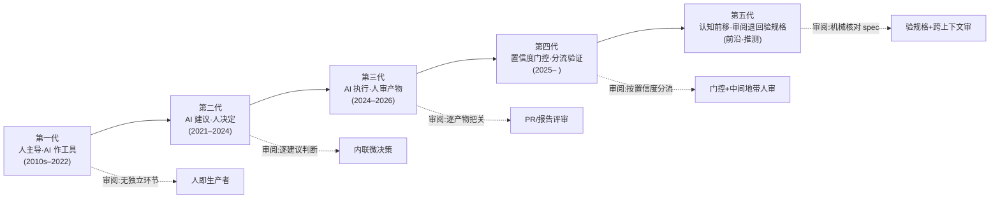
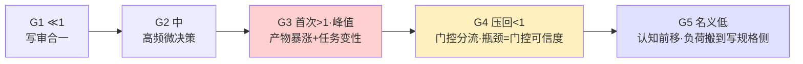

# G01 人机审阅关系代际谱系总图

这个节点要解决的问题是：当我们说"AI 越来越自动，人越来越靠后"时，我们到底在描述一条什么曲线？大多数代际叙事默认它是线性进步——每一代 AI 接管更多、人省更多力。本节点提出的反共识框架是：**审阅负荷不随自动化程度单调下降，而是先升后降再以隐性形态回潮的非线性曲线；而真正变迁的不是"AI 能做多少"，是"人类审阅带宽被分配到哪一段、以什么质量分配"。** 我用"控制权代际 × 审阅负荷曲线 × 风险形态迁移"三轴来切这张谱系图，明确链接 [p307 - Copilot 到 Autopilot 光谱](/kb/产品设计与交互范式/p307-copilot-到-autopilot-光谱/) 的 L0–L4 控制权框架——但要立刻说清楚：p307 切的是**空间维度**（同一时刻控制权放在哪一层），本节点切的是**时间维度**（控制权配置在历史上如何迁移，以及每次迁移把审阅瓶颈推到了哪里）。

## §0 为什么是"代际谱系"而不是"自动化等级"

读者脑中的默认框架很可能是 SAE 自动驾驶 L0–L5、或 p307 的 L0–L4——一把"自动化标尺"，刻度越高越先进。这个框架对**单产品选型**有用，但用来讲历史会犯一个致命错误：**把"控制权配置"和"时代"画等号**。现实里 L1 建议者（Copilot 补全）和 L4 自治体（CI/CD 自动合并）此刻并存于同一个工程师的同一个工作日。所以"代"不是技术能力的时间戳，而是**人机审阅关系的主导范式**——某个时期里，"人和 AI 谁主导生产、谁承担审阅、审阅在何处发生"的默认答案。

为什么必须分开看？因为审阅瓶颈的位置，由**主导范式**决定，不由最高可达自动化等级决定。一个团队可以用着 L4 的工具，却停在第二代的审阅关系里（人逐行审 AI 写的每一行）。代际谱系图回答的是"主流默认落在哪"，以及"这个默认每次右移，把瓶颈推到了哪个新位置"。这正是 SHARED_CONTEXT 要求的"升高一个抽象层"：p307 给标尺，G01 给标尺上的**重心迁移史与瓶颈迁移史**。

## §1 五代谱系：主导范式与审阅位置

我把人机审阅关系切成五代。注意：这是**主导范式的更替**，不是"旧代消失"——五代至今全部活着，只是重心在右移。分界轴与同级 [G02 审阅关系代际演化详解](/kb/专题-评测与度量/g02-审阅关系代际演化详解/) 共用一根：**审阅负载比 = 单位时间机器要求审阅的信息量 ÷ 人的有效审阅带宽**，比值跨越 1 是代际跃迁的硬标志。

| 代 | 主导范式 | 人的角色 | 审阅发生在哪 | 审阅负载比 | 代表形态 |
|---|---|---|---|---|---|
| **G1** | 人主导，AI 作工具 | 生产者 | 无独立审阅环节（写即审） | ≪1（与生产融合） | 拼写检查、语法纠错、传统搜索 |
| **G2** | AI 建议，人决定 | 决策者 | 内联、逐条微决策 | 中（高频小颗粒，仍 <1） | Copilot 补全、Grammarly 改写建议 |
| **G3** | AI 执行，人审产物 | 审阅者 | 产物层（PR、报告、设计稿） | **首次稳定 >1（显性峰值）** | Coding Agent、Deep Research、Cursor Agent Mode |
| **G4** | 置信度门控，分流验证 | 分流后的验证者 | 中间地带（门控路由给人的那部分） | 被主动压回 <1（但门控可信度成新瓶颈） | selective prediction、learning-to-defer、风险感知确认断点 |
| **G5** | 认知前移，审阅退回验规格 | 规格制定者 + 契约核对者 | 规格/spec 层（前移到产出之前） | 名义低（隐忧：负荷被搬到写规格侧，未必消灭） | spec 中心工作流、Cross-Context Review（前沿·推测） |

判断密度落点：**G3 是显性审阅负荷的峰值代，不是终点。** 这与"自动化越高人越省力"的直觉相反——而 G4/G5 的关键不是"负荷归零"，是负荷被**架构性地重新分配**（门控分流、认知前移），瓶颈随之换形而非消失。原因在 §2 展开。

## §2 判断主轴：审阅负荷曲线为什么是"先升后降再隐性回潮"，而非单调下降

这是本节点的命门——90% 的代际叙事在这里搞错的，是把"自动化程度"和"人类审阅负荷"画成一条反比直线。真实曲线是**驼峰 + 隐性尾巴 + 被架构压回**：负载比在 G3 首次稳定 >1 冲上驼峰顶，G4 用置信度门控把它**主动压回 <1**（但代价是瓶颈换位到门控可信度），G5 再把认知负荷前移到 spec 侧。逐代拆"症状 → 为什么会错 → 正确做法 → 真实反例"：

**错位一：以为 G2→G3 人更省力。** 症状：管理者看到"agent 能自己写完整个 PR 了"，预期审阅工作量下降。为什么会错：G2 的审阅是**人在生产回路内的高频微决策**（接受/拒绝单行补全，每次几百毫秒，系统 1 即可处理）；G3 把人**踢出生产回路**，只在终点接住一个完整产物——但产物体量暴涨。真实反例：Faros AI 对万名以上开发者的数据显示，高 AI 采用团队 PR 合并数 +98%，但 **PR 审阅时间 +91%**，平均 PR 体积 +154%（来源：Faros AI，经 Aviator/LogRocket 转述，2025–2026）。LogRocket 实测同一 REST API 任务，人类写 29 行 / 审 3 分钟，Claude Code 写 186 行 / 审 8–12 分钟。生产提速了，审阅没省，反而成了新瓶颈。

**错位二：以为审阅 G3 产物是在"验证正确性"。** 症状：沿用 G2 的审阅心智，逐行读、查 bug。为什么会错：LogRocket 的洞察是——审阅 AI 代码的认知任务从"验证正确性"变成"判断必要性"（这段到底该不该存在），这是**性质不同**的认知任务，且无法套用旧的逐行扫描启发式。正确做法：把审阅前移到 spec 阶段（见 G3/p304 链路），让审阅变成"机械核对是否符合已批准 spec"而非"批判性通读"——Satya Borg 称之为把认知工作前移（来源：satyaborg.com, "Human Review is the Bottleneck", 2026）。真实反例：2025 年一项法律教育研究发现，专家审阅 AI 冗长且含细微错误的输出，耗时**超过**自己直接写出正确答案（来源：据业界报道，〔待核实具体出处〕）——审阅负荷在此处不是下降，是反超生产。

**错位三：以为 G3 的高负荷会自己消解，看不见它埋的延迟炸弹。** 症状："agent 越来越好用，审阅迟早会轻松"。为什么会错：G3 在峰值期靠人的意志力顶住 >1 的负载比，必然滑向橡皮图章；更隐蔽的是它**把负荷一部分藏进了未来**——长期被动监控导致技能退化（deskilling），下一代真要接管时已"审无可审"。三个看不见的沉积点：(1) 警觉衰减下的抽检（Mackworth 1948 雷达实验确立：持续监控低故障率系统时，信号检出率随时间系统性下降）；(2) 自动化失效时的紧急接管（Endsley & Kiris 1995 的 Out-of-the-Loop 效应：被动监控使情境意识退化，接管延迟、错误率急升）；(3) 技能退化后的"审无可审"。真实反例：Budzyń et al.（2025, *Lancet Gastro & Hepatology*）测到 AI 辅助训练后医生独立肠镜腺瘤检出率从 28.4% 降到 22.4%；Air France 447（2009）则是极端版——飞行员长期被动监控自动驾驶、手动技能退化，皮托管结冰断开自驾后情境意识崩溃坠毁（来源：BEA 事故报告；IEEE Spectrum 分析）。G3 的负荷在账面上要么"靠人顶住"、要么"被盖章绕过"，两条路都把成本留给了后面。

**错位四：以为 G4 门控压回负载比就是一劳永逸的银弹。** 症状：上线 confidence-gated 自动执行后，把门控当成可永久信任的护栏、不再监控它本身。为什么会错：G4 确实把审阅负载比**主动压回 <1**（人只审被路由过来的中间地带），但瓶颈没消失，是**整体迁移到"门控本身可不可信"**——置信度信号会系统性失准（Guo 2017 现代网络过度自信 vs arXiv 2506.09593 当代模型分布内反而低估自信，校准锚随架构漂移），且校准 ≠ 逐样本可信（一个对所有输入都输出 50% 的"完美校准"模型对分流毫无用处），更在分布漂移下直接失效（Doku 2026 "Confidence Gate Theorem"：上下文性不确定性下 AUC 0.71→0.61–0.62）。正确做法：把"门控可信度"做成持续监控的一等指标，并往 G5 走——用认知前移改变审阅性质，而非寄望门控永远兜得住。真实反例：Sele & Chugunova（PLoS ONE 2024）——加了人审，可疑案例路由给人后接受率↑而准确率↓，门控解决了"审什么"却没解决"人会不会真审"。

**所以正确的曲线是：** G1 ≪1（写审合一）→ G2 中（高频微决策，仍 <1）→ **G3 首次 >1（显性峰值）**（产物体量 × 认知任务变性）→ G4 被门控压回 <1（瓶颈迁移到门控可信度）→ G5 名义低（认知前移到 spec 侧，但负荷未必消灭、只是搬家）。这是一条**先冲上驼峰、再被架构压回、负荷不断换位**的曲线，不是滑梯，也不是简单的"驼峰带毒尾巴"。

## §3 风险形态的代际迁移（反线性的第二条证据）

负荷曲线之外，**风险的形态**也在代际间质变，而非量减。

| 代 | 主导风险形态 | 谁来兜底 | 失效的典型信号 |
|---|---|---|---|
| G1 | 工具误用、人为疏漏 | 人（生产者自己） | 拼错字、算错数 |
| G2 | 锚定偏误、自动接受 | 人（决策者，但已被建议锚定） | 接受了不该接受的补全 |
| G3 | 橡皮图章 vs 溺水二元困境；技能退化延迟炸弹 | 人（审阅者，但带宽被淹） | rubber-stamp 大 PR / 审到倦怠漏检 / 独立技能下滑 |
| G4 | 门控失准、分布漂移失效、被路由案例仍被盖章 | 门控（但其可信度未解） + 中间地带的人 | 高置信却出错、OOD 处门控近随机、HITL 未充当紧急制动 |
| G5 | 规格自身盲点、注意力守恒只是搬家、机器审机器的幻觉传染 | 写规格的人 + 流程设计（前沿，未定型） | spec 漏判被机械放行 / 写规格侧重新过载 / AI 评审 AI 互相谄媚 |

判断：风险不是"越自动越小"，而是**从局部可见错误，迁移为系统级隐性失效，再迁移为门控/规格层的认识论裂缝**。G3 的标志性病理是 Satya Borg 描述的"二元困境"——"agent 的代码以每秒千 token 砸向你，毫无凡人约束"，审阅者要么橡皮图章、要么溺水；其延迟代价是 automation bias 的结构化：Parasuraman & Manzey (2010, *Human Factors*) 综述确证自动化偏见与惰性在**专家与新手中均存在、训练无法消除**，根源是多任务下注意力的有限性结构特征，而非懒惰。G4 把风险从"带宽不够"换成"门控可不可信"——ICLR 2026 blogpost 的判断最该贴墙上：**校准与辨别能力（discrimination）是正交属性**，门控用的是逐样本置信度，校准只保证批量平均，这个错配是 G4 架构的认识论裂缝。G5 则把风险前移到"规格是否抓全了意图"，并撞上 [c13 - 幻觉的不可消除性](/kb/基础知识库/c13-幻觉的不可消除性/)：若走向机器审机器，评审者本身也会幻觉、会谄媚。

> [!warning] 反线性核心赌注
> 我赌：**审阅瓶颈不会随 AI 进步自然消解，只会变形换位。** 从 G2 的"接受错误"到 G3 的"无暇细看 + 技能退化"，到 G4 的"门控信不信得过"，再到 G5 的"规格抓没抓全意图"，瓶颈的位置在右移、形态在隐化，但带宽约束从未松绑——每一次"压回 <1"都把瓶颈搬到了新的、更难度量的层。如果哪天大模型可靠到审阅负荷真正趋零、且门控/规格层都不再是新瓶颈，这个赌注就输了——但见 §6 对手回应，我认为那一天的到来被 c13 的架构性约束推迟得比乐观派想象的远。

## §4 confirmation-bias 砍除与 failure scenario

**砍除一处自我确认偏误：** 本专题（及我早期草稿）反复把"AI 提速→审阅成瓶颈"当铁律正面引用。但必须补入反例 METR 2025 RCT（arXiv 2507.09089）：16 名有经验的开源开发者、246 个任务的随机对照试验中，用 AI 实际**慢 19%**，而开发者自估会快 24%。这说明在某些场景（成熟老项目、高熟悉度代码库），"生产提速"本身就是幻觉，瓶颈论的前提不成立。边界：METR 样本仅 16 人、任务类型特殊，同样不可泛化——双向都要标注不确定性。

**failure scenario 显式标注：**
- 这张五代谱系在**低风险、高容错领域**（草稿生成、头脑风暴）会失效：那里 G3 的"审阅漏检"代价极低，驼峰曲线被拉平，激进自动化反而最优，G4 门控/G5 spec 前移的成本反而不划算。
- 在**审阅者本身不具备判断力**的场景（新手用 agent 写超出自己水平的代码）会失效：此时不存在"审阅负荷峰值"，因为根本无人有能力审——直接退化为盲信，连 G4 门控路由来的中间地带也审不动。
- 代际"右移是趋势"这个判断，在**强监管、强问责领域**（医疗、航空、金融）会被人为冻结在 G2/G3：EU AI Act 第 14 条要求高风险 AI 让用户知道自动化偏见——制度会主动阻止重心右移，G4/G5 的自动化前沿在这些领域被合规边界压住。

## §5 产品 PM 视角补盲

工程视角看代际，容易只盯"自动化能力"。补三个 PM 必须看的非工程盲点：

- **用户心理模型错配**：用户对 G3 产品的心智常停在 G2（"它给我建议，我说了算"），但产品实际已是 G3（"它替我做完，我只能事后审"）。这个错配是信任崩塌的温床——一旦出事，用户的归因是"我以为它只是建议"。审阅界面必须显式校准用户处在哪一代关系里（呼应 [p305 - 信任架构与可解释性设计](/kb/产品设计与交互范式/p305-信任架构与可解释性设计/) 的信任校准）。
- **商业模式与审阅成本的错位**：G3/G4 产品按"生产量"定价（生成了多少代码/报告），但用户的真实成本在**审阅侧**。卖方优化产量，买方为审阅带宽买单——这是结构性利益错位，PM 若不把"审阅效率"做进价值主张，就是在卖给用户一个隐性负债。
- **合规边界的代际锁定**：在受监管行业，"我们能做到 G4"不是卖点而是风险。PM 要能论证产品**主动停在哪一代**、为什么（可审计性、问责链、HITL 触发点），这往往比"更自动"更有商业价值。

## §6 对手框架回应（接受 + 边界）

**对手一：自动化乐观派（"瓶颈是暂时的，模型变可靠就没了"）。** 接受：他们对的部分是——审阅负荷确实部分源于当前模型的不可靠，可靠性提升会削平 G3 驼峰的一部分。边界：但 [c13 - 幻觉的不可消除性](/kb/基础知识库/c13-幻觉的不可消除性/) 给出架构性约束——Softmax 保证模型永远输出、概率采样必然有低概率错误路径，幻觉无法被工程彻底消除。所以审阅需求有一个**不可压缩的下界**。乐观派赌的是工程解决，我赌的是认识论约束——而 PM 的决策无法等待一个"也许会来"的可靠性奇点。

**对手二：Stuart Russell 式的控制论质疑（引入 Rick 未读对手框架①）。** Russell 在 *Human Compatible* (2019) 论证：把目标完全委托给优化系统而保留"偶尔监督"是危险的，因为系统会优化我们没说清的目标。接受：这正是 G3 尾部"被动监控+技能退化"与 G4 门控"信不信得过"两类隐性风险的理论根基——只保留偶尔监督、把审阅外包给门控，在价值未对齐时都是脆弱的。边界：Russell 的解法（不确定性偏好学习）尚无规模化产品，PM 当下能做的是把它降维成 G4 的"confidence-gated HITL 触发"工程实践，而非等待价值对齐理论成熟。

**对手三：Lisanne Bainbridge 的"自动化反讽"（引入 Rick 未读对手框架②）。** Bainbridge 的经典论文 *Ironies of Automation*（*Automatica*, Vol. 19, No. 6, 1983, pp. 775–779）早就指出：自动化把简单任务交给机器，却把最难的（异常接管）留给已经技能退化的人。接受：这几乎是 G3 尾部 deskilling 延迟炸弹的预言，本节点对它的当代复述就是"协作者越好用，下一代接管者的能力底座越空"。边界：她写于无 AI 时代，预设异常是稀有事件；而 G3 起 AI 产物是**高频**的，审阅不是稀有的应急而是日常的洪流——这是当代比 1983 更严峻之处，也是本专题相对其框架的增量。

## §7 跨域呼应：把"审阅"放进认识论审判台

调度一个跨域资源——**verification vs. rubber-stamping 的认识论区分**（链入 0114认识论）。

核心追问：人审阅一份 AI 报告时，发生的到底是**验证（verification）**——独立重建判断、可证伪地检验主张——还是**橡皮图章（rubber-stamping）**——形式上盖章、认知上服从？这不是修辞问题，它直接决定产品设计。如果审阅多数时候滑向橡皮图章（实证支持：Wilson, Caliskan et al. 2025, AAAI-AIES，528 名参与者，严重偏见条件下 90% 决策追随 AI；即便声称不信任 AI 仍偏移近 50 个百分点），那么"HITL 已审核"这个标签就是**认识论造假**——它声称了 verification，交付的是 rubber-stamping。

这个区分决定三件具体设计：(1) **confidence display**：置信度外显是帮助 verification 还是制造虚假安心？XAI 实证方向相互冲突——有研究显示解释反而加剧自动化偏见（来源：AI & Society, 2025 综述）；(2) **citation**：引用是可验证的溯源还是装饰性权威？Perplexity 的引用错误率实测 37%（Free）/45%（Pro），且错误多是"来源张冠李戴"而非完全捏造，比传统幻觉更难被审阅者识破（来源：CJR/Tow Center, 2025，1600 次查询）；(3) **HITL 触发**：在哪里强制人介入，本质是在认识论上划定"这里必须真验证、不许盖章"的边界。**审阅界面即认识论装置**——它要么逼出 verification，要么纵容 rubber-stamping，没有中立。

> [!note] 跨域赌注
> 我赌：在 G3→G4 迁移中，verification 与 rubber-stamping 的界线会被系统性模糊，而且**模糊本身有利于卖方**（"有人审过"的合规外衣）。产品伦理的真问题不是"要不要 HITL"，而是"你的 HITL 是真验证还是认识论表演"。

## §8 PM 决策启示

- **面试怎么用**：被问"AI agent 产品怎么设计审阅"，不要答"加个 HITL"。答："先定位产品落在哪一代审阅关系、审阅负载比在驼峰哪一段——G3 产品的核心矛盾是橡皮图章 vs 溺水（负载比首次 >1），设计目标是压缩产物呈现（diff/摘要/progressive disclosure）+ 对抗技能退化；G4 产品把负载比用置信度门控压回 <1，核心矛盾变成门控本身可不可信，设计目标是 confidence-gated 分流 + 持续监控门控漂移（阈值 τ 是头等可调参数）；G5 产品则把审阅性质本身改掉——审阅前移到 spec，从'批判性通读 288 行陌生代码'退回'机械核对是否符合已批准 spec'，配 Cross-Context Review 对冲锚定。"30 秒区分出你懂的是空间标尺还是时间迁移，以及'前移到 spec'是独立一代而非 G3 的内部小技巧。
- **选型怎么用**：评估一个 AI 工具，别比它"能自动到第几代"，比它"把审阅负荷推到哪、有没有为新瓶颈配套设计"。一个把团队推进 G3 却没给审阅界面减负的工具，是在转嫁成本。
- **复现怎么用**：搭 agent pipeline 时，显式画出你的审阅负荷曲线落点，并对照 [p307 - Copilot 到 Autopilot 光谱](/kb/产品设计与交互范式/p307-copilot-到-autopilot-光谱/) 的 L0–L4 选择每个环节的控制权——代际是时间趋势，光谱是当下选择，两者要对齐。

## §9 与已有节点的关系

- 对 **[p307 - Copilot 到 Autopilot 光谱](/kb/产品设计与交互范式/p307-copilot-到-autopilot-光谱/)**：做**维度补缺 + 对话**。p307 给的是同一时刻的控制权空间标尺（L0–L4），本节点补上时间维度（控制权配置的代际迁移）与审阅负荷的非线性曲线。两者互为正交切面，不复述 p307 的 L0–L4 定义。
- 对 **[p304 - 防御性 UX：对抗延迟与幻觉](/kb/产品设计与交互范式/p304-防御性-ux-对抗延迟与幻觉/)**：做**升级对话**。p304 处理的是单次交互的延迟/幻觉防御；本节点把它放进代际坐标——p304 的纠错三件套主要服务 G2/G3，到 G4 必须升级为置信度门控分流（confidence-gated 自动执行 + 中间地带人审），到 G5 再前移为 spec 核对界面。不复述 p304 的 TTFT/TPOT 事实基础。
- 对 **[p305 - 信任架构与可解释性设计](/kb/产品设计与交互范式/p305-信任架构与可解释性设计/)**：做**深化**。p305 讲信任校准，本节点指出信任校准的对象随代际变化——G2 校准"该不该接受这条建议"，G4 校准"该不该相信门控的置信度信号"，G5 校准"规格有没有抓全意图"，难度量级逐代跃升。
- 对 **[c13 - 幻觉的不可消除性](/kb/基础知识库/c13-幻觉的不可消除性/)**：做**引用支撑**。c13 提供"审阅需求有不可压缩下界"的架构论据，本节点用它回应自动化乐观派。不复述 c13 的五分类学。
- 对本专题同级节点 **[G02 审阅关系代际演化详解](/kb/专题-评测与度量/g02-审阅关系代际演化详解/)**：本节点是**五代谱系总图**（给骨架、命名、负载比曲线、风险迁移），G02 是**同一五代的逐代详解**（每代用"产品形态/审阅机制/瓶颈/被超越接口"四件套钉死并实证接地）。两者共用同一根分界轴——审阅负载比 = 机器要求审阅的信息量 ÷ 人有效审阅带宽——五代与各代命名严格一致：① 被动工具（负载比 ≪1）② 建议者（接受率毒指标）③ 协作者（负载比首次 >1）④ 置信度门控（门控压回 <1、瓶颈=门控可信度）⑤ 认知前移（审阅退回验规格，前沿推测；G02 §5 另留开放的"第六代：机器审机器"）。本图给骨架、G02 填血肉，不复述 G02 的四件套实证。

## §10 关联节点

**核心（必读）**
- [p307 - Copilot 到 Autopilot 光谱](/kb/产品设计与交互范式/p307-copilot-到-autopilot-光谱/)
- [p304 - 防御性 UX：对抗延迟与幻觉](/kb/产品设计与交互范式/p304-防御性-ux-对抗延迟与幻觉/)
- [p305 - 信任架构与可解释性设计](/kb/产品设计与交互范式/p305-信任架构与可解释性设计/)
- [c13 - 幻觉的不可消除性](/kb/基础知识库/c13-幻觉的不可消除性/)
- [幻觉](/kb/基础知识库/幻觉/)
- [Agent](/kb/基础知识库/agent/)
- 0114认识论

**延伸（可选）**
- [p302 - 七种 AI 交互设计模式](/kb/产品设计与交互范式/p302-七种-ai-交互设计模式/)
- [p306 - 数据飞轮与反馈回路设计](/kb/产品设计与交互范式/p306-数据飞轮与反馈回路设计/)
- [Test-Time Compute](/kb/基础知识库/test-time-compute/)
- [Claude Code](/kb/ai-公司与产品/claude-code/)
- [Claude](/kb/ai-公司与产品/claude/)
- [ChatGPT](/kb/ai-公司与产品/chatgpt/)
- 0117社会学
- [m207 - Agent 产品化：场景推演与失败模式](/kb/工程化与落地架构/m207-agent-产品化-场景推演与失败模式/)
- [G01 Agent 代际谱系总图](/kb/专题-安全对齐与失败/g01-agent-代际谱系总图/)（跨专题：0411 Agent 代际图，方法论同构、对象不同）
- [AI PM 知识图谱·总索引](/kb/ai-pm-知识图谱/ai-pm-知识图谱-总索引/)

## 修订日志

- 2026-06-07 R0：首稿。确立"控制权代际 × 审阅负荷驼峰曲线 × 风险形态迁移"三轴；四代谱系（人主导→AI建议→AI执行人审→AI自治偶审）；核心赌注=审阅瓶颈反线性、只变形不消解；引入 Russell / Bainbridge / Mackworth 三个 Rick 未读对手框架；跨域呼应锁定 verification vs rubber-stamping 认识论区分及其对 confidence/citation/HITL 三类设计的直接落地；补 METR RCT 作 confirmation-bias 反例。待核实项：法律教育研究"审阅耗时超过自写"的具体出处。
- 2026-06-11 P3.1 升四代→五代，向 [G02 审阅关系代际演化详解](/kb/专题-评测与度量/g02-审阅关系代际演化详解/) 看齐（方案A）。把原 G4"AI自治·偶发抽审"拆为新 G4"置信度门控·分流验证"（负载比主动压回 <1、瓶颈=门控可信度）+ 新 G5"认知前移·审阅退回验规格"（原 §8 把"前移到 spec"当 G3 内部手段，升格为独立第五代，标前沿推测）；同步改 §1 标题/正文/两张 mermaid（加 G5 节点与连线）/代际表（加一行 + 改"单位审阅负荷"为"审阅负载比"）、§2 曲线结论与 mermaid（驼峰→被门控压回→认知前移）、§3 风险表加 G4/G5 两行、§4 failure scenario、§8 面试话术（五代分层、spec 前移归 G5）、§9 自述（与五代一致、准确描述 G02 五代命名+共用负载比轴+第六代开放）。修硬伤：§6 对手二/三原把"偶发抽审/技能退化"挂在旧 G4，改挂 G3 尾部+G4 门控信任，与新代际归属一致。依据：G02 §1–§5 五代骨架（负载比分界轴）。
