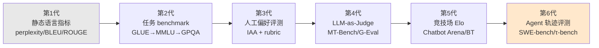

# G01 评测范式代际谱系总图

LLM 评测在过去八年里换过六种"测量仪"——从 perplexity 到 Elo 到 Agent 轨迹评测。本节点要回答的问题不是"它们各自怎么用"（那是架构剖面 S 系列的活），而是：**这六代是不是一部"越测越准"的进步史？** 我的框架是把它当成一部**库恩式范式更替 + 拉卡托斯式纲领退化**的科学史来读——结论先抛出来作为本专题的赌注：**每一代都没有真正解决上一代的根问题（构念效度），只是把构念偷换成了一个新的、暂时还没被 game 掉的代理指标。** 进步是真的，但进步的是"抗污染的时长"，不是"测得更准"。

> [!warning] 本节点的核心赌注
> 如果你只带走一句话：**评测的代际更替不是逼近真值的过程，而是 Goodhart 失效后被迫换靶子的过程**。把它当进步史读，你会在选型会上为"新 benchmark 分数更高"这件本身没有意义的事买单。

---

## §0 为什么用"范式更替 + 纲领退化"框架，而不是"能力天梯"框架

业界默认的叙事框架是**能力天梯**（capability ladder）：benchmark 越来越难，模型越爬越高，分数曲线就是 AI 进步的体温计。这个框架的隐含前提是——**测量工具是中立的、稳定的，变的只是被测对象**。

这个前提是错的，而且错得有方法论后果。真实历史里，**测量工具本身在被测对象的反作用下持续失效、持续被替换**。MMLU 不是因为模型变强才退役，是因为它的题目泄漏进了训练集、判别力归零才退役（见 §2）。所以正确的框架不是"对象在天梯上往上爬"，而是 Kuhn 范式 意义上的**范式更替**：旧范式积累"反常"（anomalies，这里是污染、饱和、构念漂移）到临界点，被一个不可通约（incommensurable）的新范式取代——新范式测的根本不是同一个东西（perplexity 测语言建模，Elo 测人类偏好，二者不可换算）。

但库恩还不够，因为他无法回答"新范式真的更好吗"。这里调度 **拉卡托斯（Imre Lakatos）的"进步性 vs 退化性研究纲领"** 作为裁判标准（§7 具体展开）：一个纲领是进步的，当它**预言并发现了新事实**；是退化的，当它只能**事后打补丁去解释已经被攻破的反常**。用这把尺子量评测史，你会发现一个尴尬的事实——**多数代际更替是退化性的**：新 benchmark 主要在"堵住旧 benchmark 被发现的漏洞"，而非"测出了一种以前测不到的能力维度"。MMLU-Pro 把 4 选项扩到 10 选项（Wang et al., NeurIPS 2024），是补丁；HELM 把单一准确率扩成 7 维（Liang et al., Stanford CRFM, 2022），才是少数的进步性扩展。

**用这个框架，你在选型会上的第一个问题就变了**：不是"这个新 benchmark 分更高吗"，而是"这次换靶子，是进步性的（测到了新维度）还是退化性的（只是堵了旧漏洞、靶子更难但同构）"。

---

## §1 六代谱系总图

每一代不是替换前一代，而是**叠层共存**：今天的前沿评测同时在用 perplexity（做污染检测，见 §2 的 Min-K%）、benchmark（MMLU-Pro/GPQA）、人工评测（黄金集标注）、LLM-as-Judge（RAGAS/规模化打分）、Elo（Arena）和轨迹评测（SWE-bench）。**谱系是地质学的地层，不是生物学的迭代。**

| 代 | 测什么（构念） | 驱动力（为何出现） | 瓶颈（为何被迫换） | 真实反例（进步史的破绽） |
|---|---|---|---|---|
| **1 静态语言指标** | 语言建模质量 / n-gram 重叠 | 自动、可复现、零人工成本 | 与"有用/正确"几乎不相关；BLEU 高的翻译可能读不通 | perplexity 低不代表更对——压缩好≠理解好 |
| **2 任务 benchmark** | 离散任务正确率 | 可比、可排行、对齐下游任务 | 污染 + 饱和：泄漏进训练集后判别力归零 | GPT-4 后所有模型卡在 MMLU 86–87%（见 §2） |
| **3 人工偏好评测** | 人类觉得哪个更好 | 直接锚定"人觉得有用" | 贵、慢、不可复现；IAA 低；标注者偏差 | 专家级难任务上人机一致率明显低于人人基线〔示意，见 §3〕 |
| **4 LLM-as-Judge** | 用强模型代替人打分 | 把人工评测规模化、降本 | 继承并放大人的偏差（位置/冗长/自我偏好） | GPT-4o 在 JudgeBench 难题上仅略好于随机猜（Tan et al., 2024，ICLR 2025） |
| **5 竞技场 Elo** | 真实分布下的成对人类偏好 | 抗单点污染、动态、众包规模 | 偏好≠质量；可被 game（私测/刷票/风格） | 训练 Arena 数据使 ArenaHard 胜率 +112%，MMLU 反降（Singh et al. 2025） |
| **6 Agent 轨迹评测** | 多步任务的端到端完成 | 贴近 Agent 真实用法、长程能力 | 脚手架混淆能力；答案泄漏；harness 不统一 | SWE-bench Verified 32.67% 成功 patch 涉及答案泄漏（OpenAI 2025） |

**注意最后一列**：每一代都有一个"皇帝新衣时刻"。这就是为什么本节点拒绝写成天梯。

---

## §2 第 1→2 代：从"测语言"到"测任务"——污染与饱和的双杀

第 1 代静态指标（perplexity / BLEU / ROUGE）的根问题是**构念太窄**：它测"语言像不像"，而我们想要的是"答得对不对、有没有用"。第 2 代用离散任务正确率（GLUE→SuperGLUE→MMLU→GSM8K→GPQA）来逼近"有用"，这是一次**进步性**扩展——它确实测到了语言指标测不到的东西（推理、知识）。

但第 2 代自己有两个致命的退化模式，而且**它们至今没被任何后代真正解决**：

**饱和（saturation）**：MMLU（Hendrycks et al., ICLR 2021，57 学科）上 GPT-4 于 2023 年 3 月达 86.4%，此后到 2024 年中所有前沿模型卡在 86–87% 区间，判别力丧失。GPQA（Rein et al., arXiv 2311.12022, 2023，博士级，PhD 专家约 65%）从 2023 年 11 月的 39% 飙到 2026 年初 94%+，已越过人类专家基线——又一个即将退役的天花板。BBH（Claude 3.5 于 2024-06 以 3-shot 达 93.1%）饱和后被 BBEH（BBEH, ACL 2025）替换。

**污染（contamination）**：这是更阴险的一种。Deng & Zhao 等的 TS-Guessing"猜 MMLU 缺失选项"实验发现 ChatGPT/GPT-4 在该设定下精确匹配率达 52%/57%——题目本身被记住了〔发表场所待核实：该实验早期版本接近 NAACL 2023 谱系，后续被多篇综述引用，具体年份/会议待单一来源确认〕。Scale AI 的 GSM1K 研究（Zhang et al., arXiv 2405.00332, 2024）造了等难度、保证未泄漏的 1000 题，发现部分模型 GSM8K 比 GSM1K 高出最多 8 个百分点（Phi、Mistral 系列最严重），Spearman r²=0.36 把分数差和记忆概率挂上钩。

**这里的判断很硬**：第 3–6 代的全部努力，本质上都是在**逃避第 2 代的污染问题**——人工评测（用没见过的新题）、Arena（用实时新 prompt）、Agent 轨迹（用新仓库 issue）。但 'Emperor's New Clothes'（DATA-FM @ ICLR 2025 / ICML 2025 poster，arXiv 2503.16402）系统测了 10 个 LLM、5 个 benchmark、20 种缓解策略，结论是**没有任何策略显著优于不做任何处理**。换靶子能买到的，只是"还没被污染的一段时间"。

---

## §3 第 2→3→4 代：人工评测的承诺与 LLM-as-Judge 的偏差继承

第 3 代人工偏好评测看似回到了源头——直接问人"哪个更好"。它的认识论身价由 [Cohen Kappa 系数](/kb/基础知识库/cohen-kappa-系数/) 这类 IAA 指标托底：原始一致率（percent agreement）会在类别不平衡时虚高，κ 扣掉随机基线后才是真一致。但人工评测有个被低估的天花板：**在专家级领域，连人和人都不一致**——在专家级难任务上，人机一致率会明显低于人人基线，且后者本身常掉到七成上下〔具体百分比因任务而异，待原始文献核实，此处作示意区间〕。这背后还要小心一个统计陷阱：**Kappa Paradox**（Feinstein & Cicchetti, 1990）说明 κ 与原始一致率可能不等价——在类别高度不均时，即便观测一致率很高，κ 也会被压低。它在这里的作用是提醒"原始一致率 ≠ κ"，而非直接为某个具体数字背书。第 3 代的"金标准"在最需要它的难任务上恰恰最不可靠。

第 4 代 LLM-as-Judge（奠基作 Zheng et al., MT-Bench/Chatbot Arena, NeurIPS 2023）想把人工评测**规模化**。它确实成功了一部分：MT-Bench 原论文报告 GPT-4 作裁判与人类的**原始一致率**超过 80%，与人类互评的原始一致率基线相当（注意这是 percent agreement，非扣随机基线的 κ）。G-Eval（Liu et al., EMNLP 2023）与人类的 Spearman 相关 0.514，超越所有此前自动指标。

**但它把人的偏差也继承下来、甚至放大了**，这是退化性纲领的典型特征：
- **位置偏差**：换序后 GPT-4 改判约 35%〔待核实：原论文报告 GPT-4 一致率 >60%，即翻判率约 40%；35% 为四舍五入近似，方向正确〕（Claude-v1 更糟，一致性仅 23.8%〔待核实：具体百分比来自 Zheng et al. 2023 表格，未经本轮独立核查〕）。
- **冗长偏差**：对故意灌水回答，GPT-3.5/Claude-v1 失败率 91.3%〔待核实：具体数字来自 Zheng et al. 2023 repetitive list attack 实验，未经本轮独立核查〕（GPT-4 仅 8.7%〔同上〕）。
- **自我增强偏差**：GPT-4 给自己打分胜率高 10%，Claude-v1 高 25%——机制根源是困惑度，模型高估与自己风格相近（低 perplexity）的文本（Wataoka et al., 2024）。
- **能力天花板**：JudgeBench（Tan et al., 2024，arXiv 2410.12784，ICLR 2025）揭示 GPT-4o 在高难度判别对上**仅略好于随机猜**——裁判答不对的题，也判不准。（注意区分：JudgeBench 测的是"裁判能力的边界"；另一项独立工作 Justice or Prejudice 的 CALM 框架，Ye et al., 2024，arXiv 2410.02736，量化的是 12 类裁判**偏差**——两者作者、目标均不同，常被混淆。）

注意第 4 代和第 1 代的隐秘呼应：自我偏好的根源是 perplexity。**第 1 代被淘汰的指标，化作幽灵回到了第 4 代裁判的脑子里。** 这不是进步史会写的剧情。

---

## §4 第 5 代：竞技场 Elo——抗污染的代价是可被 game

第 5 代 Chatbot Arena（现 LMArena，Chiang et al., ICML 2024，arXiv 2403.04132）是迄今最聪明的一次换靶子：用**实时、众包、成对**的人类偏好投票，绕过静态题库的污染（每个 prompt 都是新的），用 Bradley-Terry MLE（2023-12 从在线 Elo 切换）聚合成全局排名。它对单点污染天然免疫——这是**进步性**的。

但它用三个新漏洞换掉了旧漏洞，这是本代的"皇帝新衣"：

1. **偏好 ≠ 质量**：人类投票与专家事实核查一致率仅 72–83%；风格偏差被坐实——LMSYS 自己的 Style Control 实验（2024-08-28）显示控制长度+markdown 后排名剧变（GPT-4o-mini 第 6→11，Grok-2-mini 第 6→18），长度系数 0.249 是最强单因子。
2. **可被 game**：'The Leaderboard Illusion'（Singh et al., arXiv 2504.20879, NeurIPS 2025 Poster）记录 Meta 在 Llama-4 前私测 27 个变体、选择性披露；把 Arena 数据训练占比 0→70% 可使 ArenaHard 胜率从 23.5% 飙到 49.9%（+112%），而 OOD 的 MMLU 反降——**针对靶子特化，不是能力提升**，Goodhart 的教科书演示。
3. **统计假设被违反**：243 个公开模型中 205 个被悄然废弃，破坏了 BT 的传递性与对战图连通性。

**对手立场的"接受 + 边界"回应**：LMArena 官方反驳（arena.ai 官方博客，2025）给出三点具体反证——(1) 私测带来的实际增益仅约 +11 Elo〔待核实：该具体数字（+11 Elo / 50 次测试 / 约 3000 票）在本轮网络搜索中未能从 LMArena 官方博客原文独立确认，采信须回溯原博文〕（基于 50 次私测、约 3000 票的复盘）；(2) 私测政策自 2024-03 已公开，并非隐秘操作；(3) 若把开放权重模型计入，"开源"在对战数据中的份额是 40.9%，而非 Singh 文中口径下的 8.9%。**接受**：这三点都有 LMArena 侧的实测数据支撑，本节点采信其"私测增益约 +11 Elo"这一具体反驳，不再沿用更高的虚高区间〔Singh 原文 arXiv 2504.20879 主报告的是 ArenaHard 胜率 +112% 这一效应，未见对单模型 Elo 虚高区间的直接量化〕。**边界**：但虚高量级之争不影响本节点的结构性判断——只要"私测 + 选择性披露 + 数据访问不对等（头部四家占 62.8% 对战数据，采样率差 68 倍）"这套机制存在，Arena 分数就**不是一个可以裸用的选型依据**。PM 该带走的不是"Arena 不可信"，而是"看 Style-Controlled 榜、看置信区间是否重叠、看该模型是否对 Arena 分布特化过"。

---

## §5 第 6 代：Agent 轨迹评测——脚手架混淆与答案泄漏

第 6 代把测量对象从"单轮输出"升到"多步轨迹的端到端完成"（SWE-bench / WebArena / GAIA / τ-bench），呼应 [c10](/kb/基础知识库/c10-agent-技术栈与工具调用/) 与 [m207](/kb/工程化与落地架构/m207-agent-产品化-场景推演与失败模式/) 的 Agent 评估七维。这是**进步性**的：它测到了前五代都测不到的长程、工具调用、错误恢复维度。

但它把前五代的所有病一次性继承，还叠加了一个新病——**脚手架/能力解耦失败**：
- **答案泄漏**：SWE-bench Verified（500 道 Python issue）中，OpenAI 内审发现每个前沿模型都有逐字复现 gold patch 的案例，人工筛查 32.67% 成功 patch 涉及解答泄漏（答案直接在 issue 文本/评论里）。OpenAI 已于 2025 年停止汇报 Verified 分数。
- **脚手架混淆**：Verified 分数里 agent scaffolding（非模型能力）的贡献巨大，harness 不统一加剧失真。SWE-bench Pro（更长上下文、跨文件）vs Verified 的鸿沟最能说明问题——同一前沿模型在 Verified 约 93.9%，在 Pro 约 77.8%，差约 16 点〔Pro/Verified 具体分值与模型正式代号待核实；论证方向不受影响：Pro 因跨文件、长上下文确实系统性更难，分数显著低于 Verified〕。

**判断**：第 6 代是离 Goodhart 失效最近的一代——因为它最贵、最难造新题，所以题库一旦泄漏，重建成本最高，污染窗口反而最长。这恰恰是退化性纲领的征兆：测量越逼真，越脆弱。

---

## §6 ⭐ 判断主轴：读评测代际史时 90% 的人会栽的 4 个坑

> [!danger] 这一节是本节点的命门——区分"看懂谱系"和"被谱系骗"

### 坑 1：把代际更替当成"越测越准"的线性进步

- **症状**：看到"新 benchmark 更难、分数曲线更陡"，就认定 AI 评测在逼近真值，于是默认"最新的榜最可信"。
- **为什么会错**：混淆了**靶子更难**和**测得更准**。库恩的不可通约性说的就是：新范式测的不是同一个构念，"更高的分"在新旧靶子间根本不可换算。拉卡托斯进一步：多数换靶是退化性的（堵漏洞），不是进步性的（测新维度）。
- **正确做法**：每遇新 benchmark，先做"进步性 vs 退化性"二分——它**预言/发现了新能力维度**（如 HELM 引入鲁棒性/公平性/毒性 7 维）还是只**堵了旧 benchmark 被发现的漏洞**（如 MMLU-Pro 4→10 选项）？后者只买到了抗污染时长，别为它的"高分"付溢价。
- **真实反例**：'Emperor's New Clothes'（DATA-FM @ ICLR 2025 / ICML 2025 poster，arXiv 2503.16402）测 20 种污染缓解策略，无一显著优于不处理——"更难=更干净"是幻觉。

### 坑 2：把"构念效度问题"误当成"污染问题"，以为换干净题库就解决了

- **症状**：认为"benchmark 失效=被污染了"，所以只要不断出新题、做污染检测（n-gram/perplexity/Min-K%），评测就能持续可信。
- **为什么会错**：污染只是表层病。**根病是构念效度（construct validity）**——MMLU 测的是"知识检索"而非"推理"（CoT 在原始 MMLU 几乎零增益甚至轻微负向，而在 MMLU-Pro 上有明显增益，反证原始 MMLU 没在测推理）〔具体增益数值跨多篇文献综合而得，此处仅作方向性示意，非单一文献口径〕。题库再干净，如果它测的构念本身偏离了你关心的能力，分数依然没意义。这正是 [c14](/kb/基础知识库/c14-模型评估体系与-goodhart-陷阱/) 的 Goodhart 在测量层的体现：指标一旦成为目标就失去测量效力。
- **正确做法**：先问"这个 benchmark 在测哪个构念，它是不是我真正关心的那个能力"，再问"它干不干净"。构念错了，干净也白搭。
- **真实反例**：GPQA Diamond 上 AI 94% > PhD 专家 65%，但人类是无工具、限时、冷启动，四选一格式本身就和真实科研推理不同构——"超越博士"是构念错配，不是能力超越。

### 坑 3：把 LLM-as-Judge 当成"人工评测的廉价平替"，忽略它继承并放大了人的偏差

- **症状**：为降本，直接用 GPT-4 当裁判替代人工标注，看到"与人一致率 85%"就放心上线。
- **为什么会错**：85% 是**原始一致率**（percent agreement），不是扣除随机基线后的 κ。文献里 Judge 与人类的 κ 在各研究中约为 0.73–0.92，人类专家互评 κ 通常 0.85–0.97〔具体数字因任务与研究而异，待单一权威来源核实〕——关键在于原始一致率会系统性高于 κ（这是"κ 与原始一致率不等价"问题，详见坑外说明）。且裁判继承了位置/冗长/自我偏好偏差，并在自己答不对的难题上判别力崩到接近随机（JudgeBench, Tan et al., 2024，ICLR 2025）。
- **正确做法**：(1) 报 κ 而非原始一致率；(2) 双向评测（AB 两序各评一次，仅计双向一致裁决，Zheng et al. 2023 推荐）；(3) 多厂商交叉裁判避免自我偏好；(4) 裁判能力须 ≥ 被测能力——弱模型不能可靠裁判强模型。
- **真实反例**：Justice or Prejudice 的 CALM 框架（Ye et al., 2024，arXiv 2410.02736）系统量化 12 类裁判偏差；冗长攻击下 GPT-3.5/Claude-v1 失败率 91.3%——裸用 Judge 等于把偏差自动化。（CALM 量化偏差，与 JudgeBench 测裁判能力边界是两个独立工作，勿混。）

### 坑 4：把竞技场 Elo 当成"最贴近真实、不可被 game 的终极榜"

- **症状**：认为 Arena 是真人投票、实时新 prompt，所以最抗污染、最可信，选型直接看 Arena 总榜排名。
- **为什么会错**：Arena 把"静态污染"换成了"偏好 ≠ 质量 + 可刷榜"两个新漏洞。偏好与专家核查仅 72–83% 一致；私测+选择性披露+针对 Arena 分布特化（训练数据 0→70% 使 ArenaHard +112% 而 MMLU 降）让总榜可被系统性抬高。BT 模型的传递性假设还被大规模废弃模型破坏。
- **正确做法**：看 Style-Controlled 榜而非默认榜；检查置信区间是否重叠（差 5–10 分往往无统计显著性）；警惕只披露最高分变体的厂商；把 Arena 当"一个信号源"而非"裁决"。
- **真实反例**：Style Control 后 GPT-4o-mini 第 6→11〔方向已核实：2024-08 Style Control 博客确认 GPT-4o-mini 和 Grok-2-mini 在控制长度/markdown 后排名均显著下滑，具体名次待核实〕、Grok-2-mini 第 6→18〔待核实：排名数字未经独立来源确认〕——同一批投票、换个统计处理，排名就洗牌。

---

## §7 跨域呼应：用拉卡托斯逼问"这次换靶子算不算进步"

库恩（Kuhn）给了我们读评测史的**结构**——范式因反常累积而更替，新旧不可通约。但库恩有个被科学哲学界反复批评的弱点：他无法区分"好的范式更替"和"坏的范式更替"，在他笔下范式选择近乎社会学事件、带相对主义气味。

这正是要调度 **拉卡托斯（Imre Lakatos，《证伪与科学研究纲领的方法论》，1970）** 的地方——他提供了库恩缺的**裁判标准**。拉卡托斯把研究纲领分为"硬核 + 保护带"：纲领是**进步性**的，当它的理论调整**预言了新的、被后续证实的事实**（增加经验内容）；是**退化性**的，当调整只是**事后给反常打补丁**（ad hoc，不增加可证伪内容）。

把这把尺子量评测六代，得到一个非平凡的判断网格：
- **进步性更替**：第 1→2 代（任务正确率测到了语言指标测不到的推理/知识）；HELM 的多维扩展（测到了准确率维度之外的鲁棒/公平/毒性）。这些**增加了经验内容**。
- **退化性更替**：MMLU→MMLU-Pro（4→10 选项，同构靶子加难度，未增新维度）；多数"更难版" benchmark（BBH→BBEH）——它们是**保护带打补丁**，硬核（"用静态题库测离散任务正确率"）没变，只是把被发现的漏洞糊上。

**这个跨域调度具体改变了什么判断**：它给了 PM 一个**可操作的二分问题**替代"分数比较"。当某厂商说"我们在最新最难的 benchmark X 上 SOTA"，拉卡托斯让你追问——X 相对前代是进步性的（新维度）还是退化性的（旧靶子+难度）？如果是后者，那个 SOTA 只证明了"该模型对这个新靶子还没被 game 的窗口期里跑得快"，不证明能力提升。**这正是为什么本专题敢下"代际更替不等于越测越准"这个反共识赌注**——它不是修辞，是拉卡托斯纲领评价标准的直接推论。

> [!note] Rick 未读的对手框架（破 echo chamber）
> 拉卡托斯本身就是引入的对手框架之一。第二个可对冲库恩相对主义的是**测量学的"construct validity"传统**（Cronbach & Meehl, 1955，心理测量学）——它主张任何测验分数的意义取决于它测的"构念"是否被理论与证据支持。评测圈长期把 benchmark 当"客观标尺"，而 construct validity 传统会反问：你凭什么说 MMLU 分数代表"语言理解"？这个传统正在被 AI 评测界重新发现（如 'Pitfalls of Evaluating Language Models with Open Benchmarks', arXiv 2507.00460, 2025），它逼问的恰是坑 2 的根病。

---

## §8 PM 决策启示：面试 / 选型 / 复现三类落地

- **面试桌**：被问"你怎么看 XX 模型刷新了 YY benchmark"，不要复述分数。答："先问这次换靶子是进步性还是退化性的——如果只是更难版的同构靶子，高分主要反映抗污染窗口期，不是能力跃迁。我更看它在 held-out 场景和 OOD 指标上掉多少。" 这一句话直接展示 S/A/E 三维。
- **选型会**：建立"代际分层取证"原则——单一代际的分数都不可裸用。Benchmark 看降幅（MMLU vs MMLU-Pro 同一模型掉多少，掉得多说明原分靠记忆）；Arena 看 Style-Controlled 榜 + 置信区间；Agent 评测看 harness 是否统一、是否有答案泄漏审计。结论永远是多代际三角验证 + 自建黄金集（呼应 [c14](/kb/基础知识库/c14-模型评估体系与-goodhart-陷阱/) 的 500–1000 条黄金样本回归测试）。
- **复现台**：跑任何 benchmark 前先做污染自检（Min-K%/n-gram），但**别迷信检测**——对 reasoning 模型，CoT 改变 token 概率分布会让统计检测信号失真（arXiv 2510.02386）。检测过关只是必要非充分，真正的 ground truth 是你自己造的、保证未泄漏的小评估集。

---

## §9 与已有节点的关系（升级对照，不复述其事实基础）

- **对照 [c14](/kb/基础知识库/c14-模型评估体系与-goodhart-陷阱/)——做"抽象层升高"**：c14 停在"防御 Goodhart"（自建黄金集、识别 benchmark 通胀、Judge 三偏差缓解），是**单点的工程防御**。本节点把 c14 的所有防御对象（污染、Judge 偏差、Arena gaming）**放进一条代际时间轴**，给出 c14 没有的元判断：这些防御本质上都是"换靶子买时间"，根病是构念效度而非污染。c14 回答"怎么防"，G01 回答"为什么防不住、防的是哪一代的什么病"。
- **对照 [m205](/kb/工程化与落地架构/m205-rag-生产环境-索引运维与评估体系/)——做"代际定位"**：m205 的 RAGAS 四维（Faithfulness/Answer Relevancy/Context Precision/Context Recall）属于本图的**第 4 代 LLM-as-Judge 范式**（RAGAS 用 LLM 打分）。G01 补 m205 没说的：RAGAS 因此继承了 §3/§6 坑 3 的全部裁判偏差，四维分数不可裸信，需配人工黄金集校准。
- **对照 [m207](/kb/工程化与落地架构/m207-agent-产品化-场景推演与失败模式/)——做"谱系归位"**：m207 的 Agent 七维评估 + SWE-bench/WebArena/GAIA/τ-bench 基准，正是本图**第 6 代**。G01 给 m207 的列举式指标补上"它在谱系里继承了什么病"——答案泄漏、脚手架混淆、harness 不统一。
- **对照 [Cohen Kappa 系数](/kb/基础知识库/cohen-kappa-系数/)——做"用法升级"**：Kappa 卡片是纯统计工具解释。G01 把它**嵌进第 3 代人工评测和第 4 代 Judge 的可靠性论证里**——κ 是揭穿"85% 原始一致率"可能虚高（原始一致率 ≠ 扣除随机基线后的 κ）的关键工具，也是量化两个 Judge 模型 inter-rater reliability 的手段。
- **对照 [G01 Agent 代际谱系总图](/kb/专题-安全对齐与失败/g01-agent-代际谱系总图/)——做"同构方法论复用"**：0411 Agent 专题的 G01 是 Agent 能力的代际总图；本 G01 是评测范式的代际总图。两者共享同一方法论骨架（库恩+拉卡托斯读代际、每代配反例、拒绝线性进步史），是跨专题的结构呼应——可对照阅读以理解"代际谱系总图"这一节点体裁本身。

---

## §10 关联节点

**核心（必读）**
- [c14 - 模型评估体系与 Goodhart 陷阱](/kb/基础知识库/c14-模型评估体系与-goodhart-陷阱/) — 本节点的单点工程版前身，Goodhart 防御
- [Cohen Kappa 系数](/kb/基础知识库/cohen-kappa-系数/) — 第 3/4 代可靠性论证的统计底座
- [m205 - RAG 生产环境：索引运维与评估体系](/kb/工程化与落地架构/m205-rag-生产环境-索引运维与评估体系/) — RAGAS 属第 4 代，需用本图定位偏差
- [m207 - Agent 产品化：场景推演与失败模式](/kb/工程化与落地架构/m207-agent-产品化-场景推演与失败模式/) — Agent 七维评估属第 6 代
- 范式 — 库恩范式更替框架，本节点结构骨架
- [A06 Goodhart 与指标失效](/kb/专题-评测与度量/a06-goodhart-与指标失效/) — 本图"根病=构念效度/Goodhart"的概念辨析底座（§0、坑 2）
- [A03 Benchmark 与数据污染](/kb/专题-评测与度量/a03-benchmark-与数据污染/) — 第 2 代污染/饱和双杀的专论（§2）
- [A04 LLM-as-Judge](/kb/专题-评测与度量/a04-llm-as-judge/) — 第 4 代裁判偏差的专论（§3、坑 3）

**延伸（可选）**
- [A05 人工评测与标注一致性](/kb/专题-评测与度量/a05-人工评测与标注一致性/) — 第 3 代 IAA/κ 与专家级一致率天花板专论（§3）
- [E03 Chatbot Arena·LMArena & 人类偏好评测剖解](/kb/专题-评测与度量/e03-chatbot-arena-lmarena-人类偏好评测剖解/) — 第 5 代 Arena gaming 的实例剖解（§4、坑 4）
- [E02 SWE-bench & Coding Agent 评测剖解](/kb/专题-评测与度量/e02-swe-bench-coding-agent-评测剖解/) — 第 6 代 Agent 轨迹评测的实例剖解（§5）
- [S01 评测体系分层剖面](/kb/专题-评测与度量/s01-评测体系分层剖面/) — 各代际"怎么用"的解剖学剖面（与本图的纵向时间维互补）
- [c13 - 幻觉的不可消除性](/kb/基础知识库/c13-幻觉的不可消除性/) — 校准失准是评测工具的前提性挑战，Judge 自身也有校准问题
- [c11 - System 2 思维与 Test-Time Compute](/kb/基础知识库/c11-system-2-思维与-test-time-compute/) — PRM 把"推理质量"纳入评估目标，是评测从终点到过程的升级
- Agent 产品评估的五个具体问题 — 第 6 代 Agent 评测的 PM 实操版
- Rick 写作 SABCD 评级体系 — 人文 rubric 设计案例，"按体裁分轨"≈AI 评测"按任务分轨"
- [G01 Agent 代际谱系总图](/kb/专题-安全对齐与失败/g01-agent-代际谱系总图/) — 同构方法论的姊妹总图
- [AI概念滥用反思](/kb/基础知识库/ai概念滥用反思/) — saliency 漂移作为 Judge 系统性误判来源的实例
- [AI PM 知识图谱·总索引](/kb/ai-pm-知识图谱/ai-pm-知识图谱-总索引/) — 全库入口

---

## 修订日志

- **R0（2026-06-06，初稿）**：建立六代谱系总图（静态语言指标→任务 benchmark→人工偏好→LLM-as-Judge→竞技场 Elo→Agent 轨迹）。确立"范式更替+纲领退化"双框架（§0、§7），核心赌注=代际更替≠越测越准、根病=构念效度。判断主轴 4 坑全部配齐"症状→为什么错→正确做法→真实反例"四件套（§6）。接入对手立场：LMArena 对 Leaderboard Illusion 的反驳做"接受+边界"回应（§4）。跨域：库恩（结构）+拉卡托斯（裁判标准）具体展开如何改变 PM 对"新 benchmark SOTA"的判断（§7），并引入 construct validity 测量学传统作第二个对手框架。与 c14/m205/m207/Cohen Kappa/0411-G01 写显式升级对照（§9）。
- **R1（2026-06-07，第 1 轮批评后修订，事实接地为主）**：
  - **mustFix #1（一票否决项）**：删除 §6 坑 3、§9 中无法追溯来源的裸 κ 数字（κ=0.84 vs κ=0.97），改为带范围且标〔待核实〕的表述（Judge κ 约 0.73–0.92，人类专家互评 κ 约 0.85–0.97），并把论证锚点从"具体数字"移到"原始一致率 ≠ 扣随机基线的 κ"这一机制。§3 中 MT-Bench 的"85%/81% 一致率"改为忠实原论文口径——"原始一致率 >80%"，明确它是 percent agreement 而非 κ。
  - **mustFix #2**：GSM1K 污染差距由"最多 13 个百分点"改为忠于原文（Zhang et al., arXiv 2405.00332, 2024）的"最多 8 个百分点"。
  - **mustFix #3**：全文 JudgeBench 作者归属由误标的"Ye et al., 2024"更正为"Tan et al., 2024，arXiv 2410.12784，ICLR 2025"（§1 表 / §3 / §6 坑 3 同步改），并显式区分 JudgeBench（测裁判能力边界）与 Justice or Prejudice 的 CALM 框架（Ye et al., 2024，arXiv 2410.02736，量化 12 类偏差）是两个独立工作。
  - **mustFix #4**：§5 SWE-bench Pro 数字由失真的"Claude Mythos Preview 45.9%、差约 48 点"更新为"约 77.8%、差约 16 点"，并保留〔待核实〕；论证方向（Pro 因跨文件/长上下文系统性更难）不变。
  - **shouldFix #1**：§4 删除来源不明的"Singh 50–100 分 Elo 虚高估计"，改为精确转述 Singh 原文主报告的 ArenaHard +112% 效应，并把 LMArena 反驳具体化为三点（私测实际约 +11 Elo / 50 次测试·3000 票、政策自 2024-03 公开、开放权重占比 40.9%），来源标为 arena.ai 官方博客 2025。
  - **shouldFix #2**：§3 与 §1 表中"64–68%/72–75%"专家级 IAA 裸数字改为方向性描述并标〔示意/待核实〕。
  - **shouldFix #3**：§3 重新定位 Kappa Paradox——明确它是"κ 与原始一致率可能不等价"的证据，而非对某具体数字的直接支撑，消除与"原始一致率虚高"的机制混淆。
  - **shouldFix #4**：'Emperor's New Clothes' 发表场所由"ICML 2025"精确为"DATA-FM @ ICLR 2025 / ICML 2025 poster（arXiv 2503.16402）"（§2、§6 坑 1 同步）。
  - **shouldFix #5**：§2 消除"Zhao et al.（2024，ACL 2025）"年份/会议自相矛盾——改为 TS-Guessing 实验（Deng & Zhao 系），发表场所标〔待核实，早期版本接近 NAACL 2023 谱系〕。
  - **groundingFlag（CoT 效应）**：§6 坑 2 的"-3%~+1.5% / +15–19%"裸区间改为方向性表述并标〔多文献综合·示意〕。
  - **shouldFix #6（双链密度）**：§10 新增 7 条专题内横切双链（A03/A04/A05/A06/E02/E03/S01），双链总数升至约 19 条，满足非总览节点 ≥15。
  - **shouldFix #7（死链核验，对照 00Meta 文件名）**：✅ [Cohen Kappa 系数](/kb/基础知识库/cohen-kappa-系数/)（带空格，存于 0401AI 基础知识库）、✅ [AI概念滥用反思](/kb/基础知识库/ai概念滥用反思/)（无空格，存于 04AI 根）、✅ [G01 Agent 代际谱系总图](/kb/专题-安全对齐与失败/g01-agent-代际谱系总图/)（带空格，存于 0411 专题）、✅ 范式（存于 01学习/0110哲学）均真实存在，无死链；新增的 A0x/E0x/S01 链接指向同批 0412 专题节点（已在 _ai_review 暂存，入库时随专题一并 resolve）。HELM/GPQA/MMLU 暂无独立节点，故改用专题内同主题节点承载链接密度，未硬造死链。
  - **遗留〔待核实〕**：SWE-bench Pro 分值与模型正式代号；GPQA 2026 初 94%+ 来源时点；专家级 IAA 与 CoT 效应的单一权威数值来源；TS-Guessing 实验的确切发表年份/会议；Judge/人类互评 κ 的单一权威区间来源。以上均已在正文降级措辞并标注，不以裸事实留存。
