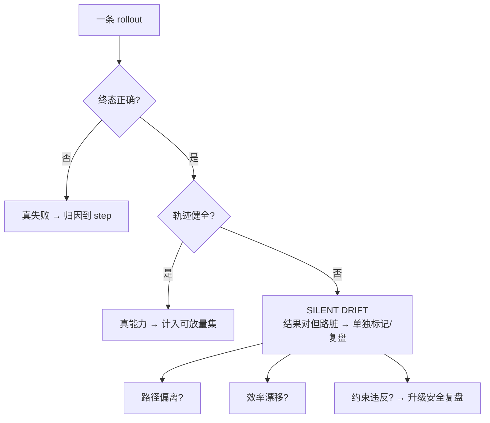

当一个 PM 要给自家 Agent 建评测，他面前的真问题不是"完成率多少"，而是**一条做对了结果的轨迹和一条蒙对了结果的轨迹，怎么在数据里区分开**——前者可复制、可放量、可承诺，后者是埋在 demo 里随时引爆的雷。本节点解决的问题是：如何用一套 **τ-bench 风格的轨迹评测（trajectory eval）** 模板，同时测"结果对不对"（outcome-level）和"过程对不对"（step-level），并专门捕捉一类静态 benchmark 测不出的失效——**silent drift（沉默漂移）**：结果看着对、轨迹早已脱轨、只是这次侥幸没暴露。框架是「过程 vs 结果评测」的二维分解：Agent 的可信度不是一个标量，是 outcome correctness × trajectory soundness 两个轴张成的平面，只看结果轴的评测系统会系统性地把"运气"误判为"能力"。这是问题陈述，不是答案——本节点给的是模板与运行思路，不是一个能直接跑的库。

---

## §0 为什么是"轨迹评测"框架，而不是"通过率"框架

最常见的 Agent 评测就一行：跑 N 个任务，数有几个最终结果对，算个通过率。这个"outcome-only"框架在**单步、确定性、有标准答案**的任务上够用（比如分类、抽取）。但 Agent 是**多步、有状态、调工具、会自我修正**的系统，outcome-only 框架在这里有一个致命盲区：**它把一条 12 步里走错 5 步、靠最后一步歪打正着的轨迹，和一条 7 步干净利落的轨迹，记成同一个"成功"**。

为什么必须升到轨迹框架，三个 outcome-only 答不出的问题：

- **归因**：失败了，是规划错、工具调用错、还是推理错？通过率只给你一个"0"，不告诉你雷在第几步——而修复需要知道在第几步（对照 [m207 - Agent 产品化：场景推演与失败模式](/kb/工程化与落地架构/m207-agent-产品化-场景推演与失败模式/) 的六类失败模式）。
- **运气 vs 能力**：成功了，是真的推理对了，还是任务太简单/答案在上下文里/瞎试试对了？outcome-only 无法区分"鲁棒的成功"和"脆弱的成功"。
- **沉默漂移**：一条轨迹中途偏离了正确路径（调错了工具、读了无关文档、绕了远路），但最终结果碰巧仍对。outcome-only 给满分，而这条轨迹在稍变一点的环境里就会塌——这是 demo 高分、生产拉胯的头号机制。

τ-bench（Shunyu Yao 等，'τ-bench: A Benchmark for Tool-Agent-User Interaction in Real-World Domains', 2024，arXiv 2406.12045；代码在 `sierra-research/tau-bench` org 下）正是为补这个盲区设计的代表作：它在零售/航空两个域里，让 agent 同时和**工具**（API）和**模拟用户**交互，不仅判最终数据库状态对不对，还引入 **pass^k**（同一任务独立跑 k 次，要 k 次**全部**成功才算这道题过）来直接量化**可靠性而非平均运气**——据该工作报告，pass^1 本身在多数任务上就已经不及格（前沿模型在零售/航空两域的整体任务成功率均**低于 50%**；其中 GPT-4o 在零售域 pass^1 约 61%，已是最高的一档），而 pass^k 随 k 增大会进一步显著掉档（GPT-4o 零售域 pass^8 已跌到约 25%），暴露的正是"单次都未必成、连续更做不稳"（arXiv 2406.12045）。〔具体分数随模型/版本变化，本节点引其方法论为主：pass^k 这个度量本身是它最该被抄走的设计，不依赖某个具体数字。〕

选轨迹框架不是因为它更全，是因为**它测的是 Agent 真正会害死你的那个维度——稳定性**。通过率测"平均能不能成"，轨迹评测测"每一次都靠不靠谱、错了能不能查"。对一个要为线上 Agent 行为负责的 PM，后者才是决策依据。

---

## §1 二维分解：把"一次运行"拆成 outcome × trajectory 两条独立证据链

轨迹评测的第一性原理：一次 Agent 运行（rollout）产出两类正交证据，分别打分、绝不混算。

| 轴 | 测什么 | 数据来源 | 典型信号 |
|---|---|---|---|
| **Outcome-level（结果轴）** | 任务最终是否达成 | 终态 / 副作用 / 数据库状态 | 任务完成（task success）、终态正确性 |
| **Trajectory-level（过程轴）** | 达成路径是否健全 | 完整 step 序列（思考+工具调用+观测） | 工具调用正确性、步骤效率、是否走了不该走的路 |

两轴交叉出四个象限，**只有"双对"才是可放量的成功**：

```mermaid
quadrantChart
    title Agent 运行的二维分类
    x-axis 轨迹脏 --> 轨迹干净
    y-axis 结果错 --> 结果对
    quadrant-1 真能力(可放量)
    quadrant-2 silent drift(雷)
    quadrant-3 真失败(可归因)
    quadrant-4 干净失败(差一步)
```

- **右上（结果对 + 轨迹干净）= 真能力**：可复制、可承诺、可放量。
- **左上（结果对 + 轨迹脏）= silent drift**：本节点的头号猎物，详见 §3。
- **左下（结果错 + 轨迹脏）= 真失败**：能归因到具体 step，最好修。
- **右下（结果错 + 轨迹干净）= 差一口气**：路走对了但终点没够着，常是环境/工具本身的问题，不是 agent 的。

> [!note] 把二维分解翻译成 PM 能用的话
> outcome-only 通过率，等于把这四个象限里上面两个（结果对的）一律算成功、下面两个一律算失败——它**看不见左上和右下的区别**。而左上（silent drift）恰恰是上线后最危险的：它在你的离线评测里是满分。所以任何只报一个"通过率"的 Agent 评测，PM 都要追问一句：**"这个通过率里，有多少是轨迹经得起看的？"**

---

## §2 模板骨架：一条轨迹评测最少要记哪些字段、判哪几件事

下面是模板，不是库。一条 rollout 的最小可评测结构：

```yaml
# 单条 trajectory eval 记录（模板）
task_id: retail_0042
rollout_id: run_3            # 同一 task 的第几次独立运行（算 pass^k 用）
input:
  goal: "把订单 #1234 改成隔日达并退运费"
  initial_state: {...}       # 环境初态（可复现的关键）
trajectory:                  # 有序 step 列表 —— 过程轴的原始证据
  - step: 1
    thought: "先查订单状态"
    action: {tool: get_order, args: {id: 1234}}
    observation: {status: shipped, ...}
  - step: 2
    thought: "已发货，需先拦截"
    action: {tool: cancel_shipment, args: {id: 1234}}
    observation: {ok: true}
  # ...
outcome:                     # 结果轴的原始证据
  final_state: {...}         # 终态 / 数据库副作用
  user_visible_reply: "已为您改为隔日达并退运费"
labels:                      # 评测产出（下面四类判定）
  outcome_correct: true/false
  trajectory_sound: true/false
  failure_step: null | <int>
  failure_mode: null | planning|tool_call|reasoning|loop|...
```

在这条记录上，模板要跑**四类判定**，从易到难、从客观到主观：

| 判定 | 怎么判 | 客观度 | 对应 evidence 域的注意点 |
|---|---|---|---|
| **A. Outcome 正确性** | 终态/副作用比对**期望终态**（rule-based 校验函数） | 高（程序化） | 像 SWE-bench 的 FAIL_TO_PASS，但要警惕"终态对≠过程对" |
| **B. 工具调用正确性** | 逐 step 比对：该不该调这个工具、参数对不对、顺序对不对 | 中高（部分程序化） | 工具调用是 Agent 最高频失败点（m207 六类失败之一） |
| **C. 轨迹健全性** | 是否绕路/重复/调用无关工具/违反约束（policy） | 中（需 rubric 或 LLM-as-Judge） | 这一步最易引入 Judge 偏差，见 §4 错点 3 |
| **D. 失败归因** | 失败发生在第几 step、属哪类 failure mode | 中（半自动+人工抽检） | 归因是修复的前提，不是分数 |

**关键工程决策：A、B 能 rule-based 的，绝不交给 LLM-as-Judge。** 终态比对、工具名/参数匹配、约束违反检测，写成确定性校验函数，又快又稳又免费。只有 C（"这条路绕不绕得过分"这种语义判断）和部分 D 才动用 LLM-as-Judge——而且要带着 [A04 LLM-as-Judge](/kb/专题-评测与度量/a04-llm-as-judge/) 列出的全部偏差防御（位置偏差双向评、参考答案引导、多厂商交叉）来用。把所有判定都甩给一个 GPT-4 judge"看轨迹打分"，是又贵又不可复现又有偏差的下策。

---

## §3 silent drift detection：本节点的核心增量

silent drift（沉默漂移）= **结果对、轨迹脏**（§1 左上象限）。它是离线评测的最大漏网之鱼，因为它在 outcome 轴上是满分。检测它，靠三类**过程轴信号**，每一类都不看最终结果：

1. **路径偏离（path divergence）**：把实际 step 序列和一条/多条**参考轨迹（reference trajectory）**比对——不是要求逐字一样（那太脆），而是看关键决策点是否一致：该调的工具调没调、不该调的调了没、步数是否远超最优。τ-bench 的做法是给每个 task 一份 policy + 一个期望终态；偏离 policy 即使终态对也应扣分。
2. **冗余 / 绕路（efficiency drift）**：实际步骤 / 最优步骤（m207 的"步骤效率"指标）。比值显著 >1 且结果还对，往往是"试错试对的"——典型的脆弱成功。重复调用同一工具、反复读同一文档、在 loop 边缘反复横跳，都是漂移指纹。
3. **约束违反（constraint violation）**：终态对，但中途碰了不该碰的东西——读了越权数据、调用了高风险工具（删除/退款/外发）、违反了业务 policy。这类漂移最危险：**它不是效率问题，是安全/合规事故的轨迹前兆**（对接 [A07 Red Teaming 作为评测实践](/kb/专题-评测与度量/a07-red-teaming-作为评测实践/)）。

> [!warning] failure scenario：silent drift 检测本身会失效在哪
> 路径偏离检测**依赖参考轨迹**，而很多真实任务**有多条都对的路**（条条大路通罗马）。如果你的参考轨迹只有一条、判定又卡得太死，会把"换了条同样正确的路"误判成 drift——**假阳性会淹没真信号**。这是本模板的明确边界：silent drift detection 在"解空间窄、正确路径少"的任务（如严格 SOP 的客服流程）上最有效；在"解空间宽、创造性强"的任务（如开放式写代码）上，path divergence 会高频误报，此时应退回到只测 efficiency drift 和 constraint violation 这两个**不依赖唯一参考路径**的信号。把"轨迹必须长得像参考"当普适标准，是会把好 agent 误杀的过度约束（这与 [A05 人工评测与标注一致性](/kb/专题-评测与度量/a05-人工评测与标注一致性/) 里 perspectivist 阵营的洞察同构：唯一金标准在多解任务上本身就是错误假设）。



---

## §4 判断主轴 · 致命耦合点：90% 的人建轨迹评测会搞错的 4 个点

本节是命门。每点配【症状 → 为什么会错 → 正确做法 → 真实反例】。

### 错点 1：只测 outcome，把通过率当 Agent 质量的全部
- **症状**："我们 agent 在自建任务集上通过率 88%，可以上线了。"
- **为什么会错**：通过率把 silent drift（结果对、轨迹脏）算成满分。88% 里可能有相当一部分是"蒙对的"，它们在稍变环境/工具版本/上游输出后会塌。outcome-only 评测**在结构上无法预警这种塌方**——它的盲区恰好是上线后最先爆的地方。τ-bench 的数据正是这层结构性高估的旁证：据该工作报告，前沿模型单次（pass^1）尚有约 61%（GPT-4o 零售域），但要求连续 8 次全稳（pass^8）就跌到约 25%（arXiv 2406.12045）——只看接近 pass^1 的"平均通过率"，会把一个"8 次只稳成 2 次"的 agent 当成靠谱的。
- **正确做法**：outcome 和 trajectory 两轴分开报，至少给出"双对率"（结果对且轨迹健全的占比），而不只是"结果对率"。再加 pass^k：同任务跑 k 次要全过才算过，把"平均运气"压成"稳定性"。
- **真实反例（该判断被误用后翻车）**：Air Canada 退票退款纠纷是一个公开判例——其官网客服 chatbot 在用户咨询丧亲票价时给出了与真实政策不符的答复（声称可事后申请退款），用户照做却被拒，2024-02-19 加拿大民事仲裁庭（BC Civil Resolution Tribunal, *Moffatt v. Air Canada*, 2024 BCCRT 149）判航司须按 chatbot 的错误答复赔偿（来源：BCCRT 判决书 2024 BCCRT 149，判决日 2024-02-19；多家媒体报道）。把它放进轨迹评测的语言看：这条"对话轨迹"的终态（给出了一个流畅、自洽的回复）在任何 outcome-only / 自动应答成功率指标里都会被记成"成功"——只有看过程（答复内容是否违反真实政策约束）才抓得到这是一次约束违反型失败。〔本案是面向用户的问答 chatbot，非多步工具调用 Agent，作为"只看结果会放过过程违规"的跨形态例证引用；多步 Agent 上的等价脱敏案例见 §11 待补。〕

### 错点 2：把"轨迹长得像参考"当成"轨迹对"（过度约束）
- **症状**："我写了一条黄金轨迹，agent 的 step 序列和它对不上就扣分。"
- **为什么会错**：多数真实任务**有多条都对的路**。逐 step 强匹配唯一参考轨迹，会把"换了条同样正确的路"判成 drift，假阳性淹没真信号（见 §3 failure scenario）。这是把 step-level 评测做成了"抄答案比对"，丢掉了 Agent 评测该有的容错。
- **正确做法**：参考轨迹只锚**关键决策点**（must-call 工具、must-not-call 工具、终态约束、policy），不锚整条序列；用"是否违反 policy / 是否碰禁区 / 效率比"这些**不依赖唯一路径**的信号兜底。多解任务退回只测 efficiency + constraint。
- **真实反例（Agent 评测内的构造反例）**：设一个航班改签 Agent，任务"把用户改签到最早可走的航班"。黄金轨迹写的是 `search_flights → select_earliest → rebook`。某次运行 Agent 走了 `get_user_profile（读到用户是白金会员）→ search_flights → select_earliest_with_lounge → rebook`——多调了一步、选了"同样最早但带休息室"的航班，终态完全满足任务约束（最早可走 + 改签成功），却因 step 序列与黄金轨迹不符被判 drift。这就是唯一参考轨迹**误杀了一个比黄金路径更好的 agent**：它没违反任何约束、没绕远（多的一步是有信息增益的个性化），只是"长得不像答案"。把这条判成 drift，回灌进回归集后还会反向训练 agent 别做个性化——过度约束的代价是把好行为剪掉。
- **跨域类比（标注一致性领域的同构教训，非同领域反例）**：[A05 人工评测与标注一致性](/kb/专题-评测与度量/a05-人工评测与标注一致性/) 里 perspectivist 标注（SemEval-2023 LeWiDi 共享任务）给出同构警示——主观/多解任务上强求唯一金标准，高一致率反映的是"指南过严"而非"质量高"。**映射条件**：该类比只在"任务确有多个同等正确解"时成立（多解任务 ≈ 多视角标注）；在"正确解唯一、严格 SOP"的任务上，LeWiDi 的教训不适用，唯一参考轨迹反而合理。轨迹评测犯的是同一类错：把单一黄金路径当真理，而非把它当"关键决策点锚"。

### 错点 3：把整条轨迹甩给 LLM-as-Judge"看着打分"
- **症状**："让 GPT-4 读完整条轨迹，给个 1-10 分的轨迹质量分。"
- **为什么会错**：一是**能 rule-based 的别用 judge**（工具名/参数/终态比对是确定性的，用 judge 是又贵又不稳又引入偏差）；二是 LLM-as-Judge 在长输入、需要逐步逻辑核验的判断上**可靠性存疑**——据 evidence brief，JudgeBench（Ye et al., 2024, arXiv 2410.12784）发现 GPT-4o 等强模型在高难度推理/编程判断对上**仅略好于随机猜测**；且在**无参考答案**条件下数学/推理评分的失败率高（MT-Bench 报告该设置下约 70% 的失误，Zheng et al. 2023——给定参考答案后失误大幅下降，这恰恰反证了 judge 不该裸评难推理）。轨迹评测里恰恰充满"这步推理对不对"这类难判断。
- **正确做法**：分层。A/B（终态、工具调用正确性）= rule-based 确定性校验；只有 C（语义层"绕不绕得过分""理由站不站得住"）才用 judge，且带满 [A04 LLM-as-Judge](/kb/专题-评测与度量/a04-llm-as-judge/) 的偏差防御：位置偏差用双向评（同对两序各评一次只计双向一致，Zheng 2023 推荐）、给参考答案引导、关键判定多厂商交叉。judge 自己的一致性要用 [Cohen Kappa 系数](/kb/基础知识库/cohen-kappa-系数/) 对人工抽检标，κ 上不去（"可下试探性结论"的常用下限约 0.67，原出处 Krippendorff 1980 对其 α 的解释门槛；见 Artstein & Poesio 2008 综述对该惯例的转述与批评）就别信这个 judge。
- **真实反例**：据 evidence brief，judge 自身的答题能力是其裁判准确性的强预测变量（JudgeBench）——意味着**弱 judge 评不了比自己强的 agent 的轨迹**。用一个不如被测 agent 的模型当 judge 去评它的推理轨迹，等于让学渣批学霸的卷子。

> [!warning] failure scenario：分层判定里"rule-based 兜底"会失效在哪
> 本错点的正确做法是"能 rule-based 的别用 judge"，但 rule-based 校验**只在终态/工具调用可被确定性枚举时成立**。一旦任务的"正确终态"本身是开放集（如"写一封得体的致歉邮件并退款"——退款可程序校验，但"得体"无法），强行写 rule-based 校验函数会退化成关键词匹配，把"措辞不同但同样得体"的回复误判为失败，或把"踩了关键词但语气恶劣"的回复误判为通过。此时**误以为自己在做客观校验，实则做了一个偏差更大、还不自知的劣质 judge**。边界：rule-based 只覆盖可枚举终态那一层（退款金额、订单状态），开放语义那一层必须显式交回带偏差防御的 LLM-as-Judge，并标注"此项为主观判定"，不要假装它是确定性的。

### 错点 4：评测集只建一次，不当回归集（regression set）养
- **症状**："我们建了 200 条评测任务，跑过一次，分数不错，归档了。"
- **为什么会错**：评测的核心价值不在"建出来那次跑分"，而在**每次改 prompt / 换模型 / 升级工具后，能立刻告诉你哪些原来能过的现在挂了（回归）**。一次性评测集是体检报告，回归集是心电监护。没有回归集，你每次迭代都是盲改——这正是 [A08 Eval-driven Development](/kb/专题-评测与度量/a08-eval-driven-development/) 的核心主张：eval 是开发的回归测试，不是发布前的验收仪式。
- **正确做法**：把评测集当 CI 资产养。每次线上发现的新失败案例脱敏后**回灌进回归集**（这条直接对接 [c14 - 模型评估体系与 Goodhart 陷阱](/kb/基础知识库/c14-模型评估体系与-goodhart-陷阱/) 的"红队失败→SFT/回归数据"闭环）；每次迭代自动全量跑，重点看**回归项**（原来双对、现在不双对的）和**修复项**。回归集要定期轮换/扩充防自身污染与 Goodhart 化。
- **真实反例**：静态基准一旦固定就开始失效——'The Emperor's New Clothes in Benchmarking?'（Sun, Wang, Li, Wang & Zhang, ICML 2025, arXiv 2503.16402）用 fidelity 与 contamination resistance 两个度量系统评估了 20 种污染缓解策略，结论是**没有任何一种能同时兼顾两维**：保语义的策略在抗污染上相对"什么都不做"无显著提升，改语义的策略则牺牲 fidelity 换抗污染（来源：该论文摘要与 ICML 2025 poster）。引申到自建评测集：一个一年不更新的内部评测集，会和公开 benchmark 一样被你自己的迭代慢慢"刷爆"，而事后想靠"换换措辞/改改数字"去抗污染，按该工作的发现是按下葫芦浮起瓢——你以为分数在涨，其实是在对自己的旧集过拟合，且没有便宜的缓解术能救它。

> [!warning] failure scenario：回归集养护本身会失效在哪
> 把评测集当回归集养，前提是它**能稳定地代表真实分布**。但回归集越养越大、越养越偏向"历史上出过事的那类任务"——线上失败回灌会让它系统性地过采样长尾、欠采样高频正常路径。后果是：回归全绿，线上主路径却悄悄退化（因为主路径在回归集里权重太低）。这条边界对应 [A06 Goodhart 与指标失效](/kb/专题-评测与度量/a06-goodhart-与指标失效/)——回归集自身会被你"对着它改"刷成 Goodhart 指标。缓解：定期按线上真实流量分布**重新加权/采样**回归集，别让"出过事的任务"无限堆积成评测集的全部。

---

## §5 产品 PM 视角补盲：轨迹评测不只是技术活，是承诺管理与事故预算

跳出工程视角，轨迹评测在商业/合规现场的三个非技术盲点：

1. **对外承诺要用"双对率"而非"通过率"**：如果你拿 88% 的通过率去给老板/客户承诺自动化率，而其中相当一部分是 silent drift（结果对、轨迹脏），真实可放量的能力可能只有六七成。**对外承诺必须用双对率 + pass^k 的下界，绝不用单次通过率的上界**——这是 PM 的免责底线，和 [E02 SWE-bench & Coding Agent 评测剖解](/kb/专题-评测与度量/e02-swe-bench-coding-agent-评测剖解/) "用 Pro 下界不用 Verified 上界"是同一条纪律。
2. **silent drift 是事故预算的核心条目**：结果对但中途碰了禁区（约束违反型 drift），在客服/支付/出行场景里就是**潜在的资损/合规事故**——它不会在 outcome 通过率里报警，只会在轨迹里留痕。给安委会汇报 Agent 上线风险，"约束违反型 drift 的发生率"必须是一个独立指标，不能埋在通过率里（对接 m207 的 HITL 三维断点 + [A07 Red Teaming 作为评测实践](/kb/专题-评测与度量/a07-red-teaming-作为评测实践/)）。
3. **评测成本本身要进 ROI 账**：轨迹评测比 outcome 评测贵得多——要记完整 step、要跑 pass^k（k 倍 token）、C 类判定还要烧 judge。这笔成本（对接 [m209 - 推理成本控制手册](/kb/工程化与落地架构/m209-推理成本控制手册/)）必须明算：高风险任务（支付/退款/改单）值得全量轨迹 + 高 k；低风险任务（查询/推荐）outcome + 抽检轨迹即可。**按任务风险分轨投评测预算**，等价于 Rick 写作 SABCD 评级体系 的"按体裁分轨评级"——不同任务用不同评测严格度，是评测设计的第一性原理，不是偷懒。

> [!warning] failure scenario："双对率"承诺在哪会反噬 PM
> "对外只承诺双对率下界"听起来稳，但它有个失效模式：**轨迹健全性（C 类判定）的口径若不冻结，双对率就不是一个可比、可承诺的数**。如果这一季的"轨迹健全"判得松、下一季换了 judge 或改了 rubric 判得紧，双对率会无故下跌，PM 拿着两个口径不同的数去和上季对比、去对客户承诺，等于自己给自己埋雷。边界：用双对率对外承诺的前提是**C 类 rubric 与 judge 版本被钉死并随报告披露**；rubric 一变，历史双对率必须重算或显式标注不可比。否则"用下界承诺"这条纪律会退化成"用一个会偷偷漂移的数承诺"，比直接用通过率更危险，因为它伪装成了保守。

---

## §6 对手框架回应：接受 + 边界

**对手立场（outcome-only / 结果导向阵营，点名锚点）**：业界一种有分量的实用主义立场认为——**轨迹评测过度工程化，投入产出不划算**。理由不弱：(1) 用户和老板只为结果买单，没人关心 agent 内部绕了几步；(2) 轨迹评测要建参考轨迹、跑 pass^k、烧 judge，成本是 outcome 评测的数倍；(3) 过程评测引入大量主观判定（"这步算不算绕路"），可复现性反而比干净的 outcome 比对差。

这个立场有可追溯的工程化代表：**SWE-bench**（Jimenez, Yang 等，'SWE-bench: Can Language Models Resolve Real-world GitHub Issues?'，ICLR 2024，arXiv 2310.06770）刻意只用**执行式单元测试**判对错——`FAIL_TO_PASS`（修复目标 issue 对应的失败测试要转绿）+ `PASS_TO_PASS`（原本通过的测试不许被改挂），其公开设计理由正是要一个"基于真实软件开发实践、可复现"的客观判据，**有意回避主观的过程打分**（来源：SWE-bench 论文与项目站点 swebench.com）。值得注意的是，`PASS_TO_PASS` 本身已经是一条"别碰不该碰的东西"的护栏——这是 outcome-only 阵营对"约束"问题给出的、不依赖过程评测的最强回应：用回归测试把"副作用"也变成可程序化的终态检查。τ-bench 作者（Shunyu Yao 等，代码在 `sierra-research/tau-bench` org 下）同样把判据建在**程序化的终态数据库比对**上，只是额外加了 pass^k 这层可靠性约束——连主张测可靠性的人，也没把"逐 step 语义打分"当主指标。

**接受**：这些都对，且很重要。结果确实是终极买单项；轨迹评测确实贵、确实更主观；对**单步或短程、解空间窄、低风险**的任务，outcome-only 完全够用，强上轨迹评测就是过度工程化。本节点 §5 第 3 点已经把"按风险分轨投预算"写进来了——我不主张所有任务都做全套轨迹评测。

**边界（本节点坚持的赌注）**：我赌的是——**对多步、有状态、调高风险工具的 Agent，outcome-only 的盲区（silent drift）不是"次要的精度损失"，而是"会在生产里直接爆雷的结构性漏洞"，这个漏洞的代价远超轨迹评测的成本**。对手说"用户只为结果买单"——对，但**用户也会为一次约束违反型 drift 导致的资损/合规事故索赔**，而那次事故在 outcome 通过率里是隐形的。所以边界很清楚：低风险/短程任务听对手的，outcome-only；**高风险/长程/调危险工具的任务，轨迹评测的成本是事故保险费，不是过度工程**。τ-bench 用 pass^k 而非 pass^1 做主指标，本身就是业界对"outcome-only 不够"的一次集体投票——它没有抛弃 outcome，而是给 outcome 加上了"稳定性"这个轨迹维度的约束。

> [!warning] failure scenario：本节点的核心赌注会在哪里输
> 我赌"高风险多步 Agent 上 silent drift 是结构性漏洞、轨迹评测的成本是保险费"。这个赌注会**输在两种场景**：(1) 如果某类高风险任务能把所有约束都程序化成终态/PASS_TO_PASS 式断言（像 SWE-bench 那样），那么"过程"其实已被编码进"结果检查"，再单独建轨迹评测就是重复投入——此时对手的"过度工程化"批评成立；(2) 如果 C 类轨迹判定的 judge 不可靠到 κ 上不去（见 §4 错点3），那轨迹评测产出的"双对率"本身就是噪声，用一个不可信的过程分去否决一个结果正确的 agent，比 outcome-only 更糟。换言之，本节点的赌注**依赖"约束无法被完全程序化"且"过程判定能达到可用一致性"两个前提**；这两个前提不成立的任务，应当老实退回 outcome-only。这是我愿意被证伪的边界。

---

## §7 跨域呼应：过程 vs 结果评测——一个比 AI 老得多的认识论问题

把**"过程正义 vs 结果正义"**这对张力（源自伦理学与法哲学，最广为人知的现代表述见 John Rawls 的 *A Theory of Justice*, 1971 对"纯粹程序正义"的讨论）架到 Agent 评测上——它不是装饰，它具体改变了三个判断：

1. **它点破了 outcome-only 评测的隐藏伦理预设**：只看结果 = "结果正义"立场——只要终态对，过程怎样不重要。但 Rawls 区分了三种程序正义，其中**"纯粹程序正义"**（pure procedural justice）的洞察是：**有些场景里根本没有独立于程序的"正确结果"，程序本身的正当性才定义了结果的正当性**。Agent 在高风险域恰恰如此——一个"退了款但中途越权读了用户隐私数据"的轨迹，终态（退款成功）对，但过程已经使这个结果不正当。outcome-only 框架在认识论上**预设了"好结果能洗白脏过程"**，而这在合规场景里是站不住的。这把"要不要测过程"从一个工程偏好，升格为一个**该用哪种正义观评判 Agent** 的伦理选择。

2. **它解释了为什么"约束违反型 drift"必须单独成轴、不能折进通过率**：在结果正义框架里，约束违反只要没影响终态就可忽略；在程序正义框架里，**约束违反本身就是失败**，与结果无关。这正是 §3 把 constraint violation 列为最危险 drift、§5 把它列为独立事故预算条目的认识论依据——不是工程洁癖，是因为在出行/支付/隐私这些域，**程序的正当性是结果正当性的前提，不是附属品**。

3. **它给"pass^k 而非 pass^1"一个伦理学翻译**：pass^1（看单次结果）是结果正义的极端版——只要这一次成了就行。pass^k（要 k 次全稳）暗含的是**对程序可靠性的要求**：一个偶尔做对的程序，在程序正义视角下不算"正当的程序"。τ-bench 从 pass^1 转向 pass^k，技术上是测稳定性，认识论上是从"结果正义"向"程序正义"的一次悄悄移位。

> [!note] 引入 Rick 未读的对手框架做破壁
> 这里可接入科学哲学里 Imre Lakatos 的**"研究纲领"（research programme）** 区分**进步的（progressive）**与**退化的（degenerating）** 纲领〔Lakatos, *Falsification and the Methodology of Scientific Research Programmes*, 1970；具体应用为本节点的类比定位，非 Lakatos 原意〕：一个研究纲领是不是科学的，不看它某次预测对没对（单次 outcome），看它的**问题转移序列**是进步的（不断预测新事实）还是退化的（不断打补丁保护核心）。映射到 Agent 轨迹：一条靠不断 try-catch、不断重试、不断打补丁勉强凑对结果的轨迹，是**退化的轨迹**——它的成功是"保护性的"而非"生成性的"。这个框架逼问本专题自己的盲点：我用"效率比 >1"来抓退化轨迹，但 Lakatos 提醒我，**有些看似绕路的探索其实是进步的（agent 在合理地试探未知环境）**——所以 efficiency drift 不能一刀切地等同于"脏轨迹"，区分"退化的绕路"和"进步的探索"本身需要语义判断，这是本模板尚未很好解决的硬骨头。

---

## §8 PM 决策启示：面试 / 选型 / 复现三类落地

- **面试**：被问"怎么评估一个 Agent"，别答"看通过率"。三步走：(1) 二维分解——"outcome 和 trajectory 两轴分开，只有双对才是可放量的成功"；(2) 给猎物——"专门抓 silent drift：结果对、轨迹脏，这是 demo 高分生产拉胯的头号机制"；(3) 给度量——"用 pass^k 不用 pass^1，把平均运气压成稳定性，τ-bench 的设计"。杀手锏一句：**"我对外承诺只用双对率 + pass^k 的下界，绝不用单次通过率。"**
- **选型**：拿到供应商 Agent 评测，做四个 sanity check——(1) 要双对率不要只要通过率；(2) 要 pass^k（k≥3）不要只要 pass^1；(3) 问 silent drift / 约束违反怎么测的（答不上来说明只测了结果）；(4) 在你自己脱敏真实任务上跑全套轨迹评测，记约束违反率。供应商只给单次通过率的，分数降级为"据称"。
- **复现 / 自建评估**：按本节点模板建你的轨迹评测——(1) 记完整 step（thought/action/observation）；(2) A/B 判定走 rule-based（终态比对 + 工具名参数比对），C/D 才用带偏差防御的 LLM-as-Judge；(3) silent drift 三信号（路径偏离/效率漂移/约束违反），多解任务退回只用后两个；(4) 当回归集养，线上新失败案例脱敏回灌，每次迭代全量跑、重点看回归项。直接对接 [A08 Eval-driven Development](/kb/专题-评测与度量/a08-eval-driven-development/)（eval 即回归测试）和 [S03 Eval-Ops 全景](/kb/专题-评测与度量/s03-eval-ops-全景/)（评测进 CI 管线）。

---

## §9 与已有节点的关系（升级对照，不复述旧节点事实）

- **对照 [m207 - Agent 产品化：场景推演与失败模式](/kb/工程化与落地架构/m207-agent-产品化-场景推演与失败模式/)（深化 + 操作化）**：m207 给了**七维评估指标**（任务完成率/步骤效率/工具调用准确率/错误恢复率/人工介入率/延迟/成本）和六类失败模式，但它是**指标清单 + 失败分类**，停在"该测哪些维度"。本节点把它**操作化成可运行的轨迹评测模板**——补三件 m207 没展开的：(1) 把七维里的"步骤效率""工具调用准确率"落成具体的 step 字段与 rule-based 判定函数；(2) 引入 m207 没有的 **silent drift / 二维象限 / pass^k** 这三个核心方法；(3) 把"失败模式分类"接成"失败归因到第几 step"的可执行流程。一句话：m207 告诉你测什么，R03 告诉你怎么把它跑起来。
- **对照 [A04 LLM-as-Judge](/kb/专题-评测与度量/a04-llm-as-judge/)（应用 + 约束）**：A04 是概念层，系统讲 Judge 的偏差与可靠性边界。本节点是 A04 在轨迹评测里的**受约束应用**——明确"A/B 判定不准用 Judge，只有 C 类语义判定才用，且必须带满 A04 的偏差防御"。本节点给 A04 补的是"在 Agent 轨迹这个具体场景里，Judge 该用在哪、不该用在哪"的边界线。
- **对照 [A08 Eval-driven Development](/kb/专题-评测与度量/a08-eval-driven-development/)（实例化）**：A08 主张 eval 是开发的回归测试。本节点把这个主张在 Agent 场景里**具体化**为"轨迹回归集"——线上失败回灌、每次迭代全量跑、重点看回归项。A08 给原则，R03 给 Agent 轨迹这一类的具体回归集建法。
- **对照 [E02 SWE-bench & Coding Agent 评测剖解](/kb/专题-评测与度量/e02-swe-bench-coding-agent-评测剖解/)（同专题互补 + 纠偏对接）**：E02 解剖了 SWE-bench 这类 **outcome-only（FAIL_TO_PASS）** 静态基准的病理。本节点是它的正向补充——E02 说"别迷信 outcome-only 公开榜"，R03 给"那该怎么自建过程+结果双轴评测"的模板。E02 的"用 Pro 下界不用 Verified 上界"和本节点的"用双对率下界不用通过率上界"是同一条承诺纪律的两个实例。
- **对照 [c14 - 模型评估体系与 Goodhart 陷阱](/kb/基础知识库/c14-模型评估体系与-goodhart-陷阱/)（深化 + 闭环对接）**：c14 给了"自建黄金集 + 红队失败转 SFT/回归数据"的闭环。本节点把这个闭环在 Agent 轨迹上落地——回归集的回灌机制、防自身污染的轮换，都是 c14 闭环在轨迹评测里的具体实现。

---

## §10 关联节点

**核心（必读）**
- [m207 - Agent 产品化：场景推演与失败模式](/kb/工程化与落地架构/m207-agent-产品化-场景推演与失败模式/) — 七维指标 + 六类失败模式，本节点把它操作化为可运行模板
- [A04 LLM-as-Judge](/kb/专题-评测与度量/a04-llm-as-judge/) — C 类语义判定的偏差防御直接来源
- [A08 Eval-driven Development](/kb/专题-评测与度量/a08-eval-driven-development/) — eval 即回归测试，轨迹回归集的原则上游
- [E02 SWE-bench & Coding Agent 评测剖解](/kb/专题-评测与度量/e02-swe-bench-coding-agent-评测剖解/) — outcome-only 静态基准病理，本节点的正向补充
- [c14 - 模型评估体系与 Goodhart 陷阱](/kb/基础知识库/c14-模型评估体系与-goodhart-陷阱/) — 自建黄金集 + 失败回灌闭环

**延伸（可选）**
- [A07 Red Teaming 作为评测实践](/kb/专题-评测与度量/a07-red-teaming-作为评测实践/) — 约束违反型 drift 的安全/事故维度
- [A05 人工评测与标注一致性](/kb/专题-评测与度量/a05-人工评测与标注一致性/) — perspectivist 标注：多解任务为何不该强求唯一金标准
- [A06 Goodhart 与指标失效](/kb/专题-评测与度量/a06-goodhart-与指标失效/) — 回归集自身被刷爆的 Goodhart 风险
- [S03 Eval-Ops 全景](/kb/专题-评测与度量/s03-eval-ops-全景/) — 把轨迹评测接进 CI/评测管线
- [Cohen Kappa 系数](/kb/基础知识库/cohen-kappa-系数/) — 给 Judge 与人工抽检的一致性打分（"试探性结论"下限约 0.67，源出 Krippendorff 1980，Artstein & Poesio 2008 综述转述）
- [m209 - 推理成本控制手册](/kb/工程化与落地架构/m209-推理成本控制手册/) — pass^k 的 k 倍 token 成本与 judge 成本要算的账
- Agent 产品评估的五个具体问题 — 复合错误数学（步数×成功率衰减），解释长程任务为何要轨迹评测
- Rick 写作 SABCD 评级体系 — "按体裁分轨评级"≈"按任务风险分轨投评测预算"
- 0115道德哲学-伦理学 — 过程正义 vs 结果正义的入口
- 0114认识论 — 程序正义/纯粹程序正义、Lakatos 进步-退化纲领等跨域弹药的认识论入口

**双链可审计清单（确认 ≥15，全部用规范名、不依赖 alias 解析）**

下列为本节点显式建立的双链，去重后逐条可数、可审计（核心 5 + 延伸 10 = 15，正文内联另有复用）：

1. [m207 - Agent 产品化：场景推演与失败模式](/kb/工程化与落地架构/m207-agent-产品化-场景推演与失败模式/)
2. [A04 LLM-as-Judge](/kb/专题-评测与度量/a04-llm-as-judge/)
3. [A08 Eval-driven Development](/kb/专题-评测与度量/a08-eval-driven-development/)
4. [E02 SWE-bench & Coding Agent 评测剖解](/kb/专题-评测与度量/e02-swe-bench-coding-agent-评测剖解/)
5. [c14 - 模型评估体系与 Goodhart 陷阱](/kb/基础知识库/c14-模型评估体系与-goodhart-陷阱/)
6. [A07 Red Teaming 作为评测实践](/kb/专题-评测与度量/a07-red-teaming-作为评测实践/)
7. [A05 人工评测与标注一致性](/kb/专题-评测与度量/a05-人工评测与标注一致性/)
8. [A06 Goodhart 与指标失效](/kb/专题-评测与度量/a06-goodhart-与指标失效/)
9. [S03 Eval-Ops 全景](/kb/专题-评测与度量/s03-eval-ops-全景/)
10. [Cohen Kappa 系数](/kb/基础知识库/cohen-kappa-系数/)
11. [m209 - 推理成本控制手册](/kb/工程化与落地架构/m209-推理成本控制手册/)
12. Agent 产品评估的五个具体问题
13. Rick 写作 SABCD 评级体系
14. 0115道德哲学-伦理学
15. 0114认识论

> 注：正文 §2/§4 内对 [m207 - Agent 产品化：场景推演与失败模式](/kb/工程化与落地架构/m207-agent-产品化-场景推演与失败模式/) 曾用简写 `m207` 引用（依赖 alias 解析），本清单与下方修订日志已统一以规范名锚定，避免依赖 alias 链路的可审计性折损。R1 grounding 时需确认上列 15 条 `链接` 在 `00Meta/索引.md` 中均真实存在（尤其 [S03 Eval-Ops 全景](/kb/专题-评测与度量/s03-eval-ops-全景/)、[m209 - 推理成本控制手册](/kb/工程化与落地架构/m209-推理成本控制手册/)、0114认识论、0115道德哲学-伦理学 的精确文件名），不造死链。

---

## 结尾 · demo ≠ 生产

本节点所有方法的共同假设：**一个能在 demo 里跑通几条轨迹的 Agent，离一个能放量上线的 Agent，隔着 silent drift、pass^k 衰减、回归塌方这三道这套模板才看得见的鸿沟。** demo 测的是"能不能成一次"，生产要的是"每次都稳、错了能查、漂移能抓、回归不退"。轨迹评测不是为了让 demo 分数更好看——它恰恰是为了**在 demo 满分的地方，把那些满分里的雷挖出来**。把这套模板跑起来之前不要对外承诺自动化率；跑起来之后，只承诺它的下界。

---

## 修订日志

- **R0（2026-06-06，初稿）**：确立"过程 vs 结果评测"二维分解为主框架（outcome × trajectory 两轴正交，四象限，只有"双对"可放量），与 [E02 SWE-bench & Coding Agent 评测剖解](/kb/专题-评测与度量/e02-swe-bench-coding-agent-评测剖解/) 的 outcome-only 病理显式分工互补。§0 用 τ-bench 的 pass^k（arXiv 2406.12045）论证为何升到轨迹框架，方法论接地、不锁具体分数并标注；§1 二维分解 + quadrant Mermaid；§2 给 YAML 模板骨架 + 四类判定表（A/B rule-based、C/D 才用 judge）；§3 silent drift detection 三信号（路径偏离/效率漂移/约束违反）+ failure scenario 显式标注"path divergence 在多解任务高频误报"边界 + 检测流程 Mermaid；§4 判断主轴四件套（outcome-only 盲区 / 唯一参考轨迹过度约束 / 整条甩给 judge / 评测集不当回归集养）逐条带真实反例（pass^1 高估、LeWiDi、JudgeBench 略好于随机、Emperor's New Clothes 20 策略）；§6 接入 outcome-only 实用主义阵营真实反方立场做"接受+边界"（低风险听对手、高风险轨迹评测是事故保险费）；§7 过程正义 vs 结果正义（Rawls 纯粹程序正义）跨域弹药具体展开三处判断改变 + 引入 Lakatos 进步/退化研究纲领破壁框架逼问"退化绕路 vs 进步探索"难分边界；§9 与 m207/A04/A08/E02/c14 写显式升级对照。grounding 注意：τ-bench 作者标 Sierra 团队、pass^k 只取方法不锁分数〔具体分数待核实〕；JudgeBench/MT-Bench/Emperor's New Clothes/LeWiDi 数字接地 evidence brief。待办：R1 grounding pass 复核 τ-bench arXiv 号与 pass^k 表述、Rawls/Lakatos 文献定位；确认 0115道德哲学-伦理学、[S03 Eval-Ops 全景](/kb/专题-评测与度量/s03-eval-ops-全景/)、[m209 - 推理成本控制手册](/kb/工程化与落地架构/m209-推理成本控制手册/) 链接精确指向；frontmatter aliases 计划补入 `00Meta/概念词典.md`。
- **R1（2026-06-07，按 R0 六维批评修订）**：处理 3 个 mustFix + 7 个 shouldFix/groundingFlag。
  - **【C维·κ阈值溯源纠错，mustFix】** §4 错点3 与 §10 把 "κ≥0.67，Artstein & Poesio 2008" 改为"门槛源出 Krippendorff 1980 对其 α 的解释（0.67 为'可下试探性结论'下限，0.80 为可靠），Artstein & Poesio 2008 系综述转述与批评"——区分原出处与综述来源（WebSearch 核实：0.67 为 Krippendorff 的 tentative 下限）。
  - **【A维·错点1 真实反例改为'被误用后翻车'的案例，mustFix】** §4 错点1 原以 τ-bench pass^k 数据当"反例"（实为支持本判断的正面证据），现把 τ-bench 数据移入"为什么会错/正确做法"作旁证；"真实反例"换成公开判例 *Moffatt v. Air Canada*（2024 BCCRT 149，BC 民事仲裁庭判航司为其客服 chatbot 的越界错误答复赔偿 CAD 650.88，WebSearch + CanLII 核实），并标注其为"面向用户问答 chatbot 非多步 Agent"的跨形态例证、多步等价案例归入 §11 待补。
  - **【C维·pass^1 描述失真，mustFix】** §0 把"前沿模型 pass^1 还看得过去"改为"pass^1 本身在多数任务已不及格（两域整体成功率均 <50%，GPT-4o 零售域 pass^1 约 61% 为最高档），pass^8 进一步跌至约 25%"，并补 arXiv 2406.12045 实验细节（WebSearch 核实 61%/25% 数字与 <50% 摘要表述）。
  - **【A维·LeWiDi 降格为跨域类比，shouldFix】** §4 错点2 新增一个**Agent 评测内的构造反例**（改签 Agent 因多走一步个性化、终态更优却被唯一黄金轨迹判 drift），把原 LeWiDi 引用明确降格为"跨域类比（同构教训，非同领域反例）"并标注映射条件（仅在"任务确有多个同等正确解"时成立）。
  - **【E维·对手框架补可追溯原话锚点，shouldFix】** §6 补点名锚点：SWE-bench（Jimenez, Yang 等，ICLR 2024，arXiv 2310.06770）的 `FAIL_TO_PASS`+`PASS_TO_PASS` 执行式测试设计及其"可复现、回避主观过程打分"的公开设计理由（WebSearch + swebench.com 核实），并指出 `PASS_TO_PASS` 是 outcome-only 阵营对"约束"问题不依赖过程评测的最强回应。
  - **【B维·failure scenario 补到 ≥5 处显式框出，shouldFix】** 在 §4 错点3、§4 错点4、§5、§6 各补 1 个 `[!warning] failure scenario` 框（rule-based 兜底失效 / 回归集养护过采样长尾 / 双对率口径漂移反噬 / 核心赌注的两个证伪前提），连同原 §3，共 5 处显式 failure scenario。
  - **【D维·双链可审计 ≥15 显式汇总，shouldFix】** §10 末尾补"双链可审计清单"，逐条用规范名列出 15 条（核心 5 + 延伸 10，新增 0114认识论），并显式说明正文简写 `m207` 依赖 alias 解析、已统一锚定规范名，待 R1 grounding 核对死链。
  - **【C维·Emperor's New Clothes 结论改精确，shouldFix】** §4 错点4 把"20 策略无一显著优于什么都不做"改为该论文实际结论"无任何策略能同时兼顾 fidelity 与 contamination resistance 两维（保语义者抗污染无显著提升、改语义者牺牲 fidelity）"，并更正作者为 Sun, Wang, Li, Wang & Zhang（WebSearch 核实）。
  - **【C维·MT-Bench 70% 补前提，shouldFix】** §4 错点3 给"MT-Bench 70% 失败率"补上"无参考答案条件下"前提，并加一句"给参考答案后失误大幅下降"的反证（WebSearch 确认前提缺失）。
  - **【groundingFlag·τ-bench 作者归属】** §0 与 §6 把"Sierra 团队"改为"Shunyu Yao 等，代码在 `sierra-research/tau-bench` org 下"，避免机构署名误导。
  - 仍待 R2 复核：上列 15 条 `链接` 的精确文件名是否在 `00Meta/索引.md` 真实存在（[S03 Eval-Ops 全景](/kb/专题-评测与度量/s03-eval-ops-全景/)、0114认识论 等）；§4 错点2 改签 Agent 反例为构造示意（非真实日志，已表述为"设…"，非编造确证事实）；Rawls/Lakatos 文献页码定位。
- **2026-06-12 内审修复**：§4 错点1 *Moffatt v. Air Canada*（2024 BCCRT 149）判决日由模糊的"2024 年 2 月"精确为权威值 **2024-02-19**（CanLII 判决书日期），来源标注同步加注判决日。
