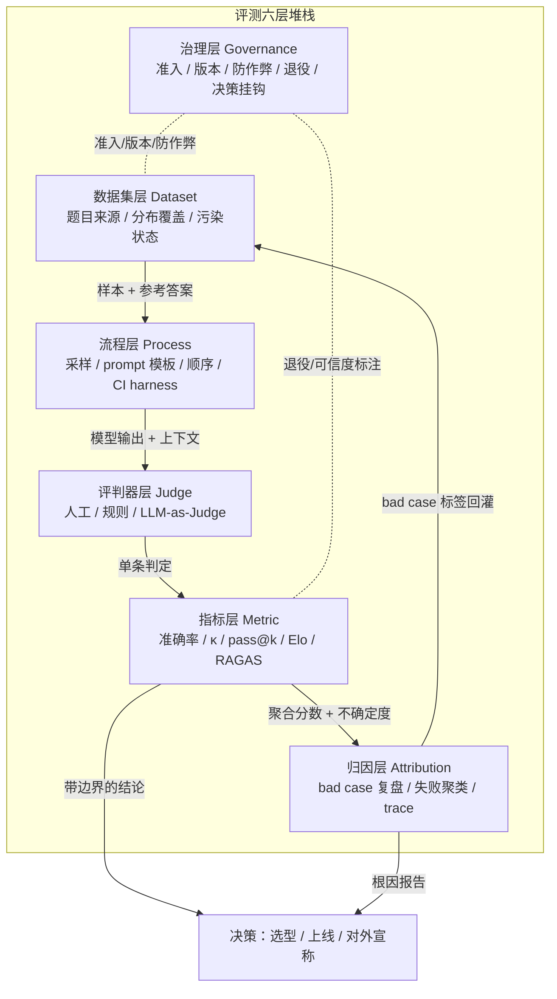

# S01 评测体系分层剖面

一句话定义：大多数人把"评测"当成一个名词——一个分数、一张排行榜、一句"我们 SWE-bench 跑了 70%"。本节点要解决的问题是：**当这个分数骗了你，你怎么知道是哪一环骗的？** 框架是把评测拆成六层可独立替换的堆栈——数据集层 / 指标层 / 评判器层 / 流程层 / 归因层 / 治理层——任何一个评测结论都能被映射到这六层上做 gap 分析与责任定位。这是 PM 的"评测解剖图"，也是 0412 专题的旗舰骨架。

## 0. 为什么是"六层堆栈"而不是"一条评测流水线"

业界谈评测，最常见的心智模型是**一条线性流水线**：准备数据 → 跑模型 → 算指标 → 出报告。这个视角对"如何把一次评测跑起来"很好用，但它有一个致命的 PM 盲区：**它把评测当成一次性动作，而不是一个长期维护的系统。** 流水线视角下，污染、Goodhart、bad case 无法复盘这些问题没有归属——它们发生在"流水线之间的缝隙里"，没有人对它们负责。

[c14 - 模型评估体系与 Goodhart 陷阱](/kb/基础知识库/c14-模型评估体系与-goodhart-陷阱/) 已经论证了评测会通胀、会被 Goodhart 化，并给出"自建黄金集 + 回归测试"的产品级防御；[m205 - RAG 生产环境：索引运维与评估体系](/kb/工程化与落地架构/m205-rag-生产环境-索引运维与评估体系/) 给出 RAGAS 四维与分层诊断逻辑；[m207 - Agent 产品化：场景推演与失败模式](/kb/工程化与落地架构/m207-agent-产品化-场景推演与失败模式/) 给出 Agent 七维评估。这三个节点各自正确，但都停在"用哪些指标 / 怎么测"，没有把评测本身**作为一个有接口契约、有责任边界、会随时间腐坏的系统**来解剖。

把"评测流程"（动态，一次跑批发生什么）和"评测系统"（静态，由什么可替换组件组成）分开看，得到**六层堆栈**：

| 层 | 名称 | 回答的问题 | 一句话职责 |
|---|---|---|---|
| L1 | **数据集层** | 拿什么测？ | 题目从哪来、覆盖什么分布、有没有被模型见过 |
| L2 | **指标层** | 怎么打分？ | 把"对不对/好不好"压缩成数字的函数 |
| L3 | **评判器层** | 谁来打分？ | 人工 / 规则 / LLM-as-Judge 给出判定的执行者 |
| L4 | **流程层** | 怎么跑、跑几次？ | 采样、prompt 模板、顺序控制、CI 集成、harness |
| L5 | **归因层** | 错在哪、为什么？ | 把聚合分数拆回到单条 bad case 的可复盘链路 |
| L6 | **治理层** | 谁信它、何时废弃？ | 准入、版本、防作弊、退役、与决策权挂钩 |

> **与流水线的关系**：流水线是六层在时间维度上的运行轨迹（一次跑批要穿过 L1→L4→L3→L2→L5，治理层 L6 横切全程）；六层是流水线背后的物质基础。每一层都是一个**可替换的工程位点**——PM 在面试、选型、复现时按这六层逐层拆问，就不会再被一个孤零零的分数牵着走。

这是组件视角，不是流程视角。它能挡住一个最常见的错误框架：**"换个更难的 benchmark 就能解决评测问题"**——那只动了 L1，而 Goodhart 在 L6、污染耦合在 L1×L3、bad case 无法复盘在 L5。换数据集修不了另外五层的病。

---

## 1. 全景图与接口契约

**接口契约**（每层之间必须有契约，否则不可替换、责任不可定位）：

| 上层 → 下层 | 接口形式 | 失败时的契约 |
|---|---|---|
| 数据集 → 流程 | 样本 + 参考答案 + 污染状态标签 | 污染状态未知时必须标 `contamination: unknown` 并降级结论 |
| 流程 → 评判器 | 模型输出 + 评判上下文（rubric / 参考答案） | prompt 模板敏感时报告对模板扰动的方差 |
| 评判器 → 指标 | 单条判定（标签 / 偏好 / 分数）+ 评判者一致性 | 评判者间一致性 < 阈值时拒绝聚合，先修 rubric |
| 指标 → 归因 | 聚合分数 + 置信区间 + 分层切片 | 只给点估计不给区间 = 接口违约 |
| 归因 → 数据集 | bad case 标签 + 失败类型 | 复盘出的新失败类型要回灌成新题目（闭环） |
| 治理 → 全层 | 准入规则 / 版本号 / 退役决策 / 可信度标注 | 任一层未登记版本 = 该结论不可用于对外宣称 |

把这张表打印出来贴墙上。**评测事故的根因，多半是某一行接口契约被悄悄违反了**——而不是"模型不够好"。〔此处"多半"系作者基于经验的定性判断，非统计比例，不要当成实测数据引用。〕

---

## 2. 数据集层（Dataset）：题目从哪来

**定义**：决定"拿什么测"——题目来源、分布覆盖、与待测模型训练数据的重叠状态。这是整个堆栈的地基，地基歪了上面五层全废。

**核心决策维度**：
- **公开 vs 私有 vs 自建**：公开 benchmark（MMLU/GSM8K/GPQA）可比但易污染；私有 held-out 集抗污染但不可比；自建黄金集贴业务但样本量小。
- **静态 vs 动态**：静态题库一旦发布就开始腐坏；动态/滚动题库（如 LiveBench、定期换题的 GSM1K 路线）以维护成本换抗污染。
- **分布覆盖**：题目分布是否覆盖真实流量分布？这是产品评测与学术评测的分水岭。

**典型失败模式（带数字接地）**：
- **饱和**：原始 MMLU（Hendrycks et al., ICLR 2021，57 学科）在 GPT-4 达 86.4%（2023-03）后，前沿模型停滞在 86–87%，判别力丧失；GSM8K 前沿模型已超 90%，GPT-5 系列据称接近 99%，对前沿比较完全饱和。一个饱和的数据集，下游所有层都白做。
- **污染**：Zhao et al.（2024）让模型猜 MMLU 被删掉的选项，ChatGPT/GPT-4 精确匹配率达 52%/57%——题目本身已进训练集的直接证据。SWE-bench Verified 人工筛查发现 32.67% 的成功 patch 涉及解答泄漏（解答直接在 issue 文本或评论里）。
- **分布错配**：MMLU-Pro（Wang et al., NeurIPS 2024）把选项从 4 扩到 10 后，GPT-4o 从 88.7% 跌到 72.6%（降 16 点），说明原始题主要在测"知识检索"而非"推理"——分布选错，测的根本不是你以为的能力。

**PM 问题清单**：
1. 这个数据集是哪年发布的？待测模型的训练数据截止在它之后吗？算给我看污染概率。
2. 题目分布和我的真实用户流量分布的 KL 距离有多大？还是说我在拿小学数学题评一个客服 Agent？
3. 饱和了吗？前沿模型分差是否已落入置信区间内（区分不开 = 该换题）？

**与下层接口**：数据集层向流程层交付「样本 + 参考答案 + **污染状态标签**」。污染状态是接口里最容易被省略的字段——一旦省略，评判器层和指标层就在为一个被污染的地基算精确的小数点。

---

## 3. 指标层（Metric）：怎么把"好不好"压成数字

**定义**：把单条/整批判定压缩成可比数字的函数。指标的选择本身就是一次"测什么"的价值判断——它决定了哪种错误被惩罚、哪种被忽略。

**核心指标族（按场景）**：

| 场景 | 主指标 | 关键陷阱 |
|---|---|---|
| 分类 / 标注 | Accuracy、F1、Cohen's κ、MCC | 类别不平衡时 Accuracy 虚高，须看 [Cohen Kappa 系数](/kb/基础知识库/cohen-kappa-系数/) |
| 一致性 | Cohen's κ、Fleiss' κ、Krippendorff's α | κ 悖论：高一致率仍可低 κ |
| 代码 / 任务 | pass@k、任务完成率 | 脚手架贡献被算成模型能力 |
| 偏好排序 | Elo / Bradley-Terry | 风格偏差污染、传递性假设被破坏 |
| RAG | RAGAS 四维（Faithfulness 等） | 维度间互斥（见 m205） |

**典型失败模式（带数字接地）**：
- **Accuracy 在不平衡下骗人**：内容审核里 99% 是正常内容，模型全判"正常"也有 99% Accuracy——这正是 [Cohen Kappa 系数](/kb/基础知识库/cohen-kappa-系数/) 存在的理由（机会校正后的真实表现）。
- **κ 悖论**：Feinstein & Cicchetti（1990）证明，当一类标签极度主导时，观测一致率高达 0.85，κ 仍可能很低，因为期望随机一致率 p_e 也高。只看原始一致率会系统性高估。
- **Elo 把风格当能力**：LMSYS 官方 Style Control 实验（2024-08-28）在 BT 回归里加入长度+markdown 协变量后，GPT-4o-mini 排名从第 6 跌到第 11，长度系数 0.249（远大于 markdown 的 0.019–0.031）——指标本身在奖励"啰嗦"。

**PM 问题清单**：
1. 这个指标在我的类别分布下会不会虚高？要不要并报 κ/MCC 给一个机会校正后的底数？
2. 指标给的是点估计还是带置信区间？没有区间的排行榜名次不可信。
3. 这个指标在奖励什么副作用（长度、格式、谄媚）？它会被 Goodhart 化吗（见 L6 与 [A06 Goodhart 与指标失效](/kb/专题-评测与度量/a06-goodhart-与指标失效/)）？

**与下层接口**：指标层向归因层交付「聚合分数 + **置信区间** + 分层切片」。只给一个点估计而不给区间和切片，就是接口违约——下游无法判断两个模型的差异是真实的还是噪声。

---

## 4. 评判器层（Judge）：谁来打分

**定义**：给出单条判定的执行者——人工标注者、规则/单元测试、或 LLM-as-Judge。这是过去两年变化最剧烈的一层（详见 [A04 LLM-as-Judge](/kb/专题-评测与度量/a04-llm-as-judge/) 与 [A05 人工评测与标注一致性](/kb/专题-评测与度量/a05-人工评测与标注一致性/)）。

**三类评判器对照**：

| 评判器 | 成本 | 可扩展性 | 主要风险 |
|---|---|---|---|
| 人工标注 | 高 | 差 | 标注者间一致性低、主观漂移 |
| 规则 / 单测 | 低 | 好 | 只能判可形式化的对错 |
| LLM-as-Judge | 中 | 好 | 位置/冗长/自我增强偏差 |

**典型失败模式（带数字接地）**：
- **位置偏差**：Zheng et al.（2023，MT-Bench）测得交换回答顺序后 GPT-4 的一致率约为 65%（即换序后约 35% 的判定发生改判，此 ~35% 系从原文">60% 一致率"换算而来，参见 Zheng et al. 2023 Table 4，非论文直接给出的改判率数字）；Claude-v1 一致性仅 23.8%。代码评测中仅靠换序就能造成显著（论文称 >10%〔待核实精确数字〕）的准确率波动（Shi et al., 2025，"Judging the Judges"，arXiv:2406.07791，第一作者 Lin Shi，15 个裁判 / >150,000 实例）。
- **冗长偏差**：MT-Bench"重复列表"攻击中，GPT-3.5/Claude-v1 对故意啰嗦回答的失败率均达 91.3%，GPT-4 仅 8.7%。
- **自我增强偏差**：GPT-4 给自己输出打分胜率高约 10%，Claude-v1 高约 25%（Zheng et al., 2023，MT-Bench；原文亦提示因数据有限、差异较小，尚无法断言为确证的偏差）。这一偏好的机制后由 Wataoka et al.（2024，"Self-Preference Bias in LLM-as-a-Judge"，arXiv:2410.21819）跨 8 个 LLM 进一步刻画为困惑度效应——评判者系统性高估与自身风格相近（困惑度更低）的文本，不限于自生成内容。
- **能力天花板**：JudgeBench（Ye et al., 2024）显示 GPT-4o 等强模型在高难度判断对上仅略好于随机猜测——**弱评判器无法可靠评判比自己强的模型**。

**PM 问题清单**：
1. 用 LLM-as-Judge 时，有没有做 AB 顺序交换、只计双向一致的判定（Zheng 2023 标准做法）？
2. 评判器自己能答对这道题吗？（JudgeBench：评判者答题能力是其评判准确性的强预测变量）
3. 人工评判的标注者间一致性是多少？低于 κ≥0.67 阈值时，是数据难还是 rubric 烂？

**与上下层接口**：评判器层从流程层接收「模型输出 + 评判上下文」，向指标层交付「单条判定 + **评判者一致性**」。一致性低于阈值时应拒绝聚合——先修 rubric，否则指标层是在为噪声算平均。

---

## 5. 流程层（Process）：怎么跑、跑几次

**定义**：把数据集、评判器、指标编织成可重复执行的流水线——采样策略、prompt 模板、顺序控制、重复次数、CI/CD 集成、评测 harness。这一层最像 [S01 Agent 六层架构剖面](/kb/专题-安全对齐与失败/s01-agent-六层架构剖面/) 里的"执行层"，也最容易被当成"不就是写个脚本"而被低估。

**核心组件**：
- **prompt 模板与 few-shot 配置**：同一道题不同模板，分数能差好几个点（MMLU 模板敏感度 ~5%，MMLU-Pro 降到 ~2%）。
- **采样控制**：temperature、重复采样次数、pass@k 的 k 取值。
- **评测 harness 标准化**：SWE-bench 的脚手架工程对分数贡献巨大——OpenAI 已承认 scaffolding（非模型能力）严重影响 Verified 分数。
- **CI 集成**：把黄金集回归测试挂进 CI/CD（m205 的工程实践）。

**典型失败模式（带数字接地）**：
- **harness 不标准导致排行榜失真**：以 Claude Opus 4.5 为例，它在 SWE-bench Verified 上约 80.9%，而在更长上下文、跨文件且经标准化脚手架的 SWE-bench Pro 上仅 45.9%（来源：Scale SEAL SWE-bench Pro 榜，Opus 4.5 以标准脚手架 45.9% 为当时最高分；Verified 80.9% 见 Anthropic 公布）。同一个"编码能力"，换个 harness、换个题集就接近腰斩。〔注：早期草稿曾把 93.9% / 45.9% 并列归于"Claude Mythos Preview"，经核实 45.9% 对应 Opus 4.5；"Mythos Preview"的 Pro 成绩未经独立确认，已删除该归因。〕
- **CoT 提示改变结论**：MT-Bench 数学评分默认提示失败率 70%，加 CoT 降到 30%，加参考答案降到 15%——流程层一个开关，结论天翻地覆。
- **重复采样不足**：单次采样的分数方差大，把噪声当成模型差异。

**PM 问题清单**：
1. 这个分数是用谁的 harness 跑的？换我的 harness 还成立吗？（别拿别人脚手架的分当模型能力）
2. prompt 模板固定了吗？报告对模板扰动的方差了吗？
3. 评测进 CI 了吗？还是上线前手动跑一次的"仪式"？

**与上下层接口**：流程层从数据集层取「样本」，向评判器层交付「模型输出 + 评判上下文」。流程层的可重复性是整个堆栈可信度的前提——流程不可重复，上面所有数字都是一次性的。

---

## 6. 归因层（Attribution）：错在哪、为什么

**定义**：把聚合分数拆回到单条 bad case，给出可复盘的失败链路与根因聚类。**这是六层里最常缺失、也最被低估的一层**——大多数团队有"分数"却没有"为什么是这个分数"。

**核心组件**：
- **bad case 复盘链路**：从一个错误判定能否一键回溯到「输入 → 模型输出 → 评判依据 → 错误类型」。
- **失败聚类**：把成百上千的 bad case 聚成几类系统性失败模式（对应 m207 的六类失败模式）。
- **分层切片**：按题型/难度/语言/用户段切片，看分数差异藏在哪一层。
- **闭环回灌**：复盘出的新失败类型要回流成数据集层的新题目。

**典型失败模式**：
- **只有分数没有 trace**：上线后投诉来了，查不到是哪类输入触发的，迭代靠玄学——这是归因层缺失的直接代价。
- **平均数掩盖灾难**：整体 85%，但"涉及金额的请求"准确率只有 40%——分层切片不做，这个致命子集永远不会暴露。
- **bad case 不回灌**：复盘了，但没变成新题，下次同样的错再犯一遍，评测系统不进化。

**PM 问题清单**：
1. 给我看三条最严重的 bad case，从输入到判定的完整 trace。看不了 = 归因层没建。
2. 失败聚成了几类？每类的占比和趋势？（这是把评测转成产品 roadmap 的接口）
3. 上个月复盘出的 bad case，有几条变成了这个月的新题目？

**与上下层接口**：归因层从指标层接收「分数 + 切片」，向数据集层回灌「bad case 标签 + 失败类型」。**这条回灌边是整个堆栈唯一的闭环**——没有它，评测就是开环的"出分数"，而不是闭环的"持续变强"。

---

## 7. 治理层（Governance）：谁信它、何时废弃

**定义**：决定一个评测结论能否被信任、被用于哪些决策、何时退役——准入规则、版本管理、防作弊、退役机制、以及"评测分数与决策权的挂钩关系"。这是把评测从"技术活动"升级为"组织制度"的一层。

**核心组件**：
- **准入与版本**：每个评测集有版本号；改了题、改了 rubric 必须升版，否则跨时间分数不可比。
- **防作弊与防 Goodhart**：一旦某指标成为优化目标（KPI），它就开始失去测量效力。
- **退役机制**：饱和的、被污染的评测集要主动退役，而不是继续挂在排行榜上误导决策。
- **决策挂钩**：明确"这个分数能用来做什么决策、不能做什么"。

**典型失败模式（带数字接地）**：
- **排行榜可被系统性操纵**：'The Leaderboard Illusion'（Singh et al., arXiv 2504.20879, 2025）记录 Meta 在 Llama-4 发布前私测 27 个变体并可选择性披露最高分；把 Arena 训练数据比例从 0% 提到 70%，ArenaHard 胜率从 23.5% 升到 49.9%（相对 +112%），而 MMLU 等 OOD 指标同期略降——纯过拟合排行榜分布。
- **悄然废弃破坏可比性**：同研究称 243 个公开模型中 205 个被"悄然废弃"，破坏了 Bradley-Terry 模型的传递性假设。
- **缓解策略效果存疑**：'The Emperor's New Clothes in Benchmarking'（ICML 2025, arXiv 2503.16402）系统测试多种污染缓解策略，并提出 fidelity（保真）与 contamination resistance（抗污染）两个新指标，指出此前常用的 accuracy drop / accuracy matching 仅看聚合准确率、易得出片面结论。其核心结论是：**在该框架下，没有一种策略在所有 benchmark 上显著优于"不更新题库"（vanilla）的基线，也没有一种能同时兼顾保真与抗污染**〔以上为原文 abstract 的概括，精确措辞与具体小节待查原文〕。治理层不能假装有银弹。

**PM 问题清单**：
1. 这个分数是谁报的？报的人有没有动机选择性披露？（厂商自报分天然有偏）
2. 这个评测集多久没退役/换题了？它还在测能力还是在测记忆？
3. 我准备拿这个分数做什么决策？这个决策的可逆性配得上这个分数的可信度吗？

**与全层接口**：治理层横切六层，向每一层注入「版本号 / 准入规则 / 退役决策 / 可信度标注」。任一层未登记版本，该结论就不可用于对外宣称——这是治理层对其余五层的强制契约。

---

## 8. 判断主轴：六层之间的三个致命耦合点

> **判断先行**：把六层逐层描述清楚是综述写法。**真正区分"PM 顶刊"和"评测教程"的，是看出哪些层间耦合一旦设计错，就让相邻层的全部努力归零。** 下面是 90% 的人在搭第一套评测体系时会搞错的三个耦合点。每个配【症状 → 为什么会错 → 正确做法 → 真实反例】四件套。

### 耦合点 1：评判器层 × 数据集层的"污染耦合"

**症状**：团队用 GPT-4 当 LLM-as-Judge，去评测 GPT-4 自己生成的、且 benchmark 题目本身就在 GPT-4 训练集里的输出——三方同源，分数高得漂亮，上线后崩。评判器、被测模型、数据集三者共享了同一份训练语料的污染。

**为什么会错**：直觉上"用最强的模型当裁判最准"，所以默认抓 GPT-4 来评。但这忽略了一个二阶效应——**当裁判、选手、考题来自同一个数据分布时，污染会被放大而不是抵消**。裁判会偏爱与自身风格相近的输出（自我增强偏差：GPT-4 给自己输出胜率约 +10%，Zheng et al. 2023；其困惑度机制由 Wataoka et al. 2024 刻画），而被污染的题目又让"答对"本身失去意义。两个污染源在评判器×数据集的接口上叠加。

**正确做法**：
- 评判器与被测模型**跨厂商交叉**：测 GPT 系列用 Claude 当裁判，反之亦然，避免同源自我增强。
- 数据集打上污染状态标签（L1 接口契约），被污染的题目从 LLM-as-Judge 流程中剔除或降权。
- 高风险结论用规则/单测评判器（无污染倾向）做交叉验证，不单押 LLM-as-Judge。

**真实反例**：G-Eval（Liu et al., EMNLP 2023，arXiv:2303.16634）在确立 LLM 评判可行性（GPT-4 在摘要任务上 Spearman 相关达 0.514）的同时，其原文也**明确提示了 LLM 评判者对 LLM 生成文本的偏向风险**（abstract 原话："a bias towards the LLM-generated texts"）——这与评判器×数据来源同源时偏差被放大的判断一致；至于该偏好的系统性量化刻画，则见前述 Wataoka et al. 2024。SWE-bench Verified 的 32.67% 解答泄漏则是数据集侧污染的对照样本：两侧污染一旦在接口处相遇，分数完全失真。

### 耦合点 2：归因层缺失 → bad case 无法复盘的"断链耦合"

**症状**：评测体系只有 L1–L4（出分数），没建 L5（归因）。整体准确率 88% 看着能上线，上线后投诉涌入，PM 想知道"是哪类请求在出错"，却发现评测系统只留了一个聚合数字，没留单条 trace——查不到根因，只能拍脑袋打补丁。

**为什么会错**：归因层在 demo 阶段完全"看不见价值"——demo 只需要一个好看的分数。所以资源紧张时它第一个被砍。但**归因层是把"评测"和"产品迭代"连起来的唯一桥梁**：没有它，评测是开环的"出分数仪式"，分数高低都无法转化为下一步该改什么。它的价值不在评测当下，而在出问题之后——而那时再补已经晚了，因为历史 trace 没留。

**正确做法**：
- 评测 harness 从第一天就**强制留存单条 trace**（输入 → 输出 → 评判依据 → 错误类型），不是事后加。
- 分层切片是默认动作而非可选项——按题型/难度/语言/用户段切，让"平均数掩盖的灾难子集"无处藏（整体 88% 但金额相关请求仅 40% 的那种）。
- 建立 bad case → 新题目的回灌闭环，让每次复盘都让数据集层进化（对应 [A08 Eval-driven Development](/kb/专题-评测与度量/a08-eval-driven-development/) 的核心实践）。

**真实反例**：m205（[m205 - RAG 生产环境：索引运维与评估体系](/kb/工程化与落地架构/m205-rag-生产环境-索引运维与评估体系/)）的分层诊断逻辑——"检索指标差先修检索；检索好生成差修 Prompt；都好业务仍差重审指标定义"——本质就是一套归因层协议。没有这套协议的 RAG 项目，拿到 RAGAS 四维分数也不知道该动哪里，这是归因层缺失的典型代价。

### 耦合点 3：指标层 × 治理层的"Goodhart 耦合"

**症状**：团队把某个 benchmark 分数设成 OKR/KPI，工程师开始针对它做 SFT、调 prompt 模板、甚至私测筛变体。三个月后分数从 70 涨到 85，但真实用户体验毫无改善甚至下降——指标涨了，能力没涨。

**为什么会错**："Goodhart 定律"——**一旦某指标成为优化目标，它便失去测量效力**——在文献里人人会背，但在组织里几乎人人会犯。错因在于把它当成 L2 指标层的技术问题（"换个更难的指标"），而它其实是 L2×L6 的**制度问题**：指标一旦与考核/晋升/对外宣称的决策权挂钩（治理层职责），优化压力就会沿着接口灌进指标层，把指标蛀空。换更难的指标只是把 Goodhart 推迟，不是消除。

**正确做法**：
- 治理层把评测集**分成"公开练习集"和"封闭考核集"**：练习集可优化，考核集只在发版前跑且绝不暴露给训练流程（MMLU-CF 封闭测试集的思路，微软 ACL 2025）。
- 考核集定期换题/退役（L6 退役机制），让"针对性过拟合"的边际收益归零。
- 把单一指标 KPI 改为**多指标 + held-out 场景**组合，并显式声明"此分数不用于个人考核"——切断优化压力的灌入路径。

**真实反例**：'The Leaderboard Illusion'（Singh et al., 2025）的过拟合实验是 Goodhart 的实证标本：Arena 训练数据 0%→70%，ArenaHard 胜率 +112% 而 OOD 的 MMLU 略降——指标被当目标后，分数与能力彻底脱钩。c14（[c14 - 模型评估体系与 Goodhart 陷阱](/kb/基础知识库/c14-模型评估体系与-goodhart-陷阱/)）已警告过这一点，但它停在"自建黄金集防御"；本节点把它定位为 L2×L6 的接口病，给出"练习集/考核集分离 + 切断决策挂钩"的治理级解法。

### 这三个耦合点的元规则

**单层错误可以"换组件"修掉（换个数据集、换个指标）；层间耦合错误必须"重写两层接口"。** 污染耦合要同时改数据集准入和评判器选型；断链耦合要同时改 harness 留存和数据集回灌；Goodhart 耦合要同时改指标设计和治理制度。这就是为什么评测体系的架构决策必须在搭建早期定，事后补的成本是 10 倍。

---

## 9. 产品 PM 视角的"看走眼"——工程 PM 之外的盲区

> 上面三个耦合点都是**工程/方法论视角**的看走眼。但 PM 看走眼概率最高的，其实在用户心理模型与合规层面。本节点早期容易把"评测 PM"狭义化为"会看 benchmark 的工程 PM"，这里显式补足。

**盲区 1：用户对"准确率"的心理模型 ≠ 工程指标的"准确率"**
- **症状**：产品页写"准确率 95%"，用户的心理模型是"100 次里只有 5 次出错，且出错无所谓的小事"。但工程的 95% 是在某个分布上的平均；用户高频遇到的恰是那 5% 的灾难子集（涉及金额、涉及不可逆操作），于是"95% 准确"的产品被骂成"完全不能用"。
- **为什么 PM 容易看走眼**：工程视角看，95% 是真实的、可证伪的、honest 的数字；产品视角看，**"准确率"这个词本身在用户脑中触发了一个错误的心理模型**——用户不会按分布加权理解概率，他们按"我遇到的那几次"理解。
- **正确做法**：对外不裸报单一准确率，而是**按用户感知的关键子集分层报**（"涉及付款的操作准确率 99.9%，闲聊准确率 90%"）；在高后果场景显式设置兜底与 HITL；把"用户感知到的失败率"作为产品指标，与工程准确率解耦——这是归因层（L5）分层切片向产品侧的延伸。

**盲区 2：合规审计要的不是"分数"，是"可追溯的评测证据链"**
- **症状**：to C 跑得好的评测体系，搬到 to B / 受监管行业（金融、医疗、安全）被合规卡住——客户/监管要的不是"你 SWE-bench 70%"，而是"你怎么证明这个模型在我的场景下被系统性测过、bad case 有记录、有责任归属"。Rick 所在的安全与国际化领域，这一关尤其硬。
- **为什么 PM 容易看走眼**：工程视角看，评测是"算分数"；合规视角看，**评测是"举证"**——证据链（哪些题、谁评的、版本几、bad case 怎么处置）比分数本身重要。
- **正确做法**：把治理层（L6）的版本管理、bad case 处置记录、评判流程文档**当作产品能力而非事后补丁**来设计；评测报告对受监管客户输出的是"可审计的证据包"而非"一个数字"；国际化场景还要考虑评测集的语言/文化覆盖（Arena 数据 77% 英语、5% 中文的 WEIRD 偏差，Chiang et al. 2024，直接影响非英语市场的评测可信度）。

**元规则**：工程视角的看走眼可以"换指标/换数据集"修复；产品与合规视角的看走眼必须"换评测制度形态"修复——成本差 100 倍。这是 PM 在评测体系设计早期介入的核心价值。

---

## 10. 对手框架回应

**反方立场（业界真实声音）：「与其在六层堆栈上做精细治理，不如直接换一个更难、更新的 benchmark——GPQA、MMLU-Pro、SWE-bench Pro 这些新题难度足够高，污染问题自然就解决了。」** 这是大量从业者和媒体的默认直觉，也有强证据支撑：MMLU-Pro 把 GPT-4o 从 88.7% 拉回 72.6%，GPQA Diamond 重新拉开了人机差距，看起来"提高难度=恢复判别力"。

**接受的部分**：这个立场对的地方很硬——提高难度确实能临时恢复判别力，更难的题确实让 CoT 这类真推理能力显形（MMLU-Pro 上 CoT 带来 +15–19%，原始 MMLU 上几乎为零）。在"前沿模型已把旧 benchmark 跑饱和"的当下，换更难的题是必要的止血。本专题不反对换题。

**坚持的边界与赌注**：但"换更难的题"只动了 L1 数据集层，治不了另外五层的病。决定性证据是 'The Emperor's New Clothes in Benchmarking'（ICML 2025, arXiv 2503.16402）：系统测试 20 种污染缓解策略（含提高难度路线），**没有一种显著优于"什么都不做"**——难度提升 ≠ 污染免疫。GPQA 也已从 39%（2023-11）爬到 94%+（2026 初），重新饱和在即。我赌的是：**评测的根本问题不在"题不够难"，而在"评测没被当成一个有治理、有归因、有版本的系统来维护"**。换题是把饱和时钟往后拨几个月；六层治理才是让评测体系持续可用的唯一路径。这个赌注会在一个场景下失效——如果未来出现"可证明抗污染且保真"的动态题库生成技术，那么 L1 层的自动化或许能替代大部分 L6 治理工作；但截至目前（ICML 2025 结论），这样的技术不存在。

**failure scenario 显式标注**：本节点"六层都要建"的主张，在**早期/小团队 MVP 阶段会失效**——一个还在找 PMF 的产品，强行搭六层评测会拖死迭代速度。此时正确做法是只建 L1（几十条真实场景黄金集）+ L5 的最简版（留 trace），其余四层延后。把六层当成"成熟度阶梯"而非"开工清单"，否则就是另一种过度工程。

---

## 11. 跨域呼应：从"系统分层"到"评测作为社会-技术系统"

**调度资源一：软件工程的"分层架构 + 接口契约"（OSI / 关注点分离）。** 本节点的全部说服力都建立在一个移植上——把网络协议栈的 OSI 分层思想搬到评测上。OSI 模型的核心洞察不是"分七层"，而是**"每层只对相邻层暴露契约，层内实现可独立替换，故障可定位到具体层"**。这恰恰反驳了评测领域最流行的滑变：把评测当成一个不可分的黑箱"分数"。一旦接受分层+契约视角，"换个更难的 benchmark 就解决问题"这种说法立刻暴露破绽——它只换了 L1 的实现，却没动 L2–L6 的契约。接口契约表（§1）就是这个移植的产物：它让"评测事故"从一句模糊的"模型不行"，变成可定位到具体接口违约的工程问题（"L1→L4 接口的污染状态字段被省略了"）。这个跨域不是装饰——它是本节点能成立的地基。

**调度资源二（破 echo chamber，Rick 未必熟的对手框架）：Goodhart 定律的社会学升级版——Marilyn Strathern 的表述。** 人类学家 Marilyn Strathern（1997，"'Improving ratings': audit in the British University system"）把经济学的 Goodhart 定律重述为更锋利的一句：**"When a measure becomes a target, it ceases to be a good measure."**〔此句的精确措辞与出处建议核实，常被归于 Strathern 1997 一文〕。Strathern 的贡献不只是换了个说法，而是把它放进**审计社会学（audit society）**——她研究的是英国大学的评估制度如何异化教学。这个框架对本专题的逼问是：**评测层（L6 治理）从来不只是技术问题，它是一套权力装置**。当评测分数与晋升、预算、对外宣称挂钩，被评测者就会重组自己的行为去迎合度量，而不是去实现度量本应代表的真实目标——这正是 §8 耦合点 3「Goodhart 耦合」在组织层面的根源。Strathern 的视角把"为什么换更难的指标也没用"解释得比纯技术分析更深：因为问题不在指标的难度，而在**度量与权力的耦合关系**本身。这也呼应了 Rick 已有的 [AI概念滥用反思](/kb/基础知识库/ai概念滥用反思/) 里"评估失效源于评估工具本身的认知/制度偏差"的洞察。这个框架我赌它成立的边界是：它解释"为什么会 Goodhart"，但不直接给"怎么治理"的操作方案——操作方案仍要回到 §7 的"练习集/考核集分离"等技术-制度组合拳。

---

## PM 决策启示

**面试时**：被问"你怎么评估一个 AI 产品的质量"，别答"我们看准确率"。把六层画出来——数据集/指标/评判器/流程/归因/治理。然后被追问任何一层都能展开 5 分钟，被追问"你踩过哪个坑"就讲三个致命耦合点之一。这是从"会看 benchmark"到"懂评测体系"的分水岭回答。

**选型时**：拿一个候选模型/供应商的评测宣称，逐层质询：①这分数用谁的数据集（污染状态）？②什么指标、带区间吗？③谁评的（自报还是第三方）？④用谁的 harness？⑤能给我看 bad case trace 吗？⑥这个评测集多久没退役了？六问问完，"为什么我不信你这个 70%"就有了证据，而不是直觉。

**复现时**：搭自己的评测体系按成熟度阶梯走——MVP 阶段先 L1（几十条真实黄金集）+ L5 最简版（留 trace）；成长期补 L2/L3/L4 的标准化与 CI 集成；规模化后补 L6 治理（练习/考核集分离、版本、退役）。别一上来搭六层，也别永远只有一个分数。

---

## 与已有节点的关系

本节点对已有节点的关系是**抽象层升高 + 整合视图**：把散落在 c14/m205/m207 里的评测知识，拉到"评测作为可分层、可定位责任的系统"这一更高抽象层。

- **对 [c14 - 模型评估体系与 Goodhart 陷阱](/kb/基础知识库/c14-模型评估体系与-goodhart-陷阱/)**（升级对照-深化+纠偏）：c14 给出 benchmark 通胀、LLM-as-Judge 三偏见、Goodhart 产品级防御、六维业务指标矩阵——这些是本节点 L1/L2/L3/L6 的**内容填充**。c14 的框架停在"防御 Goodhart"，把 Goodhart 当成一个要绕开的陷阱；本节点把它**重新定位为 L2×L6 的接口耦合病**，并给出"练习集/考核集分离 + 切断决策挂钩"的治理级解法，升高了一个抽象层。不复述 c14 的事实基础。
- **对 [m205 - RAG 生产环境：索引运维与评估体系](/kb/工程化与落地架构/m205-rag-生产环境-索引运维与评估体系/)**（升级对照-抽象化）：m205 的 RAGAS 四维属 L2，分层诊断逻辑属 L5 归因层的一个具体实例。本节点把 m205 的"如何测 RAG"抽象成"任何评测都要有归因层闭环"的通用契约——m205 是本节点 L5 的领域特例。
- **对 [m207 - Agent 产品化：场景推演与失败模式](/kb/工程化与落地架构/m207-agent-产品化-场景推演与失败模式/)**（升级对照-映射）：m207 的六类失败模式与 Agent 七维评估，是本节点 L5 归因层"失败聚类"的具体落地，七维指标属 L2。本节点提供了把 m207 的列举式指标挂回六层堆栈做责任定位的框架。
- **对 [Cohen Kappa 系数](/kb/基础知识库/cohen-kappa-系数/)**（升级对照-定位）：Kappa 节点是纯统计工具解释（L2 指标层的一个组件）；本节点给出"何时该在 L2 选 κ"的决策入口（类别不平衡 + 评判器一致性度量），并把它接到 L3 评判器层的"标注者间一致性"接口上。
- **对 Agent 产品评估的五个具体问题**（升级对照-骨架化）：五问是评估方法论的 PM 工作版，多落在 L5/L6；本节点给五问提供了"挂在哪一层"的骨架。

---

## 关联节点

**核心关联（必读）**：
- [c14 - 模型评估体系与 Goodhart 陷阱](/kb/基础知识库/c14-模型评估体系与-goodhart-陷阱/)——本节点 L1/L2/L3/L6 的内容填充，被升高一个抽象层
- [m205 - RAG 生产环境：索引运维与评估体系](/kb/工程化与落地架构/m205-rag-生产环境-索引运维与评估体系/)——L5 归因层 + L2 RAGAS 的领域特例
- [m207 - Agent 产品化：场景推演与失败模式](/kb/工程化与落地架构/m207-agent-产品化-场景推演与失败模式/)——L5 失败聚类 + L2 Agent 七维的具体落地
- [A02 评测对象层级辨析·模型／系统／产品／Agent eval](/kb/专题-评测与度量/a02-评测对象层级辨析-模型／系统／产品／agent-eval/)——评测对象的四层，与本节点的系统六层正交互补
- [A03 Benchmark 与数据污染](/kb/专题-评测与度量/a03-benchmark-与数据污染/)——L1 数据集层的深度展开
- [A04 LLM-as-Judge](/kb/专题-评测与度量/a04-llm-as-judge/)——L3 评判器层的深度展开
- [A06 Goodhart 与指标失效](/kb/专题-评测与度量/a06-goodhart-与指标失效/)——§8 耦合点 3 的概念基础

**延伸关联（可选）**：
- 概念卡：[Cohen Kappa 系数](/kb/基础知识库/cohen-kappa-系数/)、[幻觉](/kb/基础知识库/幻觉/)、[RAG](/kb/基础知识库/rag/)、[Embedding](/kb/基础知识库/embedding/)、[SFT](/kb/基础知识库/sft/)、[RLHF](/kb/基础知识库/rlhf/)、[Test-Time Compute](/kb/基础知识库/test-time-compute/)、[Constitutional AI](/kb/基础知识库/constitutional-ai/)
- 章节：[c11 - System 2 思维与 Test-Time Compute](/kb/基础知识库/c11-system-2-思维与-test-time-compute/)、[c13 - 幻觉的不可消除性](/kb/基础知识库/c13-幻觉的不可消除性/)、[c01 - 认知重构：从确定性系统到概率系统](/kb/基础知识库/c01-认知重构-从确定性系统到概率系统/)
- 同专题：[A01 评测概念史与语义流变](/kb/专题-评测与度量/a01-评测概念史与语义流变/)、[A05 人工评测与标注一致性](/kb/专题-评测与度量/a05-人工评测与标注一致性/)、[A07 Red Teaming 作为评测实践](/kb/专题-评测与度量/a07-red-teaming-作为评测实践/)、[A08 Eval-driven Development](/kb/专题-评测与度量/a08-eval-driven-development/)
- 实操/方法：Agent 产品评估的五个具体问题、Rick 写作 SABCD 评级体系（人文评估 rubric 的对照案例）
- 公司/产品：[OpenAI](/kb/ai-公司与产品/openai/)、[Anthropic](/kb/ai-公司与产品/anthropic/)、[Claude](/kb/ai-公司与产品/claude/)、[Gemini](/kb/ai-公司与产品/gemini/)、[DeepSeek](/kb/ai-公司与产品/deepseek/)
- 跨域/反思：[AI概念滥用反思](/kb/基础知识库/ai概念滥用反思/)
- 总索引：[AI PM 知识图谱·总索引](/kb/ai-pm-知识图谱/ai-pm-知识图谱-总索引/)

## 修订日志

- **R0（2026-06-06）初稿**：建立六层堆栈（数据集/指标/评判器/流程/归因/治理）+ 接口契约表；§8 判断主轴三个致命耦合点（污染耦合 / bad case 断链耦合 / Goodhart 耦合），每点【症状→为什么错→正确做法→真实反例】四件套；§9 产品 PM 视角两盲区（准确率心理模型 / 合规证据链）；§10 对手框架"换更难 benchmark"的接受+边界回应（接 ICML 2025 'Emperor's New Clothes'）+ failure scenario（MVP 阶段勿建六层）；§11 跨域呼应（OSI 分层契约移植 + Strathern 审计社会学版 Goodhart）；与 c14/m205/m207/Cohen Kappa 的显式升级对照；关联节点分核心/延伸两档。**待后续轮次处理**：①"Claude Mythos Preview"型号名称待核实；②Strathern 1997 引文精确措辞待核实；③grounding pass 逐条复核数字；④双链 resolve 复检（A 系列同专题节点入库后路径确认）。
