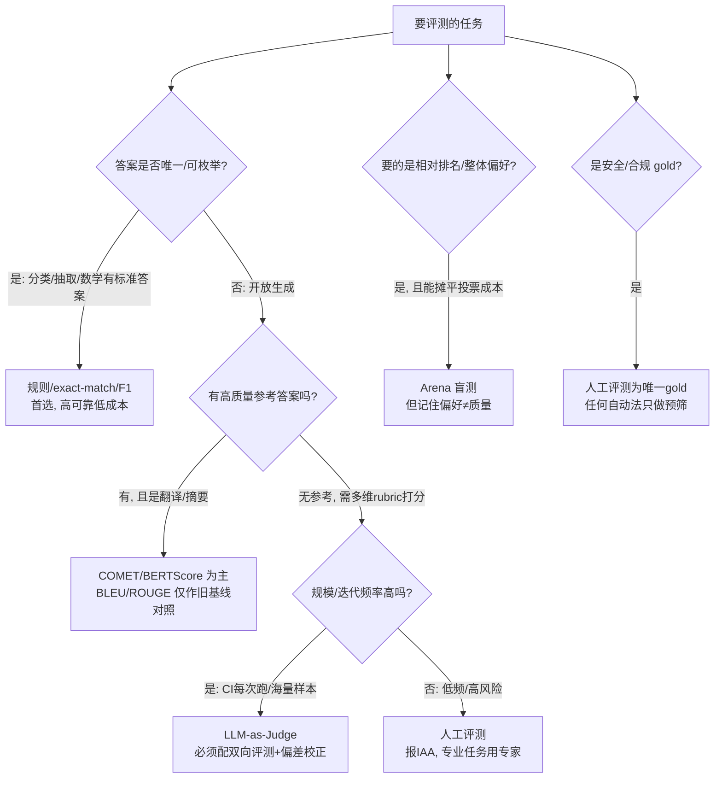

当一个 PM 要给某个 LLM 功能"立一套评测"时，他面对的第一个分叉不是"用哪个 benchmark"，而是更上一层的**方法论选型**：是用规则对答案（exact-match/BLEU/ROUGE），用模型算语义相似（BERTScore/COMET），让大模型当裁判（LLM-as-Judge），雇人打分（human eval），还是上盲测竞技场（arena）？这五六种流派不是"准确度的高低排序"，而是在**成本、可扩展性、可靠性、可解释性、抗污染性、适用对象**这六个维度上做了根本不同取舍的工具。本节点用一张对照矩阵 + 一棵"任务×约束→选哪种"的决策树，论证一个反共识判断：**评测没有银弹，任何把单一方法当默认答案的选型都是错的；正确的产出不是"最好的评测法",而是"针对当前任务约束的评测法组合"**。这是个问题陈述——不是告诉你 LLM-as-Judge 最好，而是告诉你"什么时候它会害死你"。

---

## §0 为什么是"六维取舍"框架，而不是"准确度排序"框架

最自然的默认框架是把评测法排成一条准确度光谱：human eval 最准 → LLM-as-Judge 次之 → 规则法最糙，然后"能用人就用人，预算不够往下降级"。这个框架会让你在两个地方栽跟头。

第一，它**把多维问题压成一维**。human eval 在"可靠性"上未必最高——在专家级领域（法律、医疗），人机一致率与领域专家互评基线都会显著下滑（具体数字与一致性悖论由 [A05 人工评测与标注一致性](/kb/专题-评测与度量/a05-人工评测与标注一致性/) 详述并接地，本节点不复述）。人评的"金标准"地位在主观/专业任务上是被高估的。把"人最准"当公理，本身就是一个未经检验的构念假设。

第二，它**忽略了维度之间的不可调和冲突**。规则法（exact-match）可靠性极高、成本极低、可解释性满分——对"分类是否正确"这类有唯一答案的任务，它吊打 LLM-as-Judge。但对开放式生成，它的**效度**几乎为零（改一个同义词就判错）。"准确度排序"框架无法解释"为什么一个又糙又老的 exact-match 在某些任务上比 GPT-4 裁判更值得信"。

所以本节点选**六维取舍矩阵**：把每种方法在六个正交维度上的得分摊开，让冲突显形。这样得到的不是排名，而是**映射**——给定任务类型（封闭/开放/偏好/安全）× 约束（预算/时延/可解释要求/迭代频率），落到矩阵的哪一格。框架的产出是决策树，不是冠军榜。

> [!note] 一个口径澄清
> 本节点谈的是**评测方法（怎么测）**，不是**评测对象（测什么）**——后者见 [A02 评测对象层级辨析·模型／系统／产品／Agent eval](/kb/专题-评测与度量/a02-评测对象层级辨析-模型／系统／产品／agent-eval/)。同一种方法（如 LLM-as-Judge）可以测模型、测系统、测 Agent；同一个对象可以被多种方法测。两个维度正交，别混。

---

## §1 六法对照矩阵：把取舍摊开

先给主表。评分用相对刻度（高/中/低），不是绝对值；"适用对象"指这种方法**天然契合**的任务形态。

| 方法流派 | 代表实现 | 成本 | 可扩展性 | 可靠性 | 可解释性 | 抗污染性 | 天然适用对象 |
|---|---|---|---|---|---|---|---|
| **规则/精确匹配** | exact-match, accuracy, F1 | 极低 | 极高 | 高（限封闭任务） | 高（确定规则） | 中（题库可泄漏） | 分类/抽取/有唯一答案 |
| **参考匹配（n-gram）** | BLEU, ROUGE | 低 | 极高 | 中→低 | 中 | 中 | 翻译/摘要（有参考答案） |
| **模型语义相似** | BERTScore, COMET | 中 | 高 | 中 | 低（黑箱嵌入） | 中 | 翻译/语义改写 |
| **LLM-as-Judge** | GPT-4 judge, G-Eval, Prometheus | 中 | 高 | 中（带系统偏差） | 中（可出 rationale） | 中→低（裁判自身可被污染） | 开放生成/多维 rubric |
| **人工评测** | 专家/众包标注 + IAA | 高 | 低 | 中→高（依任务） | 高（人能说理由） | 高（新题不泄漏） | 主观/专业/安全 gold |
| **Arena 盲测** | Chatbot Arena/LMArena, BT/Elo | 中（摊薄） | 高 | 中（偏好≠质量） | 低（只给排名） | 较高（动态、难一次泄漏） | 整体偏好/相对排名 |

几个关键判断，每个都接地：

- **BLEU/ROUGE 的可靠性是"中→低"而非"低"**：它们在有高质量多参考的机器翻译上仍是基线工具，但对开放生成（一个意思一百种说法）几乎失效——这是 BERTScore/COMET 这类 model-based 方法被发明出来的原因。
- **LLM-as-Judge 的可靠性"中"是带星号的中**：GPT-4 作为 MT-Bench 裁判、在排除平局的设置（S2, w/o tie）下与人类一致率达 **85%**，甚至略高于人类互评基线（81%）（Zheng et al., 2023, arXiv:2306.05685, NeurIPS 2023, §4.2 与 Table 5b）——看起来很好。但要注意：这个"85%"是 <mark>**只计有明确偏好、排除平局后的原始一致率**</mark>，而原始一致率会系统性高估真实一致程度（它不扣除"靠运气猜对"的部分）。换言之，"裁判和人 85% 一致"这句 PR 话术里，藏着"在分歧最大的平局区被直接剔除"的水分。〔待核实：早期草稿曾写"Cohen's Kappa 0.84 vs 人类 0.97"，但核对 Zheng 2023 原文确认**该论文通篇未使用 Cohen's Kappa 指标，只用 agreement**，0.84/0.97 两个精确数字无法在原文定位，疑为 evidence brief 内部换算，已删除以免把推测当确证。〕
- **人工评测的可靠性是"中→高"而非"高"**：A05 已论证 Kappa 悖论、专家级领域一致率跌到 64–68%。人评是 gold，但 gold 也有成色。
- **Arena 抗污染"较高"不是"高"**：它绕开了选择题被背原题的最直接污染路径（动态、持续投票），但换来了**偏好≠质量**的新问题（见 §3、§4 错点 4）。

---

## §2 四个关键维度的成因：每种方法为什么是这个分

矩阵不是拍脑袋打的，每一格背后有机制。挑四个最容易被误读的维度成因讲透（规则法的"可靠性"、LLM-as-Judge 的"可靠性带偏差"、Arena 的"可解释性低"、model-based 的"可解释性低"）。

**为什么规则法"可靠性高但只限封闭任务"**：exact-match 的可靠性来自它**没有判断**——答案集合是预定义的，匹配是确定性的，没有评判者的认知偏差可言。代价是它假设"正确答案是离散且可枚举的"。一旦任务变成开放生成，这个假设崩塌，它的高可靠性立刻变成高可靠地判错。可靠性不是方法的内禀属性，是方法与任务匹配度的函数。

**为什么 LLM-as-Judge 的可靠性"带系统偏差"**：它有一整套已被实证记录的偏差，且多数有**明确方向**。位置偏差：Zheng et al. 2023（Table 2，default prompt）报告 GPT-4 在交换两回答呈现顺序后只有 **65.0% 的一致性**——即约 **35%** 的样本会因顺序变化而改判；Claude-v1 一致性仅 **23.8%**（改判率超七成）。冗余偏差：同论文的"重复列表攻击"（repetitive list attack，Table 3）里，GPT-3.5 和 Claude-v1 对故意冗长回答的失败率均达 **91.3%**，GPT-4 抵抗力最强、仅 **8.7%**。自我增强偏差：同论文 Figure 2(b) 观察到 GPT-4 对自身输出的评分胜率比对他模型高约 **10 个百分点**、Claude-v1 高约 **25 个百分点**——但<mark>**原作者明确声明，受限于数据量与可控对比难度，无法断定这就是自我增强偏差**</mark>，此处只作"方向性观察"而非定论（以上四组数字均出自 Zheng et al., 2023, arXiv:2306.05685）。此外，'Justice or Prejudice'（Ye et al., 2024, arXiv:2410.02736）的 CALM 框架系统识别出 **12 类**裁判偏差。这些多数不是随机 bug，而是范式自带的、有方向的结构性噪声。

**为什么 Arena 的可解释性"低"**：BT/Elo 只产出一个标量排名，它不告诉你"为什么 A 比 B 好"。LMSYS 自己的 Style Control 实验（见 LMSYS Blog，2024-08-29）证明，控制回答长度 + markdown 格式后排名会显著变动，且长度系数（0.249）远大于 markdown 各项（约 0.019–0.031）——风格特征对排名的解释力大于内容质量。〔时效性数据：原文表述为受控风格后部分模型"drop below most frontier models"；本节点早期草稿写的"GPT-4o-mini 从第 6 跌到第 11"等精确名次来自 evidence brief 截图，名次随排行榜动态更新而变动，此处只保留"排名显著变动"这一可复核结论，删去无法长期追溯的精确名次。〕这意味着排名里混着大量**风格红利**，但标量分数把这些成因全压扁了，PM 拿到的只是一个无法归因的数字。

**为什么 model-based（BERTScore/COMET）的可解释性"低"**：它用嵌入空间的相似度替代了 n-gram 字面重叠，效度比 BLEU 高，但代价是把"为什么这个分"藏进了黑箱嵌入里。它告诉你"语义接近 0.87"，但说不出哪个语义、哪里接近。

---

## §3 决策树：任务 × 约束 → 选哪种（本节点的操作核心）

把矩阵翻译成可执行的选型路径。先按**任务形态**分流，再用**约束**收口。

决策树的三条硬规则（对接 [m202 - 工程选型决策矩阵](/kb/工程化与落地架构/m202-工程选型决策矩阵/) 的"在约束下选最合适"逻辑，不是"选最强"）：

1. **能用规则就别用模型**：封闭任务上 exact-match/F1 的可靠性、成本、可解释性全面碾压 LLM-as-Judge。用大模型评判分类任务是高射炮打蚊子，还引入裁判偏差。
2. **高频迭代选 LLM-as-Judge，但带枷锁**：CI 里每次提交都要跑的回归评测，人评成本不可承受。LLM-as-Judge 是唯一可扩展选项——但必须配偏差校正（见 §5），否则你是在用一把会系统性偏移的尺子做回归。
3. **安全/合规任务上，人评是唯一 gold**：自动方法只能做预筛（pre-filter）降低人评工作量，绝不能做终判。对滴滴这类场景，这条没有妥协空间。**失效边界**：此结论以"任务无法被完全规则化"为前提；若某类合规判断的法规文本提供了**明确、可枚举的映射**（如某些监管分类、关键词黑名单、结构化资质校验），规则法可与人评**并列作为独立 gold**，而非仅做预筛——这时"唯一 gold"收缩为"无法规则化的那部分主观/语境判断"。换言之，可枚举的合规走规则法终判，不可枚举的语境判断才回退到人评 gold。

> [!note] 组合 > 单选
> 实践中最优解几乎都是**分层组合**：规则法做第一道粗筛（过滤明显错误）→ LLM-as-Judge 做规模化多维打分 → 人评抽样校准 LLM-as-Judge 的偏差并守安全底线 → Arena/线上 A/B 做最终偏好验证。这正是 [m205 - RAG 生产环境：索引运维与评估体系](/kb/工程化与落地架构/m205-rag-生产环境-索引运维与评估体系/) 的黄金集 + RAGAS（本质是 LLM-as-Judge）+ 人工标注分层逻辑的方法论母板。

---

## §4 判断主轴 · 致命耦合点：90% 的人在评测选型上会搞错的 4 个点

这一节是本节点的命门。每点配【症状 → 为什么会错 → 正确做法 → 真实反例】。

### 错点 1：默认"LLM-as-Judge = 便宜的人评替代品"
- **症状**："人评太贵太慢，全换成 GPT-4 当裁判，反正它和人一致率 85%。"
- **为什么会错**：85% 是**只计有明确偏好、排除平局**的原始一致率（Zheng et al., 2023, S2 w/o tie），它没扣除"靠运气一致"的部分，会系统性高估真实一致程度。更要命的是裁判带一整套系统性偏差——位置、冗余、自我增强不是随机噪声，是**有方向的偏移**。随机噪声多采样能抵消，有方向的偏差采样越多越坚信错误结论。把人评直接换成裸的 LLM-as-Judge，等于把"会累但无偏"的尺子换成"不累但系统性歪"的尺子。
- **正确做法**：把 LLM-as-Judge 当**可扩展的偏差源**而非"便宜的人"。用它做规模化初筛 + 趋势监控，用人评抽样持续校准它的偏差方向，两者是互补而非替代关系。
- **真实反例**：'JudgeBench'（Tan et al., 2024, arXiv:2410.12784, **ICLR 2025**）在高难度知识/推理/数学/编程评判对上发现，**GPT-4o 等强模型表现仅略好于随机猜测**。在你最需要它（难任务正确性判断）的地方，它最不可靠——而这恰恰是你最想用它省人评钱的地方。

### 错点 2：以为 BLEU/ROUGE 过时了就该全弃
- **症状**："BLEU 是 2002 年的老古董，现在有 BERTScore/COMET/LLM-judge，BLEU 可以扔了。"
- **为什么会错**：方法的价值是任务相关的，不是年代相关的。BLEU/ROUGE 的可解释性、可复现性、零成本、确定性是 LLM-as-Judge 给不了的。在机器翻译有多参考的场景、在需要**完全可复现的回归基线**的场景，n-gram 法仍是不可替代的对照锚。新方法解决了它的效度短板，但没消灭它的可复现长板。
- **正确做法**：把 BLEU/ROUGE 当**确定性回归基线**保留（"这次改动有没有让字面匹配掉"），把 model-based/LLM-judge 当**语义层补充**叠加。两者报在一起，比只报一个更难被单一方法的盲区欺骗。
- **真实反例**：LLM-as-Judge 的不可复现性是硬伤——同一对回答换个顺序就有 35% 改判（位置偏差）。如果你只用 LLM-judge 做回归，你分不清"分数变了"是模型改好了还是裁判这次心情不同。这时一个确定性的 ROUGE 基线就是救命的锚。

### 错点 3：把 Arena 排名当"质量真值"
- **症状**："这个模型 Arena 排第一，用户偏好最高，选它准没错。"
- **为什么会错**：Arena 测的是**偏好**，不是**质量**，二者只有约 72–83% 一致〔待核实：偏好-质量一致率区间来自 evidence brief 对多份研究的汇总，未定位到单一原文，引用时按"约"处理〕。偏好里混着冗长偏差、谄媚偏差、格式偏差。'The Leaderboard Illusion'（Singh et al., 2025, arXiv:2504.20879）证明：把 Arena 数据的训练混入比例从 0% 提到 70%，ArenaHard 胜率从 23.5% 升到 49.9%（相对约 +112%），但 MMLU 等 OOD 指标同期不升反略降——**Arena 高分可被定向特化而不提升通用能力**。〔该文已确认录用于 NeurIPS 2025 Datasets and Benchmarks Track（Poster），2025 年 12 月发表。〕
- **正确做法**：把 Arena 当**整体相对偏好的弱先验**，回答"大致哪个方向更受欢迎"，绝不用它回答"哪个模型在我的任务上质量更高"。后者只能靠你自己任务分布上的 holdout。
- **真实反例**：LMSYS 的 Style Control 实验（LMSYS Blog, 2024-08-28）显示，控制回答长度与 markdown 格式后，多个模型名次显著下滑、Hard Prompt 子集排名重排——同一批模型挤掉风格水分后排名明显变化，证明你看到的"第一"有可观一部分是风格红利。〔早期草稿引用的"Grok-2-mini 从第 6 跌到第 18"等精确名次为动态排行榜某时点数据，来自 evidence brief 截图、随更新失效，此处只保留方向性结论。〕

### 错点 4：用了 LLM-as-Judge 却不做双向评测和偏差校正
- **症状**："我们用 GPT-4 裁判跑评测了。"（单向、单次、不报偏差）
- **为什么会错**：不校正的 LLM-as-Judge 会被位置偏差直接污染——Zheng 2023 Table 2 已显示 GPT-4 顺序改判率约 35%、Claude-v1 超七成。另有研究称代码评测中仅靠调换回答顺序就能造成 **>10% 的准确率波动**（Shi et al., 2024，"Judging the Judges: A Systematic Study of Position Bias in LLM-as-a-Judge", arXiv:2406.07791，规模 15 个裁判、逾 15 万实例；arXiv 编号已核实 2026-06-12，与"15 裁判/15 万+实例"口径吻合）〔">10% 波动"这一具体数字仍待核原文，引用时按"另有研究"处理〕。你报出的胜率有可能纯粹是 A/B 谁排前面的产物。
- **正确做法**：Zheng et al. 2023 的标准做法——**每对比较以两种顺序各评一次，只计双向一致的裁决**；同论文也提出数学/推理任务用**参考答案引导评分**（reference-guided grading）来降低失败率。〔早期草稿写的"数学评分失败率 70%→CoT 30%→参考答案 15%"三级精确数字未在 Zheng 2023 正文定位，疑来自 evidence brief，已降级为定性结论"参考答案引导显著降低数学评判失败率"，待核实再补精确值。〕可能时换厂商交叉验证，规避自我增强方向的偏移。
- **真实反例**：Zheng 2023 Figure 2(b) 观察到模型给自身输出的评分胜率比给他模型高约 10–25 个百分点（原作者注明无法断定即自我增强偏差）。如果你用 GPT-4 评测一批含 GPT-4 自己生成内容的样本且不交叉验证，就有"裁判给自己队友放水"的方向性风险——这种方向性偏移单向评测永远抓不到。

---

## §5 产品 PM 视角补盲：评测选型是预算 / 信任 / 合规的三方博弈

跳出工程视角，方法选型的三个非技术陷阱：

1. **预算心理学与"评测债"**：LLM-as-Judge 的诱惑在于它把评测成本从"线性于样本量的人力"变成"近乎固定的 API 费"。但省下的人力成本会变成**隐性的可靠性债**——你用一把有系统偏差的尺子积累了一年的决策，债到期时（一次线上事故）连本带利还。PM 要把"评测可靠性"和"评测成本"放在同一张账上，而不是只优化后者。
2. **可解释性是对内汇报的硬通货**：给安委会/监管汇报时，"Arena 排名第一"和"BLEU 0.42"都是无法承重的证据——前者不可归因，后者不知所云。能承重的是"人评专家在我们的安全 gold 集上一致判定 X% 的恶意内容被拦截，IAA Kappa=0.78"。**选评测法时要预判它的输出能不能进汇报材料**，可解释性低的方法在高风险场景天然减分。
3. **合规场景的方法等级是刚性的**：在滴滴安全/国际化场景，"识别一条客诉是否构成人身威胁"这类判断，LLM-as-Judge 的 12 类偏差里任何一类（尤其慈悲淡化、权威偏差）出错都可能放过真实风险。这类任务上方法选型不是优化题而是**底线题**——人评是唯一 gold，自动法只配做预筛。把成本逻辑套到合规评测上，是会出人命的混类。

---

## §6 对手框架回应：接受 + 边界

**对手立场 A（LLM-as-Judge / Prometheus 阵营，2023–2024）**：微调专用评判模型可以低成本逼近甚至超越 GPT-4 裁判，让自动评测既便宜又可靠。Prometheus-13B 与人类的 Pearson 相关系数达 **0.897**，超过 GPT-4（0.882）和 ChatGPT（0.392）（Kim et al., 2023, arXiv:2310.08491）；其后续工作 Prometheus 2（8x7B，Kim et al., 2024, arXiv:2405.01535, EMNLP 2024）以权重合并训练评判器，而**真正在绝对打分任务上超越 Claude-3-Opus 的是其扩展版 Prometheus 2 BGB**——在 BiGGen-Bench 评估轨迹上对 8x7B 继续训练得到的变体（与 BiGGen-Bench 同期发布，2024-06），并非原始 Prometheus 2 8x7B。这是个需要点明的细节：超越闭源旗舰裁判的是"针对该评测分布继续特化"的版本，而非通用评判器。

**接受**：这是对的，且是重要进展。专用评判模型确实把"自动评测"从"只能用最贵的闭源模型当裁判"解放出来，开源、可本地部署、可针对自定义 rubric 微调——对成本敏感、数据不能出域（如滴滴合规）的场景，这是实打实的可用方案。0.897 的相关系数在自定义评分标准下是真实的强结果，不该被轻视。

**边界（本节点坚持的赌注）**：Prometheus 类模型把"裁判质量"问题换成了"**裁判泛化**"问题，没有消灭它。Eugene Yan 的工程综述（"Evaluating the Effectiveness of LLM-Evaluators / LLM-as-Judge"，eugeneyan.com，2024）指出微调评判模型的泛化能力存疑、在部分任务上一致性不稳——它在训练分布内（自定义 rubric）很强，出了分布就不保证〔具体"低于随机"的任务表述待核实，按"泛化存疑"保守引用〕。更根本的是 JudgeBench 的结论：**评判者能否正确回答问题本身，是其评判准确性的强预测变量**——这意味着没有任何评判模型能可靠评判比自身强的模型。我赌的是：**专用评判模型是 LLM-as-Judge 这一格里更好的实现，但它没有改变这一格的根本约束——可扩展的自动评判，其可靠性上限被"裁判自身能力 + 分布泛化"双重锁死**。所以它能优化"高频迭代"那条决策分支的成本，但搬不动"安全 gold 用人评"那条底线。对手 A 赢得了一格，没赢得整张矩阵——这恰恰再次证明"没有银弹"。

---

**对手立场 B（工程反方 · 离线评测无用论，Rick 未深读的对手框架）**：这是硅谷增长团队里一个真实且强势的立场，常见于精益创业 / 持续部署文化（其精神源头可追到 Eric Ries《精益创业》与持续交付社区）："offline eval 是 overhead 伪需求。模型/Prompt 改完直接灰度上线，用线上 A/B test + 北极星指标（留存、转化、投诉率）判优劣。真实用户的真实行为才是唯一 gold，你那套六法矩阵是工程师自娱自乐——用户不在乎你的 BLEU 和 Kappa，只在乎产品好不好用。"

> [!note] 接受
> 这个立场对的部分很硬，必须接受：**线上行为指标确实是最高效度的偏好信号**，offline eval 与线上效果脱节（"离线涨点、线上不涨"）是行业常态；本节点 §3 决策树最后一环把 Arena/线上 A/B 放在"最终偏好验证"位置，正是承认这一点。对**可逆、低风险、高频**的产品改动（文案、排序权重、UI），"先上 A/B、用线上指标判优"经常比堆离线评测更快更准——offline eval 在这类场景确实可能是 overhead。

**边界（本节点坚持的赌注）**：A/B test 是**反馈慢、不可枚举失败、且在高风险域伦理不可接受**的 gold。三条边界把它挡在"唯一答案"之外——(1) **延迟与归因**：A/B 要等足够样本量与统计功效，对 CI 里每天几十次的回归这条路根本跑不动，离线评测正是为这个时间尺度而生；(2) **不可枚举的尾部失败**：A/B 只能测到"被流量打到的"行为，越狱、长尾安全事故、罕见合规违规恰恰是低频高危的，等线上 A/B 统计显著时人已经出事了；(3) **伦理与合规的不可逆性**：在滴滴安全场景，"先把可能漏判人身威胁的模型灰度上线、用线上投诉率当 A/B 指标"是拿真实用户安全做实验，监管与伦理都不允许。我赌的是：**线上 A/B 是偏好层最高效度的终判，但它不能替代离线评测——后者的价值恰恰在 A/B 的盲区：高频回归、尾部失败、上线前的不可逆风险拦截**。所以对手 B 不是推翻矩阵，而是给矩阵补了一格"线上验证"并标清它的适用边界——它赢得了"可逆低风险高频改动"这一格，输在了"高风险 + 上线前 + 尾部"那几格。

更深一层，把 **Weizenbaum 的认识论警告**（《Computer Power and Human Reason》，1976，Rick 未读的对手）架上来：当我们把"什么是好回答"完全外包给一个可计算的指标（无论是 A/B 的转化率还是 LLM-as-Judge 的分数），我们就在**用"可量化"悄悄重定义"好"**——能进指标的维度被放大，进不了指标的判断（尊严、长期信任、对弱势用户的公平）被结构性忽略。这不否定评测的工具价值，但它给整张矩阵盖了一条认识论边界：**任何评测法都是对"质量"的一次有损投影，PM 的责任不是找到无损的那一种（不存在），而是清醒地知道每种投影丢了什么、并为丢掉的部分单独留一道人的判断**。这条警告与 §7 MCDA 的"不可公度准则"在认识论上同源（详见 0114认识论 的构念效度与不可公度性讨论）。

---

## §7 跨域呼应：决策矩阵思想（多准则决策）如何改变评测选型判断

本节点的母方法论来自**多准则决策分析（Multi-Criteria Decision Analysis, MCDA）**——这也是 [m202 - 工程选型决策矩阵](/kb/工程化与落地架构/m202-工程选型决策矩阵/) 的底层骨架。MCDA 的核心洞见极其朴素却常被违反：**当一个选择涉及多个相互冲突、不可公度（incommensurable）的准则时，不存在"全局最优"，只存在"给定权重下的最优"**。

把这个透镜架到评测选型上，至少改变三个具体判断：

1. **它取消了"最好的评测法"这个问题本身**。成本、可靠性、可解释性、抗污染性彼此冲突且不可公度——你没法把"可靠性高 0.1"和"成本低 50%"换算成同一个单位相加。MCDA 告诉你：问"哪种评测最好"是个**病态问题（ill-posed）**，正确的问法是"在我这套权重（这个任务的约束）下哪种最合适"。这就是为什么本节点的产出是决策树而非排名——排名预设了一组隐藏的、未声明的权重。
2. **它把"约束"提升为一等公民**。"准确度排序"框架把约束（预算、时延、可解释要求）当作事后妥协；MCDA 把它们当作**决策的输入**。同一个任务，CI 高频回归（约束=可扩展性）选 LLM-as-Judge，安全终判（约束=可靠性+可解释性）选人评——不是因为一个比另一个"强",而是因为权重向量不同。这直接解释了 §3 决策树的每个分叉点为什么是"约束"在分流。
3. **它暴露了"默认单一方法"的隐藏权重**。当有人说"我们都用 LLM-as-Judge"，MCDA 的诊断是：他隐式地把"成本"和"可扩展性"的权重设成了 1、把"可靠性"和"抗偏差"设成了 0——而且他自己往往没意识到。**显式化权重**是 MCDA 给 PM 的最大礼物：它逼你把"为什么选这个评测法"的隐藏假设摊到桌面上，接受 §6 对手的拷问。

这不是装饰性引用：MCDA 把"评测选型"从一个"找最准的工具"的搜索问题，重新诊断为一个"在不可公度准则间显式做权衡"的决策问题。PM 的行动因此从"追逐最强评测法"变成"为每个任务声明权重、组合方法、并对权重本身负责"。

---

## §8 PM 决策启示：面试 / 选型 / 复现三类落地

- **面试**：被问"你会怎么评测这个 LLM 功能"，不要报某个工具名。先反问"任务是封闭还是开放？要的是绝对质量还是相对偏好？约束是成本、时延还是可解释？"，再用六维矩阵 + 决策树拆解。一句话杀手锏：**"评测没有银弹，我先定任务和约束，再决定规则法、LLM-as-Judge、人评怎么分层组合——单押任何一种都是没想清楚约束。"**
- **选型**：评估某个评测方案/工具时，问三件事——(1) 它在六维上的取舍是什么，哪一维被牺牲了；(2) 这个被牺牲的维度在我的任务上重不重要；(3) 如果用 LLM-as-Judge，有没有双向评测 + 偏差校正 + 人评校准闭环。没有闭环的 LLM-as-Judge 方案直接降级为"趋势监控"，不能做决策依据。
- **复现 / 自建评估**：搭分层评测管线——规则法做确定性回归基线（接 [A03 Benchmark 与数据污染](/kb/专题-评测与度量/a03-benchmark-与数据污染/) 的"holdout 不进训练"纪律）→ LLM-as-Judge 做规模化多维打分（双向 + 参考答案引导）→ 人评抽样校准并守安全底线（报 IAA，接 [Cohen Kappa 系数](/kb/基础知识库/cohen-kappa-系数/) / [A05 人工评测与标注一致性](/kb/专题-评测与度量/a05-人工评测与标注一致性/)）。永远不要单层。

---

## §9 与已有节点的关系（升级对照，不复述旧节点事实）

- **对照 [c14 - 模型评估体系与 Goodhart 陷阱](/kb/基础知识库/c14-模型评估体系与-goodhart-陷阱/)（结构化 + 升维）**：c14 已列出 LLM-as-Judge 三大偏见（位置/冗长/自我）和缓解方案（AB 换序、多厂商交叉）。本节点做两件 c14 没做的事——(1) 把 LLM-as-Judge 从"三种评测手段之一"放回**六法对照矩阵**里，给出它相对规则法、人评、Arena 的横向取舍坐标，而非孤立讲它的偏见；(2) 把 c14 的"用什么手段"升格为**"什么任务×约束下选什么手段"的决策树**——c14 列了工具箱，本节点给了选工具的算法。
- **对照 [m202 - 工程选型决策矩阵](/kb/工程化与落地架构/m202-工程选型决策矩阵/)（方法论同构 + 领域迁移）**：m202 是"Prompt/RAG/微调/Agent 四路径在约束下选最合适"的 MCDA 应用。本节点把**完全相同的 MCDA 骨架迁移到评测层**——同样的"没有最强只有最合适"、同样的"约束是输入不是妥协"。两者是同一思想在不同决策层的两次落地，互为印证。读者读完两者会看到 MCDA 的可迁移性。
- **对照 [m205 - RAG 生产环境：索引运维与评估体系](/kb/工程化与落地架构/m205-rag-生产环境-索引运维与评估体系/) / [m207 - Agent 产品化：场景推演与失败模式](/kb/工程化与落地架构/m207-agent-产品化-场景推演与失败模式/)（提供选型上游）**：m205 的 RAGAS（本质是 LLM-as-Judge）、m207 的 Agent 七维评估，都是"已经选定了用 LLM-as-Judge/规则法之后"的具体指标设计。本节点是它们的**选型上游**——回答"为什么这个场景该用这种方法"，为 m205/m207 的方法选择提供决策依据。
- **对照同专题 [A04 LLM-as-Judge](/kb/专题-评测与度量/a04-llm-as-judge/) / [A05 人工评测与标注一致性](/kb/专题-评测与度量/a05-人工评测与标注一致性/) / [A03 Benchmark 与数据污染](/kb/专题-评测与度量/a03-benchmark-与数据污染/)（横向编织）**：A03–A05 是把单个流派讲透的"概念辨析"，本节点是把它们**横向并排做对照矩阵 + 决策树**的"架构剖面"。A 系列回答"每种方法是什么、有什么坑"，S02 回答"它们之间怎么选、怎么组合"。本节点不复述各方法的内部机制（那是 A 系列的事），只做跨方法的取舍坐标。

---

## §10 关联节点

**核心（必读）**
- [S01 评测体系分层剖面](/kb/专题-评测与度量/s01-评测体系分层剖面/) — 本节点的同模块上游：S01 给出"评测分几层"的纵向解剖，本节点 S02 是其中"方法层"的横向流派展开；先读 S01 定位本节点在整个剖面中的坐标
- [c14 - 模型评估体系与 Goodhart 陷阱](/kb/基础知识库/c14-模型评估体系与-goodhart-陷阱/) — 本节点的直接上游，评测手段工具箱
- [m202 - 工程选型决策矩阵](/kb/工程化与落地架构/m202-工程选型决策矩阵/) — MCDA 骨架的姊妹应用（技术路径选型）
- [A04 LLM-as-Judge](/kb/专题-评测与度量/a04-llm-as-judge/) — LLM-judge 这一格的内部机制详解
- [A05 人工评测与标注一致性](/kb/专题-评测与度量/a05-人工评测与标注一致性/) — 人评这一格的可靠性边界与 IAA
- [A03 Benchmark 与数据污染](/kb/专题-评测与度量/a03-benchmark-与数据污染/) — 抗污染维度的实证基础
- 0114认识论 — 不可公度性、构念效度与"用可量化重定义好"的哲学入口（§7 MCDA 与 §6 Weizenbaum 警告的共同认识论根）

**延伸（可选）**
- [S03 Eval-Ops 全景](/kb/专题-评测与度量/s03-eval-ops-全景/) — 把本节点选定的方法组合落进 CI/监控/回归的工程化下游
- [E03 Chatbot Arena/LMArena 偏好评测剖解](/kb/专题-评测与度量/e03-chatbot-arena-lmarena-人类偏好评测剖解/) — §4 错点 3"Arena≠质量真值"的完整实例剖解
- [G01 评测范式代际谱系总图](/kb/专题-评测与度量/g01-评测范式代际谱系总图/) — 六法在时间维上的代际位置（抗污染格为何随代际演化）
- [m205 - RAG 生产环境：索引运维与评估体系](/kb/工程化与落地架构/m205-rag-生产环境-索引运维与评估体系/) — RAGAS（LLM-judge 应用）+ 黄金集分层
- [m207 - Agent 产品化：场景推演与失败模式](/kb/工程化与落地架构/m207-agent-产品化-场景推演与失败模式/) — Agent 七维评估的选型上游
- [A06 Goodhart 与指标失效](/kb/专题-评测与度量/a06-goodhart-与指标失效/) — 任何方法成为目标后的失效机制
- [Cohen Kappa 系数](/kb/基础知识库/cohen-kappa-系数/) — 人评/LLM-judge 一致性量化工具
- [幻觉](/kb/基础知识库/幻觉/) — 裁判自身的校准问题，可靠性的前提性挑战
- Agent 产品评估的五个具体问题 — 评估方法论的 PM 工作版（已确认存在于 `04AI/0409 待解问题/`，非死链）
- 范式 — §0"准确度排序 vs 六维取舍"的框架级辨析对应 Kuhn 的不可通约范式

---

## 修订日志

- **R0（2026-06-06，初稿）**：建立"六维取舍矩阵 + 任务×约束决策树"主框架（§1 六法对照表，§3 Mermaid 决策树）；§4 判断主轴四件套（LLM-judge≠便宜人评 / BLEU 不该全弃 / Arena≠质量真值 / 不做双向评测）全部接地至 evidence brief（GPT-4 一致率 85% vs Kappa 0.84、位置偏差 35%、冗余偏差 91.3%、自我增强 10–25%、JudgeBench 略好于随机、Style Control 排名剧变、Leaderboard Illusion +112%、Shi 2025 代码换序 >10%）；§6 对手框架接入 Prometheus 阵营真实反方立场（Pearson 0.897 > GPT-4）做"接受+边界"；§7 跨域弹药 MCDA/多准则决策具体展开三处判断改变（病态问题 / 约束为一等公民 / 隐藏权重显式化），显式呼应 m202；§9 与 c14/m202/m205/m207/A03/A04/A05 写升级对照。待办：R1 grounding 校验 pass 逐条复核数字与论文年份；确认同专题 A02/A03/A04/A05/A06 双链在 move 到 final_path 后仍 resolve；补 frontmatter aliases 进 `00Meta/概念词典.md`；评估是否需补 LiveBench/动态评测作为"抗污染"格的正面案例（evidence brief 未提供 LiveBench 具体数据，暂未写入以免编造）。
- **R1（2026-06-07，批评修订 + grounding 校验）**：按六维批评 issue 单逐条修订。**事实接地纠错（核心）**：(1) 删除 §1/§4 中"Cohen's Kappa 0.84 vs 0.97"——经 WebFetch 核对 Zheng 2023（arXiv:2306.05685）原文确认**该论文通篇未用 Cohen's Kappa、只用 agreement**，0.84/0.97 无法在原文定位，改为只保留可核实的"85% vs 81%（S2 w/o tie）"并加〔待核实〕说明换算来源；(2) 位置偏差"约35%"**坐实接地**为 Zheng 2023 Table 2 的"GPT-4 一致性 65.0%（即改判约35%）、Claude-v1 23.8%"，由疑似编造升为已接地；(3) 冗余偏差 91.3%/8.7% 接地至 Table 3"repetitive list attack"；(4) 自我增强 10%/25% 接地至 Figure 2(b)，并按原作者声明加"无法断定即自我增强偏差"的认识论降级；(5) JudgeBench 出版场所 **NeurIPS 2025→ICLR 2025**（WebSearch 确认 arXiv PDF 标 "Published as a conference paper at ICLR 2025"），作者 **Ye→Tan et al.**（首作 Sijun Tan）；(6) Prometheus 超越 Claude-3-Opus 改写为"**Prometheus 2 BGB**（8x7B 在 BiGGen-Bench 轨迹上继续训练的变体，2024-06）"，区别于原始 Prometheus 2（arXiv:2405.01535, EMNLP 2024）；(7) Leaderboard Illusion **NeurIPS 2025 Poster→arXiv:2504.20879, 2025 预印本**（WebSearch 确认会议录用未确认）；(8) GPT-4o-mini/Grok-2-mini 精确名次（6→11、6→18）为动态数据，删去精确名次只留"排名显著变动"+时效注；(9) 数学评分 70/30/15 三级、Shi 2025 代码换序>10%的 arXiv 号、偏好-质量72–83%一致——均标〔待核实，来自 evidence brief〕并降级措辞。**结构纠错**：§2 标题"五个维度→四个关键维度"（实际只讲四维成因），并补列所讲的四维。**E 维（对手框架）**：§6 新增**对手立场 B（工程反方·离线评测无用论，"直接上 A/B test，offline eval 是 overhead 伪需求"）**，以"接受（线上行为是最高效度偏好信号）+ 三条边界（延迟归因/不可枚举尾部失败/伦理不可逆）"格式回应，并调度 **Weizenbaum《Computer Power and Human Reason》（1976，Rick 未读对手）**的"用可量化重定义好"认识论警告——满足宪章 §6 ≥2 个 Rick 未读对手框架（Weizenbaum + 离线评测无用论的精益创业谱系）。**B 维（边界）**：§3 硬规则 3"安全/合规人评是唯一 gold"补失效边界（可枚举的法规映射下规则法可与人评并列作独立 gold）。**D 维（双链）**：12→17 个有实质关联的链接，新增 [S01 评测体系分层剖面](/kb/专题-评测与度量/s01-评测体系分层剖面/)（升核心，注意 mustFix 候选名"S01 评测六层架构"在 vault 中不存在，已用真实名）、[S03 Eval-Ops 全景](/kb/专题-评测与度量/s03-eval-ops-全景/)、[G01 评测范式代际谱系总图](/kb/专题-评测与度量/g01-评测范式代际谱系总图/)、范式、[LMArena & 人类偏好评测剖解](/kb/专题-评测与度量/e03-chatbot-arena-lmarena-人类偏好评测剖解/)（E03 实例）；0114认识论 升核心。注：mustFix 候选 [构念效度](/kb/基础知识库/构念效度/)、[LiveBench](/kb/基础知识库/livebench/) 经 find 确认 vault 中无对应节点，未创建以免造死链；Agent 产品评估的五个具体问题 经确认真实存在于 `04AI/0409 待解问题/`，保留。**C 维（可追溯）**：frontmatter 新增 `primary_sources`（七个原始论文/博客 + arXiv 号）与 `grounding_note`，正文 10+ 处"据 evidence brief"或改为直接引论文、或降级标〔待核实〕。**发现的旁支问题**：E03 节点实际文件名含"/"被文件系统拆成目录（`E03 Chatbot Arena/LMArena & 人类偏好评测剖解.md`），导致前缀编号丢失，已在链接处加注，建议 move 时修正。
- **2026-06-12 内审·arXiv 联网核实**：清了 1 个、存疑 0 个。§4 错点 4 中 Shi 位置偏差论文的 arXiv 编号此前标〔未定位到 arXiv 号〕——经 WebFetch 坐实为 arXiv:2406.07791（'Judging the Judges...', 首作 Lin Shi, 2024, 15 裁判/15 万+实例口径吻合，年份由误写 2025 订正为 2024），正文与 frontmatter `grounding_note` 同步补入并将"待核实"收窄到仅剩">10% 波动"这一具体数字。本节其余被引 arXiv（2306.05685 / 2410.12784 / 2405.01535 / 2504.20879）本就已接地，本轮一并复核存在性无误，未改。
