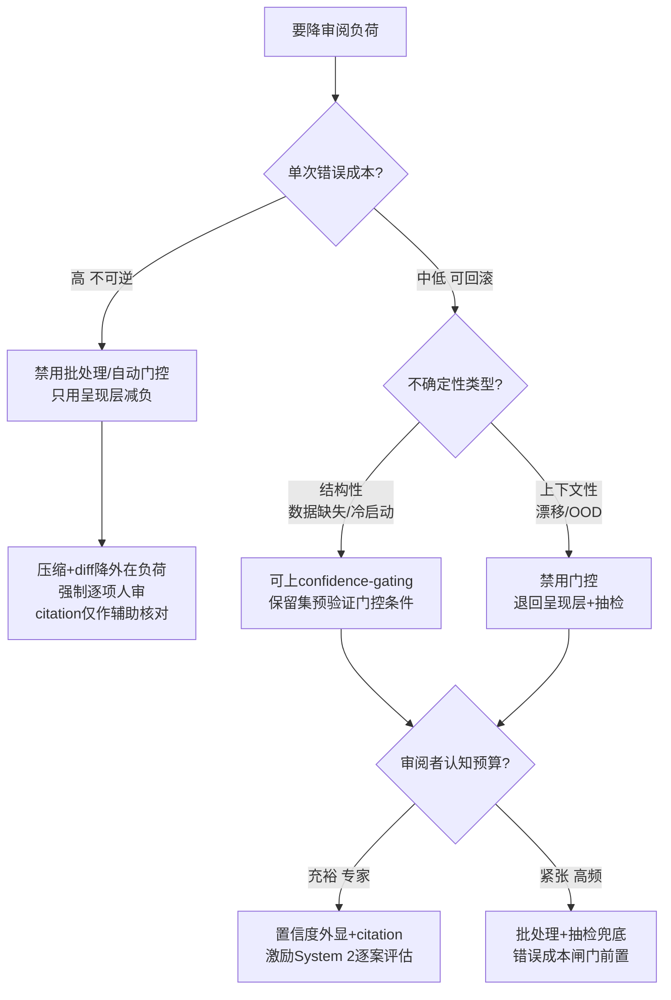

当 AI 把生产成本压到趋零、瓶颈反转为"人类审阅带宽"之后，PM 手上有六类工具可以降低单位审阅负荷——压缩/摘要、diff、置信度外显、citation、confidence-gating、批处理审阅。问题不是"用哪个"，而是"在哪个失效维度上，哪种手段是真药、哪种是安慰剂"。本节点用一张「手段 × 维度」对照矩阵，给出一棵**可在选型会上当场画的决策树**：先问错误成本，再问不确定性类型，最后问审阅者认知预算，三刀切下去就知道该上哪一组手段。判断主轴是——**降负荷与降风险经常是反向的**，很多手段表面减轻了审阅负担，实质上是把审阅从 verification 偷换成 rubber-stamping。

## §0 为什么是「手段 × 维度」矩阵，而不是「手段优劣排行榜」

读者脑中的默认框架是"哪个手段最好"——这是错的。这六类手段不在同一层：压缩/diff/citation 是**呈现层**（改变信息怎么进入审阅者眼睛），confidence-gating/批处理是**控制层**（改变哪些内容需要审阅者看），置信度外显横跨两层。把它们排成一维优劣榜，等于把"骨架屏"和"权限分级"放进同一个赛道比快慢。

更要命的是，每个手段在不同维度上的得分是**正负号相反**的。所以正确的框架不是排行榜，而是一张矩阵：行是六类手段，列是四个评估维度——

- **降负荷**：是否真的减少审阅者的工作记忆占用 / 单位时间？
- **风险**：是否引入新的漏检风险（automation bias、锚定、信噪比）？
- **可信**：审阅者读完后对结论的信任，是 calibrated 还是 inflated？
- **适用**：在什么错误成本 / 不确定性类型 / 任务结构下成立？

这张矩阵的设计哲学直接来自 `[c13 - 幻觉的不可消除性](/kb/基础知识库/c13-幻觉的不可消除性/)`：既然幻觉架构性不可消除，降审阅负荷的任何手段都必须先回答"它压低的是负荷，还是压低了你对漏检的警觉"。

## §1 对照矩阵主表

| 手段 | 机制 | 降负荷 | 新增风险 | 可信（校准方向） | 最佳适用 |
|---|---|---|---|---|---|
| **压缩/摘要** | 把长输出压成要点，渐进披露按需展开 | 高（直击外在负荷） | 高：摘要本身可能漏掉/歪曲关键项，审阅者基于失真表征决策 | 易过度自信（看了摘要≈看了全文的错觉） | 内在负荷高、原文结构稳定、错误成本中低 |
| **diff** | 只展示"变了什么"，隐藏未变部分 | 中（变更集小时高，大时崩） | 中高：diff 隐藏"为什么变/影响哪些依赖"，大 PR 淹没工作记忆 | 中性偏低：看得见行级变化，看不见语义影响 | 增量变更、有版本基线、审阅者熟悉代码库 |
| **置信度外显** | 把模型不确定性（logprobs/区间/口头）暴露给审阅者 | 低（不减量，只重排注意力） | 中：解释/置信反而可能加剧信任（XAI 悖论） | 取决于校准质量——校准好则提升，校准差则误导 | 模型校准可验证、审阅者会按置信调节投入 |
| **citation** | 把每条声明锚定到可点击来源 | 低偏负（增加跳转动作） | 中高：来源"张冠李戴"比凭空捏造更难发现 | 易过度自信（有链接≈已核实的错觉） | 事实密集、来源可验证、审阅者会真去点 |
| **confidence-gating** | 高置信自动执行，低置信才触发人审 | 极高（直接减少审阅总量） | 高：门控在分布漂移/OOD 下失效；漏报的恰是最该看的 | 系统级——取决于门控条件是否满足秩对齐 | 结构性不确定性为主、可在保留集预验证门控 |
| **批处理审阅** | 把同类变更聚合，一次性批量过 | 高（减少上下文切换） | 高：批量加剧 rubber-stamping，一个"全部接受"按钮 | 低：批量天然压制逐项的 System 2 介入 | 同质低风险变更、有抽检机制兜底 |

> [!note] 读这张表的方式
> **不要找"全绿"的那一行——不存在。** 每个手段都是"用某个维度的让步换另一个维度的收益"。压缩/批处理把"降负荷"拉满，代价是"风险/可信"双输；citation/置信度外显几乎不降负荷，但在"可信"上可能正可能负——正负号由校准质量和审阅者行为决定，不由手段本身决定。

## §2 三个维度的实证锚点（为什么矩阵里的符号是这样标的）

**降负荷的理论上限：渐进披露＋压缩。** Nielsen（1995）提出的渐进披露，本质是只展示当前决策所需的最少信息，核心作用是削减外在负荷（来源：Nielsen 1995；IxDF / UXPin 综述）。这与认知负荷理论（Sweller, *Cognitive Science* 12: 257–285, 1988）的三类负荷划分对齐：外在负荷（呈现方式带来的无关负担）是设计**可以直接干预**的部分，而内在负荷（材料固有难度）压不动。所以压缩/diff/摘要本质都在打外在负荷这一个靶子——这是它们"降负荷"列得高分的根据，也是它们的天花板：内在负荷高的硬决策，压缩救不了。

工作记忆上限给出了"为什么大 diff 会崩"的硬约束：Miller（1956）的 7±2 与 Cowan（2001, *Behavioral and Brain Sciences*）修正后的约 4 组块，无论取哪个，AI 一次性吐出数百行代码都远超审阅者工作记忆容量。CodeAnt 的工程观察印证：变更集过大时缺陷检测率下降，高级开发者被迫走橡皮图章路径（来源：CodeAnt.ai, "Why Diff-Based Code Reviews Overwhelm Developers"）。

**降负荷与漏检风险的反向耦合，是这张矩阵的命门。** Sele & Chugunova（*PLoS ONE*, 2024）的实验是最锋利的反例：加入人工监督环节后，算法建议**接受率上升约 7 个百分点，但预测准确率反而下降**（误差从约 17.4 升至约 18.0 百分位），人类监督者"未能充当紧急制动器"。这意味着任何让审阅"更顺手"的手段，都可能同时让审阅者更不愿意动用 System 2 去推翻 AI——降负荷和降风险在这里是负相关的。

## §3 判断主轴：90% 的人在这里会搞错的四个点

### 错位一：把"压缩了信息"当成"降低了风险"

- **症状**：团队上了 AI 摘要 / diff 后宣称"审阅效率翻倍"，用通过的 PR 数当 KPI。
- **为什么会错**：摘要和 diff 降的是外在负荷（呈现），不是漏检风险。摘要是"对原始输入的高效压缩"（PubMed 1997 信息压缩研究），但压缩必然丢信息——丢掉的恰可能是那条要命的边界条件。
- **正确做法**：把"降负荷"和"降风险"拆成两个独立指标分别度量。降负荷看审阅时长/上下文切换次数；降风险看抽检漏检率、回滚率。
- **真实反例**：LogRocket 实测显示，审阅 AI 生成代码（186 行 vs 人类 29 行）时，认知任务从"验证正确性"变成"判断必要性"——这是性质不同的任务，摘要压不掉它（来源：LogRocket, "AI Coding Tools Shift Bottleneck to Review"）。

### 错位二：以为 citation / 置信度外显天然提升可信度

- **症状**：给每条结论挂上来源链接、标上置信百分比，认为"这下用户能自己判断了"。
- **为什么会错**：(1) citation 的错误形态是"来源张冠李戴"——URL 真实但声明被错误归属，比完全捏造更难发现。Tow Center / CJR（2025）1600 次查询实测：Perplexity Free 引用错误率约 37%，Pro 版反而约 45%、Grok-3 高达 94%。(2) XAI 悖论：多项研究（综述见 *AI & Society*, 2025，分析约 35 项研究）显示，解释/置信外显**有时反而加剧** automation bias——复杂解释抬高认知负荷，降低批判性评估。
- **正确做法**：citation 只在"审阅者会真去点开核对"的场景才算降风险；否则它只是信任装饰。置信度外显必须先有可验证的校准（ECE / 可靠性图），否则是把噪声当信号。
- **真实反例**：Perplexity 官方称 94% 引用准确率，与 CJR 实测正面冲突——置信度展示数字本身就可能是 inflated 的（来源：CJR Tow Center 2025；Perplexity 官方声明）。

### 错位三：把 confidence-gating 当成"普遍有效的自动减负开关"

- **症状**：设一个置信阈值，高于它就自动执行，低于它才人审，全场景一刀切。
- **为什么会错**：门控的有效性**取决于不确定性类型**。结构性不确定性（数据缺失、冷启动）下门控近单调有效；上下文性不确定性（时序漂移、分布偏移）下门控失效——有研究在漂移场景下观察到 AUC 从约 0.71 跌至 0.61–0.62（来源：Doku 2026, "The Confidence Gate Theorem", arXiv 2603.09947〔预印本，待核实〕）。更根本的是，校准与逐样本辨别是**正交属性**：一个对所有输入都输出 50% 置信的完美校准模型，对选择性预测毫无帮助（来源：ICLR 2026 Blogpost, "What are Calibrated Probabilities Actually Useful for?"）。
- **正确做法**：部署门控前，在保留集上验证门控条件（秩对齐、无反转区）；先判断主导的是结构性还是上下文性不确定性，再决定能否用门控。语义 OOD（真正新颖情境）下门控接近随机猜测，必须强制人审。
- **真实反例**：机器人自治研究发现，阈值 τ 的选择对行为的影响远大于不确定性估计方法（softmax/MC Dropout/ensemble）的选择，而语义 OOD 检测接近随机（来源：Gaus et al. 2026, arXiv 2605.18045〔预印本，待核实〕）。

### 错位四：用批处理审阅"提效"，实则制造结构化 rubber-stamping

- **症状**：把同类变更聚合，给一个"全部接受"按钮，审阅者一键放行。
- **为什么会错**：批量审阅天然压制逐项的 System 2 介入。当输出速度超过审阅者认知评估能力，监督就沦为剧场——这正是 automation bias 文献里"learned carelessness"的产品化形态（来源：Parasuraman & Manzey, *Human Factors*, 2010）。AI 招聘实验里，严重偏见条件下约 90% 的决策追随 AI（来源：Wilson, Caliskan et al., AAAI-AIES 2025）。
- **正确做法**：批处理必须配抽检兜底（随机抽 N% 强制逐项审）＋错误成本闸门（高成本变更永不进批量通道）。把"批量通过率"和"抽检漏检率"绑定考核。
- **真实反例**：肠镜研究（Budzyń et al., *Lancet Gastroenterology & Hepatology*, 2025）显示长期依赖 AI 提示后，医生独立腺瘤检出率从 28.4% 降至 22.4%——技能退化是批量依赖的终局。

## §4 决策树：给"如何降审阅负荷"的当场可画版本

**三刀的顺序不能换**：错误成本是第一刀（决定能否自动化），不确定性类型是第二刀（决定门控是否成立），认知预算是第三刀（决定呈现层怎么配）。把"认知预算"当第一刀的团队，会在高成本场景上批处理——这是最常见的致命错位。

## §5 产品 PM 视角补盲

工程视角只盯"哪个手段技术上最省 token / 最省时间"，会漏掉三个商业与心理盲点：

1. **审阅界面即产品，减负手段会重塑用户的能力感**。批处理让用户"感觉高效"，但长期制造技能退化（deskilling），用户对产品的依赖上升而自身判断力下降——短期留存好看，长期是用户能力空心化。对 to B 安全类产品（Rick 所在的滴滴/99 安全域），这等于把客户的风控团队训练成橡皮图章，一旦出事责任全甩回平台。
2. **降负荷与合规责任的错配**。EU AI Act 第 14 条只要求高风险 AI 让用户"知道有 automation bias"，不要求从设计上消除它（来源：Laux & Ruschemeier, *European Journal of Risk Regulation*, 2025）。这意味着 PM 若用批处理/门控提效，"知道风险"不等于"减轻风险"，法律会把责任留在部署方——减负手段越激进，合规敞口越大。
3. **GTM 话术陷阱**。"审阅效率提升 10 倍"是最好卖也最危险的卖点：它把降负荷当卖点，却把漏检风险转嫁给客户。诚实的定位是"在可回滚、结构化、低错误成本的工作流里提效"，而不是"全场景替代人工审阅"。

## §6 对手框架回应

**接受**：自动化怀疑派（以 METR 2025 RCT 为代表——16 名资深开发者用 AI 实际比不用慢约 19%）有一个对的核心——很多减负手段在真实复杂任务上不省时间，反而因为要审阅 AI 的冗长输出而更慢。这击中了"压缩/diff 一定提效"的天真假设。

**边界与赌注**：但 METR 样本小（16 人）、任务特殊（开源老项目熟练贡献者），不可泛化为"减负手段无效"。本节点的赌注是——**减负手段的价值高度场景依赖，关键变量是"任务是否结构化、错误是否可回滚、审阅者是否熟悉上下文"**。在这三者都成立的工作流里（如标准化 CRUD、文案批改、低风险配置变更），呈现层减负是真有效的；在它们都不成立时（METR 那类），任何手段都救不了。这正是为什么本节点给的是决策树而非排行榜——拒绝"某手段普遍有效"的承诺。

## §7 跨域呼应：Simon 的注意力稀缺命题如何重写这张矩阵

Herbert Simon 在《Designing Organizations for an Information-Rich World》（in *Computers, Communications, and the Public Interest*, ed. Greenberger, Johns Hopkins Press, 1971, pp. 37–52）的奠基命题是：

> "a wealth of information creates a poverty of attention"（信息的丰裕制造注意力的贫困）。

这句话直接重写了本矩阵的评估标准。Simon 的洞察是——**信息的成本主要由接收者（审阅者）承担，而非生产者**。AI 把生产成本压到趋零，等于把全部成本甩给审阅者的注意力账户。于是这六类手段的真正分类不是"呈现层 vs 控制层"，而是按 Simon 的逻辑分两类：

- **真正减少注意力消耗的**（压缩、批处理、门控）——它们要么减少信息量，要么减少需审阅的条目数；
- **只是重新分配注意力的**（citation、置信度外显、diff）——它们不减少总消耗，只是把注意力引向"更该看的地方"。

Simon 的框架给出一个反直觉判断：**重新分配注意力的手段，只有在审阅者的注意力分配本来是错的时候才有价值。** 如果审阅者本来就会看对地方，citation 和置信外显就是纯增负（多了跳转和阅读动作）。这解释了矩阵里为什么 citation/置信外显的"降负荷"列是低甚至负——它们赌的是"审阅者的注意力分配有系统性偏差，需要被引导"。这个赌注成不成立，是经验问题，不是设计能保证的。链入 `0114认识论`：审阅 AI 报告究竟是 verification 还是 rubber-stamping，本质是 Simon 意义上"注意力是否被真正投入"的问题——一个被压缩、被批处理、被门控放行的结论，审阅者签字时投入的注意力可能为零，这时的"审阅"在认识论上等于没有审阅。

## §8 PM 决策启示

- **面试怎么用**：被问"你怎么设计 AI 产品的审阅流"，不要答"加 citation 和置信度"。答"先问错误成本和不确定性类型，再决定呈现层还是控制层减负——因为降负荷和降风险经常反向"。把决策树画出来，30 秒показ判断力。
- **选型怎么用**：评估第三方 AI 工具时，别看它"减负多少"，看它在"风险/可信"两列怎么标——一个只宣传效率提升、不谈漏检兜底的工具，是把成本转嫁给你。
- **复现怎么用**：自建审阅流时，把"降负荷指标"（时长/切换次数）和"降风险指标"（抽检漏检率/回滚率）做成两个独立 dashboard，永远不让前者单独成为 KPI——否则团队会优化出橡皮图章。

## §9 与已有节点的关系

- 对照 `[p304 - 防御性 UX：对抗延迟与幻觉](/kb/产品设计与交互范式/p304-防御性-ux-对抗延迟与幻觉/)`：p304 讲的是"对抗延迟/幻觉的呈现层手段"（骨架屏、溯源、置信外显、优雅降级），本节点**做了升级与重构**——把那些手段重新放进"降负荷 vs 降风险"的对抗框架里，指出 p304 的置信外显/溯源在审阅瓶颈语境下可能是安慰剂而非真药。不复述 p304 的 TTFT/TPOT 事实基础。
- 对照 `[p305 - 信任架构与可解释性设计](/kb/产品设计与交互范式/p305-信任架构与可解释性设计/)`：p305 的"信任是校准而非最大化"是本节点"可信"列的理论母体；本节点**做了对话与落地**——把"校准"这个抽象原则具体化成"每个减负手段把信任推向 calibrated 还是 inflated"的可判定符号。
- 对照 `[p307 - Copilot 到 Autopilot 光谱](/kb/产品设计与交互范式/p307-copilot-到-autopilot-光谱/)`：p307 的 L0–L4 控制权光谱是本节点 confidence-gating 行的上位框架；本节点**做了补缺**——p307 讲"何时升降级控制权"，本节点讲"升级到自动执行后，怎么用门控条件防止它失效"。
- 对照 `[c13 - 幻觉的不可消除性](/kb/基础知识库/c13-幻觉的不可消除性/)`：c13 论证幻觉架构性不可消除，是本节点全表的前提——正因为幻觉消不掉，所有减负手段才必须先回答"它压低的是负荷还是警觉"。本节点是 c13 在审阅界面层的**操作化**。

## §10 关联节点

**核心（必读）**
- `[c13 - 幻觉的不可消除性](/kb/基础知识库/c13-幻觉的不可消除性/)`
- `[p304 - 防御性 UX：对抗延迟与幻觉](/kb/产品设计与交互范式/p304-防御性-ux-对抗延迟与幻觉/)`
- `[p305 - 信任架构与可解释性设计](/kb/产品设计与交互范式/p305-信任架构与可解释性设计/)`
- `[p307 - Copilot 到 Autopilot 光谱](/kb/产品设计与交互范式/p307-copilot-到-autopilot-光谱/)`
- `[p302 - 七种 AI 交互设计模式](/kb/产品设计与交互范式/p302-七种-ai-交互设计模式/)`
- `[幻觉](/kb/基础知识库/幻觉/)`

**延伸（可选）**
- `[p306 - 数据飞轮与反馈回路设计](/kb/产品设计与交互范式/p306-数据飞轮与反馈回路设计/)`
- `0114认识论`
- `0117社会学`
- `[Agent](/kb/基础知识库/agent/)`
- `[Test-Time Compute](/kb/基础知识库/test-time-compute/)`
- `[Claude Code](/kb/ai-公司与产品/claude-code/)`
- `[Perplexity](/kb/ai-公司与产品/perplexity/)`
- `[ChatGPT](/kb/ai-公司与产品/chatgpt/)`
- `[AI PM 知识图谱·总索引](/kb/ai-pm-知识图谱/ai-pm-知识图谱-总索引/)`
- `[c14 - 模型评估体系与 Goodhart 陷阱](/kb/基础知识库/c14-模型评估体系与-goodhart-陷阱/)`
- `[m209 - 推理成本控制手册](/kb/工程化与落地架构/m209-推理成本控制手册/)`

## 修订日志

- R0（2026-06-07）：首稿。建立「六手段 × 四维度」对照矩阵 + 三刀决策树；判断主轴四错位四件套齐备；接入 METR 反方（接受+边界）；Simon 注意力稀缺命题作跨域呼应并具体改写矩阵分类逻辑；与 p304/p305/p307/c13 显式升级对照。待 grounding pass 复核 Doku 2026 / Gaus 2026 预印本编号与 CJR/Sele 数字。
