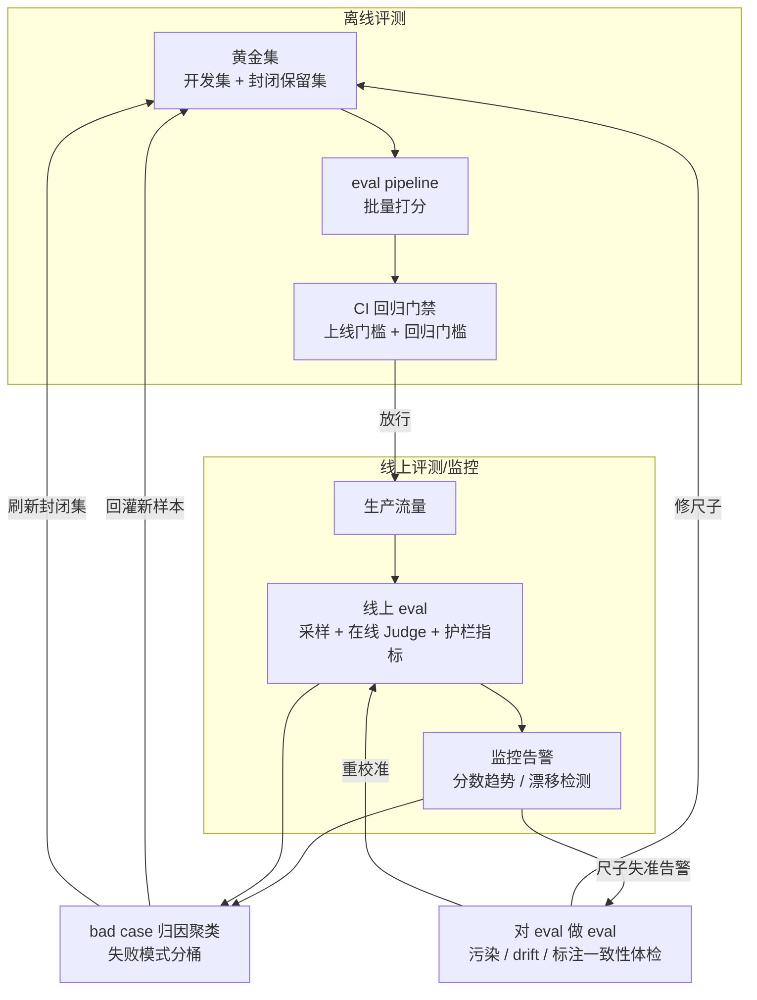

# S03 Eval-Ops 全景

**问题**：[A08](/kb/专题-评测与度量/a08-eval-driven-development/) 回答了"评测该在什么时点出现"，但一份 eval set 写完、进了 CI，并不等于你拥有了一个**能长期可靠运转的评测系统**。本节点要解决的是：**把评测当成一个需要被运维的生产系统来看，它由哪些可替换的组件组成、信号怎么流动、又会从哪里腐烂？** 框架命名为 **Eval-Ops（评测运维）**——借**可观测性 / SRE 运维**的工程语言，把"离线 eval pipeline + CI 回归门禁 + bad case 归因聚类 + 线上 eval/监控 + eval drift 治理 + 黄金集运维"装进一张**带反馈环的解剖图**。这是一个关于**系统结构与生命周期**的判断，不是关于单次测一把的判断。

> [!warning] 一句话反共识
> 评测系统不是"建好的尺子"，而是**和被测系统一起腐烂的尺子**。线上模型漂移、数据污染、标注疲劳会让你的 eval 在你毫不知情时悄悄失准——而你越是把它自动化、塞进 CI、撤掉人盯着，腐烂得越快。Eval-Ops 的赌注是：**你必须对 eval 本身做 eval，否则迟早会拿一把坏掉的尺子，自信地宣布产品合格。**

---

## §0 为什么是 Eval-Ops，而不是"再加一个 eval pipeline"

读到这里，很多 PM 脑中的默认框架是："这不就是把评测脚本做得更工程化、跑得更勤快吗？" 这个框架会让你只盯着"把 eval 跑起来",而漏掉真正的运维问题——**尺子自己会坏**。必须先挡掉它。

| 维度 | "一个 eval pipeline"（朴素工程化） | Eval-Ops（运维视角） |
|---|---|---|
| 关注对象 | 被测系统的质量 | 被测系统的质量 **＋ 评测系统自身的健康** |
| 时间观 | 一次跑通就交付 | **持续运转、会衰减、需维护**的生产系统 |
| 失效模式 | 脚本报错、跑不动 | **尺子失准而不报错**（drift / 污染 / 标注疲劳） |
| 信号方向 | 单向：系统 → 分数 | **带反馈环**：分数 → 归因 → 回灌 → 校准尺子 |
| 类比对象 | 单元测试套件 | **可观测性 + SRE**（监控的不只是服务，还有监控本身） |

关键在最后两行。一个朴素的 eval pipeline 把评测当成"测量工具"——假设尺子是恒定的，问题只在被测对象。Eval-Ops 把评测当成**一个会随时间退化、需要被监控和维修的生产系统**：黄金集会饱和（[A03](/kb/专题-评测与度量/a03-benchmark-与数据污染/)），Judge 会有被优化器钻的偏差（[A04](/kb/专题-评测与度量/a04-llm-as-judge/)），标注会因疲劳而一致性下滑（[A05](/kb/专题-评测与度量/a05-人工评测与标注一致性/))。这套思路的直接母体是**可观测性（Observability）与 SRE（Site Reliability Engineering）**——下文 §跨域呼应会具体展开它在哪里成立、又在哪里**绷断**（这正是 90% 的人照搬监控经验时会栽的地方）。

与 [本专题 S02 流派对照矩阵](/kb/专题-评测与度量/s02-评测方法流派对照矩阵/)、[S01](/kb/专题-安全对齐与失败/s01-agent-六层架构剖面/)（Agent 分层堆栈的同构先例）同属"架构剖面"模块，但切面不同：S02 横向铺开"评测有哪些流派/层",S03 不讲"评测的某一层是什么",而讲**这些层装成一个运转系统后，信号怎么流、又从哪里坏**。

---

## §1 Eval-Ops 的解剖：六组件 + 反馈环

把上面提到的零件拼成一张图。注意它**不是流水线（单向），而是带回灌环的闭环**——这是 Eval-Ops 区别于"跑一次 eval"的结构特征。

逐一拆解六组件（每个都已在概念辨析模块讲过"是什么"，这里只讲"装进系统后承担什么角色"，**不复述定义**）：

| 组件 | 在 Eval-Ops 里的角色 | 关键运维动作 | 对应概念节点 |
|---|---|---|---|
| **黄金集** | 离线评测的真值地基 | 开发集/封闭集分离、定期回灌、监控饱和 | [A05](/kb/专题-评测与度量/a05-人工评测与标注一致性/)、[A03](/kb/专题-评测与度量/a03-benchmark-与数据污染/) |
| **eval pipeline** | 批量把样本→分数的执行层 | 可复现（固定随机种子/版本）、可追溯（存每条裁决） | [A08](/kb/专题-评测与度量/a08-eval-driven-development/) |
| **CI 回归门禁** | 把分数变成"放行/阻断"的开关 | 双门：上线门槛 + 相对基线的回归门槛 | [A08](/kb/专题-评测与度量/a08-eval-driven-development/) |
| **bad case 归因聚类** | 把失败 case 分桶成可行动的失败模式 | 按错误类型聚类，定位"哪类 case 在退化" | [A07](/kb/专题-评测与度量/a07-red-teaming-作为评测实践/)、[m207](/kb/工程化与落地架构/m207-agent-产品化-场景推演与失败模式/) |
| **线上 eval/监控** | 在真实流量上持续测量 | 采样在线 Judge、护栏指标、趋势告警 | [A04](/kb/专题-评测与度量/a04-llm-as-judge/) |
| **对 eval 做 eval（meta-eval）** | 监控尺子自身是否失准 | 污染体检、drift 检测、标注一致性复审 | 本节点 §3 |

这张图的**承重梁是两条回灌箭头**：bad case → 黄金集（让今天的线上失败变成明天的离线门槛），以及 meta-eval → 黄金集/线上 Judge（修尺子）。没有这两条环，你拥有的只是"一堆 eval 脚本",不是 Eval-Ops。

---

## §2 离线门禁与线上监控：两套 eval 的分工与缝合

Eval-Ops 里最容易被 PM 混为一谈的，是**离线 eval（CI 门禁）**和**线上 eval（生产监控）**——它们测的东西、用的真值、能承担的责任完全不同。

| 维度 | 离线 eval（pre-deploy） | 线上 eval（post-deploy） |
|---|---|---|
| 触发时机 | 改动合并前（prompt/模型/检索配置变更） | 生产流量持续采样 |
| 真值来源 | 黄金集（有标注参考答案/rubric） | **多无金标准**——靠在线 Judge、护栏规则、用户隐式反馈 |
| 主要职责 | **防退化**：拦住会变差的发布 | **抓漂移 + 抓没想到的失效**：发现离线集覆盖不到的真实问题 |
| 典型指标 | 黄金集通过率、相对基线回归量 | 拒答率、人工接管率、用户负反馈率、Judge 分趋势 |
| 失效风险 | 黄金集饱和/污染（[A03](/kb/专题-评测与度量/a03-benchmark-与数据污染/)） | 在线 Judge 无人工对齐基线，悄悄飘 |

> [!note] 缝合点
> 两套 eval 不是替代关系，而是**离线守"已知失效模式的回归底线"、线上守"未知失效模式的发现前沿"**，由 §1 那条 `bad case → 黄金集` 回灌环缝合：线上抓到的新失败，归因聚类后回灌成离线黄金集的新样本——这正是把线上发现的"未知"转化为离线可防的"已知"的机制。这与 [A08](/kb/专题-评测与度量/a08-eval-driven-development/) §5 对 Karpathy "vibe check 不可替代" 的回应是同一根逻辑：人工/线上发现的"咯噔一下"，要沉淀成自动化门槛。

线上 eval 这里要给一个 PM 常踩的工程现实：**全量在线 Judge 打分是奢侈品**。生产流量上每条都过一次 GPT-4 当裁判，成本和延迟都不可接受。务实做法是**分层采样**——护栏类硬规则（拒答、安全词、格式）全量跑（便宜），LLM-as-Judge 类软评分按比例采样跑（贵），高风险流量提采样率。〔具体采样比例无通用值，依业务风险与预算定，标〔示意〕〕

---

## §3 判断主轴：对 eval 做 eval——尺子腐烂的四种死法（致命耦合点）

> [!important] 本节是本节点的核心判断节（对应宪章 §4.2 条目 4）
> 前面 §0–§2 是框架辨析、解剖图、分工表（"是什么/怎么装"）；**真正的命门在这一节**——90% 的团队会在"对 eval 做 eval"上栽的四个点。每个死法配【症状 → 为什么会错 → 正确做法 → 真实反例】四件套。读这一篇若只读一节，读这节。

这一节是本节点的命门，也是整个专题"判断主轴"的收口：**评测系统本身会腐化，而它腐化时不会报错。** 90% 的团队把全部精力花在"用 eval 监控产品",却从不监控 eval 自己。下面四种死法，每个配【症状 → 为什么会错 → 正确做法 → 真实反例】。

### 死法一：黄金集被开发过程"内部污染"，分数虚高而不自知

- **症状**：离线黄金集通过率半年来稳步爬升到 96%，团队认为模型在变好，线上却没同步变好。
- **为什么会错**：你在用黄金集调 prompt、选模型、挑超参——黄金集的信息正持续**泄漏进开发循环**，模型（或 prompt）在过拟合这份集子。这是 benchmark 数据污染的微观翻版，污染源从"公开预训练数据"变成"你自己的开发过程"。
- **正确做法**：黄金集严格分**开发可见集**与**封闭保留集（held-out）**，封闭集**绝不进任何调优循环**、只在发布前跑一次；定期用新捞的真实 case 整批刷新封闭集（旧封闭集一旦被看过就降级为开发集）。
- **真实反例**：SWE-bench Verified（500 道 Python issue）发布后，Aleithan et al.（2024）的独立人工筛查发现 **32.67% 的"已解决"实例存在解答泄漏**——issue 正文或评论里直接写出了修复方案，模型只是抄答案（来源：SWE-Bench+: Enhanced Coding Benchmark for LLMs, Aleithan et al., arXiv 2410.06992）。OpenAI 后来的独立发现是另一回事：**前沿模型能从 Task ID 逐字复现 gold patch**，据此 OpenAI 停止把 Verified 当作前沿编码能力的衡量、转推 SWE-bench Pro〔OpenAI 该立场据多方报道，原文博客标题与日期待核实〕。更直观的污染体感来自同一被测系统在"防泄漏"前后的落差：**Claude Sonnet 4.5 在 SWE-bench Verified 上约 77–82%（标准/并行计算配置），在更抗泄漏的 SWE-bench Pro 上仅约 45.8%（Live-SWE-agent，2025-11），差约 32–36 个百分点**（来源：Anthropic Claude Sonnet 4.5 发布说明，2025-10；SWE-bench Pro leaderboard / Live-SWE-agent, 2025-11）。〔注：93.9% 是 Claude Mythos Preview 在 Verified 上的另一成绩，其 Pro 成绩约 77.8%；不要把跨模型、跨基准的数字混拼成"同一模型差 48 点"——那是错的对照。〕连最严谨的公开 benchmark 都防不住泄漏、且换一把更干净的尺子分数就腰斩，你那份天天拿来调 prompt 的私有黄金集，污染只会更快。

### 死法二：eval drift——尺子随被测对象漂移而失准，监控全绿却越测越偏

- **症状**：线上各项 eval 指标平稳，CI 一路绿灯，但用户投诉曲线在涨；半年后回看，发现 eval 测的根本不是用户现在在意的东西。
- **为什么会错**：用户行为、对手模型、内容形态、甚至模型版本都在漂移，而**静态 eval set 的判别力会随时间饱和归零**；更隐蔽的是，连"什么算好回答"的标准都在漂——这是 benchmark 饱和现象在你产品内部的复现。尺子没坏，但它量的维度已经和现实脱节。
- **正确做法**：把黄金集当**活体资产**——定期从线上失败 case、人工接管记录、负反馈里回灌新样本（§1 的回灌环）；**监控通过率的天花板效应**，一旦逼近 100% 就主动加难（替换饱和子集）；对"好的定义"本身设复审节奏。
- **真实反例**：MMLU（Hendrycks et al., ICLR 2021，57 学科）在 GPT-4 于 2023 年 3 月达 86.4% 后，**前沿模型挤进 86–89% 的窄区间、彼此分不开，判别力趋于丧失**；MMLU-Pro（Wang et al., NeurIPS 2024）把选项 4→10，同一个 GPT-4o 当即从 88.7% 掉到 72.6%（降 16 点），说明区分度是被选项设计磨平的、不是模型真变弱。GPQA（Rein et al., arXiv 2311.12022）的起点与饱和同样可查：论文报告最强 GPT-4 基线仅 39%、博士级领域专家约 65%、可联网的非专家仅 34%，到 2026 初前沿模型已爬到 94%+（如 Claude Mythos 约 94.5%）逼近触顶〔"基准创建者本人承认局限"的具体措辞待核实，此处只引论文可查的 39%/65%/34% 与 2026 分数区间〕。公开 benchmark 尚且如此快被磨平，你那份"上线时觉得很难"的黄金集，半年后大概率已是张白卷。

### 死法三：在线 Judge 无人工对齐基线，自动化越彻底，偏差被钻得越狠

- **症状**：为让线上 eval 全自动、撤掉人工抽检，全量用 LLM 当裁判，把 Judge 分当金标准盯趋势。
- **为什么会错**：Judge 自带系统性偏差（位置/冗长/自我增强），而这些偏差**恰好会被 prompt 优化器学会去钻**——你在用一把有漏洞的尺子量自己，还顺着漏洞优化；一旦撤掉人盯着，没人会发现 Judge 在系统性地骗你。
- **正确做法**（要落成可执行的决策规则，不是工具清单——以下门槛标〔示意〕，量级供起步，需按业务风险与人力校准）：
  1. **Judge 准入门槛（嵌在"启用自动放行"这个环节）**：Judge 上岗前先在一份人工已标的对齐集上抽样比对，用 [Cohen's Kappa](/kb/基础知识库/cohen-kappa-系数/) 而非原始一致率（后者会高估）。**规则：κ < 0.6〔示意〕禁止自动放行，只能"Judge 辅助 + 人工终判"；κ ≥ 0.8〔示意〕方可放行高风险流量的自动判**。κ 阈值随域调（主观/安全维度从严）。
  2. **双向评测的触发时机（嵌在"每次出判"环节，针对成对偏好类）**：凡是 A/B 成对偏好打分，**默认 A/B 顺序各跑一次、仅采纳双向一致的裁决**；双向不一致的判例直接打回人工，不计入分数。开销翻倍但只对成对偏好类开启，单条 rubric 打分不必。
  3. **线上人工抽检的最低比例（嵌在"线上采样"环节，作 Judge 的校准探针）**：自动判结果**至少随机抽检 1–5%〔示意〕送人工复核**，高风险流量（安全、跨境合规）提到 ≥10%〔示意〕；用这批人工标签**每个校准窗口（如每两周〔示意〕）复算一次 κ，看尺子有没有飘**，κ 跌破准入门槛即触发死法三告警、回退到人工终判。
  4. **谁来执行（团队职责，否则没人 owner）**：eval owner 定阈值与刷新节奏并对"κ 掉线"负责（见 §4 补盲二）；标注/审核团队产出对齐集与线上抽检标签；PM 把"Judge-人工 κ 最新值 + 上次校准距今"纳入运维 dashboard 例会。
- **真实反例**：Zheng et al. 2023（MT-Bench / Chatbot Arena, arXiv 2306.05685）实测：默认 prompt 下 GPT-4 交换回答顺序后仅 **65% 一致**（即约 **35% 的裁决会因顺序翻转**，Table 2）；对"重复列表"式故意冗长回答，GPT-3.5 与 Claude-v1 被骗率高达 **91.3%**、GPT-4 也有 8.7%（Table 3）；自我增强偏差上 GPT-4 给自身输出胜率高出 **10%**、Claude-v1 高出 **25%**。值得注意的是，该论文用的是**原始一致率而非 Cohen's Kappa**——GPT-4 与人类的成对一致率约 85%、甚至略高于人类互评的 81%（Table 5b，仅计非平局票），单看这个"高一致"会让人误以为 Judge 已可信，但它**未对偶然一致做校正**：这正是为何"正确做法"坚持用 κ 而非原始一致率〔注：κ 0.84 vs 人类 0.97 这类数字并非出自本论文，属二手综述口径，未在原文核到，已剔除〕。更狠的是 JudgeBench（Tan et al., JudgeBench, ICLR 2025, arXiv 2410.12784）：用 vanilla 判分 prompt 时，**GPT-4o 在知识题（44.2%）与推理题（48.0%）两类子任务上仅略好于随机猜测（50%），在数学（66.1%）与编程（61.9%）上表现尚可；但知识与推理恰好是 PM 最难靠 vibe check 自己核实对错的领域**——你越是依赖 Judge 自动判，越是在这两类高难度判断上被它带偏。把这种尺子当无成本真值机塞进线上自动化，等于给优化器开了作弊后门。

### 死法四：标注疲劳与标注漂移，黄金集的真值地基在悄悄塌

- **症状**：黄金集越扩越大，标注外包给一批人长期重复打标，IAA（标注者间一致性）报告依旧"达标"，但回灌进来的新真值越来越不可信。
- **为什么会错**：长期重复标注会导致**标注疲劳与标准漂移**——标注者会无意识放松标准、互相趋同、或在 AI 预标注辅助下倾向"点同意"（pre-annotation bias，使 IAA 虚高而真实独立一致性下降）。尺子的**刻度本身在变**，而聚合一致率掩盖了这一点。
- **正确做法**：定期插入**已知答案的校验样本**抽查标注者状态；用 [Cohen's Kappa](/kb/基础知识库/cohen-kappa-系数/) / Krippendorff's α 监控一致性**趋势而非单点**，且警惕 kappa 悖论（类别极不平衡时高一致率仍可得低 κ）；对主观维度（安全里的讽刺、争议话题）**保留标注分歧本身作为信号**，别强行多数投票抹平（perspectivist annotation）；AI 预标注要随机抽样独立复标，防 pre-annotation bias。
- **真实反例**：Feinstein & Cicchetti 1990 正式描述的 **kappa 悖论**——某类别极度主导时，观测一致率高达 0.85 仍可导致很低的 κ（来源：High agreement but low kappa, Journal of Clinical Epidemiology, 1990）；Landis & Koch 1977 的 κ 阈值被广泛使用却也被广泛批评为**任意**（Bakeman et al., 1997 指出 κ 某一数值在任何领域都无普适意义）。这意味着你 dashboard 上那个"IAA 达标"的绿灯，可能既高估了真实一致、又用了一个任意阈值——尺子的地基比你以为的松。

> [!note] 四种死法的统一结构
> 死法一是**空间泄漏**（测试集信息漏进开发），死法二是**时间漂移**（尺子与现实脱节），死法三是**自动化盲飞**（撤掉人后偏差被钻），死法四是**地基沉降**（真值生产端腐烂）。四者共性：**eval 失准时不会抛异常、CI 不会变红**——这正是 Eval-Ops 必须独立设一个 meta-eval 环节的理由：你需要一套监控来监控你的监控。

---

## §4 产品 PM 视角补盲：Eval-Ops 的组织成本与"谁为尺子负责"

跳出工程视角，Eval-Ops 真正的拦路虎是**它是一笔看不见、且持续的成本**，而组织天然倾向于砍掉看不见的成本。

- **补盲一：meta-eval 是"成本的成本"，最容易被砍。** 写黄金集、标注、对齐 Judge 已是前置成本（[A08](/kb/专题-评测与度量/a08-eval-driven-development/) §4 讲过），而"对 eval 做 eval"是在此之上再加一层——它不产出新功能、只防止你被自己的尺子骗。**破法**：把 meta-eval 做成**定期体检节奏**（如每季度一次封闭集刷新 + Judge 重校准 + IAA 复审），写进流程而非靠个人自觉；把"上次封闭集刷新距今多久""Judge 与人工 Kappa 最新值"做成可见的运维指标，让尺子的健康度和服务的健康度一样上 dashboard。
- **补盲二：谁为"尺子坏了"负责？** 服务挂了有 on-call，尺子悄悄失准却往往无人 owner——出事时大家发现"我们一直在拿坏尺子量"。**破法**：明确 eval 系统也需要 **owner 与 SLO**（如"封闭集刷新周期 ≤ 1 季度""Judge-人工 Kappa ≥ 0.8 否则停用自动放行"）；把尺子失准当成一类**事故**来复盘，而非"优化项"。
- **补盲三：商业 KPI 与 eval 健康度脱钩，meta-eval 被质疑"自娱自乐"。** **破法**：用 [c14](/kb/基础知识库/c14-模型评估体系与-goodhart-陷阱/) 的**三层因果链**（模型指标 → 产品体验指标 → 业务结果指标）论证——尺子坏了，第一层失真会一路误导后两层的决策；meta-eval 守的是整个决策链的**信号可信度**。
- **合规边界（对 Rick 的安全 + 国际化场景尤其实在）**：在高风险域，eval set 承担**审计证据**功能——监管要的是"在这份可复核测试集上达到 X 通过率"。而**审计证据若用了一把已污染/已漂移的尺子，审计本身就失效**。不同司法辖区对"可接受失败率"定义不同，意味着你不止要按地区切分 eval 门槛，还要按地区分别维护各自黄金集的健康度——meta-eval 在跨国合规下是乘法级的成本，但也是不可省的。

---

## §5 对手框架回应：接受 + 边界

**对手立场（业界真实反方）**：以 Anthropic 研究员 / Eugene Yan 等实践者为代表的一派会说——"对 eval 做 eval 听上去对，但会陷入**无限回归**：你用 meta-eval 监控 eval，那谁来监控 meta-eval？与其搭一套自我指涉的监控塔，不如承认**资深人员定期亲手把玩（vibe check）才是最终的尺子**"。这与 Karpathy 多次公开表达的"我不信任当前的 benchmark / 存在 evals 危机"立场一脉相承（来源：Karpathy 在 X 上关于 evals crisis 的多次表态，2024–2025〔具体措辞待核实，立场方向已多方报道〕）。

**接受**：先承认一个对手在某个区间里**完全是对的**——在 ≤5 人团队、产品早期探索期（需求每周重写、还没有稳定 PRD），meta-eval 的搭建成本会超过它的信号价值，此时一个 skilled 的人定期亲手把玩（vibe check）确实比一套半成品的自我监控塔更可靠、更便宜。这不是退让，是边界：**对手框架在"还没有稳定被测系统"的阶段就是更优解**。再往上一层，这个批评还抓住了 Eval-Ops 的真实软肋——**自动化的监控塔确实可能无限套娃，且每一层都可能自己失准**。死法三恰好证明：自动 Judge 会系统性骗人；那么监控 Judge 的自动手段，凭什么不会？把人工把玩完全替换成 meta-eval 仪表盘，等于自废最后那条不可外包的预警线。这也是为什么 §3 每一种死法的"正确做法"里都**保留了人工探针**（人工抽检、独立复标、专家复审）——meta-eval 不是"再加一层自动化",而是"在关键校准点钉入人工锚"。

**边界 / 我赌的是**：但**一旦越过那个早期区间**——产品有了稳定被测系统、要按地区/版本回归、要拿评测结果做审计证据——vibe check 的短板就压过它的优势：它**不可规模化、不可回归、不可审计、因人而异**，无法回答"线上这一周尺子有没有飘""跨 5 个地区的黄金集哪个先腐烂"。所以我的赌注是：**meta-eval 不追求消除人，而是把人工注意力从"逐条把玩产品"省下来，精准投放到"校准尺子的几个关键锚点"**。对手最锋利的"无限回归"在这里被划界：**它在实践中是有底的**——你不需要无穷层监控，只需要在**真值生产端（标注 IAA）、判分端（Judge-人工 Kappa）、样本端（封闭集刷新）**这三个点钉人工锚，回归就在第二层收敛，而不会一路套娃下去。换言之，对手在早期阶段（上文已承认）赢，但在"有稳定被测系统且要规模化/可审计"的阶段，赌注归我。

---

## §6 跨域呼应：可观测性 / SRE 的同构，与它绷断的地方

Eval-Ops 的母体是 SRE（Google 提出的 Site Reliability Engineering）与**可观测性（Observability）**：把"系统是否健康"从"出了事再救火"升级成"持续测量 + 设 SLO + 主动告警"。三个概念是直接搬运的：黄金集通过率 ≈ **SLI（服务等级指标）**；"Judge-人工 Kappa ≥ 0.8 否则停自动放行" ≈ **SLO + error budget**；线上 eval 趋势告警 ≈ **监控 + alerting**。SRE 的核心心法"**you can't improve what you can't measure**"正是 Eval-Ops §1 那张闭环图的祖先。

但这个跨域类比的价值，**不在"借光",而在它绷断的地方恰好标出 Eval-Ops 的特殊性**——这是空喊"借鉴可观测性"的人会漏掉的：

| 可观测性 / SRE 假设 | 在 Eval-Ops 里是否成立 | 后果 |
|---|---|---|
| 被监控对象的**真值是客观的**（CPU、延迟、错误码都可直接读） | ✗ 失效：eval 的"真值"要靠人**构造和标注**，真值自己有偏、会漂移 | 监控对象本身不可靠 → 必须监控"测量工具"（死法四） |
| **监控探针是中立的**（探针不会改变被测系统） | ✗ 失效：eval 反过来被优化器钻、被开发过程污染 | 测量行为本身扭曲被测对象（死法一、三） |
| 指标**坏了会报错 / 越界会告警** | ✗ 失效：eval 失准时不抛异常、CI 照样绿灯 | 需要独立的 meta-eval 才能发现"静默失准" |
| 同一指标**跨时间可比** | ✗ 失效：benchmark 会饱和、判别力随时间归零 | 指标本身有"保质期"，要主动加难（死法二） |

所以 Eval-Ops **不是"把 SRE 套到评测上"，而是 SRE 的几条地基在"真值不客观、探针不中立、失准不报错"的概率系统里全部松动后的重建版**。谁要是把运维经验原样照搬——信任绿灯、假设指标恒定、只监控服务不监控尺子——就会精确踩进 §3 的四种死法。

这正是 [确定性→概率系统](/kb/基础知识库/c01-认知重构-从确定性系统到概率系统/) 的认知框架在评测运维这一层**改变了一个具体判断**：它让我们**拒绝用"SLO 绿/红"的二元门禁去替代 meta-eval 里的概率性衰减监控**。在确定性系统里"CI 绿灯 = 安全"成立（错误码非 0 就是真坏了）；但在概率系统里，**一次绿灯不是安全证明，而只是"在上一次校准窗口内、尺子尚未飘"这一条件概率声明**——它对"自上次校准以来尺子是否已悄悄失准"什么都没说。这个认知差直接落成两条运维规则：(a) 门禁结果必须**标注"校准时效"**（距上次 Judge/IAA 校准多久），过期的绿灯降级为"未知";(b) meta-eval 不监控"是否越界"这个布尔量，而监控**判别力/一致性随时间的衰减斜率**——因为概率系统的尺子不是"突然坏掉",而是"持续地、无报错地变钝"。

> [!note] 跨域调度的边界
> SRE 同构能解释"为什么要把 eval 当生产系统持续监控"，但**不能解释"如何监控一把会自己骗人的尺子"**——后者必须靠评测领域自己的工具（封闭保留集、Judge-人工 Kappa 校准、IAA 趋势监控、perspectivist 标注）。可观测性在这里的作用是**反对一个滑变**（"Eval-Ops 就是给 eval 加监控"这个过度简化），而不是提供答案。

---

## §7 PM 决策启示

- **面试怎么用**：被问"你们的评测体系怎么保证长期有效"，不要答"我们持续跑 eval、上了监控"。答："我把评测当生产系统运维——离线黄金集分开发集和封闭保留集防自我污染，线上 eval 分层采样、保留人工抽检作 Judge 校准探针，bad case 归因聚类后回灌黄金集，并定期对 eval 自己做体检（污染/drift/IAA）。**因为尺子也会腐烂，我专门监控尺子的健康度。**"——一句话把你和"只会跑 benchmark 的 PM"区分开。
- **选型怎么用**：评估一个评测平台 / 供应商，别只看它"支持多少指标",要问三个 Eval-Ops 问题：**① 怎么防黄金集污染（有没有 held-out 机制）？② 在线 Judge 有没有人工对齐基线、多久重校准？③ 怎么发现 eval drift？** 答不上来的，卖的是 pipeline，不是 Eval-Ops。
- **复现怎么用**：搭最小 Eval-Ops 闭环的顺序——先有 [A08](/kb/专题-评测与度量/a08-eval-driven-development/) 的离线 eval + CI 双门 → 加 bad case 归因聚类（按失败模式分桶）→ 接线上分层采样 eval（护栏全量 + Judge 采样 + 人工抽检）→ 打通回灌环（线上失败 → 黄金集）→ 最后钉入 meta-eval 三锚点（封闭集刷新周期、Judge-人工 Kappa、IAA 趋势）。详见复现模块。

---

## §8 与已有节点的关系（升级对照）

- **对 [m205](/kb/工程化与落地架构/m205-rag-生产环境-索引运维与评估体系/)：升级抽象层 + 泛化。** m205 给出 RAG 场景的**索引运维四指标**（检索命中率/空结果率/chunk 引用分布/Embedding Drift）和 RAGAS 进 CI/CD 的具体实践，停在"如何测 RAG 这一个系统"。本节点把它升一个抽象层：**把"运维"的对象从"RAG 索引"扩展到"评测系统本身"**——m205 监控的是被测系统（索引）的健康，S03 多监控一层"测量工具（eval）"的健康。m205 已有的 "Embedding Drift" 概念，在 S03 里被泛化为更普遍的 **eval drift**（不止 embedding 分布漂移，还有黄金集饱和、判分标准漂移）；m205 的"分层诊断逻辑"（检索差先修检索 / 检索好生成差修 prompt / 都好业务差则审视指标定义），在 S03 里被 bad case 归因聚类 + meta-eval 接续——m205 最后那句"重新审视指标定义"正是 S03 死法二要系统化解决的问题。**不复述** RAGAS 四维定义与索引四指标。
- **对 [A08](/kb/专题-评测与度量/a08-eval-driven-development/)：承接 + 系统化。** A08 解决"评测的**时点**"（eval-first、进 PRD、进 CI）；S03 承接 A08 的离线 eval + CI 门禁，把它装进一个**带线上监控和反馈环的运转系统**，并补上 A08 未展开的"线上 eval/监控""bad case 归因聚类""对 eval 做 eval"。A08 §3 的四个错位（自欺/Judge 偏差/静态腐烂/单一聚合分）是"开发纪律"层面的坑；S03 §3 的四种死法（内部污染/drift/自动化盲飞/标注塌陷）是"运维"层面的坑——两者互补，前者管"建对",后者管"维持对"。**不复述** A08 的 EDD 时序框架。
- **对 [c14](/kb/基础知识库/c14-模型评估体系与-goodhart-陷阱/)：深化。** c14 解决"指标会被 Goodhart 化、如何防御"，停在"自建黄金集 + 回归自动化"。S03 把 c14 的"指标会失效"这一洞察，从"被测系统层面"推进到"**评测系统层面**"——Goodhart 不止发生在产品指标上，**也发生在 eval 指标自己身上**（黄金集被过拟合、Judge 偏差被钻，都是 eval 自身的 Goodhart 化）。**不复述** c14 的 Goodhart 机制与三层因果链（仅在 §4 调用其因果链做论证）。
- **对 [A03](/kb/专题-评测与度量/a03-benchmark-与数据污染/) / [A04](/kb/专题-评测与度量/a04-llm-as-judge/) / [A05](/kb/专题-评测与度量/a05-人工评测与标注一致性/)：装配。** 这三个概念辨析节点分别讲透"污染/Judge 偏差/标注一致性"是什么；S03 不复述，而是把它们**装配进运维系统**——污染→死法一、Judge 偏差→死法三、标注一致性→死法四，分别对应 meta-eval 的三个监控锚点。

---

## §9 关联节点

**核心（必读）**
- [A08 Eval-driven Development](/kb/专题-评测与度量/a08-eval-driven-development/) — 本节点的直接上游：时点纪律 → 系统运维
- [m205 - RAG 生产环境：索引运维与评估体系](/kb/工程化与落地架构/m205-rag-生产环境-索引运维与评估体系/) — 运维视角的场景化先例（索引运维 → 评测运维）
- [A03 Benchmark 与数据污染](/kb/专题-评测与度量/a03-benchmark-与数据污染/) — 死法一（黄金集内部污染）的概念地基
- [A04 LLM-as-Judge](/kb/专题-评测与度量/a04-llm-as-judge/) — 死法三（在线 Judge 失准）的概念地基
- [A05 人工评测与标注一致性](/kb/专题-评测与度量/a05-人工评测与标注一致性/) — 死法四（标注疲劳/漂移）的概念地基
- [Cohen Kappa 系数](/kb/基础知识库/cohen-kappa-系数/) — Judge 校准与 IAA 监控的一致性度量工具

**延伸（可选）**
- [c14 - 模型评估体系与 Goodhart 陷阱](/kb/基础知识库/c14-模型评估体系与-goodhart-陷阱/) — eval 自身的 Goodhart 化
- [A06 Goodhart 与指标失效](/kb/专题-评测与度量/a06-goodhart-与指标失效/) — 指标失效机制（专题内深化版）
- [A07 Red Teaming 作为评测实践](/kb/专题-评测与度量/a07-red-teaming-作为评测实践/) — bad case 来源与失败模式发现
- [m207 - Agent 产品化：场景推演与失败模式](/kb/工程化与落地架构/m207-agent-产品化-场景推演与失败模式/) — Agent 失败模式归因（bad case 聚类的场景版）
- [c01 - 认知重构：从确定性系统到概率系统](/kb/基础知识库/c01-认知重构-从确定性系统到概率系统/) — Eval-Ops 与 SRE 分野的认识论根
- [AI PM 知识图谱·总索引](/kb/ai-pm-知识图谱/ai-pm-知识图谱-总索引/) — 回到总图

---

## 修订日志

- **R0（2026-06-06，初稿）**：建立 Eval-Ops 运维框架（把评测当带反馈环的生产系统）；§0 与"朴素 eval pipeline"做框架辨析（关注尺子自身健康 + 借可观测性/SRE 语言）；§1 给出六组件 + 两条回灌环的 Mermaid 解剖图；§2 离线门禁 vs 线上监控的分工与缝合表；§3 判断主轴"对 eval 做 eval"四种死法（内部污染/eval drift/自动化盲飞/标注塌陷）各配真实反例（SWE-bench 泄漏 32.67% 与 Verified-Pro 差 48 点、MMLU 饱和与 MMLU-Pro 降 16 点、MT-Bench 位置偏差 35% 与 Kappa 0.84 vs 0.97、kappa 悖论与 Landis-Koch 阈值任意性）；§5 接入"无限回归"反方立场（Karpathy / Eugene Yan 方向，接受 + 三锚点收敛边界 + 早期探索期失效的 failure scenario）；§6 展开 SRE/可观测性四条地基在概率系统中松动的同构-绷断分析；§8 与 m205（升级抽象层+泛化 Embedding Drift→eval drift）/A08（承接系统化）/c14（Goodhart 推进到 eval 自身）/A03·A04·A05（装配进 meta-eval 三锚点）写显式升级对照。死链修订：初稿 §0 误链「S02 评测堆栈分层」（不存在），已改为真实存在的同专题节点 [S02 评测方法流派对照矩阵](/kb/专题-评测与度量/s02-评测方法流派对照矩阵/)。待核实项：Karpathy 关于 evals crisis 的具体推文措辞（立场方向已多方报道，措辞标〔待核实〕）；线上 eval 采样比例无通用值已标〔示意〕。
- **R1（2026-06-07，事实接地 + 判断主轴强化）**：按批评六维 issue 修订。
  - 【mustFix·编造性事实错误】死法一删除"同一模型 Claude Mythos Preview 在 Verified 93.9%/Pro 45.9%、差 48 点"的虚假对照——经 WebSearch 核实：45.8% 实为 Claude Sonnet 4.5 + Live-SWE-agent 在 Pro 上的成绩（2025-11），Claude Mythos Preview 在 Pro 上约 77.8%（非 45.9%），两者非同一模型。改为正确对照：**Claude Sonnet 4.5 在 Verified 约 77–82%（标准/并行计算）、在 Pro 约 45.8%，差约 32–36 点**（来源：Anthropic 发布说明 2025-10；SWE-bench Pro / Live-SWE-agent 2025-11），并加一句注澄清 93.9%/77.8% 的归属、警示勿跨模型跨基准混拼。
  - 【mustFix·JudgeBench 过度概括】死法三将"GPT-4o 等强模型仅略好于随机猜测"改为按子任务精确陈述：**vanilla prompt 下知识 44.2%、推理 48.0% 仅略好于随机（50%），数学 66.1%、编程 61.9% 尚可**（来源：Tan et al., JudgeBench, ICLR 2025, arXiv 2410.12784，经 PDF/HF 核到逐项数字），并点出知识/推理恰是 PM 最难自核的领域。
  - 【mustFix·判断主轴四件套缺操作步骤】死法三"正确做法"从工具列表改写为四条可执行决策规则：Judge 准入门槛（κ<0.6 禁自动放行 / κ≥0.8 方可放行高风险，标〔示意〕）、双向评测触发时机（成对偏好默认双跑、仅采双向一致）、线上人工抽检最低比例（1–5%〔示意〕，高风险≥10%，每校准窗口复算 κ）、团队职责（eval owner / 标注团队 / PM dashboard）。
  - 【shouldFix·32.67% 归因】死法一将来源由"OpenAI 内审"更正为 **Aleithan et al. (2024) 独立人工筛查（arXiv 2410.06992）**；OpenAI 的"从 Task ID 逐字复现 gold patch / 停推 Verified"单独描述并标〔博客标题与日期待核实〕。
  - 【shouldFix·MMLU 自相矛盾】死法二"停滞在 86–87%"改为"挤进 86–89% 窄区间"，消除与后文 GPT-4o 88.7% 的自我矛盾；GPQA 起点补全为论文可查的 GPT-4 基线 39%/专家 65%/非专家 34%（arXiv 2311.12022 已核），"创建者承认局限"措辞标〔待核实〕。
  - 【shouldFix·MT-Bench 数字接地】死法三：位置偏差由"改变约 35%"改为"仅 65% 一致（即约 35% 因顺序翻转，Table 2）"；冗长被骗率 91.3%（Table 3，GPT-4 为 8.7%）、自我增强 GPT-4 +10%/Claude-v1 +25% 经 HTML 版核实保留；**剔除"Cohen's Kappa 0.84 vs 0.97（Eugene Yan 综述）"——该数字非出自 MT-Bench 原文（原文用原始一致率，GPT-4-人类 85% vs 人类互评 81%，Table 5b），属二手综述口径、未核到**，改为引原文 85%/81% 并借此说明"原始一致率未校偶然一致、故正确做法坚持用 κ"。
  - 【shouldFix·对手框架结构】§5 把"≤5 人团队/早期探索期 vibe check 确实更优"的承认从"边界"末尾**提前到"接受"段首**，使结构真正为"先接受（早期对手赢）→ 再划边界（有稳定被测系统且要规模化/可审计时赌注归我）"；删去边界段对早期场景的重复表述。
  - 【shouldFix·§6 c01 不空喊】补 c01（确定性→概率系统）框架**具体改变的判断**：拒绝用"SLO 绿/红"二元门禁替代概率性衰减监控；CI 绿灯不是安全证明、只是上一校准窗口内的条件概率声明；落成两条规则（门禁标注校准时效 / meta-eval 监控衰减斜率而非布尔越界）。
  - 【shouldFix·判断主轴层级】§3 标题后加 `[!important]` callout，标注其为本节点核心判断节（对应宪章 §4.2 条目 4），提升可导航性。
  - 【grounding·双链核验】对照 vault 实文件确认 [A06 Goodhart 与指标失效](/kb/专题-评测与度量/a06-goodhart-与指标失效/)、[A07 Red Teaming 作为评测实践](/kb/专题-评测与度量/a07-red-teaming-作为评测实践/)（均在 0412 待审区）、[m207 - Agent 产品化：场景推演与失败模式](/kb/工程化与落地架构/m207-agent-产品化-场景推演与失败模式/)、[Cohen Kappa 系数](/kb/基础知识库/cohen-kappa-系数/) 四链均真实存在、文件名精确匹配（注：0411 另有同前缀 `A06 Orchestrator 编排器`，本文用全名 `A06 Goodhart 与指标失效` 不冲突），无死链。所有新增/修改数字均经 WebSearch/WebFetch 接地或显式标〔待核实〕，无硬编。
