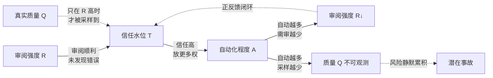

# S03 审阅-信任-自动化飞轮全景

前面的节点把审阅瓶颈拆成零件:压缩率、progressive disclosure、置信度门控、审阅界面。本节点要做的是把这些零件接成一台**会自己加速的机器**,并回答一个 PM 在选型会和事故复盘里都绕不开的问题:**人类审阅 AI 产出、产生信任、于是放更多权给自动化、于是审得更少——这条正反馈回路在什么条件下是"良性飞轮",又在什么条件下变成"刹车失灵的下坡"?** 框架名:review-trust-automation flywheel(审阅-信任-自动化飞轮)。本节的反共识立场是——**几乎所有人都把这条回路当作单调向善的"飞轮"来推,但它本质是一个带正反馈的控制系统;正反馈系统的默认命运不是收敛,而是发散。飞轮转得越顺,刹车越被磨掉,而磨掉刹车的恰恰是飞轮自己产生的"信任"。** 设计的真正命题不是"如何让飞轮转更快",而是"如何在飞轮上装一套不会被飞轮自己关掉的刹车"。

## §0 为什么是"控制系统中的正反馈飞轮",而不是"数据飞轮"或"成熟度阶梯"

读者脑中有两个默认框架,先挡掉。

第一个错误框架是把它等同于 **[p306 - 数据飞轮与反馈回路设计](/kb/产品设计与交互范式/p306-数据飞轮与反馈回路设计/) 的"数据飞轮"**。数据飞轮讲的是"更多用户→更多数据→更好模型→更多用户",它的反馈对象是**模型质量**,而且每一圈都有真实的质量提升作底。本节点的飞轮反馈的不是模型质量,而是**人类的监督强度**:审阅→信任→更多自动化→更少审阅。关键差异在于——数据飞轮每转一圈系统真的变强,而审阅-信任飞轮每转一圈,**系统未必变强,但人对它的警惕一定变弱**。p306 的飞轮里,反馈是质量的放大器;S03 的飞轮里,反馈是**警惕的衰减器**。把后者当前者来推,是这条回路最危险的范畴错误:你以为在积累质量,其实在消耗安全裕度。

第二个错误框架是把它当成一条**线性的"自动化成熟度阶梯"**——从人审到半自动到全自动,一级比一级先进,目标是爬到顶。这正是 [p307 - Copilot 到 Autopilot 光谱](/kb/产品设计与交互范式/p307-copilot-到-autopilot-光谱/) 容易被误读的方式。但飞轮的精髓恰恰是**它不是阶梯,是回路**:你不是"主动选择"往上爬一级,而是被上一圈的信任**推着**往上走,而且越往上,把你推上去的力(信任)越强,能拉你回来的力(审阅警惕)越弱。阶梯隐含"想停就停",回路隐含"停不下来除非你主动装刹车"。本节点用"控制系统"框架而非"成熟度阶梯",是因为只有控制论能讲清"正反馈+延迟+无刹车=发散"这件事——而这恰恰是事故的生成机制。

所以本节点的视角是**控制论的反馈系统分析**:把审阅、信任、自动化当成三个互相调节的状态变量,问这个动力系统的稳定性,而不是问"应该自动化到哪一级"。

## §1 飞轮的四个状态变量与回路结构

把这台机器画清楚,才能谈它什么时候失控。四个状态变量:

- **R(审阅强度)**:单位产出上人类投入的有效审阅注意力(不是"有没有人看",是"看得多认真"——System 2 的投入量)。
- **T(信任水位)**:人对自动通道的主观信任,决定愿意放多少权。
- **A(自动化程度)**:被自动执行、不经实质人审的产出比例。
- **Q(真实质量)**:自动通道产出的客观正确率——注意这是**隐变量**,人不直接观测它,只通过 R 去采样它。

回路结构(用 Mermaid 表达):

核心机制:**R 高时,人能采样到 Q 的真实波动,信任 T 被现实校准;R 低时,T 只能靠"最近没出事"来维持——而"最近没出事"在低审阅强度下既可能是真没事,也可能是没人发现。** 正反馈闭环是:R→T(审着没问题就更信)→A(更信就更放权)→R↓(放权后审得更少)→T(审得少也没发现问题,继续信)。这条环每转一圈,R 单调下降,T 单调上升,A 单调上升,而 Q 脱离观测、自由漂移。

这就是为什么我坚持用"正反馈"而非"飞轮"的乐观措辞:**飞轮一词暗示动能积累是好事,但这里积累的是"未经检验的信任"——一种负债,不是资产。**

## §2 失控的三个发动机:为什么默认命运是发散

正反馈系统不会自动收敛,它需要外加阻尼(刹车)才稳定。这条回路里有三台发动机持续把它往发散推,且三台都有硬实证。

**发动机一:自动化惰性(automation complacency)——系统越可靠,人越不看。** Parasuraman & Manzey 在 *Human Factors* (2010) 的整合性综述确证:对高可靠自动化系统的被动监控,会让错误检出率随时间系统性下降,而且这**在专家与新手身上都出现,训练与指令都无法消除**,根源是多任务下注意力的有限性(bounded cognitive resources),不是懒。他们命名为"learned carelessness":系统长期表现良好后,人会系统性降低监控强度。翻译成飞轮语言:**Q 越高(系统越可靠),R 衰减得越快**——成功本身在拆刹车。

**发动机二:技能退化(deskilling)——审得少,人就接不住了。** Budzyń et al. 在 *Lancet Gastroenterology & Hepatology* (2025) 的真实研究:4 个内镜中心、19 名有经验的医生、1443 例肠镜,发现医生在长期使用 AI 辅助后,**独立(无 AI)执行时的腺瘤检出率从 28.4% 降到 22.4%**,跌约 6 个百分点。机制是长期依赖 AI 提示导致自主检出技能退化。翻译成飞轮语言:**A 越高,人被路由到的样本越少,练习越少,等真正需要人(尾部、OOD)时,人的能力 Q_human 已经下滑**——刹车不只是没踩,刹车片本身在磨薄。

**发动机三:情境意识丧失(out-of-the-loop)——一旦自动通道崩了,人已不在状态。** Endsley & Kiris 在 *Human Factors* (1995) 首次实证 out-of-the-loop 效应:高自动化条件下人的情境意识(SA)显著下降,自动化失效时接管延迟更长、错误率更高。Air France 447(2009)是这条的实际坠机版——自动驾驶在皮托管结冰后断开,长期被动监控的飞行员情境意识崩溃,无法判断飞机姿态。翻译成飞轮语言:**当 Q 真的掉下来(自动通道出错),需要 R 紧急拉满来接管时,人因为长期处在回路外,根本拉不起来。** 刹车在最需要的瞬间发现已经锈死。

三台发动机有一个共同结构:**它们都把"飞轮转得顺"(高可靠、高自动化、长期无事)当作燃料,转化成"刹车失效"。** 这是正反馈最阴险的地方——回路用自己的成功喂养自己的脆弱。我把它叫做"成功的诅咒":一个从不出事的自动化系统,正在为一次出大事做准备。

## §3 飞轮也有良性形态:刹车在什么条件下成立

不能只讲失控——那会滑成 hype 的镜像(技术恐慌)。这条回路存在**良性运转的真实条件**,刹车并非不可能,只是不会自动出现。良性飞轮需要四个外加的负反馈(阻尼)同时在场:

| 刹车机制 | 它阻断哪条发散路径 | 实证/工程锚点 |
|---|---|---|
| **强制抽样人审**(即使 AI 高置信也定期抽 X% 送人) | 阻断 R→0,维持 Q 的持续采样与人的情境意识 | 对抗 Endsley OOL;[p306 - 数据飞轮与反馈回路设计](/kb/产品设计与交互范式/p306-数据飞轮与反馈回路设计/) 的反馈采样 |
| **漂移监测 + 阈值重标定** | 阻断 A 在 Q 下滑时仍单调上升 | 对抗 §4 的固定阈值失效;门控重标定见 [A04 Confidence-gated 自动执行](/kb/专题-评测与度量/a04-confidence-gated-自动执行/) |
| **刻意保留人工练习**(routing 时给人留"够练手"的样本) | 阻断 deskilling,维持 Q_human | 对抗 Budzyń 肠镜 deskilling |
| **独立真值锚**(holdout 上测 Q,不靠"最近没出事") | 阻断 T 靠幻觉性安全感维持 | 对抗 §2 发动机一;呼应 [c14 - 模型评估体系与 Goodhart 陷阱](/kb/基础知识库/c14-模型评估体系与-goodhart-陷阱/) |

判断飞轮良性还是恶性,有一个**单一诊断指标**:**信任 T 是被独立观测的 Q 校准的,还是被"最近没出事"校准的?** 前者是良性(信任有真值锚,飞轮加速的是质量),后者是恶性(信任是负债的累积,飞轮加速的是风险)。这与 [p305 - 信任架构与可解释性设计](/kb/产品设计与交互范式/p305-信任架构与可解释性设计/) 的核心命题同源——信任要"校准而非最大化"——但 S03 升高了一层:p305 谈单次交互里如何校准用户信任,S03 谈**信任在时间维度上的动力学**,以及为什么在飞轮结构里,信任会系统性地脱锚。

## §4 判断主轴:90% 的人在审阅-信任飞轮上会搞错的四件事

这一节是本节点的命门,每条给"症状 → 为什么会错 → 正确做法 → 真实反例"。

**错位一:把"飞轮加速"当成纯粹的好消息(进步主义叙事陷阱)。**
- 症状:团队报喜"自动化率从 30% 升到 70%,人均审阅量下降一半,效率翻倍",当作里程碑庆祝。
- 为什么会错:这组数字在恶性飞轮里和良性飞轮里**长得一模一样**——R↓、A↑ 是两种命运的共同前半段。区别只在隐变量 Q 是否还被采样。把 A↑/R↓ 当胜利,等于把"刹车被磨掉"误读成"车开得更快"。
- 正确做法:任何自动化率提升的汇报,必须同时报"独立真值锚上的 Q 是否稳定"和"强制抽样人审的覆盖是否守住"。没有这两个伴随指标,自动化率上升是中性信号甚至是危险信号,不是成就。
- 真实反例:学术同行评审。De Vaan & Stuart(*Science* 2025)发现 AI 令论文产出提升 50%+(部分领域亚洲机构 +90%),评审系统"极难跟上";同时 ICLR 2025 约 20% 评审意见疑为 AI 生成(arXiv 2025)。产出与"评审吞吐"双双飙升,看似飞轮加速,实则审阅这一端正被 AI 反向灌满、真值采样塌陷——加速的是空转。

**错位二:相信"加一道人工确认"就给飞轮装上了刹车。**
- 症状:合规要求 high-risk 决策"有人在环",于是在自动流程末端加确认按钮,认为刹车已就位。
- 为什么会错:Sele & Chugunova 在 *PLoS ONE* (2024) 的实验("Putting a human in the loop")发现,加入人工监督后算法建议**接受率反升 7 个百分点,准确率反降**(误差从 17.4 升到 18.0 个百分位),人类监督者"未能充当紧急制动器"。一道被自动化惰性侵蚀的人审,消耗带宽却不产生制动力——它是**装饰性刹车**,踩下去没有摩擦。
- 正确做法:刹车的有效性不看"有没有人在环",看"这个人是否真在做 System 2"。HITL 断点必须逼出独立判断:不预填 AI 答案、强制给出反向证据、对"接受"设阻力(见 [A02 审阅 验证 橡皮图章辨析](/kb/专题-评测与度量/a02-审阅-验证-橡皮图章辨析/))。装饰性确认应直接砍掉——它比没有更糟,因为它制造"已有刹车"的假象。
- 真实反例:Boeing 737 MAX 的 MCAS——飞行员"在环",但系统设计未被告知、多警报下认知过载,人在环却无法制动;监管侧又对波音自评数据存在 rubber-stamping(见 NTSB 对认知负荷的批评)。两层人在环,两层装饰性刹车。

**错位三:用固定的自动化策略,假设飞轮会停在你设定的那一格。**
- 症状:上线时定好"高置信自动、低置信人审"的阈值,然后认为系统会稳定在这个配置。
- 为什么会错:飞轮是动态的——automation complacency(发动机一)会让人**在阈值不变的情况下**,实际审阅强度持续下滑;同时分布漂移会让"高置信"逐渐名不副实(见 [A04 Confidence-gated 自动执行](/kb/专题-评测与度量/a04-confidence-gated-自动执行/) §3:Doku 2026 在 contextual drift 下门控 AUC 从 0.71 掉到 0.61)。你设的是静态阈值,运转的是动态系统,二者会越走越远。
- 正确做法:把飞轮当成需要**持续运维的控制回路**,不是一次性配置。监测 R 的真实衰减(而非名义阈值)、监测 Q 的漂移、周期性重标定、设"自动降级"触发器(纠错率/撤销率超阈值就强制拉回更多人审)。呼应 [p307 - Copilot 到 Autopilot 光谱](/kb/产品设计与交互范式/p307-copilot-到-autopilot-光谱/) 的动态升降级,但 S03 强调:升降级必须由**真值信号**驱动,不能由"用户没投诉"这种沉默驱动——沉默在低审阅强度下不是好消息。
- 真实反例:Perplexity 官方称 94% 引用准确率、3–5% 幻觉率,而 CJR/Tow Center(2025)1600 次查询实测错误率 37%(Pro 版反而 45%)。一个"上线时测得很好"的置信信号,在真实分布下严重失真;若据此设固定自动化策略,飞轮会带着失真的信任一路滑下去。

**错位四:把飞轮的失控当作个体的"不够认真",而非系统的结构性产物。**
- 症状:出事后归因"审阅的人不负责任""应该更仔细"——上一道更严的 KPI、再培训一轮。
- 为什么会错:Parasuraman & Manzey(2010)的核心结论恰恰是 automation bias/complacency **训练无法消除**,它是注意力有限性的结构特征,不是态度问题。把结构性失效归咎于个体,等于在已经磨光的刹车片上贴一张"请认真刹车"的标语。
- 正确做法:从设计层面装刹车(§3 的四个负反馈),而非从道德层面要求人对抗自己的认知结构。这也是监管的盲区所在——Laux & Ruschemeier(*European Journal of Risk Regulation* 2025,arXiv 2502.10036)批评 EU AI Act 第 14 条只要求提供商让用户"知道有自动化偏见",却不要求从设计上消除它,把"知道有风险"与"实际减轻风险"混同。
- 真实反例:Wilson, Caliskan et al.(2025,AAAI/ACM AIES)的招聘实验——严重偏见条件下 90% 的人类决策追随 AI 偏好,即便参与者口头表示不信任 AI。这不是 528 名参与者集体不认真,这是飞轮结构在每个人身上的复现。

## §5 产品 PM 视角补盲:飞轮不只是技术回路,是组织与商业的回路

工程视角谈状态变量与阻尼,产品视角必须补三个"看走眼"的点。

**组织心理:飞轮的转速由"谁为错误买单"决定,而非由技术能力决定。** 当自动化把错误率从 5% 降到 1%,但把剩下 1% 的错误从"分散在许多人的小错"变成"集中爆发的大错"时,组织对风险的感知会失真——日常顺畅强化了"系统很可靠"的集体信念,而罕见大错被归为"意外"。PM 要警惕:**飞轮在组织层面制造的不是更高质量,而是更强的"质量幻觉",直到一次尾部事件把幻觉击穿。** 这正是 [A06 自动化偏见与审阅疲劳](/kb/专题-评测与度量/a06-自动化偏见与审阅疲劳/) 在组织尺度的放大。

**商业模式:自动化率是利润与风险的隐藏旋钮,且这个旋钮有棘轮效应。** 自动化率上去容易,降回来极难——一旦人力按"高自动化"配置裁过、技能按"少审阅"退化过,想紧急拉回人审时,既没有足够的人,也没有还会审的人(deskilling 的商业代价)。PM 在设定自动化战略时必须意识到:**这不是可逆的旋钮,是棘轮。** 把阈值偷偷调高省成本,等于在未来积累一笔不可快速偿还的安全负债。

**合规与举证:飞轮失控时,"我们有 HITL"不是免责,反而可能是举证不利。** 当事故发生,监管和诉讼会问的不是"有没有人在环",而是"那个人在环是否有实质制动能力"。一个被证明是 rubber-stamping 的 HITL(参照 Sele & Chugunova 的实证),在举证上可能比"诚实地标注全自动、用户自担风险"更糟——它构成了"明知有风险却用装饰性监督掩盖"的痕迹。PM 设计审批留痕时,要让"人审是否真的改变了决策"可被审计,而不只是"人审发生过"。

## §6 对手框架回应:接受"飞轮能良性运转",标注它的边界与赌注

**对手立场一(业界自动化乐观派,如多数 AI 工具厂商与效率咨询):"飞轮就是生产力革命,自动化率上升、人审下降正是价值兑现,警惕过头会错失红利。"**
接受:在分布稳定、错误成本低、有强真值反馈的场景(成熟 OCR、模板化表单、低风险内容推荐),飞轮确实是良性的——自动化率上升伴随真实质量稳定,人审带宽被解放去做更高杠杆的事,这是真红利。边界与赌注:**这类场景的共同特征是 Q 持续可观测且错误可逆。** 我赌的是,对高风险、分布漂移、错误不可逆的产品(医疗、金融、安全、招聘),飞轮的默认命运是发散而非收敛;红利是真的,但它专属于"装好了刹车"的飞轮,而绝大多数团队只推飞轮、不装刹车。

**对手立场二(Rick 未读的对手框架——Charles Perrow 的"正常事故理论"(Normal Accidents, 1984)):"在紧耦合 + 高复杂的系统里,事故不是异常而是系统的'正常'产物,加更多自动化监控只会增加复杂度、制造新的失效路径。"**
这是我未充分纳入的强反方。Perrow 研究三哩岛核事故后提出:当系统同时具备**紧耦合**(一处故障快速传播、无缓冲)和**交互复杂**(故障组合无法预先穷举)时,灾难性事故在统计上不可避免,且**增加安全装置往往增加复杂度,反而催生新的、更难预料的失效模式**。接受:这直接挑战了我 §3 "加四个负反馈刹车"的方案——刹车本身也是系统组件,也会失效、也会被绕过、也增加交互复杂度。边界与回应:我承认刹车不是免费的、不是万能的,这把它作为 failure scenario 显式承担(见下)。但 Perrow 的结论是"某些系统复杂到不该自动化",我的边界是——对**可解耦**的系统(能把紧耦合改造成松耦合、给故障传播加缓冲的),装刹车仍优于不装;对**真正紧耦合不可解耦**的高风险系统,Perrow 是对的,正确答案可能是降低自动化程度本身,而非给高自动化加更多监控。这条修正了我"刹车总是更好"的乐观。

**对手立场三(Rick 未读的对手框架二——James Reason 的"瑞士奶酪模型"与"潜在失效"(latent failures)):"事故是多层防御的孔洞偶然对齐的结果;飞轮的危险在于它让多层防御的孔洞同步扩大。"**
接受:Reason 的潜在失效概念精确命名了 §2 的"风险静默累积"——飞轮让每一层防御(人审是其中一层)的孔洞悄悄变大,平时不显现,直到某次孔洞对齐酿成事故。这强化而非反驳我的论点。边界:Reason 也提醒,**单加一层防御(再加一道人审)若与已有层同质,孔洞会对齐**——这印证了 §4 错位二(装饰性人审无效),刹车必须是**异质**的负反馈(抽样人审 + 真值锚 + 漂移监测三者机制不同),不能是三道一样的人工确认。

## §7 跨域呼应:控制论的"正反馈发散"与 Beer 的可生存系统模型(VSM)

调度**控制论(cybernetics)** 的核心区分——负反馈稳定、正反馈发散——以及 Stafford Beer 的**可生存系统模型(Viable System Model, VSM)**。控制论自 Wiener(1948)起就确立一条铁律:**一个只有正反馈、没有负反馈阻尼的回路,数学上的命运是指数发散或振荡失稳,不是稳态。** 审阅-信任-自动化回路的全部危险,可以一句话浓缩为:**业界把它当数据飞轮(以为是良性正反馈)来推,却忘了正反馈本身没有稳态——它需要外加的负反馈才不爆炸。**

这如何改变技术判断?它把"要不要装刹车"从一个**可选的安全增强**,变成一个**系统稳定性的数学必要条件**:不是"装了更安全",而是"不装必然失稳"。这是比"best practice"强得多的论断。Beer 的 VSM 进一步给出刹车的结构要求:一个可生存的系统必须有专门的、与执行单元**分离**的监控与稳态调节子系统(System 3*、监督通道),且这套监控不能被它所监控的执行单元收编。映射到飞轮:**审阅/真值监测必须是一个组织上独立于"追求自动化率"的执行团队的子系统**,否则它会被飞轮自己的激励收编——追求自动化率的人不会真心维护拖慢自动化的刹车。这正是为什么 §4 错位一里"自动化率汇报"会系统性地隐藏 Q——汇报者和被监控者是同一拨人。链入 0117社会学 与 0114认识论:这也是 [c14 - 模型评估体系与 Goodhart 陷阱](/kb/基础知识库/c14-模型评估体系与-goodhart-陷阱/) 的 Goodhart 定律在组织层面的形态——当自动化率成为被优化的目标,维护真值锚的动力就被结构性地抽空。

## §8 PM 决策启示:面试 / 选型 / 复现

**面试怎么用:** 当被问"如何看待 AI 让团队效率大幅提升、人审越来越少",不要附和"这是好事"。答:"我会先判断这是良性飞轮还是失控回路——单一诊断指标是信任由独立真值锚校准还是由'最近没出事'校准。审阅-信任-自动化是个正反馈系统,正反馈的默认命运是发散不是收敛(控制论);automation complacency、deskilling、out-of-the-loop 三台发动机会用飞轮的成功喂养它的脆弱(Parasuraman 2010、Budzyń 2025、Endsley 1995)。所以我的设计命题不是让飞轮转更快,而是装四道异质刹车,且刹车的监控子系统必须组织上独立于追求自动化率的团队。" 这一串能把你和"知道 HITL 这个词"的候选人在 30 秒内区分开。

**选型怎么用:** 评估一个 AI 平台/方案时,问三个飞轮问题:(1)它的信任有没有独立真值锚,还是只看"没人投诉"?(2)它支不支持强制抽样人审(即使高置信也定期抽样),还是高置信就彻底跳过?(3)它的监控/审计能力是否独立于其"自动化率"的优化目标?三问全过的方案极少——大多数工具只优化飞轮转速,不提供刹车。

**复现怎么用:** 给自己的 AI 产品装飞轮刹车的最小四步——(a)定义并持续观测隐变量 Q(holdout 真值锚),把它和自动化率放在同一张仪表盘;(b)强制抽样人审,即使 AI 高置信也抽 X% 送独立判断,维持采样与情境意识;(c)给 routing 刻意保留人工练习样本,对抗 deskilling;(d)设自动降级触发器(纠错率/撤销率/漂移超阈值→强制拉回更多人审),并把维护刹车的人与追自动化率的人在组织上分开。

## §9 与已有节点的关系

- 对 [p306 - 数据飞轮与反馈回路设计](/kb/产品设计与交互范式/p306-数据飞轮与反馈回路设计/) 的**对话与纠偏**:p306 讲数据飞轮(反馈对象是模型质量,每圈真变强),S03 揭示一条**结构相似但命运相反**的飞轮——反馈对象是人类警惕(每圈警惕变弱、风险累积)。S03 警告:把审阅-信任飞轮当数据飞轮来推,是把"风险负债"误读成"质量资产"。不复述 p306 的数据飞轮机制。
- 对 [p305 - 信任架构与可解释性设计](/kb/产品设计与交互范式/p305-信任架构与可解释性设计/) 的**升维**:p305 谈单次交互里信任要"校准而非最大化",S03 把它推进到**时间维度的信任动力学**——为什么在飞轮结构里信任会系统性脱锚,以及"信任积累缓慢、崩塌迅速"的不对称如何在飞轮里被正反馈放大。不复述 p305 的信任曲线。
- 对 [p307 - Copilot 到 Autopilot 光谱](/kb/产品设计与交互范式/p307-copilot-到-autopilot-光谱/) 的**机制补全**:p307 给了 L0–L4 的静态光谱与"自动化悖论",S03 补上"产品为什么会**沿光谱被推着上移**"的动力学,以及"升降级必须由真值信号而非沉默驱动"的约束。
- 对 [A04 Confidence-gated 自动执行](/kb/专题-评测与度量/a04-confidence-gated-自动执行/) 与 [A06 自动化偏见与审阅疲劳](/kb/专题-评测与度量/a06-自动化偏见与审阅疲劳/) 的**整合**:A04 给单次路由的门控机制,A06 给个体的偏见与疲劳,S03 把它们接成系统级的时间回路——门控的固定阈值失效(A04 §3)与个体偏见(A06)正是飞轮发散的微观引擎。

## §10 关联节点

**核心(必读)**
- [p306 - 数据飞轮与反馈回路设计](/kb/产品设计与交互范式/p306-数据飞轮与反馈回路设计/)
- [p305 - 信任架构与可解释性设计](/kb/产品设计与交互范式/p305-信任架构与可解释性设计/)
- [p307 - Copilot 到 Autopilot 光谱](/kb/产品设计与交互范式/p307-copilot-到-autopilot-光谱/)
- [A04 Confidence-gated 自动执行](/kb/专题-评测与度量/a04-confidence-gated-自动执行/)
- [A06 自动化偏见与审阅疲劳](/kb/专题-评测与度量/a06-自动化偏见与审阅疲劳/)
- [c14 - 模型评估体系与 Goodhart 陷阱](/kb/基础知识库/c14-模型评估体系与-goodhart-陷阱/)
- 0117社会学

**延伸(可选)**
- [A02 审阅 验证 橡皮图章辨析](/kb/专题-评测与度量/a02-审阅-验证-橡皮图章辨析/)
- [c13 - 幻觉的不可消除性](/kb/基础知识库/c13-幻觉的不可消除性/)
- [p304 - 防御性 UX：对抗延迟与幻觉](/kb/产品设计与交互范式/p304-防御性-ux-对抗延迟与幻觉/)
- 0114认识论
- [幻觉](/kb/基础知识库/幻觉/)
- [Agent](/kb/基础知识库/agent/)
- [Claude Code](/kb/ai-公司与产品/claude-code/)
- [m207 - Agent 产品化：场景推演与失败模式](/kb/工程化与落地架构/m207-agent-产品化-场景推演与失败模式/)
- [AI PM 知识图谱·总索引](/kb/ai-pm-知识图谱/ai-pm-知识图谱-总索引/)

## 修订日志
- R0 (2026-06-07): 首稿。建立"审阅-信任-自动化"四状态变量(R/T/A/Q)正反馈回路模型(§1);三台失控发动机(complacency/deskilling/OOL,§2)与四道异质刹车(§3);单一诊断指标"信任由真值锚还是由'没出事'校准";四错位判断主轴(§4);接入 Sele & Chugunova 2024(装饰性人审)、Perrow 正常事故理论与 Reason 瑞士奶酪模型两个未读对手框架(§6);跨域调度控制论正反馈发散 + Beer VSM(监控子系统须独立于执行单元)→ Goodhart(§7);对照升级 p306/p305/p307,整合 A04/A06。待 grounding pass 复核:Budzyń 肠镜 28.4%→22.4%、Sele & Chugunova 误差 17.4→18.0、De Vaan & Stuart 50%+、Perrow/Reason 年份与论点表述。
